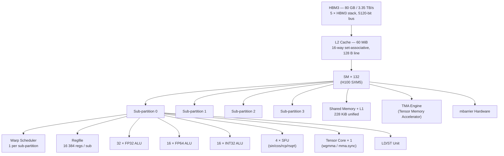
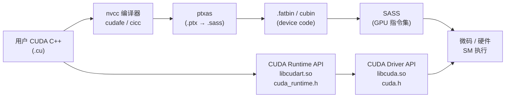

# 00 · 全景索引 + Hopper SM90 架构图

> **本教程覆盖 NVIDIA Hopper SM90 微架构与 CUDA 12 软件栈的 22 个核心主题,面向有 C/C++ 基础、想深入理解 GPU 硬件与编程模型的工程师与研究者。**

## 1. 是什么 / 为什么有它

这套教程的目标是填补官方文档与实际调优经验之间的空白。NVIDIA 官方文档(CUDA C++ Programming Guide、PTX ISA、Hopper Architecture Whitepaper)覆盖全面但分散,跨文档阅读成本高,初学者常常在各章节之间来回跳转,难以建立整体认知框架。本教程以 Hopper H100 SM90 微架构为主线,从硬件视角出发,将每一个软件概念与底层的寄存器堆、执行单元、缓存拓扑一一对应,帮助读者建立"代码 ↔ 硬件"的直觉。

写作原则如下:每章独立可读,前置概念在章内用一句话回顾;所有代码示例使用真实 PTX 或 CUDA C++ 写法,可对照官方 sample 验证;数字必须有来源(标注 Hopper Whitepaper 页码或 Programming Guide 章节号);不做友商对比,不使用营销语言。

**目标读者:** 具备 C/C++ 基础,了解基本的 GPU 编程概念(线程、block、kernel),希望深入理解 NVIDIA GPU 硬件行为、写出高性能 CUDA 代码,或需要阅读 PTX/SASS 汇编的工程师与研究者。不要求事先了解 Hopper 具体架构——每章会在§2(硬件视角)中提供必要的微架构背景。

**两条阅读路径:**

- **按硬件层级(自底向上):** 02 SM 内部结构 → 01 SIMT 执行模型 → 03 共享内存+L1 → 04 L2 缓存 → 05 HBM3 全局内存 → 07 Tensor Core → 08 wgmma → 09 TMA → 10 mbarrier → 11 Cluster → 14 NVLink。适合希望先理解硬件再学 API 的读者。
- **按软件抽象层(自顶向下):** 01 SIMT → 12 CTA 调度 → 13 Streams → 16 CUDA Graphs → 17 持久化 → 18 内存分配器 → 19 统一内存 → 20 Driver API → 21 Profiling → 22 PTX→SASS 编译链。适合已有 CUDA 使用经验、希望系统化提升调优能力的读者。

**3. 训练 / 推理实战路径(读完任何基础后)**

熟悉硬件层级 / 软件抽象层任一路径后,直接读 [23 模型训练全栈串联](23-training-end-to-end.md) 与 [24 模型推理全栈串联](24-inference-end-to-end.md) 看一次 step 如何调度前 22 章的全部组件,以及训练 / 推理两侧的优化方法体系。

每章独立可读,章内的前置概念用一句话回顾。读者可依据需求选取单章深读。全套教程仅覆盖 Hopper SM90 及 CUDA 12,不回顾 Pascal/Volta/Turing/Ampere 的历史细节,必要时会在 Tensor Core 演进等处简要提及。

## 2. 硬件视角(微架构细节)

Hopper H100 SXM5 规格概览(Hopper Architecture Whitepaper, 2022):132 个 SM,每 SM 4 个 sub-partition,共 16896 个 FP32 CUDA Core,60 MiB L2 缓存,80 GB HBM3 显存,标称带宽 3.35 TB/s(实测峰值在部分测试场景下接近此值,实际随访问模式而变化)。PCIe 版 H100 搭载 114 个 SM,其余规格基本相同。

相较于上一代 Ampere A100(108 SM,40/80 GB HBM2e,2 TB/s 带宽,40 MiB L2),Hopper 在以下维度有显著提升:L2 从 40 MiB 增至 60 MiB;引入 TMA(Tensor Memory Accelerator)支持异步多维张量搬运;新增 Thread Block Cluster(CGA)允许同一 GPC 内的最多 16 个 CTA 相互访问 SMEM(DSMEM);wgmma 指令将矩阵乘法粒度从单 warp(32 线程)扩展至 warp-group(128 线程),配合 mbarrier 异步完成通知构成 pingpong pipeline 的基础。



每个 sub-partition 拥有独立的 warp scheduler 和寄存器堆切片(65536 regs/SM 均分 4 份 = 16384 regs/sub)。Tensor Core 每 sub-partition 一个,支持 wgmma(warp-group MMA,需要 4 个 sub-partition 协同)和传统 mma.sync。TMA(Tensor Memory Accelerator)是 Hopper 新增的异步数据搬运引擎,可在不占用 warp 执行资源的情况下完成多维张量的 DMA 传输。

## 3. CUDA 编程接口

CUDA 软件栈从用户代码到硬件微码分为若干层次,不同层各有 API 入口:



- **CUDA C++ Runtime API** (`cuda_runtime.h`): 高层接口,自动管理 context;函数以 `cuda` 开头(`cudaMalloc`、`cudaLaunchKernel`、`cudaStreamCreate`)。
- **CUDA Driver API** (`cuda.h`): 低层接口,手动管理 context 与 module;函数以 `cu` 开头(`cuMemAlloc`、`cuLaunchKernel`、`cuModuleLoad`);适合动态加载 cubin、JIT 编译等场景。
- **PTX(Parallel Thread eXecution)**: 虚拟指令集,ptxas 将其编译到具体架构 SASS;`ptxas -arch=sm_90a` 启用 Hopper 全特性(含 wgmma、TMA);`sm_90`(无 `a`)不含 Hopper 独占指令。
- **SASS**: 最终硬件指令集,`cuobjdump --dump-sass` 可查看。

## 4. 关键性能指标

H100 SXM5 峰值规格(Hopper Architecture Whitepaper + NVIDIA H100 Datasheet):

| 指标 | H100 SXM5 |
|---|---|
| FP32 峰值算力 | 67 TFLOPS |
| FP16 / BF16 Tensor Core(稀疏) | 3958 TOPS |
| FP8 Tensor Core(稀疏) | 3958 TOPS × 2 ≈ 7916 TOPS |
| FP64 峰值算力 | 33.5 TFLOPS |
| HBM3 带宽 | 3.35 TB/s |
| NVLink 4 总带宽(双向) | 900 GB/s |
| L2 缓存容量 | 60 MiB |
| SM 数量 | 132 |

Roofline 模型是分析瓶颈的常用框架:计算强度(FLOP/Byte)低于屋檐斜率时受内存带宽限制,高于时受算力限制。对 GEMM 等矩阵运算,在 Hopper 上计算强度通常远高于屋檐斜率,因此 Tensor Core 利用率是关键指标;对 elementwise 或 gather/scatter 操作,内存带宽往往是瓶颈。

性能调优的核心思路:先用 NSight Compute 确认瓶颈在算力侧还是内存带宽侧,再对症下药。计算密集型场景关注 Tensor Core 利用率(`sm__inst_executed_pipe_tensor_op_hmma.avg.pct_of_peak_sustained_active`)与 warp occupancy;内存带宽密集型场景关注 L2/HBM3 的 sector 命中率(`l1tex__t_sector_hit_rate`)和 coalescing 效率(`l1tex__average_t_sectors_per_request`)。

## 5. 代码示例

以下是一个最简 CUDA C++ kernel 启动示例,展示 host 侧资源管理与 device 侧 kernel 定义的对应关系:

```cpp
// hello_gpu.cu  —  最简 CUDA 示例
#include <cstdio>
#include <cuda_runtime.h>

// device 侧:__global__ 标记 kernel,在 GPU 上执行
__global__ void hello_kernel(int n, float *d_out) {
    int tid = blockIdx.x * blockDim.x + threadIdx.x;
    if (tid < n) {
        d_out[tid] = static_cast<float>(tid) * 2.0f;
    }
}

int main() {
    const int N = 1024;

    // 分配 GPU 显存
    float *d_out = nullptr;
    cudaMalloc(&d_out, N * sizeof(float));

    // 启动 kernel:<<<grid, block>>>
    // 32 threads/block,共 32 个 block → 1024 threads total
    hello_kernel<<<32, 32>>>(N, d_out);

    // 等待 GPU 完成,捕获异步错误
    cudaDeviceSynchronize();

    // 释放显存
    cudaFree(d_out);
    return 0;
}
```

编译命令:

```bash
nvcc -arch=sm_90a -O3 -o hello_gpu hello_gpu.cu
```

`-arch=sm_90a` 告知 ptxas 生成 Hopper 全特性 SASS;`-O3` 启用 nvcc 优化。对于需要 Driver API 的场景,将 `cudaMalloc` 替换为 `cuMemAlloc`,将 `<<<>>>` 替换为 `cuLaunchKernel`。

## 6. 实测手段

**NSight Systems(系统级时间线):**

```bash
# 生成 .nsys-rep 报告,同时捕获 CUDA 与 NVTX 事件
nsys profile -t cuda,nvtx --output report ./hello_gpu

# 查看摘要
nsys stats report.nsys-rep
```

NSight Systems 适合宏观观察:kernel 之间的间隔、H2D/D2H 传输与 kernel 的重叠比例、NVTX 标注的业务阶段、CPU 线程与 GPU 流的同步点。生成的 `.nsys-rep` 文件可用 GUI 打开查看瀑布图,也可用命令行 `nsys stats` 导出 CSV 摘要。

**NSight Compute(kernel 级指标):**

```bash
# 采集所有指标(耗时较长)
ncu --set full -o report ./hello_gpu

# 指定 kernel 名,只采集特定 section 以加速
ncu --kernel-name hello_kernel --section SpeedOfLight ./hello_gpu
```

NSight Compute 的 "Speed of Light" 总结页面直接给出计算利用率与内存带宽利用率两个百分比,是判断瓶颈的第一入口。详细 metric 参见第 21 章。

**nvidia-smi 常用查询:**

```bash
nvidia-smi -q -d MEMORY          # 显存总量与已用量
nvidia-smi dmon -s u             # 实时 GPU 利用率(1 秒刷新)
nvidia-smi -q -d CLOCK           # 当前时钟频率
nvidia-smi --query-gpu=pcie.link.gen.current,pcie.link.width.current --format=csv
                                  # PCIe 链路状态
```

## 7. 常见反模式

1. **跳过 profiling 直接凭经验调优** — 不同 kernel 的瓶颈可能截然不同:有些卡在内存带宽,有些卡在 Tensor Core 利用率,有些卡在 warp divergence。不先 profile 就下手,往往南辕北辙,优化了不是瓶颈的地方。

2. **假设默认 occupancy 就是最优** — 高 occupancy 不等于高性能。寄存器压力过大会降低 occupancy,但适当减少 occupancy 有时反而因寄存器复用减少 spill 而提升性能。需结合 NSight Compute 的 `launch__registers_per_thread` 和 `sm__warps_active` 综合判断。

3. **忽略 warp divergence** — 在同一 warp 的 32 个 lane 走不同代码路径时,GPU 需要分多次执行。if-else 里的数据相关分支(如按索引取不同分支)在密集计算场景下可能让吞吐减半。

4. **默认 cudaMemcpy 是同步的,就不显式同步** — `cudaMemcpyAsync` + stream 组合才能让数据传输与 kernel 重叠。即便使用同步 `cudaMemcpy`,其后的 `cudaDeviceSynchronize` 也应检查返回值以捕获异步错误。

5. **在 host-device 混合代码里忽略对齐要求** — Tensor Core 操作对矩阵的行/列维度有严格对齐要求(如 m16n8k16 要求矩阵 A 的 K 维度为 16 的倍数);TMA 描述符要求基地址 16 字节对齐;wgmma 要求 SMEM 张量按特定 swizzle 模式排列。忽略对齐会导致运行时非法内存访问或静默计算错误,且不容易通过功能测试发现。

6. **将 NSight Systems 时间线误读为性能指标** — 时间线显示某 kernel 运行了 10 ms,并不代表它的效率高。kernel 可能大部分时间在等待内存请求返回而 SM 处于空闲。真正的效率数字需要从 NSight Compute 的 metric 中读取。

## 8. 延伸阅读

### 本教程章节索引

| 章节 | 文件 | 简介 |
|---|---|---|
| [01 · SIMT 执行模型](01-simt-execution.md) | `01-simt-execution.md` | warp 调度、谓词执行、Independent Thread Scheduling、分支代价 |
| [02 · SM 内部结构](02-sm-internals.md) | `02-sm-internals.md` | 4 sub-partition、functional units、寄存器堆、scoreboard |
| [03 · 共享内存 + L1](03-smem-and-l1.md) | `03-smem-and-l1.md` | 228 KiB unified SMEM/L1、bank conflict、双缓冲 |
| [04 · L2 缓存 + set-aside](04-l2-cache-and-setaside.md) | `04-l2-cache-and-setaside.md` | 60 MiB L2、persistence、set-aside per stream |
| [05 · HBM3 + 全局内存](05-hbm3-and-gmem.md) | `05-hbm3-and-gmem.md` | 3.35 TB/s 带宽、coalescing、sector 利用率 |
| [06 · 原子操作](06-atomics.md) | `06-atomics.md` | global/shared atomic、red.async、争用反模式 |
| [07 · Tensor Core](07-tensor-core.md) | `07-tensor-core.md` | FP16/BF16/TF32/FP8、mma.sync、演进历史 |
| [08 · wgmma 异步矩阵乘](08-wgmma-async-matmul.md) | `08-wgmma-async-matmul.md` | warp-group MMA、wgmma.mma_async、pipeline 模式 |
| [09 · TMA](09-tma.md) | `09-tma.md` | 张量内存加速器、cp.async.bulk、CUtensorMap 描述符 |
| [10 · mbarrier 异步屏障](10-mbarrier.md) | `10-mbarrier.md` | 64-bit SMEM 屏障对象、phase 翻转模型、TMA 完成通知 |
| [11 · Thread Block Cluster](11-thread-block-cluster.md) | `11-thread-block-cluster.md` | SM90 Cluster(CGA)、DSMEM 跨 CTA 访问、cluster barrier |
| [12 · CTA 调度 + GigaThread](12-cta-scheduling-gigathread.md) | `12-cta-scheduling-gigathread.md` | GigaThread 引擎、occupancy 公式、launch_bounds 调优 |
| [13 · CUDA Streams + Events](13-streams-and-events.md) | `13-streams-and-events.md` | 默认流 vs 显式流、事件同步、L2 set-aside per stream |
| [14 · NVLink + NVSwitch](14-nvlink-nvswitch.md) | `14-nvlink-nvswitch.md` | NVLink 4 (900 GB/s)、NVSwitch 3、P2P 访问 |
| [15 · NCCL 集合通信](15-nccl-collectives.md) | `15-nccl-collectives.md` | AllReduce/ReduceScatter/AllGather、带宽模型 |
| [16 · CUDA Graphs](16-cuda-graphs.md) | `16-cuda-graphs.md` | 显式构造 vs Stream Capture、Graph update |
| [17 · Persistent + Dynamic Parallelism](17-persistent-and-dynamic-parallelism.md) | `17-persistent-and-dynamic-parallelism.md` | grid-stride 持久化 kernel、Dynamic Parallelism 2.0 |
| [18 · Stream-ordered Allocator](18-stream-ordered-allocator.md) | `18-stream-ordered-allocator.md` | cudaMallocAsync、MemPool、PyTorch caching allocator |
| [19 · Unified Memory](19-unified-memory.md) | `19-unified-memory.md` | cudaMallocManaged、页面迁移、Prefetch/Advise |
| [20 · CUDA Driver API](20-cuda-driver-api.md) | `20-cuda-driver-api.md` | context 模型、Module 加载、cuLaunchKernel |
| [21 · Profiling 工具栈](21-profiling-toolchain.md) | `21-profiling-toolchain.md` | NSight Systems/Compute、CUPTI、NVTX 工作流 |
| [22 · PTX → SASS 编译链](22-ptx-to-sass.md) | `22-ptx-to-sass.md` | nvcc pipeline、ptxas flags、cuobjdump、JIT |
| [23](23-training-end-to-end.md) | 模型训练全栈串联 | training step 端到端 + 优化方法体系 |
| [24](24-inference-end-to-end.md) | 模型推理全栈串联 | prefill/decode 端到端 + 优化方法体系 |

### 官方文档参考

- **CUDA C++ Programming Guide** — [https://docs.nvidia.com/cuda/cuda-c-programming-guide/](https://docs.nvidia.com/cuda/cuda-c-programming-guide/)
- **PTX ISA Reference Manual** — [https://docs.nvidia.com/cuda/parallel-thread-execution/](https://docs.nvidia.com/cuda/parallel-thread-execution/)
- **Hopper Architecture Whitepaper** — [https://resources.nvidia.com/en-us-tensor-core/gtc22-whitepaper-hopper](https://resources.nvidia.com/en-us-tensor-core/gtc22-whitepaper-hopper)
- **NSight Compute 文档** — [https://docs.nvidia.com/nsight-compute/](https://docs.nvidia.com/nsight-compute/)
- **NSight Systems 文档** — [https://docs.nvidia.com/nsight-systems/](https://docs.nvidia.com/nsight-systems/)
- **CUDA Samples(GitHub)** — [https://github.com/NVIDIA/cuda-samples](https://github.com/NVIDIA/cuda-samples)
