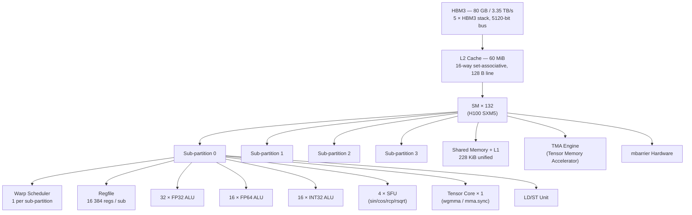
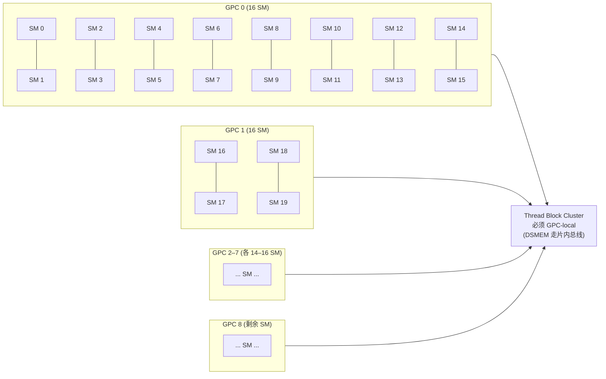
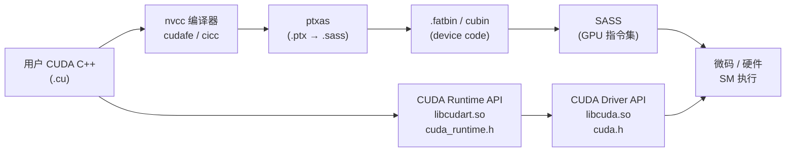

# 00 · 全景索引 + Hopper SM90 架构图

> **本教程覆盖 NVIDIA Hopper SM90 微架构与 CUDA 12 软件栈的 22 个核心主题,面向有 C/C++ 基础、想深入理解 GPU 硬件与编程模型的工程师与研究者。**

## 1. 是什么 / 为什么有它

这套教程的目标是填补官方文档与实际调优经验之间的空白。NVIDIA 官方文档(CUDA C++ Programming Guide、PTX ISA、Hopper Architecture Whitepaper)覆盖全面但分散,跨文档阅读成本高,初学者常常在各章节之间来回跳转,难以建立整体认知框架。本教程以 Hopper H100 SM90 微架构为主线,从硬件视角出发,将每一个软件概念与底层的寄存器堆、执行单元、缓存拓扑一一对应,帮助读者建立"代码 ↔ 硬件"的直觉。

写作原则如下:每章独立可读,前置概念在章内用一句话回顾;所有代码示例使用真实 PTX 或 CUDA C++ 写法,可对照官方 sample 验证;数字必须有来源(标注 Hopper Whitepaper 页码或 Programming Guide 章节号);不做友商对比,不使用营销语言。

**目标读者:** 具备 C/C++ 基础,了解基本的 GPU 编程概念(线程、block、kernel),希望深入理解 NVIDIA GPU 硬件行为、写出高性能 CUDA 代码,或需要阅读 PTX/SASS 汇编的工程师与研究者。不要求事先了解 Hopper 具体架构——每章会在§2(硬件视角)中提供必要的微架构背景。

**阅读路径一:按硬件层级(自底向上)**

适合希望先理解硬件再学 API 的读者,从物理结构向上逐层建立直觉:

02 SM 内部结构 → 01 SIMT 执行模型 → 03 共享内存+L1 → 04 L2 缓存 → 05 HBM3 全局内存 → 07 Tensor Core → 08 wgmma → 09 TMA → 10 mbarrier → 11 Cluster → 14 NVLink

**阅读路径二:按软件抽象层(自顶向下)**

适合已有 CUDA 使用经验、希望系统化提升调优能力的读者:

01 SIMT → 12 CTA 调度 → 13 Streams → 16 CUDA Graphs → 17 持久化 → 18 内存分配器 → 19 统一内存 → 20 Driver API → 21 Profiling → 22 PTX→SASS 编译链

**阅读路径三:训练 / 推理实战路径(读完任何基础后)**

熟悉硬件层级 / 软件抽象层任一路径后,直接读 [23 模型训练全栈串联](23-training-end-to-end.md) 与 [24 模型推理全栈串联](24-inference-end-to-end.md) 看一次 step 如何调度前 22 章的全部组件,以及训练 / 推理两侧的优化方法体系。

**阅读路径四:senior gap 快速补漏路径**

面向已有 CUDA 基础但对以下微架构机制仍有盲区的 senior AI Infra 工程师。以下 6-8 个主题在生产调优中频繁出现,但官方文档对细节语焉不详,建议重点阅读对应章节的§2(硬件视角)与§7(反模式):

| 常见盲区 | 推荐精读 |
|---|---|
| WGMMA descriptor 64-bit 字段布局 (swizzle / leading_dim / stride) | 08 wgmma §2 + §5 |
| TMA CUtensorMap 5D 地址翻译 + 越界 zero-fill | 09 TMA §2 + §3 |
| mbarrier 64-bit 内部布局 (phase / arrived / expected / pending_tx) | 10 mbarrier §2 + §7 |
| L2 set-aside 实际是 way-bias + 与 LRU 交互 | 04 L2 §2 + §7 |
| PagedAttention block table 与 KV-cache slab 管理 | 24 推理 §4 + §7 |
| FP8 训练溢出处理 (Transformer Engine fp8_autocast 机制) | 23 训练 §5 + §7 |
| CUDA Graph capture mode 三种隔离级别 + conditional 12.4+ | 16 CUDA Graph §2 + §7 |
| NCCL straggler 诊断 (NCCL_DEBUG=TRACE + ring chunk stall) | 15 NCCL §6 + §7 |

每章独立可读,章内的前置概念用一句话回顾。读者可依据需求选取单章深读。全套教程仅覆盖 Hopper SM90 及 CUDA 12,不回顾 Pascal/Volta/Turing/Ampere 的历史细节,必要时会在 Tensor Core 演进等处简要提及。

## 2. 硬件视角(微架构细节)

Hopper H100 SXM5 规格概览(Hopper Architecture Whitepaper, 2022):132 个 SM,每 SM 4 个 sub-partition,共 16896 个 FP32 CUDA Core,60 MiB L2 缓存,80 GB HBM3 显存,标称带宽 3.35 TB/s(实测峰值在部分测试场景下接近此值,实际随访问模式而变化)。PCIe 版 H100 搭载 114 个 SM,其余规格基本相同。

相较于上一代 Ampere A100(108 SM,40/80 GB HBM2e,2 TB/s 带宽,40 MiB L2),Hopper 在以下维度有显著提升:L2 从 40 MiB 增至 60 MiB;引入 TMA(Tensor Memory Accelerator)支持异步多维张量搬运;新增 Thread Block Cluster(CGA)允许同一 GPC 内的最多 16 个 CTA 相互访问 SMEM(DSMEM);wgmma 指令将矩阵乘法粒度从单 warp(32 线程)扩展至 warp-group(128 线程),配合 mbarrier 异步完成通知构成 pingpong pipeline 的基础。

**H100 SXM5 vs PCIe vs H200 vs GH200 关键差异对照表(各产品 Datasheet + Hopper Whitepaper):**

| 规格 | H100 SXM5 | H100 PCIe | H200 SXM5 | GH200 SXM |
|---|---|---|---|---|
| SM 数量 | 132 | 114 | 132 | 132 |
| FP32 算力 | 67 TFLOPS | 51 TFLOPS | 67 TFLOPS | 67 TFLOPS |
| BF16 TC (密集) | 1979 TFLOPS | 1513 TFLOPS | 1979 TFLOPS | 1979 TFLOPS |
| FP8 TC (稀疏) | 3958 TOPS×2 | 3026 TOPS×2 | 3958 TOPS×2 | 3958 TOPS×2 |
| HBM 类型 | HBM3 | HBM2e | HBM3e | HBM3e |
| HBM 容量 | 80 GB | 80 GB | 141 GB | 96 GB |
| HBM 带宽 | 3.35 TB/s | 2.0 TB/s | 4.8 TB/s | 4.0 TB/s |
| L2 缓存 | 60 MiB | 50 MiB | 60 MiB | 60 MiB |
| NVLink 带宽(双向) | 900 GB/s | — | 900 GB/s | 900 GB/s |
| PCIe 接口 | PCIe 5.0 x16 | PCIe 5.0 x16 | PCIe 5.0 x16 | PCIe 5.0 x16 |
| TDP | 700 W | 350 W | 700 W | 700 W |
| Arm CPU | — | — | — | Grace 72C |

关键差异要点:H200 在保持 H100 SXM5 相同 SM 规格的前提下,将 HBM 升级为 HBM3e 并扩容至 141 GB,带宽提升至 4.8 TB/s,显著改善 memory-bound workload(如 LLM 推理 decode 阶段);GH200 将 Grace CPU 与 Hopper GPU 通过 NVLink-C2C(900 GB/s)互连,统一地址空间,适合 Unified Memory 大模型推理;PCIe 版 H100 受 PCIe 带宽与散热约束,SM 数量少 18 个,适合无 NVLink 拓扑的推理服务。

**Hopper SM90 全景架构图:**



每个 sub-partition 拥有独立的 warp scheduler 和寄存器堆切片(65536 regs/SM 均分 4 份 = 16384 regs/sub)。Tensor Core 每 sub-partition 一个,支持 wgmma(warp-group MMA,需要 4 个 sub-partition 协同)和传统 mma.sync。TMA(Tensor Memory Accelerator)是 Hopper 新增的异步数据搬运引擎,可在不占用 warp 执行资源的情况下完成多维张量的 DMA 传输。

**GPC × 9 / SM × 132 拓扑图:**

H100 SXM5 的 132 个 SM 组织在 9 个 GPC(Graphics Processing Cluster)中。每个 GPC 包含若干 TPC(Texture Processing Cluster),每个 TPC 包含 2 个 SM。Thread Block Cluster 的关键硬件约束是:同一 cluster 内的所有 CTA 必须调度到**同一 GPC 内**的 SM 上,因为 DSMEM(distributed shared memory)跨 CTA 访问走的是 GPC 内部互连总线,不经过 L2;跨 GPC 的 DSMEM 访问不被硬件支持。这决定了 cluster size 的上限不是全局 SM 数,而是单 GPC 内的 SM 数(最多 16)。



GPC-local 约束的硬件原因:DSMEM 访问通过 SM90 的 GPC crossbar 路由,这条内部总线延迟约 25-35 cycle(实测 DSMEM 访问约 25 cycle,远低于 L2 的 ~200 cycle)。若 cluster 跨 GPC,请求须经由 L2 甚至片外路径,延迟将与普通全局内存访问相当,失去 DSMEM 的意义。因此驱动/runtime 在 cluster launch 时会将整个 cluster 调度到同一 GPC,cluster size > 单 GPC SM 数量时会被驱动拒绝(返回 `cudaErrorInvalidValue`)。

H100 SXM5 的 9 个 GPC 并非均等:其中 7 个 GPC 各含 16 个 SM(7 × 16 = 112),2 个 GPC 各含 10 个 SM(2 × 10 = 20),合计 132 SM(Hopper Architecture Whitepaper §2.1)。这意味着在不同 GPC 上调度的 cluster 会落入不同大小的 SM 池,cluster size 的实际可用范围由 launch 时 driver 选择的目标 GPC 决定。实践中,`cudaFuncAttributePreferredClusterDimension` 设置为 1×1×8(8 个 CTA/cluster)是最常见的生产配置,在所有 GPC 上都能被满足。

**SM 内部时钟与频率:** H100 SXM5 的 SM 时钟频率在不同 workload 下动态变化——peak boost 约 1980 MHz(Hopper Whitepaper),实测训练负载下通常锁定在 1785-1845 MHz(受 TDP 700 W 热功耗约束)。`nvidia-smi -q -d CLOCK` 可实时观察 SM 频率;`nvidia-smi --lock-gpu-clocks=max` 可在测试时固定时钟以获取可复现的 benchmark 数字。频率影响所有以 cycle 计数的延迟数字换算为绝对时间的结果,调优时需要记录当前频率。

## 3. CUDA 编程接口

CUDA 软件栈从用户代码到硬件微码分为若干层次,不同层各有 API 入口:



- **CUDA C++ Runtime API** (`cuda_runtime.h`): 高层接口,自动管理 context;函数以 `cuda` 开头(`cudaMalloc`、`cudaLaunchKernel`、`cudaStreamCreate`)。
- **CUDA Driver API** (`cuda.h`): 低层接口,手动管理 context 与 module;函数以 `cu` 开头(`cuMemAlloc`、`cuLaunchKernel`、`cuModuleLoad`);适合动态加载 cubin、JIT 编译等场景。
- **PTX(Parallel Thread eXecution)**: 虚拟指令集,ptxas 将其编译到具体架构 SASS;`ptxas -arch=sm_90a` 启用 Hopper 全特性(含 wgmma、TMA);`sm_90`(无 `a`)不含 Hopper 独占指令。
- **SASS**: 最终硬件指令集,`cuobjdump --dump-sass` 可查看。

**高性能库 / 框架在软件栈中的位置:**

| 库 / 框架 | 栈层级 | 调用时机 | 典型场景 |
|---|---|---|---|
| cuBLASLt | 高层算子库(GEMM 专精) | 需要精细控制 GEMM layout / epilogue 时替代 cuBLAS | Transformer 权重矩阵乘,epilogue fused activation |
| cuDNN v9 | 高层算子库(DNN 综合) | 通过 PyTorch/TensorRT 间接调用;极少直接调用 | Conv/Attention/BN;graph API 自动融合算子 |
| Transformer Engine | 框架插件 (FP8 训练) | `te.Linear` 替代 `torch.nn.Linear`,自动管理 fp8_autocast | FP8 训练;loss scaling;amax 历史管理 |
| Triton | 中层 DSL (kernel 生成) | 写自定义 attention / norm / fused op 而不想手写 CUDA | FlashAttention-2、自定义 fused elementwise |
| CUTLASS 3.x | 低层模板库 (GEMM/Attention) | 需要直接控制 wgmma / TMA / pipeline,性能要求极致 | GEMM persistent kernel、FlashAttention-3 |

**何时直接调这些库 vs 调 PyTorch:** 日常模型开发优先用 PyTorch(`torch.nn.functional`,`torch.matmul`);当 `torch.compile` + `inductor` 生成的代码仍有 10%+ 性能差距时,考虑换 Triton 写自定义算子;当 Triton 受限于其内存模型(无法直接控制 TMA descriptor 或 mbarrier 时序)时,改用 CUTLASS 3.x;cuBLASLt 适合需要精确控制 epilogue fusion 的场景(如 GEMM + bias + activation 合一);Transformer Engine 是 FP8 训练的首选入口,内部使用 cuBLASLt + 自定义 CUDA kernel 实现 fp8 cast / amax 收集。

**CUTLASS 3.x persistent GEMM 架构要点:** CUTLASS 3.x 在 `include/cutlass/gemm/kernel/sm90_gemm_tma_warpspecialized_pingpong.hpp` 中实现了 warp-specialized producer-consumer 模式:生产者 warp-group 负责发射 TMA 指令将权重矩阵从 HBM 搬入 SMEM pingpong 缓冲区,消费者 warp-group 负责执行 wgmma 指令并累加到寄存器。两组之间用 mbarrier 同步 phase 翻转。这套模式的设计权衡是:生产者在等待 TMA 完成时可以执行其他轻量指令,消费者在等待 mbarrier 就绪时也不完全空闲——这与 Ampere 时代的 `cp.async` + `__pipeline_wait_prior` 模式相比,减少了 warp stall 的累积效应。理解这套模式需要先掌握第 8、9、10 章的 wgmma、TMA、mbarrier 基础。

**Triton 与 CUTLASS 的边界:** Triton 提供 Python 层 DSL,编译器自动生成 PTX;对于标准 attention 和 matmul 足够用。但 Triton 目前(2024)不支持直接控制 TMA descriptor 的 swizzle 字段、也不支持 mbarrier 的 expect_tx 字节级精确控制,这两者是实现 CUTLASS 3.x 水准 wgmma pipeline 的必要条件。FlashAttention-3 因此选择了 CUTLASS 3.x 作为后端(参见 FlashAttention-3 arxiv 2407.08608,§4.1)。

## 4. 关键性能指标

H100 SXM5 vs A100 SXM4 vs V100 SXM2 峰值规格对比(各代 Whitepaper + NVIDIA Datasheet):

| 指标 | V100 SXM2 | A100 SXM4 | H100 SXM5 |
|---|---|---|---|
| SM 数量 | 80 | 108 | 132 |
| FP32 峰值 | 15.7 TFLOPS | 19.5 TFLOPS | 67 TFLOPS |
| TC FP16(密集) | 125 TFLOPS | 312 TFLOPS | 989 TFLOPS |
| TC BF16(密集) | — | 312 TFLOPS | 989 TFLOPS |
| TC FP8(密集) | — | — | 1979 TFLOPS |
| FP64 峰值 | 7.8 TFLOPS | 9.7 TFLOPS | 33.5 TFLOPS |
| HBM 带宽 | 900 GB/s | 2.0 TB/s | 3.35 TB/s |
| L2 缓存 | 6 MiB | 40 MiB | 60 MiB |
| NVLink BW | 300 GB/s | 600 GB/s | 900 GB/s |
| TDP | 300 W | 400 W | 700 W |

数字来源:V100 = Volta Architecture Whitepaper (2017);A100 = Ampere Architecture Whitepaper (2020);H100 = Hopper Architecture Whitepaper (2022)。TC FP8 为 Hopper 首次引入,H100 每代 TC 算力增量主要来自:① 指令粒度从 warp(mma.sync)扩展至 warp-group(wgmma);② FP8 数据类型使单次 TC 运算的操作数翻倍。

Roofline 模型是分析瓶颈的常用框架:计算强度(FLOP/Byte)低于屋檐斜率时受内存带宽限制,高于时受算力限制。对 GEMM 等矩阵运算,在 Hopper 上计算强度通常远高于屋檐斜率,因此 Tensor Core 利用率是关键指标;对 elementwise 或 gather/scatter 操作,内存带宽往往是瓶颈。

性能调优的核心思路:先用 NSight Compute 确认瓶颈在算力侧还是内存带宽侧,再对症下药。计算密集型场景关注 Tensor Core 利用率(`sm__inst_executed_pipe_tensor_op_hmma.avg.pct_of_peak_sustained_active`)与 warp occupancy;内存带宽密集型场景关注 L2/HBM3 的 sector 命中率(`l1tex__t_sector_hit_rate`)和 coalescing 效率(`l1tex__average_t_sectors_per_request`)。

**实际 MFU 参考区间(公开论文 + 社区实测):** 在当前主流训练框架下,70B 参数量级模型在 64–512 × H100 SXM5 上的 BF16 混合精度训练 MFU 通常在 38–48%(Megatron-LM v3 + 3D 并行);使用 FP8 训练(Transformer Engine)在配置合理时可将 MFU 提升至 50–58%。推理场景(decode-only,batch=1)的 GPU 利用率通常极低(<5%),因为 decode 是严重 memory-bound 的——单 token 生成需要从 HBM 加载全部 KV-cache,而算术操作极少;连续批处理(continuous batching)可将 GPU 利用率在吞吐优化场景下提升至 30–60%。这些数字是实际工程中的参考基准,具体值受模型形状、并行策略和框架实现影响显著。

## 5. 代码示例

以下是一个最简 CUDA C++ kernel 启动示例,展示 host 侧资源管理与 device 侧 kernel 定义的对应关系:

```cpp
// hello_gpu.cu  —  最简 CUDA 示例
#include <cstdio>
#include <cuda_runtime.h>

// device 侧:__global__ 标记 kernel,在 GPU 上执行
__global__ void hello_kernel(int n, float *d_out) {
    int tid = blockIdx.x * blockDim.x + threadIdx.x;
    if (tid < n) {
        d_out[tid] = static_cast<float>(tid) * 2.0f;
    }
}

int main() {
    const int N = 1024;

    // 分配 GPU 显存
    float *d_out = nullptr;
    cudaMalloc(&d_out, N * sizeof(float));

    // 启动 kernel:<<<grid, block>>>
    // 32 threads/block,共 32 个 block → 1024 threads total
    hello_kernel<<<32, 32>>>(N, d_out);

    // 等待 GPU 完成,捕获异步错误
    cudaDeviceSynchronize();

    // 释放显存
    cudaFree(d_out);
    return 0;
}
```

编译命令:

```bash
nvcc -arch=sm_90a -O3 -o hello_gpu hello_gpu.cu
```

`-arch=sm_90a` 告知 ptxas 生成 Hopper 全特性 SASS;`-O3` 启用 nvcc 优化。对于需要 Driver API 的场景,将 `cudaMalloc` 替换为 `cuMemAlloc`,将 `<<<>>>` 替换为 `cuLaunchKernel`。

**profile-driven optimization workflow — 三步走代码片段:**

在实际调优工作中,建议严格遵循"测量→定位→修改"闭环,避免凭经验盲改。以下片段演示标准三步工作流:

```bash
# Step 1: nsys 宏观时间线 — 确认 kernel 间是否有 gap、H2D/D2H 是否重叠
nsys profile \
    -t cuda,nvtx \
    --capture-range=cudaProfilerApi \
    --output report_step1 \
    python train.py --profile-steps 5

# Step 2: ncu 瓶颈定位 — Speed of Light + Memory Workload + Warp State
ncu \
    --kernel-name my_matmul_kernel \
    --section SpeedOfLight \
    --section MemoryWorkloadAnalysis \
    --section WarpStateStatistics \
    --target-processes all \
    --output report_step2 \
    python train.py --steps 1

# Step 3: 决策三叉口 — 根据 ncu 报告确定瓶颈类型
# 3a. 若 SM_Active < 50% → 检查 occupancy: launch__registers_per_thread × threads_per_block / 65536
# 3b. 若 Memory_BW > 80% 且 SM < 30% → memory bound: 检查 L1 hit rate 与 coalescing
# 3c. 若 SM_Active > 80% 且 TC < 60% → TC 利用率低: 检查 wgmma 使用 + FP8 vs BF16 选择
```

这一工作流的关键点:Step 1 用 nsys 找到值得深挖的 kernel(排除等待 overhead 后耗时占比最高的那个);Step 2 对目标 kernel 单独跑 ncu(避免全 profile 导致的 cache 状态干扰,kernel replay 语义详见第 21 章);Step 3 根据 SpeedOfLight 的两个百分比(计算利用率 vs 内存带宽利用率)决定下一步方向。

**MFU(Model FLOP Utilization)计算示例:** 以 GPT-3 175B 在 64 × H100 SXM5 上训练为例,理论峰值 FLOPS = 64 × 989 TFLOPS(BF16 TC 密集) = 63.3 PFLOPS。若实测 throughput 为 3500 tokens/s,每 token 的 FLOP 数 ≈ 6 × 参数量(前向+反向 × 2 +优化器 × 0) = 6 × 175 × 10⁹ ≈ 1.05 × 10¹² FLOP,则实测 FLOPS = 3500 × 1.05 × 10¹² = 3.67 PFLOPS,MFU = 3.67 / 63.3 ≈ 5.8%。这个数字偏低说明 allreduce、pipeline bubble 或 memory stall 是主要损耗——此时应使用 nsys 时间线定位是哪个阶段的 GPU 空闲时间最长,而不是直接优化 GEMM kernel 本身。

## 6. 实测手段

**NSight Systems(系统级时间线):**

```bash
# 生成 .nsys-rep 报告,同时捕获 CUDA 与 NVTX 事件
nsys profile -t cuda,nvtx --output report ./hello_gpu

# 查看摘要
nsys stats report.nsys-rep
```

NSight Systems 适合宏观观察:kernel 之间的间隔、H2D/D2H 传输与 kernel 的重叠比例、NVTX 标注的业务阶段、CPU 线程与 GPU 流的同步点。生成的 `.nsys-rep` 文件可用 GUI 打开查看瀑布图,也可用命令行 `nsys stats` 导出 CSV 摘要。

**NSight Compute(kernel 级指标):**

```bash
# 采集所有指标(耗时较长)
ncu --set full -o report ./hello_gpu

# 指定 kernel 名,只采集特定 section 以加速
ncu --kernel-name hello_kernel --section SpeedOfLight ./hello_gpu
```

NSight Compute 的 "Speed of Light" 总结页面直接给出计算利用率与内存带宽利用率两个百分比,是判断瓶颈的第一入口。需要注意的是,ncu 在采集 metric 时使用 kernel replay 机制——同一个 kernel 执行多遍,每遍收集一批 metric。这会改变 L2 和 HBM 的 cache 热状态,导致重放后的内存访问延迟与首次执行不一致。对 cache 敏感的 kernel,应单独分析 `--section MemoryWorkloadAnalysis` 并与 nsys 时间线交叉验证。详细 metric 参见第 21 章。

**nvidia-smi 常用查询:**

```bash
nvidia-smi -q -d MEMORY          # 显存总量与已用量
nvidia-smi dmon -s u             # 实时 GPU 利用率(1 秒刷新)
nvidia-smi -q -d CLOCK           # 当前时钟频率
nvidia-smi --query-gpu=pcie.link.gen.current,pcie.link.width.current --format=csv
                                  # PCIe 链路状态
```

## 7. 常见反模式

1. **跳过 profiling 直接凭经验调优** — 不同 kernel 的瓶颈可能截然不同:有些卡在内存带宽,有些卡在 Tensor Core 利用率,有些卡在 warp divergence。不先 profile 就下手,往往南辕北辙,优化了不是瓶颈的地方。

2. **假设默认 occupancy 就是最优** — 高 occupancy 不等于高性能。寄存器压力过大会降低 occupancy,但适当减少 occupancy 有时反而因寄存器复用减少 spill 而提升性能。需结合 NSight Compute 的 `launch__registers_per_thread` 和 `sm__warps_active` 综合判断。

3. **忽略 warp divergence** — 在同一 warp 的 32 个 lane 走不同代码路径时,GPU 需要分多次执行。if-else 里的数据相关分支(如按索引取不同分支)在密集计算场景下可能让吞吐减半。

4. **默认 cudaMemcpy 是同步的,就不显式同步** — `cudaMemcpyAsync` + stream 组合才能让数据传输与 kernel 重叠。即便使用同步 `cudaMemcpy`,其后的 `cudaDeviceSynchronize` 也应检查返回值以捕获异步错误。

5. **在 host-device 混合代码里忽略对齐要求** — Tensor Core 操作对矩阵的行/列维度有严格对齐要求(如 m16n8k16 要求矩阵 A 的 K 维度为 16 的倍数);TMA 描述符要求基地址 16 字节对齐;wgmma 要求 SMEM 张量按特定 swizzle 模式排列。忽略对齐会导致运行时非法内存访问或静默计算错误,且不容易通过功能测试发现。

6. **将 NSight Systems 时间线误读为性能指标** — 时间线显示某 kernel 运行了 10 ms,并不代表它的效率高。kernel 可能大部分时间在等待内存请求返回而 SM 处于空闲。真正的效率数字需要从 NSight Compute 的 metric 中读取。

以下是 **senior 工程师常踩的 5 个"反入门"陷阱**,它们在初级教程中往往不被强调,却在 Hopper 调优实践中频繁出现:

7. **盲信 occupancy 计算器给出的理论值** — `cudaOccupancyMaxActiveBlocksPerMultiprocessor` 计算的是"不超出资源限制时理论上最多跑多少 CTA",但它不考虑 warp stall 分布。一个 theoretical 100% occupancy 的 kernel 若 80% 时间卡在 L2 访问等待(`smsp__warp_issue_stalled_long_scoreboard`),实际 IPC 可能远低于 theoretical 50% occupancy 但 stall 极少的 kernel。正确做法:将 theoretical occupancy 与 NSight Compute 的 `smsp__warps_active.avg.pct_of_peak_sustained_active` 对比,差距大则需排查 stall 原因。

8. **忽略 prefetch 与 stream 重叠机会** — 训练循环里的 H2D 数据 prefetch、optimizer state 更新与 backward kernel、NCCL allreduce 与下一层 forward 均可用多 stream 重叠。senior 工程师有时因"代码简洁"而使用单 stream,导致 GPU 在每个 H2D 传输期间完全空闲。实测在 4090/H100 上 H2D 与 compute 完全重叠可带来 10-25% 端到端提升(取决于数据规模与 PCIe 带宽)。

9. **混用 Driver API 和 Runtime API 造成 context 冲突** — `cudaMalloc`(runtime)与 `cuMemAlloc`(driver)操作的是同一个 primary context,但 `cuCtxCreate` 创建的是额外的 explicit context,与 runtime 的 lazy-initialized context 不同。在同一线程内混用两套 API 并手动切 context 时,runtime 的 LazyContext 可能被错误激活,导致 resource leak 或 INVALID_CONTEXT 错误。建议:要么全用 runtime,要么全用 driver API,不混用。

10. **用 `cudaMalloc` 不用 memory pool 导致碎片和延迟** — `cudaMalloc` 每次调用都向驱动申请新的虚拟地址映射,在训练循环内频繁 malloc/free 会引入累积延迟和显存碎片。正确做法:使用 `cudaMallocAsync` + `cudaMemPool`,或通过 PyTorch 的 `CUDACachingAllocator`(自动 pool 管理);对 persistent 数据在初始化阶段一次性分配,训练期间复用。

11. **用 kernel microbenchmark 代替 end-to-end profile 决策** — 孤立 benchmark 单个 kernel(如 GEMM)得到 90% MFU,并不代表整个训练步骤的 GPU 利用率也在 90%。一次完整的 step 还包括 optimizer、allreduce、activation checkpointing、数据加载等,这些部分可能是真正的瓶颈。应使用 MFU(Model FLOP Utilization)= 实测 throughput / 理论峰值 FLOPS,或直接测量 `samples/sec` 作为端到端指标。

**关于五类必加内容的使用说明:** 本教程在每章§2(硬件视角)集中写"微架构机制级细节",在§4(关键性能指标)与§5(代码示例)写"真实生产数字",在§7(常见反模式)写"失败模式与调试手段",在§3(编程接口)和§8(延伸阅读)写"实现导读与当前前沿",在§2末尾写"替代方案与设计权衡"。读者可按需跳到对应节,无需通读全章。

**设计权衡:为何 cluster 上限是 16 而不是 32?** cluster size 的上限(16)由单 GPC 内最大 SM 数量决定(H100 GPC 最多 16 SM)。如果将 cluster 上限提高到 32,则需要跨 GPC 的 crossbar 支持,这会引入更长的互连延迟、更大的路由逻辑面积以及 TBC(TB-to-cluster)调度复杂性。NVIDIA 的设计选择是:保持 cluster 的强 locality 保证(GPC 内延迟 ~25 cycle),换取拓扑简洁性;跨 GPC 的大规模数据共享交给 L2(~200 cycle)或 NVLink(跨 GPU)处理。这一权衡也体现在 cluster barrier 的实现上——cluster barrier 走 GPC 内部硬件加速路径,而跨 CTA 的 global barrier 必须借助全局内存原子操作。

## 8. 延伸阅读

### 本教程章节索引

| 章节 | 文件 | 简介 |
|---|---|---|
| [01 · SIMT 执行模型](01-simt-execution.md) | `01-simt-execution.md` | warp 调度、谓词执行、Independent Thread Scheduling、分支代价 |
| [02 · SM 内部结构](02-sm-internals.md) | `02-sm-internals.md` | 4 sub-partition、functional units、寄存器堆、scoreboard |
| [03 · 共享内存 + L1](03-smem-and-l1.md) | `03-smem-and-l1.md` | 228 KiB unified SMEM/L1、bank conflict、双缓冲 |
| [04 · L2 缓存 + set-aside](04-l2-cache-and-setaside.md) | `04-l2-cache-and-setaside.md` | 60 MiB L2、persistence、set-aside per stream |
| [05 · HBM3 + 全局内存](05-hbm3-and-gmem.md) | `05-hbm3-and-gmem.md` | 3.35 TB/s 带宽、coalescing、sector 利用率 |
| [06 · 原子操作](06-atomics.md) | `06-atomics.md` | global/shared atomic、red.async、争用反模式 |
| [07 · Tensor Core](07-tensor-core.md) | `07-tensor-core.md` | FP16/BF16/TF32/FP8、mma.sync、演进历史 |
| [08 · wgmma 异步矩阵乘](08-wgmma-async-matmul.md) | `08-wgmma-async-matmul.md` | warp-group MMA、wgmma.mma_async、pipeline 模式 |
| [09 · TMA](09-tma.md) | `09-tma.md` | 张量内存加速器、cp.async.bulk、CUtensorMap 描述符 |
| [10 · mbarrier 异步屏障](10-mbarrier.md) | `10-mbarrier.md` | 64-bit SMEM 屏障对象、phase 翻转模型、TMA 完成通知 |
| [11 · Thread Block Cluster](11-thread-block-cluster.md) | `11-thread-block-cluster.md` | SM90 Cluster(CGA)、DSMEM 跨 CTA 访问、cluster barrier |
| [12 · CTA 调度 + GigaThread](12-cta-scheduling-gigathread.md) | `12-cta-scheduling-gigathread.md` | GigaThread 引擎、occupancy 公式、launch_bounds 调优 |
| [13 · CUDA Streams + Events](13-streams-and-events.md) | `13-streams-and-events.md` | 默认流 vs 显式流、事件同步、L2 set-aside per stream |
| [14 · NVLink + NVSwitch](14-nvlink-nvswitch.md) | `14-nvlink-nvswitch.md` | NVLink 4 (900 GB/s)、NVSwitch 3、P2P 访问 |
| [15 · NCCL 集合通信](15-nccl-collectives.md) | `15-nccl-collectives.md` | AllReduce/ReduceScatter/AllGather、带宽模型 |
| [16 · CUDA Graphs](16-cuda-graphs.md) | `16-cuda-graphs.md` | 显式构造 vs Stream Capture、Graph update |
| [17 · Persistent + Dynamic Parallelism](17-persistent-and-dynamic-parallelism.md) | `17-persistent-and-dynamic-parallelism.md` | grid-stride 持久化 kernel、Dynamic Parallelism 2.0 |
| [18 · Stream-ordered Allocator](18-stream-ordered-allocator.md) | `18-stream-ordered-allocator.md` | cudaMallocAsync、MemPool、PyTorch caching allocator |
| [19 · Unified Memory](19-unified-memory.md) | `19-unified-memory.md` | cudaMallocManaged、页面迁移、Prefetch/Advise |
| [20 · CUDA Driver API](20-cuda-driver-api.md) | `20-cuda-driver-api.md` | context 模型、Module 加载、cuLaunchKernel |
| [21 · Profiling 工具栈](21-profiling-toolchain.md) | `21-profiling-toolchain.md` | NSight Systems/Compute、CUPTI、NVTX 工作流 |
| [22 · PTX → SASS 编译链](22-ptx-to-sass.md) | `22-ptx-to-sass.md` | nvcc pipeline、ptxas flags、cuobjdump、JIT |
| [23](23-training-end-to-end.md) | 模型训练全栈串联 | training step 端到端 + 优化方法体系 |
| [24](24-inference-end-to-end.md) | 模型推理全栈串联 | prefill/decode 端到端 + 优化方法体系 |

### 按主题分组速查

| 主题组 | 覆盖章节 | 核心问题 |
|---|---|---|
| **基础执行模型** | 01 SIMT、02 SM 内部、12 CTA 调度 | warp 调度、sub-partition、occupancy 公式 |
| **内存层级** | 03 SMEM+L1、04 L2、05 HBM3、06 原子操作 | 带宽、延迟、coalescing、persistence |
| **高性能计算原语** | 07 TC、08 wgmma、09 TMA、10 mbarrier、11 Cluster | Tensor Core pipeline、DSMEM、异步完成 |
| **调度与并发** | 13 Streams、16 CUDA Graph、17 持久化 kernel、14 NVLink、15 NCCL | stream 重叠、Graph capture、多 GPU 通信 |
| **工具与编译** | 18 内存池、19 UM、20 Driver API、21 Profiling、22 PTX→SASS | 分配器、context 模型、ncu workflow、ptxas |

### 进阶专题(advanced/)

适合 senior AI Infra,真实生产中常卡壳的 10 个深度主题。

| # | 标题 | 主题 |
|---|---|---|
| [a01](advanced/a01-moe-expert-parallelism.md) | MoE + Expert Parallelism | Mixtral/DeepSeek-V3 训推 + DeepEP/Megablocks |
| [a02](advanced/a02-cutlass-3x-and-cute.md) | CUTLASS 3.x + CuTe Layout | collective mainloop + Layout 代数 |
| [a03](advanced/a03-quantization-algorithms.md) | 量化算法原理 | GPTQ / AWQ / SmoothQuant / FP8 scaling |
| [a04](advanced/a04-triton-kernel-engineering.md) | Triton 工程化 | compiler stack + autotune + torch.compile |
| [a05](advanced/a05-rdma-nccl-transport.md) | RDMA + NCCL transport | NDR 400G IB + GDR + rail-optimized |
| [a06](advanced/a06-fault-tolerance-and-sdc.md) | 训练可靠性 + SDC | AFR + DCP async + loss spike debug |
| [a07](advanced/a07-data-pipeline-engineering.md) | 数据流水线工程化 | DALI/FFCV/Ray Data + GPU-side decode |
| [a08](advanced/a08-cudnn-cublas-advanced.md) | cuDNN/cuBLAS/cuBLASLt 高级 | algorithm heuristic + backend graph |
| [a09](advanced/a09-blackwell-b200-gb200.md) | Blackwell B200 / GB200 NVL72 | 2nd gen TE + FP4 + 5th gen NVLink |
| [a10](advanced/a10-mig-confidential-vgpu.md) | MIG + confidential + vGPU | 多租户 + SEV-SNP + 容器化 |

### 官方文档参考

- **CUDA C++ Programming Guide** — [https://docs.nvidia.com/cuda/cuda-c-programming-guide/](https://docs.nvidia.com/cuda/cuda-c-programming-guide/)
- **PTX ISA Reference Manual** — [https://docs.nvidia.com/cuda/parallel-thread-execution/](https://docs.nvidia.com/cuda/parallel-thread-execution/)
- **Hopper Architecture Whitepaper** — [https://resources.nvidia.com/en-us-tensor-core/gtc22-whitepaper-hopper](https://resources.nvidia.com/en-us-tensor-core/gtc22-whitepaper-hopper)
- **NSight Compute 文档** — [https://docs.nvidia.com/nsight-compute/](https://docs.nvidia.com/nsight-compute/)
- **NSight Systems 文档** — [https://docs.nvidia.com/nsight-systems/](https://docs.nvidia.com/nsight-systems/)
- **CUDA Samples(GitHub)** — [https://github.com/NVIDIA/cuda-samples](https://github.com/NVIDIA/cuda-samples)
