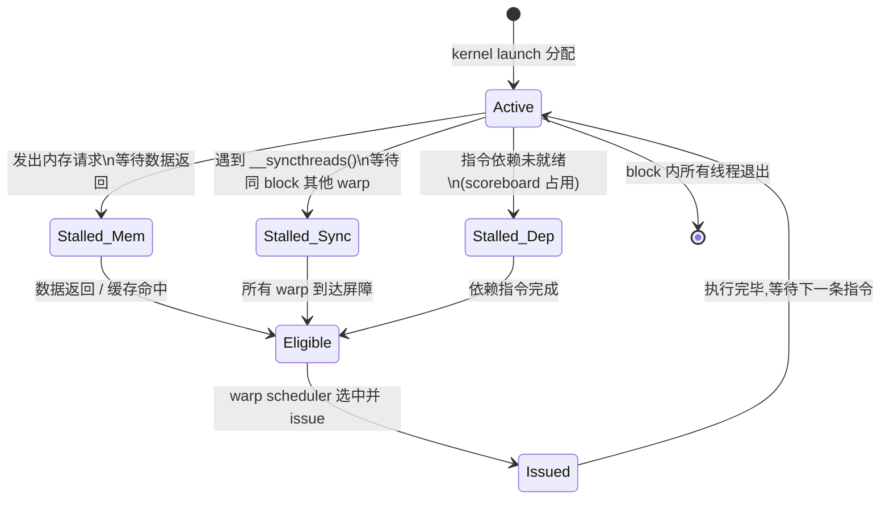
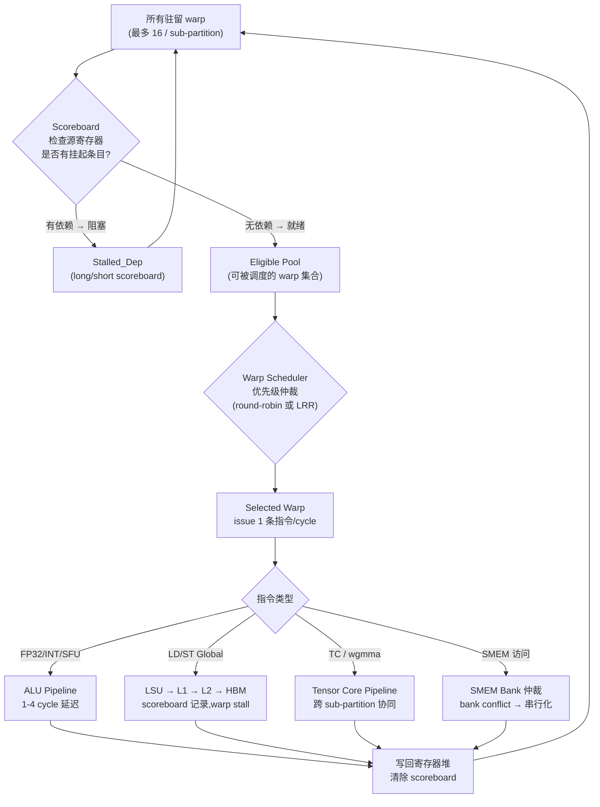

# 01 · SIMT 执行模型

> **GPU 的并行粒度不是单个线程而是 warp(32 个 lane 同步执行的线程束);理解 warp 的调度、分支代价与 Volta+ 引入的 Independent Thread Scheduling 是写出高效 CUDA 代码的第一步。**

## 1. 是什么 / 为什么有它

SIMT(Single Instruction, Multiple Threads)是 NVIDIA GPU 并行执行模型的核心。与 CPU 的 SIMD 不同——SIMD 要求程序员显式将数据打包进向量寄存器并统一操作——SIMT 从外部看像独立的标量线程:每个线程有自己的通用寄存器、程序计数器(PC)和调用栈,可以独立执行不同的代码路径。但在硬件内部,这些"独立线程"每 32 个一组形成 warp,在同一个时钟周期内以锁步(lockstep)方式执行同一条指令。

这种设计的核心优势在于以低控制逻辑成本管理大量线程:每个 warp 共享一套取指/译码流水线,硬件只需维护 32 个 lane 的谓词屏蔽位即可实现条件执行,而不必为每个线程配置独立的控制流硬件。同时通过 latency hiding(延迟隐藏)维持高吞吐——当某个 warp 在等待全局内存数据返回(延迟约 300-600 个时钟周期)时,warp scheduler 立刻切换到另一个已就绪的 warp 执行,从而将延迟"藏起来"。这要求 SM 上同时驻留足够多的 warp(占用率/occupancy)。

warp 是 GPU 调度的最小单位。线程块(CTA)内的线程按 threadIdx 顺序每 32 个分成一组 warp;warp 内的线程称为 lane(lane 0 … lane 31)。例如一个 128 线程的 block 包含 4 个 warp:lane 0-31 属于 warp 0,lane 32-63 属于 warp 1,以此类推。在 Hopper SM90 上,每个 SM 最多同时活跃 64 个 warp(分布在 4 个 sub-partition,每个 sub-partition 最多 16 个 warp)。

SIMT 与 SIMD 的关键差异在于:SIMD 程序员可见向量宽度(显式),SIMT 程序员按标量线程写代码而硬件隐式将 32 线程打包执行。这使 CUDA 代码更易写,但也更难推断真实的硬件行为——特别是在分支和内存访问模式上。

**为何 warp 宽度是 32 而不是 64 或 16?** 这是一个硬件设计权衡。warp 宽度越宽,相同的 warp scheduler 电路可以管理更多线程(减少控制开销),但分支 divergence 的代价也越高(更多 lane 可能走不同路径)。16-wide warp 分支代价更小,但需要 2× 数量的 scheduler 才能覆盖同样多的线程,增加了控制逻辑面积。NVIDIA 在 G80(Tesla)架构中确定 32 作为 warp 宽度并沿用至今,这一选择在"控制开销 vs 分支代价"之间取得了实践证明的平衡。部分现代 GPU(如 AMD 的 GCN)使用 64-wide wavefront,其分支代价更高,在 sparse attention 等分支密集场景下性能不如 32-wide warp。

**warp 内 lane 编号的内存访问含义:** 同一 warp 中 lane 0…31 各自的 `threadIdx` 在一维情形下依次为 `blockDim.x * blockIdx.x` 到 `+ 31`。对全局内存访问,若各 lane 访问的地址连续且 128B 对齐,整个 warp 的 32 次 4B 访问可合并为 1 次 128B 的 L1 事务(fully coalesced);若地址不连续(如按列访问二维数组的同一行),每个 lane 产生独立的 cache miss,事务数激增至 32 次——这是 SIMT 编程中内存访问与 warp 宽度紧密耦合的核心约束。理解这一约束是第 05 章(HBM3 + 全局内存)coalescing 优化的前提。

## 2. 硬件视角(微架构细节)

**Warp 的状态机:** 每个 warp 在任意时刻处于若干状态之一,warp scheduler 根据状态决定是否 issue 该 warp 的指令。



**Hopper Warp Scheduler 4-issue 机制与 Scoreboard 位域:**

每个 sub-partition 有一个 warp scheduler,每时钟周期最多 issue 一条指令(1-issue per scheduler)。整个 SM 共 4 个 sub-partition,因此理论 SM 级 issue 速率为 4 条指令/cycle。以 H100 SXM5 SM 时钟 1980 MHz 计算:

- 单 SM issue 速率 = 4 × 1980 × 10⁶ = 7.92 × 10⁹ 条指令/秒
- 全芯片(132 SM)issue 速率 = 7.92 × 10⁹ × 132 ≈ 1.05 × 10¹² 条指令/秒

Scoreboard 是每个 sub-partition 维护的依赖追踪表。每条尚未写回寄存器堆的飞行中(in-flight)指令在 scoreboard 中占据一个 bit 位——当一个 warp 准备 issue 下一条指令时,scheduler 检查该指令的所有源寄存器是否在 scoreboard 中有挂起条目;若有(即存在 RAW 依赖),warp 进入 Stalled_Dep 状态。Scoreboard 的深度决定了单 warp 内可同时飞行的最大独立指令数;Hopper 的 scoreboard 位域足够容纳同一 warp 的多条内存请求并行飞行,这使得 warp 内的 instruction-level parallelism(ILP)可在一定范围内隐藏长延迟。

**Scoreboard bit field 微架构细节:** Hopper 的 scoreboard 对每个 warp 维护最多 32 个独立的"依赖槽",每个槽对应一条飞行中的长延迟指令。每条 LD 指令发出时,scheduler 将其目标寄存器号写入 scoreboard 的一个空闲槽;当 L2 或 HBM 数据返回写回寄存器堆时,该槽被清除。若所有 32 个槽都已满(同一 warp 有 32 条并发未完成的 LD),新的 LD 指令必须等待一个槽空出,warp 进入 Stalled_Dep(可在 ncu 看到 `long_scoreboard` stall 攀升)。这一限制意味着:单 warp 内指令级并行度(ILP)对延迟隐藏的贡献有上界,不能无限堆叠 LD 指令。实践中,2-4 条独立 LD 通常就足以让 warp 在等待第一条返回期间发出后续几条,无需将 scoreboard 填满。

典型 stall 计数器(NSight Compute `smsp__warp_issue_stalled_*`)含义:

| 计数器后缀 | 含义 | 常见原因 |
|---|---|---|
| `long_scoreboard` | 等待全局内存返回(L2/HBM) | 未命中 L1 的 load 指令 |
| `short_scoreboard` | 等待 SMEM / L1 命中 (~28 cycle) | SMEM bank conflict、L1 命中但 pipeline busy |
| `barrier` | 等待 `__syncthreads()` 屏障 | CTA 内 warp 分布不均,部分 warp 提前到达 |
| `membar` | 等待内存屏障 (`__threadfence_block` 等) | 过度使用 fence 导致 pipeline 停顿 |
| `not_selected` | 已就绪但未被 scheduler 选中 | scheduler 本周期选了另一个 warp |
| `tex_throttle` | 纹理/L1 端口拥塞 | 每周期请求数超过 L1 服务能力 |

**warp issue 路径 — 从 eligible 到执行的详细流程:**



**Warp scheduler 仲裁策略:** Hopper 的 warp scheduler 使用 LRR(Least-Recently-Run)策略作为默认的公平调度基准——在所有 eligible warp 中,优先 issue 上次执行时间最早的那个。这保证每个就绪 warp 都能被轮到,避免饥饿。在实践中,由于不同 warp 的 stall 时间不同,eligible pool 的构成随时间变化;当 eligible pool 只有 1-2 个 warp 时,LRR 与 FIFO 效果相同。某些架构(如 A100)支持可编程 warp 优先级(通过 `cudaFuncAttributePreferredSharedMemoryCarveout` 间接影响),Hopper 延续了这一机制。较高优先级的 warp(如 TMA producer warp)可以优先被调度,减少 pipeline bubble。

**Volta+ Independent Thread Scheduling (ITS) 的硬件实现:**

在 Pascal 及之前的架构中,warp 内所有 32 lane 共享一个 PC(程序计数器)和一个 SIMT stack。分支时硬件用 SIMT stack 记录"两个分叉路径 + 收敛点",先执行活跃的 if-side lane(用 predicate mask 屏蔽 else-side lane),再 pop stack 执行 else-side,最后在 reconvergence point 合并全部 lane。这套机制的问题是:如果两组 lane 没有自然收敛点(如生产者-消费者模式下 if-side 写 SMEM、else-side 读),程序员必须手动插入 `__syncwarp()` 才能保证内存序,否则结果未定义。

Volta 起(SM 7.0+),每个 lane 获得独立的 per-lane PC 和 per-lane RPC(Return Program Counter)以及独立的 call stack 槽位。这三者使 ITS 成为可能:

- **per-lane PC:** 记录该 lane 当前执行位置;divergent 时各 lane PC 不同,scheduler 将活跃 lane 分组批量 issue。
- **per-lane RPC:** 记录该 lane 的函数调用返回地址;支持 warp 内不同 lane 处于不同调用深度。
- **收敛栈(Convergence Stack):** 硬件维护多个同步屏障 token(由 `SSY` PTX 指令压栈、`SYNC` 指令触发收敛),记录各分叉路径的屏障状态。当所有 lane 都到达同一 SYNC 点时,warp 重新进入 lockstep。

**ITS 的实际行为:** ITS 并不意味着每个 lane 完全独立调度——调度仍以 warp 为粒度,同一时刻所有 lane 执行同一指令(但 divergent lane 用谓词屏蔽)。ITS 的关键改进是:① 取消了 SIMT stack 的严格 LIFO 要求,允许在中间点重新合并部分已收敛的 lane;② 允许在同一 warp 内实现细粒度的生产者-消费者交错(warp-level coroutine),而不需要用两个不同 warp。

**ITS 与 CUTLASS warp-specialization 的关系:** CUTLASS 3.x 的 persistent GEMM kernel 利用了 ITS 的细粒度 warp 交错能力:producer warp-group(负责 TMA load)和 consumer warp-group(负责 wgmma)可以在同一 CTA 内交替调度,由 mbarrier 的 phase 位协调。在 Pascal 时代,这种模式需要用两个独立的 CTA 来实现;ITS 允许在单 CTA 内完成,减少了 CTA 间通信开销和 cluster 拓扑约束。这也是 FlashAttention-3 选择 CUTLASS 3.x 框架的核心原因之一(参见 Hopper Whitepaper §3.2 及 FlashAttention-3 arxiv 2407.08608)。

**谓词执行与分支代价量化:** PTX 层面,分支以谓词寄存器 `%p0` 实现:

```ptx
setp.gt.s32   %p0, %r0, 0       // %p0 = (%r0 > 0)
@%p0  add.s32  %r1, %r1, 1     // if 分支:lane active when %p0 = true
@!%p0 sub.s32  %r1, %r1, 1     // else 分支:lane active when %p0 = false
```

被谓词屏蔽的 lane 不写回寄存器,但仍消耗 1 个 issue slot。因此分支代价 = `active_lanes_in_if` + `active_lanes_in_else` 条指令的 issue 开销,均摊到整个 warp。**最坏情形量化:** 若一个循环体内 warp 中 16 lane 走路径 A(100 条指令)、另 16 lane 走路径 B(100 条指令),且两条路径没有共同指令,则 warp 需执行 200 条 issue 周期才能完成,而全部 32 lane 同路径只需 100 条。SIMT efficiency = (32 × 100) / (32 × 200) = 0.5,吞吐折半。

## 3. CUDA 编程接口

Volta+ SIMT 相关的核心 API 与 PTX intrinsic:

- **`__syncwarp(unsigned mask)`** — 在 warp 内的指定 lane 子集间设置内存屏障并等待收敛。`mask` 通常传 `0xFFFFFFFF`(所有 32 lane)或 `__activemask()`(当前活跃 lane 集合)。
- **`__activemask()`** — 返回 warp 内当前处于 active 状态的 lane 的 32 位掩码;注意这是运行时值,在 divergent 分支内调用会返回只含该分支活跃 lane 的掩码。**ITS chasm(ITS 语义陷阱):** 在 ITS 模式下,`__activemask()` 的返回值取决于调用时刻的调度快照,而不是程序员期望的"当前 warp 中所有活跃线程";在 divergent 分支中若使用 `__activemask()` 而非显式 mask 参数,极易出现 race condition——某些 lane 尚未到达 `__activemask()` 调用点时,另一些 lane 已经在使用错误的 mask 执行 `__shfl_sync`。正确用法见§7。
- **`__ballot_sync(unsigned mask, int predicate)`** — 收集 warp 内各 lane 的谓词值,返回 32 位位图:bit i = 1 表示 lane i 的 predicate 为真。适合 warp-level 条件汇总。
- **`__shfl_sync(unsigned mask, T var, int srcLane)`** — 广播:将 srcLane 的 `var` 值读取到 mask 中所有 lane。实测延迟约 5 个时钟周期(Hopper,源寄存器就绪后到目标寄存器可用的等待周期),远低于 SMEM 访问(~28 cycle)。这使得 warp shuffle 成为 warp-level reduction 的首选原语。
- **`__shfl_down_sync(unsigned mask, T var, int delta)`** — 向下移位:lane i 读取 lane i+delta 的值;配合 reduction 循环使用。
- **`__shfl_xor_sync(unsigned mask, T var, int laneMask)`** — 蝶形交换:lane i 读取 lane i^laneMask 的值;适合 butterfly reduction。
- **`cooperative_groups::coalesced_threads()`** — 返回当前 warp 中活跃 lane 构成的 coalesced group,提供 `.shfl()`、`.reduce()` 等 group-level 操作;在 divergent 分支内自动处理 mask,是最安全的 warp-level 操作写法。

头文件:`#include <cooperative_groups.h>`(cooperative groups)。

**实现导读 — Cooperative Groups 的 coalesced_threads 使用模式:** `cooperative_groups::coalesced_threads()` 在 divergent 分支内返回"只含当前活跃 lane"的 group,其 `.size()` 可能小于 32。这使得在 sparse attention mask 等稀疏场景下可以写出语义正确且高效的 warp-level reduction:

```cpp
#include <cooperative_groups.h>
namespace cg = cooperative_groups;

__device__ float active_reduce(float val) {
    // 不论 warp 内有多少 lane 活跃,均能正确 reduce
    auto g = cg::coalesced_threads();
    for (int i = g.size() / 2; i > 0; i >>= 1)
        val += g.shfl_down(val, i);
    return val;  // group rank 0 得到所有活跃 lane 的和
}
```

这比手写 `for (offset=16; offset>0; offset>>=1) __shfl_xor_sync(mask, ...)` 更语义清晰,且自动处理 mask,避免了 ITS chasm(见§7)。

## 4. 关键性能指标

- **Warp issue 频率:** Hopper SM 有 4 个 sub-partition,每个含 1 个 warp scheduler;每个 scheduler 每周期最多 issue 1 条指令,即整 SM 每周期最多 issue 4 条 warp 指令。全芯片 132 SM 理论峰值:4 warp/cycle/SM × 132 SM = 528 warp 指令/cycle(@ SM clock 1980 MHz 时约 1.05 × 10¹²  条/秒)。注意这是 issue 速率,实际执行完成受 pipeline depth 影响。
- **`__shfl_sync` 实测 5-cycle 延迟:** warp shuffle 指令的端到端延迟(从 issue 到结果可用)在 Hopper 上约 5 个 SM 时钟周期,对比 SMEM 访问 ~28 cycle(L1 命中)。这意味着对于仅需在 warp 内交换数据的 reduction 操作,shuffle 比 SMEM 快约 5×;但对于需要跨 warp 或跨 CTA 通信的情形,仍需使用 SMEM 或原子操作。5-cycle 延迟在 scoreboard 中占据 5 个 issue 周期的等待窗口,在此期间若有其他 eligible warp,scheduler 会切换执行——因此多 warp 并发下 shuffle 延迟几乎被完全隐藏。
- **SIMT Efficiency:** NSight Compute 指标 `smsp__thread_inst_executed_per_inst_executed.ratio` 给出每条 issue 指令实际激活的平均 lane 数,满值为 32。若 warp 内分支严重,该值可能降至 16 甚至 1。SIMT efficiency < 16 通常说明需要重构算法或数据排布以减少 divergence。
- **Warp Occupancy:** 活跃 warp 数 / 最大活跃 warp 数(Hopper 最大 64 warp/SM)。最大值取决于寄存器用量和 SMEM 用量(详见第 12 章)。低 occupancy 不一定影响性能——只要有足够的 warp 足以隐藏内存延迟即可;但过低(< 25%)通常会导致 scheduler 找不到可 issue 的 warp,SM 空转,内存带宽和算力都无法充分利用。
- **分支代价量化:** divergence ratio = `lanes_executed_total / (warps × 32)`;若一个 warp 内 if 侧 16 lane、else 侧 16 lane 各走不同代码,所有指令执行两遍,ratio = 0.5,吞吐折半。对于完全一致的 warp(所有 lane 走同一路径),ratio = 1.0,无额外开销。
- **内存延迟数字:** L1 cache 命中 ~28 个时钟周期,L2 命中 ~100-200 周期,HBM3 约 ~300-600 周期(Hopper Architecture Whitepaper 数据)。warp 在等待内存期间处于 Stalled_Mem 状态,scheduler 切换到其他就绪 warp。要完全隐藏 HBM3 延迟(~500 cycle),理论上需要 500 / (1 issue/cycle) = 500 个独立指令来填满等待窗口;单 sub-partition 最多 16 warp × 每 warp ~4 独立指令 = 64 指令的 ILP 覆盖,因此多 warp 并发(occupancy)是隐藏 HBM 延迟的主要手段,而非单 warp ILP。
- **Warp stall 状态计数器的实际分布:** 对典型 LLM 推理 decode kernel(memory-bound),NSight Compute 通常显示 `long_scoreboard` stall 占比 60-80%,这意味着大部分时间 warp 在等 HBM 数据返回,仅靠增加 occupancy 无法从根本上解决——必须减少 HBM 访问量(如提高 batch size、使用 KV-cache 量化)或通过 TMA + prefetch 预取数据。

**实际 issue 速率与 MFU 的关系:** 以 GPT-70B 的 prefill 阶段为例,序列长度 2048、batch size 4,在单 H100 SXM5 上运行;理论峰值 BF16 TC 算力 989 TFLOPS,实测 prefill 阶段 MFU 约 55-65%(配合 FlashAttention-2);这意味着 SM 中约 35-45% 的 issue slots 被 stall 消耗——主要是 `long_scoreboard`(等待 HBM KV-cache)和 `barrier`(warp 间 mbarrier 同步)。优化路径:FlashAttention-3 通过 warp-specialization + TMA prefetch 将 `long_scoreboard` stall 进一步降低,使 MFU 提升至 75%+(Shah et al., 2024, arxiv 2407.08608)。全芯片 issue 速率:4 warp/cycle/SM × 132 SM = 528 warp 指令/cycle,这是 Hopper 在满 occupancy、零 stall 条件下的理论上界;实际训练 workload 通常达到 60-70% 的 issue 效率。

**关于 `not_selected` stall 的解读:** `smsp__warp_issue_stalled_not_selected_per_warp_active.pct` 高(>30%)并不总是坏事——它仅表示该 warp 在某周期虽然 eligible 但未被 scheduler 选中(因为同一 sub-partition 上有其他 warp 被选中)。如果所有 stall 中 `not_selected` 占比最高,说明 scheduler 有足够多的 eligible warp 选择,latency hiding 正在正常工作。真正需要关注的是 `long_scoreboard` + `barrier` + `membar` 三者之和占比是否过高。

## 5. 代码示例

**示例零:观察 SIMT 效率下降的量化实验**

下面的 kernel 通过线程 ID 的奇偶性人为制造 divergence,可用 NSight Compute 量化 SIMT efficiency 的下降:

```cpp
// divergent_test.cu — 用于量化 SIMT efficiency 下降
__global__ void divergent_kernel(const float* in, float* out, int n) {
    int tid = blockIdx.x * blockDim.x + threadIdx.x;
    if (tid >= n) return;
    float val = in[tid];
    // 奇偶分支:同一 warp 内 16 lane 走 if, 16 lane 走 else
    if (tid & 1) {
        // if 侧:密集计算(约 8 条 FP32 指令)
        val = val * val + 1.0f;
        val = __fmaf_rn(val, 2.0f, -0.5f);
        val = __fmaf_rn(val, val, 0.1f);
    } else {
        // else 侧:不同密集计算
        val = __fsqrt_rn(val * val + 1.0f);
        val = __fmaf_rn(val, 0.5f, 0.25f);
    }
    out[tid] = val;
}
// 预期:ncu 报告 smsp__thread_inst_executed_per_inst_executed.ratio ≈ 16(而非 32)
```

**示例一:带谓词执行的 PTX 片段**

```ptx
// 以下 PTX 展示 if (x > 0) r += 1; else r -= 1; 的谓词执行方式
// 假设 %r0 = x, %r1 = r

.reg .pred %p0;
setp.gt.s32   %p0, %r0, 0        // 设置谓词:%p0 = (x > 0)
@%p0  add.s32  %r1, %r1, 1      // if 分支:仅 %p0 为真的 lane 执行
@!%p0 sub.s32  %r1, %r1, 1     // else 分支:仅 %p0 为假的 lane 执行
// 两行分别执行,各自屏蔽不活跃 lane,收敛后继续
```

**示例二:warp shuffle reduce(CUDA C++)**

```cpp
// 用 __shfl_xor_sync 做 warp 级求和 reduce
// 所有 32 lane 参与,最终 lane 0 得到全部 32 值的和
__device__ float warp_reduce_sum(float val) {
    unsigned mask = 0xFFFFFFFFu;
    // 蝶形 reduce:stride = 16, 8, 4, 2, 1
    for (int offset = 16; offset > 0; offset >>= 1) {
        val += __shfl_xor_sync(mask, val, offset);
    }
    return val;  // lane 0 的返回值为总和
}

__global__ void reduce_kernel(const float *input, float *output, int n) {
    int tid = blockIdx.x * blockDim.x + threadIdx.x;
    float val = (tid < n) ? input[tid] : 0.0f;
    val = warp_reduce_sum(val);
    // 每个 warp 的 lane 0 写入 partial sum
    if ((threadIdx.x & 31) == 0) {
        atomicAdd(output, val);
    }
}
```

## 6. 实测手段

**NSight Compute 关键 metric:**

```bash
# 查看 warp 活跃率与 SIMT 效率
ncu --metrics smsp__warps_active.avg.pct_of_peak_sustained_active,\
smsp__thread_inst_executed_per_inst_executed.ratio \
./my_app

# 查看各类 stall 原因占比
ncu --metrics smsp__warp_issue_stalled_membar_per_warp_active.pct,\
smsp__warp_issue_stalled_long_scoreboard_per_warp_active.pct,\
smsp__warp_issue_stalled_barrier_per_warp_active.pct \
./my_app
```

- `smsp__warps_active.avg.pct_of_peak_sustained_active` — 活跃 warp 占峰值比例,反映 occupancy 水平。
- `smsp__thread_inst_executed_per_inst_executed.ratio` — SIMT efficiency,接近 32 表示无明显 divergence。
- `smsp__warp_issue_stalled_long_scoreboard_per_warp_active.pct` — 因全局内存延迟 stall 的比例,高说明内存访问是瓶颈。
- `smsp__warp_issue_stalled_barrier_per_warp_active.pct` — 因 `__syncthreads()` 等屏障 stall 的比例,高说明 CTA 内 warp 分布不均。

**warp stall 调试工作流:** 当 NSight Compute 的 Warp State Statistics section 显示某个 stall 类型占比超过 30% 时,建议按以下顺序排查:

1. **`long_scoreboard` > 30%** → 优先看 Memory Workload Analysis section:L1 hit rate 低于 50% 说明 coalescing 差(检查地址连续性);L2 hit rate 低于 30% 说明工作集超过 60 MiB L2(考虑 L2 persistence 或 prefetch);HBM 带宽接近峰值说明 memory-bound,需增大 batch 或减少数据量。

2. **`barrier` > 20%** → 检查 `__syncthreads()` 前后的 warp 分布。若 CTA 内不同 warp 在 barrier 前的工作量不均(如某些 warp 处理末尾的小 tile),考虑 padding 或调整 grid/block 大小。

3. **`short_scoreboard` > 20%** → 通常是 SMEM bank conflict。检查 `l1tex__data_bank_conflicts_pipe_lsu_mem_shared_op_ld.sum` metric;若非零,调整 SMEM pad 策略(每行额外 4-8 个元素)。

4. **`not_selected` 最高** → 表示调度器有充足 eligible warp,latency hiding 正常工作,这种情况下不需要干预。

## 7. 常见反模式

1. **warp 内数据相关 if-else 导致 divergence** — 例如 `if (data[threadIdx.x] > threshold)` 在每个 lane 产生不同的分支结果,整个 warp 需要执行两次(if 侧 + else 侧)。解决方法:重排数据使同 warp 的 lane 走相同分支,或改用谓词算法避免分支。

2. **误用 `__syncthreads()` 替代 `__syncwarp()`** — `__syncthreads()` 是 block 级屏障,要求 block 内所有线程都到达;在 divergent 分支内部调用 `__syncthreads()` 会产生未定义行为(某些 lane 永远到不了屏障)。warp 内的 lane 间同步应使用 `__syncwarp(mask)`。

3. **忘记 mask 参数的 0xFFFFFFFF 假设** — Volta+ ITS 要求所有 warp 操作显式传 mask(`__shfl_sync`、`__ballot_sync` 等)。传入的 mask 必须与 warp 内实际参与操作的 lane 集合一致;若传错 mask,结果是未定义的,且编译器不会报错。常见错误:在 divergent 分支内仍传 `0xFFFFFFFFu` 而不是 `__activemask()`。

4. **误认为 warp 发散只影响分支本身** — divergent warp 在分支收敛后恢复 lockstep,但收敛之前若发生内存访问,两组 lane 分别发出各自的内存请求,可能导致 coalescing 效率降低,内存事务数翻倍。

5. **在 warp-level 操作后不加 `__syncwarp` 就读共享数据** — warp shuffle 操作在 Volta+ 上不保证对 SMEM 的内存可见性,如果 shuffle 之后要访问其他 lane 写入的 SMEM 数据,必须插入 `__syncwarp(mask)` 作为内存屏障。

6. **`__activemask()` ITS chasm — 在 divergent 分支中错用 activemask:** ITS 允许 warp 内不同 lane 处于不同代码位置,这意味着在 divergent 分支内调用 `__activemask()` 返回的是"当前调度快照下活跃 lane 集合",而非"逻辑上属于同一分支的全部 lane 集合"。考虑如下场景:lane 0-15 执行 if 分支,lane 16-31 执行 else 分支;在 if 分支内调用 `__activemask()` 可能因为 else 分支的某些 lane 已经收敛回来而返回错误的 mask。**正确做法:** 在 kernel 入口或已知 warp 完全收敛的位置预先保存 mask,在 divergent 分支内使用保存的 mask 而非动态查询。示例:
   ```cpp
   const unsigned full_mask = __activemask();  // warp 收敛时调用
   // ...之后在可能 divergent 的分支内
   val = __shfl_sync(full_mask, val, 0);        // 使用预存 mask
   ```

7. **过度依赖 warp-level 同步而忽略 block-level 屏障的必要性** — 某些开发者在多 warp CTA 中用 `__syncwarp()` 代替 `__syncthreads()`,以为更"轻量";但 `__syncwarp()` 只保证同一 warp 内的内存可见性,不保证不同 warp 之间的顺序。若 warp A 写了 SMEM 后只调 `__syncwarp()`,warp B 读 SMEM 时可能看到旧值。必须使用 `__syncthreads()` 或显式 `cuda::atomic` fence 才能保证跨 warp 的内存序。

**设计权衡:为何 Volta 没有更早引入 ITS?** ITS 的 per-lane PC 和 per-lane call stack 需要每个线程额外的寄存器文件槽位来保存 PC/RPC 状态。在 Pascal(SM 6.x)中,这些额外的存储成本被认为超过了 ITS 带来的收益——Pascal 时代的主要工作负载(图形渲染、HPC 计算)对 warp-level coroutine 的需求尚不迫切。Volta(SM 7.0)随着深度学习工作负载的爆发,per-lane PC 的使用场景(多头 attention 的不规则 mask、稀疏 MoE 路由)变得关键,NVIDIA 才在此代引入 ITS。这一演进路径反映了 GPU 微架构选择的"需求驱动"特点——硬件改进总是比工作负载需求滞后一代左右。

## 8. 延伸阅读

理解 SIMT 执行模型是掌握后续所有章节的基础。warp 的锁步执行特性决定了为什么 SMEM bank conflict 代价如此高昂(第 3 章)、为什么 Tensor Core 的 wgmma 指令以 warp-group 粒度发射(第 8 章)、为什么 mbarrier 相位同步以 warp 为单位感知完成(第 10 章)。从 SIMT 的视角重新审视这些概念,有助于在面对新的性能问题时快速判断瓶颈所在——是 warp 利用率不足、是分支 divergence 导致活跃 lane 减少,还是 coalescing 不佳导致 L2/HBM 事务数爆炸。掌握 warp 的执行状态机和 ITS 语义,是成为熟练 CUDA 工程师的必经之路。

- CUDA C++ Programming Guide § 5.4.4 — *SIMT Architecture*([https://docs.nvidia.com/cuda/cuda-c-programming-guide/#simt-architecture](https://docs.nvidia.com/cuda/cuda-c-programming-guide/#simt-architecture))
- CUDA C++ Programming Guide § 7.14 — *Warp Shuffle Functions*([https://docs.nvidia.com/cuda/cuda-c-programming-guide/#warp-shuffle-functions](https://docs.nvidia.com/cuda/cuda-c-programming-guide/#warp-shuffle-functions))
- PTX ISA § 8 — *SIMT Stack*([https://docs.nvidia.com/cuda/parallel-thread-execution/#simt-stack](https://docs.nvidia.com/cuda/parallel-thread-execution/#simt-stack))
- Volta Architecture Whitepaper — *Independent Thread Scheduling*([https://images.nvidia.com/content/volta-architecture/pdf/volta-architecture-whitepaper.pdf](https://images.nvidia.com/content/volta-architecture/pdf/volta-architecture-whitepaper.pdf))
- CUDA C++ Programming Guide § 7.26 — *Cooperative Groups*([https://docs.nvidia.com/cuda/cuda-c-programming-guide/#cooperative-groups](https://docs.nvidia.com/cuda/cuda-c-programming-guide/#cooperative-groups))
- CUDA Sample: `0_Introduction/simpleWarp`([https://github.com/NVIDIA/cuda-samples/tree/master/Samples/0_Introduction/simpleWarp](https://github.com/NVIDIA/cuda-samples/tree/master/Samples/0_Introduction/simpleWarp))
- Hopper Architecture Whitepaper §3.2 — *Warp Group MMA and Warp Specialization*([https://resources.nvidia.com/en-us-tensor-core/gtc22-whitepaper-hopper](https://resources.nvidia.com/en-us-tensor-core/gtc22-whitepaper-hopper))
- FlashAttention-3: Fast and Accurate Attention with Asynchrony and Low-precision — Shah et al., 2024, arxiv 2407.08608
- CUTLASS 3.x — `include/cutlass/gemm/kernel/sm90_gemm_tma_warpspecialized_pingpong.hpp`([https://github.com/NVIDIA/cutlass](https://github.com/NVIDIA/cutlass))
