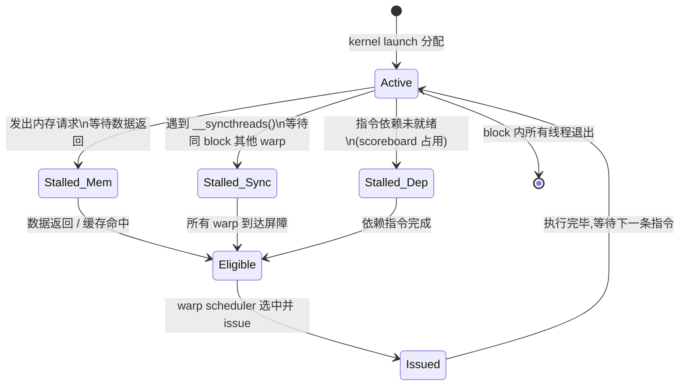

# 01 · SIMT 执行模型

> **GPU 的并行粒度不是单个线程而是 warp(32 个 lane 同步执行的线程束);理解 warp 的调度、分支代价与 Volta+ 引入的 Independent Thread Scheduling 是写出高效 CUDA 代码的第一步。**

## 1. 是什么 / 为什么有它

SIMT(Single Instruction, Multiple Threads)是 NVIDIA GPU 并行执行模型的核心。与 CPU 的 SIMD 不同——SIMD 要求程序员显式将数据打包进向量寄存器并统一操作——SIMT 从外部看像独立的标量线程:每个线程有自己的通用寄存器、程序计数器(PC)和调用栈,可以独立执行不同的代码路径。但在硬件内部,这些"独立线程"每 32 个一组形成 warp,在同一个时钟周期内以锁步(lockstep)方式执行同一条指令。

这种设计的核心优势在于以低控制逻辑成本管理大量线程:每个 warp 共享一套取指/译码流水线,硬件只需维护 32 个 lane 的谓词屏蔽位即可实现条件执行,而不必为每个线程配置独立的控制流硬件。同时通过 latency hiding(延迟隐藏)维持高吞吐——当某个 warp 在等待全局内存数据返回(延迟约 300-600 个时钟周期)时,warp scheduler 立刻切换到另一个已就绪的 warp 执行,从而将延迟"藏起来"。这要求 SM 上同时驻留足够多的 warp(占用率/occupancy)。

warp 是 GPU 调度的最小单位。线程块(CTA)内的线程按 threadIdx 顺序每 32 个分成一组 warp;warp 内的线程称为 lane(lane 0 … lane 31)。例如一个 128 线程的 block 包含 4 个 warp:lane 0-31 属于 warp 0,lane 32-63 属于 warp 1,以此类推。在 Hopper SM90 上,每个 SM 最多同时活跃 64 个 warp(分布在 4 个 sub-partition,每个 sub-partition 最多 16 个 warp)。

SIMT 与 SIMD 的关键差异在于:SIMD 程序员可见向量宽度(显式),SIMT 程序员按标量线程写代码而硬件隐式将 32 线程打包执行。这使 CUDA 代码更易写,但也更难推断真实的硬件行为——特别是在分支和内存访问模式上。

## 2. 硬件视角(微架构细节)

**Warp 的状态机:** 每个 warp 在任意时刻处于若干状态之一,warp scheduler 根据状态决定是否 issue 该 warp 的指令。



**Volta+ Independent Thread Scheduling (ITS):** 在 Volta 之前(Maxwell、Pascal),warp 内所有 lane 严格共享同一个 PC——如果某些 lane 走 if 分支,另一些走 else,硬件用 SIMT stack 记录 divergence 状态,先执行 if 侧(其余 lane 用谓词屏蔽),再执行 else 侧,最后在 convergence point 汇合。这意味着在同一 warp 内,不同分支的执行是串行的,总耗时 = if_cost + else_cost。

Volta 起引入 ITS:每个 lane 拥有独立的 PC 和 call stack。这使得 warp 调度器可以在 lane 间做细粒度的 interleave——不再强制所有 lane 串行走完所有分支,而是可以在任意 convergence point 重新合并执行。SASS 层面对应 `SSY`(Set Sync)、`SYNC`(warp 收敛)指令。编程层面,开发者需要用 `__syncwarp(mask)` 而非 `__syncthreads()` 来在 warp 粒度同步。

**谓词执行:** PTX 层面,分支以谓词寄存器 `%p0` 实现:

```ptx
setp.gt.s32   %p0, %r0, 0       // %p0 = (%r0 > 0)
@%p0  add.s32  %r1, %r1, 1     // if 分支:lane active when %p0 = true
@!%p0 sub.s32  %r1, %r1, 1     // else 分支:lane active when %p0 = false
```

被谓词屏蔽的 lane 不写回寄存器,但仍消耗 1 个 issue slot。因此分支代价 = `active_lanes_in_if` + `active_lanes_in_else` 条指令的 issue 开销,均摊到整个 warp。

## 3. CUDA 编程接口

Volta+ SIMT 相关的核心 API 与 PTX intrinsic:

- **`__syncwarp(unsigned mask)`** — 在 warp 内的指定 lane 子集间设置内存屏障并等待收敛。`mask` 通常传 `0xFFFFFFFF`(所有 32 lane)或 `__activemask()`(当前活跃 lane 集合)。
- **`__activemask()`** — 返回 warp 内当前处于 active 状态的 lane 的 32 位掩码;注意这是运行时值,在 divergent 分支内调用会返回只含该分支活跃 lane 的掩码。
- **`__ballot_sync(unsigned mask, int predicate)`** — 收集 warp 内各 lane 的谓词值,返回 32 位位图:bit i = 1 表示 lane i 的 predicate 为真。适合 warp-level 条件汇总。
- **`__shfl_sync(unsigned mask, T var, int srcLane)`** — 广播:将 srcLane 的 `var` 值读取到 mask 中所有 lane。
- **`__shfl_down_sync(unsigned mask, T var, int delta)`** — 向下移位:lane i 读取 lane i+delta 的值;配合 reduction 循环使用。
- **`__shfl_xor_sync(unsigned mask, T var, int laneMask)`** — 蝶形交换:lane i 读取 lane i^laneMask 的值;适合 butterfly reduction。
- **`cooperative_groups::coalesced_threads()`** — 返回当前 warp 中活跃 lane 构成的 coalesced group,提供 `.shfl()`、`.reduce()` 等 group-level 操作。

头文件:`#include <cooperative_groups.h>`(cooperative groups)。

## 4. 关键性能指标

- **Warp issue 频率:** Hopper SM 有 4 个 sub-partition,每个含 1 个 warp scheduler;每个 scheduler 每周期最多 issue 1 条指令,即整 SM 每周期最多 issue 4 条 warp 指令。设时钟 1.98 GHz,理论峰值 issue 速率 ≈ 7.92 × 10⁹ 条指令/秒/SM × 132 SM ≈ 1.05 万亿条指令/秒。注意这是 issue 速率,实际执行完成受 pipeline depth 影响。
- **SIMT Efficiency:** NSight Compute 指标 `smsp__thread_inst_executed_per_inst_executed.ratio` 给出每条 issue 指令实际激活的平均 lane 数,满值为 32。若 warp 内分支严重,该值可能降至 16 甚至 1。SIMT efficiency < 16 通常说明需要重构算法或数据排布以减少 divergence。
- **Warp Occupancy:** 活跃 warp 数 / 最大活跃 warp 数(Hopper 最大 64 warp/SM)。最大值取决于寄存器用量和 SMEM 用量(详见第 12 章)。低 occupancy 不一定影响性能——只要有足够的 warp 足以隐藏内存延迟即可;但过低(< 25%)通常会导致 scheduler 找不到可 issue 的 warp,SM 空转,内存带宽和算力都无法充分利用。
- **分支代价量化:** divergence ratio = `lanes_executed_total / (warps × 32)`;若一个 warp 内 if 侧 16 lane、else 侧 16 lane 各走不同代码,所有指令执行两遍,ratio = 0.5,吞吐折半。对于完全一致的 warp(所有 lane 走同一路径),ratio = 1.0,无额外开销。
- **内存延迟数字:** L1 cache 命中 ~28 个时钟周期,L2 命中 ~100-200 周期,HBM3 约 ~300-600 周期(Hopper Architecture Whitepaper 数据)。warp 在等待内存期间处于 Stalled_Mem 状态,scheduler 切换到其他就绪 warp。要完全隐藏 HBM3 延迟,需要足够多的 active warp 提供指令流水。

## 5. 代码示例

**示例一:带谓词执行的 PTX 片段**

```ptx
// 以下 PTX 展示 if (x > 0) r += 1; else r -= 1; 的谓词执行方式
// 假设 %r0 = x, %r1 = r

.reg .pred %p0;
setp.gt.s32   %p0, %r0, 0        // 设置谓词:%p0 = (x > 0)
@%p0  add.s32  %r1, %r1, 1      // if 分支:仅 %p0 为真的 lane 执行
@!%p0 sub.s32  %r1, %r1, 1     // else 分支:仅 %p0 为假的 lane 执行
// 两行分别执行,各自屏蔽不活跃 lane,收敛后继续
```

**示例二:warp shuffle reduce(CUDA C++)**

```cpp
// 用 __shfl_xor_sync 做 warp 级求和 reduce
// 所有 32 lane 参与,最终 lane 0 得到全部 32 值的和
__device__ float warp_reduce_sum(float val) {
    unsigned mask = 0xFFFFFFFFu;
    // 蝶形 reduce:stride = 16, 8, 4, 2, 1
    for (int offset = 16; offset > 0; offset >>= 1) {
        val += __shfl_xor_sync(mask, val, offset);
    }
    return val;  // lane 0 的返回值为总和
}

__global__ void reduce_kernel(const float *input, float *output, int n) {
    int tid = blockIdx.x * blockDim.x + threadIdx.x;
    float val = (tid < n) ? input[tid] : 0.0f;
    val = warp_reduce_sum(val);
    // 每个 warp 的 lane 0 写入 partial sum
    if ((threadIdx.x & 31) == 0) {
        atomicAdd(output, val);
    }
}
```

## 6. 实测手段

**NSight Compute 关键 metric:**

```bash
# 查看 warp 活跃率与 SIMT 效率
ncu --metrics smsp__warps_active.avg.pct_of_peak_sustained_active,\
smsp__thread_inst_executed_per_inst_executed.ratio \
./my_app

# 查看各类 stall 原因占比
ncu --metrics smsp__warp_issue_stalled_membar_per_warp_active.pct,\
smsp__warp_issue_stalled_long_scoreboard_per_warp_active.pct,\
smsp__warp_issue_stalled_barrier_per_warp_active.pct \
./my_app
```

- `smsp__warps_active.avg.pct_of_peak_sustained_active` — 活跃 warp 占峰值比例,反映 occupancy 水平。
- `smsp__thread_inst_executed_per_inst_executed.ratio` — SIMT efficiency,接近 32 表示无明显 divergence。
- `smsp__warp_issue_stalled_long_scoreboard_per_warp_active.pct` — 因全局内存延迟 stall 的比例,高说明内存访问是瓶颈。
- `smsp__warp_issue_stalled_barrier_per_warp_active.pct` — 因 `__syncthreads()` 等屏障 stall 的比例,高说明 CTA 内 warp 分布不均。

## 7. 常见反模式

1. **warp 内数据相关 if-else 导致 divergence** — 例如 `if (data[threadIdx.x] > threshold)` 在每个 lane 产生不同的分支结果,整个 warp 需要执行两次(if 侧 + else 侧)。解决方法:重排数据使同 warp 的 lane 走相同分支,或改用谓词算法避免分支。

2. **误用 `__syncthreads()` 替代 `__syncwarp()`** — `__syncthreads()` 是 block 级屏障,要求 block 内所有线程都到达;在 divergent 分支内部调用 `__syncthreads()` 会产生未定义行为(某些 lane 永远到不了屏障)。warp 内的 lane 间同步应使用 `__syncwarp(mask)`。

3. **忘记 mask 参数的 0xFFFFFFFF 假设** — Volta+ ITS 要求所有 warp 操作显式传 mask(`__shfl_sync`、`__ballot_sync` 等)。传入的 mask 必须与 warp 内实际参与操作的 lane 集合一致;若传错 mask,结果是未定义的,且编译器不会报错。常见错误:在 divergent 分支内仍传 `0xFFFFFFFFu` 而不是 `__activemask()`。

4. **误认为 warp 发散只影响分支本身** — divergent warp 在分支收敛后恢复 lockstep,但收敛之前若发生内存访问,两组 lane 分别发出各自的内存请求,可能导致 coalescing 效率降低,内存事务数翻倍。

5. **在 warp-level 操作后不加 `__syncwarp` 就读共享数据** — warp shuffle 操作在 Volta+ 上不保证对 SMEM 的内存可见性,如果 shuffle 之后要访问其他 lane 写入的 SMEM 数据,必须插入 `__syncwarp(mask)` 作为内存屏障。

## 8. 延伸阅读

- CUDA C++ Programming Guide § 5.4.4 — *SIMT Architecture*([https://docs.nvidia.com/cuda/cuda-c-programming-guide/#simt-architecture](https://docs.nvidia.com/cuda/cuda-c-programming-guide/#simt-architecture))
- CUDA C++ Programming Guide § 7.14 — *Warp Shuffle Functions*([https://docs.nvidia.com/cuda/cuda-c-programming-guide/#warp-shuffle-functions](https://docs.nvidia.com/cuda/cuda-c-programming-guide/#warp-shuffle-functions))
- PTX ISA § 8 — *SIMT Stack*([https://docs.nvidia.com/cuda/parallel-thread-execution/#simt-stack](https://docs.nvidia.com/cuda/parallel-thread-execution/#simt-stack))
- Volta Architecture Whitepaper — *Independent Thread Scheduling*([https://images.nvidia.com/content/volta-architecture/pdf/volta-architecture-whitepaper.pdf](https://images.nvidia.com/content/volta-architecture/pdf/volta-architecture-whitepaper.pdf))
- CUDA C++ Programming Guide § 7.26 — *Cooperative Groups*([https://docs.nvidia.com/cuda/cuda-c-programming-guide/#cooperative-groups](https://docs.nvidia.com/cuda/cuda-c-programming-guide/#cooperative-groups))
- CUDA Sample: `0_Introduction/simpleWarp`([https://github.com/NVIDIA/cuda-samples/tree/master/Samples/0_Introduction/simpleWarp](https://github.com/NVIDIA/cuda-samples/tree/master/Samples/0_Introduction/simpleWarp))
