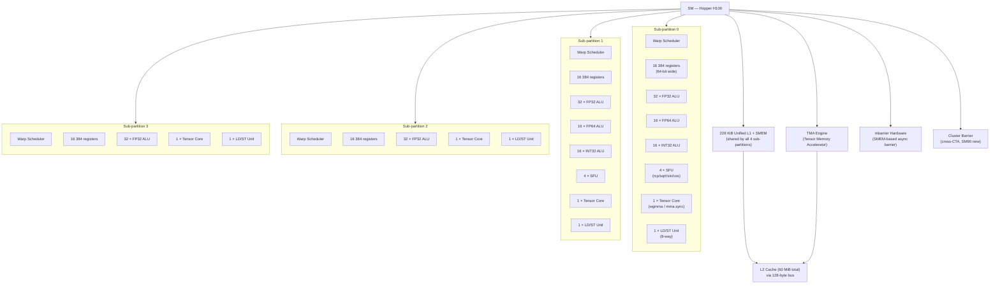

# 02 · SM 内部结构

> **Hopper SM90 的 Streaming Multiprocessor 是 GPU 算力的最小独立单元:每个 SM 含 4 个 sub-partition,各自独立调度 warp,共享 228 KiB 的 L1/SMEM 以及 TMA 和 mbarrier 等 Hopper 新增硬件。理解 SM 结构是正确估算 occupancy 和调优 kernel 的基础。**

## 1. 是什么 / 为什么有它

SM(Streaming Multiprocessor)是 GPU 的基本计算单元——可以把它类比为一个高度简化但极宽的 CPU 核。GPU 由大量 SM 组成(Hopper H100 SXM5 有 132 个 SM,PCIe 版有 114 个 SM),每个 SM 独立运行一批线程块(CTA)。CTA 之间只能通过全局内存或(Hopper 起)同一 cluster 内的 DSMEM 进行通信;CTA 内部的所有线程则共享该 SM 的寄存器堆、共享内存(SMEM)和 barrier 硬件。

与 CPU 核不同,SM 针对吞吐而非单线程延迟设计:没有大的乱序执行窗口,没有复杂的分支预测器,而是通过同时驻留大量 warp 来隐藏内存延迟。每条全局内存访问指令在 pipeline 中挂起(warp 进入 Stalled_Mem 状态)时,warp scheduler 立即切换到下一个处于 Eligible 状态的 warp 执行,从而让 ALU、Tensor Core 等功能单元保持忙碌。这种"以并发换延迟"的设计决定了 SM 内需要足够多的驻留 warp——即 occupancy 不宜过低。

理解 SM 内部结构对以下三件事至关重要:
- **正确计算 occupancy:** 活跃 warp 数由寄存器堆容量、SMEM 容量和 CTA 数上限三者共同约束,取最小值。
- **理解功能单元分配:** ALU/TC/LD-ST 等都是每 sub-partition 独有的,TMA 和 mbarrier 是 SM 级共享的。
- **理解 Hopper 新增特性:** TMA 在 SM 外部有独立 DMA 引擎,不占用 CUDA core 执行槽;mbarrier 在 SMEM 内用 64-bit 对象实现异步完成通知,是构建 pingpong pipeline 的基础。

Hopper SM90 相比 Ampere SM80 的主要改进:新增 TMA 引擎(支持最多 5D 张量搬运)、新增 mbarrier 硬件加速的到达/等待原语、支持 wgmma(warp-group MMA,整 SM 4 个 TC 协同的 128-thread MMA)、新增 cluster barrier 支持跨 CTA SMEM 访问。

## 2. 硬件视角(微架构细节)

Hopper SM 在物理上分为 4 个 sub-partition(又称 warp scheduler partition 或 processing block),每个 sub-partition 拥有独立的 warp scheduler、寄存器堆切片和一组功能单元,不能跨 sub-partition 调度 warp。



**关键数字(Hopper Architecture Whitepaper):**

- 寄存器堆:每 SM 65536 个 32-bit 寄存器(64-bit 数据占 2 个寄存器);均分 4 个 sub-partition,每 sub 16384 个。每个线程最多使用 255 个寄存器(ptxas 默认上限;可用 `-maxrregcount=256` 放宽到 256)。
- FP32 ALU:每 sub-partition 32 个,整 SM 共 128 个;每周期可执行 1 次 FP32 multiply-add(FMA),即 128 FMA/cycle/SM。
- FP64 ALU:每 sub-partition 16 个,整 SM 共 64 个;吞吐为 FP32 的 50%。
- INT32 ALU:每 sub-partition 16 个;与 FP32 通道物理上部分复用。
- SFU:每 sub-partition 4 个;执行 sin/cos/rcp/rsqrt 等超越函数,延迟约 16-32 周期。
- Tensor Core:每 sub-partition 1 个,整 SM 共 4 个。wgmma 需要 4 个 sub-partition 协同工作(warp-group = 128 threads = 4 warp,覆盖全部 4 sub)。
- LD/ST Unit:每 sub-partition 1 个,负责全局内存和共享内存的加载/存储。

**Scoreboard(记分牌):** 每个 sub-partition 维护一个记分牌跟踪未完成的内存和长延迟指令。warp scheduler 在准备 issue 下一条指令前检查其源寄存器是否在记分牌上;若在,warp 进入 Stalled_Dep 状态,等待上条指令写回寄存器堆后才能继续。这是一种轻量级的硬件数据相关追踪机制,避免 WAR/RAW/WAW 写读冲突。记分牌的深度决定了 warp 内指令级并行(ILP)的上限;通常 2-4 条独立指令就能填满一个 warp 的等待窗口。

**TMA(Tensor Memory Accelerator):** Hopper 新增。TMA 是 SM 外部的独立 DMA 引擎,由 kernel 通过 `cp.async.bulk.tensor` 指令触发后,不需要 warp 保持活跃等待——TMA 在后台完成数据搬运,结束后通过 mbarrier 通知 warp。这使得搬运操作不占用 CUDA core 的 issue slot,实现真正的计算与 IO 重叠。

**mbarrier:** 64-bit 共享内存对象,内含 phase bit(0/1 交替翻转)、arrived count 和 expected count。`mbarrier.arrive.shared` 令 warp 或 TMA 引擎"报到",`mbarrier.try_wait.parity` 轮询 phase 直到所有参与方全部到达。详见第 10 章。

## 3. CUDA 编程接口

与 SM 内部结构直接相关的编程接口:

**launch_bounds 限制寄存器使用:**

```cpp
// 告知编译器:每 block 最多 128 线程,每 SM 至少 4 个 block
// ptxas 会限制寄存器用量以满足 4 block/SM 的 occupancy 目标
__global__ __launch_bounds__(128, 4)
void my_kernel(float *d_out) {
    // ...
}
```

`maxThreadsPerBlock` 参数影响 ptxas 的寄存器分配策略;`minBlocksPerSm` 给 ptxas 一个 occupancy 下界目标。两者不强制,只是编译器提示。

**运行时 occupancy 查询:**

```cpp
int numBlocks;
// 查询给定 blockSize 下每 SM 最多同时运行多少个 block
cudaOccupancyMaxActiveBlocksPerMultiprocessor(
    &numBlocks,
    my_kernel,   // kernel 函数指针
    128,         // block 中线程数
    0            // 动态 SMEM 大小(字节)
);
// numBlocks = min(8, regs_limit, smem_limit, warp_limit) 的结果
```

**PTX maxntid 指示:**

```ptx
.visible .entry my_kernel(.param .u64 d_out)
.maxntid 128, 1, 1   // 等价于 __launch_bounds__(128)
{
    // kernel body
}
```

ptxas 看到 `.maxntid` 后知道每 block 上限,调整寄存器分配以最大化 occupancy。

## 4. 关键性能指标

**Occupancy 公式** (CUDA C++ Programming Guide §K.7):

```
occupancy = min(
    max_cta_per_sm,                        // Hopper: 最大 32 CTA/SM
    floor(max_warps_per_sm / warps_per_cta),    // Hopper: 64 warp/SM
    floor(regs_per_sm / regs_per_cta),          // 65536 / (threads × regs_per_thread)
    floor(smem_per_sm / smem_per_cta)           // 228 KiB / dynamic_smem_per_cta
)
```

实际 occupancy 受三个约束同时限制,取最小值。常见瓶颈:

- **寄存器压力:** 每线程使用 64 个寄存器时,128 线程 CTA 需要 128 × 64 = 8192 个寄存器;65536 / 8192 = 8 CTA/SM,不构成瓶颈。若每线程 128 寄存器,则只能跑 4 CTA/SM。
- **SMEM 压力:** 若每 CTA 动态 SMEM 为 64 KiB,228 KiB / 64 KiB = 3 CTA/SM,严重限制 occupancy。
- **CTA 上限:** Hopper 每 SM 最多 32 个 CTA(Hopper Whitepaper),但实际因寄存器或 SMEM 限制通常达不到。

**Sub-partition 独立调度的影响:** 4 个 sub-partition 各自独立 issue warp,不会"帮"其他 sub-partition 的 warp 执行。因此 warp 应尽量均匀分布在 4 个 sub-partition 上。一个 CTA 内的 warp 按 warp_id 模 4 分配到不同 sub-partition:warp 0→sub0,warp 1→sub1,以此类推。若 CTA 只有 1 个 warp(即 32 线程的 block),则 3 个 sub-partition 空闲,整 SM 的算力利用率上限降至 25%。

**实用经验:** 对 Hopper,推荐每 CTA 使用 128 或 256 线程(恰好覆盖所有 4 个 sub-partition 的整数倍 warp),同时通过 `cudaOccupancyMaxActiveBlocksPerMultiprocessor` 确认每 SM 能跑多少个这样的 CTA,再乘以 SM 数量决定 grid size。若寄存器不成为瓶颈,目标是让每 SM 至少跑 2 个 CTA 以提供足够的 warp 轮转空间。

## 5. 代码示例

**示例一:使用 `__launch_bounds__` 与 occupancy API**

```cpp
#include <cuda_runtime.h>
#include <cstdio>

// __launch_bounds__(maxThreadsPerBlock, minBlocksPerSm)
__global__ __launch_bounds__(256, 2)
void compute_kernel(const float *__restrict__ in,
                    float *__restrict__ out, int n) {
    int tid = blockIdx.x * blockDim.x + threadIdx.x;
    if (tid < n) {
        // 简单 elementwise 计算
        float x = in[tid];
        out[tid] = x * x + 2.0f * x + 1.0f;
    }
}

int main() {
    // 查询理论 occupancy
    int numBlocksPerSm = 0;
    cudaOccupancyMaxActiveBlocksPerMultiprocessor(
        &numBlocksPerSm, compute_kernel, 256, 0);
    printf("blocks per SM: %d\n", numBlocksPerSm);

    // 根据 SM 数量计算推荐 grid size
    int deviceId;
    cudaGetDevice(&deviceId);
    cudaDeviceProp prop;
    cudaGetDeviceProperties(&prop, deviceId);
    int gridSize = prop.multiProcessorCount * numBlocksPerSm;

    const int N = 1 << 20;
    float *d_in, *d_out;
    cudaMalloc(&d_in, N * sizeof(float));
    cudaMalloc(&d_out, N * sizeof(float));

    compute_kernel<<<gridSize, 256>>>(d_in, d_out, N);
    cudaDeviceSynchronize();

    cudaFree(d_in);
    cudaFree(d_out);
    return 0;
}
```

**示例二:PTX `.maxntid` 与寄存器限制指令**

```ptx
// 使用 .maxntid 声明限制线程数,同时用 .maxnreg 限制寄存器
.visible .entry compute_kernel(
    .param .u64 param_in,
    .param .u64 param_out,
    .param .u32 param_n
)
.maxntid 256, 1, 1     // 每 block 最多 256 线程
.maxnreg 64            // 每线程最多 64 个寄存器
{
    .reg .u32 %r<4>;
    .reg .u64 %rd<3>;
    .reg .f32 %f<2>;

    ld.param.u64 %rd0, [param_in];
    ld.param.u64 %rd1, [param_out];
    ld.param.u32 %r0, [param_n];

    mov.u32 %r1, %ctaid.x;
    mov.u32 %r2, %ntid.x;
    mov.u32 %r3, %tid.x;
    mad.lo.u32 %r3, %r1, %r2, %r3;   // tid = blockIdx.x * blockDim.x + threadIdx.x

    // bounds check
    setp.ge.u32 %p0, %r3, %r0;
    @%p0 bra END;

    // 加载 + 计算 + 存储(略)
END:
    ret;
}
```

## 6. 实测手段

**NSight Compute 关键 metric:**

```bash
# 查看寄存器与 SMEM 用量
ncu --metrics launch__registers_per_thread,\
launch__shared_mem_per_block_static,\
launch__shared_mem_per_block_dynamic \
./my_app

# 查看 warp 活跃率(sub-partition 级)
ncu --metrics smsp__warps_active.avg.pct_of_peak_sustained_active,\
smsp__inst_issued.sum \
./my_app

# 查看功能单元利用率
ncu --metrics smsp__inst_executed_pipe_fma.avg.pct_of_peak_sustained_active,\
smsp__inst_executed_pipe_tensor_op_hmma.avg.pct_of_peak_sustained_active,\
smsp__inst_executed_pipe_lsu.avg.pct_of_peak_sustained_active \
./my_app
```

- `launch__registers_per_thread` — 实际分配的寄存器数/线程,影响 occupancy 计算。
- `smsp__warps_active.avg.pct_of_peak_sustained_active` — 活跃 warp 占峰值的百分比;低于 50% 说明 occupancy 或 stall 是瓶颈。
- `smsp__inst_executed_pipe_fma.*` — FP32/FP64 FMA pipeline 利用率;低说明计算资源未被充分使用。
- `smsp__inst_executed_pipe_lsu.*` — LD/ST pipeline 利用率;高说明内存访问是主要压力。

## 7. 常见反模式

1. **盲目增大 block 大小以"提高并行度"** — block 内线程数增大会使每 CTA 寄存器需求上升(threads × regs_per_thread),当超过每 SM 寄存器总量(65536)的 1/8 时,每 SM 最多 8 个 block 的上限首先被触及;超过 1/4 时降为 4 个 block。实际 occupancy 可能反而因寄存器压力降低。

2. **忽略 sub-partition 调度独立性** — 若一个 block 只有 2 个 warp,只有 sub0 和 sub1 各跑 1 个 warp,sub2 和 sub3 空闲。SM 实际吞吐减半。正确做法:让每个 CTA 的 warp 数量至少为 4 的倍数(即线程数 ≥ 128)。

3. **误以为 4 个 scheduler 可以跨 sub-partition 调度** — sub-partition 之间不共享 warp。一个 sub-partition 上的 warp 全部 stall 时,该 sub-partition 就无法 issue,即便其他 sub-partition 有空闲执行资源也无法补位。这是 Hopper(以及 Ampere、Turing)的硬件约束。

4. **在 SFU 密集 kernel 里不考虑 SFU 数量比** — SFU 每 sub-partition 只有 4 个,而 FP32 ALU 有 32 个;SFU 吞吐是 FP32 的 1/8。大量使用 `__sinf`、`__cosf`、`__expf` 等超越函数的 kernel 容易在 SFU 上形成瓶颈,应考虑查表或多项式近似替代。

5. **忽略 `.maxnreg` 与 ptxas 寄存器溢出(register spilling)** — 当 ptxas 分配寄存器超出 255/线程时,额外变量会被溢出到 local memory(实质上是 GPU L1/L2 cache 内的线程私有区域),访问延迟从 ~1 周期变为 ~100+ 周期。`ptxas -v` 输出中的 "spill stores/loads" 非零表明存在溢出。

## 8. 延伸阅读

- Hopper Architecture Whitepaper — *SM Architecture*(§3)([https://resources.nvidia.com/en-us-tensor-core/gtc22-whitepaper-hopper](https://resources.nvidia.com/en-us-tensor-core/gtc22-whitepaper-hopper))
- CUDA C++ Programming Guide — § K.7 *Compute Capability 9.x*([https://docs.nvidia.com/cuda/cuda-c-programming-guide/#compute-capability-9-x](https://docs.nvidia.com/cuda/cuda-c-programming-guide/#compute-capability-9-x))
- CUDA C++ Programming Guide — § K.7.1 *Architecture*([https://docs.nvidia.com/cuda/cuda-c-programming-guide/#architecture-10](https://docs.nvidia.com/cuda/cuda-c-programming-guide/#architecture-10))
- CUDA Best Practices Guide — § 10 *Execution Configuration Optimizations*([https://docs.nvidia.com/cuda/cuda-c-best-practices-guide/#execution-configuration-optimizations](https://docs.nvidia.com/cuda/cuda-c-best-practices-guide/#execution-configuration-optimizations))
- PTX ISA — § 5.1 *State Spaces*,§ 5.3.1 *Register State Space*([https://docs.nvidia.com/cuda/parallel-thread-execution/#state-spaces](https://docs.nvidia.com/cuda/parallel-thread-execution/#state-spaces))
- CUDA Sample: `6_Performance/LimitingFactor`([https://github.com/NVIDIA/cuda-samples/tree/master/Samples/6_Performance](https://github.com/NVIDIA/cuda-samples/tree/master/Samples/6_Performance))
