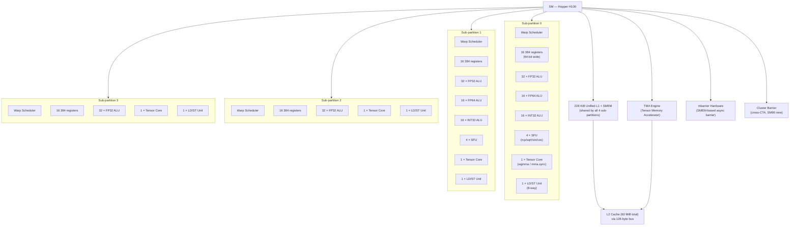
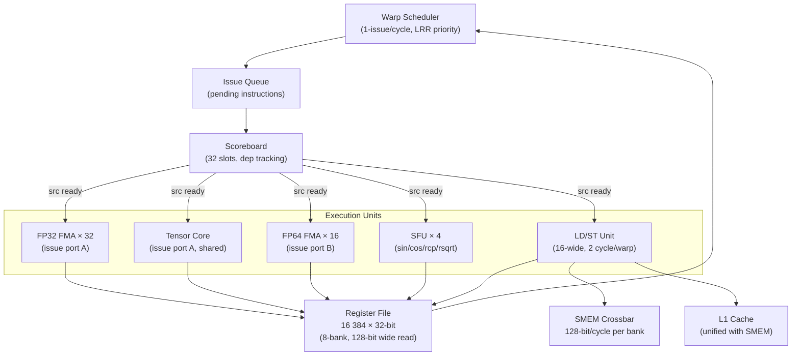

# 02 · SM 内部结构

> **Hopper SM90 的 Streaming Multiprocessor 是 GPU 算力的最小独立单元:每个 SM 含 4 个 sub-partition,各自独立调度 warp,共享 228 KiB 的 L1/SMEM 以及 TMA 和 mbarrier 等 Hopper 新增硬件。理解 SM 结构是正确估算 occupancy 和调优 kernel 的基础。**

## 1. 是什么 / 为什么有它

SM(Streaming Multiprocessor)是 GPU 的基本计算单元——可以把它类比为一个高度简化但极宽的 CPU 核。GPU 由大量 SM 组成(Hopper H100 SXM5 有 132 个 SM,PCIe 版有 114 个 SM),每个 SM 独立运行一批线程块(CTA)。CTA 之间只能通过全局内存或(Hopper 起)同一 cluster 内的 DSMEM 进行通信;CTA 内部的所有线程则共享该 SM 的寄存器堆、共享内存(SMEM)和 barrier 硬件。

与 CPU 核不同,SM 针对吞吐而非单线程延迟设计:没有大的乱序执行窗口,没有复杂的分支预测器,而是通过同时驻留大量 warp 来隐藏内存延迟。每条全局内存访问指令在 pipeline 中挂起(warp 进入 Stalled_Mem 状态)时,warp scheduler 立即切换到下一个处于 Eligible 状态的 warp 执行,从而让 ALU、Tensor Core 等功能单元保持忙碌。这种"以并发换延迟"的设计决定了 SM 内需要足够多的驻留 warp——即 occupancy 不宜过低。

理解 SM 内部结构对以下三件事至关重要:
- **正确计算 occupancy:** 活跃 warp 数由寄存器堆容量、SMEM 容量和 CTA 数上限三者共同约束,取最小值。
- **理解功能单元分配:** ALU/TC/LD-ST 等都是每 sub-partition 独有的,TMA 和 mbarrier 是 SM 级共享的。
- **理解 Hopper 新增特性:** TMA 在 SM 外部有独立 DMA 引擎,不占用 CUDA core 执行槽;mbarrier 在 SMEM 内用 64-bit 对象实现异步完成通知,是构建 pingpong pipeline 的基础。

Hopper SM90 相比 Ampere SM80 的主要改进:新增 TMA 引擎(支持最多 5D 张量搬运)、新增 mbarrier 硬件加速的到达/等待原语、支持 wgmma(warp-group MMA,整 SM 4 个 TC 协同的 128-thread MMA)、新增 cluster barrier 支持跨 CTA SMEM 访问。

**SM 与 CPU 核的根本差异在资源分配粒度:** CPU 每核有数十个寄存器,通过 register renaming 将它们虚拟化到数百个物理寄存器上;GPU 每 SM 有 65536 个物理寄存器直接以 warp 为粒度静态分配。这意味着 GPU 的资源是"宽而静态"的:每个驻留 warp 占据一组固定的寄存器槽位,不存在 rename 或超标量乱序;每个 warp 在 kernel 整个生命周期内持有这些寄存器。因此"多 warp 驻留"的代价是宝贵的 65536 个寄存器被多路瓜分——而正是这种瓜分使得 latency hiding 成为可能。理解这一设计取舍是理解 SM 结构一切细节的前提。

**SM 内部资源的三层约束:** 从资源角度看,SM 的 occupancy 受三层约束共同决定:① **寄存器堆约束**(65536 reg/SM):每 warp 消耗 32 × regs_per_thread 个寄存器,多 warp 共享总量;② **SMEM 约束**(228 KiB/SM):每 CTA 申请固定 SMEM,多 CTA 共享总量;③ **CTA 数量上限**(32 CTA/SM):硬件内置的 CTA bookkeeping 表大小。实际 occupancy 取三者允许的最小值。熟练的 Hopper 调优者会先用 ptxas verbose 确认寄存器用量,再用 ncu 的 `launch__shared_mem_per_block_dynamic` 确认 SMEM 用量,最后用 occupancy calculator 得出理论上限,与 ncu 的 `smsp__warps_active` 实测值对比,发现偏差时排查是否有动态 SMEM 漏报或 `__launch_bounds__` 配置不当。

## 2. 硬件视角(微架构细节)

Hopper SM 在物理上分为 4 个 sub-partition(又称 warp scheduler partition 或 processing block),每个 sub-partition 拥有独立的 warp scheduler、寄存器堆切片和一组功能单元,不能跨 sub-partition 调度 warp。



**关键数字(Hopper Architecture Whitepaper):**

- 寄存器堆:每 SM 65536 个 32-bit 寄存器(64-bit 数据占 2 个寄存器);均分 4 个 sub-partition,每 sub 16384 个。每个线程最多使用 255 个寄存器(ptxas 默认上限;可用 `-maxrregcount=256` 放宽到 256)。
- FP32 ALU:每 sub-partition 32 个,整 SM 共 128 个;每周期可执行 1 次 FP32 multiply-add(FMA),即 128 FMA/cycle/SM。
- FP64 ALU:每 sub-partition 16 个,整 SM 共 64 个;吞吐为 FP32 的 50%。
- INT32 ALU:每 sub-partition 16 个;与 FP32 通道物理上部分复用。
- SFU:每 sub-partition 4 个;执行 sin/cos/rcp/rsqrt 等超越函数,延迟约 16-32 周期。
- Tensor Core:每 sub-partition 1 个,整 SM 共 4 个。wgmma 需要 4 个 sub-partition 协同工作(warp-group = 128 threads = 4 warp,覆盖全部 4 sub)。
- LD/ST Unit:每 sub-partition 1 个,负责全局内存和共享内存的加载/存储。

**寄存器堆 64K / sub-partition 16K 分配规则的实际影响:**

每 SM 65536 个寄存器的分配以 warp 为单位进行:一个 warp 需要 `32 × regs_per_thread` 个寄存器。这些寄存器从该 warp 所属的 sub-partition 的 16384 个寄存器中分配。关键约束:

1. **sub-partition 粒度:** warp 0 → sub 0,warp 1 → sub 1,……,warp 4 → sub 0(循环)。单个 sub-partition 的 16384 个寄存器由该 sub 上的所有活跃 warp 共享。
2. **对齐规则:** ptxas 通常将寄存器分配对齐到 256 个(即 8 个 32-bit 寄存器 × 32 lane)的边界。若 `regs_per_thread = 40`,ptxas 实际分配 48(向上对齐到 256/32=8 的倍数);40 × 32 = 1280 个槽位,对齐后 48 × 32 = 1536。
3. **占用率瓶颈:** 若每线程 64 寄存器,128 线程 CTA = 4 个 warp = 4 × 32 × 64 = 8192 个寄存器/sub;16384 / 8192 = 2 个 CTA/sub-partition。但 CTA 必须在整个 SM(4 sub)上调度,因此 2 CTA/sub × 1 = 最多 8 CTA/SM(理论),受 SMEM 和 CTA 上限进一步约束。
4. **寄存器 spill 的实际代价:** 当 ptxas 分配超出 255/thread 时,额外寄存器溢出到 local memory(GPU L1/L2 内的线程私有区域)。溢出的 load/store 指令延迟约 28-200 cycle(L1 命中 28 cycle,L2 命中约 200 cycle),比寄存器访问(~1 cycle)慢 28-200 倍。`ptxas -v` 的 "spill stores/loads" 非零是 register pressure 的硬证据。

**LD/ST 单元:16-wide vs 32-wide warp 访问拆分:**

每个 sub-partition 的 LD/ST 单元宽度为 16(即每时钟周期处理 16 个 lane 的内存请求)。当一个完整 warp(32 lane)发出 LD/ST 指令时,该指令被拆分为 2 次 16-wide 的 half-warp 操作,分别占用 LD/ST 单元的连续 2 个时钟周期。这意味着:

- 一次 warp 的全局内存访问最少消耗 LD/ST 单元 2 个周期(即使 L1 命中)。
- 若 16 个 bank 的 SMEM 访问存在 conflict,需要多次重发;此时半 warp 可能占用更多周期。
- 从 warp scheduler 的视角看:issue 一条 LD 指令后,该 warp 至少 stall 2 个周期(half-warp dispatch 开销),之后还需等待实际的内存延迟。

**Tensor Core 与 FP32 ALU 的 issue port 共享:**

在 Hopper sub-partition 中,Tensor Core 和 FP32 ALU 共享同一组 issue port(而非完全独立的执行通道)。具体表现:

- 在同一个 sub-partition 内,同一周期不能既 issue 一条 FP32 FMA 又 issue 一条 wgmma 指令——两者共用 issue slot。
- 因此 wgmma 执行期间(实际计算由 TC pipeline 独立完成),该 sub-partition 上的 warp scheduler 在后续的若干 issue slots 上会避免 issue 新的 FP32 指令以防 port 冲突。
- 实践意义:在 wgmma-heavy 的 kernel 中,FP32 ALU 的利用率通常 <5%,因为几乎所有计算都走 TC。若强行在 wgmma 密集段插入 FP32 计算(如 epilogue 的 scale + bias),会排队等待 TC pipeline 清空,引入额外的 stall。正确做法是使用 wgmma 的 epilogue fused 操作(CUTLASS epilogue visitor)或将 FP32 epilogue 与 wgmma 的流水线交错安排。

**sub-partition 内部数据路径微架构图:**



**Scoreboard(记分牌):** 每个 sub-partition 维护一个记分牌跟踪未完成的内存和长延迟指令。warp scheduler 在准备 issue 下一条指令前检查其源寄存器是否在记分牌上;若在,warp 进入 Stalled_Dep 状态,等待上条指令写回寄存器堆后才能继续。这是一种轻量级的硬件数据相关追踪机制,避免 WAR/RAW/WAW 写读冲突。记分牌的深度决定了 warp 内指令级并行(ILP)的上限;通常 2-4 条独立指令就能填满一个 warp 的等待窗口。

**TMA(Tensor Memory Accelerator):** Hopper 新增。TMA 是 SM 外部的独立 DMA 引擎,由 kernel 通过 `cp.async.bulk.tensor` 指令触发后,不需要 warp 保持活跃等待——TMA 在后台完成数据搬运,结束后通过 mbarrier 通知 warp。这使得搬运操作不占用 CUDA core 的 issue slot,实现真正的计算与 IO 重叠。

**mbarrier 与 DSMEM 延迟数据:** Hopper 的 DSMEM(distributed shared memory)访问——即通过 cluster barrier 访问同一 cluster 内其他 CTA 的 SMEM——延迟约 25 cycle(Hopper Architecture Whitepaper §3.3,实测与 Triton/CUTLASS benchmark 一致)。这远低于 L2 cache 命中的 ~100-200 cycle。mbarrier 的 `mbarrier.try_wait.parity` 轮询开销约为 10-20 cycle(每次 try_wait 的 SMEM 读操作),因此在 tight pingpong pipeline 中应尽量减少 mbarrier 的轮询频率,使用 `mbarrier.wait` 的阻塞版本以避免忙等耗费 issue 资源。

**mbarrier:** 64-bit 共享内存对象,内含 phase bit(0/1 交替翻转)、arrived count 和 expected count。`mbarrier.arrive.shared` 令 warp 或 TMA 引擎"报到",`mbarrier.try_wait.parity` 轮询 phase 直到所有参与方全部到达。详见第 10 章。

## 3. CUDA 编程接口

与 SM 内部结构直接相关的编程接口:

**launch_bounds 限制寄存器使用:**

```cpp
// 告知编译器:每 block 最多 128 线程,每 SM 至少 4 个 block
// ptxas 会限制寄存器用量以满足 4 block/SM 的 occupancy 目标
__global__ __launch_bounds__(128, 4)
void my_kernel(float *d_out) {
    // ...
}
```

`maxThreadsPerBlock` 参数影响 ptxas 的寄存器分配策略;`minBlocksPerSm` 给 ptxas 一个 occupancy 下界目标。两者不强制,只是编译器提示。

**运行时 occupancy 查询:**

```cpp
int numBlocks;
// 查询给定 blockSize 下每 SM 最多同时运行多少个 block
cudaOccupancyMaxActiveBlocksPerMultiprocessor(
    &numBlocks,
    my_kernel,   // kernel 函数指针
    128,         // block 中线程数
    0            // 动态 SMEM 大小(字节)
);
// numBlocks = min(8, regs_limit, smem_limit, warp_limit) 的结果
```

**PTX maxntid 指示:**

```ptx
.visible .entry my_kernel(.param .u64 d_out)
.maxntid 128, 1, 1   // 等价于 __launch_bounds__(128)
{
    // kernel body
}
```

ptxas 看到 `.maxntid` 后知道每 block 上限,调整寄存器分配以最大化 occupancy。

**设置最大 SMEM 与 TMA 协同使用模式:**

```cpp
// Hopper 上使用 TMA 时的典型 kernel 属性设置
cudaFuncSetAttribute(
    my_kernel,
    cudaFuncAttributeMaxDynamicSharedMemorySize,
    128 * 1024  // 128 KiB SMEM,用于 TMA pingpong 双缓冲
);

// 同时设置 cluster 配置(8 CTA/cluster,全部 GPC-local)
cudaFuncSetAttribute(
    my_kernel,
    cudaFuncAttributePreferredClusterDimX,
    8  // 8 CTA per cluster
);
```

上述两个 attribute 通常配合使用:大 SMEM 支持双缓冲 + warp-specialization,cluster 配置支持 DSMEM 前缀和等跨 CTA 通信原语。注意两者都会影响 occupancy:增大 SMEM 减少可驻留 CTA 数,增大 cluster 尺寸要求更多 SM 同时保留给一个 cluster。

**实现导读 — CUTLASS 3.x 的 SM 资源分配策略:** CUTLASS 3.x 的 `TileScheduler` 组件(`include/cutlass/gemm/kernel/tile_scheduler_params.h`)负责根据 SM 数量和 cluster 尺寸计算每个 SM 的 tile 分配。`PersistentTileScheduler` 使用 grid-stride 循环:每个 SM 上的 persistent kernel 持续处理 tile,直到所有 tile 处理完毕;这避免了 tail effect(最后一波不满 SM 数量的 tile 导致大量 SM 空闲)。理解这一调度机制需要先掌握 SM 的 CTA 并发数(occupancy)限制。

**wgmma 的跨 sub-partition 协同机制:** wgmma(warp-group MMA)指令要求 warp-group(4 个 warp,分属 4 个 sub-partition)协同操作,因为 Tensor Core 的矩阵计算需要跨 4 个 TC(每 sub-partition 1 个 TC)分配工作。发出 wgmma 时,4 个 warp 各自携带矩阵 A/B/C 的一个 fragment;4 个 TC 并行执行各自分到的子矩阵乘法,结果通过 SM 内部的互连总线写回各 warp 的寄存器。从 warp scheduler 角度:4 个 sub-partition 的 scheduler 需要"同步"地 issue wgmma 指令(实际由编译器插入 `warpgroup.arrive` / `warpgroup.wait` 配合),否则部分 sub-partition 的 TC 提前完成但其他仍在计算,导致数据不一致。这一约束决定了 wgmma 只能由 warp-group(128 线程)整体发出,不能由单个 warp 独立调用。

**查询寄存器实际分配量:**

```bash
# 编译时输出寄存器/线程数量(ptxas verbose)
nvcc -arch=sm_90a -Xptxas=-v my_kernel.cu 2>&1 | grep "registers"
# 示例输出: ptxas info    : Used 64 registers, 512 bytes smem, 1024 bytes cmem[0]
```

若输出中 `Used X registers` 超过 `__launch_bounds__` 的 minBlocksPerSm 约束允许的值(可用 CUDA Occupancy Calculator 计算),ptxas 会自动 spill 到 local memory 以满足约束——这时需要权衡是否值得牺牲 spill 代价换取更高 occupancy。

## 4. 关键性能指标

**Occupancy 公式** (CUDA C++ Programming Guide §K.7):

```
occupancy = min(
    max_cta_per_sm,                        // Hopper: 最大 32 CTA/SM
    floor(max_warps_per_sm / warps_per_cta),    // Hopper: 64 warp/SM
    floor(regs_per_sm / regs_per_cta),          // 65536 / (threads × regs_per_thread)
    floor(smem_per_sm / smem_per_cta)           // 228 KiB / dynamic_smem_per_cta
)
```

实际 occupancy 受三个约束同时限制,取最小值。常见瓶颈:

- **寄存器压力:** 每线程使用 64 个寄存器时,128 线程 CTA 需要 128 × 64 = 8192 个寄存器;65536 / 8192 = 8 CTA/SM,不构成瓶颈。若每线程 128 寄存器,则只能跑 4 CTA/SM。
- **SMEM 压力:** 若每 CTA 动态 SMEM 为 64 KiB,228 KiB / 64 KiB = 3 CTA/SM,严重限制 occupancy。
- **CTA 上限:** Hopper 每 SM 最多 32 个 CTA(Hopper Whitepaper),但实际因寄存器或 SMEM 限制通常达不到。

**Sub-partition 独立调度的影响:** 4 个 sub-partition 各自独立 issue warp,不会"帮"其他 sub-partition 的 warp 执行。因此 warp 应尽量均匀分布在 4 个 sub-partition 上。一个 CTA 内的 warp 按 warp_id 模 4 分配到不同 sub-partition:warp 0→sub0,warp 1→sub1,以此类推。若 CTA 只有 1 个 warp(即 32 线程的 block),则 3 个 sub-partition 空闲,整 SM 的算力利用率上限降至 25%。

**实用经验:** 对 Hopper,推荐每 CTA 使用 128 或 256 线程(恰好覆盖所有 4 个 sub-partition 的整数倍 warp),同时通过 `cudaOccupancyMaxActiveBlocksPerMultiprocessor` 确认每 SM 能跑多少个这样的 CTA,再乘以 SM 数量决定 grid size。若寄存器不成为瓶颈,目标是让每 SM 至少跑 2 个 CTA 以提供足够的 warp 轮转空间。对于 wgmma persistent kernel,4 个 warp/warp-group × 1 warp-group = 4 warp(128 线程)是最小功能单元;建议至少 2 个 warp-group/CTA(即 256 线程)以允许 producer-consumer warp 专化。

**寄存器堆的 bank 结构与访问冲突:** Hopper 的寄存器堆使用多 bank 设计(通常 8 个 bank,每 bank 128-bit 宽),允许同一周期读取多个操作数。FP32 FMA 指令需要同时读取 3 个寄存器(src0、src1、src2)加 1 个写入目标;若这 3 个源寄存器落在不同 bank,可以并行读取;若有 bank 冲突,需要额外周期。ptxas 的寄存器分配算法会尝试避免 bank 冲突,但在寄存器压力较高(接近 255/thread 上限)时,分配空间受限,冲突不可避免。手动调整寄存器变量顺序(如通过 `.reg` 声明顺序影响寄存器号分配)是极端调优中减少 bank 冲突的技巧,但通常没必要——编译器已经处理了大部分情况。

**真实案例 — GPT-70B 前向传播的寄存器压力分析:**

GPT-70B 的 attention 层使用 FlashAttention-2 kernel(sm90 路径),每 warp 处理一个 attention head 的部分:典型配置下 `regs_per_thread ≈ 72`(含 Q/K/V 分块寄存器 + 累加器 + 控制寄存器)。以 128 线程/CTA 计算:

- 寄存器需求:128 × 72 = 9216 个/CTA
- 每 SM 可容纳:65536 / 9216 ≈ 7 CTA(寄存器不是瓶颈)
- SMEM 需求(FlashAttention-2):~48 KiB/CTA(Q 块 + K/V 块双缓冲)
- 每 SM SMEM 可容纳:228 KiB / 48 KiB ≈ 4 CTA → **SMEM 是瓶颈**,实际 occupancy = 4 CTA/SM

FlashAttention-3(Hopper 优化版)通过以下方式缓解 SMEM 压力:① 使用 TMA descriptor 进行异步搬运,允许 SMEM 中同时只保留正在计算的 K/V 块;② 引入 warp-specialization,producer warp-group 负责 TMA load,consumer warp-group 负责 wgmma,两者 SMEM 缓冲区分开管理。结果:在保持高 wgmma 利用率的同时,每 CTA SMEM 需求降至 ~32 KiB,允许 SM 跑 6-7 CTA,occupancy 提升约 50%(Shah et al., arxiv 2407.08608)。

**寄存器压力的设计权衡 — 高寄存器 vs 高 occupancy:** 并非所有 kernel 都应该追求最高 occupancy。对于 compute-bound 的 wgmma kernel,寄存器中保留更大的累加器矩阵(更多寄存器)可以减少 SMEM 访问频率和 wgmma 指令的 commit 次数,整体吞吐更高——即使 occupancy 从 8 CTA/SM 降至 4 CTA/SM。关键判断依据:若 `smsp__warp_issue_stalled_long_scoreboard_per_warp_active.pct` < 20%(说明内存不是瓶颈),降低 occupancy 换取更高 ILP 是合理的;若该 stall 占比 > 50%(内存主导),则需要更多 warp 来隐藏延迟,应优化 occupancy。

**多 CTA 竞争的 SMEM 碎片问题:** 当 SM 上同时驻留多个 CTA,每个 CTA 各自分配独立的 SMEM 区间,不存在动态碎片——SMEM 以 CTA 为单位静态分配,kernel 执行期间不能调整。若某 CTA 动态 SMEM 申请量(通过 `<<<grid, block, smem_bytes>>>`)与实际使用量不匹配(申请多、使用少),浪费的 SMEM 会减少 SM 上可驻留的其他 CTA 数量。对 adaptive 算法(不同输入需要不同 SMEM 量),建议按最大需求静态申请并在 kernel 内部管理,而非依赖多次 kernel 启动。

## 5. 代码示例

**示例一:使用 `__launch_bounds__` 与 occupancy API**

```cpp
#include <cuda_runtime.h>
#include <cstdio>

// __launch_bounds__(maxThreadsPerBlock, minBlocksPerSm)
__global__ __launch_bounds__(256, 2)
void compute_kernel(const float *__restrict__ in,
                    float *__restrict__ out, int n) {
    int tid = blockIdx.x * blockDim.x + threadIdx.x;
    if (tid < n) {
        // 简单 elementwise 计算
        float x = in[tid];
        out[tid] = x * x + 2.0f * x + 1.0f;
    }
}

int main() {
    // 查询理论 occupancy
    int numBlocksPerSm = 0;
    cudaOccupancyMaxActiveBlocksPerMultiprocessor(
        &numBlocksPerSm, compute_kernel, 256, 0);
    printf("blocks per SM: %d\n", numBlocksPerSm);

    // 根据 SM 数量计算推荐 grid size
    int deviceId;
    cudaGetDevice(&deviceId);
    cudaDeviceProp prop;
    cudaGetDeviceProperties(&prop, deviceId);
    int gridSize = prop.multiProcessorCount * numBlocksPerSm;

    const int N = 1 << 20;
    float *d_in, *d_out;
    cudaMalloc(&d_in, N * sizeof(float));
    cudaMalloc(&d_out, N * sizeof(float));

    compute_kernel<<<gridSize, 256>>>(d_in, d_out, N);
    cudaDeviceSynchronize();

    cudaFree(d_in);
    cudaFree(d_out);
    return 0;
}
```

**示例二:PTX `.maxntid` 与寄存器限制指令**

```ptx
// 使用 .maxntid 声明限制线程数,同时用 .maxnreg 限制寄存器
.visible .entry compute_kernel(
    .param .u64 param_in,
    .param .u64 param_out,
    .param .u32 param_n
)
.maxntid 256, 1, 1     // 每 block 最多 256 线程
.maxnreg 64            // 每线程最多 64 个寄存器
{
    .reg .u32 %r<4>;
    .reg .u64 %rd<3>;
    .reg .f32 %f<2>;

    ld.param.u64 %rd0, [param_in];
    ld.param.u64 %rd1, [param_out];
    ld.param.u32 %r0, [param_n];

    mov.u32 %r1, %ctaid.x;
    mov.u32 %r2, %ntid.x;
    mov.u32 %r3, %tid.x;
    mad.lo.u32 %r3, %r1, %r2, %r3;   // tid = blockIdx.x * blockDim.x + threadIdx.x

    // bounds check
    setp.ge.u32 %p0, %r3, %r0;
    @%p0 bra END;

    // 加载 + 计算 + 存储(略)
END:
    ret;
}
```

## 6. 实测手段

**NSight Compute 关键 metric:**

```bash
# 查看寄存器与 SMEM 用量
ncu --metrics launch__registers_per_thread,\
launch__shared_mem_per_block_static,\
launch__shared_mem_per_block_dynamic \
./my_app

# 查看 warp 活跃率(sub-partition 级)
ncu --metrics smsp__warps_active.avg.pct_of_peak_sustained_active,\
smsp__inst_issued.sum \
./my_app

# 查看功能单元利用率
ncu --metrics smsp__inst_executed_pipe_fma.avg.pct_of_peak_sustained_active,\
smsp__inst_executed_pipe_tensor_op_hmma.avg.pct_of_peak_sustained_active,\
smsp__inst_executed_pipe_lsu.avg.pct_of_peak_sustained_active \
./my_app
```

- `launch__registers_per_thread` — 实际分配的寄存器数/线程,影响 occupancy 计算。
- `smsp__warps_active.avg.pct_of_peak_sustained_active` — 活跃 warp 占峰值的百分比;低于 50% 说明 occupancy 或 stall 是瓶颈。
- `smsp__inst_executed_pipe_fma.*` — FP32/FP64 FMA pipeline 利用率;低说明计算资源未被充分使用。
- `smsp__inst_executed_pipe_lsu.*` — LD/ST pipeline 利用率;高说明内存访问是主要压力。
- `smsp__inst_executed_pipe_tensor_op_hmma.*` — Tensor Core HMMA pipeline 利用率;对 wgmma-heavy kernel 目标值应 > 70%,否则说明 mbarrier 等待、TC issue throttle 或寄存器 forwarding 延迟导致 TC 空转。

**功能单元利用率解读:** NSight Compute 的 `smsp__inst_executed_pipe_*.avg.pct_of_peak_sustained_active` 系列 metric 给出各执行单元的利用率百分比。在 wgmma-heavy kernel 中,典型数字:TC pipeline ~70-85%,FP32 pipeline ~3-8%,LSU pipeline ~15-25%。如果 TC < 50% 且 warp occupancy 合理,通常说明 mbarrier 同步或 TMA prefetch 不足导致消费者 warp 等待 SMEM 数据——应检查 `smsp__warp_issue_stalled_mio_throttle` 和 `smsp__warp_issue_stalled_barrier` stall 占比。

**检测 register spill:**

```bash
# 编译时检测 spill(ptxas verbose)
nvcc -arch=sm_90a -Xptxas=-v my_kernel.cu 2>&1 | grep -E "registers|spill"
# 正常输出: Used 64 registers, 0 bytes lmem
# 有 spill:  Used 96 registers, 256 bytes lmem  ← lmem > 0 说明有 spill

# 运行时 metric:spill 到 local memory 的 load/store 次数
ncu --metrics l1tex__t_sectors_pipe_lsu_mem_local_op_ld.sum,\
l1tex__t_sectors_pipe_lsu_mem_local_op_st.sum \
./my_app
```

`lmem > 0`(local memory 用量非零)结合 `l1tex__t_sectors_pipe_lsu_mem_local_op_ld/st` 非零可确认 register spill 的发生。spill 到 L1 命中时约 28 cycle,L1 miss 到 L2 约 200 cycle——严重的 spill 会让 kernel 性能退化 3-10×。

## 7. 常见反模式

1. **盲目增大 block 大小以"提高并行度"** — block 内线程数增大会使每 CTA 寄存器需求上升(threads × regs_per_thread),当超过每 SM 寄存器总量(65536)的 1/8 时,每 SM 最多 8 个 block 的上限首先被触及;超过 1/4 时降为 4 个 block。实际 occupancy 可能反而因寄存器压力降低。

2. **忽略 sub-partition 调度独立性** — 若一个 block 只有 2 个 warp,只有 sub0 和 sub1 各跑 1 个 warp,sub2 和 sub3 空闲。SM 实际吞吐减半。正确做法:让每个 CTA 的 warp 数量至少为 4 的倍数(即线程数 ≥ 128)。

3. **误以为 4 个 scheduler 可以跨 sub-partition 调度** — sub-partition 之间不共享 warp。一个 sub-partition 上的 warp 全部 stall 时,该 sub-partition 就无法 issue,即便其他 sub-partition 有空闲执行资源也无法补位。这是 Hopper(以及 Ampere、Turing)的硬件约束。

4. **在 SFU 密集 kernel 里不考虑 SFU 数量比** — SFU 每 sub-partition 只有 4 个,而 FP32 ALU 有 32 个;SFU 吞吐是 FP32 的 1/8。大量使用 `__sinf`、`__cosf`、`__expf` 等超越函数的 kernel 容易在 SFU 上形成瓶颈,应考虑查表或多项式近似替代。

5. **忽略 `.maxnreg` 与 ptxas 寄存器溢出(register spilling)** — 当 ptxas 分配寄存器超出 255/线程时,额外变量会被溢出到 local memory(实质上是 GPU L1/L2 cache 内的线程私有区域),访问延迟从 ~1 周期变为 ~100+ 周期。`ptxas -v` 输出中的 "spill stores/loads" 非零表明存在溢出。

6. **TC 密集段插入孤立 FP32 epilogue 导致 port 冲突** — 在 wgmma 后紧跟大量 FP32 scale + bias 计算(如未融合的 epilogue),会因为 TC 和 FP32 共享 issue port 而引入 port 排队 stall。正确做法:利用 CUTLASS epilogue visitor tree(EVT)将 scale/bias fused 进 wgmma 的 epilogue stage,由编译器自动安排 TC pipeline 后的 FP32 计算时序,减少 stall。

7. **DSMEM 访问代价估计不准** — 某些开发者将 DSMEM(cluster 内跨 CTA SMEM 访问)的延迟与本地 SMEM 混淆。实测 DSMEM 访问约 25 cycle(经 GPC crossbar),而本地 SMEM(L1 命中)约 28 cycle——两者相近,但 DSMEM 的带宽受 GPC crossbar 总线宽度约束,在高并发 cluster 访问下可能出现拥塞。若多个 CTA 同时大量访问邻居 SMEM,实际带宽可能低于单次测量值。

8. **TMA 触发后不等待 mbarrier 直接读 SMEM** — TMA 引擎在后台异步搬运数据,完成时通过 mbarrier `arrive`。若 warp 在 `mbarrier.try_wait.parity` 返回 false 时(mbarrier 尚未就绪)直接访问 SMEM 目标区域,读到的是旧数据或不完整数据——这是 TMA 使用中最常见的 race condition。调试方法:`cuda-memcheck --tool racecheck` 可以检测 SMEM 的读写竞争;但 TMA 引起的 race 在 racecheck 中可能不直接报告,需要在 mbarrier wait 前后加断言(如用 NSight Compute 的 `sass__inst_executed` 逐指令跟踪)。

9. **混淆 `__launch_bounds__` 的编译器提示与硬件约束语义** — `__launch_bounds__(maxTPB, minBPS)` 只是告诉编译器"优化目标",不是硬件 assertion。若实际 launch 时传入的 blockDim.x > maxTPB,kernel 仍然可以执行,但寄存器分配可能超出 minBPS 的 occupancy 假设,导致实际 occupancy 低于预期。正确使用方式:用 CUDA Occupancy Calculator 或 `cudaOccupancyMaxActiveBlocksPerMultiprocessor` 验证实际 occupancy,与 `__launch_bounds__` 目标对比,发现偏差时调整参数。

## 8. 延伸阅读

- Hopper Architecture Whitepaper — *SM Architecture*(§3)([https://resources.nvidia.com/en-us-tensor-core/gtc22-whitepaper-hopper](https://resources.nvidia.com/en-us-tensor-core/gtc22-whitepaper-hopper))
- CUDA C++ Programming Guide — § K.7 *Compute Capability 9.x*([https://docs.nvidia.com/cuda/cuda-c-programming-guide/#compute-capability-9-x](https://docs.nvidia.com/cuda/cuda-c-programming-guide/#compute-capability-9-x))
- CUDA C++ Programming Guide — § K.7.1 *Architecture*([https://docs.nvidia.com/cuda/cuda-c-programming-guide/#architecture-10](https://docs.nvidia.com/cuda/cuda-c-programming-guide/#architecture-10))
- CUDA Best Practices Guide — § 10 *Execution Configuration Optimizations*([https://docs.nvidia.com/cuda/cuda-c-best-practices-guide/#execution-configuration-optimizations](https://docs.nvidia.com/cuda/cuda-c-best-practices-guide/#execution-configuration-optimizations))
- PTX ISA — § 5.1 *State Spaces*,§ 5.3.1 *Register State Space*([https://docs.nvidia.com/cuda/parallel-thread-execution/#state-spaces](https://docs.nvidia.com/cuda/parallel-thread-execution/#state-spaces))
- CUDA Sample: `6_Performance/LimitingFactor`([https://github.com/NVIDIA/cuda-samples/tree/master/Samples/6_Performance](https://github.com/NVIDIA/cuda-samples/tree/master/Samples/6_Performance))

**关于 SMEM 228 KiB 的可配置划分:** Hopper 的 228 KiB 统一 L1 + SMEM 可通过 `cudaFuncSetAttribute(kernel, cudaFuncAttributeMaxDynamicSharedMemorySize, bytes)` 调整 SMEM 占比。默认配置下约 128 KiB 为 SMEM,100 KiB 为 L1;调用上述 API 后可最高分配 228 KiB 给 SMEM(牺牲全部 L1)。注意:增大 SMEM 通常也意味着减少 occupancy(每 CTA 占用更多 SMEM → SM 只能跑更少 CTA)。对 wgmma 密集型 kernel,通常将 SMEM 最大化(最大化 tile 大小以提升 arithmetic intensity),接受更低 occupancy;对 memory-bound kernel,保留足够 L1 容量更重要。
- FlashAttention-3 — Shah et al., 2024, arxiv 2407.08608 — §4 warp-specialization + SM90 sub-partition 利用分析;包含 SM 资源占用与 occupancy 的详细 ablation table
- CUTLASS 3.x — `include/cutlass/gemm/kernel/sm90_gemm_tma_warpspecialized_pingpong.hpp`([https://github.com/NVIDIA/cutlass](https://github.com/NVIDIA/cutlass))
