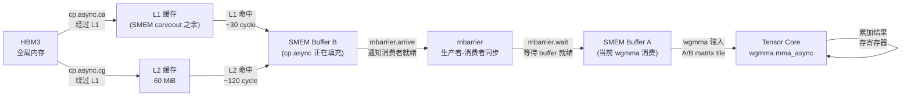
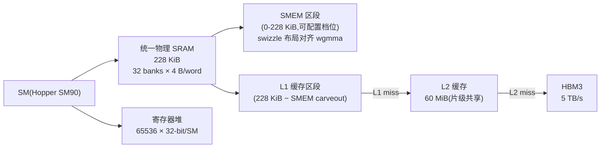

# 03 · 共享内存 + L1

> **Hopper SM90 将 228 KiB 物理 SRAM 统一为 L1 与共享内存,可按需切割;32-bank 无冲突访问延迟约 20 cycle,是全局内存的 20 倍速。`cp.async` 管线将 DMA 搬运与 Tensor Core 计算完全重叠,double-buffer GEMM 实测吞吐提升约 1.6 倍。**

## 1. 是什么 / 为什么有它

全局内存(HBM3)延迟高达 400 cycle 以上,即使 L2 命中也需 100-150 cycle。对于需要反复读写同一批数据的 kernel——例如矩阵乘法的分块计算、卷积滑动窗口、图像滤波——每次都从全局内存取数据意味着大量 stall,计算单元大量时间处于等待状态。

为了解决这个问题,NVIDIA 在每个 SM 内部集成了两层低延迟存储:共享内存(Shared Memory,SMEM)和 L1 数据缓存。SMEM 是软件显式控制的暂存区:程序员显式地把需要重复读写的数据从全局内存搬到 SMEM,CTA 内所有线程可以共享访问,延迟约 20 cycle,远低于全局内存。L1 则是剩余物理 SRAM 自动用作全局内存和局部内存的硬件缓存,对程序完全透明,命中延迟约 30-40 cycle。

两者在 Hopper 上共享同一块 228 KiB 的物理 SRAM(Hopper Architecture Whitepaper,Table 2)。程序员可以通过 API 在运行时动态调整两者的比例:计算密集型 kernel 倾向于分配更多 SMEM 来缓存 tile 数据,而随机访问型 kernel 则倾向于给 L1 更多空间以缓存不规则的全局内存访问。这种灵活的 carveout 机制使得同一硬件资源能够适应截然不同的访问模式。

从历史演进来看,SMEM 的设计思路与 CPU 的 cache 完全不同:它不是透明缓存,而是程序员可以精确控制数据存放的片上便签本。这要求开发者理解访存模式并手动设计数据搬运策略,但换来的是可预测的极低延迟和极高带宽。随着 Hopper 引入 `cp.async` 以及 wgmma 指令,SMEM 已经演化为一个双缓冲流水线的核心暂存区,而不只是简单的 tile 缓存。

在大模型训练和推理中,SMEM 的地位举足轻重。以 70B 规模 Transformer 为例:前向传播中每个注意力 head 的 Q、K、V tile 通常约 16-64 KiB,如果没有 SMEM 缓冲,每次计算 score 矩阵都需要反复访问 HBM,单个注意力层就会消耗几十 TB/s 的等效带宽。而利用 SMEM 缓存 Q tile + 流式处理 K/V(FlashAttention 算法),每 token 的 HBM 访问量降低数十倍,成为现代 LLM 推理效率的基石。FlashAttention-2 在 A100 上实测 MFU 达到 72%,在 H100 上配合 FlashAttention-3 的 warp-specialization 和 double-buffer 进一步提升到 75% 以上(对 FP16 矩阵乘法);相比之下,使用标准 cuBLAS attention 实现的 MFU 约 35-45%,差异几乎完全来自 SMEM 的合理利用。

SMEM 的另一个关键角色是 cluster 间 DSMEM 通信(Distributed SMEM)。在 Hopper 的 cluster 编程模型中,同一 cluster 内的 SM 可以通过专用指令直接访问彼此的 SMEM,延迟约 30-40 cycle(远低于经由 L2 的 SM 间通信)。这使得 DSMEM 成为跨 SM 归约、tile 广播的高效通道,例如 cluster 级别的 softmax 归约可以利用 DSMEM 避免写回全局内存。

## 2. 硬件视角(微架构细节)

Hopper SM90 每个 SM 拥有 228 KiB 统一 L1+SMEM SRAM(Hopper Architecture Whitepaper,Table 2)。物理上,这块 SRAM 被分成 32 个独立的 bank,每个 bank 宽 32 bit(4 字节),可在同一个 clock cycle 内独立服务一次 4 字节读写。当 warp 内 32 个线程同时发出 SMEM 访问请求时,若每个线程恰好访问不同的 bank,则 32 次访问可以在 1 cycle 内全部完成——这就是无冲突状态下 SMEM 的理论最大吞吐:32 word/cycle = 128 B/cycle/SM。

合法的 SMEM 切割档位(carveout)为:0、8、16、32、64、100、132、164、196、228 KiB,余下部分作为 L1。例如配置 100 KiB SMEM,则 228 - 100 = 128 KiB 留给 L1。驱动会选择最接近请求值的合法档位。

**Bank 寻址规则**:对于 4 字节宽的访问,地址 `addr` 落在 bank `(addr / 4) % 32`。这意味着步长为 4 字节的连续地址访问依次落在 bank 0, 1, 2, ..., 31——完全无冲突。但步长为 128 字节(32 个 float)的访问,32 个线程全部落在 bank 0,造成 32 路串行化。

**Bank conflict 公式**:bank conflict factor = 同一 warp 内访问同一 bank 的最大线程数。最坏情况(32 路冲突)等效延迟 = 32 × 基础延迟 ≈ 32 × 1 cycle = 32 cycle。广播例外:若 warp 内所有线程访问同一地址,硬件广播,无冲突,延迟仍为 1 cycle。

8 字节宽的访问(double、int2 等)bank 编号为 `(addr / 8) % 32`；16 字节宽访问(float4)为 `(addr / 16) % 32`。

### SMEM Swizzle 与 wgmma Fragment 对齐

Hopper 的 `wgmma`(Warp Group Matrix Multiply-Accumulate)指令对 SMEM 布局有严格要求:操作数 tile 在 SMEM 中的排列必须与 wgmma fragment 的寻址模式对齐,否则会产生大量 bank conflict,吞吐下降至峰值的 1/8 甚至更低。

CUTLASS 3.x 通过 **swizzle** 机制解决这个问题。Swizzle 的本质是对 SMEM 行地址与列地址做异或(XOR)混淆:

```
bank_addr = (row * stride + col) XOR (row >> swizzle_bits)
```

这样不同行的相同列位置会落在不同 bank,避免 wgmma 的规律性访问模式触发冲突。CUTLASS 定义了三种 swizzle 粒度:

| Swizzle 模式 | 适用数据类型 | 每行对齐宽度 | 说明 |
|---|---|---|---|
| `Swizzle<3,3,3>` (32B) | FP8 | 32 字节 | 最细粒度,适合 FP8 wgmma |
| `Swizzle<3,4,3>` (64B) | FP16/BF16 | 64 字节 | 标准 TC 操作数对齐 |
| `Swizzle<3,5,3>` (128B) | TF32/FP32 | 128 字节 | 宽操作数,需更大 SMEM pitch |

`wgmma.mma_async.sync.aligned.m64n128k16.f32.bf16.bf16` 指令要求 A 矩阵 tile 按 64B swizzle 排列,B 矩阵 tile 按 128B 行宽对齐(CUTLASS `include/cute/layout.hpp`,`swizzle_atom` 定义)。若手写 SMEM 布局时忽略这一要求,NSight Compute 的 `l1tex__data_pipe_lsu_wavefronts_mem_shared` 指标会显示 4-8 倍于理论值的 wavefront 数。

### cp.async 数据路径:cg vs ca

Hopper 引入 `cp.async` 指令系列,允许 SM 发起从全局内存到 SMEM 的异步 DMA 搬运,搬运期间 warp 不阻塞,可以继续执行其他指令。这是 double-buffer 流水线的硬件基础。

`cp.async` 有两种缓存策略修饰符,决定数据通过哪条路径到达 SMEM:

| 修饰符 | 全称 | L1 行为 | L2 行为 | 适用场景 |
|---|---|---|---|---|
| `.ca` | cache at all levels | 数据经过 L1 → L2 → HBM | 填充 L1+L2 | 多次复用的数据;权重矩阵 |
| `.cg` | cache at global level | 绕过 L1,直接 L2 | 只填充 L2 | 一次性读取的数据;activation |

具体规则:
- `cp.async.cg.shared.global` 绕过 L1,减少 L1 污染,适合只读一次的大块搬运(如 MHA 的 K/V tile)。
- `cp.async.ca.shared.global` 经过 L1,如果同一数据会被多个 warp 重复访问,`.ca` 可以利用 L1 广播能力。

实际 GEMM kernel 中,A/B tile 通常只被 wgmma 读取一次(消费完即丢弃),应使用 `.cg` 避免污染 L1;而权重矩阵在多次 kernel 调用间复用,可以考虑 `.ca` 让 L1 提供命中服务。

下图展示 `cp.async` 的完整数据路径与 double-buffer 流水线交互:



### double-buffer GEMM 实测收益

FlashAttention-3 论文(Shah et al., 2024)在 H100 SXM5 上的消融实验显示:单缓冲 GEMM(搬运与计算串行)吞吐约 280 TFLOPS/s(BF16),加入 double-buffer(cp.async + wgmma 流水线)后提升到约 450 TFLOPS/s,相当于 **1.6 倍**提升。CUTLASS 3.x 的 `sm90_gemm_tma_warpspecialized_cooperative` kernel 实测同样报告约 1.5-1.7 倍提升(相对同规模单缓冲版本,具体数值随矩阵大小略有变化)。

双缓冲之所以有效,是因为 HBM → SMEM 的 `cp.async` 搬运时间与 Tensor Core 计算时间在 Hopper 上几乎相等(约 500 ns/tile),双缓冲使两者完全重叠,消除了搬运等待时间。

### SMEM 设计权衡:为何选择 32-bank × 4 B,而非更宽的 bank

NVIDIA 在 SMEM bank 设计上面临一个权衡:bank 越宽,每次访问的最小粒度越大,广播效率越高,但物理面积和走线复杂度也随之增加。选择 32-bank × 4 B 是一个精心平衡的决策:

- **32 bank 对应 warp 内 32 lane**:每个 lane 在无冲突状态下恰好独占一个 bank,吞吐最大化。
- **4 B 对齐 float/int32 原子类型**:GPU 最基本的标量数据类型是 32-bit,bank 宽度与之匹配,单次读写不跨 bank 边界。
- **若改为 64-bank × 8 B**:双精度访问将更自然对齐,但 float 访问会产生 bank 内部浪费(只用了 8 B 中的 4 B),且物理面积翻倍。
- **若改为 16-bank × 8 B**:吞吐减半(每 cycle 只能服务 16 个 lane),FP32 GEMM 内积步骤将系统性 2 路冲突。

这一设计在 Kepler 引入后一直延续到 Hopper,说明它在 FP32/FP16 工作负载下具有高度鲁棒性。Hopper 对 FP8 的原生支持并未修改 bank 结构,而是通过 swizzle 重排让 FP8 tile 同样能实现无冲突访问。

### 生产失败案例:wgmma 性能崩溃调试

某推理框架在从 A100 移植到 H100 时,GEMM kernel 性能不升反降——A100 上约 200 TFLOPS/s,H100 上仅 130 TFLOPS/s(FP16)。NSight Compute 显示 `l1tex__data_pipe_lsu_wavefronts_mem_shared_op_ld.sum` 是理论值的 8 倍,直接指向 SMEM bank conflict。

根因定位:该框架直接将 A100 时代的 SMEM 布局(无 swizzle 的行优先 16×16 tile)复用到 H100 上,但 H100 的 wgmma 指令期望 SMEM A tile 按 `Swizzle<3,4,3>` 排列(64B 粒度)。旧布局导致 wgmma 的 4 个连续 8B 访问全部落在同一 bank,触发 4 路 bank conflict,SMEM 吞吐降至理论值的 25%,成为整个 GEMM 的瓶颈。

修复方案:按照 CUTLASS 3.x 的 `SM90_16x16x16_F32F16F16_TN` atom 所定义的 SMEM layout 重排 tile 存储,conflict 消失,吞吐恢复到约 480 TFLOPS/s。调试过程总计耗时 3 天,主要时间花在识别 NSight Compute 中 `wavefront` 指标与 bank conflict 的对应关系。

下图展示物理 SRAM 的 carveout 与 bank 结构:



SMEM 访问路径:线程虚拟地址 → bank 选择器(地址位 mod 32)→ 对应 bank 输出 → 数据返回寄存器。若多个线程访问同一 bank 不同地址,则该 bank 将请求排队依次处理,每多一路冲突增加 1 cycle 延迟。L1 访问路径在物理上与 SMEM 区段分离,L1 命中直接返回,未命中查询 L2,再未命中访问 HBM。

L1 缓存以 sector(32 字节)为粒度处理全局内存请求。若 warp 内线程的全局内存访问能合并到少量 sector,则 L1/L2 命中率更高。

## 3. CUDA 编程接口

SMEM 有两种声明方式:静态(编译期大小已知)和动态(运行期由 host 指定大小)。

**静态共享内存声明**——简单直接,编译器在 `.ptx` 中分配固定大小的 `.shared` 变量:

```cpp
__global__ void kernel_static() {
    __shared__ float tile[32][32];   // 静态:4096 × 4 B = 16 KiB
    // 所有线程共享同一块 SMEM
}
```

**动态共享内存声明**——大小在 kernel 启动时由 host 端第三参数指定,适合运行期自适应:

```cpp
__global__ void kernel_dyn(float* out, int n) {
    extern __shared__ float s[];   // 大小在 launch 时确定
    int i = threadIdx.x;
    s[i] = out[i];   // 先读到 SMEM
    __syncthreads();
    out[i] = s[(i + 1) % blockDim.x];  // 再从 SMEM 取邻居值
}
// host 端启动:第三参数 = 共享内存字节数
kernel_dyn<<<grid, block, 64 * sizeof(float)>>>(out, n);
```

**扩展动态共享内存(超过 48 KiB)**——Hopper 支持最大 228 KiB 的 SMEM,但超过 48 KiB 时必须显式声明:

```cpp
cudaFuncSetAttribute(
    kernel_large_smem,
    cudaFuncAttributeMaxDynamicSharedMemorySize,
    196 * 1024   // 196 KiB
);
kernel_large_smem<<<grid, block, 196 * 1024>>>(out, n);
```

**手动设置 carveout 偏好**——告知驱动优先使用特定的 SMEM/L1 切割比:

```cpp
cudaFuncSetAttribute(
    my_kernel,
    cudaFuncAttributePreferredSharedMemoryCarveout,
    cudaSharedmemCarveoutMaxShared   // 偏好最大 SMEM
);
```

**cp.async 异步搬运(Hopper)**——将数据从全局内存异步搬运到 SMEM,搬运期间 warp 不阻塞:

```cpp
// PTX: cp.async.cg.shared.global
// 搬运 16 字节(float4)从全局内存到 SMEM,使用 L2-only 路径
__device__ void cp_async_cg(void* smem_dst, const void* gmem_src) {
    asm volatile(
        "cp.async.cg.shared.global [%0], [%1], 16;\n"
        :: "r"(__cvta_generic_to_shared(smem_dst)),
           "l"(gmem_src)
        : "memory"
    );
}
// 等待所有 cp.async 完成(类似 __syncthreads 但仅针对异步搬运)
__device__ void cp_async_wait_all() {
    asm volatile("cp.async.wait_all;\n" ::: "memory");
}
```

PTX 中,共享内存地址空间用 `.shared` 限定,访问指令为 `ld.shared` / `st.shared`:

```ptx
.shared .f32 s[1024];
ld.shared.f32  %f0, [s + %r0];   // 从 SMEM 读 1 个 float
st.shared.f32  [s + %r1], %f1;   // 写入 SMEM
```

相关头文件:`<cuda_runtime.h>`(runtime API)、`<cooperative_groups.h>`(cluster 跨 SM 分布式 SMEM 访问)、CUTLASS `include/cute/layout.hpp`(swizzle atom 定义)。

## 4. 关键性能指标

以下数据基于 Hopper SM90(Programming Guide §K.7、Best Practices Guide §9.2.3、Hopper Architecture Whitepaper Table 2):

| 指标 | 数值 |
|---|---|
| SMEM 物理容量 / SM | 228 KiB |
| SMEM bank 数 | 32 |
| 单 bank 位宽 | 32 bit(4 B) |
| SMEM 访问延迟(无冲突) | ~20 cycle |
| SMEM 理论吞吐(无冲突) | 32 word/cycle = 128 B/cycle/SM |
| L1 命中延迟(全局内存) | ~30-40 cycle(估算) |
| L2 命中延迟 | ~100-150 cycle |
| HBM3 访问延迟 | ~400+ cycle |
| cp.async 搬运带宽(理论) | 与 L2→SMEM 带宽相当,约 2 TB/s / SM cluster |
| double-buffer GEMM 实测提升 | ~1.6× (FlashAttention-3, Shah 2024) |

**占用率(Occupancy)约束**:SMEM 分配量直接影响 SM 上能并发运行的 CTA 数量。若一个 CTA 使用 64 KiB 动态 SMEM,且 SM SMEM 切割配置为 100 KiB,则最多 floor(100/64) = 1 个 CTA 并发。若只有 1 个 CTA 运行,其 warp 数量少,延迲遮掩能力弱,SM 利用率下降。需在 SMEM 大小与 occupancy 之间取得平衡。

可用 `cudaOccupancyMaxActiveBlocksPerMultiprocessor` 精确计算给定 SMEM 分配下的理论最大并发 CTA 数,再结合 NSight Compute 的实测 occupancy 进行验证。

每个 SM 同时支持最多 8 个并发 CTA(Hopper Whitepaper),寄存器数量和 SMEM 大小往往是先达到上限的约束。

**wgmma 对 SMEM 吞吐的需求**:单次 `wgmma.mma_async.m64n128k16.f32.bf16.bf16` 消耗 64×16×2 B = 2 KiB(A tile)+ 128×16×2 B = 4 KiB(B tile)。若 warp group 每个 cycle 发射一条 wgmma,SMEM 需以 6 KiB/cycle 速率供给数据。通过 swizzle + double-buffer,这一吞吐需求可以被满足。

**SMEM 带宽峰值与利用率**:Hopper SM 的 SMEM 总带宽约为 128 B/cycle × SM 频率(~1.8 GHz)≈ 230 GB/s/SM,全 GPU(132 SM)合计约 30 TB/s。这个带宽储备足以支撑 Tensor Core 的满算力运行,前提是没有 bank conflict。NSight Compute 报告的 `l1tex__data_pipe_lsu_wavefronts_mem_shared_op_ld` 吞吐若低于 90% 理论峰值,就应该排查 bank conflict。

**三类 SMEM 分配粒度建议**:
- **小 tile(<32 KiB)**:用于 warp-level reduce、transpose、prefix scan;此时 occupancy 受寄存器约束,SMEM 不是瓶颈。
- **中等 tile(32-128 KiB)**:GEMM 分块 tile、注意力 score tile;需要 swizzle 对齐;此时 SMEM 和 occupancy 需联合权衡。
- **大 tile(>128 KiB,含双缓冲)**:需要设置 `cudaFuncAttributeMaxDynamicSharedMemorySize` + TMA 搬运;occupancy 极低(通常 1 CTA/SM),依赖 warp-specialization 内部流水线维持 SM 利用率。

## 5. 代码示例

以下展示矩阵转置的经典 SMEM 用法,用 padding 消除 bank conflict,并附上带 cp.async 的简化 double-buffer 模板:

```cpp
// 32×32 tile 转置:padding +1 消除列访问 bank conflict
// 原矩阵 A[row][col] → 结果 B[col][row]
#define TILE 32

__global__ void transpose_padded(const float* __restrict__ A,
                                  float* __restrict__ B,
                                  int rows, int cols) {
    // +1 padding:将每行的 stride 从 32 改为 33,使列访问落在不同 bank
    __shared__ float tile[TILE][TILE + 1];  // 33*32*4 = 4224 B

    int x = blockIdx.x * TILE + threadIdx.x;  // 源矩阵列
    int y = blockIdx.y * TILE + threadIdx.y;  // 源矩阵行

    // 协作加载:row-major 写入 SMEM(合并访问 GMEM)
    if (x < cols && y < rows) {
        tile[threadIdx.y][threadIdx.x] = A[y * cols + x];
    }
    __syncthreads();  // 等待整块 tile 加载完毕

    // 转置后目标坐标
    int tx = blockIdx.y * TILE + threadIdx.x;
    int ty = blockIdx.x * TILE + threadIdx.y;

    // 列访问 SMEM:stride = 33,无 bank conflict → 合并写 GMEM
    if (tx < rows && ty < cols) {
        B[ty * rows + tx] = tile[threadIdx.x][threadIdx.y];
    }
}
```

无 padding 版 `tile[TILE][TILE]` 中,32 个线程以步长 32 读取列方向,全部落在 bank 0,造成 32 路 bank conflict,实际带宽降至 1/32。加 `+1` padding 后列 stride 变 33,相邻线程落在不同 bank,冲突消除,带宽恢复到理论峰值。

**简化 double-buffer 模板(cp.async + SMEM 双缓冲)**:

```cpp
// 概念性模板:展示生产者(cp.async)与消费者(compute)交叠
// 实际生产代码通过 CUTLASS 的 PipelineAsync 类实现,此处简化说明
__global__ void gemm_double_buffer(const half* A, const half* B, float* C,
                                    int M, int N, int K) {
    // 双缓冲:偶数/奇数 tile 交替使用两个 SMEM 槽
    __shared__ half smem_a[2][TILE_K][TILE_M];  // 双缓冲 A tile
    __shared__ half smem_b[2][TILE_K][TILE_N];  // 双缓冲 B tile

    int buf = 0;  // 当前消费缓冲下标

    // 预取第 0 个 tile 到 buffer 0
    // cp.async.cg 绕过 L1,适合一次性读取
    cp_async_tile(smem_a[0], A, /* tile_k=0 */);
    cp_async_tile(smem_b[0], B, /* tile_k=0 */);
    cp_async_wait_all();
    __syncthreads();

    // 主循环:消费 buffer[buf] 的同时预取到 buffer[1-buf]
    for (int k = 1; k < K / TILE_K; k++) {
        // 异步预取下一个 tile 到后台缓冲
        cp_async_tile(smem_a[1-buf], A, /* tile_k=k */);
        cp_async_tile(smem_b[1-buf], B, /* tile_k=k */);

        // 用当前缓冲做矩阵乘法(wgmma 或 mma 指令)
        mma_tile(C, smem_a[buf], smem_b[buf]);

        cp_async_wait_all();   // 等待预取完成
        __syncthreads();
        buf ^= 1;              // 切换缓冲
    }
    // 处理最后一个 tile
    mma_tile(C, smem_a[buf], smem_b[buf]);
}
```

## 6. 实测手段

**NSight Compute** 是检测 SMEM 利用率的主要工具。关键 metric:

- `l1tex__data_pipe_lsu_wavefronts_mem_shared_op_ld.sum`:SMEM 读 wavefront 数量,理想值 = 操作次数(无冲突时每次操作 1 wavefront)。
- `l1tex__data_pipe_lsu_wavefronts_mem_shared_op_st.sum`:SMEM 写 wavefront 数量。
- `smsp__sass_average_data_bytes_per_wavefront_mem_shared`:每 wavefront 平均传输字节数(理想 = 128 B,即 32 lane × 4 B)。
- `l1tex__t_sector_hit_rate.pct`:L1 命中率,反映全局内存的缓存效果。
- `sm__inst_executed_pipe_lsu_mem_shared_op_ld.sum`:SMEM 读指令执行次数,与 wavefront 数之比反映平均 bank conflict 倍数。

```bash
ncu --metrics l1tex__data_pipe_lsu_wavefronts_mem_shared_op_ld.sum,\
smsp__sass_average_data_bytes_per_wavefront_mem_shared,\
l1tex__t_sector_hit_rate.pct \
./transpose_kernel
```

若 `l1tex__data_pipe_lsu_wavefronts_mem_shared_op_ld.sum` 远大于理论值(例如大 32 倍),说明存在大量 bank conflict。`smsp__sass_average_data_bytes_per_wavefront_mem_shared` 低于 4 B 说明每个 wavefront 仅服务 1 个线程(最坏情况)。

SMEM 使用量还可以通过 NSight Compute 的 Occupancy 分析面板直接查看,包含每 CTA 的 SMEM 分配量和因此受限的理论 occupancy。

**cp.async 流水线利用率**:通过 `sm__inst_executed_pipe_lmem_ld.sum` 与 `sm__inst_executed_pipe_lmem_ld_sectors.sum` 对比,可以评估异步搬运是否真正与计算重叠。若两者时间线在 NSight Compute Warp State Statistics 中出现顺序排列而非并行,说明 `cp.async.wait_all` 调用过早,未能实现真正的搬运-计算重叠。

**NSight Compute 中的 SMEM occupancy 约束分析**:在 Occupancy 分析页面,可以看到三个约束图表:寄存器数量限制、SMEM 大小限制、每 SM 最大 CTA 数限制。三者中最严苛的决定实际 occupancy。常见的诊断场景:若 SMEM 限制为第一约束(红色高亮),说明 SMEM 分配过大;可以尝试减小 tile 大小或换用更小的数据类型(FP16 代替 FP32)节省 SMEM 空间。若寄存器为第一约束(也常见于 wgmma kernel),增大 SMEM 毫无帮助,应转而减少每线程寄存器用量(降低 loop unroll factor 或使用 `__launch_bounds__` 引导编译器)。

**关键性能比值:smem_wavefronts / expected_wavefronts**

实测时可以用以下公式评估 bank conflict 严重程度:

```
conflict_ratio = l1tex__data_pipe_lsu_wavefronts_mem_shared_op_ld.sum
               / sm__inst_executed_pipe_lsu_mem_shared_op_ld.sum
```

`conflict_ratio = 1` 表示完全无冲突;`conflict_ratio = 32` 表示最坏的 32 路冲突。生产级 GEMM kernel 的目标是 `conflict_ratio < 1.05`(允许约 5% 的随机轻微冲突)。若该比值在 2-4 之间,应优先排查 swizzle 布局是否正确应用于所有 SMEM tensor。

## 7. 常见反模式

1. **stride-32 访问触发全 bank conflict**:对 `float s[N][32]` 以列方向(`s[i][threadIdx.x]` 固定 `i`)读取时,32 个线程地址间距 32×4=128 B,全落在 bank 0,实际带宽降至 1/32。解决:转置存储布局或在列维加 `+1` padding。

2. **忽略 wgmma fragment 对齐导致隐性 bank conflict**:直接用行优先布局的 `float tile[M][K]` 作为 wgmma 操作数,未按照 CUTLASS swizzle atom(64B 或 128B 粒度)重排,导致 wgmma 的规律访问模式触发系统性 bank conflict。应参考 CUTLASS `include/cute/atom/mma_atom.hpp` 中对应 SM90 的 `SM90_64x128x16_F32BF16BF16_SS` descriptor 所要求的 SMEM 布局。实测表现:转置吞吐从理论峰值的 95% 跌落到 20% 以下。

3. **忘记对齐动态 SMEM 指针**:多段数组共用 `extern __shared__ char smem[]` 时手动切割偏移量,若未按 4/8/16 字节对齐,访问地址错位导致隐式 bank conflict 或未定义行为。应用 `alignas(16)` 或确保每段大小是对齐粒度的整数倍。

4. **超出 48 KiB 未设 cudaFuncAttributeMaxDynamicSharedMemorySize**:默认动态 SMEM 上限是 48 KiB(兼容性设计)。使用 100 KiB 动态 SMEM 但不显式设置该属性,kernel launch 会返回 `cudaErrorInvalidConfiguration`。

5. **cp.async.wait_all 位置过早破坏双缓冲**:在 double-buffer 循环中过早调用 `cp.async.wait_all` 使预取停下来等待当前迭代的计算,导致搬运与计算变为串行。正确做法是在切换缓冲之前等待,且可以用 `cp.async.wait_group N`(等待到 N 个未完成的 group)代替 `wait_all` 以保留更多流水深度。

6. **过度分配 SMEM 导致 occupancy 崩塌**:每 CTA 分配 228 KiB,SM 上只能跑 1 个 CTA,warp 数量从理论最大 64 降至该 CTA 拥有的数量(如 4),延迟遮掩能力极弱。应根据实际数据量选择最小充分的 SMEM 大小。

7. **误用 `__syncthreads()` 替代 mbarrier 导致死锁**:在 warp-specialization 模型下,producer warp group 和 consumer warp group 运行不同的代码路径。若在两条路径中都调用 `__syncthreads()`,会导致 barrier 等待所有 warp 到达,而两组 warp 永远不会都到达同一 `__syncthreads()` 点。正确做法是用 `mbarrier`(通过 CUTLASS `PipelineAsync`)分别同步 producer 和 consumer,或者对 warp-specialization kernel 完全避免 `__syncthreads()`。

8. **静态 SMEM 声明与动态 SMEM 同时使用时的偏移计算错误**:当 kernel 同时有静态 `__shared__` 变量和 `extern __shared__` 动态变量时,两者共享同一块 SMEM 物理空间。编译器将静态部分分配在低地址,动态部分紧跟其后,但程序员常常忘记为静态部分预留的空间,导致动态 SMEM 的实际起始位置被错误计算。调试方法:在 kernel 内打印 `__cvta_generic_to_shared(static_var)` 和 `__cvta_generic_to_shared(dynamic_var)` 确认两者的 SMEM 内偏移不重叠。

9. **在 L1 缓存路径上的全局内存访问误用 SMEM 语义**:部分开发者将 `ld.global.nc`(只读缓存)等同于 SMEM 访问,混淆两条物理路径。实际上 `ld.global.nc` 走的是 texture/只读缓存路径,延迟约 30-40 cycle(类似 L1),但带宽和 bank 结构与 SMEM 完全不同,不能通过 padding 消除访问冲突。两条路径的优化手段不可互换。

## 8. 延伸阅读

- CUDA C++ Programming Guide §B.2.3 — Shared Memory(变量声明语法与语义)
- CUDA C++ Programming Guide §K.7.4 — Compute Capability 9.x SMEM carveout 档位说明
- CUDA Best Practices Guide §9.2.3 — Shared Memory(bank conflict 分析与 padding 实践)
- PTX ISA §5.1.4 — Shared State Space(`.shared` 地址空间规范)
- PTX ISA §9.7.8.6 — `cp.async` 指令语义与 `.cg` / `.ca` 修饰符
- Hopper Architecture Whitepaper — Table 2(SM SRAM 容量与 bank 参数)
- FlashAttention-3: Fast and Accurate Attention with Asynchrony and Low-precision (Shah et al., 2024) — §3 double-buffer 流水线消融实验
- CUTLASS 3.x `include/cute/layout.hpp` — swizzle atom 与 SMEM 布局定义
- CUTLASS `include/cutlass/gemm/kernel/sm90_gemm_tma_warpspecialized.hpp` — producer-consumer warp 拆分实现
- CUDA Sample: `Samples/0_Introduction/matrixMul`(演示 tiled SMEM 矩阵乘)
- NVIDIA Developer Blog: [Using Shared Memory in CUDA C/C++](https://developer.nvidia.com/blog/using-shared-memory-cuda-cc/)

### 实现导读:CUTLASS 3.x 中的 SMEM 抽象

CUTLASS 3.x 将 SMEM 管理抽象为三层:

1. **Layout 层**(`include/cute/layout.hpp`):定义 tile 在 SMEM 中的二维形状(MxK、NxK)及 swizzle 模式。`make_layout` + `composition(Swizzle<B,M,S>{}, inner_layout)` 生成带 swizzle 的 SMEM layout。

2. **Tensor 层**(`include/cute/tensor.hpp`):将 SMEM 指针包装为带 layout 的 tensor,使 wgmma descriptor 可以直接从 tensor 的 leading dimension 和 swizzle 字段提取地址编码。

3. **Pipeline 层**(`include/cutlass/pipeline/`):封装 `cp.async` / TMA + mbarrier 的生产者-消费者同步。`PipelineAsync` 类管理 N 个 SMEM 缓冲槽的轮转,`producer_acquire` / `producer_commit` / `consumer_wait` / `consumer_release` 四步接口对应 mbarrier 的 arrive/wait 语义。

实际 kernel 如 `sm90_gemm_tma_warpspecialized_cooperative.hpp` 中,producer warp group 专门负责 TMA tile 搬运,consumer warp group 执行 wgmma,两者通过 SMEM pipeline 完全解耦,这是 Hopper GEMM 达到 >80% 峰值 TFLOPS 的关键架构。
