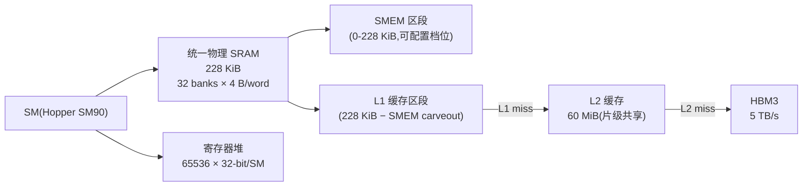

# 03 · 共享内存 + L1

> **Hopper SM90 将 228 KiB 物理 SRAM 统一为 L1 与共享内存,可按需切割;32-bank 无冲突访问延迟约 20 cycle,是全局内存的 20 倍速。**

## 1. 是什么 / 为什么有它

全局内存(HBM3)延迟高达 400 cycle 以上,即使 L2 命中也需 100-150 cycle。对于需要反复读写同一批数据的 kernel——例如矩阵乘法的分块计算、卷积滑动窗口、图像滤波——每次都从全局内存取数据意味着大量 stall,计算单元大量时间处于等待状态。

为了解决这个问题,NVIDIA 在每个 SM 内部集成了两层低延迟存储:共享内存(Shared Memory,SMEM)和 L1 数据缓存。SMEM 是软件显式控制的暂存区:程序员显式地把需要重复读写的数据从全局内存搬到 SMEM,CTA 内所有线程可以共享访问,延迟约 20 cycle,远低于全局内存。L1 则是剩余物理 SRAM 自动用作全局内存和局部内存的硬件缓存,对程序完全透明,命中延迟约 30-40 cycle。

两者在 Hopper 上共享同一块 228 KiB 的物理 SRAM(Hopper Architecture Whitepaper,Table 2)。程序员可以通过 API 在运行时动态调整两者的比例:计算密集型 kernel 倾向于分配更多 SMEM 来缓存 tile 数据,而随机访问型 kernel 则倾向于给 L1 更多空间以缓存不规则的全局内存访问。这种灵活的 carveout 机制使得同一硬件资源能够适应截然不同的访问模式。

从历史演进来看,SMEM 的设计思路与 CPU 的 cache 完全不同:它不是透明缓存,而是程序员可以精确控制数据存放的片上便签本。这要求开发者理解访存模式并手动设计数据搬运策略,但换来的是可预测的极低延迟和极高带宽。

## 2. 硬件视角(微架构细节)

Hopper SM90 每个 SM 拥有 228 KiB 统一 L1+SMEM SRAM(Hopper Architecture Whitepaper,Table 2)。物理上,这块 SRAM 被分成 32 个独立的 bank,每个 bank 宽 32 bit(4 字节),可在同一个 clock cycle 内独立服务一次 4 字节读写。当 warp 内 32 个线程同时发出 SMEM 访问请求时,若每个线程恰好访问不同的 bank,则 32 次访问可以在 1 cycle 内全部完成——这就是无冲突状态下 SMEM 的理论最大吞吐:32 word/cycle = 128 B/cycle/SM。

合法的 SMEM 切割档位(carveout)为:0、8、16、32、64、100、132、164、196、228 KiB,余下部分作为 L1。例如配置 100 KiB SMEM,则 228 - 100 = 128 KiB 留给 L1。驱动会选择最接近请求值的合法档位。

**Bank 寻址规则**:对于 4 字节宽的访问,地址 `addr` 落在 bank `(addr / 4) % 32`。这意味着步长为 4 字节的连续地址访问依次落在 bank 0, 1, 2, ..., 31——完全无冲突。但步长为 128 字节(32 个 float)的访问,32 个线程全部落在 bank 0,造成 32 路串行化。

**Bank conflict 公式**:bank conflict factor = 同一 warp 内访问同一 bank 的最大线程数。最坏情况(32 路冲突)等效延迟 = 32 × 基础延迟 ≈ 32 × 1 cycle = 32 cycle。广播例外:若 warp 内所有线程访问同一地址,硬件广播,无冲突,延迟仍为 1 cycle。

8 字节宽的访问(double、int2 等)bank 编号为 `(addr / 8) % 32`；16 字节宽访问(float4)为 `(addr / 16) % 32`。

下图展示 SM 内 SMEM/L1 物理映射与可配置 carveout:



SMEM 访问路径:线程虚拟地址 → bank 选择器(地址位 mod 32)→ 对应 bank 输出 → 数据返回寄存器。若多个线程访问同一 bank 不同地址,则该 bank 将请求排队依次处理,每多一路冲突增加 1 cycle 延迟。L1 访问路径在物理上与 SMEM 区段分离,L1 命中直接返回,未命中查询 L2,再未命中访问 HBM。

L1 缓存以 sector(32 字节)为粒度处理全局内存请求。若 warp 内线程的全局内存访问能合并到少量 sector,则 L1/L2 命中率更高。

## 3. CUDA 编程接口

SMEM 有两种声明方式:静态(编译期大小已知)和动态(运行期由 host 指定大小)。

**静态共享内存声明**——简单直接,编译器在 `.ptx` 中分配固定大小的 `.shared` 变量:

```cpp
__global__ void kernel_static() {
    __shared__ float tile[32][32];   // 静态:4096 × 4 B = 16 KiB
    // 所有线程共享同一块 SMEM
}
```

**动态共享内存声明**——大小在 kernel 启动时由 host 端第三参数指定,适合运行期自适应:

```cpp
__global__ void kernel_dyn(float* out, int n) {
    extern __shared__ float s[];   // 大小在 launch 时确定
    int i = threadIdx.x;
    s[i] = out[i];   // 先读到 SMEM
    __syncthreads();
    out[i] = s[(i + 1) % blockDim.x];  // 再从 SMEM 取邻居值
}
// host 端启动:第三参数 = 共享内存字节数
kernel_dyn<<<grid, block, 64 * sizeof(float)>>>(out, n);
```

**扩展动态共享内存(超过 48 KiB)**——Hopper 支持最大 228 KiB 的 SMEM,但超过 48 KiB 时必须显式声明:

```cpp
cudaFuncSetAttribute(
    kernel_large_smem,
    cudaFuncAttributeMaxDynamicSharedMemorySize,
    196 * 1024   // 196 KiB
);
kernel_large_smem<<<grid, block, 196 * 1024>>>(out, n);
```

**手动设置 carveout 偏好**——告知驱动优先使用特定的 SMEM/L1 切割比:

```cpp
cudaFuncSetAttribute(
    my_kernel,
    cudaFuncAttributePreferredSharedMemoryCarveout,
    cudaSharedmemCarveoutMaxShared   // 偏好最大 SMEM
);
```

PTX 中,共享内存地址空间用 `.shared` 限定,访问指令为 `ld.shared` / `st.shared`:

```ptx
.shared .f32 s[1024];
ld.shared.f32  %f0, [s + %r0];   // 从 SMEM 读 1 个 float
st.shared.f32  [s + %r1], %f1;   // 写入 SMEM
```

相关头文件:`<cuda_runtime.h>`(runtime API)、`<cooperative_groups.h>`(cluster 跨 SM 分布式 SMEM 访问)。

## 4. 关键性能指标

以下数据基于 Hopper SM90(Programming Guide §K.7、Best Practices Guide §9.2.3、Hopper Architecture Whitepaper Table 2):

| 指标 | 数值 |
|---|---|
| SMEM 物理容量 / SM | 228 KiB |
| SMEM bank 数 | 32 |
| 单 bank 位宽 | 32 bit(4 B) |
| SMEM 访问延迟(无冲突) | ~20 cycle |
| SMEM 理论吞吐(无冲突) | 32 word/cycle = 128 B/cycle/SM |
| L1 命中延迟(全局内存) | ~30-40 cycle(估算) |
| L2 命中延迟 | ~100-150 cycle |
| HBM3 访问延迟 | ~400+ cycle |

**占用率(Occupancy)约束**:SMEM 分配量直接影响 SM 上能并发运行的 CTA 数量。若一个 CTA 使用 64 KiB 动态 SMEM,且 SM SMEM 切割配置为 100 KiB,则最多 floor(100/64) = 1 个 CTA 并发。若只有 1 个 CTA 运行,其 warp 数量少,延迟遮掩能力弱,SM 利用率下降。需在 SMEM 大小与 occupancy 之间取得平衡。

可用 `cudaOccupancyMaxActiveBlocksPerMultiprocessor` 精确计算给定 SMEM 分配下的理论最大并发 CTA 数,再结合 NSight Compute 的实测 occupancy 进行验证。

每个 SM 同时支持最多 8 个并发 CTA(Hopper Whitepaper),寄存器数量和 SMEM 大小往往是先达到上限的约束。

## 5. 代码示例

以下展示矩阵转置的经典 SMEM 用法,用 padding 消除 bank conflict:

```cpp
// 32×32 tile 转置:padding +1 消除列访问 bank conflict
// 原矩阵 A[row][col] → 结果 B[col][row]
#define TILE 32

__global__ void transpose_padded(const float* __restrict__ A,
                                  float* __restrict__ B,
                                  int rows, int cols) {
    // +1 padding:将每行的 stride 从 32 改为 33,使列访问落在不同 bank
    __shared__ float tile[TILE][TILE + 1];  // 33*32*4 = 4224 B

    int x = blockIdx.x * TILE + threadIdx.x;  // 源矩阵列
    int y = blockIdx.y * TILE + threadIdx.y;  // 源矩阵行

    // 协作加载:row-major 写入 SMEM(合并访问 GMEM)
    if (x < cols && y < rows) {
        tile[threadIdx.y][threadIdx.x] = A[y * cols + x];
    }
    __syncthreads();  // 等待整块 tile 加载完毕

    // 转置后目标坐标
    int tx = blockIdx.y * TILE + threadIdx.x;
    int ty = blockIdx.x * TILE + threadIdx.y;

    // 列访问 SMEM:stride = 33,无 bank conflict → 合并写 GMEM
    if (tx < rows && ty < cols) {
        B[ty * rows + tx] = tile[threadIdx.x][threadIdx.y];
    }
}
```

无 padding 版 `tile[TILE][TILE]` 中,32 个线程以步长 32 读取列方向,全部落在 bank 0,造成 32 路 bank conflict,实际带宽降至 1/32。加 `+1` padding 后列 stride 变 33,相邻线程落在不同 bank,冲突消除,带宽恢复到理论峰值。

## 6. 实测手段

**NSight Compute** 是检测 SMEM 利用率的主要工具。关键 metric:

- `l1tex__data_pipe_lsu_wavefronts_mem_shared_op_ld.sum`:SMEM 读 wavefront 数量,理想值 = 操作次数(无冲突时每次操作 1 wavefront)。
- `l1tex__data_pipe_lsu_wavefronts_mem_shared_op_st.sum`:SMEM 写 wavefront 数量。
- `smsp__sass_average_data_bytes_per_wavefront_mem_shared`:每 wavefront 平均传输字节数(理想 = 128 B,即 32 lane × 4 B)。
- `l1tex__t_sector_hit_rate.pct`:L1 命中率,反映全局内存的缓存效果。

```bash
ncu --metrics l1tex__data_pipe_lsu_wavefronts_mem_shared_op_ld.sum,\
smsp__sass_average_data_bytes_per_wavefront_mem_shared,\
l1tex__t_sector_hit_rate.pct \
./transpose_kernel
```

若 `l1tex__data_pipe_lsu_wavefronts_mem_shared_op_ld.sum` 远大于理论值(例如大 32 倍),说明存在大量 bank conflict。`smsp__sass_average_data_bytes_per_wavefront_mem_shared` 低于 4 B 说明每个 wavefront 仅服务 1 个线程(最坏情况)。

SMEM 使用量还可以通过 NSight Compute 的 Occupancy 分析面板直接查看,包含每 CTA 的 SMEM 分配量和因此受限的理论 occupancy。

## 7. 常见反模式

1. **stride-32 访问触发全 bank conflict**:对 `float s[N][32]` 以列方向(`s[i][threadIdx.x]` 固定 `i`)读取时,32 个线程地址间距 32×4=128 B,全落在 bank 0,实际带宽降至 1/32。解决:转置存储布局或在列维加 `+1` padding。

2. **忘记对齐动态 SMEM 指针**:多段数组共用 `extern __shared__ char smem[]` 时手动切割偏移量,若未按 4/8/16 字节对齐,访问地址错位导致隐式 bank conflict 或未定义行为。应用 `alignas(16)` 或确保每段大小是对齐粒度的整数倍。

3. **超出 48 KiB 未设 cudaFuncAttributeMaxDynamicSharedMemorySize**:默认动态 SMEM 上限是 48 KiB(兼容性设计)。使用 100 KiB 动态 SMEM 但不显式设置该属性,kernel launch 会返回 `cudaErrorInvalidConfiguration`。

4. **过度分配 SMEM 导致 occupancy 崩塌**:每 CTA 分配 228 KiB,SM 上只能跑 1 个 CTA,warp 数量从理论最大 64 降至该 CTA 拥有的数量(如 4),延迟遮掩能力极弱。应根据实际数据量选择最小充分的 SMEM 大小。

5. **在 SMEM 上做大跨步 scatter write**:随机目标地址写入 SMEM,每次写的 bank 不同且不可预测,多个 warp 争用,产生大量冲突排队。应改为先在寄存器中完成计算,再按 coalesced 顺序批量写入。

## 8. 延伸阅读

- CUDA C++ Programming Guide §B.2.3 — Shared Memory(变量声明语法与语义)
- CUDA C++ Programming Guide §K.7.4 — Compute Capability 9.x SMEM carveout 档位说明
- CUDA Best Practices Guide §9.2.3 — Shared Memory(bank conflict 分析与 padding 实践)
- PTX ISA §5.1.4 — Shared State Space(`.shared` 地址空间规范)
- Hopper Architecture Whitepaper — Table 2(SM SRAM 容量与 bank 参数)
- CUDA Sample: `Samples/0_Introduction/matrixMul`(演示 tiled SMEM 矩阵乘)
- NVIDIA Developer Blog: [Using Shared Memory in CUDA C/C++](https://developer.nvidia.com/blog/using-shared-memory-cuda-cc/)
