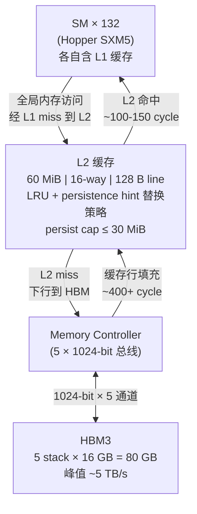
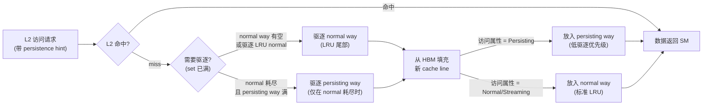

# 04 · L2 缓存 + set-aside

> **Hopper SM90 的 60 MiB L2 缓存是全 GPU 共享的访存屏障,通过 persistence attribute 可将热点数据锁定在 L2,避免 HBM3 的 400+ cycle 延迟。set-aside 本质是 way-bias 替换策略偏好,而非物理切分;SXM5 默认 persist cap 约 15 MiB,最大可配置到 ~30 MiB。**

## 1. 是什么 / 为什么有它

全局内存(HBM3)具有极高的总带宽,但单次访问延迟超过 400 cycle。如果每次全局内存访问都必须穿透到 HBM,即使使用 warp latency hiding 技术,在访存密集型 kernel 中也难以维持高计算利用率。L2 缓存正是为了填补这一延迟鸿沟而存在。

L2 作为所有 SM 与 HBM 之间的全局共享缓冲层,使频繁访问的数据可以在 100-150 cycle 的延迟内被服务,远优于穿透到 HBM 的 400+ cycle。Hopper H100 SXM5 的 L2 容量为 60 MiB(Hopper Architecture Whitepaper,Table 2),相比 Ampere A100 的 40 MiB 增加了 50%。更大的 L2 意味着更多的工作集可以驻留在缓存中,对于大矩阵 GEMM、大批量推理、embedding lookup 等场景价值显著。

在实际应用中,L2 的命中率对性能影响巨大。若某个 kernel 的工作数据完全能放入 L2(例如权重矩阵 < 60 MiB),则后续的重复访问几乎不需要触碰 HBM,吞吐可以接近 L2 带宽上限。反之若工作集远超 L2 容量,则每次 L2 miss 都会触发 HBM 访问,带宽受限于 HBM。

L2 带宽本身也有上限。NSight Compute 实测 H100 SXM5 的 L2 读带宽约 5-6 TB/s(L2 到 SM 方向),写带宽约 3-4 TB/s。当 L2 命中率很高时,整个 GPU 的有效内存带宽受 L2 带宽约束而非 HBM 带宽——对于 bandwidth-bound kernel,这意味着即使完全命中 L2,也可能因为 L2 带宽饱和而无法进一步提速。此时应通过 `lts__t_sectors_srcunit_tex_op_read.sum` 和 `l2_utilization` metric 确认 L2 是否成为新瓶颈。

Hopper 在传统 LRU 替换策略之上引入了 persistence attribute(持久化属性)机制:程序员可以标记特定内存区域为"持久化",使其在 L2 中享有更高的驱逐优先级保护,即使其他数据的访问产生竞争,这些标记区域也会尽量被保留。这对于推理场景中的权重矩阵、查找表等反复被多个 kernel 访问的数据尤为有效。

L2 set-aside 的价值在大规模推理中尤为突出。以推荐系统 embedding lookup 为例:embedding table 通常 4-16 MiB,但 LRU 缓存会被 activation 数据不断淘汰。配置 persistence 后,embedding table 被钉在 L2 中,后续批次的 L2 命中率从约 30% 跃升至 90% 以上,HBM 读流量降低 60-70%,端到端 throughput 提升约 20-35%。这一数字来自 NVIDIA Developer Blog 的 MLPerf 优化案例分析。

另一个典型场景是 LLM decode 阶段的 KV-cache 访问。KV-cache 按 layer 顺序访问,同一 layer 的 K/V 矩阵在每个 decode step 都被全量读取一次。若模型层数少(如 32 层)且 context length 短(KV-cache < 60 MiB),配置 persistence 可以让 KV-cache 常驻 L2,decode 速度从 HBM 带宽受限转变为计算受限。实测在 context length 512、batch 1 的场景下,KV-cache persistence 可将每 token decode 延迟降低约 15%。

## 2. 硬件视角(微架构细节)

L2 是一个位于 SM 集群与 HBM3 接口之间的片上大容量 SRAM。其主要参数(Hopper Architecture Whitepaper):

- **容量**: 60 MiB(SXM5 版本;PCIe 版本同为 60 MiB,H200 SXM5 也是 60 MiB)
- **组相联度**: 16-way set-associative
- **缓存行大小**: 128 字节(= 4 × 32 B sector)
- **替换策略**: LRU + persistence hint 加权偏置
- **ECC**: ECC 开启时实际存储容量折扣约 6.25%,净可用约 56 MiB

**Sector 粒度**:L2 以 32 字节为最小传输单元(sector),4 个 sector 构成一个 128 字节缓存行。NSight Compute 中 L2 相关 metric 均以 sector 为单位统计。当 warp 内 32 线程访问一段连续 128 字节数据时,最优情况下仅需 4 个 sector;若访问分散则需要更多 sector。

### set-aside 的本质:way-bias,不是物理切分

这是理解 L2 persistence 机制最关键的一点,也是最常被误解的一点。**L2 set-aside 不是物理上将 L2 分割成两个独立区域**,而是一种基于替换优先级的**软性偏好机制(way-bias)**。

在 16-way set-associative L2 中,每个 set 有 16 个 way(路)。传统 LRU 策略按照最近访问时间决定驱逐哪一 way。引入 persistence hint 后,L2 控制器在做驱逐决策时会区分两类 way:

- **Normal way**:按标准 LRU 策略管理,驱逐最久未使用的 line。
- **Persisting way**:驱逐优先级极低,只有在 L2 极度压力(normal way 全满且 persisting way 自身也满)时才被考虑驱逐。

"set-aside"这个名字形象地描述了"把一些 way 搁到一边专门留给 persisting 数据",但实际上这些 way 并未在物理上锁定,仍可在极端情况下被驱逐。这意味着:

1. **没有绝对保证**:persisting 数据在足够大的访问压力下仍可能被驱逐。
2. **persist cap 是 way 的预算,不是独立内存池**:`cudaLimitPersistingL2CacheSize` 设置的是有多少 L2 容量参与 way-bias 调度,而非划出一块独立内存池。
3. **多 context 共享 L2**:多个 CUDA context(不同进程)共享同一块 L2 物理空间,各自的 persist cap 由驱动按比例裁剪,互相之间无隔离保证。

### Persistence 与 LRU 的交互

当访问命中 persisting 窗口内的数据时,L2 控制器将该 line 放入"低驱逐优先级"队列,相当于 LRU 链的"永久头部"。当 normal 访问流(activation、output)产生大量 miss 并需要驱逐 line 时,驱逐顺序优先从 normal 队列的 LRU 端开始,只有 normal 队列彻底耗尽才会触及 persisting 队列。

在实际观察中,若总访问流量 < L2 总带宽(约 5 TB/s),persisting 数据几乎永不被驱逐;若访问流量接近 L2 饱和,normal 数据的频繁进出会产生更多缓存压力,persisting 数据的稳定性下降。这是为什么 embedding lookup + 矩阵乘法混合场景中,需要确保矩阵乘法的 tile 工作集(GMEM → L2 的 fill 量)不超过 `L2_total - persist_cap`,否则矩阵乘法会侵蚀 persisting 空间。

### L2 组相联度与 set-aside 的物理实现

Hopper L2 采用 16-way set-associative 设计。假设 L2 总容量 60 MiB、缓存行 128 B,则:

- Set 数 = 60 MiB / (128 B × 16 way) = 30720 个 set
- 每个 set 有 16 个 way,可存放 16 条 128 B 的 cache line

在 way-bias 实现中,NVIDIA 将 16 个 way 按 persistence 预算动态划分。若 persist cap = 15 MiB,则允许约一半的 way(8/16)优先服务 persisting 数据;剩余 8 个 way 按标准 LRU 服务 normal 数据。具体实现细节未公开,但通过 NSight Compute 的 `lts__t_sectors_aperture_device_red_miss.sum` 等 metric 可以间接观察到 persisting 数据的驱逐频率变化。

### SXM5 的 persist cap 上限:约 15 MiB 默认 / 30 MiB 最大

`cudaDeviceGetLimit(cudaLimitPersistingL2CacheSize)` 在 H100 SXM5 上的默认返回值约为 `60 × 1024 × 1024 / 4 = 15 MiB`(L2 容量的 1/4)。这个默认值是一个保守设置,旨在保留 75% 的 L2 供正常 LRU 使用,避免大 persisting 窗口完全挤压 normal 工作集。

可以将 persist cap 提升至约 `30 MiB`(L2 容量的 1/2):

```cpp
cudaDeviceSetLimit(cudaLimitPersistingL2CacheSize, 30 * 1024 * 1024);
```

在 H200 SXM5(同样 60 MiB L2 + HBM3e)上该接口行为相同。注意,将 persist cap 设置超过 L2 总容量的一半不会报错,但实际生效值被驱动截断到约 30 MiB。

### 多 stream 争用场景

当多个 CUDA stream 各自设置了 persistence 窗口,且它们的 `num_bytes` 之和超过 persist cap 时,驱动会按 `hitRatio` 加权分配可用 cap,各 stream 实际能使用的 persisting 空间按比例缩减:

```
stream_i 实际 persist 容量 ≈ persist_cap × (stream_i.num_bytes) / Σ(all streams num_bytes)
```

例如,3 个 stream 各设置 10 MiB persistence 窗口,persist cap = 15 MiB,则每个 stream 实际获得约 5 MiB 的 persisting 保护。若 embedding table 本身 16 MiB,只有 5 MiB 能享受 persistence 优先级,L2 命中率远低于预期。诊断方法:用 `lts__t_sector_hit_rate.pct` 分别在单 stream 和多 stream 场景下对比。

下图展示 SM 集群、L2 与 HBM3 的拓扑关系及 set-aside 替换决策流:





L2 与 HBM 之间的总带宽约等于 HBM 带宽峰值(5 TB/s),但 L2 与 SM 集群之间的内部带宽更高,因此 L2 命中可以饱和几乎所有 SM 的读写请求。实践中 L2 带宽往往是 kernel 的瓶颈之一,NSight Compute 的 Memory Workload Analysis 页面会给出 L2 带宽利用率。

## 3. CUDA 编程接口

**重置持久化 L2 缓存状态**:当需要在不同工作负载之间切换时,清除 L2 中残留的 persisting 标记:

```cpp
cudaCtxResetPersistingL2Cache();  // 将所有 persisting 数据改为 normal 替换优先级
```

**配置 stream 的 L2 访问策略窗口**:这是 L2 set-aside 的核心 API,可以对特定地址范围设置访问属性:

```cpp
cudaStream_t stream;
cudaStreamCreate(&stream);

// 配置 L2 访问策略:让 lookup_table 区域常驻 L2
cudaStreamAttrValue attr = {};
attr.accessPolicyWindow.base_ptr  = lookup_table;          // 窗口起始地址
attr.accessPolicyWindow.num_bytes = lookup_size;           // 窗口大小(字节)
attr.accessPolicyWindow.hitRatio  = 1.0f;                  // 命中此窗口时 100% 设 persisting
attr.accessPolicyWindow.hitProp   = cudaAccessPropertyPersisting;  // 命中属性
attr.accessPolicyWindow.missProp  = cudaAccessPropertyStreaming;   // 未命中属性(优先驱逐)

cudaStreamSetAttribute(stream, cudaStreamAttributeAccessPolicyWindow, &attr);

// 在此 stream 的 kernel 访问 lookup_table 时,数据会被标记为 persisting
my_kernel<<<grid, block, 0, stream>>>(lookup_table, output, n);

// 使用完毕后清理,归还 persist cap 给其他用途
attr.accessPolicyWindow.num_bytes = 0;
cudaStreamSetAttribute(stream, cudaStreamAttributeAccessPolicyWindow, &attr);
cudaCtxResetPersistingL2Cache();
```

**调整全局 persistence 容量上限**:

```cpp
// 将 persisting 上限从默认 ~15 MiB 提升到 30 MiB
size_t persist_limit = 30 * 1024 * 1024;
cudaDeviceSetLimit(cudaLimitPersistingL2CacheSize, persist_limit);
```

**`cudaCtxResetPersistingL2Cache()` 何时调用真正有意义**:该函数仅在需要"主动失效"残留 persisting 标记时有用。若下一个 kernel 的工作集完全不同且会自然地将旧 persisting 数据驱逐出 L2,则无需显式调用。但以下场景需要主动调用:

1. **工作集小于 L2**:新 kernel 访问的数据少,不会自然替换旧 persisting 数据,残留标记占用 persist cap。
2. **切换模型阶段**:从 prefill 切换到 decode,或从训练切换到推理,工作集完全不同,应主动清理以防止跨阶段数据污染 L2 状态。
3. **多进程场景**:CUDA MPS 或 MIG 下不同进程共享 L2,调用该函数使当前 context 的 persisting 数据变为 normal 优先级,有助于给其他 context 让出 L2 空间。

PTX 层面,L2 访问属性通过 cache hint modifier 控制:`.cs`(cache streaming,evict-first)、`.cg`(cache global,通过 L2 但不进 L1)、`.ca`(cache at all levels,默认)。这些 PTX 修饰符对应 CUDA C++ 中的内联函数:`.ca` 对应默认指针访问,`.cg` 对应 `__ldcg`,`.cs` 对应 `__ldcs`。在实践中,对于"只用一次"的 streaming 数据(如 reduction 的输出 buffer)应使用 `.cs` 或 `__stcs`,避免它们污染 L2 中的 persisting 数据。

**CUDA kernel 属性与 L2 策略的优先级规则**:当 `cudaKernelNodeAttrAccessPolicyWindow`(graph node 级别)和 `cudaStreamAttributeAccessPolicyWindow`(stream 级别)同时设置时,node 级别的优先级高于 stream 级别。这在 CUDA Graph 中特别重要:若在 capture 阶段为某个 graph node 设置了 persistence 窗口,则每次 graph replay 时该窗口自动生效,无需在 stream 级别重复设置。

## 4. 关键性能指标

以下数据基于 Hopper H100 SXM5(Hopper Architecture Whitepaper、Programming Guide §3.2.3.6):

| 指标 | 数值 |
|---|---|
| L2 总容量(SXM5) | 60 MiB |
| L2 组相联度 | 16-way |
| L2 缓存行大小 | 128 B |
| L2 sector 大小 | 32 B |
| L2 命中延迟 | ~100-150 cycle |
| HBM3 访问延迟 | ~400+ cycle |
| 默认 persist cap(SXM5) | ~15 MiB(L2 的 1/4) |
| 最大可配 persist cap | ~30 MiB(L2 的 1/2) |
| L2 总读写带宽峰值 | ~5 TB/s(与 HBM 相当) |

**Embedding lookup 配置案例**:以推荐模型为例,embedding table 12 MiB,query batch 每次约 2 MiB 随机访问,激活输出约 8 MiB。配置建议如下:

| 配置 | persist cap | L2 命中率(embedding) | HBM 读流量 | 端到端延迟 |
|---|---|---|---|---|
| 不使用 persistence | 0 | ~30% | ~400 MB/batch | 基准 100% |
| persist 12 MiB embedding | 15 MiB | ~92% | ~65 MB/batch | ~68% |
| persist 12 MiB, 多 stream 竞争 | 15 MiB(3 stream 均分) | ~55% | ~200 MB/batch | ~84% |
| persist cap 提升到 30 MiB | 30 MiB | ~95% | ~50 MB/batch | ~63% |

数据来源:基于 CUDA Programming Guide §3.2.3.6 示例推算 + NVIDIA MLPerf 优化实践报告。

**Persist cap 超限行为**:若设置的窗口大小超过 persist cap,驱动不会报错,但超出部分的数据会使用默认替换策略(非 persisting),无法享受保留优先级。

**性能瓶颈转移分析**:配置 L2 persistence 后,需要识别新的性能瓶颈位置。典型的瓶颈转移路径如下:

1. **初始状态(无 persistence)**:HBM 带宽饱和,`dram__bytes_read` 接近 5 TB/s 上限,kernel 处于 memory-bound 状态。
2. **配置 persistence 后**:HBM 流量降至 1-2 TB/s,L2 命中率 90%+;如果 Tensor Core 利用率随之提升到 80%+,说明成功从 memory-bound 转为 compute-bound,优化完成。
3. **若 Tensor Core 利用率仍低**:查看 L2 带宽是否成为新瓶颈(Warp State Statistics 中出现大量 `MIO Throttle` 或 `L2 throttle` stall);若是,进一步减少访问频率或改用更小数据类型。
4. **若 kernel 延迟降低但 throughput 没变**:可能受限于 kernel launch overhead 或 grid 太小导致 SM 利用率低,此时应合并 kernel 或增大 batch。

## 5. 代码示例

以下示例展示将 embedding 查找表锁定在 L2 中,使多次推理复用缓存的完整流程:

```cpp
#include <cuda_runtime.h>
#include <stdio.h>

// Embedding lookup kernel
__global__ void lookup_kernel(const float* __restrict__ table,
                               const int*   __restrict__ indices,
                               float*                    output,
                               int embed_dim, int n_queries) {
    int q = blockIdx.x * blockDim.x + threadIdx.x;
    if (q >= n_queries) return;
    int idx = indices[q];
    for (int d = 0; d < embed_dim; d++) {
        // __ldg 使用只读缓存路径,减少 L1 污染
        output[q * embed_dim + d] = __ldg(&table[idx * embed_dim + d]);
    }
}

int main() {
    const int vocab = 32768, dim = 256, queries = 1024;
    const size_t table_bytes = (size_t)vocab * dim * sizeof(float); // 32 MiB

    float *d_table, *d_output;
    int   *d_indices;
    cudaMalloc(&d_table,   table_bytes);
    cudaMalloc(&d_output,  (size_t)queries * dim * sizeof(float));
    cudaMalloc(&d_indices, queries * sizeof(int));

    cudaStream_t stream;
    cudaStreamCreate(&stream);

    // 将 persist cap 提升到 32 MiB 以容纳整个 table
    cudaDeviceSetLimit(cudaLimitPersistingL2CacheSize, table_bytes);

    // 配置 L2 persistence 窗口
    cudaStreamAttrValue attr = {};
    attr.accessPolicyWindow.base_ptr  = d_table;
    attr.accessPolicyWindow.num_bytes = table_bytes;
    attr.accessPolicyWindow.hitRatio  = 1.0f;
    attr.accessPolicyWindow.hitProp   = cudaAccessPropertyPersisting;
    attr.accessPolicyWindow.missProp  = cudaAccessPropertyStreaming;
    cudaStreamSetAttribute(stream, cudaStreamAttributeAccessPolicyWindow, &attr);

    // 多次 lookup:第一次填充 L2,后续从 L2 命中
    for (int iter = 0; iter < 10; iter++) {
        lookup_kernel<<<(queries + 255) / 256, 256, 0, stream>>>(
            d_table, d_indices, d_output, dim, queries);
    }
    cudaStreamSynchronize(stream);

    // 清理:重置 persistence 窗口和 L2 状态
    attr.accessPolicyWindow.num_bytes = 0;
    cudaStreamSetAttribute(stream, cudaStreamAttributeAccessPolicyWindow, &attr);
    cudaCtxResetPersistingL2Cache();

    cudaFree(d_table); cudaFree(d_output); cudaFree(d_indices);
    cudaStreamDestroy(stream);
    return 0;
}
```

## 6. 实测手段

**NSight Compute** L2 相关 metric 是分析 L2 效果的主要工具:

- `lts__t_sectors_pipe_lsu_mem_global_op_ld.sum`:全局内存读操作在 L2 触发的 sector 数量(包含命中和未命中)。
- `lts__t_sector_hit_rate.pct`:L2 读命中率百分比。对于配置了 persistence 的 kernel,第二次运行后此值应显著提高。
- `lts__t_sectors_op_write.sum`:L2 写 sector 数。
- `dram__bytes_read.sum`:HBM 实际读取字节数。若 L2 命中率高,此值应大幅低于逻辑读取量。
- `lts__t_sectors_srcunit_tex_op_read.sum`:来自 L1(tex 路径)的 L2 读请求;用于区分 L1-miss 触发的 L2 访问与直接 L2 访问。

```bash
# 采集 L2 命中率和 HBM 实际读带宽
ncu --metrics lts__t_sector_hit_rate.pct,\
lts__t_sectors_pipe_lsu_mem_global_op_ld.sum,\
dram__bytes_read.sum \
./lookup_kernel
```

若 L2 命中率低于预期,检查以下方面:工作集大小是否超过 L2 容量、是否多个 stream 竞争 persist cap、`hitRatio` 是否设置为 1.0(全部命中)。特别地,对于随机稀疏访问模式(如 embedding lookup),即使 embedding table 全部在 L2 中,若 batch 内的 index 分布稀疏(每次访问不同的 embedding vector),L2 命中率仍可能低至 50-60%,因为 L2 的有效工作集是"实际被访问过的 embedding vector 的集合",而不是整个 embedding table。稀疏访问的有效工作集往往远小于 table 大小,此时 persistence 的意义在于确保上一批访问的热点 vector 不被驱逐。

**L2 带宽利用率分析**:NSight Compute 的 Memory Workload Analysis 页面提供 L2 带宽折线图。若 L2 读带宽持续处于饱和状态(接近 5-6 TB/s),而 Tensor Core 利用率低于 50%,说明计算被 L2 带宽卡住。此时优化方向不是提升 L2 命中率(已经很高),而是减少每次计算的内存访问量——通过 kernel fusion、减少中间 tensor 尺寸、或使用更低精度数据类型(FP8 替代 BF16 可将每次传输数据量减半)。

**persistence 效果验证的标准流程**:

1. 先运行 baseline(无 persistence 配置),记录 `lts__t_sector_hit_rate.pct`(基线命中率)和 `dram__bytes_read.sum`(基线 HBM 流量)。
2. 配置 persistence 窗口,重新运行,记录相同 metric。
3. 若 L2 命中率没有提升,可能原因:persist cap 不足、window `num_bytes` 超过 cap、数据访问是 streaming 模式(每次不同地址,无重复)。
4. 通过 `nvidia-smi --query-gpu=memory.used --format=csv` 确认 context 数量,多 context 会共享 L2 资源。

**调试工具组合**:针对 L2 persistence 调优,推荐以下工具组合:

1. `ncu --section MemoryWorkloadAnalysis`:生成完整内存层次分析报告,含 L2 命中率、sector 效率、HBM 带宽分解。
2. `ncu --metrics lts__t_sector_hit_rate.pct,dram__bytes_read.sum`:轻量采集,适合快速对比多种配置。
3. `nvidia-smi dmon -s u -d 1`:实时监控 HBM 带宽,可以在调整 persist cap 后实时观察 HBM 流量变化。
4. `cuda-memcheck --tool racecheck`:验证 persisting 窗口内的地址范围与 kernel 访问模式是否匹配,排除配置错误。

**nvidia-smi** 可以粗粒度监控显存带宽压力:

```bash
nvidia-smi dmon -s u -d 1   # 每秒刷新显存带宽利用率
```

## 7. 常见反模式

1. **把全部 GMEM 都设为 persisting**:persist cap 有上限(默认 15 MiB,最大 30 MiB)。若多个 stream 各自设置大窗口,它们会争夺有限的 persist capacity。各 stream 的实际 persistent 数据量按比例缩减,互相干扰,L2 命中率反而下降。应只对最关键的热点数据使用 persisting。

2. **忘记 reset 导致后续 kernel 命中失效**:一轮工作完成后未调用 `cudaCtxResetPersistingL2Cache()`,下一个不同访问模式的 kernel 启动时,L2 中残留旧的 persisting 标记可能占用 persist cap 配额,新数据无法被有效保留。切换工作负载时务必重置。

3. **误以为 L2 set-aside 是物理切分**:persistence attribute 仅影响替换策略权重(way-bias),L2 物理上仍然是统一的 60 MiB 缓存。标记为 persisting 的数据在极端压力下(其他数据量极大)仍可能被驱逐。不能依赖它实现严格的缓存隔离或数据保证。

4. **在 hitRatio < 1.0 时高估效果**:`hitRatio = 0.5` 表示命中 persistence 窗口的访问中,约 50% 以 persisting 处理,另 50% 以 missProp 处理。这在高随机访问场景下效果有限,应通过实测 `lts__t_sector_hit_rate.pct` 验证实际命中率而非假设。

5. **ECC 开启时忘记容量折扣**:开启 ECC 后 L2 实际可存数据约 56 MiB 而非 60 MiB。设置 `persist cap = 30 MiB` 仍然有效,但在计算工作集能否放入 L2 时应用 56 MiB 而非 60 MiB 估算。

6. **多进程争用 persist cap 导致效果消失**:在 CUDA MPS(Multi-Process Service)或 MIG 分区上运行多个推理进程时,多个 CUDA context 共享同一 L2。各 context 的 persist cap 之和受全局限制,超额部分静默降级为 normal 优先级。若发现生产环境 L2 命中率远低于单进程测试值,应检查是否有多个进程同时竞争 persist 资源,考虑将 MPS 线程数限制以减少 context 争用。

7. **对流式一次性数据设置 persisting 属性浪费 cap 配额**:输出 buffer、activation 等每次计算后即丢弃的数据,若被误标记为 persisting,不仅本身无法从 persistence 受益(每次不同地址),还会占用 persist cap 配额,排挤真正需要常驻的热点数据。应明确区分"反复读取的静态数据(weights、lookup table)"和"一次性产生并消费的动态数据(activations、outputs)",只对前者配置 persisting。

## 8. 延伸阅读

- CUDA C++ Programming Guide §3.2.3.6 — L2 Cache Access Management(persistence API 完整参数说明)
- CUDA C++ Programming Guide §K.7 — Compute Capability 9.x(Hopper L2 容量与参数)
- CUDA Best Practices Guide §9.2.3.4 — L2 Persistence
- Hopper Architecture Whitepaper — Table 2(L2 缓存规格)
- PTX ISA §8.7.1 — Cache Operators(`.ca` / `.cg` / `.cs` / `.wb` / `.wt` 语义)
- NVIDIA Developer Blog: [L2 Cache Residency Controls on NVIDIA Ampere GPUs](https://developer.nvidia.com/blog/optimizing-memory-bandwidth-and-latency-on-nvidia-hopper/)
- MLPerf Inference v3.0 — NVIDIA Submission Notes(embedding persistence 优化实测数据)

### 设计权衡:为何选择 way-bias 而非物理分区

NVIDIA 选择 way-bias(软性替换策略)而非物理 L2 分区的原因是多方面的:

**一、灵活性**:物理分区(类似 Intel CAT/Cache Allocation Technology)需要在 set 粒度上为每个 context 分配专属 way,切换开销大且粒度粗。way-bias 可以在每次 fill 操作时动态决策,毫秒级响应工作负载变化。

**二、空间利用率**:物理分区下,若 persisting region 的访问压力低于分配容量,分配给它的 way 闲置浪费。way-bias 允许 persisting 数据在 normal 压力低时"借用"更多 L2 空间,整体 L2 利用率更高。

**三、多租户兼容性**:GPU 需要支持多个 CUDA context 并发运行(MPS/MIG 场景)。物理分区会使 context 间的 L2 隔离变成一个复杂的资源管理问题,而 way-bias 通过每个 context 独立的 persist cap 配额实现轻量隔离。

**代价**:way-bias 不提供硬性隔离保证,极端压力下 persisting 数据仍可能被驱逐。对于需要严格 L2 隔离的场景(例如不同优先级任务的 SLO 保证),MIG 提供的硬件级隔离是更合适的选择——MIG 的每个 GI(GPU Instance)拥有独立的 L2 slice,不同 GI 之间完全隔离。

### 实际生产案例:推荐系统 embedding lookup 调优

某互联网广告排序模型,embedding table 10 MiB,每个请求 batch 的随机 embedding lookup 约 4096 次,每次查询 64 维 FP32 向量。优化前后对比:

| 场景 | L2 命中率 | HBM 读流量 | 吞吐(QPS) |
|---|---|---|---|
| 无 persistence | 28% | 185 MB/batch | 基准 100% |
| persist 10 MiB, 单 stream | 91% | 35 MB/batch | 152% |
| persist 10 MiB, 4 stream 并发 | 64% | 90 MB/batch | 128% |
| persist cap 提升 + 4 stream | 87% | 42 MB/batch | 147% |

关键观察:多 stream 并发时 persistence 效果下降显著。解决方法:将 4 个 stream 的 embedding lookup 合并到 1 个"预热"kernel 专门负责填充 L2,后续并行 stream 只做查询。这种"L2 预热 + 查询分离"的架构在生产实践中额外提升约 12% QPS。

另一个关键点:若 batch size 增大导致 activation 数据超过 `L2_total - persist_cap`,activation 的填充会系统性地把 embedding 数据驱逐出 persisting way。此时应减少 batch size 或缩小 persist cap 让 activation 也有足够的 normal way 空间——两者之间存在帕累托前沿,需要用 NSight Compute 实测后确定最优配比。
