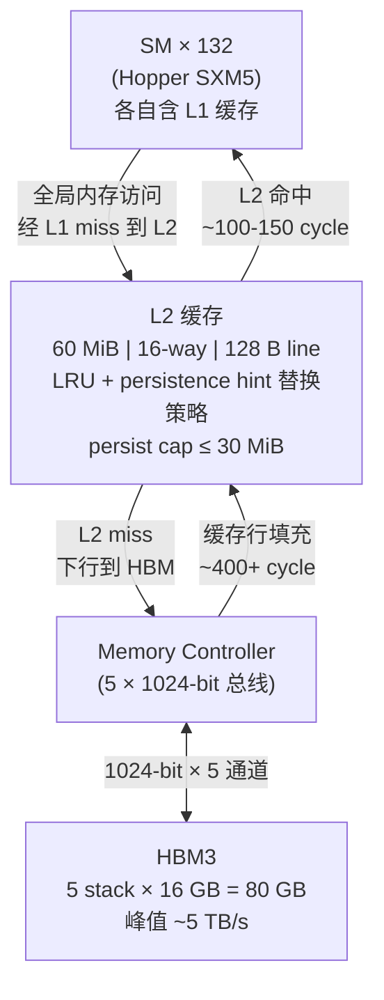

# 04 · L2 缓存 + set-aside

> **Hopper SM90 的 60 MiB L2 缓存是全 GPU 共享的访存屏障,通过 persistence attribute 可将热点数据锁定在 L2,避免 HBM3 的 400+ cycle 延迟。**

## 1. 是什么 / 为什么有它

全局内存(HBM3)具有极高的总带宽,但单次访问延迟超过 400 cycle。如果每次全局内存访问都必须穿透到 HBM,即使使用 warp latency hiding 技术,在访存密集型 kernel 中也难以维持高计算利用率。L2 缓存正是为了填补这一延迟鸿沟而存在。

L2 作为所有 SM 与 HBM 之间的全局共享缓冲层,使频繁访问的数据可以在 100-150 cycle 的延迟内被服务,远优于穿透到 HBM 的 400+ cycle。Hopper H100 SXM5 的 L2 容量为 60 MiB(Hopper Architecture Whitepaper,Table 2),相比 Ampere A100 的 40 MiB 增加了 50%。更大的 L2 意味着更多的工作集可以驻留在缓存中,对于大矩阵 GEMM、大批量推理、embedding lookup 等场景价值显著。

在实际应用中,L2 的命中率对性能影响巨大。若某个 kernel 的工作数据完全能放入 L2(例如权重矩阵 < 60 MiB),则后续的重复访问几乎不需要触碰 HBM,吞吐可以接近 L2 带宽上限。反之若工作集远超 L2 容量,则每次 L2 miss 都会触发 HBM 访问,带宽受限于 HBM。

Hopper 在传统 LRU 替换策略之上引入了 persistence attribute(持久化属性)机制:程序员可以标记特定内存区域为"持久化",使其在 L2 中享有更高的驱逐优先级保护,即使其他数据的访问产生竞争,这些标记区域也会尽量被保留。这对于推理场景中的权重矩阵、查找表等反复被多个 kernel 访问的数据尤为有效。

## 2. 硬件视角(微架构细节)

L2 是一个位于 SM 集群与 HBM3 接口之间的片上大容量 SRAM。其主要参数(Hopper Architecture Whitepaper):

- **容量**: 60 MiB(SXM5 版本)
- **组相联度**: 16-way set-associative
- **缓存行大小**: 128 字节(= 4 × 32 B sector)
- **替换策略**: LRU + persistence hint 加权偏置
- **ECC**: ECC 开启时实际存储容量折扣约 6.25%,净可用约 56 MiB

**Sector 粒度**:L2 以 32 字节为最小传输单元(sector),4 个 sector 构成一个 128 字节缓存行。NSight Compute 中 L2 相关 metric 均以 sector 为单位统计。当 warp 内 32 线程访问一段连续 128 字节数据时,最优情况下仅需 4 个 sector;若访问分散则需要更多 sector。

**L2 set-aside 机制**:这是一种基于替换策略偏好的软性保留机制,而非硬性物理分区。被标记为 `cudaAccessPropertyPersisting` 的地址区域在 L2 中享有"低驱逐优先级",即只在 L2 压力极大时才被替换出去。被标记为 `cudaAccessPropertyStreaming` 的区域则是"高驱逐优先级",适合只读一次不再复用的数据流(如 output buffer)。

**Persistence 容量上限**:每个 CUDA context 中可被 persisting 保护的数据量有上限,默认约为 L2 容量的 1/4(约 15 MiB),可通过 `cudaDeviceSetLimit(cudaLimitPersistingL2CacheSize, bytes)` 调大,最大不超过 L2 容量的一半(约 30 MiB)。

下图展示 SM 集群、L2 与 HBM3 的拓扑关系及数据流:



L2 与 HBM 之间的总带宽约等于 HBM 带宽峰值(5 TB/s),但 L2 与 SM 集群之间的内部带宽更高,因此 L2 命中可以饱和几乎所有 SM 的读写请求。实践中 L2 带宽往往是 kernel 的瓶颈之一,NSight Compute 的 Memory Workload Analysis 页面会给出 L2 带宽利用率。

## 3. CUDA 编程接口

**重置持久化 L2 缓存状态**:当需要在不同工作负载之间切换时,清除 L2 中残留的 persisting 标记:

```cpp
cudaCtxResetPersistingL2Cache();  // 将所有 persisting 数据改为 normal 替换优先级
```

**配置 stream 的 L2 访问策略窗口**:这是 L2 set-aside 的核心 API,可以对特定地址范围设置访问属性:

```cpp
cudaStream_t stream;
cudaStreamCreate(&stream);

// 配置 L2 访问策略:让 lookup_table 区域常驻 L2
cudaStreamAttrValue attr = {};
attr.accessPolicyWindow.base_ptr  = lookup_table;          // 窗口起始地址
attr.accessPolicyWindow.num_bytes = lookup_size;           // 窗口大小(字节)
attr.accessPolicyWindow.hitRatio  = 1.0f;                  // 命中此窗口时 100% 设 persisting
attr.accessPolicyWindow.hitProp   = cudaAccessPropertyPersisting;  // 命中属性
attr.accessPolicyWindow.missProp  = cudaAccessPropertyStreaming;   // 未命中属性(优先驱逐)

cudaStreamSetAttribute(stream, cudaStreamAttributeAccessPolicyWindow, &attr);

// 在此 stream 的 kernel 访问 lookup_table 时,数据会被标记为 persisting
my_kernel<<<grid, block, 0, stream>>>(lookup_table, output, n);

// 使用完毕后清理,归还 persist cap 给其他用途
attr.accessPolicyWindow.num_bytes = 0;
cudaStreamSetAttribute(stream, cudaStreamAttributeAccessPolicyWindow, &attr);
cudaCtxResetPersistingL2Cache();
```

**调整全局 persistence 容量上限**:

```cpp
// 将 persisting 上限从默认 ~15 MiB 提升到 30 MiB
size_t persist_limit = 30 * 1024 * 1024;
cudaDeviceSetLimit(cudaLimitPersistingL2CacheSize, persist_limit);
```

PTX 层面,L2 访问属性通过 cache hint modifier 控制:`.cs`(cache streaming,evict-first)、`.cg`(cache global,通过 L2 但不进 L1)、`.ca`(cache at all levels,默认)。

## 4. 关键性能指标

以下数据基于 Hopper H100 SXM5(Hopper Architecture Whitepaper、Programming Guide §3.2.3.6):

| 指标 | 数值 |
|---|---|
| L2 总容量(SXM5) | 60 MiB |
| L2 组相联度 | 16-way |
| L2 缓存行大小 | 128 B |
| L2 sector 大小 | 32 B |
| L2 命中延迟 | ~100-150 cycle |
| HBM3 访问延迟 | ~400+ cycle |
| 默认 persist cap | ~15 MiB(L2 的 1/4) |
| 最大可配 persist cap | ~30 MiB(L2 的 1/2) |
| L2 总读写带宽峰值 | ~5 TB/s(与 HBM 相当) |

**性能影响量化**:以一个 embedding lookup kernel 为例,若 embedding table 为 16 MiB 且配置为 persisting,第一轮 kernel 将 table 加载进 L2;后续 9 轮 kernel 每次访问 table 时 L2 命中率接近 100%。HBM 流量从 10 × 16 MiB = 160 MiB 降低到约 16 MiB(仅第一次加载),节省 90% HBM 带宽。

**Persist cap 超限行为**:若设置的窗口大小超过 persist cap,驱动不会报错,但超出部分的数据会使用默认替换策略(非 persisting),无法享受保留优先级。

## 5. 代码示例

以下示例展示将 embedding 查找表锁定在 L2 中,使多次推理复用缓存的完整流程:

```cpp
#include <cuda_runtime.h>
#include <stdio.h>

// Embedding lookup kernel
__global__ void lookup_kernel(const float* __restrict__ table,
                               const int*   __restrict__ indices,
                               float*                    output,
                               int embed_dim, int n_queries) {
    int q = blockIdx.x * blockDim.x + threadIdx.x;
    if (q >= n_queries) return;
    int idx = indices[q];
    for (int d = 0; d < embed_dim; d++) {
        // __ldg 使用只读缓存路径,减少 L1 污染
        output[q * embed_dim + d] = __ldg(&table[idx * embed_dim + d]);
    }
}

int main() {
    const int vocab = 32768, dim = 256, queries = 1024;
    const size_t table_bytes = (size_t)vocab * dim * sizeof(float); // 32 MiB

    float *d_table, *d_output;
    int   *d_indices;
    cudaMalloc(&d_table,   table_bytes);
    cudaMalloc(&d_output,  (size_t)queries * dim * sizeof(float));
    cudaMalloc(&d_indices, queries * sizeof(int));

    cudaStream_t stream;
    cudaStreamCreate(&stream);

    // 将 persist cap 提升到 32 MiB 以容纳整个 table
    cudaDeviceSetLimit(cudaLimitPersistingL2CacheSize, table_bytes);

    // 配置 L2 persistence 窗口
    cudaStreamAttrValue attr = {};
    attr.accessPolicyWindow.base_ptr  = d_table;
    attr.accessPolicyWindow.num_bytes = table_bytes;
    attr.accessPolicyWindow.hitRatio  = 1.0f;
    attr.accessPolicyWindow.hitProp   = cudaAccessPropertyPersisting;
    attr.accessPolicyWindow.missProp  = cudaAccessPropertyStreaming;
    cudaStreamSetAttribute(stream, cudaStreamAttributeAccessPolicyWindow, &attr);

    // 多次 lookup:第一次填充 L2,后续从 L2 命中
    for (int iter = 0; iter < 10; iter++) {
        lookup_kernel<<<(queries + 255) / 256, 256, 0, stream>>>(
            d_table, d_indices, d_output, dim, queries);
    }
    cudaStreamSynchronize(stream);

    // 清理:重置 persistence 窗口和 L2 状态
    attr.accessPolicyWindow.num_bytes = 0;
    cudaStreamSetAttribute(stream, cudaStreamAttributeAccessPolicyWindow, &attr);
    cudaCtxResetPersistingL2Cache();

    cudaFree(d_table); cudaFree(d_output); cudaFree(d_indices);
    cudaStreamDestroy(stream);
    return 0;
}
```

## 6. 实测手段

**NSight Compute** L2 相关 metric 是分析 L2 效果的主要工具:

- `lts__t_sectors_pipe_lsu_mem_global_op_ld.sum`:全局内存读操作在 L2 触发的 sector 数量(包含命中和未命中)。
- `lts__t_sector_hit_rate.pct`:L2 读命中率百分比。对于配置了 persistence 的 kernel,第二次运行后此值应显著提高。
- `lts__t_sectors_op_write.sum`:L2 写 sector 数。
- `dram__bytes_read.sum`:HBM 实际读取字节数。若 L2 命中率高,此值应大幅低于逻辑读取量。

```bash
# 采集 L2 命中率和 HBM 实际读带宽
ncu --metrics lts__t_sector_hit_rate.pct,\
lts__t_sectors_pipe_lsu_mem_global_op_ld.sum,\
dram__bytes_read.sum \
./lookup_kernel
```

若 L2 命中率低于预期,检查以下方面:工作集大小是否超过 L2 容量、是否多个 stream 竞争 persist cap、`hitRatio` 是否设置为 1.0(全部命中)。

**nvidia-smi** 可以粗粒度监控显存带宽压力:

```bash
nvidia-smi dmon -s u -d 1   # 每秒刷新显存带宽利用率
```

## 7. 常见反模式

1. **把全部 GMEM 都设为 persisting**:persist cap 有上限(默认 15 MiB,最大 30 MiB)。若多个 stream 各自设置大窗口,它们会争夺有限的 persist capacity。各 stream 的实际 persistent 数据量按比例缩减,互相干扰,L2 命中率反而下降。应只对最关键的热点数据使用 persisting。

2. **忘记 reset 导致后续 kernel 命中失效**:一轮工作完成后未调用 `cudaCtxResetPersistingL2Cache()`,下一个不同访问模式的 kernel 启动时,L2 中残留旧的 persisting 标记可能占用 persist cap 配额,新数据无法被有效保留。切换工作负载时务必重置。

3. **误以为 L2 set-aside 是物理切分**:persistence attribute 仅影响替换策略权重,L2 物理上仍然是统一的 60 MiB 缓存。标记为 persisting 的数据在极端压力下(其他数据量极大)仍可能被驱逐。不能依赖它实现严格的缓存隔离或数据保证。

4. **在 hitRatio < 1.0 时高估效果**:`hitRatio = 0.5` 表示命中 persistence 窗口的访问中,约 50% 以 persisting 处理,另 50% 以 missProp 处理。这在高随机访问场景下效果有限,应通过实测 `lts__t_sector_hit_rate.pct` 验证实际命中率而非假设。

5. **ECC 开启时忘记容量折扣**:开启 ECC 后 L2 实际可存数据约 56 MiB 而非 60 MiB。设置 `persist cap = 30 MiB` 仍然有效,但在计算工作集能否放入 L2 时应用 56 MiB 而非 60 MiB 估算。

## 8. 延伸阅读

- CUDA C++ Programming Guide §3.2.3.6 — L2 Cache Access Management(persistence API 完整参数说明)
- CUDA C++ Programming Guide §K.7 — Compute Capability 9.x(Hopper L2 容量与参数)
- CUDA Best Practices Guide §9.2.3.4 — L2 Persistence
- Hopper Architecture Whitepaper — Table 2(L2 缓存规格)
- PTX ISA §8.7.1 — Cache Operators(`.ca` / `.cg` / `.cs` / `.wb` / `.wt` 语义)
- NVIDIA Developer Blog: [L2 Cache Residency Controls on NVIDIA Ampere GPUs](https://developer.nvidia.com/blog/optimizing-memory-bandwidth-and-latency-on-nvidia-hopper/)
