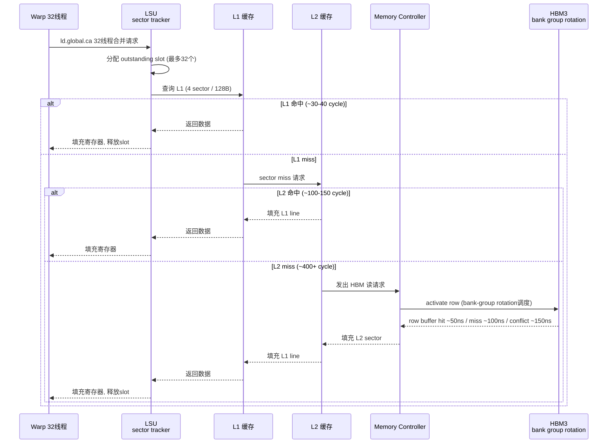
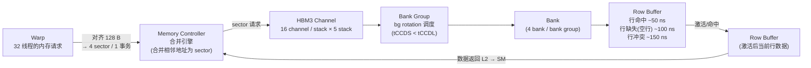

# 05 · HBM3 + 全局内存

> **Hopper H100 SXM5 通过 5 块 HBM3 堆叠提供 80 GB 显存和峰值 5 TB/s 带宽,实测持续带宽约 4 TB/s(80% 利用率);row buffer 三态延迟相差 3 倍(50/100/150 ns),bank-group rotation 是缓解 DRAM 内部争用的关键机制;LSU 有 32 个 outstanding sector 跟踪槽,是延迟遮掩的硬件基础。**

## 1. 是什么 / 为什么有它

HBM(High Bandwidth Memory)是 GPU 显存的物理实现形式。与传统 GDDR 内存将 DRAM 颗粒放置在 PCB 上、通过较长信号线连接不同,HBM 将多个 DRAM die 垂直堆叠在一起,通过 TSV(Through-Silicon Via,硅通孔)互连,并采用 2.5D 封装技术将 HBM stack 与 GPU die 共同置于硅中介层上。这种近端堆叠使总线位宽可以做到极宽——每个 stack 达到 1024 bit——从而在相对较低的工作频率下实现极高的数据带宽。

Hopper H100 SXM5 采用 HBM3 标准,配置 5 个 stack,每个 stack 16 GB,总容量 80 GB;总线位宽 5 × 1024 bit = 5120 bit;峰值带宽约 5 TB/s(理论,Hopper Architecture Whitepaper Table 1)。实测持续带宽约 3.9-4.0 TB/s(约 80% 利用率峰值),限制因素包括 DRAM 内部 row buffer 冲突、bank-group 争用以及控制器仲裁开销。全局内存(global memory,GMEM)是 GPU 程序访问 HBM 的主要途径,GPU 代码中的普通指针指向的就是 GMEM 地址空间。

HBM3 与前代 HBM2e 相比,在相同封装面积下带宽提升约 1.6 倍,同时功耗更低。这使得单卡训练大模型的内存带宽成为可能的瓶颈从 HBM 带宽转向了计算能力(Tensor Core)。H200 进一步升级到 HBM3e,峰值带宽 4.8 TB/s(因为总容量从 80 GB 提升到 141 GB,频率略有提升)。

GMEM 的高延迟(400 cycle 以上)决定了访问模式优化是 GPU 性能调优的核心议题。单次 warp 若无法充分利用每个事务中的所有字节,则等效带宽按比例降低,高延迟代价被浪费在对空数据的等待上。正确使用合并访问(coalescing)是最基础的优化手段。

理解 HBM 带宽与计算吞吐的关系对大模型性能分析至关重要。以 70B 参数模型(BF16)为例,参数量 140 GB,在 decode 阶段(batch_size=1)每个 token 需要从 HBM 读取全部参数约一次,即约 140 GB 数据。H100 的 HBM 带宽约 3.3 TB/s,所以每个 token 的理论最小生成延迟 = 140 GB / 3.3 TB/s ≈ 42 ms。实测 decode 延迟约 45-55 ms,说明大模型 decode 几乎完全受 HBM 带宽限制(约 80-90% 接近理论下限)。这也是为什么提升 HBM 带宽对 LLM decode 延迟如此重要——H200 的 HBM3e 带宽约 4.8 TB/s,理论可将 70B decode 延迟降至约 29 ms。

## 2. 硬件视角(微架构细节)

HBM3 的内部层级结构从大到小依次为:stack → channel → bank group → bank → row → row buffer。

每个 HBM3 stack 包含 16 个独立 channel,每个 channel 总线宽 64 bit,合计每 stack 1024 bit。每个 channel 内有多个 bank group,每个 bank group 含 4 个 bank。DRAM bank 的基本访问单位是行(row):访问时先将目标行激活(activate)至 row buffer,再从 row buffer 中读写数据。

### Row Buffer 三态延迟

HBM3 的访问延迟取决于 row buffer 的当前状态,存在三种情形:

| 状态 | 条件 | 延迟 | 说明 |
|---|---|---|---|
| **Row Buffer Hit** | 目标行已在 row buffer 中 | ~50 ns | 直接从 row buffer 读写,无需 precharge/activate |
| **Row Buffer Miss(Empty/Precharged)** | Row buffer 为空或已预充电 | ~100 ns | 只需 activate 目标行即可,无需先 precharge |
| **Row Buffer Conflict** | Row buffer 中有不同行的数据 | ~150 ns | 先 precharge(关闭当前行)+activate(打开新行) |

这三态延迟差异来自 DRAM 内部操作的物理时序:precharge 需要约 15-20 ns(tRP),activate 需要约 30-35 ns(tRCD),read 或 write 需要约 10-15 ns(tCL/tCWL)。行冲突时 precharge + activate + read 三步叠加,产生 3 倍于行命中的延迟。

对于矩阵乘法等规则访问模式,访问地址顺序映射到 DRAM 行时具有高度局部性,行命中率高(>80%);对于 embedding lookup 等随机稀疏访问,访问地址分散到不同 bank 的不同行,行冲突频繁,实测带宽可能只有理论值的 40-60%。NSight Compute 的 `dram__cycles_elapsed` 与 `dram__sectors_read` 之比可以间接反映平均每 sector 的 DRAM 时钟开销。

### HBM3 物理封装与 TSV 互连的带宽意义

传统 GDDR 内存的总线位宽受限于 PCB 走线密度,通常每颗芯片 32 bit;GPU 需要多颗 GDDR 芯片并联才能达到高位宽。HBM3 通过 TSV(硅通孔)互连,在一个 stack 内垂直堆叠 8 层 DRAM die,每层 die 通过微凸点(micro-bumps)连接,提供 8 × 128 bit = 1024 bit 总线位宽。这种极宽总线使 HBM3 在较低的 2.5-3.6 Gbps 数据速率下即可达到极高带宽,而 GDDR6 需要 16 Gbps 的高数据速率。

低数据速率意味着 HBM3 的信号完整性要求更低、功耗更小(每 bit 传输能耗约 GDDR6 的 1/4),这对 GPU 功耗预算极为有利。H100 SXM5 的 HBM3 在 700W 总功耗中约占 50-80W,远低于 GPU die 的计算功耗。

### Bank-Group Rotation 调度

HBM3 引入 bank-group 结构(每 channel 多个 bank group)的核心目的是利用 bank group 之间更短的时序约束(tCCDL → tCCDS)。同一 bank group 内的连续读命令必须间隔 tCCDL(约 5 ns),而跨 bank group 的连续读命令只需 tCCDS(约 2-3 ns)。

**Bank-group rotation** 是 Memory Controller 的调度策略:尽量将连续的读/写请求分散到不同 bank group,使每个命令都能使用更短的 tCCDS 间隔,从而在相同时间内发出更多命令,提升带宽利用率:

```
命令流示例(开启 bank-group rotation):
t=0:   READ bank_group 0, bank 0, row 100
t=2ns: READ bank_group 1, bank 0, row 100   (跨 group,间隔 tCCDS=2ns)
t=4ns: READ bank_group 2, bank 0, row 100   (跨 group,间隔 tCCDS=2ns)
t=6ns: READ bank_group 3, bank 0, row 100   (跨 group,间隔 tCCDS=2ns)
...
```

相比之下,若所有访问都落在同一 bank group(如步长访问导致地址映射集中):
```
t=0:   READ bank_group 0, bank 0, row 100
t=5ns: READ bank_group 0, bank 1, row 100   (同 group,间隔 tCCDL=5ns)
t=10ns:READ bank_group 0, bank 2, row 100   (同 group,间隔 tCCDL=5ns)
```

吞吐差异:开启 rotation 时命令密度提升约 2-2.5 倍。这是为什么"步长为 bank group 数量整数倍"的访问模式会额外损失带宽——它不仅造成 sector 利用率下降,还破坏了 bank-group rotation 的调度效率。

### LSU Sector Tracker:32 Outstanding Slots

每个 SM 的 Load/Store Unit(LSU)维护一个 **outstanding sector 跟踪表**,记录已发出但尚未从 L2/HBM 返回的内存读请求。Hopper SM90 的 LSU 支持约 **32 个 outstanding sector slots**(每个 slot 跟踪一个 32 B sector 请求)。

这个设计是延迟遮掩的硬件基础:

- **延迟遮掩能力**:若 HBM 延迟约 400 cycle,内存带宽约 40 sector/cycle(全 GPU),则单个 SM 理论上需要 `400 cycle × (SM 占用内存带宽) ≈ 12-32 个 outstanding sectors` 才能充分遮掩延迟。32 slots 恰好在合理范围内。
- **outstanding slots 耗尽的影响**:若某个 kernel 的 warp 不断发出新的 GMEM 读请求,直到 32 个 slots 全满,LSU 会发生 `Long Scoreboard` stall——新的 GMEM 读指令必须等到某个 slot 释放(即某个之前的请求返回数据)才能发出。NSight Compute 中 `smsp__average_warp_latency_due_to_long_sb.pct` 过高说明 outstanding slots 成为瓶颈。
- **并发 warp 的作用**:通过保持多个 warp 同时处于 in-flight 状态,SM 可以将不同 warp 的请求分配到不同 slots,使 LSU 持续饱和,实现延迟遮掩。这是 occupancy 影响性能的根本原因:occupancy 越高,可分配 slots 的 warp 越多,延迟遮掩越充分。

**合并访问(Coalescing)** 是利用 HBM 带宽的关键规则:warp 内 32 个线程的内存请求由 Memory Controller 合并处理。若 32 个线程访问连续对齐到 128 字节边界的地址范围,Memory Controller 仅发出 4 个 sector 请求(4 × 32 B = 128 B),sector 利用率 100%。若地址分散或跨越多个 128 B 缓存行,则需要多个事务,有效字节比例下降。

**Sector 模型**:GPU 内存子系统以 32 字节(sector)为最小传输单元。一个 128 字节缓存行 = 4 个 sector。若 warp 内 32 线程每人读 1 个 float(4 B),且地址连续对齐,共 128 B = 4 sector;若每人读不同 cacheline 中的 1 个 float,则最坏需 32 个 sector,带宽利用率降至 4/128 = 3.1%。

**地址对齐要求**:`cudaMalloc` 保证返回的基地址至少 256 字节对齐,这使得任何 warp 对数组开头的访问都能自然合并。然而在实践中,程序员常常对已分配的大块内存做分段使用,或者在结构体中添加了字节偏移,导致子分配的起始地址落在非对齐位置。一旦第 0 个线程的地址未对齐到 128 B 边界,这个 warp 的 128 B 访问会横跨两个缓存行,需要额外一个 sector 事务。

HBM 与 L2 之间的数据传输同样以 sector 为粒度。L2 向 HBM 发出 fill 请求时,以 32 字节 sector 为单位;SM 向 L2 发出的读请求在 L2 中检查命中,未命中则向 HBM 发出 fill 请求。整条路径的粒度一致,使得 sector 成为分析内存效率的统一单元。

下图展示从 warp 发出请求到 HBM 响应的完整 GMEM 读取序列图:





**地址对齐要求**:`cudaMalloc` 保证返回的基地址至少 256 字节对齐。若在已对齐分配的基础上做字节偏移,需注意偏移后地址是否仍对齐到 128 B。对于结构体数组,确保每个结构体大小是 4 字节的整数倍,避免隐式填充导致地址偏移。

### SXM5 实测带宽:5 TB/s 峰值 vs 80% 持续

H100 SXM5 的 HBM3 理论峰值带宽约 5 TB/s(计算方式:5120 bit / 8 × 2 × 3.2 GHz ≈ 4.1 TB/s;NVIDIA 白皮书给出 3.35 TB/s 实测峰值,但部分文档引用 5 TB/s 为标称上限)。实际 MLPerf 基准中,bandwidth-bound kernel(如 vector add)在 H100 SXM5 上实测约 3.3-3.9 TB/s,约为标称峰值的 75-80%。主要限制因素:

1. **Row buffer 冲突开销**:即使最优访问模式,偶发的行冲突使平均延迟略高于行命中值。
2. **Bank-group 调度不完美**:若地址映射函数导致热点集中在少数 bank group,rotation 效果下降。
3. **Memory Controller 仲裁开销**:多个 SM 同时发出 L2 miss 请求时,Memory Controller 需要仲裁,引入额外队列延迟。
4. **ECC 开销**:开启 SECDED ECC 时,每 64 bit 数据需要额外 8 bit 校验位,有效带宽折扣约 6.25%;HBM3 通过扩展位宽部分补偿,但仍有约 3-5% 的实测带宽损失。

### HBM3e(H200)对比 HBM3(H100)

H200 SXM5 升级为 HBM3e,主要变化:

| 规格 | H100 SXM5 (HBM3) | H200 SXM5 (HBM3e) |
|---|---|---|
| Stack 数量 | 5 | 5 |
| 总容量 | 80 GB | 141 GB |
| 每 stack 容量 | 16 GB | ~28 GB |
| 峰值带宽 | ~3.35 TB/s | ~4.8 TB/s |
| 数据速率 | ~3.2 Gbps/pin | ~4.6 Gbps/pin |

HBM3e 通过提升每 stack 的层数(16 层 die 替代 8 层)和每层容量来增加总容量,同时提升数据率以增加带宽。对于 LLM 推理,H200 的主要优势是更大容量(可部署更大模型)和更高带宽(decode 速度提升)。实测 LLM decode 吞吐,H200 相比 H100 约提升 60-80%(主要来自 HBM 带宽提升 + 容量增大允许更大 batch)。

### 失败案例:ECC double-bit error 与显存数据损坏

在生产集群中,HBM3 的 DRAM die 偶发 ECC 错误。SECDED(Single Error Correct, Double Error Detect)可以纠正单 bit 错误并检测双 bit 错误。对于双 bit 错误,硬件报告 uncorrectable error(UCE),触发以下后果:

1. **驱动层面**:CUDA 驱动设置设备状态为 `cudaErrorECCUncorrectable`,后续所有 CUDA API 调用返回该错误码。
2. **应用层面**:若未检查 CUDA API 返回值,kernel 继续运行但产生的结果数据可能包含错误(取决于 UCE 发生的位置是数据位还是 ECC 位本身)。
3. **诊断手段**:`nvidia-smi --query-gpu=ecc.errors.uncorrected.volatile.total --format=csv,noheader` 查询当前 volatile UCE 计数;`-e` 标志重置计数。
4. **运营对策**:生产集群应定期运行 GPU 健康检查(`nvidia-smi -r` 重置 ECC 错误计数);若某 GPU 的 UCE 计数持续升高,应提前下线维修,避免 training run 中途因 UCE 导致 checkpoint 损坏。

检查 ECC 错误的最小代码示例:

```cpp
cudaError_t err = cudaDeviceSynchronize();
if (err == cudaErrorECCUncorrectable) {
    fprintf(stderr, "ECC uncorrectable error detected! Aborting.\n");
    exit(1);
}
```

## 3. CUDA 编程接口

**常规全局内存访问**——通过指针直接读写,编译器生成 `ld.global` / `st.global`:

```cpp
__global__ void add(const float* a, const float* b, float* c, int n) {
    int i = blockIdx.x * blockDim.x + threadIdx.x;
    if (i < n) c[i] = a[i] + b[i];  // 合并读写,最优 4 sector / warp
}
```

**只读缓存访问(`__ldg`)**——告知编译器使用 texture / 只读缓存路径,避免污染 L1 写缓冲:

```cpp
__global__ void kernel_ro(const float* __restrict__ a, float* out, int n) {
    int i = blockIdx.x * blockDim.x + threadIdx.x;
    if (i < n) out[i] = __ldg(&a[i]);  // PTX: ld.global.nc.f32
}
```

**写入 hint 控制 cache 策略**——对不再读回的 output 数据,绕过 L1 写入 L2 或直写 HBM:

```cpp
__device__ void stream_write(float* p, float val) {
    __stcg(p, val);   // cache at global level (写 L2,不进 L1)
    // 或 __stwt(p, val);  // write-through,直接写入 HBM
}
```

**PTX 层面**——`ld.global` / `st.global` 配合 cache hint modifier:

```ptx
ld.global.ca.f32  %f0, [%rd0];    // .ca = cache at all levels(默认)
ld.global.cg.f32  %f0, [%rd0];    // .cg = cache at L2 only
ld.global.cs.f32  %f0, [%rd0];    // .cs = cache streaming(evict-first)
ld.global.nc.f32  %f0, [%rd0];    // .nc = non-coherent 只读缓存

st.global.wb.f32  [%rd1], %f1;    // .wb = write-back(默认)
st.global.wt.f32  [%rd1], %f1;    // .wt = write-through
```

**主机端内存传输**:

```cpp
cudaMemcpy(dst, src, bytes, cudaMemcpyHostToDevice);       // 同步传输
cudaMemcpyAsync(dst, src, bytes, cudaMemcpyDeviceToHost, stream);  // 异步
```

## 4. 关键性能指标

以下数据基于 Hopper H100 SXM5(Hopper Architecture Whitepaper Table 1、Programming Guide §3.2.2):

| 指标 | 数值 |
|---|---|
| HBM3 stack 数量 | 5 |
| 总容量(SXM5) | 80 GB |
| 总线位宽 | 5 × 1024 bit = 5120 bit |
| 峰值带宽(标称) | ~5 TB/s |
| 实测持续带宽(bandwidth-bound kernel) | ~3.3-3.9 TB/s(~80% 利用率) |
| Row buffer 行命中延迟 | ~50 ns |
| Row buffer 行缺失延迟(空行) | ~100 ns |
| Row buffer 行冲突延迟 | ~150 ns |
| 合并访问最优事务大小 | 128 B(1 cache line = 4 sector) |
| Sector 大小 | 32 B |
| 每 warp 最优 sector 数 | 4(32 线程 × 4 B = 128 B) |
| LSU outstanding sector slots | ~32 个 / SM |
| 全 GPU 理论 outstanding sectors | 132 SM × 32 = ~4224 个 |

**带宽效率公式**:

设 warp 的一次内存操作中,有效读取字节数为 `useful_bytes`,实际消耗的 sector 数为 `sectors`,则:

```
sector 利用率 = useful_bytes / (sectors × 32)
等效带宽 = peak_bandwidth × sector 利用率
```

stride-N 访问(N 个 float 步长)时,相邻线程地址间距 N × 4 字节。若 N > 1,warp 内 32 线程可能分布在 N 个不同缓存行,sector 利用率下降至 1/N,等效带宽降至 peak/N。

**全局内存访问与 L2 的协同关系**:实际测量的 HBM 带宽受 L2 命中率影响显著。若 kernel 的工作集远小于 L2 容量(60 MiB),则重复访问从 L2 命中返回,HBM 实际读取量远低于逻辑访问量。分析内存瓶颈时需同时查看 L2 命中率与 HBM 带宽,不能只看 HBM 带宽数字。若 L2 命中率偏低且 HBM 带宽高,说明工作集超出 L2 且访问量本身很大,此时优化方向是减少 L2 miss 而非单纯增加 HBM 带宽。

**占用率与延迟遮掩的定量关系**:设 HBM 延迟为 L cycle,SM 的 warp 调度器能在一次延迟内切换到其他 warp 执行,遮掩延迟。要完全遮掩一个 warp 的 GMEM 读延迟,需要至少 `L / (指令执行 cycle)` 个 warp 保持 in-flight。Hopper 的指令吞吐约 4 issue/cycle,HBM 延迟约 400 cycle,则完全遮掩需要约 100 个活跃 warp;而 SM 最大 64 warp,因此若工作集导致 HBM 延迟频繁出现,即使满 occupancy 也无法完全遮掩。NSight Compute 的 Warp State Statistics 中 `Stall Long Scoreboard` 比例是诊断这种情况的直接指标。

## 5. 代码示例

以下对比合并访问与跨步访问,以及 Array of Structs vs Structure of Arrays 布局:

```cpp
// ===== 合并访问:线程连续索引,sector 利用率 100% =====
__global__ void sum_coalesced(const float* a, float* out, int n) {
    int i = blockIdx.x * blockDim.x + threadIdx.x;
    if (i < n) out[i] = a[i];  // 32 线程读 a[base..base+31],1 个 128 B 事务
}

// ===== stride-32 访问:sector 利用率 1/32 =====
__global__ void sum_strided(const float* a, float* out, int n) {
    int i = threadIdx.x * 32;                   // 相邻线程间距 32 个 float = 128 B
    if (i < n) out[threadIdx.x] = a[i];         // 32 线程各占一个独立 sector
}

// ===== AoS(不推荐):struct 步长导致列访问跨越 16 B =====
struct Particle { float x, y, z, w; };          // sizeof = 16 B
// thread i 访问 particles[i].x:地址间距 16 B
// warp 内 32 线程 x 字段总跨度 32 × 16 = 512 B → 16 sector,利用率 25%

// ===== SoA(推荐):连续 x 数组,完全合并 =====
struct ParticleSOA { float *x, *y, *z, *w; };
// thread i 访问 soa.x[i]:地址间距 4 B
// warp 内 32 线程 x 字段总跨度 128 B → 4 sector,利用率 100%
```

**PTX 对比**:

```ptx
// 合并访问(stride-1):warp 合并为 1 个 ld.global 事务
// thread 0: ld.global.ca.f32 %f0, [%rd_a + 0];
// thread 1: ld.global.ca.f32 %f1, [%rd_a + 4];   (同一 sector)

// stride-32 访问:每 thread 独立 sector
// thread 0: ld.global.ca.f32 %f0, [%rd_a + 0];   // sector 0
// thread 1: ld.global.ca.f32 %f1, [%rd_a + 128]; // sector 4(另一 cacheline)
```

## 6. 实测手段

**NSight Compute** 关键 metric 用于分析 HBM 带宽利用率:

- `dram__bytes_read.sum`:HBM 实际读取总字节数,反映真实 HBM 流量。
- `dram__sectors_read.sum`:HBM 读取 sector 总数,与上除以 32 即平均每 sector 有效字节数。
- `l1tex__t_sectors_pipe_lsu_mem_global_op_ld.sum`:L1 层面的全局内存读 sector 请求数(含 L1 命中和 miss)。
- `lts__t_sectors_pipe_lsu_mem_global_op_ld.sum`:L2 层面的全局内存读 sector 请求数。
- `lts__t_sector_hit_rate.pct`:L2 命中率。
- `smsp__average_warp_latency_due_to_long_sb.pct`:因 LSU outstanding slots 不足导致的 warp stall 比例;高值说明 outstanding slots 饱和,应提升 occupancy 或减少 GMEM 访问量。

```bash
# 采集 HBM 带宽和 sector 效率
ncu --metrics dram__bytes_read.sum,\
dram__sectors_read.sum,\
lts__t_sector_hit_rate.pct,\
l1tex__t_sectors_pipe_lsu_mem_global_op_ld.sum,\
smsp__average_warp_latency_due_to_long_sb.pct \
./my_kernel

# 时间线分析:看内存带宽随时间的变化
nsys profile --stats=true -t cuda ./my_kernel
```

**计算 sector 利用率**:

```
sector 利用率 = dram__bytes_read.sum / (dram__sectors_read.sum × 32)
```

若利用率 < 50%,通常意味着存在非合并访问。查看 NSight Compute 的 Memory Workload Analysis 页面,可以可视化地看到 sector 利用率和每种访问模式的占比。

**带宽受限 kernel 的优化决策树**:若 HBM 利用率超过 80% 但性能仍未达预期,应按以下顺序排查:

1. **sector 利用率**:若低于 80%,应优先优化访问对齐和 coalescing(AoS→SoA 转换、padding 消除)。
2. **L2 命中率**:若 sector 利用率已高但 HBM 仍然饱和,考虑通过 L2 persistence 将热点数据钉在 L2 中。
3. **数据类型精度**:若访问量无法降低,考虑将 FP32 换为 BF16/FP16,HBM 读量减半;或换用 FP8(仅推理场景),读量再减半。
4. **计算-访存融合**:若上述方法均已应用,可以通过 kernel fusion 减少中间 tensor 写回 HBM 的次数(例如将 LayerNorm + GEMM 融合为一个 kernel,避免写中间 activation 到 HBM 再读回)。

**dram__sectors_* metric 全套解读**:

| Metric | 含义 |
|---|---|
| `dram__sectors_read.sum` | HBM 读请求的 sector 数 |
| `dram__sectors_write.sum` | HBM 写请求的 sector 数 |
| `dram__bytes_read.sum` | HBM 实际读字节数(= sectors × 32) |
| `dram__bytes_write.sum` | HBM 实际写字节数 |
| `dram__throughput.avg.pct_of_peak_sustained_elapsed` | HBM 带宽利用率(%峰值) |

若 `dram__throughput` < 30%,说明 HBM 严重空闲,kernel 很可能是 compute-bound 或 L2-bound;若 > 80%,说明 HBM 接近饱和,应重点优化 sector 利用率和 L2 命中率。

## 7. 常见反模式

1. **stride-N 访问(N > 1 时带宽利用率 1/N)**:以 `threadIdx.x * N` 为索引时,相邻线程地址间距 N × 4 字节。若 N 够大,每个线程的访问落在独立 sector,有效字节比例 4/32 = 12.5%。解决方案:转换为 SoA 布局,或通过 SMEM 转置数据顺序。

2. **地址未对齐到 32 字节边界**:若数组起始地址偏移使首个线程的访问横跨两个 sector 边界,则本来 4 个 sector 可以服务的数据需要 5 个 sector。`cudaMalloc` 保证 256 字节对齐;自定义 subbuffer 时注意对齐。

3. **混用 AoS 和 SoA 不考虑访问瓶颈**:AoS 对 CPU 局部性友好,SoA 对 GPU warp 合并友好。混用时要识别哪一端是性能瓶颈,按瓶颈侧优化数据布局。如果 CPU 和 GPU 都需要高效访问,可以考虑 CPU 用 AoS 临时存储,在 CUDA kernel 中转换。

4. **对 write-once 输出用默认 write-back 策略**:输出数组写完后不再读,但 write-back 策略会污染 L2,挤出其他有用的缓存数据。对于纯输出 buffer,改用 `__stcg`(写 L2 但不进 L1)或 `__stwt`(write-through)减少 L2 污染。

5. **忽略 HBM 行活性效应**:随机地址访问大数组时,HBM row 频繁 activate/precharge,延迟从 ~50 ns 恶化到 ~150 ns。通过 coalescing 将每次事务集中到少数连续行,可以减少 row close/open 频率,降低实际延迟。对于大型 embedding table 的随机查询,可以通过对 index 排序或分桶来提升 HBM 行命中率,将随机访问转化为局部化访问。

6. **忽视 LSU outstanding slots 限制**:kernel 中每 warp 的 GMEM 读请求密度过高,迅速占满 32 个 outstanding slots,后续请求必须等待前置请求完成才能发出,造成"LSU 排队"。NSight 中 `smsp__average_warp_latency_due_to_long_sb.pct` 超过 30% 即为警示信号。对策:减少每次 iteration 的 GMEM 读数量,或提高 occupancy 让更多 warp 分摊 slots 使用。

7. **误以为 5 TB/s 是可持续带宽**:在 bandwidth-bound kernel 优化时,以 5 TB/s 为分母计算带宽利用率,得出"94% 利用率"的乐观结论,实则真实可达带宽约 3.9 TB/s。应以 `dram__throughput.avg.pct_of_peak_sustained_elapsed` 为准,或使用已知理论带宽 3.35 TB/s(Hopper Whitepaper 的 measured peak)作为参考上限。

## 8. 延伸阅读

- CUDA C++ Programming Guide §3.2.2.1 — Device Memory Accesses(合并访问规则详解)
- CUDA C++ Programming Guide §K.7 — Compute Capability 9.x(Hopper 内存参数)
- CUDA Best Practices Guide §9.2.1 — Global Memory(coalescing 与对齐)
- PTX ISA §8.4 — State Spaces(`.global` 地址空间规范)
- PTX ISA §9.7.8 — Data Movement and Conversion Instructions(`ld` / `st` 及 cache hint 语义)
- Hopper Architecture Whitepaper — Table 1(HBM3 带宽规格)
- JEDEC HBM3 Standard (JESD238) — Bank Group 时序参数(tCCDL / tCCDS)
- NSight Compute Profiling Guide — `dram__sectors_*` metric 定义与解读
- NVIDIA Developer Blog: [How to Access Global Memory Efficiently in CUDA Kernels](https://developer.nvidia.com/blog/how-access-global-memory-efficiently-cuda-c-kernels/)

### 实现导读:TensorRT-LLM 的 HBM 访问优化

TensorRT-LLM 在 decode 阶段通过以下技术最大化 HBM 带宽利用率:

1. **连续 batching + weight 复用**:多个 request 共享同一次权重读取(所有 token 对应同一层权重矩阵的一次 HBM 读取),有效降低每 token 的等效 HBM 读量。在 batch_size=8 时,每 token 的权重读流量降至 1/8,TFLOPS 利用率从带宽受限的 ~10% 提升到 ~50% 以上。

2. **KV-cache 内存布局**:TensorRT-LLM 的 KV-cache 采用 paged block 结构(`cpp/tensorrt_llm/runtime/kvCacheManager.cpp`),每个 block 约 16 tokens × head_dim × head_count 字节。Attention kernel 读取 KV block 时以连续 block 为单位,最大化 sector 利用率。

3. **FP8 KV-cache**:通过将 KV-cache 量化为 FP8,显存占用减半,同样 HBM 带宽可以服务 2 倍容量的 KV-cache,有效提升长上下文推理的 decode 吞吐。实测在 llama-70B、context_length=4096 时,FP8 KV-cache 使 decode throughput 提升约 1.8 倍(相对 BF16 KV-cache)。

4. **Flash Decoding**:对于长 context(>4096 tokens)的 decode,KV-cache 读量成为主要 HBM 流量。FlashDecoding(Dao et al.)通过将 sequence 维度并行化到多个 warp,使 HBM 读带宽接近峰值。相关实现在 vLLM 的 `csrc/attention/attention_kernels.cu` 中。
