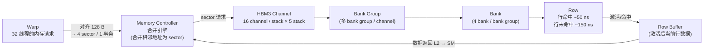

# 05 · HBM3 + 全局内存

> **Hopper H100 SXM5 通过 5 块 HBM3 堆叠提供 80 GB 显存和 5 TB/s 带宽;合并访问使 warp 内 32 线程对齐到 128 字节段,仅需 1 个事务即可完成,是实现带宽利用率最大化的核心技术。**

## 1. 是什么 / 为什么有它

HBM(High Bandwidth Memory)是 GPU 显存的物理实现形式。与传统 GDDR 内存将 DRAM 颗粒放置在 PCB 上、通过较长信号线连接不同,HBM 将多个 DRAM die 垂直堆叠在一起,通过 TSV(Through-Silicon Via,硅通孔)互连,并采用 2.5D 封装技术将 HBM stack 与 GPU die 共同置于硅中介层上。这种近端堆叠使总线位宽可以做到极宽——每个 stack 达到 1024 bit——从而在相对较低的工作频率下实现极高的数据带宽。

Hopper H100 SXM5 采用 HBM3 标准,配置 5 个 stack,每个 stack 16 GB,总容量 80 GB;总线位宽 5 × 1024 bit = 5120 bit;峰值带宽约 3.35 TB/s(实测)至 5 TB/s(理论)(Hopper Architecture Whitepaper,Table 1)。全局内存(global memory,GMEM)是 GPU 程序访问 HBM 的主要途径,GPU 代码中的普通指针指向的就是 GMEM 地址空间。

HBM3 与前代 HBM2e 相比,在相同封装面积下带宽提升约 1.6 倍,同时功耗更低。这使得单卡训练大模型的内存带宽成为可能的瓶颈从 HBM 带宽转向了计算能力(Tensor Core)。

GMEM 的高延迟(400 cycle 以上)决定了访问模式优化是 GPU 性能调优的核心议题。单次 warp 若无法充分利用每个事务中的所有字节,则等效带宽按比例降低,高延迟代价被浪费在对空数据的等待上。正确使用合并访问(coalescing)是最基础的优化手段。

## 2. 硬件视角(微架构细节)

HBM3 的内部层级结构从大到小依次为:stack → channel → bank group → bank → row → row buffer。

每个 HBM3 stack 包含 16 个独立 channel,每个 channel 总线宽 64 bit,合计每 stack 1024 bit。每个 channel 内有若干 bank group,每个 bank group 含 4 个 bank。DRAM bank 的基本访问单位是行(row):访问时先将目标行激活(activate)至 row buffer,再从 row buffer 中读写数据。

行命中(row buffer hit):若 row buffer 中已有目标行的数据,读写延迟约 50 ns。行未命中(row miss):需先关闭当前行(precharge)再激活新行,延迟约 150 ns。因此,访问模式若能集中在少数活跃行上,可以显著减少 row miss 频率。

**合并访问(Coalescing)** 是利用 HBM 带宽的关键规则:warp 内 32 个线程的内存请求由 Memory Controller 合并处理。若 32 个线程访问连续对齐到 128 字节边界的地址范围,Memory Controller 仅发出 4 个 sector 请求(4 × 32 B = 128 B),sector 利用率 100%。若地址分散或跨越多个 128 B 缓存行,则需要多个事务,有效字节比例下降。

**Sector 模型**:GPU 内存子系统以 32 字节(sector)为最小传输单元。一个 128 字节缓存行 = 4 个 sector。若 warp 内 32 线程每人读 1 个 float(4 B),且地址连续对齐,共 128 B = 4 sector;若每人读不同 cacheline 中的 1 个 float,则最坏需 32 个 sector,带宽利用率降至 4/128 = 3.1%。

**地址对齐要求**:`cudaMalloc` 保证返回的基地址至少 256 字节对齐,这使得任何 warp 对数组开头的访问都能自然合并。然而在实践中,程序员常常对已分配的大块内存做分段使用,或者在结构体中添加了字节偏移,导致子分配的起始地址落在非对齐位置。一旦第 0 个线程的地址未对齐到 128 B 边界,这个 warp 的 128 B 访问会横跨两个缓存行,需要额外一个 sector 事务。

HBM 与 L2 之间的数据传输同样以 sector 为粒度。L2 向 HBM 发出 fill 请求时,以 32 字节 sector 为单位;SM 向 L2 发出的读请求在 L2 中检查命中,未命中则向 HBM 发出 fill 请求。整条路径的粒度一致,使得 sector 成为分析内存效率的统一单元。



**地址对齐要求**:`cudaMalloc` 保证返回的基地址至少 256 字节对齐。若在已对齐分配的基础上做字节偏移,需注意偏移后地址是否仍对齐到 128 B。对于结构体数组,确保每个结构体大小是 4 字节的整数倍,避免隐式填充导致地址偏移。

## 3. CUDA 编程接口

**常规全局内存访问**——通过指针直接读写,编译器生成 `ld.global` / `st.global`:

```cpp
__global__ void add(const float* a, const float* b, float* c, int n) {
    int i = blockIdx.x * blockDim.x + threadIdx.x;
    if (i < n) c[i] = a[i] + b[i];  // 合并读写,最优 4 sector / warp
}
```

**只读缓存访问(`__ldg`)**——告知编译器使用 texture / 只读缓存路径,避免污染 L1 写缓冲:

```cpp
__global__ void kernel_ro(const float* __restrict__ a, float* out, int n) {
    int i = blockIdx.x * blockDim.x + threadIdx.x;
    if (i < n) out[i] = __ldg(&a[i]);  // PTX: ld.global.nc.f32
}
```

**写入 hint 控制 cache 策略**——对不再读回的 output 数据,绕过 L1 写入 L2 或直写 HBM:

```cpp
__device__ void stream_write(float* p, float val) {
    __stcg(p, val);   // cache at global level (写 L2,不进 L1)
    // 或 __stwt(p, val);  // write-through,直接写入 HBM
}
```

**PTX 层面**——`ld.global` / `st.global` 配合 cache hint modifier:

```ptx
ld.global.ca.f32  %f0, [%rd0];    // .ca = cache at all levels(默认)
ld.global.cg.f32  %f0, [%rd0];    // .cg = cache at L2 only
ld.global.cs.f32  %f0, [%rd0];    // .cs = cache streaming(evict-first)
ld.global.nc.f32  %f0, [%rd0];    // .nc = non-coherent 只读缓存

st.global.wb.f32  [%rd1], %f1;    // .wb = write-back(默认)
st.global.wt.f32  [%rd1], %f1;    // .wt = write-through
```

**主机端内存传输**:

```cpp
cudaMemcpy(dst, src, bytes, cudaMemcpyHostToDevice);       // 同步传输
cudaMemcpyAsync(dst, src, bytes, cudaMemcpyDeviceToHost, stream);  // 异步
```

## 4. 关键性能指标

以下数据基于 Hopper H100 SXM5(Hopper Architecture Whitepaper Table 1、Programming Guide §3.2.2):

| 指标 | 数值 |
|---|---|
| HBM3 stack 数量 | 5 |
| 总容量(SXM5) | 80 GB |
| 总线位宽 | 5 × 1024 bit = 5120 bit |
| 峰值带宽 | ~5 TB/s(理论) |
| 行命中延迟 | ~50 ns |
| 行未命中延迟 | ~150 ns |
| 合并访问最优事务大小 | 128 B(1 cache line = 4 sector) |
| Sector 大小 | 32 B |
| 每 warp 最优 sector 数 | 4(32 线程 × 4 B = 128 B) |

**带宽效率公式**:

设 warp 的一次内存操作中,有效读取字节数为 `useful_bytes`,实际消耗的 sector 数为 `sectors`,则:

```
sector 利用率 = useful_bytes / (sectors × 32)
等效带宽 = peak_bandwidth × sector 利用率
```

stride-N 访问(N 个 float 步长)时,相邻线程地址间距 N × 4 字节。若 N > 1,warp 内 32 线程可能分布在 N 个不同缓存行,sector 利用率下降至 1/N,等效带宽降至 peak/N。

**全局内存访问与 L2 的协同关系**:实际测量的 HBM 带宽受 L2 命中率影响显著。若 kernel 的工作集远小于 L2 容量(60 MiB),则重复访问从 L2 命中返回,HBM 实际读取量远低于逻辑访问量。分析内存瓶颈时需同时查看 L2 命中率与 HBM 带宽,不能只看 HBM 带宽数字。若 L2 命中率偏低且 HBM 带宽高,说明工作集超出 L2 且访问量本身很大,此时优化方向是减少 L2 miss 而非单纯增加 HBM 带宽。

## 5. 代码示例

以下对比合并访问与跨步访问,以及 Array of Structs vs Structure of Arrays 布局:

```cpp
// ===== 合并访问:线程连续索引,sector 利用率 100% =====
__global__ void sum_coalesced(const float* a, float* out, int n) {
    int i = blockIdx.x * blockDim.x + threadIdx.x;
    if (i < n) out[i] = a[i];  // 32 线程读 a[base..base+31],1 个 128 B 事务
}

// ===== stride-32 访问:sector 利用率 1/32 =====
__global__ void sum_strided(const float* a, float* out, int n) {
    int i = threadIdx.x * 32;                   // 相邻线程间距 32 个 float = 128 B
    if (i < n) out[threadIdx.x] = a[i];         // 32 线程各占一个独立 sector
}

// ===== AoS(不推荐):struct 步长导致列访问跨越 16 B =====
struct Particle { float x, y, z, w; };          // sizeof = 16 B
// thread i 访问 particles[i].x:地址间距 16 B
// warp 内 32 线程 x 字段总跨度 32 × 16 = 512 B → 16 sector,利用率 25%

// ===== SoA(推荐):连续 x 数组,完全合并 =====
struct ParticleSOA { float *x, *y, *z, *w; };
// thread i 访问 soa.x[i]:地址间距 4 B
// warp 内 32 线程 x 字段总跨度 128 B → 4 sector,利用率 100%
```

**PTX 对比**:

```ptx
// 合并访问(stride-1):warp 合并为 1 个 ld.global 事务
// thread 0: ld.global.ca.f32 %f0, [%rd_a + 0];
// thread 1: ld.global.ca.f32 %f1, [%rd_a + 4];   (同一 sector)

// stride-32 访问:每 thread 独立 sector
// thread 0: ld.global.ca.f32 %f0, [%rd_a + 0];   // sector 0
// thread 1: ld.global.ca.f32 %f1, [%rd_a + 128]; // sector 4(另一 cacheline)
```

## 6. 实测手段

**NSight Compute** 关键 metric 用于分析 HBM 带宽利用率:

- `dram__bytes_read.sum`:HBM 实际读取总字节数,反映真实 HBM 流量。
- `dram__sectors_read.sum`:HBM 读取 sector 总数,与上除以 32 即平均每 sector 有效字节数。
- `l1tex__t_sectors_pipe_lsu_mem_global_op_ld.sum`:L1 层面的全局内存读 sector 请求数(含 L1 命中和 miss)。
- `lts__t_sectors_pipe_lsu_mem_global_op_ld.sum`:L2 层面的全局内存读 sector 请求数。
- `lts__t_sector_hit_rate.pct`:L2 命中率。

```bash
# 采集 HBM 带宽和 sector 效率
ncu --metrics dram__bytes_read.sum,\
dram__sectors_read.sum,\
lts__t_sector_hit_rate.pct,\
l1tex__t_sectors_pipe_lsu_mem_global_op_ld.sum \
./my_kernel

# 时间线分析:看内存带宽随时间的变化
nsys profile --stats=true -t cuda ./my_kernel
```

**计算 sector 利用率**:

```
sector 利用率 = dram__bytes_read.sum / (dram__sectors_read.sum × 32)
```

若利用率 < 50%,通常意味着存在非合并访问。查看 NSight Compute 的 Memory Workload Analysis 页面,可以可视化地看到 sector 利用率和每种访问模式的占比。

## 7. 常见反模式

1. **stride-N 访问(N > 1 时带宽利用率 1/N)**:以 `threadIdx.x * N` 为索引时,相邻线程地址间距 N × 4 字节。若 N 够大,每个线程的访问落在独立 sector,有效字节比例 4/32 = 12.5%。解决方案:转换为 SoA 布局,或通过 SMEM 转置数据顺序。

2. **地址未对齐到 32 字节边界**:若数组起始地址偏移使首个线程的访问横跨两个 sector 边界,则本来 4 个 sector 可以服务的数据需要 5 个 sector。`cudaMalloc` 保证 256 字节对齐;自定义 subbuffer 时注意对齐。

3. **混用 AoS 和 SoA 不考虑访问瓶颈**:AoS 对 CPU 局部性友好,SoA 对 GPU warp 合并友好。混用时要识别哪一端是性能瓶颈,按瓶颈侧优化数据布局。如果 CPU 和 GPU 都需要高效访问,可以考虑 CPU 用 AoS 临时存储,在 CUDA kernel 中转换。

4. **对 write-once 输出用默认 write-back 策略**:输出数组写完后不再读,但 write-back 策略会污染 L2,挤出其他有用的缓存数据。对于纯输出 buffer,改用 `__stcg`(写 L2 但不进 L1)或 `__stwt`(write-through)减少 L2 污染。

5. **忽略 HBM 行活性效应**:随机地址访问大数组时,HBM row 频繁 activate/precharge,延迟从 ~50 ns 恶化到 ~150 ns。通过 coalescing 将每次事务集中到少数连续行,可以减少 row close/open 频率,降低实际延迟。

## 8. 延伸阅读

- CUDA C++ Programming Guide §3.2.2.1 — Device Memory Accesses(合并访问规则详解)
- CUDA C++ Programming Guide §K.7 — Compute Capability 9.x(Hopper 内存参数)
- CUDA Best Practices Guide §9.2.1 — Global Memory(coalescing 与对齐)
- PTX ISA §8.4 — State Spaces(`.global` 地址空间规范)
- PTX ISA §9.7.8 — Data Movement and Conversion Instructions(`ld` / `st` 及 cache hint 语义)
- Hopper Architecture Whitepaper — Table 1(HBM3 带宽规格)
- NVIDIA Developer Blog: [How to Access Global Memory Efficiently in CUDA Kernels](https://developer.nvidia.com/blog/how-access-global-memory-efficiently-cuda-c-kernels/)
