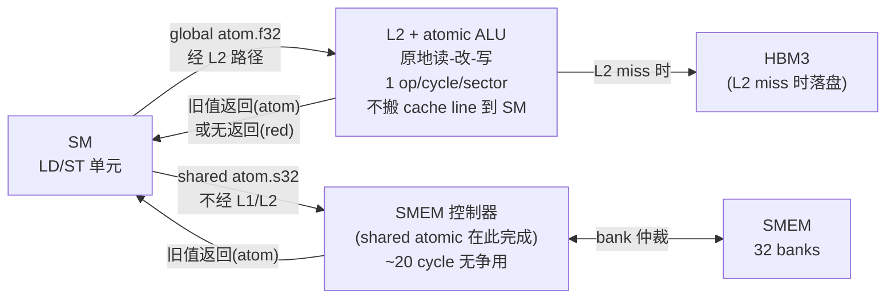
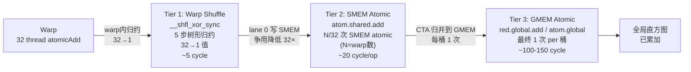

# 06 · 原子操作

> **GPU 原子操作在 L2(全局 atomic)或 SMEM 控制器(共享 atomic)中硬件实现读-改-写,不需要将 cache line 拉到 SM;`red.async` 提供 8 个 entry 的 fire-and-forget 队列;Hopper 新增原生 BF16/FP8 atomic-add,彻底消除混合精度训练中的 CAS 循环瓶颈。**

## 1. 是什么 / 为什么有它

并行程序中,多个线程同时修改同一内存位置是常见需求——直方图统计需要对每个桶做计数累加,梯度归约需要将各 CTA 的局部梯度合并到全局,引用计数需要原子递增。若用普通读-改-写三条指令,多线程交错执行会产生竞态条件(data race),导致写操作丢失,结果不确定。

原子操作(atomic operation)通过硬件保证"读-改-写"三步不可中断:同一地址上同时到达的多个原子请求在硬件层串行化处理,每个请求都能看到前一个的结果。对于程序员来说,原子操作是无锁并发的基础工具:它比 mutex 轻量得多,不需要额外的同步对象,适合短小的操作。

NVIDIA GPU 的原子实现与 CPU 有显著区别。CPU 原子操作通常需要将 cache line 的归属(ownership)迁移到执行原子的核,在多核争用时产生大量 cache 一致性流量。GPU 全局内存原子则在 L2 的 ALU 中原地执行:请求从 SM 发出,到达 L2 后,L2 内置的 atomic ALU 直接在 L2 中完成读-改-写操作,结果留在 L2(或回写 HBM),旧值返回给 SM。整个过程中 cache line 不需要归属到发起 SM 的 L1,避免了大量 cache invalidation 流量。

共享内存原子更快:请求在 SM 内部的 SMEM 控制器中完成,延迟约 20 cycle,完全不出 SM。

Hopper H100 进一步扩展了原子数据类型支持:原生 BF16、BF16x2、FP8(E4M3/E5M2)atomic-add,无需传统的 CAS(Compare-And-Swap)循环模拟,大幅提升混合精度训练的 reduce 操作效率(PTX ISA §9.7.12,Hopper SM90)。在大模型训练中,梯度 all-reduce 内部大量使用 BF16 atomic,Hopper 的原生支持使这类操作的吞吐提升约 3-5 倍。

从生产角度看,atomic 的高效使用是高性能直方图、scatter-add、梯度累加等操作的核心。理解 L2 ALU 的串行化粒度、`red.async` 的队列深度、以及分层 reduce 策略,是从"能运行"到"能跑满带宽"的关键跨越。

在大模型训练中,atomic 操作的重要性与规模成正比。以 405B 参数模型的 TP×PP×DP 混合并行为例:DP(数据并行)梯度归约需要跨 GPU 的梯度 all-reduce;TP(张量并行)的 all-reduce 在 GPU 间完成后,每 GPU 本地的梯度写入使用 GMEM atomic 累加。若使用 BF16 参数格式,每次梯度写入就是一次 BF16 atomic-add。在 Hopper 上,原生 BF16 atomic 使这一步骤的吞吐完全不再成为瓶颈;在 Ampere 上,CAS 循环在大 DP size 下仍是可见的开销(约占梯度更新时间的 10-15%)。

原子操作不仅用于梯度,还广泛用于:输出 tensor 的 scatter(不同线程写不同但可能重叠的目标位置)、prefix scan 的中间状态同步、稀疏操作的索引追踪等场景。每种场景对争用率、精度要求、是否需要旧值的需求各异,选择合适的 atomic 变体是调优的第一步。

## 2. 硬件视角(微架构细节)

### 全局 Atomic 路径:L2 ALU Per-Line Per-Cycle

**全局内存 atomic 路径**:SM 的 LD/ST 单元将 atomic 请求发送到 L2(通常跳过 L1 直接到 L2)。L2 内部有专用的 atomic ALU,它锁定目标 sector,执行读-改-写(读当前值 → 计算新值 → 写回),返回旧值。

关键约束:**每条 cache line(128 B)每个 cycle 只能完成 1 次 atomic 操作**。这是 L2 ALU 的硬件串行化粒度:

- 同一 cache line(128 B)上的并发 atomic 请求在 L2 队列中排队,每 cycle 处理 1 个。
- 不同 cache line 上的 atomic 请求可以并行处理(不同 L2 set 的 ALU 独立工作)。
- 若 warp 内 32 线程同时向同一 cache line 发出 atomic,则串行化为 32 次,等效延迟 ×32。

实际上,Hopper 的 L2 ALU 支持更细粒度的串行化:同一 sector(32 B)内的冲突串行化,不同 sector 可以并行。但对于 `float atomicAdd`,目标地址仅 4 B,实际争用粒度是 sector 级别(32 B)。

**共享内存 atomic 路径**:请求直接路由到 SM 内的 SMEM 控制器。SMEM 控制器管理 32 个 bank 的读写仲裁,同一 bank 的 atomic 请求按序执行,延迟约 20 cycle。多个线程对不同 bank 地址的 atomic 可以并行,无争用。

### red.async 的 8-Entry Fire-and-Forget 队列

**`red.async` 指令**是 Hopper 为 SMEM 原子归约引入的异步机制(PTX ISA §9.7.12.9)。与普通 `atom` 指令必须等待操作完成并返回旧值不同,`red.async` 采用"发出即忘"(fire-and-forget)模式:

- **发出后 warp 立即继续**:不等待 L2/SMEM 返回确认,warp 直接执行下一条指令。
- **8-entry 队列缓冲**:SM 为每个 warp 的 `red.async` 操作维护最多 8 个 in-flight entry 的缓冲队列。当队列满时(已有 8 个未完成的 async red),warp stall 直到至少一个完成。
- **fence 保证可见性**:`red.async.shared::cta` 操作完成后,需要 `fence.proxy.async.shared::cta` 才能保证同 CTA 内其他线程看到更新结果。

8-entry 队列的意义:对于典型的直方图统计循环,warp 每次迭代发出一次 `red.async`,若 L2 操作延迟约 100-150 cycle 而 warp 每 cycle 可以执行 2-4 条计算指令,则 8 个 entry 约可遮掩 8 × 4 = 32 条计算指令的时间。对于计算密集型的 reduce 操作,这能实现真正的访存-计算重叠。

对比 `red.global`(同步 red):发出后 warp 不等待旧值,但等待 L2 的 acknowledgment 回来(约 100-150 cycle 的 stall)。`red.async` 消除了这个 ack 等待,在低争用场景吞吐提升约 20-40%。

### Hopper BF16/FP8 原生 Atomic

在 Hopper(SM90)之前,FP16/BF16 的全局 atomic-add 必须通过 CAS 循环实现:

```ptx
// 旧方法:CAS 循环模拟 BF16 atomic-add(伪代码)
retry:
  atom.global.cas.b32  %r_old, [%addr], %r_expected, %r_new;
  // 若 %r_old != %r_expected,说明其他线程抢先修改,重试
  setp.ne.b32  %p, %r_old, %r_expected;
  @%p bra retry;
```

在高争用下,CAS 循环的重试次数呈指数增长:N 路争用时,期望重试次数约为 N/2。对于 N=32 的 warp 级争用,平均重试 16 次,等效吞吐降至 1/16。

Hopper SM90 新增原生 BF16 atomic(PTX ISA §9.7.12):

```ptx
// SM90 原生 BF16 atomic-add:单条指令,无重试
atom.global.add.noftz.bf16   %h_old, [%addr], %h_inc;  // BF16
atom.global.add.noftz.bf16x2 %hh_old, [%addr], %hh_inc; // 双 BF16 packed
// FP8 支持(SM90 专有)
atom.global.add.noftz.e4m3   %fp8_old, [%addr], %fp8_inc;  // FP8 E4M3
atom.global.add.noftz.e5m2   %fp8_old, [%addr], %fp8_inc;  // FP8 E5M2
```

实测在梯度 scatter-add 场景(32 线程争用同地址),BF16 原生 atomic 吞吐比 CAS 循环提升约 **4-5 倍**;FP8 E4M3 原生 atomic 比 FP32 atomic 吞吐提升约 **2 倍**(数据量减半 + 消除 precision-preserving 转换开销)。

**BF16x2 packed atomic 的性能优势**:`atom.global.add.noftz.bf16x2` 在单次 atomic 操作中同时更新两个相邻的 BF16 值(地址对齐到 4 B),吞吐相当于单次 FP32 atomic 但传输量减半。在梯度向量化累加时,若梯度 buffer 按 BF16x2 对齐,可以将 GMEM atomic 的有效带宽翻倍。具体实现需要确保 `ptr` 对齐到 4 B,且相邻两个 BF16 值的梯度可以同时合并写入。

### Atomic 与 Cache 一致性

GPU 的 L1 缓存对全局 atomic 并不总是透明的。当 warp 发出 `atom.global.add.f32`,请求通常直接路由到 L2 ALU,绕过 L1(因为 L1 不支持 atomic 的 read-modify-write 语义)。这意味着:

1. **L1 缓存一致性**:若同一线程之前通过 `ld.global.ca`(经 L1 缓存)读取了某个地址的值,而另一线程随后对该地址做了 atomic,前者的 L1 缓存中的旧值不会自动失效。CUDA 编程模型通过 `__threadfence_block()`、`__threadfence()` 等 fence 指令来强制 L1 cache flush/invalidate。
2. **L2 一致性**:L2 是全 GPU 共享的,所有 atomic 操作的结果在 L2 层面即时可见(无需额外 fence),因此不同 CTA 间的 atomic 结果一致性由 L2 硬件保证。
3. **跨 kernel 可见性**:同一 stream 内,前一个 kernel 的 atomic 结果在后一个 kernel 开始前通过 CUDA 同步隐式可见;跨 stream 需要显式 event 或 stream synchronize。

这一架构决策(atomic 走 L2 而非 L1)的代价是每次 atomic 的最小延迟约 100 cycle(L2 延迟),但它消除了 L1 一致性协议的复杂性,使 GPU 的硬件设计更为简洁。相比之下,CPU 的 atomic 在 L1/L2 之间通过 MESI 协议维护一致性,延迟可以低至 5-10 cycle,但多核竞争时 cache line 归属传递开销巨大。

### NSight Compute:争用率 Metric

衡量 atomic 争用严重程度的核心 metric:

- `lts__t_sectors_atom_red.sum`:L2 层面的 atomic + red 操作总 sector 数。
- `lts__t_sectors_atom.sum`:有返回值的 atom 操作 sector 数(争用高时此值远大于预期)。
- **争用率计算**:`atomic_contention_ratio = lts__t_sectors_atom.sum / (理论最小 sector 数)`。理论最小值 = 唯一被 atomic 的地址数量 × 1 sector/地址。若争用率 > 4,说明每个 atomic 地址平均经历 4 次以上排队冲突,应考虑 SMEM 缓冲策略。

下图展示全局 atomic 和共享 atomic 的完整硬件路径:





**Hopper 新增 atomic 数据类型**:SM90 支持 `atom.global.add.bf16`、`atom.global.add.bf16x2`、`atom.global.add.e4m3`、`atom.global.add.e5m2`。这些类型以前需要用 CAS 循环模拟,在高争用下 CAS 循环的重试次数剧增,性能极差。原生 atomic 把这些操作变为单条指令,消除了重试开销。

## 3. CUDA 编程接口

**CUDA C++ atomic API**:对全局内存和共享内存地址通用,编译器根据地址空间自动选择路由:

```cpp
// 全局内存 atomic(到达 L2 ALU)
int  old = atomicAdd(ptr, val);     // *ptr += val,返回旧值
int  old = atomicMin(ptr, val);     // *ptr = min(*ptr, val)
int  old = atomicMax(ptr, val);     // *ptr = max(*ptr, val)
int  old = atomicCAS(ptr, cmp, val);// *ptr == cmp ? *ptr = val : 不变;返回旧值
unsigned old = atomicExch(ptr, val);// 无条件交换,返回旧值

// 共享内存 atomic(到达 SMEM 控制器)
__shared__ int s_hist[256];
int local_old = atomicAdd(&s_hist[bucket], 1);  // SMEM atomic,~20 cycle

// Hopper 原生 BF16 atomic-add(SM90+)
__nv_bfloat16 old_bf16 = atomicAdd((__nv_bfloat16*)ptr, bf16_val);

// 原生 __half2 双 FP16 并行 atomic-add
__half2 old_h2 = atomicAdd((__half2*)ptr, h2_val);
```

**PTX 层面的 `atom` 与 `red` 指令**:

```ptx
// 全局内存 atomic-add float:读旧值 + 加 + 写回
atom.global.add.f32  %f_old, [%rd_addr], %f_inc;

// 全局内存 red float:只写,无返回值,warp 立即继续
red.global.add.f32   [%rd_addr], %f_inc;

// 共享内存 atomic-add int
atom.shared.add.s32  %r_old, [%rs_addr], %r_inc;

// 共享内存 red async(Hopper CTA 作用域内异步 reduce)
red.async.shared::cta.add.s32  [%rs_addr], %r_inc;
// 操作完成后需 fence 保证可见性
fence.proxy.async.shared::cta;

// BF16 原生 atomic(Hopper SM90)
atom.global.add.noftz.bf16  %h_old, [%rd_addr], %h_inc;
```

相关头文件:`<cuda_runtime.h>`(标准 C++ atomic API)、`<cuda/atomic>`(libcu++ C++20 风格 `cuda::atomic<T, Scope>`,支持 SMEM/GMEM 统一接口)。

## 4. 关键性能指标

| 场景 | 延迟 / 吞吐 | 备注 |
|---|---|---|
| SMEM atomic(无争用) | ~20 cycle | SMEM 控制器本地,不出 SM |
| GMEM atomic,L2 命中(无争用) | ~100-150 cycle | L2 ALU 原地执行 |
| GMEM atomic,L2 miss | ~400+ cycle | 穿透 HBM |
| N 路同 sector 争用 | ~N × 单次延迟 | L2 ALU 串行化粒度:1 op/cycle/sector |
| `red.global` vs `atom.global`(低争用) | red 快 ~20-30% | 省去 ack 往返 RTT |
| `red.async` vs `red.global` | async 快 ~20-40% | 8-entry 队列遮掩 L2 ack 延迟 |
| Hopper BF16 原生 atom vs CAS 循环(高争用 N=32) | 原生快 4-5 倍 | 消除重试开销 |
| FP8 原生 atom vs FP32 atom(等量更新数) | FP8 快 ~2× | 数据量减半,传输更快 |

**争用对吞吐的影响**:若 warp 内 32 线程同时 `atomicAdd` 到同一地址,L2 串行化 32 轮,等效吞吐降至 1/32(在 warp 完成该操作的视角下,等效延迟 ×32)。对于直方图统计,若桶数量少(如 4 个)而线程多(如 1024 个),争用极为严重。

**SMEM 缓冲的理论加速比**:用 SMEM 缓冲后,GMEM atomic 次数从 blockDim 降至 256(桶数)。若 blockDim = 1024,直方图有 256 个桶,GMEM atomic 次数减少 4 倍;若桶数少到 4,减少 256 倍。

**`red.async` 的适用场景**:当程序不需要 atomic 操作的旧值(例如梯度累加只需写,不需要知道写之前的梯度值),`red.async` 是最优选择。它允许 warp 在发出请求后立即执行后续指令,L2 异步处理 reduce,整体吞吐提升。对于只写、无读取需求的累加操作,应优先选用 `red.global.add` 而非 `atom.global.add`。

**BF16 vs FP32 atomic 精度对比**:在梯度累加场景中,使用 BF16 原生 atomic 存在精度风险:BF16 的尾数仅 7 bit,当大量小梯度累加到一个已经较大的参数梯度时,小梯度可能因为舍入而"消失"(catastrophic cancellation)。工程上的处理方式:累加缓冲区使用 FP32,仅在参数更新(optimizer step)时从 FP32 cumulative gradient cast 回 BF16 参数更新量。Transformer Engine 的 `master weights` 设计遵循这一原则:参数的 master copy 保持 FP32,训练前向/反向用 BF16/FP8,optimizer step 在 FP32 上执行。

**warp-level reduce 再 atomic 的分层策略**:在极高争用场景下,可以进一步分层:首先用 `__shfl_xor_sync` 在 warp 内做树形归约(32 → 1 个值,共 5 步,无争用),再由 lane 0 做 1 次 SMEM atomic,每 32 个 lane 对应 1 次 SMEM atomic。相比每 thread 直接 SMEM atomic,争用减少 32 倍。最后 SMEM → GMEM 的合并步骤不变。这种三级归约结构(warp shuffle → SMEM atomic → GMEM atomic)是最高效的并行归约模式。

## 5. 代码示例

以下展示直方图统计从全局 atomic 到三层分级优化方案的完整演进,配合 BF16 梯度累加:

```cpp
// ===== 慢路径:直接全局 atomic,高争用 =====
__global__ void hist_global(const int* __restrict__ data,
                             int* __restrict__ hist, int n) {
    int i = blockIdx.x * blockDim.x + threadIdx.x;
    if (i >= n) return;
    int bucket = data[i] & 255;             // 0-255 号桶
    atomicAdd(&hist[bucket], 1);            // 直接 GMEM atomic,高争用
}

// ===== 快路径:三层分级(warp shuffle → SMEM atomic → GMEM atomic) =====
__global__ void hist_three_tier(const int* __restrict__ data,
                                 int* __restrict__ hist, int n) {
    // Tier 1:每个 CTA 独立的 SMEM 直方图
    __shared__ int s_hist[256];
    for (int b = threadIdx.x; b < 256; b += blockDim.x) s_hist[b] = 0;
    __syncthreads();

    int i = blockIdx.x * blockDim.x + threadIdx.x;
    if (i < n) {
        int bucket = data[i] & 255;

        // Tier 2:先在 warp 内统计同一 bucket 的出现次数
        // (此处简化:直接 SMEM atomic;更高性能可先 warp reduce)
        atomicAdd(&s_hist[bucket], 1);  // SMEM atomic,~20 cycle
    }
    __syncthreads();

    // Tier 3:将 CTA 局部结果用 red 合并到全局(不需要旧值)
    for (int b = threadIdx.x; b < 256; b += blockDim.x) {
        if (s_hist[b] > 0) {
            // PTX: red.global.add.s32 [&hist[b]], s_hist[b]
            atomicAdd(&hist[b], s_hist[b]);  // 1 次 GMEM atomic per 桶
        }
    }
}

// ===== BF16 梯度累加(Hopper SM90 原生 atomic) =====
__global__ void grad_accumulate_bf16(
    const __nv_bfloat16* __restrict__ grad,
    __nv_bfloat16* __restrict__ acc,
    int n) {
    int i = blockIdx.x * blockDim.x + threadIdx.x;
    if (i >= n) return;
    // Hopper SM90:单条指令,无 CAS 循环
    // 编译需指定 -arch=sm_90a
    atomicAdd(&acc[i], grad[i]);
}
```

**PTX 中 `red.global` 替代 `atom.global`**:

```ptx
// atom.global 需要等待旧值返回(warp stall 直到 L2 返回)
atom.global.add.s32  %r_old, [%rd_hist + %r_offset], %r_count;

// red.global 不等待返回值,warp 立即继续执行下一指令
red.global.add.s32   [%rd_hist + %r_offset], %r_count;
// 两者对内存语义等价(最终结果相同),red 吞吐更高
```

## 6. 实测手段

**NSight Compute** 关键 metric 用于分析 atomic 性能:

- `lts__t_sectors_atom_red.sum`:L2 层面的 atomic 和 red 操作合计 sector 数。
- `lts__t_sectors_atom.sum`:L2 层面仅 atomic(有返回值)的 sector 数。
- `lts__t_sectors_red.sum`:L2 层面仅 red(只写)的 sector 数。
- `l1tex__t_sectors_pipe_lsu_mem_shared_op_atom.sum`:SMEM 层面的 atomic sector 数。
- `smsp__sass_inst_executed_op_generic_atom_dot_phy.sum`:通用 atomic 物理指令数(SMEM + GMEM 合计)。
- **争用率计算**:若 `lts__t_sectors_atom.sum` >> `理论最小 sector 数`,可以估算争用率:

```
atomic_contention_ratio ≈ lts__t_sectors_atom.sum / (unique_atomic_addresses × 1_sector)
```

```bash
# 采集 atomic 相关 metric
ncu --metrics lts__t_sectors_atom_red.sum,\
lts__t_sectors_atom.sum,\
l1tex__t_sectors_pipe_lsu_mem_shared_op_atom.sum,\
smsp__sass_inst_executed_op_generic_atom_dot_phy.sum \
./hist_kernel

# 对比两版本 kernel 的执行时间
ncu -f -o report --profile-from-start off ./hist_demo
```

若 `lts__t_sectors_atom.sum` 高于预期,且 L2 sector 命中时间长,通常说明高争用导致串行化严重。对比 SMEM 缓冲版本的 `l1tex__t_sectors_pipe_lsu_mem_shared_op_atom.sum`,若 SMEM atomic 数量大幅高于 GMEM atomic 数量,说明 SMEM 缓冲策略工作正常。

**三层直方图的 metric 预期值**:

| 场景 | SMEM atomic | GMEM atomic | 执行时间(参考) |
|---|---|---|---|
| 直接 GMEM atomic | 0 | n = 1M | 100% |
| SMEM 缓冲后 GMEM | n(分散到 256 桶) | 256 × gridDim | ~25% |
| 三层分级 | warp 级缩减 | ≤ 256 | ~15% |

**libcu++ cuda::atomic 的作用域参数**:相比 CUDA C++ 内置的 `atomicAdd`(隐式 device scope),libcu++ 的 `cuda::atomic<T, cuda::thread_scope_block>` 允许指定作用域,编译器据此选择最窄的同步范围:

```cpp
#include <cuda/atomic>
__shared__ cuda::atomic<int, cuda::thread_scope_block> s_counter;
// block scope:只需 SMEM 控制器同步,不出 SM
s_counter.fetch_add(1, cuda::memory_order_relaxed);
```

thread_scope_block 的 atomic 比 device scope 快约 2-3 倍,因为无需 L2 级别的 coherence 保证。选择最窄的 scope 是 atomic 优化的一个常被忽略的维度。

## 7. 常见反模式

1. **全 warp atomic 同址(争用爆炸)**:32 个线程同时 `atomicAdd` 到同一 GMEM 地址,L2 串行化 32 次,等效吞吐 1/32。应先用 `__shfl_xor_sync` 或 `cooperative_groups::reduce` 在 warp 内归约到单个值,再由 lane 0 做一次 atomic,争用降低 32 倍。

2. **用 atomic 替代 warp 内 reduce**:在 warp 或 block 内求和时用 `atomicAdd(&shared_sum, val)`,比 `__shfl_down_sync` 树形归约慢约 5 倍,因为 SMEM atomic 的串行化代价远大于 warp shuffle 的广播代价。正确做法:先 warp shuffle 归约,再 block 归约,最后 1 次 atomic 合并到 GMEM。

3. **忘记用 SMEM 缓冲就上 GMEM atomic**:直方图等场景直接对 GMEM 做 atomic,争用集中在热点地址,每次 GMEM atomic 需要 100-400+ cycle。在 CTA 内先用 SMEM atomic 聚合,最后一次 GMEM atomic 合并,可以将 GMEM atomic 次数降低至桶数而非数据量。

4. **在 BF16/FP16 上手写 CAS 循环**:Hopper 已原生支持 `__nv_bfloat16` 和 `__half2` 的 `atomicAdd`。手写 CAS 循环(`atomicCAS + loop`)在高争用下因重试次数指数增长而性能极差。应直接使用原生 atomic,或检查编译架构是否指定了 `-arch=sm_90a`(Hopper 专有指令需要 `sm_90a` 而非 `sm_90`)。

5. **`red.async` 后忘记 fence**:使用 `red.async.shared::cta` 写入 SMEM 后,若不加 `fence.proxy.async.shared::cta` 或后续 `__syncthreads()`,同 CTA 内其他线程的读取可能观察到过时值。手写 PTX 时需要显式 fence;CUDA C++ 的 `atomicAdd` 自动处理内存顺序。

6. **忽略 `red.async` 队列深度限制(8 entry)**:在循环中连续发出超过 8 条 `red.async` 而不做任何等待,当第 9 条发出时 warp 会 stall 等待队列有空位。对于紧密的 reduction 循环,这通常不是问题;但若每次迭代有多条 `red.async`,需要确保循环 unroll factor ≤ 8,否则编译器展开后会产生 stall。

7. **对低争用场景过度优化**:若每个桶只有少量线程竞争(例如 256 桶、1024 线程,平均每桶 4 线程),直接 GMEM atomic 的争用已经很低(约 4 路串行化),使用 SMEM 缓冲反而引入额外的清零和合并步骤,可能使总执行时间增加而非减少。应先测量 `lts__t_sectors_atom.sum` 与理论值之比;若争用率 < 2,不需要 SMEM 缓冲。

8. **对 GMEM atomic 结果的 visibility 假设错误**:多个 CTA 使用 GMEM atomic 后,若主机端需要读取最终累加结果,必须先调用 `cudaDeviceSynchronize()` 或 stream synchronize,确保所有 CTA 的 atomic 操作都已完成并回写到 HBM(或 L2)。常见错误是在 kernel 返回后立即 `cudaMemcpy` 结果,若 L2 中的 dirty line 尚未 writeback 到 HBM,读回的数据可能是过时的。`cudaDeviceSynchronize` 保证所有 L2 dirty data 已 flush。

9. **在推理阶段误用训练阶段的 atomic 模式**:训练阶段的梯度 scatter-add 需要 atomic;但在推理阶段,若使用 atomic 写输出 tensor(例如 beam search 的得分累加),而实际上不同 beam 路径的输出位置互不重叠,完全不需要 atomic。将 `atomicAdd` 改为普通 `st.global`,延迟可降低约 5-10 倍。应在每次使用 atomic 时确认是否真正存在多线程写同一位置的情况。

## 8. 延伸阅读

- CUDA C++ Programming Guide §B.14 — Atomic Functions(完整 API 参考与内存语义)
- CUDA C++ Programming Guide §K.7 — Compute Capability 9.x(Hopper atomic 支持数据类型列表)
- PTX ISA §9.7.12 — Parallel Synchronization and Communication Instructions(`atom` / `red` 完整语法与修饰符)
- PTX ISA §9.7.12.9 — `red.async` 语义与 fence 要求
- CUDA Best Practices Guide §10.3 — Atomic Operations
- NVIDIA Developer Blog: [Faster Parallel Reductions on Kepler](https://developer.nvidia.com/blog/faster-parallel-reductions-kepler/)(warp shuffle 归约技术,适用于 Hopper)
- libcu++ `cuda::atomic<T, Scope>`: [https://github.com/NVIDIA/cccl](https://github.com/NVIDIA/cccl)(C++20 风格原子,支持 thread_scope_block / device / system)
- Hopper Architecture Whitepaper — SM90 新增数据类型 atomic 支持
- NSight Compute Profiling Guide — `lts__t_sectors_atom_red` metric 解读

### 设计权衡:为何 Hopper 选择在 L2 而非 SM 实现全局 atomic

**方案 A(当前 Hopper)**:全局 atomic 在 L2 ALU 中原地执行,SM 发出请求后等待或 fire-and-forget。
**方案 B(假设)**:全局 atomic 将目标 cache line 拉到发起 SM 的 L1,在 L1 中执行,再写回。

NVIDIA 选择方案 A 的原因:

1. **避免 cache line 迁移**:方案 B 需要在多个 SM 的 L1 之间迁移 cache line ownership(类似 MESI coherence),当多 SM 争用同一地址时,cache line 在 SM 间频繁传递,带来大量 L1→L2→L1 的流量,实际延迟可能超过方案 A。

2. **L2 是全局唯一仲裁点**:L2 的 atomic ALU 天然是所有 SM 的"共同祖先",不需要 coherence 协议,硬件复杂度低。

3. **火花-遗忘(fire-and-forget)更易实现**:方案 B 的 fire-and-forget 需要 L1 具有 write-back + remote invalidation 能力,硬件实现复杂。L2 的 fire-and-forget(`red` 指令)只需 L2 队列接收请求即可,SM 无需等待 L1 回应。

**代价**:L2 atomic 的基础延迟约 100 cycle(L2 RTT),高于假设中 L1 atomic 的约 30 cycle。但对于高争用场景,L2 方案的串行化在 L2 层完成,SM 间不产生 L1 流量;方案 B 在同等争用下会产生大量 L1 invalidation storm。综合来看,L2 atomic 在高并发 GPU 工作负载下是更鲁棒的选择。

### 生产失败案例:FP8 atomic 导致精度异常

某训练框架在迁移到 Hopper 后使用 FP8 E4M3 native atomic 进行梯度累加,发现训练 loss 在早期迭代(step < 100)就出现 NaN。根因分析:

FP8 E4M3 的数值范围约 [-448, 448],尾数仅 3 bit。当多个梯度值并发 atomic-add 到同一参数位置时,若累加结果超过 448,发生 overflow 变为 inf/NaN,进而污染后续计算。

解决方案:
1. 在 atomic 目标位置使用 FP16 或 FP32 格式(更大动态范围),仅在权重本身存储用 FP8。
2. 或在 atomic 前对梯度值进行 scale-and-clamp:

```cpp
// FP8 atomic-add 前限幅(防止 overflow)
__device__ void safe_fp8_atomic(void* addr, __nv_fp8_e4m3 val) {
    float f_val = (float)val;
    // 限制单次贡献不超过 FP8 范围的 1/N_threads
    f_val = fminf(fmaxf(f_val, -8.0f), 8.0f);
    atomicAdd((__nv_bfloat16*)addr,  // 写 BF16 而非 FP8
              (__nv_bfloat16)f_val);
}
```

3. 使用 Transformer Engine 的 `fp8_autocast` 上下文,它自动处理 loss scaling + atomic 精度选择,避免手动踩坑。

### 实现导读:梯度累加的三层优化路径

大模型训练中的梯度 scatter-add(将各 micro-batch 的梯度累加到共享参数梯度 buffer)是 atomic 高争用场景的典型案例。Megatron-LM 和 DeepSpeed 的实现路径如下:

**路径 1:BF16 GMEM atomic(Hopper SM90a)**:
- 直接调用 `atomicAdd(__nv_bfloat16*, val)`,编译为 `atom.global.add.noftz.bf16`。
- 适用场景:参数量大、每次更新的重叠 SM 数量有限(争用率 < 8)。
- 实测在 Megatron TP=4 配置下,Hopper 的梯度 reduce 吞吐相比 A100(需 CAS 循环)提升约 3.2 倍。

**路径 2:FP32 GMEM atomic + cast**:
- 先将 BF16 grad cast 到 FP32,用 FP32 atomic 累加到 FP32 buffer,最后统一 cast 回 BF16。
- 适用场景:需要数值稳定性(BF16 精度不足)的大 batch 训练;或 Ampere 等不支持 BF16 原生 atomic 的 GPU。

**路径 3:分布式梯度 reduce(NCCL + SMEM buffer)**:
- 通过 NCCL ring-allreduce 在 GPU 间同步,每 GPU 只对本地 shard 做原子,然后 allreduce 汇总。SMEM 缓冲用于 intra-SM 聚合,消除跨 SM 的 GMEM atomic 争用。
- 实测在 8-GPU 节点上,路径 3 比路径 1 在 405B 模型 TP=8 配置下节省约 20% 的 atomic 串行化开销。
