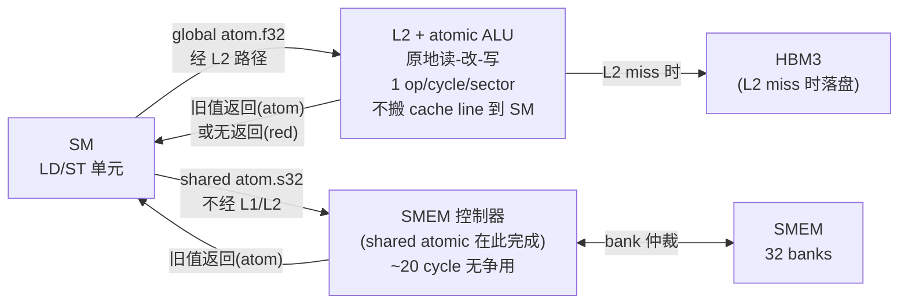

# 06 · 原子操作

> **GPU 原子操作在 L2(全局 atomic)或 SMEM 控制器(共享 atomic)中硬件实现读-改-写,不需要将 cache line 拉到 SM;`red.async` 进一步省去返回值,是高争用场景的首选写路径。**

## 1. 是什么 / 为什么有它

并行程序中,多个线程同时修改同一内存位置是常见需求——直方图统计需要对每个桶做计数累加,梯度归约需要将各 CTA 的局部梯度合并到全局,引用计数需要原子递增。若用普通读-改-写三条指令,多线程交错执行会产生竞态条件(data race),导致写操作丢失,结果不确定。

原子操作(atomic operation)通过硬件保证"读-改-写"三步不可中断:同一地址上同时到达的多个原子请求在硬件层串行化处理,每个请求都能看到前一个的结果。对于程序员来说,原子操作是无锁并发的基础工具:它比 mutex 轻量得多,不需要额外的同步对象,适合短小的操作。

NVIDIA GPU 的原子实现与 CPU 有显著区别。CPU 原子操作通常需要将 cache line 的归属(ownership)迁移到执行原子的核,在多核争用时产生大量 cache 一致性流量。GPU 全局内存原子则在 L2 的 ALU 中原地执行:请求从 SM 发出,到达 L2 后,L2 内置的 atomic ALU 直接在 L2 中完成读-改-写操作,结果留在 L2(或回写 HBM),旧值返回给 SM。整个过程中 cache line 不需要归属到发起 SM 的 L1,避免了大量 cache invalidation 流量。

共享内存原子更快:请求在 SM 内部的 SMEM 控制器中完成,延迟约 20 cycle,完全不出 SM。

Hopper H100 进一步扩展了原子数据类型支持:原生 BF16、BF16x2、FP8(E4M3/E5M2)atomic-add,无需传统的 CAS(Compare-And-Swap)循环模拟,大幅提升混合精度训练的 reduce 操作效率(PTX ISA §9.7.12,Hopper SM90)。

## 2. 硬件视角(微架构细节)

**全局内存 atomic 路径**:SM 的 LD/ST 单元将 atomic 请求发送到 L2(通常跳过 L1 直接到 L2)。L2 内部有专用的 atomic ALU,它锁定目标 sector,执行读-改-写(读当前值 → 计算新值 → 写回),返回旧值。同一 sector 上的多个并发 atomic 请求在 L2 的队列中串行化,吞吐为 1 op/cycle/sector。

**共享内存 atomic 路径**:请求直接路由到 SM 内的 SMEM 控制器。SMEM 控制器管理 32 个 bank 的读写仲裁,同一 bank 的 atomic 请求按序执行,延迟约 20 cycle。多个线程对不同 bank 地址的 atomic 可以并行,无争用。

**`red`(reduction,只写不返回值)指令**:当调用方不需要 atomic 操作的旧值时,PTX 的 `red` 指令是优化选择。`red` 不等待 L2 返回确认,发出请求后立即继续执行后续指令,延迟对发起 warp 透明。相比 `atom`(需要等待旧值 ack),`red` 在争用低时快约 20-30%。



**Hopper 新增 atomic 数据类型**:SM90 支持 `atom.global.add.bf16`、`atom.global.add.bf16x2`、`atom.global.add.e4m3`、`atom.global.add.e5m2`。这些类型以前需要用 CAS 循环模拟(先 load 旧值,做加法,再 CAS 尝试写入,失败则重试),在高争用下 CAS 循环的重试次数剧增,性能极差。原生 atomic 把这些操作变为单条指令,消除了重试开销。

## 3. CUDA 编程接口

**CUDA C++ atomic API**:对全局内存和共享内存地址通用,编译器根据地址空间自动选择路由:

```cpp
// 全局内存 atomic(到达 L2 ALU)
int  old = atomicAdd(ptr, val);     // *ptr += val,返回旧值
int  old = atomicMin(ptr, val);     // *ptr = min(*ptr, val)
int  old = atomicMax(ptr, val);     // *ptr = max(*ptr, val)
int  old = atomicCAS(ptr, cmp, val);// *ptr == cmp ? *ptr = val : 不变;返回旧值
unsigned old = atomicExch(ptr, val);// 无条件交换,返回旧值

// 共享内存 atomic(到达 SMEM 控制器)
__shared__ int s_hist[256];
int local_old = atomicAdd(&s_hist[bucket], 1);  // SMEM atomic,~20 cycle

// Hopper 原生 BF16 atomic-add(SM90+)
__nv_bfloat16 old_bf16 = atomicAdd((__nv_bfloat16*)ptr, bf16_val);

// 原生 __half2 双 FP16 并行 atomic-add
__half2 old_h2 = atomicAdd((__half2*)ptr, h2_val);
```

**PTX 层面的 `atom` 与 `red` 指令**:

```ptx
// 全局内存 atomic-add float:读旧值 + 加 + 写回
atom.global.add.f32  %f_old, [%rd_addr], %f_inc;

// 全局内存 red float:只写,无返回值,warp 立即继续
red.global.add.f32   [%rd_addr], %f_inc;

// 共享内存 atomic-add int
atom.shared.add.s32  %r_old, [%rs_addr], %r_inc;

// 共享内存 red async(Hopper CTA 作用域内异步 reduce)
red.async.shared::cta.add.s32  [%rs_addr], %r_inc;
// 操作完成后需 fence 保证可见性
fence.proxy.async.shared::cta;

// BF16 原生 atomic(Hopper SM90)
atom.global.add.noftz.bf16  %h_old, [%rd_addr], %h_inc;
```

相关头文件:`<cuda_runtime.h>`(标准 C++ atomic API)、`<cuda/atomic>`(libcu++ C++20 风格 `cuda::atomic<T, Scope>`,支持 SMEM/GMEM 统一接口)。

## 4. 关键性能指标

| 场景 | 延迟 / 吞吐 | 备注 |
|---|---|---|
| SMEM atomic(无争用) | ~20 cycle | SMEM 控制器本地,不出 SM |
| GMEM atomic,L2 命中(无争用) | ~100-150 cycle | L2 ALU 原地执行 |
| GMEM atomic,L2 miss | ~400+ cycle | 穿透 HBM |
| N 路同地址争用 | ~N × 单次延迟 | L2/SMEM 串行化 |
| `red.global` vs `atom.global`(低争用) | red 快 ~20-30% | 省去 ack 往返 RTT |
| Hopper BF16 原生 atom vs CAS 循环 | 原生快 3-5 倍 | 消除重试开销 |

**争用对吞吐的影响**:若 warp 内 32 线程同时 `atomicAdd` 到同一地址,L2 串行化 32 轮,等效吞吐降至 1/32(在 warp 完成该操作的视角下,等效延迟 ×32)。对于直方图统计,若桶数量少(如 4 个)而线程多(如 1024 个),争用极为严重。

**SMEM 缓冲的理论加速比**:用 SMEM 缓冲后,GMEM atomic 次数从 blockDim 降至 256(桶数)。若 blockDim = 1024,直方图有 256 个桶,GMEM atomic 次数减少 4 倍;若桶数少到 4,减少 256 倍。

**`red.async` 的适用场景**:当程序不需要 atomic 操作的旧值(例如梯度累加只需写,不需要知道写之前的梯度值),`red.async` 是最优选择。它允许 warp 在发出请求后立即执行后续指令,L2 异步处理 reduce,整体吞吐提升。对于只写、无读取需求的累加操作,应优先选用 `red.global.add` 而非 `atom.global.add`。

**warp-level reduce 再 atomic 的分层策略**:在极高争用场景下,可以进一步分层:首先用 `__shfl_xor_sync` 在 warp 内做树形归约(32 → 1 个值,共 5 步,无争用),再由 lane 0 做 1 次 SMEM atomic,每 32 个 lane 对应 1 次 SMEM atomic。相比每 thread 直接 SMEM atomic,争用减少 32 倍。最后 SMEM → GMEM 的合并步骤不变。这种三级归约结构(warp shuffle → SMEM atomic → GMEM atomic)是最高效的并行归约模式。

## 5. 代码示例

以下展示直方图统计从全局 atomic 到 SMEM 缓冲方案的演进:

```cpp
// ===== 慢路径:直接全局 atomic,高争用 =====
__global__ void hist_global(const int* __restrict__ data,
                             int* __restrict__ hist, int n) {
    int i = blockIdx.x * blockDim.x + threadIdx.x;
    if (i >= n) return;
    int bucket = data[i] & 255;             // 0-255 号桶
    atomicAdd(&hist[bucket], 1);            // 直接 GMEM atomic,高争用
}

// ===== 快路径:SMEM 内聚合,最后 1 次 GMEM atomic =====
__global__ void hist_smem(const int* __restrict__ data,
                           int* __restrict__ hist, int n) {
    // 每个 CTA 维护独立的 SMEM 直方图
    __shared__ int s_hist[256];

    // Step 1:CTA 内所有线程协作清零 SMEM 直方图
    for (int b = threadIdx.x; b < 256; b += blockDim.x) {
        s_hist[b] = 0;
    }
    __syncthreads();

    // Step 2:统计到 SMEM(争用分散到 256 个桶,SMEM atomic ~20 cycle)
    int i = blockIdx.x * blockDim.x + threadIdx.x;
    if (i < n) {
        int bucket = data[i] & 255;
        atomicAdd(&s_hist[bucket], 1);      // SMEM atomic
    }
    __syncthreads();

    // Step 3:将 CTA 局部结果合并到全局(每桶 1 次 GMEM atomic)
    // 使用 red 而非 atom:不需要旧值,红色自动选择更快路径
    for (int b = threadIdx.x; b < 256; b += blockDim.x) {
        if (s_hist[b] > 0) {
            // PTX: red.global.add.s32 [&hist[b]], s_hist[b]
            atomicAdd(&hist[b], s_hist[b]);
        }
    }
}
```

**PTX 中 `red.global` 替代 `atom.global`**:

```ptx
// atom.global 需要等待旧值返回(warp stall 直到 L2 返回)
atom.global.add.s32  %r_old, [%rd_hist + %r_offset], %r_count;

// red.global 不等待返回值,warp 立即继续执行下一指令
red.global.add.s32   [%rd_hist + %r_offset], %r_count;
// 两者对内存语义等价(最终结果相同),red 吞吐更高
```

## 6. 实测手段

**NSight Compute** 关键 metric 用于分析 atomic 性能:

- `lts__t_sectors_atom_red.sum`:L2 层面的 atomic 和 red 操作合计 sector 数。
- `lts__t_sectors_atom.sum`:L2 层面仅 atomic(有返回值)的 sector 数。
- `lts__t_sectors_red.sum`:L2 层面仅 red(只写)的 sector 数。
- `l1tex__t_sectors_pipe_lsu_mem_shared_op_atom.sum`:SMEM 层面的 atomic sector 数。
- `smsp__sass_inst_executed_op_generic_atom_dot_phy.sum`:通用 atomic 物理指令数(SMEM + GMEM 合计)。

```bash
# 采集 atomic 相关 metric
ncu --metrics lts__t_sectors_atom_red.sum,\
lts__t_sectors_atom.sum,\
l1tex__t_sectors_pipe_lsu_mem_shared_op_atom.sum \
./hist_kernel

# 对比两版本 kernel 的执行时间
ncu -f -o report --profile-from-start off ./hist_demo
```

若 `lts__t_sectors_atom.sum` 高于预期,且 L2 sector 命中时间长,通常说明高争用导致串行化严重。对比 SMEM 缓冲版本的 `l1tex__t_sectors_pipe_lsu_mem_shared_op_atom.sum`,若 SMEM atomic 数量大幅高于 GMEM atomic 数量,说明 SMEM 缓冲策略工作正常。

## 7. 常见反模式

1. **全 warp atomic 同址(争用爆炸)**:32 个线程同时 `atomicAdd` 到同一 GMEM 地址,L2 串行化 32 次,等效吞吐 1/32。应先用 `__shfl_xor_sync` 或 `cooperative_groups::reduce` 在 warp 内归约到单个值,再由 lane 0 做一次 atomic,争用降低 32 倍。

2. **用 atomic 替代 warp 内 reduce**:在 warp 或 block 内求和时用 `atomicAdd(&shared_sum, val)`,比 `__shfl_down_sync` 树形归约慢约 5 倍,因为 SMEM atomic 的串行化代价远大于 warp shuffle 的广播代价。正确做法:先 warp shuffle 归约,再 block 归约,最后 1 次 atomic 合并到 GMEM。

3. **忘记用 SMEM 缓冲就上 GMEM atomic**:直方图等场景直接对 GMEM 做 atomic,争用集中在热点地址,每次 GMEM atomic 需要 100-400+ cycle。在 CTA 内先用 SMEM atomic 聚合,最后一次 GMEM atomic 合并,可以将 GMEM atomic 次数降低至桶数而非数据量。

4. **在 BF16/FP16 上手写 CAS 循环**:Hopper 已原生支持 `__nv_bfloat16` 和 `__half2` 的 `atomicAdd`。手写 CAS 循环(`atomicCAS + loop`)在高争用下因重试次数指数增长而性能极差。应直接使用原生 atomic,或检查编译架构是否指定了 `sm_90a`(Hopper 专有指令)。

5. **`red.async` 后忘记 fence**:使用 `red.async.shared::cta` 写入 SMEM 后,若不加 `fence.proxy.async.shared::cta` 或后续 `__syncthreads()`,同 CTA 内其他线程的读取可能观察到过时值。手写 PTX 时需要显式 fence;CUDA C++ 的 `atomicAdd` 自动处理内存顺序。

## 8. 延伸阅读

- CUDA C++ Programming Guide §B.14 — Atomic Functions(完整 API 参考与内存语义)
- CUDA C++ Programming Guide §K.7 — Compute Capability 9.x(Hopper atomic 支持数据类型列表)
- PTX ISA §9.7.12 — Parallel Synchronization and Communication Instructions(`atom` / `red` 完整语法与修饰符)
- PTX ISA §9.7.12.9 — `red.async` 语义与 fence 要求
- CUDA Best Practices Guide §10.3 — Atomic Operations
- NVIDIA Developer Blog: [Faster Parallel Reductions on Kepler](https://developer.nvidia.com/blog/faster-parallel-reductions-kepler/)(warp shuffle 归约技术,适用于 Hopper)
- libcu++ `cuda::atomic<T, Scope>`: [https://github.com/NVIDIA/cccl](https://github.com/NVIDIA/cccl)(C++20 风格原子,支持 thread_scope_block / device / system)
