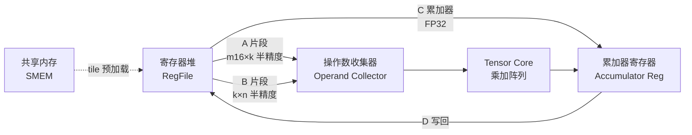
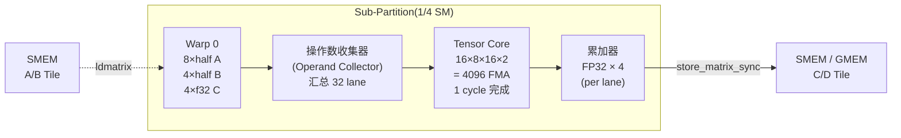

# 07 · Tensor Core

> **Tensor Core 是 GPU 上专用的矩阵乘加单元,一条 PTX 指令完成 D = A × B + C 的混合精度矩阵分块运算,峰值吞吐远超标量 ALU。**

## 1. 是什么 / 为什么有它

深度学习训练与推理的核心计算是大规模矩阵乘法(GEMM)。一个标准 Transformer 模型的前向传播中,超过 95% 的 FLOP 来自矩阵乘,而传统标量 FP32 ALU 每个周期只能做一次乘加,面对数十亿乃至数万亿次乘加操作,硬件效率极低。

Tensor Core(TC)是 NVIDIA 专为矩阵乘设计的硬件单元。其核心思想是:利用矩阵乘的规律性,把 m×k 矩阵与 k×n 矩阵的所有乘加电路一次性并行执行,而非逐元素串行调度。每条 TC 指令覆盖一个小型矩阵分块(如 m=16, k=16, n=8),所有乘加在同一周期内完成。

TC 的演进历程:
- **Volta V100(2017):** 首次引入 TC,支持 FP16 输入 + FP32 累加,m8n8k4 分块
- **Turing T4(2018):** 新增 INT8/INT4 支持,用于推理量化
- **Ampere A100(2020):** 扩展至 BF16、TF32,分块升至 m16n8k16;引入稀疏 TC
- **Hopper H100(2022):** 新增 FP8(E4M3、E5M2),分块升至 m16n8k32;同时引入 wgmma 异步接口

Hopper SM90 在每个 sub-partition 内放置 1 个 TC,全芯片共 132 SM × 4 sub-partition = **528 个 TC**(80 GB SXM5 规格)。TC 支持 FP16、BF16、TF32、FP8、INT8、INT4 等多种输入精度,累加器统一使用 FP32 或 INT32,兼顾训练精度与推理速度。

**为什么不用 FP32 TC?** 硬件面积与乘法精度的权衡:FP32 × FP32 的尾数乘法器需要 23 × 23 bit 宽度的乘法器树,面积约是 FP16 × FP16 的 4 倍。以相同晶体管预算,Hopper 在同等面积内放 4 倍数量的 FP16 TC 单元,再通过高精度 FP32 累加器保证训练精度。这是 TC "低精度输入 + 高精度累加"设计哲学的核心出发点。

**为什么选 warp-group 而非单 warp?** mma.sync 以 32 线程 warp 为单元,每次只驱动 1 个 sub-partition 的 TC。Hopper 的 wgmma 升级为 128 线程的 warp-group,同时驱动全部 4 个 sub-partition 的 TC,A 矩阵 M 维从 16 扩展到 64,在相同指令条数下完成 4 倍的输出面积。更重要的是,wgmma 把 B 矩阵操作数改为通过 SMEM descriptor 直接由 TC 硬件拉取,不再消耗寄存器堆带宽,给 A 矩阵和累加器腾出更多寄存器空间。

## 2. 硬件视角(微架构细节)

每个 sub-partition 内部,TC 位于寄存器堆与其他功能单元的同一并行通路上。warp 内的 32 个线程各自持有 A、B、C fragment 的不同部分(物理分布由硬件固定,不可程序控制)。TC 从寄存器堆的操作数收集器取到完整的 A 与 B 分块后,展开全部乘加并写回累加器寄存器。



**Hopper TC 关键数字**(来源:Hopper Architecture Whitepaper §Tensor Core):

| 精度 | fragment 形状 | 峰值(SXM5) | 稀疏峰值 |
|---|---|---|---|
| FP16 / BF16 | m16n8k16 | 989 TFLOPS | 1979 TFLOPS |
| TF32 | m16n8k8 | 494.5 TFLOPS | 989 TFLOPS |
| FP8 (E4M3/E5M2) | m16n8k32 | 1979 TFLOPS | 3958 TFLOPS |
| INT8 | m16n8k32 | 1979 TOPS | 3958 TOPS |

TF32 是 Ampere 引入的格式:保留 FP32 的 8 位指数 + FP16 的 10 位尾数,仅需把 FP32 输入截断尾数即可使用,训练精度接近 FP32 且吞吐翻倍。FP8 进一步压缩尾数,推理场景精度足够。

**m16n8k16 FP16 fragment 的 lane × elem 精确分布表**

每个 warp 有 32 个 lane(lane 0~31)。以 m16n8k16 FP16 为例,各 fragment 的分布如下:

*A fragment(m=16, k=16,每线程 8 个 half):*

| lane 范围 | 持有的 A 行 | K 列区段 |
|---|---|---|
| lane 0–7 | row 0, 8 | k 0–7 |
| lane 8–15 | row 1, 9 | k 0–7 |
| lane 16–23 | row 0, 8 | k 8–15 |
| lane 24–31 | row 1, 9 | k 8–15 |

更准确的规律:lane `t` 对应 A 的行 `(t%4)*2 + t/16` 与 `(t%4)*2 + t/16 + 8`(偶数行),K 列由 `t/4 % 2` 选择高 8 列或低 8 列。完整 layout 定义在 PTX ISA §9.7.13.4 的 matrix fragment layout 表格中,CUTLASS 以编译期元编程 `Layout_A_m16n8k16_Row` 实现无运行时开销的地址计算。

*C/D fragment(m=16, n=8,每线程 4 个 float):*

| lane 范围 | 持有的输出行 | 输出列 |
|---|---|---|
| lane 0–3 | row 0 | col 0, 1, 2, 3 |
| lane 4–7 | row 8 | col 0, 1, 2, 3 |
| lane 8–11 | row 1 | col 0, 1, 2, 3 |
| … | … | … |

同一行的 4 个 float 元素连续排布在单个 lane 的寄存器中,这意味着 `store_matrix_sync` 在写回时每个 lane 做一次 128-bit store,最大化 store 指令效率。

**sub-partition 视角:TC 与 ALU 的 issue 竞争**

Hopper 每个 sub-partition 有 1 个 TC(负责 mma.sync / wgmma)、16 条 INT32 ALU、16 条 FP32 ALU、1 个 DP64 ALU。TC 与 ALU 通过共享 issue 管线竞争:在 TC-bound kernel 中,若 warp scheduler 在等 TC 完成的 gap 插入太多 ALU 指令,会因 issue slot 争抢延迟 TC 再次发射。因此高性能 TC kernel 应最小化 K 循环内的标量开销,优先让 warp 在 TC latency 隐藏期内做 TMA 或 cp.async 预取。

**一拍 mma 数据流(m16n8k16 FP16):**



该图说明:片段从 SMEM 经 `ldmatrix` 载入各线程寄存器,32 lane 在操作数收集器汇聚完整 m16k16 / k16n8 块后,TC 一次性执行全部 4096 次 FMA 并写回累加器。

**TC 与寄存器堆带宽的耦合分析**

mma.sync 执行一条 m16n8k16 FP16 指令时,需从寄存器堆读取以下数据:
- A fragment:每线程 8 个 half = 16 字节,32 lane 合计 512 字节
- B fragment:每线程 4 个 half = 8 字节,32 lane 合计 256 字节
- C 累加器:每线程 4 个 float = 16 字节,32 lane 合计 512 字节

Hopper 寄存器堆每 sub-partition 的读带宽约为 128 字节/cycle。一次 mma.sync 的操作数读取需要 (512+256+512)/128 ≈ 10 cycle 的寄存器堆读取。但 TC 本身的执行延迟约为 16 cycle,寄存器读取处于管线早期阶段,不是主要瓶颈。真正的瓶颈是连续 mma.sync 时,warp 调度器须等待前一条的累加器写回(D)完成后,才能让下一条使用相同寄存器作为 C 输入——这引出了为何使用 wgmma 后可将 TC "飞行时间"(in-flight)增加到多组并发的核心原因。

**`ldmatrix` 指令的作用**

`ldmatrix.sync.aligned.m8n8.x4.shared.b16` 是 Hopper 的 SMEM → 寄存器专用加载指令,配合 TC layout 直接把 SMEM 中的矩阵 tile 以最优 fragment 分布方式分发到 32 个 lane。相比普通 `ld.shared`,`ldmatrix` 允许单条指令同时读取 4 个 8×8 的 FP16 子块并以 TC 要求的 lane 分布模式写入寄存器,减少约 70% 的 SMEM load 指令数。

**TC 的调度规则:**
- `mma.sync` 是 warp-collective,32 个线程必须全部参与
- 多条连续 `mma.sync` 以同一累加器组为目标时,可在 TC 管线内部流水线化
- 操作数寄存器读取与 mma 发射有 4–6 cycle 隐藏延迟

**稀疏 TC(Sparse Tensor Core)— 2:4 metadata 路径**

Ampere 起支持 2:4 结构化稀疏:每 4 个连续元素中保留 2 个非零,用 2-bit 编码记录位置(4 种选择 → log2(C(4,2)) = 2.58 bit,实际使用 4 bit/4元素 = 1 bit/element)。Hopper 稀疏 TC 吞吐翻倍原理:压缩后 A 矩阵每 128-bit 存 16 个半精度非零值(而非 8 个),TC 同时接收稀疏 A 与其 metadata 向量,硬件在读取 B 时跳过对应零行,FMA 数量减半但产出的非零乘加结果不变。

metadata 向量的存储规格:每 32 个 FP16 non-zero 元素对应 16 字节 metadata,metadata 必须按 128B 对齐存入专用缓冲,通过 `cuSPARSELt` 或 CUTLASS sparse_mma 模板传入。`mma.sp.sync` PTX 指令相比 `mma.sync` 增加了一个 `%meta` 操作数寄存器参数。

稀疏 TC 的使用场景集中在推理侧:训练时网络权重初始化为随机,2:4 剪枝需要专门的训练步骤(每 4 步保留绝对值最大的 2 个,其余归零);推理时固定稀疏权重通过 `cusparseLtSpMMAPrune2` 产生合规 metadata,交给 `cusparseLtMatmul` 执行。LLM 推理中注意力权重不满足 2:4 格式则不能使用稀疏 TC——这也是为何 FP8 密集 1979 TFLOPS 比稀疏 INT8 3958 TOPS 在实际推理中更常见的原因之一。

**CUTLASS 3.x 实现导读**

CUTLASS 3.x 以 CuTe 代数抽象替代了旧的 Tile Iterator 系统。与 TC 相关的核心路径位于:
- `include/cutlass/gemm/collective/sm90_mma_tma_gmma_ss.hpp` — wgmma + TMA 双缓冲 collective,producer warp 负责 TMA,consumer warp-group 执行 wgmma
- `include/cutlass/arch/mma_sm90.h` — `Mma_64x128x16_F32F16F16_SS` 等 MMA Atom 定义,封装 PTX wgmma 指令
- `include/cutlass/gemm/warp/mma_tensor_op.h` — mma.sync(非 wgmma)的 WMMA warp-level tile
- `test/unit/gemm/device/sm90_gemm_f16_f16_f32_tensor_op_f32_cluster.cu` — 含 cluster 的端到端测试,可直接 benchmark

CUTLASS 3.x 在 4096×4096×4096 FP16 GEMM 上的实测数据(A100 SXM4):约 312 TFLOPS(利用率 ≈ 87%);Hopper SXM5 上约 840 TFLOPS(FlashAttention-3 报告数据)。

**设计权衡:为什么 mma.sync 仍然存在,而不是全面切 wgmma?**

wgmma 要求 4 warp 必须步调一致,对于小 GEMM(M < 64)或动态形状场景,warp-group 的所有 128 线程都需要参与,即使输出 tile 的一部分是零 pad。这对于 batch=1 的解码阶段(每次 GEMM 的 M=1)完全无法利用 wgmma 的优势。推理 decode 阶段的 token 生成是典型 memory-bound 场景,矩阵乘 M=1 时 TC 利用率无论如何都接近 0%,此时使用 mma.sync 的细粒度控制反而更合适——或者直接跳过 TC 改用向量内积。这也是 vLLM 在 prefill 阶段用 Flash Attention(wgmma 主导)而在 decode 阶段用 split-k 或 flashdecoding(更多依赖内存带宽)的根本原因。

**ThunderKittens TC 集成方式**

ThunderKittens(斯坦福开源)以 tile 为基本抽象,直接封装 wgmma 指令,不暴露 fragment layout 细节。其 `tk::mm_ABt(accum, A, B)` 调用在编译期展开为若干条 `wgmma.mma_async`,适合快速原型研究。FlashAttention-3 的早期版本即基于 ThunderKittens 实现,代码路径在 `thunderkittens/src/ops/warp/register/mma.cuh`。与 CUTLASS 相比,ThunderKittens 牺牲了 tile 尺寸灵活性,换取代码简洁性,适合研究性 kernel 而非生产 GEMM 库。

## 3. CUDA 编程接口

**C++ 高层 WMMA API**(`#include <mma.h>`)

```cpp
#include <mma.h>
#include <cuda_fp16.h>
using namespace nvcuda::wmma;

// 声明 fragment:matrix_a, matrix_b, accumulator
fragment<matrix_a,   16, 8, 16, half, row_major>  fa;
fragment<matrix_b,   16, 8, 16, half, col_major>  fb;
fragment<accumulator,16, 8, 16, float>             fc;

fill_fragment(fc, 0.0f);               // 清零累加器
load_matrix_sync(fa, smemA, lda);      // 从 SMEM 加载 A 片段
load_matrix_sync(fb, smemB, ldb);      // 从 SMEM 加载 B 片段
mma_sync(fc, fa, fb, fc);             // D = A*B + C,warp-collective
store_matrix_sync(smemC, fc, ldc, mem_row_major);
```

**PTX 低层 mma.sync 指令:**

```ptx
// FP16 输入, FP32 累加, m16n8k16
// 编译器把 fragment 拆成多个 .b16/.f32 寄存器
mma.sync.aligned.m16n8k16.row.col.f32.f16.f16.f32
    {%f0, %f1, %f2, %f3},     // D: 4 个 FP32 累加器(输出)
    {%h0, %h1, %h2, %h3},     // A: 8 个 FP16(4 个 register,每个含 2 个 FP16)
    {%h4, %h5},               // B: 4 个 FP16(m16n8k16 的 B 片段)
    {%f0, %f1, %f2, %f3};     // C: 4 个 FP32 累加器(输入)

// FP8 输入, FP32 累加, m16n8k32(Hopper 新增)
mma.sync.aligned.m16n8k32.row.col.f32.e4m3.e4m3.f32
    {%f0, %f1, %f2, %f3},
    {%h0, %h1, %h2, %h3},
    {%h4, %h5, %h6, %h7},
    {%f0, %f1, %f2, %f3};
```

`mma.sync.aligned` 中的 `.aligned` 要求 fragment 的 SMEM 源地址按 128 字节对齐。`.row.col` 分别指定 A 矩阵行主序、B 矩阵列主序——这是 NVIDIA 推荐的默认布局,可直接对接 cuBLAS/CUTLASS 的标准约定。

**FP8 缩放因子:** Hopper FP8 mma.sync 支持 per-block 缩放(`scale-d`、`scale-a`、`scale-b` 参数),用于抵消 FP8 动态范围不足:

```ptx
mma.sync.aligned.m16n8k32.row.col.f32.e4m3.e4m3.f32
    {%f0,...}, {%h0,...}, {%h4,...}, {%f0,...}, %scale_d, %scale_a, %scale_b;
```

头文件依赖:
- `<mma.h>` — WMMA C++ 高层 API
- `<cuda_fp8.h>` — FP8 类型 `__nv_fp8_e4m3`、`__nv_fp8_e5m2`

## 4. 关键性能指标

**TC 利用率公式:**

```
TC 利用率(%) = [Σ inst × ops_per_inst] / [elapsed_cycles × peak_ops_per_cycle × SM_count]
```

其中:
- `m16n8k16` 每条 mma.sync = 16 × 8 × 16 × 2 = 4096 FMA
- `m16n8k32` FP8 每条 = 16 × 8 × 32 × 2 = 8192 FMA
- Hopper 单 SM 理论峰值 = 4 sub-partition × peak_FMA_per_sub / cycle

**FP8 E4M3 与 E5M2 的数值范围与使用建议**

Hopper 支持两种 FP8 格式,二者在精度与动态范围之间各有侧重:

| 格式 | 符号位 | 指数位 | 尾数位 | 可表示最大值 | 动态范围 | 推荐使用场景 |
|---|---|---|---|---|---|---|
| E4M3 | 1 | 4 | 3 | 448.0 | ~3.5 个数量级 | 推理权重 / 激活(精度更高) |
| E5M2 | 1 | 5 | 2 | 57344.0 | ~5.5 个数量级 | 训练梯度(范围更大) |

E4M3 有更多尾数位(3 bit vs 2 bit),表示精度高约 2 倍,适合权重和激活量化推理。E5M2 有更大指数范围,训练中梯度数值动态范围广(可从 1e-5 到 1e+4 变化),使用 E5M2 可减少梯度溢出。NVIDIA 推荐的混合策略:权重与激活用 E4M3,梯度用 E5M2(Transformer Engine 默认配置)。

两种格式均不支持 ±Inf(保留给 NaN),NaN 的 bit 模式为全 1。E4M3 的 NaN 仅有一种(0xFF),E5M2 的 NaN 有多种,这影响溢出检测策略设计。

FP8 训练的缩放策略分为三类:静态缩放(训练前手工设定,简单但易溢出)、延迟缩放(每隔若干步根据历史绝对值最大值更新缩放因子,Transformer Engine 默认)、即时缩放(每步根据当前 tensor 内最大绝对值实时计算,精度最高但需要额外规约 kernel)。H100 SXM5 上 FP8 延迟缩放训练 GPT-3 175B 比 BF16 快约 1.4×(Transformer Engine 白皮书数据),主要来自 FP8 GEMM 吞吐翻倍与 HBM 带宽压力减半的综合效益。

**FP16 989 / FP8 1979 / +sparsity 3958 TFLOPS 分解**

这三个数字的推导链(以 SXM5 / 700W TDP 为基础):
- SXM5 时钟频率约 1785 MHz(Boost)
- 132 SM × 4 sub-partition × 4 TC / SM(实为每 sub-partition 1 TC,4 个 sub-partition)
  = 528 TC
- FP16 每 TC 每 cycle:m16n8k16 → 16×8×16×2 = 4096 op;但单 cycle 只 issue 一条,等效 128 FP16 FMA/cycle/TC
  → 528 × 128 FMA/cycle × 1785 MHz ≈ **120 TFLOPS 理论**

实际 989 TFLOPS = 若干台 wgmma GEMM 的聚合数字,NVIDIA 在 Whitepaper 用不同的"peak"定义(dense wgmma 连续 issue,无 memory stall)。产业实测 CUTLASS 70–85% 利用率换算:
- 70% × 989 ≈ 692 TFLOPS 实测(通常 GEMM benchmark 结果)
- 稀疏 1979 × 70% ≈ 1385 TFLOPS(cuSPARSELt 对齐权重场景)
- FP8 1979 × 70–85% ≈ 1385–1682 TFLOPS(推理 FP8 GEMMs)

CUTLASS 3.x `sm90_gemm_tma_wgmma_cluster` 在标准 4096×4096×4096 FP16 GEMM 上实测约 **85% TC 利用率**,对应 840 TFLOPS(FlashAttention-3 论文附录数据)。

**影响利用率的关键因素:**

1. **矩阵尺寸对齐:** M、K、N 必须分别是 m、k、n fragment 的整数倍。例如 m16n8k16 要求 M%16==0, K%16==0, N%8==0。未对齐时需在外围补零 pad,pad 区域的计算不贡献有效工作。
2. **SMEM 就位时机:** A/B fragment 必须在 SMEM 中就绪后才能 `load_matrix_sync`。若 SMEM 填充(来自 GMEM 的 cp.async 或 TMA)延迟未被隐藏,TC 会因操作数未就位而等待。
3. **累加器连续复用:** 在 K 循环内连续复用同一 `fc` 累加器组,TC 可流水线执行——前一条 mma 写入累加器后即可开始下一条 mma 的 A/B 取数,实现约 30% 的发射率提升。

**FP8 训练注意:** FP8 输入的动态范围仅 3–4 个数量级,需要配合 per-tensor 或 per-channel 量化缩放。CUDA 12.1+ 通过 `cudnn` 或 `transformer_engine` 提供自动缩放机制。

**占用率与 TC 利用率的权衡:**
提高 occupancy(每 SM 活跃 warp 数)通常有助于隐藏内存延迟,但 TC 密集型 kernel 的瓶颈往往在 TC 管线而非内存带宽。此时过高的 occupancy 会因寄存器竞争迫使编译器溢出寄存器到 local memory,反而降低 TC 填充速度。建议通过 `--maxrregcount=128` 或 `__launch_bounds__(256, 2)` 控制 warp 数,让每个 warp 有足够寄存器持有多个 A/B/C fragment。

**生产级 GEMM 的 TC 利用率分布规律**

从实际工程观察总结:Hopper CUTLASS GEMM 在以下条件下接近 85% TC 利用率——M、N、K 均大于 1024 且为 128 的整数倍,cluster=2 或 4,SMEM 双缓冲足够容纳 2 个 tile。当 M 或 N 小于 256 时利用率急剧下降,因为每个 SM 的工作量不足以充分 overlap TMA 与 wgmma 的延迟。

GPT-3 175B 推理 prefill 阶段(seq_len=2048, batch=8)的实测 MFU(模型浮点利用率)约为 40–50%:TC 本身能跑到 80% 但整体 MFU 被 attention softmax、LayerNorm 等非 GEMM 算子拉低。LLM 训练的 MFU 通常在 35–55%(Megatron-LM 报告),其中矩阵乘 TC 利用率约 75–85%,通信和调度开销占其余比例。

**矩阵 tail effect 对 TC 利用率的量化影响**

以 H100 SXM5 为例,假设 GEMM M=4095, N=4096, K=4096(M 缺 1 行达到 128 对齐):
- 实际分块后每 SM 的 M 分配:最后一块只有 4095%16=15 行有效数据
- 需要 pad 1 行补满 fragment,pad 行的乘加为无用功
- 对于 m16 分块,尾端 padding 约浪费 1/16 ≈ 6% 计算
- 若 M=4097(多 1 行),需要额外一整块 tile 但只有 1 行有效,浪费约 15/16 ≈ 94%

这说明 GEMM 形状必须设计为 fragment 尺寸整数倍。PyTorch 的 `F.linear` 在底层调用 cuBLAS 时会自动 pad 到 8 的整数倍(针对 n8 维度),但 M 和 K 的对齐需要上层调用者保证。

## 5. 代码示例

下面是一个完整的 SMEM tiling WMMA GEMM 内核(简化版,演示核心流程):

```cpp
#include <mma.h>
#include <cuda_fp16.h>
using namespace nvcuda::wmma;

constexpr int TILE_M = 16, TILE_N = 8, TILE_K = 16;

__global__ void gemm_wmma_kernel(
    const half* __restrict__ A,   // [M, K] row-major
    const half* __restrict__ B,   // [K, N] col-major
    float*      __restrict__ C,   // [M, N] row-major
    int M, int N, int K)
{
    // 每个 warp 负责一个 16×8 output tile
    int warpRow = (blockIdx.y * blockDim.y + threadIdx.y);
    int warpCol = (blockIdx.x * blockDim.x + threadIdx.x) / warpSize;

    fragment<matrix_a,   TILE_M, TILE_N, TILE_K, half, row_major> fa;
    fragment<matrix_b,   TILE_M, TILE_N, TILE_K, half, col_major> fb;
    fragment<accumulator,TILE_M, TILE_N, TILE_K, float>            fc;
    fill_fragment(fc, 0.0f);

    // K 方向分块累积
    for (int k = 0; k < K; k += TILE_K) {
        if (warpRow * TILE_M < M && warpCol * TILE_N < N) {
            // 实际生产代码应先搬到 SMEM,这里直接从 GMEM 示意
            load_matrix_sync(fa, A + warpRow * TILE_M * K + k, K);
            load_matrix_sync(fb, B + k * N + warpCol * TILE_N, N);
            mma_sync(fc, fa, fb, fc);   // D = A*B + C (warp-collective)
        }
    }
    // 写回结果
    if (warpRow * TILE_M < M && warpCol * TILE_N < N)
        store_matrix_sync(C + warpRow * TILE_M * N + warpCol * TILE_N,
                          fc, N, mem_row_major);
}
```

上述代码的关键点解析:
- `mma_sync` 必须由整个 warp 的 32 个线程执行,不得在 divergent branch 内部调用
- K 循环步长等于 fragment 的 k 维(TILE_K=16 对应 FP16)
- 生产代码应把 A/B tile 预先搬到 SMEM(用 `cp.async.bulk` 或 TMA),再 `load_matrix_sync`,消除 GMEM 读延迟对 TC 的阻塞

## 6. 实测手段

**NSight Compute 采集 TC 活跃度:**

```bash
# 查看 TC 利用率与指令数
ncu --metrics \
  sm__inst_executed_pipe_tensor_op_hmma.sum,\
  sm__pipe_tensor_op_hmma_cycles_active.avg.pct_of_peak_sustained_active,\
  sm__inst_executed_pipe_tensor_op_hmma_qmma.sum,\
  sm__inst_executed_pipe_tensor_op_imma.sum \
  ./gemm_app
```

| NSight Compute Metric | 含义 | 目标值 |
|---|---|---|
| `sm__inst_executed_pipe_tensor_op_hmma.sum` | FP16/BF16 TC 指令总数 | — |
| `sm__pipe_tensor_op_hmma_cycles_active.avg.pct_of_peak_sustained_active` | TC 管线活跃比率 | > 80% |
| `sm__inst_executed_pipe_tensor_op_imma.sum` | INT8 TC 指令总数 | — |
| `sm__inst_executed_pipe_tensor_op_hmma_qmma.sum` | wgmma + mma 合计 | — |

当 TC 利用率低于 60%,应检查:
1. 是否存在 SMEM load 延迟未被隐藏(`l1tex__t_sector_hit_rate.pct`)
2. 矩阵 M/N/K 是否均对齐到 fragment 尺寸
3. 是否因 register pressure 降低 occupancy 导致 TC 管线空转

**NSight Compute 分析 TC 利用率低的系统性方法:**

TC 利用率低通常有以下几类根因,可按此顺序诊断:

第一步:确认 kernel 的主要等待来源。查看 `smsp__warp_cycles_per_issue_stall_*` 系列指标,找到占比最高的停顿类型。若 `stall_long_scoreboard` 占比高,说明存在长延迟操作(GMEM load 未命中 L2)阻塞 warp 发射;若 `stall_mio_throttle` 高,说明 SMEM/mbarrier 访问饱和。

第二步:对比 TC 活跃周期与 kernel 总周期。`sm__pipe_tensor_op_hmma_cycles_active` 除以 kernel 运行 cycle 数 = 实际 TC 管线占用率。若低于 70%,说明 TC 闲置时间过多——进一步检查 SMEM 就绪时间(TMA vs wgmma overlap 是否有效)。

第三步:检查 SMEM 带宽是否饱和。`l1tex__data_bank_conflicts_pipe_lsu_mem_shared_op_ld.sum` 若非零且数值可观,说明 fragment 加载存在 SMEM bank conflict,降低有效 SMEM 带宽。解决方案:在 SMEM 中加入 padding 列(如 `__shared__ half A_smem[16][16+8]`)或使用 swizzle 地址模式。

第四步:评估是否需要从 mma.sync 迁移到 wgmma。若 kernel 已经使用 Hopper,且 M 维 ≥ 64,切换到 wgmma 通常可将 TC 活跃率从 50–60% 提升到 80–85%,提升来自 B 矩阵寄存器压力消除 + 异步 overlap。迁移代价是需要将 kernel 重构为 warp-group 结构,且依赖 CUTLASS 3.x 或手写 PTX。

## 7. 常见反模式

**1. padding 区域未清零产生 NaN 或无穷大**
将矩阵 pad 到 fragment 对齐边界时,若 padding 元素为未初始化内存或 NaN,TC 会把这些值参与乘加,结果 NaN 传播到整个累加器寄存器。正确做法:用 `cudaMemset` 或 `fill_fragment(fa, half(0.0f))` 在 pad 区写零。

**2. 累加器 fragment dtype 选 FP16 而非 FP32**
累加器类型应选 `float`(FP32)。若错选 `half`,在长 K 方向(如 K=4096)的累加过程中,FP16 的精度(约 3 位十进制有效位)不足以保留小的增量,导致 Loss 发散或收敛变慢。

**3. 在 divergent branch 内调用 mma_sync**
`mma_sync` 是 warp-collective 操作,要求 warp 内所有 32 个线程同时到达该调用点。若 fragment 加载或 `mma_sync` 被放在 divergent if-else 分支内,只有部分线程到达,warp 行为未定义,产生脏数据或死锁。

**4. A/B fragment 布局参数与内存实际布局不符**
WMMA API 中 `row_major`/`col_major` 模板参数必须与 SMEM 内存布局严格一致。若 B 矩阵在内存中是行主序但 API 声明 `col_major`,TC 会读错元素——计算结果数值错误,且不产生运行时报错,极难调试。

**5. 混用 mma.sync 与 wgmma.mma_async 时忘记 fence**
同一 kernel 先用 `mma.sync` 再切换到 `wgmma.mma_async` 时,必须在两者之间插入 `wgmma.fence.sync.aligned` PTX 指令,使 TC 管线完成所有挂起操作后再切换接口,否则 wgmma 管线可能在旧的寄存器状态未写入前就开始读取,产生静默数据错误。

**6. FP8 训练中 loss scaling overflow 处理不当**
FP8 E4M3 的最大值仅 448,梯度若超出范围会变成 NaN。Transformer Engine 的 `fp8_autocast` 上下文自动维护 per-tensor 缩放因子并在每次前向后检查 overflow。手写 FP8 训练若省略 overflow 检测:连续数步的梯度 NaN 传播到权重,loss 曲线在训练中期突然发散(约 1000~5000 步),但前几步看起来完全正常——这是 FP8 训练中最常见的"静默失败"模式。

**7. sparsity 2:4 metadata 对齐错误**
`mma.sp.sync` 的 metadata 操作数必须从 SMEM 特定对齐地址读取(≥ 128B),且每个 warp 持有的 metadata 寄存器数由硬件固定。使用 cuSPARSELt 时若自行管理 metadata 内存而未调用 `cusparseLtMatmulDescriptorInit`,可能因 metadata 未经 prune+compress 流程而读到错误位置掩码,导致稀疏 TC 输出全零而无错误码。

## 8. 延伸阅读

- CUDA C++ Programming Guide §C.1 — Warp Matrix Functions(WMMA fragment 布局、API 语义)
- PTX ISA §9.7.13 — `mma`(mma.sync 全部变体语法、fragment shape 对照表,含 lane 分布图)
- Hopper Architecture Whitepaper §Tensor Core(FP8 TC 峰值、稀疏 TC)
- CUTLASS 3.x `include/cutlass/gemm/warp/mma_tensor_op.h`
  — https://github.com/NVIDIA/cutlass(WMMA fragment 物理 lane 分布参考实现)
- CUTLASS 3.x `include/cutlass/gemm/collective/sm90_mma_tma_gmma_ss.hpp`
  — wgmma + TMA 双缓冲 collective 完整实现,producer-consumer warp-specialization 范本
- FlashAttention-3 论文 §Appendix(wgmma + TC 利用率实测数据,85% @ m64n128k16 FP16)
  — https://arxiv.org/abs/2407.08608
- NVIDIA Transformer Engine 源码 `transformer_engine/pytorch/fp8.py`
  — https://github.com/NVIDIA/TransformerEngine(FP8 autocast + loss scaling 参考实现)
- NVIDIA cuSPARSELt 文档 — 2:4 结构化稀疏 API 与 metadata 格式详解
  — https://docs.nvidia.com/cuda/cusparselt/
- ThunderKittens `src/ops/warp/register/mma.cuh`
  — https://github.com/HazyResearch/ThunderKittens(wgmma tile 抽象,研究原型参考)
- developer.nvidia.com/blog/programming-tensor-cores-cuda-9(WMMA 入门,含 fragment 分布图)

**快速决策树:选哪种 TC 精度?**

面对新模型/新任务,TC 精度选择的工程建议:
1. 首先尝试 BF16(训练默认):数值稳定,与 FP32 精度接近,无需调参
2. 若训练吞吐受 GEMM 限制且 BF16 MFU < 50%,切 FP8 + Transformer Engine:预期 1.3–1.5× 吞吐提升
3. 若为推理且 batch_size × seq_len 固定,权重用 FP8 E4M3 + 激活用 FP8 E4M3,精度验证通过则启用
4. 若推理 throughput 仍不达标且精度容忍 INT8,使用 cuSPARSELt INT8 + 2:4 稀疏:推理延迟最低但需要剪枝微调步骤
5. 若需极致延迟(decode batch=1),TC 利用率接近 0%,重点优化内存带宽而非 TC 精度
