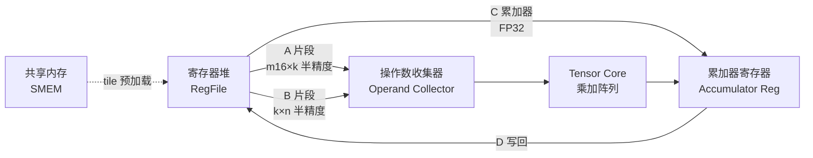

# 07 · Tensor Core

> **Tensor Core 是 GPU 上专用的矩阵乘加单元,一条 PTX 指令完成 D = A × B + C 的混合精度矩阵分块运算,峰值吞吐远超标量 ALU。**

## 1. 是什么 / 为什么有它

深度学习训练与推理的核心计算是大规模矩阵乘法(GEMM)。一个标准 Transformer 模型的前向传播中,超过 95% 的 FLOP 来自矩阵乘,而传统标量 FP32 ALU 每个周期只能做一次乘加,面对数十亿乃至数万亿次乘加操作,硬件效率极低。

Tensor Core(TC)是 NVIDIA 专为矩阵乘设计的硬件单元。其核心思想是:利用矩阵乘的规律性,把 m×k 矩阵与 k×n 矩阵的所有乘加电路一次性并行执行,而非逐元素串行调度。每条 TC 指令覆盖一个小型矩阵分块(如 m=16, k=16, n=8),所有乘加在同一周期内完成。

TC 的演进历程:
- **Volta V100(2017):** 首次引入 TC,支持 FP16 输入 + FP32 累加,m8n8k4 分块
- **Turing T4(2018):** 新增 INT8/INT4 支持,用于推理量化
- **Ampere A100(2020):** 扩展至 BF16、TF32,分块升至 m16n8k16;引入稀疏 TC
- **Hopper H100(2022):** 新增 FP8(E4M3、E5M2),分块升至 m16n8k32;同时引入 wgmma 异步接口

Hopper SM90 在每个 sub-partition 内放置 1 个 TC,全芯片共 132 SM × 4 sub-partition = 528 个 TC(80 GB SXM5 规格)。TC 支持 FP16、BF16、TF32、FP8、INT8、INT4 等多种输入精度,累加器统一使用 FP32 或 INT32,兼顾训练精度与推理速度。

## 2. 硬件视角(微架构细节)

每个 sub-partition 内部,TC 位于寄存器堆与其他功能单元的同一并行通路上。warp 内的 32 个线程各自持有 A、B、C fragment 的不同部分(物理分布由硬件固定,不可程序控制)。TC 从寄存器堆的操作数收集器取到完整的 A 与 B 分块后,展开全部乘加并写回累加器寄存器。



**Hopper TC 关键数字**(来源:Hopper Architecture Whitepaper §Tensor Core):

| 精度 | fragment 形状 | 峰值(SXM5) | 稀疏峰值 |
|---|---|---|---|
| FP16 / BF16 | m16n8k16 | 989 TFLOPS | 1979 TFLOPS |
| TF32 | m16n8k8 | 494.5 TFLOPS | 989 TFLOPS |
| FP8 (E4M3/E5M2) | m16n8k32 | 1979 TFLOPS | 3958 TFLOPS |
| INT8 | m16n8k32 | 1979 TOPS | 3958 TOPS |

TF32 是 Ampere 引入的格式:保留 FP32 的 8 位指数 + FP16 的 10 位尾数,仅需把 FP32 输入截断尾数即可使用,训练精度接近 FP32 且吞吐翻倍。FP8 进一步压缩尾数,推理场景精度足够。

TC 的调度规则:
- `mma.sync` 是 warp-collective,32 个线程必须全部参与
- 多条连续 `mma.sync` 以同一累加器组为目标时,可在 TC 管线内部流水线化
- 操作数寄存器读取与 mma 发射有 4–6 cycle 隐藏延迟

**Fragment 的线程分布规律(以 m16n8k16 FP16 为例):**
- A fragment(16×16 half):每个线程持有 8 个 half 元素,对应特定行-列区段
- B fragment(16×8 half):每个线程持有 4 个 half 元素
- C/D fragment(16×8 float):每个线程持有 4 个 float 元素

这种分布是硬件固定的,不可通过软件改变。WMMA API 的 `load_matrix_sync` 和 `store_matrix_sync` 会自动将 SMEM 的连续布局映射到每个线程对应的 fragment 槽位。如果需要了解每个 lane 对应哪个矩阵元素,可参考 PTX ISA §9.7.13 中的 fragment layout 表格。

**稀疏 TC(Sparse Tensor Core):**
Ampere 起支持 2:4 结构化稀疏,即每 4 个连续元素中至少有 2 个为零。Hopper 延续此特性,稀疏模式下 TC 吞吐翻倍。稀疏模式需额外的 metadata 向量存储非零元素位置,使用 `cuSPARSELt` 库或 CUTLASS sparse 模板实现。

## 3. CUDA 编程接口

**C++ 高层 WMMA API**(`#include <mma.h>`)

```cpp
#include <mma.h>
#include <cuda_fp16.h>
using namespace nvcuda::wmma;

// 声明 fragment:matrix_a, matrix_b, accumulator
fragment<matrix_a,   16, 8, 16, half, row_major>  fa;
fragment<matrix_b,   16, 8, 16, half, col_major>  fb;
fragment<accumulator,16, 8, 16, float>             fc;

fill_fragment(fc, 0.0f);               // 清零累加器
load_matrix_sync(fa, smemA, lda);      // 从 SMEM 加载 A 片段
load_matrix_sync(fb, smemB, ldb);      // 从 SMEM 加载 B 片段
mma_sync(fc, fa, fb, fc);             // D = A*B + C,warp-collective
store_matrix_sync(smemC, fc, ldc, mem_row_major);
```

**PTX 低层 mma.sync 指令:**

```ptx
// FP16 输入, FP32 累加, m16n8k16
// 编译器把 fragment 拆成多个 .b16/.f32 寄存器
mma.sync.aligned.m16n8k16.row.col.f32.f16.f16.f32
    {%f0, %f1, %f2, %f3},     // D: 4 个 FP32 累加器(输出)
    {%h0, %h1, %h2, %h3},     // A: 8 个 FP16(4 个 register,每个含 2 个 FP16)
    {%h4, %h5},               // B: 4 个 FP16(m16n8k16 的 B 片段)
    {%f0, %f1, %f2, %f3};     // C: 4 个 FP32 累加器(输入)

// FP8 输入, FP32 累加, m16n8k32(Hopper 新增)
mma.sync.aligned.m16n8k32.row.col.f32.e4m3.e4m3.f32
    {%f0, %f1, %f2, %f3},
    {%h0, %h1, %h2, %h3},
    {%h4, %h5, %h6, %h7},
    {%f0, %f1, %f2, %f3};
```

`mma.sync.aligned` 中的 `.aligned` 要求 fragment 的 SMEM 源地址按 128 字节对齐。`.row.col` 分别指定 A 矩阵行主序、B 矩阵列主序——这是 NVIDIA 推荐的默认布局,可直接对接 cuBLAS/CUTLASS 的标准约定。

**FP8 缩放因子:** Hopper FP8 mma.sync 支持 per-block 缩放(`scale-d`、`scale-a`、`scale-b` 参数),用于抵消 FP8 动态范围不足:

```ptx
mma.sync.aligned.m16n8k32.row.col.f32.e4m3.e4m3.f32
    {%f0,...}, {%h0,...}, {%h4,...}, {%f0,...}, %scale_d, %scale_a, %scale_b;
```

头文件依赖:
- `<mma.h>` — WMMA C++ 高层 API
- `<cuda_fp8.h>` — FP8 类型 `__nv_fp8_e4m3`、`__nv_fp8_e5m2`

## 4. 关键性能指标

**TC 利用率公式:**

```
TC 利用率(%) = [Σ inst × ops_per_inst] / [elapsed_cycles × peak_ops_per_cycle × SM_count]
```

其中:
- `m16n8k16` 每条 mma.sync = 16 × 8 × 16 × 2 = 4096 FMA
- `m16n8k32` FP8 每条 = 16 × 8 × 32 × 2 = 8192 FMA
- Hopper 单 SM 理论峰值 = 4 sub-partition × peak_FMA_per_sub / cycle

**影响利用率的关键因素:**

1. **矩阵尺寸对齐:** M、K、N 必须分别是 m、k、n fragment 的整数倍。例如 m16n8k16 要求 M%16==0, K%16==0, N%8==0。未对齐时需在外围补零 pad,pad 区域的计算不贡献有效工作。
2. **SMEM 就位时机:** A/B fragment 必须在 SMEM 中就绪后才能 `load_matrix_sync`。若 SMEM 填充(来自 GMEM 的 cp.async 或 TMA)延迟未被隐藏,TC 会因操作数未就位而等待。
3. **累加器连续复用:** 在 K 循环内连续复用同一 `fc` 累加器组,TC 可流水线执行——前一条 mma 写入累加器后即可开始下一条 mma 的 A/B 取数,实现约 30% 的发射率提升。

**FP8 训练注意:** FP8 输入的动态范围仅 3–4 个数量级,需要配合 per-tensor 或 per-channel 量化缩放。CUDA 12.1+ 通过 `cudnn` 或 `transformer_engine` 提供自动缩放机制。

**占用率与 TC 利用率的权衡:**
提高 occupancy(每 SM 活跃 warp 数)通常有助于隐藏内存延迟,但 TC 密集型 kernel 的瓶颈往往在 TC 管线而非内存带宽。此时过高的 occupancy 会因寄存器竞争迫使编译器溢出寄存器到 local memory,反而降低 TC 填充速度。建议通过 `--maxrregcount=128` 或 `__launch_bounds__(256, 2)` 控制 warp 数,让每个 warp 有足够寄存器持有多个 A/B/C fragment。

## 5. 代码示例

下面是一个完整的 SMEM tiling WMMA GEMM 内核(简化版,演示核心流程):

```cpp
#include <mma.h>
#include <cuda_fp16.h>
using namespace nvcuda::wmma;

constexpr int TILE_M = 16, TILE_N = 8, TILE_K = 16;

__global__ void gemm_wmma_kernel(
    const half* __restrict__ A,   // [M, K] row-major
    const half* __restrict__ B,   // [K, N] col-major
    float*      __restrict__ C,   // [M, N] row-major
    int M, int N, int K)
{
    // 每个 warp 负责一个 16×8 output tile
    int warpRow = (blockIdx.y * blockDim.y + threadIdx.y);
    int warpCol = (blockIdx.x * blockDim.x + threadIdx.x) / warpSize;

    fragment<matrix_a,   TILE_M, TILE_N, TILE_K, half, row_major> fa;
    fragment<matrix_b,   TILE_M, TILE_N, TILE_K, half, col_major> fb;
    fragment<accumulator,TILE_M, TILE_N, TILE_K, float>            fc;
    fill_fragment(fc, 0.0f);

    // K 方向分块累积
    for (int k = 0; k < K; k += TILE_K) {
        if (warpRow * TILE_M < M && warpCol * TILE_N < N) {
            // 实际生产代码应先搬到 SMEM,这里直接从 GMEM 示意
            load_matrix_sync(fa, A + warpRow * TILE_M * K + k, K);
            load_matrix_sync(fb, B + k * N + warpCol * TILE_N, N);
            mma_sync(fc, fa, fb, fc);   // D = A*B + C (warp-collective)
        }
    }
    // 写回结果
    if (warpRow * TILE_M < M && warpCol * TILE_N < N)
        store_matrix_sync(C + warpRow * TILE_M * N + warpCol * TILE_N,
                          fc, N, mem_row_major);
}
```

上述代码的关键点解析:
- `mma_sync` 必须由整个 warp 的 32 个线程执行,不得在 divergent branch 内部调用
- K 循环步长等于 fragment 的 k 维(TILE_K=16 对应 FP16)
- 生产代码应把 A/B tile 预先搬到 SMEM(用 `cp.async.bulk` 或 TMA),再 `load_matrix_sync`,消除 GMEM 读延迟对 TC 的阻塞

## 6. 实测手段

**NSight Compute 采集 TC 活跃度:**

```bash
# 查看 TC 利用率与指令数
ncu --metrics \
  sm__inst_executed_pipe_tensor_op_hmma.sum,\
  sm__pipe_tensor_op_hmma_cycles_active.avg.pct_of_peak_sustained_active,\
  sm__inst_executed_pipe_tensor_op_hmma_qmma.sum,\
  sm__inst_executed_pipe_tensor_op_imma.sum \
  ./gemm_app
```

| NSight Compute Metric | 含义 | 目标值 |
|---|---|---|
| `sm__inst_executed_pipe_tensor_op_hmma.sum` | FP16/BF16 TC 指令总数 | — |
| `sm__pipe_tensor_op_hmma_cycles_active.avg.pct_of_peak_sustained_active` | TC 管线活跃比率 | > 80% |
| `sm__inst_executed_pipe_tensor_op_imma.sum` | INT8 TC 指令总数 | — |
| `sm__inst_executed_pipe_tensor_op_hmma_qmma.sum` | wgmma + mma 合计 | — |

当 TC 利用率低于 60%,应检查:
1. 是否存在 SMEM load 延迟未被隐藏(`l1tex__t_sector_hit_rate.pct`)
2. 矩阵 M/N/K 是否均对齐到 fragment 尺寸
3. 是否因 register pressure 降低 occupancy 导致 TC 管线空转

## 7. 常见反模式

**1. padding 区域未清零产生 NaN 或无穷大**
将矩阵 pad 到 fragment 对齐边界时,若 padding 元素为未初始化内存或 NaN,TC 会把这些值参与乘加,结果 NaN 传播到整个累加器寄存器。正确做法:用 `cudaMemset` 或 `fill_fragment(fa, half(0.0f))` 在 pad 区写零。

**2. 累加器 fragment dtype 选 FP16 而非 FP32**
累加器类型应选 `float`(FP32)。若错选 `half`,在长 K 方向(如 K=4096)的累加过程中,FP16 的精度(约 3 位十进制有效位)不足以保留小的增量,导致 Loss 发散或收敛变慢。

**3. 在 divergent branch 内调用 mma_sync**
`mma_sync` 是 warp-collective 操作,要求 warp 内所有 32 个线程同时到达该调用点。若 fragment 加载或 `mma_sync` 被放在 divergent if-else 分支内,只有部分线程到达,warp 行为未定义,产生脏数据或死锁。

**4. A/B fragment 布局参数与内存实际布局不符**
WMMA API 中 `row_major`/`col_major` 模板参数必须与 SMEM 内存布局严格一致。若 B 矩阵在内存中是行主序但 API 声明 `col_major`,TC 会读错元素——计算结果数值错误,且不产生运行时报错,极难调试。

**5. 混用 mma.sync 与 wgmma.mma_async 时忘记 fence**
同一 kernel 先用 `mma.sync` 再切换到 `wgmma.mma_async` 时,必须在两者之间插入 `wgmma.fence.sync.aligned` PTX 指令,使 TC 管线完成所有挂起操作后再切换接口,否则 wgmma 管线可能在旧的寄存器状态未写入前就开始读取,产生静默数据错误。

## 8. 延伸阅读

- CUDA C++ Programming Guide §C.1 — Warp Matrix Functions(WMMA fragment 布局、API 语义)
- PTX ISA §9.7.13 — `mma`(mma.sync 全部变体语法、fragment shape 对照表)
- Hopper Architecture Whitepaper §Tensor Core(FP8 TC 峰值、稀疏 TC)
- CUTLASS 3.x `include/cutlass/gemm/warp/mma_tensor_op.h`
  — https://github.com/NVIDIA/cutlass(WMMA fragment 物理 lane 分布参考实现)
- developer.nvidia.com/blog/programming-tensor-cores-cuda-9(WMMA 入门,含 fragment 分布图)
