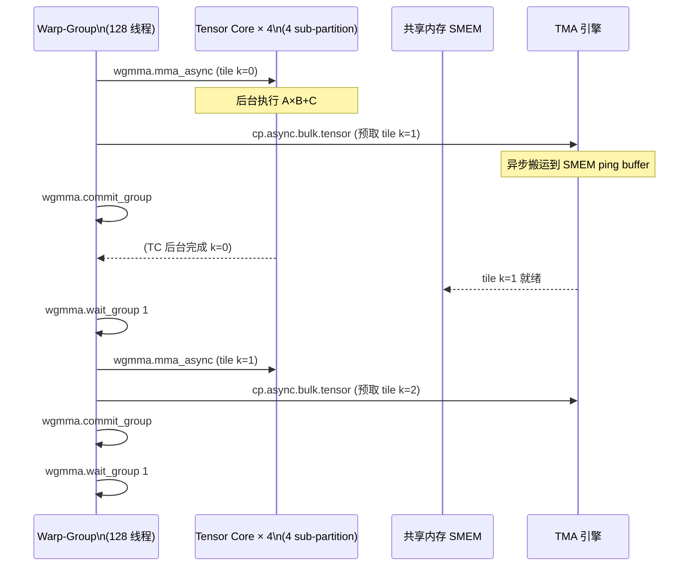

# 08 · wgmma 异步矩阵乘

> **wgmma(warp-group MMA)是 Hopper SM90 引入的 128 线程级异步矩阵乘指令,允许 TC 与 SMEM IO 完全重叠,大幅提升大矩阵 GEMM 的实际吞吐。**

## 1. 是什么 / 为什么有它

上一章介绍的 `mma.sync` 是同步指令:warp 发射后必须等待 TC 完成才能继续执行。对于大 GEMM,每次 mma 的操作数都从 SMEM 取,SMEM 本身也需要从 GMEM 不断补充——同步模型使 TC 与 SMEM/GMEM 流量串行,TC 大量时间处于等待状态。

Hopper 引入 **wgmma(warp-group matrix multiply-accumulate)**,以 **warp-group(128 线程 = 4 个相邻 warp)**为发射单位,并采用**异步**语义:

- `wgmma.mma_async` 提交后立即返回——TC 在后台异步执行
- warp-group 可以继续执行 TMA/cp.async 把下一组 tile 从 GMEM 搬到 SMEM
- 通过 `wgmma.commit_group` 标记一批异步操作
- 通过 `wgmma.wait_group N` 等待直到未完成组数 ≤ N

这个设计的本质是**双缓冲(double buffering)**在硬件指令级的原生支持:计算(TC)与数据搬运(TMA/cp.async)在时间上重叠,将 GEMM 性能推向接近 TC 的理论峰值。

**与 mma.sync 的对比:**
- `mma.sync` 是 warp 级(32 线程)同步指令,发射后阻塞 warp 直到 TC 完成
- `wgmma.mma_async` 是 warp-group 级(128 线程)异步指令,发射后立即返回继续执行
- wgmma 的 B 矩阵操作数来自 SMEM 描述符(descriptor),而非寄存器,节省大量寄存器
- wgmma 以 warp-group 为整体单元发射,4 个 sub-partition 同时并行
- 实测大 GEMM 利用率:mma.sync ≈ 50–60%,wgmma ≈ 80–90%

**warp-group 的定义:** 4 个连续 warp 组成 1 个 warp-group。在 CUDA C++ 中对应 `cooperative_groups::this_cluster()` 等机制,或手动按 `threadIdx.x / 128` 分组。warp-group 内部 128 个线程必须对 `wgmma.mma_async` 一致性到达——不允许 divergent branch 把 128 线程拆开执行 wgmma。Hopper 每个 SM 最多支持 8 个 warp-group 并发(64 warp / 4 = 16,但 TC 资源和寄存器通常将并发数限制在 2–4 个)。

## 2. 硬件视角(微架构细节)

在 Hopper SM 内部,1 个 warp-group 跨越同一 SM 的全部 4 个 sub-partition,每个 sub-partition 的 TC 各自处理 wgmma 矩阵分块的 1/4。wgmma 的 A 矩阵操作数从寄存器堆读取(每个线程持有其行片段),B 矩阵则通过 64-bit SMEM matrix descriptor 描述位置,由 TC 硬件直接从 SMEM 读取,不经过寄存器堆。这使 B 矩阵的寄存器压力为零,为 A 矩阵片段和累加器留出更多寄存器。



上图展示了典型的 ping-pong 双缓冲流水线:wgmma 异步计算 tile k 的同时,TMA 在后台预取 tile k+1,等待组数 ≤ 1 确保有一组完成后再继续。

**wgmma fragment 形状(m64nNNk16):**
Hopper 推荐的 wgmma 分块:
- M 维固定 = 64(对应 4 warp × 16 行)
- N 维:8/16/32/64/128/256(选择越大 TC 效率越高,寄存器需求也越多)
- K 维:FP16/BF16 = 16,FP8 = 32

m64n128k16 是当前 CUTLASS 3.x GEMM 的默认分块,N=128 可充分利用 128-bit SMEM 访问宽度。

## 3. CUDA 编程接口

wgmma 没有 C++ WMMA 高层封装,需直接使用 PTX 或通过 CUTLASS/CUDA 12.0+ `__mma_async` intrinsic。

**PTX 指令组:**

```ptx
// 1. fence: 进入 wgmma 模式前必须隔离旧的 mma.sync
wgmma.fence.sync.aligned;

// 2. mma_async: 异步发射矩阵乘
// desc_a: 64-bit SMEM descriptor for A matrix
// desc_b: 64-bit SMEM descriptor for B matrix
// scale_d=1 表示 D = A*B + 1*C (保留 C)
wgmma.mma_async.sync.aligned.m64n128k16.f32.f16.f16
    {%f0, %f1, ..., %f63},   // D/C: 64 个 FP32 累加器(m64n128 共 8192 element,每线程 64 个)
    desc_a,                   // A: SMEM descriptor(64-bit,含 base addr + shape)
    desc_b,                   // B: SMEM descriptor
    1,                        // scale-d: 1=累加, 0=覆盖
    1, 1, 0, 0;               // trans-a, trans-b, scale-a-idx, scale-b-idx

// 3. commit_group: 标记当前批次异步 mma 完成为一个 group
wgmma.commit_group.sync.aligned;

// 4. wait_group: 等待直到未完成 group 数 ≤ N
// N=0: 等待所有完成; N=1: 允许 1 组仍在飞行
wgmma.wait_group.sync.aligned 1;
```

**wgmma 的 accumulator 组织方式:**
m64n128k16 的 D/C 累加器共 64 × 128 = 8192 个 FP32 元素,由 128 个线程均分,每个线程持有 64 个 FP32。这 64 个 FP32 分布在特定的行列区段(由 PTX ISA 表格定义)。写回 GMEM 时每个线程把自己的 64 个 FP32 散写到对应位置,通常通过 `stmatrix.sync` 或 `cp.reduce` 指令批量完成。

**SMEM Descriptor 构造:**
64-bit descriptor 编码 SMEM 基地址、swizzle 模式、矩阵尺寸等信息。CUTLASS 提供 `cute::make_smem_ptr` 和 `cute::Swizzle` 构造器。手工构造需按 PTX ISA §9.7.14 的 bit 字段定义拼接:

```ptx
// descriptor 结构(伪代码,实际由汇编宏完成)
// bits[13:0] = smem_bank_base >> 4
// bits[49:32] = stride in units of 64B
// bits[63:62] = swizzle mode (0=none,1=32B,2=64B,3=128B)
```

**CUDA 12 C++ intrinsic(实验性):**

```cpp
#include <cuda/mma_sm90.h>   // CUDA 12.0+ Hopper 专属头
// 内部调用 PTX wgmma,屏蔽手动 descriptor 构造
// 生产代码建议用 CUTLASS 3.x 的 MMA atom
```

## 4. 关键性能指标

**峰值吞吐:** wgmma 与 mma.sync 共享同一 TC 硬件,因此理论峰值相同(FP16 989 TFLOPS / FP8 1979 TFLOPS)。wgmma 的优势在于通过异步重叠将**实际利用率**从 mma.sync 的 50–60% 提升到 80–90%。

**延迟:**
- `wgmma.mma_async` 发射延迟约 1–2 cycle(不阻塞 warp-group)
- TC 完成延迟约 16–32 cycle(取决于 N 维大小)
- `wgmma.commit_group` 约 1 cycle
- `wgmma.wait_group 0` 在 TC 完成前会阻塞 warp-group

**双缓冲设计原则:**
设 $L_{TC}$ 为 TC 完成延迟,$L_{TMA}$ 为 TMA 搬运延迟。当 $L_{TMA} < L_{TC}$ 时,`wgmma.wait_group 1` 可完全隐藏 TMA 延迟;反之需使用更深的多级缓冲(等待 group ≤ 2 或 ≤ 3),代价是 SMEM 中需要存放更多 ping-pong buffer 副本。

实际工程中,Hopper SMEM 最大 228 KiB。以 m64n128k16 BF16 tile 为例,A tile 占 64×16×2=2 KiB,B tile 占 16×128×2=4 KiB,C 累加器在寄存器中不占 SMEM。双缓冲需 2×(2+4)=12 KiB SMEM——Hopper 完全能容纳更深的三级缓冲(18 KiB),进一步隐藏跨 L2 的内存延迟。

**寄存器消耗:**
m64n128k16 的 D/C 累加器需要 64 个 FP32 寄存器/线程(128 线程共 8192 个 FP32 = 32 KB)。这是 Hopper 每个 warp-group 寄存器上限的约一半。选择较小的 N(如 n=64)可减半寄存器占用,适合 occupancy 受限的场景。

## 5. 代码示例

下面是 wgmma 双缓冲主循环的 PTX 框架(对应 m64n128k16,FP16 输入):

```ptx
// 假设 SMEM 中已有 A/B tile 双缓冲 (buf 0 和 buf 1)
// Step 0: 进入 wgmma 模式
wgmma.fence.sync.aligned;

// 迭代 k=0,从 buf0 计算
wgmma.mma_async.sync.aligned.m64n128k16.f32.f16.f16
    {%f0,...,%f63}, desc_a_buf0, desc_b_buf0, 1, 1, 1, 0, 0;
wgmma.commit_group.sync.aligned;     // group 1 提交

// 同时用 TMA 预取 k=1 到 buf1
cp.async.bulk.tensor.2d.global.shared::cluster.tile.mbarrier::complete_tx::bytes
    [smem_a_buf1], [tensor_map_a, {k1_coord}], [mbar1];
mbarrier.expect_tx.shared.b64 [mbar1], %tx_bytes;

// 等待 group 数 ≤ 1 (group 1 飞行中)
wgmma.wait_group.sync.aligned 1;

// 等待 buf1 TMA 完成
mbarrier.try_wait.shared.b64 %ready, [mbar1], %phase, %timeout;
// (实际代码需循环 try_wait 直到 %ready = 1)

// 迭代 k=1,从 buf1 计算
wgmma.mma_async.sync.aligned.m64n128k16.f32.f16.f16
    {%f0,...,%f63}, desc_a_buf1, desc_b_buf1, 1, 1, 1, 0, 0;
wgmma.commit_group.sync.aligned;     // group 2 提交

// 等待所有 group 完成
wgmma.wait_group.sync.aligned 0;
// 此时 {%f0,...,%f63} 是最终累加结果,写回 GMEM
```

上述框架的关键细节:
1. `wgmma.fence` 在切换 mma 模式时必须执行一次(不需每次循环都插入)
2. `scale-d=1` 参数告诉 TC 将新的 A×B 结果加到现有累加器 `{%f0,...}` 上
3. `wgmma.wait_group 1` 允许一组保持飞行状态,而 `wait_group 0` 则等待全部完成

## 6. 实测手段

**NSight Compute 关键指标:**

```bash
# 采集 wgmma 执行情况
ncu --metrics \
  sm__inst_executed_pipe_tensor_op_hmma_qmma.sum,\
  sm__warps_eligible.avg.pct_of_peak_sustained_active,\
  sm__pipe_tensor_op_hmma_cycles_active.avg.pct_of_peak_sustained_active,\
  smsp__warp_cycles_per_issue_active.avg \
  ./gemm_wgmma_app
```

| Metric | 含义 | 目标 |
|---|---|---|
| `sm__inst_executed_pipe_tensor_op_hmma_qmma.sum` | wgmma 指令总数(含 mma.sync) | — |
| `sm__pipe_tensor_op_hmma_cycles_active.avg.pct_of_peak_sustained_active` | TC 管线活跃率 | > 85% |
| `sm__warps_eligible.avg.pct_of_peak_sustained_active` | warp 可发射占比(低则等待延迟) | > 70% |
| `smsp__warp_cycles_per_issue_active.avg` | warp 平均发射间隔(越小越好) | < 4 |

如果 TC 管线活跃率高但整体 GEMM 吞吐未达预期,通常说明数据搬运(TMA/GMEM)没有与 TC 完全重叠,应检查双缓冲 SMEM 是否足够大。

**wgmma 与 mma.sync 的 profiling 区分:** NSight Compute 对两者的指令计数分别记录在 `hmma`(mma.sync)和 `hmma_qmma`(含 wgmma)两个子 metric 下。若 wgmma 迁移后发现 `hmma_qmma` 计数与 `hmma` 原先相比减少,说明内核调用的指令数量合理;而 TC 活跃率上升则验证了异步重叠效果。

**验证双缓冲有效性:** 可在 NSight Systems 的 CUDA kernel 时间线上观察 TMA 搬运(显示为 SMEM 写入事件)与 TC 执行的时间是否重叠。若两者完全串行,说明 `wgmma.wait_group` 设置过严(等待 0 组而非 1 组),应放宽为 `wait_group 1`。

## 7. 常见反模式

**1. 忘记 wgmma.fence 导致 mma.sync 与 wgmma 状态混用**
在同一 kernel 中从 `mma.sync` 切换到 `wgmma.mma_async` 时,若省略 `wgmma.fence.sync.aligned`,TC 管线内部状态未隔离,已有的 mma 结果可能被 wgmma 的累加器覆盖,产生静默数值错误。

**2. 误用 mma.sync 替代 wgmma**
在 warp-group kernel 中仍然使用 `mma.sync`(warp 级同步),每个 warp 各自发射 mma,4 个 warp 串行占用 TC,吞吐降至 wgmma 的约 1/4。正确做法是全部 128 线程协作一次 `wgmma.mma_async`。

**3. commit_group 与 wait_group 不对称**
每次 `commit_group` 标记一个新的 group 进入队列。若 `commit_group` 调用次数比 `wait_group` 等待的次数多,未完成 group 数持续累积,最终占满硬件 group 跟踪器(上限约 8 组),导致 wgmma 发射被阻塞。

**4. A/B SMEM descriptor 的 swizzle 模式与 SMEM 布局不匹配**
descriptor 中的 swizzle 参数必须与数据写入 SMEM 时的 swizzle 一致(通常为 128B swizzle 以消除 bank conflict)。若 descriptor 声明 64B swizzle 但数据按 128B 写入,TC 读到的元素错位,产生错误结果。

**5. wgmma.wait_group 放在不对的 warp 同步点**
`wgmma.wait_group` 是 warp-group 同步点,必须由全部 4 个 warp 同时到达。若 warp-group 内部有 divergent branch 导致部分 warp 未到达 `wait_group`,会产生死锁或未定义行为。

## 8. 延伸阅读

- PTX ISA §9.7.14 — `wgmma.mma_async`(完整指令格式、descriptor 编码、shape 对照表)
- Hopper Architecture Whitepaper — §Asynchronous MMA(wgmma 硬件设计动机)
- CUTLASS 3.x `include/cutlass/gemm/collective/sm90_mma_tma_gmma_ss.hpp`
  — https://github.com/NVIDIA/cutlass(生产级 wgmma + TMA 双缓冲实现)
- developer.nvidia.com/blog/nvidia-hopper-architecture-in-depth(wgmma pipeline 图解)
