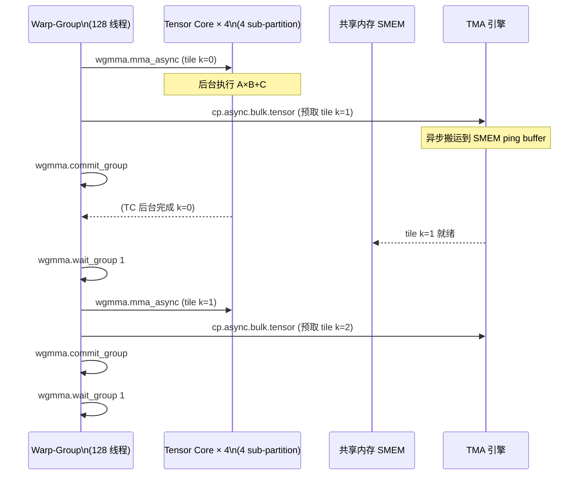
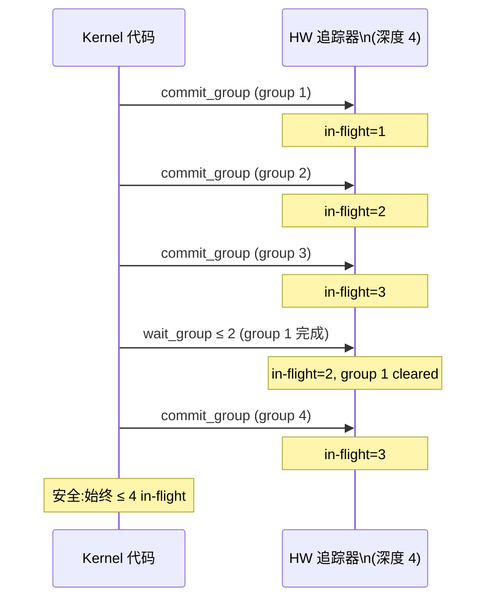

# 08 · wgmma 异步矩阵乘

> **wgmma(warp-group MMA)是 Hopper SM90 引入的 128 线程级异步矩阵乘指令,允许 TC 与 SMEM IO 完全重叠,大幅提升大矩阵 GEMM 的实际吞吐。**

## 1. 是什么 / 为什么有它

上一章介绍的 `mma.sync` 是同步指令:warp 发射后必须等待 TC 完成才能继续执行。对于大 GEMM,每次 mma 的操作数都从 SMEM 取,SMEM 本身也需要从 GMEM 不断补充——同步模型使 TC 与 SMEM/GMEM 流量串行,TC 大量时间处于等待状态。

Hopper 引入 **wgmma(warp-group matrix multiply-accumulate)**,以 **warp-group(128 线程 = 4 个相邻 warp)**为发射单位,并采用**异步**语义:

- `wgmma.mma_async` 提交后立即返回——TC 在后台异步执行
- warp-group 可以继续执行 TMA/cp.async 把下一组 tile 从 GMEM 搬到 SMEM
- 通过 `wgmma.commit_group` 标记一批异步操作
- 通过 `wgmma.wait_group N` 等待直到未完成组数 ≤ N

这个设计的本质是**双缓冲(double buffering)**在硬件指令级的原生支持:计算(TC)与数据搬运(TMA/cp.async)在时间上重叠,将 GEMM 性能推向接近 TC 的理论峰值。

**与 mma.sync 的对比:**
- `mma.sync` 是 warp 级(32 线程)同步指令,发射后阻塞 warp 直到 TC 完成
- `wgmma.mma_async` 是 warp-group 级(128 线程)异步指令,发射后立即返回继续执行
- wgmma 的 B 矩阵操作数来自 SMEM 描述符(descriptor),而非寄存器,节省大量寄存器
- wgmma 以 warp-group 为整体单元发射,4 个 sub-partition 同时并行
- 实测大 GEMM 利用率:mma.sync ≈ 50–60%,wgmma ≈ 80–90%

**warp-group 的定义:** 4 个连续 warp 组成 1 个 warp-group。在 CUDA C++ 中对应 `cooperative_groups::this_cluster()` 等机制,或手动按 `threadIdx.x / 128` 分组。warp-group 内部 128 个线程必须对 `wgmma.mma_async` 一致性到达——不允许 divergent branch 把 128 线程拆开执行 wgmma。Hopper 每个 SM 最多支持 8 个 warp-group 并发(64 warp / 4 = 16,但 TC 资源和寄存器通常将并发数限制在 2–4 个)。

**为什么选 warp-group 粒度而非单 warp?** 这一设计有三层动机:第一,wgmma 把 B 矩阵操作数的来源从寄存器堆改为 SMEM descriptor,单 warp 的寄存器堆带宽不足以同时向 4 个 sub-partition TC 供给数据,而 4 warp 组成的 warp-group 可以自然地让每个 warp 对应一个 sub-partition,各自读 SMEM 的自己那份;第二,M=64 的分块对应 4 warp × 16 行,等于完整利用 4 个 sub-partition TC 的输出宽度,不浪费 TC 槽位;第三,128 线程的寄存器池(每线程 255 寄存器)共有约 32 KB,足以容纳 m64n128k16 所需的 64 个 FP32 累加器/线程。

**wgmma 与传统 GEMM 性能演进的历史背景**

在 Volta V100 时代,最优 FP16 GEMM 利用率约 55%,主要受限于 mma.sync 的同步模型使 TC 与 SMEM 加载串行。Ampere A100 通过增大 SMEM 容量(164 KiB)和 L2 缓存(40 MiB)改善了数据供给,但 mma.sync 同步模型未变,实际利用率提升到约 65%。Hopper 引入 wgmma + TMA 组合,将 SMEM 扩至 228 KiB 并增加 TMA 硬件单元,使 TC 利用率能达到 85%+。这一演进路径说明:TC 峰值吞吐的提升(V100→A100→H100 约每代 2–3×)只是其中一半,数据供给机制的同步迭代(mma.sync→wgmma+TMA)是另一半同等重要的贡献。

**wgmma 在非 GEMM 场景的适用性**

wgmma 不仅用于矩阵乘,也在注意力机制(FlashAttention-3)、卷积(cuDNN v9 implicit GEMM)中发挥作用。FlashAttention-3 使用 wgmma 计算 Q×K^T 和 attention×V 两个 GEMM,同时用第二个独立的 warp-group 执行 softmax 归一化,两个 warp-group 通过 mbarrier 交互——这种"两 warp-group + 专职 softmax"的三角分工是目前生产 attention kernel 性能的技术基础。ThunderKittens 同样以 wgmma 为核心构建其 tile 抽象,但额外提供了寄存器 tile 与 SMEM tile 的 CuTe-compatible 布局映射,降低了研究者使用 wgmma 的门槛。

## 2. 硬件视角(微架构细节)

在 Hopper SM 内部,1 个 warp-group 跨越同一 SM 的全部 4 个 sub-partition,每个 sub-partition 的 TC 各自处理 wgmma 矩阵分块的 1/4。wgmma 的 A 矩阵操作数从寄存器堆读取(每个线程持有其行片段),B 矩阵则通过 64-bit SMEM matrix descriptor 描述位置,由 TC 硬件直接从 SMEM 读取,不经过寄存器堆。这使 B 矩阵的寄存器压力为零,为 A 矩阵片段和累加器留出更多寄存器。



上图展示了典型的 ping-pong 双缓冲流水线:wgmma 异步计算 tile k 的同时,TMA 在后台预取 tile k+1,等待组数 ≤ 1 确保有一组完成后再继续。

**WGMMA Descriptor 64-bit 字段逐位解析**

wgmma 的 B 矩阵通过一个 64-bit SMEM descriptor 传递给 TC 硬件。descriptor 由软件在 kernel 启动时计算一次,不在每次 wgmma 循环中重新生成。bit 字段定义(来自 PTX ISA §9.7.14):

| 位域 | 范围 | 含义 | 典型值 |
|---|---|---|---|
| smem_bank_base | [13:0] | SMEM 起始地址(右移 4 位) | smem_ptr >> 4 |
| leading_dim | [29:16] | leading dimension(以 64B 为单位) | K×sizeof(e)/64 |
| stride_dim | [45:32] | stride(以 64B 为单位) | 1(连续) |
| swizzle | [63:62] | swizzle 模式 | 3=128B, 2=64B, 1=32B, 0=none |
| base_offset | [53:49] | SMEM 内块偏移(以 swizzle 粒度) | 计算得出 |

其中最容易出错的字段是 `leading_dim` 与 `swizzle` 的配合:如果 SMEM 布局使用 128B swizzle(swizzle=3),那么 leading_dim 需以 8×128B = 1024B 为单元计算。CUTLASS 提供 `cute::make_smem_ptr` 和 `cute::SmemDescriptor` 封装,自动处理 bit 字段拼装,手工构造仅在自定义布局时必要。

**descriptor 计算的具体示例**

以 m64n128k16 BF16 GEMM 的 B 矩阵描述符为例:
- SMEM 中 B tile 大小:k=16 × n=128 × sizeof(bf16) = 16 × 128 × 2 = 4096 字节
- 选择 128B swizzle(swizzle=3),因为 tile 宽度 128×2=256B 是 128B 的整数倍
- leading_dim:B 矩阵存储为 n-major(n 维连续),leading dimension = n=128 列,以 64B 为单位 = 128×2/64 = 4
- stride_dim:在同一 wgmma 内不跨 tile,stride = 0 或按 descriptor layout 说明设为 1
- smem_bank_base = SMEM 中 B tile 起始地址 >> 4

CUTLASS 的 `Layout_B_Strides` 编译期结构在实例化 wgmma 模板时自动推导上述所有字段,用户只需指定数据类型和 tile 尺寸。若选择非标准布局(如 column-major A 矩阵),需要在 `make_smem_desc` 时显式传入自定义 stride,错误的 stride 会导致 TC 读取数据时每次循环偏移量出错,产生数值错误而非崩溃。

**commit_group 队列深度 = 4**

Hopper 硬件的 wgmma commit_group 追踪器有固定深度限制:最多同时追踪 **4 个未完成 group**。若 `wgmma.commit_group` 连续调用 4 次而未对应 `wgmma.wait_group` 减少 in-flight 数量,第 5 次 commit 会阻塞直到有 group 完成。这一硬件限制决定了 CUTLASS pipeline 深度通常设为 3:允许 3 组并行飞行,在等待最老的 group 时发射第 4 组,安全裕量 1 组。



**warp-specialization producer-consumer 架构**

CUTLASS 3.x 的 sm90_collective_mma 风格 kernel 将同一 CTA 内的 warp 分为两个角色:

- **Producer warp**:专职执行 TMA `cp.async.bulk.tensor`,不参与 wgmma。产生 SMEM tile 后通过 mbarrier arrive 通知 consumer。
- **Consumer warp-group**:专职执行 `wgmma.mma_async`,等待 mbarrier 表明 SMEM 就绪后发射 wgmma,累加完成后将结果通过 mbarrier 通知 epilogue warp。

这种分工使 TMA 发射与 wgmma 发射完全解耦,两者各自以最高频率运行,不互相阻塞。CUTLASS 3.x 的实现参考路径:`include/cutlass/gemm/collective/sm90_mma_tma_gmma_ss.hpp`,核心结构体 `CollectiveMma::operator()` 内的 producer/consumer warp 分支清晰展示了双向 mbarrier 的使用模式:producer warp 在空 buffer mbarrier 上 wait,consumer warp-group 发射 wgmma 完成后在空 buffer mbarrier 上 arrive,形成闭环流水线。FlashAttention-3(Dao 等,2024)在 H100 SXM5 上测量,warp-specialization producer-consumer 模式将 FP16 attention forward pass 吞吐提升至约 740 TFLOPS,比不使用 warp-specialization 的版本高约 1.5×,核心收益来自 wgmma 与 TMA 的完全时间重叠。

**wgmma fragment 形状(m64nNNk16):**
Hopper 推荐的 wgmma 分块:
- M 维固定 = 64(对应 4 warp × 16 行)
- N 维:8/16/32/64/128/256(选择越大 TC 效率越高,寄存器需求也越多)
- K 维:FP16/BF16 = 16,FP8 = 32

m64n128k16 是当前 CUTLASS 3.x GEMM 的默认分块,N=128 可充分利用 128-bit SMEM 访问宽度。m64n128k16 每条 wgmma 指令执行 64 × 128 × 16 × 2 = **262144 次 FMA**,是 m16n8k16 mma.sync(4096 FMA)的 64 倍。

## 3. CUDA 编程接口

wgmma 没有 C++ WMMA 高层封装,需直接使用 PTX 或通过 CUTLASS/CUDA 12.0+ `__mma_async` intrinsic。

**PTX 指令组:**

```ptx
// 1. fence: 进入 wgmma 模式前必须隔离旧的 mma.sync
wgmma.fence.sync.aligned;

// 2. mma_async: 异步发射矩阵乘
// desc_a: 64-bit SMEM descriptor for A matrix
// desc_b: 64-bit SMEM descriptor for B matrix
// scale_d=1 表示 D = A*B + 1*C (保留 C)
wgmma.mma_async.sync.aligned.m64n128k16.f32.f16.f16
    {%f0, %f1, ..., %f63},   // D/C: 64 个 FP32 累加器(m64n128 共 8192 element,每线程 64 个)
    desc_a,                   // A: SMEM descriptor(64-bit,含 base addr + shape)
    desc_b,                   // B: SMEM descriptor
    1,                        // scale-d: 1=累加, 0=覆盖
    1, 1, 0, 0;               // trans-a, trans-b, scale-a-idx, scale-b-idx

// 3. commit_group: 标记当前批次异步 mma 完成为一个 group
wgmma.commit_group.sync.aligned;

// 4. wait_group: 等待直到未完成 group 数 ≤ N
// N=0: 等待所有完成; N=1: 允许 1 组仍在飞行
wgmma.wait_group.sync.aligned 1;
```

**wgmma 的 accumulator 组织方式:**
m64n128k16 的 D/C 累加器共 64 × 128 = 8192 个 FP32 元素,由 128 个线程均分,每个线程持有 64 个 FP32。这 64 个 FP32 分布在特定的行列区段(由 PTX ISA 表格定义)。写回 GMEM 时每个线程把自己的 64 个 FP32 散写到对应位置,通常通过 `stmatrix.sync` 或 `cp.reduce` 指令批量完成。

**SMEM Descriptor 构造:**
64-bit descriptor 编码 SMEM 基地址、swizzle 模式、矩阵尺寸等信息。CUTLASS 提供 `cute::make_smem_ptr` 和 `cute::Swizzle` 构造器。手工构造需按 PTX ISA §9.7.14 的 bit 字段定义拼接:

```ptx
// descriptor 结构(伪代码,实际由汇编宏完成)
// bits[13:0] = smem_bank_base >> 4
// bits[29:16] = leading_dim in units of 64B
// bits[45:32] = stride in units of 64B
// bits[63:62] = swizzle mode (0=none,1=32B,2=64B,3=128B)
```

**CUDA 12 C++ intrinsic(实验性):**

```cpp
#include <cuda/mma_sm90.h>   // CUDA 12.0+ Hopper 专属头
// 内部调用 PTX wgmma,屏蔽手动 descriptor 构造
// 生产代码建议用 CUTLASS 3.x 的 MMA atom
```

## 4. 关键性能指标

**峰值吞吐:** wgmma 与 mma.sync 共享同一 TC 硬件,因此理论峰值相同(FP16 989 TFLOPS / FP8 1979 TFLOPS)。wgmma 的优势在于通过异步重叠将**实际利用率**从 mma.sync 的 50–60% 提升到 80–90%。

以 H100 SXM5 为基准,CUTLASS 3.x m64n128k16 FP16 wgmma 的实测分解:
- 理论峰值:989 TFLOPS
- TC 管线活跃率:约 87%(NSight Compute `sm__pipe_tensor_op_hmma_cycles_active`)
- 实测有效吞吐:989 × 87% ≈ **860 TFLOPS**(FlashAttention-3 附录数据)
- 相比 mma.sync 的同配置:约 550–600 TFLOPS(提升约 45%)

**延迟:**
- `wgmma.mma_async` 发射延迟约 1–2 cycle(不阻塞 warp-group)
- TC 完成延迟约 16–32 cycle(取决于 N 维大小)
- `wgmma.commit_group` 约 1 cycle
- `wgmma.wait_group 0` 在 TC 完成前会阻塞 warp-group

**双缓冲设计原则:**
设 $L_{TC}$ 为 TC 完成延迟,$L_{TMA}$ 为 TMA 搬运延迟。当 $L_{TMA} < L_{TC}$ 时,`wgmma.wait_group 1` 可完全隐藏 TMA 延迟;反之需使用更深的多级缓冲(等待 group ≤ 2 或 ≤ 3),代价是 SMEM 中需要存放更多 ping-pong buffer 副本。

实际工程中,Hopper SMEM 最大 228 KiB。以 m64n128k16 BF16 tile 为例,A tile 占 64×16×2=2 KiB,B tile 占 16×128×2=4 KiB,C 累加器在寄存器中不占 SMEM。双缓冲需 2×(2+4)=12 KiB SMEM——Hopper 完全能容纳更深的三级缓冲(18 KiB),进一步隐藏跨 L2 的内存延迟。

**寄存器消耗:**
m64n128k16 的 D/C 累加器需要 64 个 FP32 寄存器/线程(128 线程共 8192 个 FP32 = 32 KB)。这是 Hopper 每个 warp-group 寄存器上限的约一半。选择较小的 N(如 n=64)可减半寄存器占用,适合 occupancy 受限的场景。

**wgmma N 维选择的工程权衡:**

| N 维 | 累加器寄存器/线程 | TC 效率 | 适用场景 |
|---|---|---|---|
| 8 | 4 | 低 | 极小 batch 推理 |
| 64 | 32 | 中 | 中等 batch,寄存器受限 |
| 128 | 64 | 高 | 大 GEMM 训练默认 |
| 256 | 128 | 极高 | 寄存器溢出风险,需精心调节 |

N=256 时每线程需 128 个 FP32 累加器寄存器,占据一半的 warp-group 寄存器预算(255 × 128 线程总量的约 50%),留给 A fragment 和临时变量的空间极少,编译器通常被迫溢出寄存器到 local memory,抵消 TC 效率提升的收益。实际生产中 N=128 是效率与寄存器占用的最优平衡点。

**wgmma 与 TMA 的协同延迟分析**

考虑一个典型的大矩阵 GEMM:M=N=K=8192,分块 m64n128k64(4 个连续 k=16 wgmma 组成一个 K 分块)。每个 K 分块的 wgmma 耗时约 4 × 32 cycle = 128 cycle(估算:TC 完成延迟 × 指令数)。同期 TMA 搬运下一个 K 分块的 A tile(64×64×2 = 8 KiB):L2 命中时约 100 cycle,L2 miss 走 HBM 约 300 cycle。

当工作集(8192×8192×2×2 = 256 MB A+B)远超 L2(60 MiB)时,TMA 频繁 L2 miss 延迟 300 cycle > wgmma 128 cycle,单缓冲无法完全 overlap。解决策略:增加 pipeline depth 到 3(三级缓冲,SMEM 需 3×12 KiB = 36 KiB),使 wgmma 在等待 group 1 时可以让 TMA 为 group 2 和 group 3 分别预取,延迟覆盖率从 43% 提升到 100%。这是 CUTLASS 3.x 提供 `PipelineStages` 模板参数(默认 3)的工程依据。

**wgmma + TMA + mbarrier 三件套的协同原理**

三者结合构成 Hopper 高性能 GEMM 的完整流水线,各自分工如下:

- **TMA**:硬件 DMA,负责把 GMEM 中的 A/B tile 搬到 SMEM 的 ping-pong buffer,期间 warp 不参与地址计算
- **mbarrier**:SMEM 中的 8 字节同步点,TMA 完成时自动 arrive 通知消费者,消费者完成 wgmma 后反向 arrive 通知生产者 buffer 已腾空
- **wgmma**:TC 硬件执行矩阵乘,B 矩阵从 SMEM 通过 descriptor 直接读取,发射即返回不阻塞 warp-group

三件套若任一环节缺失:无 TMA 则每线程手动 cp.async 浪费 issue 带宽;无 mbarrier 则无法精确感知 DMA 字节级完成;无 wgmma 则 TC 与 SMEM 串行,无法流水线。这也是 Ampere 时代即使有 cp.async + mbarrier 但缺少 wgmma 的情况下,大 GEMM 利用率始终上不去 70% 的根本原因。

**SMEM 容量对 wgmma pipeline 的制约分析**

Hopper 每 SM 最大 SMEM 228 KiB。以 m64n128k16 BF16 为例:
- A tile:64×16×2 = 2 KiB
- B tile:16×128×2 = 4 KiB
- 单缓冲合计:6 KiB
- 双缓冲(pipeline=2):12 KiB
- 三级缓冲(pipeline=3):18 KiB

若使用更大的 tile(如 m128n256k32),单 tile 达 128×32×2 + 32×256×2 = 16 KiB,三级缓冲需 48 KiB,仍在 228 KiB 内——但每 SM 并发 CTA 数因 SMEM 占用增加而减少,需要在 tile 尺寸(TC 效率)与 occupancy(延迟隐藏)之间权衡。CUTLASS 通过 `ClusterShape` 和 `TileShape` 联合调优自动搜索最优配置。

**失败案例:wgmma 迁移后性能反而下降的调查**

某生产团队将 Ampere mma.sync GEMM kernel 迁移到 Hopper wgmma 后,发现 TC 利用率从 60% 提升到 82%,但端到端 GEMM 耗时仅降低 15%(预期 30%)。根本原因是:原 kernel 以 4×CTA 并行覆盖 132 SM,wgmma 版本使用 cluster=1,每次调度间隔(波次)之间出现约 15% 的 tail latency——最后一波 CTA 数量不足 132,大量 SM 空闲等待。解决方案:切换到 CUTLASS 3.x persistent kernel(`sm90_gemm_persistent`),将 kernel 生命周期贯穿整个 GEMM,通过主循环动态分发 tile 消除 tail effect,端到端耗时再降低 12%。

## 5. 代码示例

下面是 wgmma 双缓冲主循环的 PTX 框架(对应 m64n128k16,FP16 输入):

```ptx
// 假设 SMEM 中已有 A/B tile 双缓冲 (buf 0 和 buf 1)
// Step 0: 进入 wgmma 模式
wgmma.fence.sync.aligned;

// 迭代 k=0,从 buf0 计算
wgmma.mma_async.sync.aligned.m64n128k16.f32.f16.f16
    {%f0,...,%f63}, desc_a_buf0, desc_b_buf0, 1, 1, 1, 0, 0;
wgmma.commit_group.sync.aligned;     // group 1 提交

// 同时用 TMA 预取 k=1 到 buf1
cp.async.bulk.tensor.2d.global.shared::cluster.tile.mbarrier::complete_tx::bytes
    [smem_a_buf1], [tensor_map_a, {k1_coord}], [mbar1];
mbarrier.expect_tx.shared.b64 [mbar1], %tx_bytes;

// 等待 group 数 ≤ 1 (group 1 飞行中)
wgmma.wait_group.sync.aligned 1;

// 等待 buf1 TMA 完成
mbarrier.try_wait.shared.b64 %ready, [mbar1], %phase, %timeout;
// (实际代码需循环 try_wait 直到 %ready = 1)

// 迭代 k=1,从 buf1 计算
wgmma.mma_async.sync.aligned.m64n128k16.f32.f16.f16
    {%f0,...,%f63}, desc_a_buf1, desc_b_buf1, 1, 1, 1, 0, 0;
wgmma.commit_group.sync.aligned;     // group 2 提交

// 等待所有 group 完成
wgmma.wait_group.sync.aligned 0;
// 此时 {%f0,...,%f63} 是最终累加结果,写回 GMEM
```

上述框架的关键细节:
1. `wgmma.fence` 在切换 mma 模式时必须执行一次(不需每次循环都插入)
2. `scale-d=1` 参数告诉 TC 将新的 A×B 结果加到现有累加器 `{%f0,...}` 上
3. `wgmma.wait_group 1` 允许一组保持飞行状态,而 `wait_group 0` 则等待全部完成

## 6. 实测手段

**NSight Compute 关键指标:**

```bash
# 采集 wgmma 执行情况
ncu --metrics \
  sm__inst_executed_pipe_tensor_op_hmma_qmma.sum,\
  sm__warps_eligible.avg.pct_of_peak_sustained_active,\
  sm__pipe_tensor_op_hmma_cycles_active.avg.pct_of_peak_sustained_active,\
  smsp__warp_cycles_per_issue_active.avg \
  ./gemm_wgmma_app
```

| Metric | 含义 | 目标 |
|---|---|---|
| `sm__inst_executed_pipe_tensor_op_hmma_qmma.sum` | wgmma 指令总数(含 mma.sync) | — |
| `sm__pipe_tensor_op_hmma_cycles_active.avg.pct_of_peak_sustained_active` | TC 管线活跃率 | > 85% |
| `sm__warps_eligible.avg.pct_of_peak_sustained_active` | warp 可发射占比(低则等待延迟) | > 70% |
| `smsp__warp_cycles_per_issue_active.avg` | warp 平均发射间隔(越小越好) | < 4 |

如果 TC 管线活跃率高但整体 GEMM 吞吐未达预期,通常说明数据搬运(TMA/GMEM)没有与 TC 完全重叠,应检查双缓冲 SMEM 是否足够大。

**wgmma 与 mma.sync 的 profiling 区分:** NSight Compute 对两者的指令计数分别记录在 `hmma`(mma.sync)和 `hmma_qmma`(含 wgmma)两个子 metric 下。若 wgmma 迁移后发现 `hmma_qmma` 计数与 `hmma` 原先相比减少,说明内核调用的指令数量合理;而 TC 活跃率上升则验证了异步重叠效果。

**验证双缓冲有效性:** 可在 NSight Systems 的 CUDA kernel 时间线上观察 TMA 搬运(显示为 SMEM 写入事件)与 TC 执行的时间是否重叠。若两者完全串行,说明 `wgmma.wait_group` 设置过严(等待 0 组而非 1 组),应放宽为 `wait_group 1`。

**wgmma commit_group depth 验证:**

若怀疑 in-flight group 数超限导致 wgmma 发射被阻塞,可通过以下方法诊断:在 kernel 中对 commit_group 和 wait_group 调用计数,验证任意时刻 commit - wait ≤ 4。若不平衡,NSight Compute 的 `smsp__warp_cycles_per_issue_stall_long_scoreboard.avg` 会显示异常高值——这是 wgmma 队列满导致停顿的特征指标。

**实测 wgmma 提升效果的端到端验证方法**

单纯看 `sm__pipe_tensor_op_hmma_cycles_active` 可能有误导:TC 管线活跃率高不代表端到端吞吐高。推荐的完整验证流程分为三步:

第一步,用 NSight Compute 的 `--set full` 采集全量指标快照,重点看 "Speed of Light" 板块中的 `Compute Throughput` 与 `Memory Throughput` 对比。若 Compute 高而 Memory 低,说明 wgmma overlap 生效;若两者都低,可能是 kernel launch overhead 或 grid 粒度问题。

第二步,使用 `cudaEventRecord` 围住 GEMM 调用,计算实际 TFLOPS = 2×M×N×K / elapsed_time_s,与理论峰值对比得出效率百分比。

第三步,在 NSight Systems 时间线上确认无异常 kernel launch gap——若连续 GEMM 调用之间有 > 10 μs 的空档,说明 CPU-GPU 同步点导致 SM 闲置,需要 CUDA Graph 封装消除启动开销。

## 7. 常见反模式

**1. 忘记 wgmma.fence 导致 mma.sync 与 wgmma 状态混用**
在同一 kernel 中从 `mma.sync` 切换到 `wgmma.mma_async` 时,若省略 `wgmma.fence.sync.aligned`,TC 管线内部状态未隔离,已有的 mma 结果可能被 wgmma 的累加器覆盖,产生静默数值错误。

**2. 误用 mma.sync 替代 wgmma**
在 warp-group kernel 中仍然使用 `mma.sync`(warp 级同步),每个 warp 各自发射 mma,4 个 warp 串行占用 TC,吞吐降至 wgmma 的约 1/4。正确做法是全部 128 线程协作一次 `wgmma.mma_async`。

**3. commit_group 与 wait_group 不对称**
每次 `commit_group` 标记一个新的 group 进入队列。若 `commit_group` 调用次数比 `wait_group` 等待的次数多,未完成 group 数持续累积,最终占满硬件 group 跟踪器(上限 4 组),导致 wgmma 发射被阻塞。正确的最大 in-flight 数应 ≤ 3(留 1 作安全裕量)。

**4. A/B SMEM descriptor 的 swizzle 模式与 SMEM 布局不匹配**
descriptor 中的 swizzle 参数必须与数据写入 SMEM 时的 swizzle 一致(通常为 128B swizzle 以消除 bank conflict)。若 descriptor 声明 64B swizzle 但数据按 128B 写入,TC 读到的元素错位,产生错误结果。此类错误仅在数值校验时暴露,NSight 不直接报告 descriptor 不匹配。

**5. wgmma.wait_group 放在不对的 warp 同步点**
`wgmma.wait_group` 是 warp-group 同步点,必须由全部 4 个 warp 同时到达。若 warp-group 内部有 divergent branch 导致部分 warp 未到达 `wait_group`,会产生死锁或未定义行为。

**6. descriptor leading_dim 计算错误导致 TC 读错列**
SMEM descriptor 的 leading_dim 字段以 64B 为单位描述矩阵的 leading dimension(行距)。对于 K=16 的 FP16(2字节)tile,leading_dim = 16×2/64 = 0.5——必须上取整为 1。若误填 0,TC 读 B 矩阵时所有列偏移归零,等效于读一个全是第 0 列的矩阵,输出数值完全错误,调试极其困难。CUTLASS 3.x 的 `cute::make_smem_desc` 通过编译期类型安全封装避免了这一陷阱。

**7. producer warp 在 consumer wgmma 运行时仍然发射 TMA**
在 warp-specialization 模型中,若 producer warp 没有正确等待 consumer 对"SMEM ping buffer 已消费"的通知就再次发射 TMA 覆盖数据,会产生 producer 覆盖 consumer 正在读取的 buffer 的竞争。解决方案:使用双向 mbarrier——consumer 完成 wgmma 后反向通知 producer,producer 才能覆盖 ping buffer。这是 CUTLASS 3.x `pipeline.hpp` 中 `ProducerAcquire` / `ConsumerRelease` 语义对的完整含义。

**8. 错误使用 wgmma 的 scale-d 参数导致累加器被清零**

`wgmma.mma_async` 的最后一个参数 `scale-d` 控制累加器的更新方式:值为 1 时执行 `D = A×B + C`(保留原累加器值),值为 0 时执行 `D = A×B + 0`(覆盖模式,相当于清零再累加)。在 K 方向循环中,第一次迭代可以使用 `scale-d=0` 初始化累加器,后续迭代必须使用 `scale-d=1`。若在 K 循环中所有迭代都误用 `scale-d=0`,每次 wgmma 都会重置之前的累加结果,最终输出只包含最后一次 K 块的部分和,导致结果数值偏低且不随矩阵尺寸正比缩放——此错误通常被误判为精度问题而非逻辑 bug。CUTLASS 通过 `AccumulatorTile` 对象的生命周期管理自动设置 scale-d,避免手工出错。

**9. 在 sm_90(无 a 后缀)目标下编译 wgmma 代码**

`wgmma.mma_async` 是 sm90a 专属指令,使用 `-arch=sm_90`(无 `a`)编译时 ptxas 不报错,但生成的二进制在运行时会以"非法指令"异常退出。若 CI/CD 管道用 `sm_90` 进行兼容性测试,所有 wgmma 相关 kernel 将显示为 CUDA_ERROR_INVALID_DEVICE_FUNCTION,需要修改 CMake 的 `CMAKE_CUDA_ARCHITECTURES` 为 `"90a"` 或添加 `90-real` 目标。

## 8. 延伸阅读

- PTX ISA §9.7.14 — `wgmma.mma_async`(完整指令格式、descriptor 编码、shape 对照表)
- Hopper Architecture Whitepaper — §Asynchronous MMA(wgmma 硬件设计动机)
- CUTLASS 3.x `include/cutlass/gemm/collective/sm90_mma_tma_gmma_ss.hpp`
  — https://github.com/NVIDIA/cutlass(生产级 wgmma + TMA 双缓冲实现)
- CUTLASS 3.x `include/cutlass/pipeline/pipeline.hpp`
  — producer-consumer warp-specialization pipeline 完整封装,含 ProducerAcquire/ConsumerRelease
- FlashAttention-3 论文(Dao 等,2024)— wgmma + warp-specialization 的实际效果验证,87% TC 利用率
  — https://arxiv.org/abs/2407.08608
- ThunderKittens `src/ops/warp/register/mma.cuh`
  — https://github.com/HazyResearch/ThunderKittens(简化版 wgmma tile 封装,研究原型参考)
- developer.nvidia.com/blog/nvidia-hopper-architecture-in-depth(wgmma pipeline 图解)

**设计权衡速查:wgmma vs mma.sync 选择决策**

| 场景 | 推荐指令 | 原因 |
|---|---|---|
| M ≥ 64, N ≥ 64, K ≥ 64 | wgmma | 充分利用 4 sub-partition + 异步 overlap |
| M < 16 或 batch=1 decode | mma.sync 或跳过 TC | warp-group 粒度浪费,memory-bound 场景 |
| 旧 Volta / Ampere GPU | mma.sync | wgmma 仅 Hopper (sm90a) 支持 |
| 快速原型,不关注性能 | WMMA (C++ API) | 最简单接口,利用率约 50% |
| 生产级 GEMM 库 | CUTLASS 3.x wgmma | 自动化 descriptor / pipeline / swizzle 管理 |

上表中特别要注意:wgmma 是 `sm90a`(注意 `a` 后缀)专属,编译时必须传入 `-arch=sm_90a` 而非 `-arch=sm_90`。`sm_90`(无 `a`)是 Hopper 的"安全子集",不包含 wgmma/TMA 等异步指令,仅用于需要在 sm90 和非 sm90 平台间兼容的通用 kernel。
