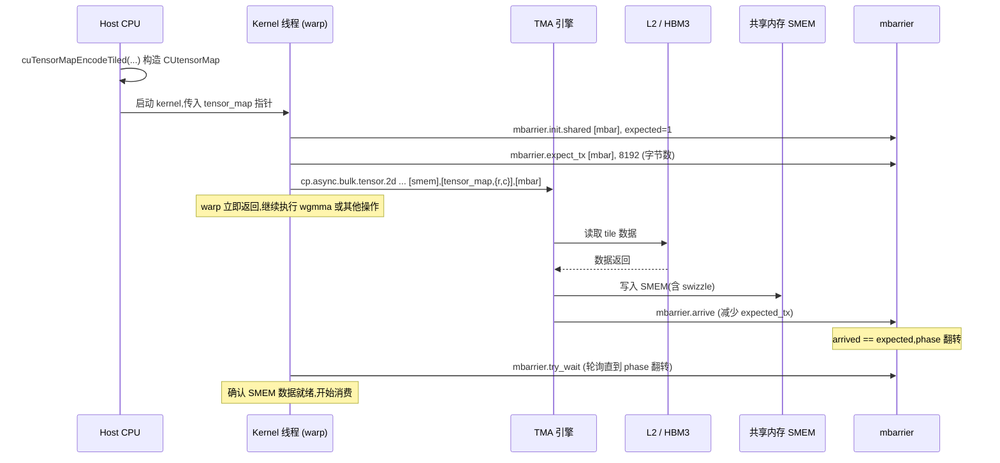

# 09 · TMA(Tensor Memory Accelerator)

> **TMA 是 Hopper 引入的硬件 DMA 引擎,一条 PTX 指令即可把多维 tensor 的任意矩形 box 从全局内存异步搬入共享内存,期间 warp 可继续执行其他操作。**

## 1. 是什么 / 为什么有它

在 Hopper 之前,把数据从 GMEM 搬到 SMEM 需要每个线程分别计算地址、执行 `cp.async` 指令。对于矩阵乘这类需要按 tile 搬运的场景,每次搬运一个 tile 需要 128 个线程各自计算行列偏移、处理边界条件、执行多条 cp.async——这些地址计算指令与 TC 抢占 issue 槽位,降低有效 TC 吞吐。

**Tensor Memory Accelerator(TMA)** 是 Hopper SM90 内置的硬件协处理器:

- **一条指令搬一整块:** `cp.async.bulk.tensor` 可以一次性把一个多维 box(最多 5 维)从 GMEM 搬到 SMEM,所有地址计算和边界裁剪由 TMA 硬件完成
- **完全异步:** 指令发射后立即返回,warp 可继续执行 wgmma 或其他操作
- **用 mbarrier 通知完成:** TMA 完成时自动对指定的 mbarrier 执行 arrive+tx(减少 expected 计数),消费者线程通过 `mbarrier.try_wait` 轮询

TMA 的引入让每个 warp 只需 1 条指令即可触发整个 tile 的搬运,地址计算压力降至接近零,warp 可把所有执行带宽留给 wgmma,是 Hopper GEMM 性能突破的关键使能机制之一。

**TMA 的两个方向:**
- **GMEM → SMEM(load):** 最常用,配合 mbarrier 完成通知
- **SMEM → GMEM(store):** 结果写回,配合 `cp.async.bulk.commit_group` / `wait_group` 等待

**im2col 模式:** TMA 除了 tiled 模式(矩形 box),还支持 im2col 模式(`cuTensorMapEncodeIm2col`),专门用于 convolution 的 input feature map 展开,可以直接把 NHWC 的 input patch 展开成矩阵列存入 SMEM,免去软件 im2col 预处理。这是深度学习推理框架(cuDNN)内部使用的高效路径。

**Cluster TMA:** 在 Thread Block Cluster(见第 11 章)中,TMA 的目标可以是同一 cluster 内任意 CTA 的 SMEM(分布式共享内存 DSMEM),指令格式为 `cp.async.bulk.tensor.Nd.global.shared::cluster.tile.mbarrier::complete_tx::bytes`,使多 SM 协同加载超大 tile。

## 2. 硬件视角(微架构细节)

TMA 引擎是 SM 内的一个独立单元,不占用标量执行管线的 issue 槽位。它接收一个 **CUtensorMap 描述符**(host 侧预先初始化的 128-byte 结构体),描述 tensor 的维度、步长、数据类型和 swizzle 模式。kernel 内部调用 `cp.async.bulk.tensor` 时,只需提供描述符指针和一组坐标向量,TMA 硬件自行完成:

1. 将多维坐标转换为线性字节偏移(stride 乘法)
2. 裁剪超出边界的区域(无需软件 boundary check)
3. 分批从 L2/HBM 读取数据并写入 SMEM
4. 完成后对 mbarrier 执行 arrive(减少 expected_tx 计数)



**CUtensorMap 的 5D 描述能力:**
TMA 支持最多 5 个维度,每维独立指定 box size 和 stride。典型用法:
- 2D:矩阵行列(最常用)
- 3D:batch × 行 × 列
- 4D:batch × 头数 × seq × dim
- 5D:更复杂的 transformer layout

swizzle 模式(32B/64B/128B)控制 TMA 写入 SMEM 时的列地址置换,与 SMEM bank 布局对齐,消除 bank conflict。128B swizzle 表示每 128 字节做一次 XOR 置换,将不同列的数据分散到不同 bank,对于 16 列 × 8B(FP16)= 128B 宽的矩阵 tile 效果最佳。

**CUtensorMap 的对齐要求:**
- GMEM 基地址:16 字节对齐
- SMEM 目标地址:必须按 tile_size 对齐,且 ≥ 128 字节对齐
- box 各维度尺寸受限:最内层维度 × element_size ≤ 256 字节

TMA 描述符一旦在 host 侧构造,必须以 `__constant__` 内存或 kernel 参数传递给 device。描述符不可在 device 端修改——TMA 硬件缓存描述符内容以加速地址计算,运行时修改会产生未定义行为。

## 3. CUDA 编程接口

**Host 端:构造 CUtensorMap(Driver API)**

```cpp
#include <cuda.h>

CUtensorMap tensor_map;
// 描述一个 M×K 的 FP16 矩阵,按 tile_m×tile_k box 搬运
cuTensorMapEncodeTiled(
    &tensor_map,               // 输出描述符
    CU_TENSOR_MAP_DATA_TYPE_FLOAT16,
    2,                         // 维度数
    gmem_base_ptr,             // 全局内存基地址(必须 16B 对齐)
    {(uint64_t)M, (uint64_t)K}, // 全局张量尺寸(dim0=行, dim1=列)
    {(uint64_t)K, 1},           // stride(元素数),列连续步长=1
    {tile_m, tile_k},           // box 尺寸(每次搬运的 sub-block 大小)
    CU_TENSOR_MAP_INTERLEAVE_NONE,
    CU_TENSOR_MAP_SWIZZLE_128B, // 128B swizzle 消除 bank conflict
    CU_TENSOR_MAP_L2_PROMOTION_NONE,
    CU_TENSOR_MAP_FLOAT_OOB_FILL_NONE   // 越界填充 0
);
```

**Kernel 端:发起异步 load**

```ptx
// 2D TMA load:把 [row, col] 坐标处的 tile 从 GMEM 搬到 SMEM
// smem_dst: SMEM 目标地址(128B 对齐)
// tensor_map: CUtensorMap 描述符(从 GMEM 传入,或存在 const SMEM)
// mbar: mbarrier 地址
cp.async.bulk.tensor.2d.global.shared::cluster.tile.mbarrier::complete_tx::bytes
    [smem_dst], [tensor_map, {%r_coord, %c_coord}], [mbar];

// 5D 示例:batch × head × seq × dim(略去坐标具体值)
cp.async.bulk.tensor.5d.global.shared::cluster.tile.mbarrier::complete_tx::bytes
    [smem_dst], [tensor_map, {%d0,%d1,%d2,%d3,%d4}], [mbar];
```

**TMA store:SMEM → GMEM**

```ptx
// TMA store 方向相反:SMEM → GMEM
cp.async.bulk.tensor.2d.global.shared::cluster.tile
    [tensor_map, {%r_coord, %c_coord}], [smem_src];
// TMA store 无 mbarrier 完成通知,需手动 fence:
cp.async.bulk.commit_group;
cp.async.bulk.wait_group 0;
```

**关键头文件:**
- `<cuda.h>` — `cuTensorMapEncodeTiled` 等 Driver API
- CUDA 12.0+ 新增 `cuda/pipeline` 与 `cuda/barrier` C++ 封装,可替代手写 PTX mbarrier

## 4. 关键性能指标

**TMA 吞吐上限:**
TMA 引擎的搬运带宽受 L2 到 SMEM 路径限制,约等于 SMEM 写入带宽(Hopper 每 SM 约 128 B/cycle,满频率 ~2 TB/s 全芯片)。实际受限于 L2/HBM 带宽,多 SM 并发 TMA 时共享 L2 总带宽 ~5 TB/s。

**单次 TMA 的时序(典型 2D 256×256 BF16 tile,32 KiB):**
- dispatch 延迟:约 50 cycle(从 `cp.async.bulk.tensor` 发射到 TMA 引擎接管)
- L2 命中时搬运完成:约 100–200 cycle
- L2 miss 走 HBM 时:约 300–500 cycle

**TMA vs 手写 cp.async 对比:**
| 方式 | 地址计算指令数 | SMEM 对齐保证 | 边界裁剪 |
|---|---|---|---|
| 手写 `cp.async` | 每线程 ~5–10 条 | 手动 | 手动 if 分支 |
| TMA | 0(硬件完成) | 自动 | 硬件 OOB fill |

TMA 省去地址计算后,每个 warp 的 issue 带宽完全用于 wgmma 指令流,这是 wgmma 能达到 85%+ TC 利用率的前提。

**L2 promotion 选项:** `cuTensorMapEncodeTiled` 支持 `CU_TENSOR_MAP_L2_PROMOTION_L2_64B/128B/256B`,控制 TMA 读取时对 L2 cache line 的预取粒度,与 `cudaAccessPropertyStreaming`/`Persisting` 相互独立。对于工作集远大于 L2(60 MiB)的大矩阵 GEMM,推荐使用 streaming 模式避免 L2 污染。

## 5. 代码示例

下面展示 TMA + mbarrier 的完整 2D tile load 流程(PTX 框架,省略 wgmma 部分):

```ptx
// 假设 tensor_map 已通过 kernel param 传入
// smem_a: 已声明的 SMEM 缓冲区(128B 对齐)
// mbar: 已在 SMEM 中声明的 mbarrier(8B 对齐)

// 1. 初始化 mbarrier
mbarrier.init.shared.b64 [mbar], 1;         // expected arrive count = 1

// 2. 声明本次 TMA 将写入的字节数(tile_m * tile_k * sizeof(fp16))
// 例:tile_m=64, tile_k=64 => 64*64*2 = 8192 字节
mbarrier.expect_tx.shared.b64 [mbar], 8192;

// 3. 发起异步 TMA load(只需 1 个线程发起,其他线程无需参与)
// threadIdx.x==0 的线程发射 TMA
cp.async.bulk.tensor.2d.global.shared::cluster.tile.mbarrier::complete_tx::bytes
    [smem_a], [tensor_map, {%row_coord, %col_coord}], [mbar];

// 4. warp 继续执行其他操作(例如 wgmma 上一轮的 tile)
// ... (overlap 区域)

// 5. 等待 mbarrier phase 翻转(TMA 完成信号)
// 获取当前 phase token
mbarrier.arrive.shared.b64 %token, [mbar];
// 循环 try_wait 直到成功
WAIT_LOOP:
mbarrier.try_wait.parity.shared.b64 %ok, [mbar], %parity, 10;
@!%ok bra WAIT_LOOP;
// 此时 smem_a 数据已就绪,可以发射 wgmma
```

说明:
- 第 1 步的 `mbarrier.init` 设置 expected arrive = 1,因为只有 TMA 会 arrive 一次
- 第 2 步 `mbarrier.expect_tx` 设置 TMA 字节数,TMA 写完后用 arrive+tx 减 expected_tx
- 第 3 步只需 1 个线程(如 `threadIdx.x == 0`)执行,其他线程执行到 wait 时才需要同步

## 6. 实测手段

**NSight Compute 关键指标:**

```bash
# 采集 TMA 活跃度与带宽
ncu --metrics \
  sm__pipe_tensor_load_async_cycles_active.avg,\
  sm__inst_executed_pipe_tensor_load.sum,\
  l1tex__t_bytes_pipe_lsu_mem_global_op_ld.sum \
  ./tma_app
```

| Metric | 含义 |
|---|---|
| `sm__pipe_tensor_load_async_cycles_active.avg` | TMA load 管线活跃 cycle 数 |
| `sm__inst_executed_pipe_tensor_load.sum` | TMA load 指令总数 |
| `l1tex__t_bytes_pipe_lsu_mem_global_op_ld.sum` | L1 → SMEM 经由 LSU 的字节数(含 TMA) |
| `sm__pipe_tensor_store_async_cycles_active.avg` | TMA store 管线活跃 cycle 数 |

在 NSight Systems 中,TMA 搬运不显示为独立事件,但可观察到 mbarrier 等待时间和 SMEM 写入活跃度的变化,从而推断 TMA 是否与 wgmma 重叠良好。

**借助 NSight Compute 验证 TMA 搬运效率的方法:**

1. 对比 `sm__inst_executed_pipe_tensor_load.sum` 与 wgmma 指令数比值:理想情况下二者接近 1:1(每次 wgmma 对应一次 TMA 预取)
2. 观察 `smsp__warp_cycles_per_issue_active.avg`:若因等待 mbarrier 而数值偏高,说明 TMA 未能及时完成(可能需要更大 SMEM 缓冲或更激进的预取)
3. 检查 `lts__t_sector_hit_rate.pct`:TMA 读 L2 命中率反映工作集是否适合 L2 容量

## 7. 常见反模式

**1. 忘记设置 mbarrier.expect_tx 字节数导致永远等待**
`cp.async.bulk.tensor` 完成时触发的是 `arrive+tx(bytes)` 而非普通的 arrive——必须事先通过 `mbarrier.expect_tx` 告知 mbarrier 期望的字节数。若忘记调用 `expect_tx`,mbarrier 的 expected_tx 不匹配,条件永远不满足,`mbarrier.try_wait` 无限循环导致 kernel 死锁。

**2. CUtensorMap swizzle 与 SMEM 访问 swizzle 不匹配**
TMA 把数据写入 SMEM 时按描述符中的 swizzle 模式重排列地址,后续 wgmma 或手动取数时必须按相同 swizzle 模式计算 SMEM 地址。若 `cuTensorMapEncodeTiled` 指定 128B swizzle 但 wgmma descriptor 按无 swizzle 的线性地址读取,TC 读到错误元素,计算结果静默错误。

**3. 在 kernel 内部每次迭代重新构造 CUtensorMap**
CUtensorMap 是 128 字节结构,通过 `cuTensorMapEncodeTiled` 在 host 端一次性准备好后以 `__constant__` 或 kernel 参数传入。若在 kernel 内部动态构造(如用 PTX 拼 descriptor),不仅计算开销高,还违反 TMA 的设计假设(描述符必须是只读常量)。

**4. 多线程同时对同一 SMEM 目标发射 TMA**
TMA 的 `cp.async.bulk.tensor` 应由单一线程(通常 threadIdx.x == 0)发射。若多个线程并发写同一 `smem_dst`,会产生写冲突——SMEM 数据未定义。

**5. TMA store 后不等待 bulk commit_group / wait_group**
TMA store(SMEM → GMEM)没有 mbarrier 通知机制。必须使用 `cp.async.bulk.commit_group` + `cp.async.bulk.wait_group 0` 等待写入完成,否则后续 kernel 从 GMEM 读可能读到旧数据。

## 8. 延伸阅读

- PTX ISA §9.7.16 — `cp.async.bulk.tensor`(全部维度变体、mbarrier complete_tx 语义)
- CUDA Driver API `cuTensorMapEncodeTiled` / `cuTensorMapEncodeim2col`(5D box 编码细节)
- Hopper Architecture Whitepaper — §Tensor Memory Accelerator
- CUTLASS 3.x `include/cute/atom/copy_atom.hpp` — TMA copy atom 封装
  — https://github.com/NVIDIA/cutlass
- developer.nvidia.com/blog/nvidia-hopper-architecture-in-depth(TMA 架构图解)
