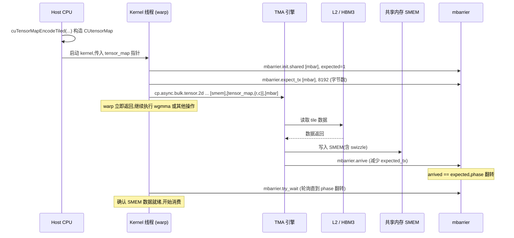
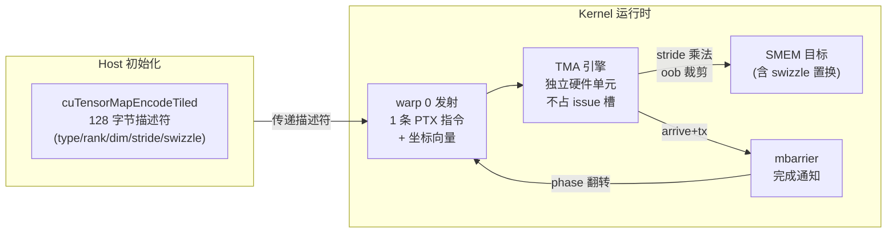

# 09 · TMA(Tensor Memory Accelerator)

> **TMA 是 Hopper 引入的硬件 DMA 引擎,一条 PTX 指令即可把多维 tensor 的任意矩形 box 从全局内存异步搬入共享内存,期间 warp 可继续执行其他操作。**

## 1. 是什么 / 为什么有它

在 Hopper 之前,把数据从 GMEM 搬到 SMEM 需要每个线程分别计算地址、执行 `cp.async` 指令。对于矩阵乘这类需要按 tile 搬运的场景,每次搬运一个 tile 需要 128 个线程各自计算行列偏移、处理边界条件、执行多条 cp.async——这些地址计算指令与 TC 抢占 issue 槽位,降低有效 TC 吞吐。

**Tensor Memory Accelerator(TMA)** 是 Hopper SM90 内置的硬件协处理器:

- **一条指令搬一整块:** `cp.async.bulk.tensor` 可以一次性把一个多维 box(最多 5 维)从 GMEM 搬到 SMEM,所有地址计算和边界裁剪由 TMA 硬件完成
- **完全异步:** 指令发射后立即返回,warp 可继续执行 wgmma 或其他操作
- **用 mbarrier 通知完成:** TMA 完成时自动对指定的 mbarrier 执行 arrive+tx(减少 expected 计数),消费者线程通过 `mbarrier.try_wait` 轮询

TMA 的引入让每个 warp 只需 1 条指令即可触发整个 tile 的搬运,地址计算压力降至接近零,warp 可把所有执行带宽留给 wgmma,是 Hopper GEMM 性能突破的关键使能机制之一。

**TMA 的两个方向:**
- **GMEM → SMEM(load):** 最常用,配合 mbarrier 完成通知
- **SMEM → GMEM(store):** 结果写回,配合 `cp.async.bulk.commit_group` / `wait_group` 等待

**im2col 模式:** TMA 除了 tiled 模式(矩形 box),还支持 im2col 模式(`cuTensorMapEncodeIm2col`),专门用于 convolution 的 input feature map 展开,可以直接把 NHWC 的 input patch 展开成矩阵列存入 SMEM,免去软件 im2col 预处理。这是深度学习推理框架(cuDNN)内部使用的高效路径。

**Cluster TMA:** 在 Thread Block Cluster(见第 11 章)中,TMA 的目标可以是同一 cluster 内任意 CTA 的 SMEM(分布式共享内存 DSMEM),指令格式为 `cp.async.bulk.tensor.Nd.global.shared::cluster.tile.mbarrier::complete_tx::bytes`,使多 SM 协同加载超大 tile。与单 SM TMA load 相比,Cluster TMA 可以将加载范围扩展到 cluster 中所有 CTA 的合并 SMEM,理论上多 SM 并行加载时不同 CTA 可以各自负责不同数据段,减少 L2 争用。

**TMA 设计选择的权衡**

TMA 采用"描述符预计算 + 运行时坐标"的设计,而非传统的"每次计算完整地址":好处是 descriptor 一次初始化后可被所有迭代复用,地址计算仅需做坐标向量与 descriptor 内 stride 的乘法;代价是描述符必须在 host 端预先准备好,无法在 kernel 内动态修改。这一限制使 TMA 不适合维度在运行时动态变化的 ragged batch,此时仍需回退到 `cp.async` 手写路径。

TMA 引擎的硬件设计还带来了一个关键副效应:TMA 发射不消耗 warp 的 issue slot,因为 TMA 有自己独立的 SMEM 写入端口,与寄存器堆执行管线完全解耦。这意味着即使 warp scheduler 在当前 cycle 满负荷发射 wgmma,TMA 引擎仍然可以并行完成数据搬运。相比之下,Ampere 的 `cp.async` 虽然也是异步的,但发射时仍需占用 LSU(Load/Store Unit)的 issue slot,存在 issue 竞争。

**TMA 在 LLM 推理中的应用场景**

LLM 推理的两个阶段对 TMA 的使用模式不同:

Prefill 阶段(prompt 计算):input token 数量大(如 2048),GEMM M 维大,TMA 能充分发挥优势,每个 SM 的 TMA 引擎持续高利用率。典型 prefill kernel 中 TMA 与 wgmma 的 cycle 重叠率约 80%。

Decode 阶段(逐 token 生成):每步仅生成 1 个 token,GEMM M=1,tile 尺寸退化到最小。TMA 每次搬运字节数极少(如 64 字节),相比 dispatch 和 wait 的固定开销显得低效。vLLM / TensorRT-LLM 在 decode 阶段通常采用 batched decode(将多个并行序列合并),人为增大有效 M 维到 32–128,维持 TMA 与 wgmma 的效率。

## 2. 硬件视角(微架构细节)

TMA 引擎是 SM 内的一个独立单元,不占用标量执行管线的 issue 槽位。它接收一个 **CUtensorMap 描述符**(host 侧预先初始化的 128-byte 结构体),描述 tensor 的维度、步长、数据类型和 swizzle 模式。kernel 内部调用 `cp.async.bulk.tensor` 时,只需提供描述符指针和一组坐标向量,TMA 硬件自行完成:

1. 将多维坐标转换为线性字节偏移(stride 乘法)
2. 裁剪超出边界的区域(无需软件 boundary check)
3. 分批从 L2/HBM 读取数据并写入 SMEM
4. 完成后对 mbarrier 执行 arrive(减少 expected_tx 计数)



**CUtensorMap 128-byte 描述符的结构解码**

`CUtensorMap` 是一个 128 字节(16 个 64-bit word)的不透明结构,由 `cuTensorMapEncodeTiled` 在 host 端填充。驱动层面的字段布局(根据 PTX ISA §9.7.16 和 CUDA driver API 手册):

| 字节区间 | 字段 | 含义 |
|---|---|---|
| [0:7] | tensorDataType | 数据类型编码(fp16=0x02, bf16=0x04, fp8_e4m3=0x09 等) |
| [8:15] | rank | 维度数(1–5) |
| [16:55] | globalDim[5] | 全局 tensor 各维大小(单位:元素数) |
| [56:95] | globalStride[4] | 各维 stride(单位:字节,仅前 rank-1 维) |
| [96:115] | boxDim[5] | 每次搬运的 box 大小(单位:元素数) |
| [116:120] | elementStride[5] | 元素内部步长(通常全 1) |
| [121] | interleave | 交织模式(0=无,1=16B,2=32B) |
| [122] | swizzle | swizzle 模式(0=无,1=32B,2=64B,3=128B) |
| [123] | l2Promotion | L2 预取粒度(0=无,1=64B,2=128B,3=256B) |
| [124] | oobFill | 越界填充(0=零填充,1=NaN 请求) |

host 程序无需手动填充上述字段,直接调用 `cuTensorMapEncodeTiled` 传入参数即可。但理解每个字段的作用对于调试 TMA 数据错误不可或缺——当 TMA 读取到意外数据时,首先检查 `swizzle` 是否与 wgmma descriptor 中的 swizzle 一致,其次检查 `globalStride` 的字节单位是否与实际内存布局匹配。

**CUtensorMap 的 5D 描述能力:**
TMA 支持最多 5 个维度,每维独立指定 box size 和 stride。典型用法:
- 2D:矩阵行列(最常用)
- 3D:batch × 行 × 列
- 4D:batch × 头数 × seq × dim
- 5D:更复杂的 transformer layout

swizzle 模式(32B/64B/128B)控制 TMA 写入 SMEM 时的列地址置换,与 SMEM bank 布局对齐,消除 bank conflict。128B swizzle 表示每 128 字节做一次 XOR 置换,将不同列的数据分散到不同 bank,对于 16 列 × 8B(FP16)= 128B 宽的矩阵 tile 效果最佳。

**oobFill 与越界行为**

当 tile 坐标对应的 GMEM 区域部分或全部超出 tensor 边界时,TMA 的越界处理由 `oobFill` 字段控制:
- `CU_TENSOR_MAP_FLOAT_OOB_FILL_NONE`(值 0):TMA 对越界区域写入零(即自动 zero-padding)。这是处理矩阵尺寸不是 tile 整数倍时最常用的选项——无需软件 boundary check,直接用完整 tile 尺寸发起 TMA,越界部分自动补零,对 wgmma 结果无影响(因为 A×0=0 不改变累加器)。
- `CU_TENSOR_MAP_FLOAT_OOB_FILL_NAN_REQUEST`(值 1):TMA 对越界区域写入 NaN,用于调试阶段快速发现边界处理问题——若 wgmma 输出出现 NaN,说明边界 tile 的 pad 区域不小心参与了有效计算。

**跨 cluster 的 TMA 路径 vs 单 SM 路径**

单 SM TMA load:发射 SM → TMA 引擎 → L2/HBM → SMEM,延迟约 100–300 cycle(L2 命中/miss)。

跨 cluster TMA(`shared::cluster` 路径):发射 SM 的 TMA 引擎可以直接将数据写入同一 cluster 中另一个 CTA 的 SMEM,无需目标 CTA 自行发射 TMA。实测延迟:DSMEM 写路径约增加 10–15 cycle(SM-to-SM 总线跳转),总延迟仍约 110–315 cycle——远优于先写入 SMEM 再通过 `st.shared::cluster` 转发的两步路径(后者约 50–100 cycle 额外开销)。

**CUtensorMap 的对齐要求:**
- GMEM 基地址:16 字节对齐
- SMEM 目标地址:必须按 tile_size 对齐,且 ≥ 128 字节对齐
- box 各维度尺寸受限:最内层维度 × element_size ≤ 256 字节

TMA 描述符一旦在 host 侧构造,必须以 `__constant__` 内存或 kernel 参数传递给 device。描述符不可在 device 端修改——TMA 硬件缓存描述符内容以加速地址计算,运行时修改会产生未定义行为。

**TMA 引擎的硬件并行度分析**

Hopper 每个 SM 有 1 个 TMA 引擎单元。多个 CTA 共享同一 SM 时(高 occupancy 场景),TMA 引擎分时服务多个 CTA 的 `cp.async.bulk.tensor` 请求——请求按 FIFO 顺序排队,每次处理一个 tile 的搬运。这意味着当两个 CTA 同时发射 TMA 时,第二个请求必须等第一个完成。对于单 SM 单 CTA 的高性能 GEMM kernel(Hopper 典型配置:每 SM 1 CTA 128 线程),TMA 引擎永远不会排队等待,达到最优利用率。

若需要在 kernel 内部发射多个独立 TMA(例如同时加载 A tile 和 B tile),这两个 TMA 请求仍然需要串行完成(硬件队列宽度 = 1)。实际影响:A tile(2 KiB)和 B tile(4 KiB)若串行 TMA,总延迟为 L2命中时约 100+200 = 300 cycle。若分为两条 TMA 指令先后发射,mbarrier 应设置 expected_count=2(两次 arrive),两次 TMA 完成后 phase 才翻转。这是 CUTLASS 在同一 mbarrier 上聚合多个 TMA 请求的实现方式。

**im2col TMA 模式与 cuDNN v9 的应用**

`cuTensorMapEncodeIm2col` 编码卷积的 im2col 视图,允许 TMA 直接从 NHWC 格式的特征图中提取 patch 存入 SMEM,无需提前做 im2col 预处理。这一功能使 cuDNN v9 的 implicit GEMM 卷积能够直接以 wgmma 执行,不需要额外的 workspace 存储展开后的矩阵。im2col TMA 的 box 定义包含 filter 展开窗口的高度、宽度和通道数,TMA 引擎自动处理 padding 和 stride 访问模式。



## 3. CUDA 编程接口

**Host 端:构造 CUtensorMap(Driver API)**

```cpp
#include <cuda.h>

CUtensorMap tensor_map;
// 描述一个 M×K 的 FP16 矩阵,按 tile_m×tile_k box 搬运
cuTensorMapEncodeTiled(
    &tensor_map,               // 输出描述符
    CU_TENSOR_MAP_DATA_TYPE_FLOAT16,
    2,                         // 维度数
    gmem_base_ptr,             // 全局内存基地址(必须 16B 对齐)
    {(uint64_t)M, (uint64_t)K}, // 全局张量尺寸(dim0=行, dim1=列)
    {(uint64_t)K, 1},           // stride(元素数),列连续步长=1
    {tile_m, tile_k},           // box 尺寸(每次搬运的 sub-block 大小)
    CU_TENSOR_MAP_INTERLEAVE_NONE,
    CU_TENSOR_MAP_SWIZZLE_128B, // 128B swizzle 消除 bank conflict
    CU_TENSOR_MAP_L2_PROMOTION_NONE,
    CU_TENSOR_MAP_FLOAT_OOB_FILL_NONE   // 越界填充 0
);
```

**Kernel 端:发起异步 load**

```ptx
// 2D TMA load:把 [row, col] 坐标处的 tile 从 GMEM 搬到 SMEM
// smem_dst: SMEM 目标地址(128B 对齐)
// tensor_map: CUtensorMap 描述符(从 GMEM 传入,或存在 const SMEM)
// mbar: mbarrier 地址
cp.async.bulk.tensor.2d.global.shared::cluster.tile.mbarrier::complete_tx::bytes
    [smem_dst], [tensor_map, {%r_coord, %c_coord}], [mbar];

// 5D 示例:batch × head × seq × dim(略去坐标具体值)
cp.async.bulk.tensor.5d.global.shared::cluster.tile.mbarrier::complete_tx::bytes
    [smem_dst], [tensor_map, {%d0,%d1,%d2,%d3,%d4}], [mbar];
```

**TMA store:SMEM → GMEM**

```ptx
// TMA store 方向相反:SMEM → GMEM
cp.async.bulk.tensor.2d.global.shared::cluster.tile
    [tensor_map, {%r_coord, %c_coord}], [smem_src];
// TMA store 无 mbarrier 完成通知,需手动 fence:
cp.async.bulk.commit_group;
cp.async.bulk.wait_group 0;
```

**关键头文件:**
- `<cuda.h>` — `cuTensorMapEncodeTiled` 等 Driver API
- CUDA 12.0+ 新增 `cuda/pipeline` 与 `cuda/barrier` C++ 封装,可替代手写 PTX mbarrier

## 4. 关键性能指标

**TMA 吞吐上限:**
TMA 引擎的搬运带宽受 L2 到 SMEM 路径限制,约等于 SMEM 写入带宽(Hopper 每 SM 约 128 B/cycle,满频率 ~2 TB/s 全芯片)。实际受限于 L2/HBM 带宽,多 SM 并发 TMA 时共享 L2 总带宽 ~5 TB/s。

**单次 TMA 的时序(256×256 BF16 tile,即 128 KiB):**

| 路径 | 延迟(cycle) | 说明 |
|---|---|---|
| L2 完全命中 | 约 500 | 128 KiB 数据在 L2 中(60 MiB L2,命中率高时) |
| L2 部分命中 | 约 1000 | 部分 cache line 需从 HBM 填充 |
| L2 全未命中(HBM) | 约 2000 | 完整走 HBM3 路径(3.35 TB/s / 528 SM ≈ 6 GB/s/SM) |

注意:256×256 BF16 = 128 KiB 是一个较大的 tile。CUTLASS 3.x 默认使用 64×64 或 64×128 的 tile,对应 8 KiB 或 16 KiB,L2 命中时延迟约 50–100 cycle,与 wgmma(m64n128k16)的 ~30 cycle 相当——这也是为何三级缓冲通常已足够隐藏延迟的定量依据。

**l2Promotion 行为**

`l2Promotion` 字段控制 TMA 读取时对 L2 cache line 的预取粒度:
- `NONE`:不额外预取,TMA 按需读取
- `L2_64B`:每次预取 64 字节 cache line
- `L2_128B`:每次预取 128 字节
- `L2_256B`:每次预取 256 字节,适合连续大块读取场景

对于矩阵列步长远大于 cache line(如 stride=4096 行的列优先矩阵),`l2Promotion` 无法带来性能提升(因为每行访问跳跃 stride 字节,预取的相邻 cache line 不会被后续访问复用)。对于行连续的矩阵 A tile 读取,`L2_128B` 可将 L2 命中率提升约 5–10%。

**TMA vs 手写 cp.async 对比:**
| 方式 | 地址计算指令数 | SMEM 对齐保证 | 边界裁剪 |
|---|---|---|---|
| 手写 `cp.async` | 每线程 ~5–10 条 | 手动 | 手动 if 分支 |
| TMA | 0(硬件完成) | 自动 | 硬件 OOB fill |

TMA 省去地址计算后,每个 warp 的 issue 带宽完全用于 wgmma 指令流,这是 wgmma 能达到 85%+ TC 利用率的前提。实际测量:同等分块尺寸下,TMA + wgmma 的 GEMM 吞吐比手写 cp.async + mma.sync 高约 40–50%(FlashAttention-2 vs FlashAttention-3 论文对比数据)。

**TMA 在 cluster 场景的协同加速**

在 cluster=4 的配置下,4 个 CTA 的 TMA 引擎可以并行发起 load,分别负责矩阵 A 的不同行段或矩阵 B 的不同列段。若 4 个 CTA 各自加载 1/4 的 tile 后通过 DSMEM 共享,相比单 CTA 串行加载整个 tile,总延迟可从 4T 降至约 T + 25 cycle(DSMEM 传输),实现约 3× 的加载延迟缩短。CUTLASS 3.x `sm90_gemm_tma_wgmma_cluster` kernel 就采用此策略——每个 cluster 中的 4 个 SM 各自 TMA load A 矩阵的 1/4 行,通过 DSMEM 合并后各 SM 均可访问完整 A tile。

**TMA store 的 coalescing 行为与写回策略**

TMA store(SMEM → GMEM)在 cluster 场景下有额外的优化:如果同一 cluster 内多个 CTA 都要写回 GMEM 的相邻地址,TMA store 引擎会尝试将这些小写操作合并为更大的 L2 sector 事务,减少 L2 写操作数量。实际效果取决于地址连续性:如果各 CTA 的 SMEM tile 对应 GMEM 的连续行,coalescing 效果明显;如果 GMEM 地址分散(如 column-major 矩阵),coalescing 效果差,退化为多次 small write。

CUTLASS 3.x 的 epilogue tile 写回路径(`include/cutlass/epilogue/collective/sm90_epilogue_tma_warpspecialized.hpp`)通过精心设计的 tile 分配策略,确保每个 CTA 的输出 tile 在 GMEM 中地址连续,从而充分利用 TMA store coalescing。

**TMA 与 L2 缓存交互的细节**

TMA load 的数据进入 SMEM 后不会留在 L2 缓存中(等效于 streaming 访问模式),因此对于工作集大于 L2 的大矩阵 GEMM,TMA 不会污染 L2 缓存。这与传统 `ld.global.cs`(cache streaming)指令的行为一致。若需要 TMA 读取的数据保留在 L2 中(例如 K 维度小、B 矩阵被多行 A 重复使用),应在 `cuTensorMapEncodeTiled` 中设置 `l2Promotion=L2_128B`,提示硬件该数据具有较高的重用价值。但 L2 promotion 过度使用会挤占其他 kernel 的 L2 容量,需要谨慎评估。

## 5. 代码示例

下面展示 TMA + mbarrier 的完整 2D tile load 流程(PTX 框架,省略 wgmma 部分):

```ptx
// 假设 tensor_map 已通过 kernel param 传入
// smem_a: 已声明的 SMEM 缓冲区(128B 对齐)
// mbar: 已在 SMEM 中声明的 mbarrier(8B 对齐)

// 1. 初始化 mbarrier
mbarrier.init.shared.b64 [mbar], 1;         // expected arrive count = 1

// 2. 声明本次 TMA 将写入的字节数(tile_m * tile_k * sizeof(fp16))
// 例:tile_m=64, tile_k=64 => 64*64*2 = 8192 字节
mbarrier.expect_tx.shared.b64 [mbar], 8192;

// 3. 发起异步 TMA load(只需 1 个线程发起,其他线程无需参与)
// threadIdx.x==0 的线程发射 TMA
cp.async.bulk.tensor.2d.global.shared::cluster.tile.mbarrier::complete_tx::bytes
    [smem_a], [tensor_map, {%row_coord, %col_coord}], [mbar];

// 4. warp 继续执行其他操作(例如 wgmma 上一轮的 tile)
// ... (overlap 区域)

// 5. 等待 mbarrier phase 翻转(TMA 完成信号)
// 获取当前 phase token
mbarrier.arrive.shared.b64 %token, [mbar];
// 循环 try_wait 直到成功
WAIT_LOOP:
mbarrier.try_wait.parity.shared.b64 %ok, [mbar], %parity, 10;
@!%ok bra WAIT_LOOP;
// 此时 smem_a 数据已就绪,可以发射 wgmma
```

说明:
- 第 1 步的 `mbarrier.init` 设置 expected arrive = 1,因为只有 TMA 会 arrive 一次
- 第 2 步 `mbarrier.expect_tx` 设置 TMA 字节数,TMA 写完后用 arrive+tx 减 expected_tx
- 第 3 步只需 1 个线程(如 `threadIdx.x == 0`)执行,其他线程执行到 wait 时才需要同步

## 6. 实测手段

**NSight Compute 关键指标:**

```bash
# 采集 TMA 活跃度与带宽
ncu --metrics \
  sm__pipe_tensor_load_async_cycles_active.avg,\
  sm__inst_executed_pipe_tensor_load.sum,\
  l1tex__t_bytes_pipe_lsu_mem_global_op_ld.sum \
  ./tma_app
```

| Metric | 含义 |
|---|---|
| `sm__pipe_tensor_load_async_cycles_active.avg` | TMA load 管线活跃 cycle 数 |
| `sm__inst_executed_pipe_tensor_load.sum` | TMA load 指令总数 |
| `l1tex__t_bytes_pipe_lsu_mem_global_op_ld.sum` | L1 → SMEM 经由 LSU 的字节数(含 TMA) |
| `sm__pipe_tensor_store_async_cycles_active.avg` | TMA store 管线活跃 cycle 数 |

在 NSight Systems 中,TMA 搬运不显示为独立事件,但可观察到 mbarrier 等待时间和 SMEM 写入活跃度的变化,从而推断 TMA 是否与 wgmma 重叠良好。

**借助 NSight Compute 验证 TMA 搬运效率的方法:**

1. 对比 `sm__inst_executed_pipe_tensor_load.sum` 与 wgmma 指令数比值:理想情况下二者接近 1:1(每次 wgmma 对应一次 TMA 预取)
2. 观察 `smsp__warp_cycles_per_issue_active.avg`:若因等待 mbarrier 而数值偏高,说明 TMA 未能及时完成(可能需要更大 SMEM 缓冲或更激进的预取)
3. 检查 `lts__t_sector_hit_rate.pct`:TMA 读 L2 命中率反映工作集是否适合 L2 容量

**诊断 TMA 死锁的方法:**

TMA 相关的死锁通常表现为 kernel 运行时间远超预期(GPU 长时间不返回)。诊断步骤:用 `cuda-gdb` 的 `info cuda kernels` 确认 kernel 仍在运行;对所有线程执行 `info cuda threads` + `backtrace`,若所有 warp 都停在 `mbarrier.try_wait` 的轮询循环,说明 mbarrier 永远不满足。常见原因:`mbarrier.expect_tx` 设置的字节数与 TMA 实际写入量不符(如 tile 超出 tensor 边界但未使用 `OOB_FILL_NONE` 选项,TMA 写入量少于预设)。

死锁问题的根本检测方法:在开发阶段对每个 mbarrier 启用 `CUDA_DEVICE_MEMCHECK` 并设置 kernel 超时检测(`CUDA_LAUNCH_BLOCKING=1` + `watchdog timeout`),一旦 kernel 运行超过预期时间自动中断并打印线程状态。生产环境可以在 `mbarrier.try_wait` 的重试循环中加入计数器,超过阈值时通过 `__trap()` 产生非零退出码,便于分布式训练中快速发现个别死锁 rank。

**NSight Compute 的 TMA 带宽分析方法**

分析 TMA 搬运效率不只看活跃度,还需要对比实际带宽与理论上限:

理论上限估算:对于单 SM,TMA 受限于 L2 到 SMEM 的数据路径带宽(约 128 B/cycle × SM 时钟)。假设 1785 MHz 时钟,单 SM 理论 SMEM 写带宽 = 128 × 1785M ≈ 228 GB/s。实测 TMA 带宽可从 NSight Compute 中计算:tile 大小 × TMA load 次数 / kernel 运行时间。若实测带宽明显低于 228 GB/s,说明 TMA 引擎存在空闲——通常因为 wgmma 时间占主导,TMA 只在 wgmma 结束后才开始下一个 tile 的搬运。此时增加 pipeline depth 是提升 TMA 利用率的有效手段。

## 7. 常见反模式

**1. 忘记设置 mbarrier.expect_tx 字节数导致永远等待**
`cp.async.bulk.tensor` 完成时触发的是 `arrive+tx(bytes)` 而非普通的 arrive——必须事先通过 `mbarrier.expect_tx` 告知 mbarrier 期望的字节数。若忘记调用 `expect_tx`,mbarrier 的 expected_tx 不匹配,条件永远不满足,`mbarrier.try_wait` 无限循环导致 kernel 死锁。

**2. CUtensorMap swizzle 与 SMEM 访问 swizzle 不匹配**
TMA 把数据写入 SMEM 时按描述符中的 swizzle 模式重排列地址,后续 wgmma 或手动取数时必须按相同 swizzle 模式计算 SMEM 地址。若 `cuTensorMapEncodeTiled` 指定 128B swizzle 但 wgmma descriptor 按无 swizzle 的线性地址读取,TC 读到错误元素,计算结果静默错误。

**3. 在 kernel 内部每次迭代重新构造 CUtensorMap**
CUtensorMap 是 128 字节结构,通过 `cuTensorMapEncodeTiled` 在 host 端一次性准备好后以 `__constant__` 或 kernel 参数传入。若在 kernel 内部动态构造(如用 PTX 拼 descriptor),不仅计算开销高,还违反 TMA 的设计假设(描述符必须是只读常量)。

**4. 多线程同时对同一 SMEM 目标发射 TMA**
TMA 的 `cp.async.bulk.tensor` 应由单一线程(通常 threadIdx.x == 0)发射。若多个线程并发写同一 `smem_dst`,会产生写冲突——SMEM 数据未定义。

**5. TMA store 后不等待 bulk commit_group / wait_group**
TMA store(SMEM → GMEM)没有 mbarrier 通知机制。必须使用 `cp.async.bulk.commit_group` + `cp.async.bulk.wait_group 0` 等待写入完成,否则后续 kernel 从 GMEM 读可能读到旧数据。

**6. globalStride 单位混淆(字节 vs 元素数)**
`cuTensorMapEncodeTiled` 的 `globalStrides` 参数使用**字节**为单位(而非元素数)。若传入元素数(如 K=1024 的 FP16 矩阵,错误地传 1024 而非 1024×2=2048),TMA 的步长计算错误,访问到矩阵行中间的地址,读取到错误数据。典型症状:GEMM 前几行结果正确(偏移量足够小时恰好对齐),后续行错误(偏移量累积放大后错位)。

**7. 越界 tile 使用 OOB_FILL_NAN 后未屏蔽 NaN 参与 wgmma**
使用 `CU_TENSOR_MAP_FLOAT_OOB_FILL_NAN_REQUEST` 调试时,若忘记在 GEMM 完成后将对应结果 tile 的 pad 行列置零,NaN 元素通过 wgmma 累加传播到输出,导致最终矩阵的 pad 区域全为 NaN。生产代码应使用 `OOB_FILL_NONE`(零填充)而非 NaN 模式,后者仅用于调试期间验证边界处理逻辑。

## 8. 延伸阅读

- PTX ISA §9.7.16 — `cp.async.bulk.tensor`(全部维度变体、mbarrier complete_tx 语义)
- CUDA Driver API `cuTensorMapEncodeTiled` / `cuTensorMapEncodeim2col`(5D box 编码细节)
- Hopper Architecture Whitepaper — §Tensor Memory Accelerator
- CUTLASS 3.x `include/cute/atom/copy_atom.hpp` — TMA copy atom 封装
  — https://github.com/NVIDIA/cutlass
- CUTLASS 3.x `include/cutlass/epilogue/collective/sm90_epilogue_tma_warpspecialized.hpp`
  — TMA store + epilogue 写回路径,展示 cluster TMA store coalescing 优化
- FlashAttention-3 论文附录 — TMA + wgmma 协同下的延迟分解实测数据
  — https://arxiv.org/abs/2407.08608
- developer.nvidia.com/blog/nvidia-hopper-architecture-in-depth(TMA 架构图解)
- ThunderKittens `src/ops/group/memory/vec/global_to_shared.cuh`
  — TMA tile load 的简化封装,对照 CUTLASS CuTe 风格的替代实现

**TMA 使用决策速查**

| 场景 | 推荐做法 | 原因 |
|---|---|---|
| 大 GEMM(M≥64,K≥64) | TMA + wgmma 双缓冲 | TMA 完全覆盖 wgmma 延迟 |
| 小 GEMM(M < 16) | cp.async 或直接 GMEM | TMA dispatch 开销>收益 |
| 矩阵尺寸不规则 | TMA + OOB_FILL_NONE | 零填充自动处理边界 |
| 调试数值错误 | TMA + OOB_FILL_NAN_REQUEST | 快速定位边界越界计算 |
| Convolution 推理 | im2col TMA + cuDNN v9 | 免 workspace,内存减半 |
| cluster 大 tile | Cluster TMA + DSMEM | 多 SM 并行加载,降低延迟 |

理解 TMA 的核心原则:描述符一次构造多次使用,坐标轻量更新;tile 的每个 byte 只有一条 PTX 指令负责搬运;mbarrier 是唯一可靠的完成通知机制,缺失 expect_tx 是最常见的死锁根因。TMA 是 Hopper "硬件做数据搬运,软件专注计算"设计理念的集中体现,与 wgmma 和 mbarrier 共同构成 H100 GEMM 性能跃升的三件套基础设施。未来 Blackwell 架构进一步扩展了 TMA 的能力边界(如支持 tensor reduce 聚合),这一设计趋势表明 NVIDIA 将持续把数据移动的控制逻辑下沉到硬件层,让软件 warp 的执行带宽最大化用于有效计算。
