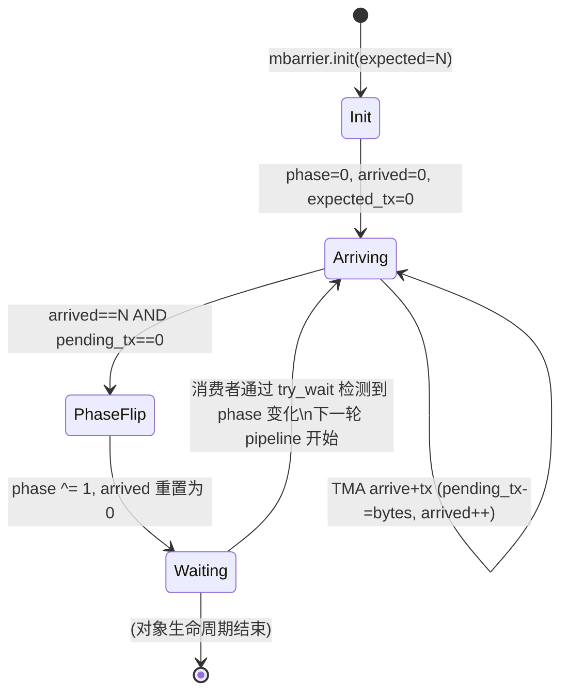
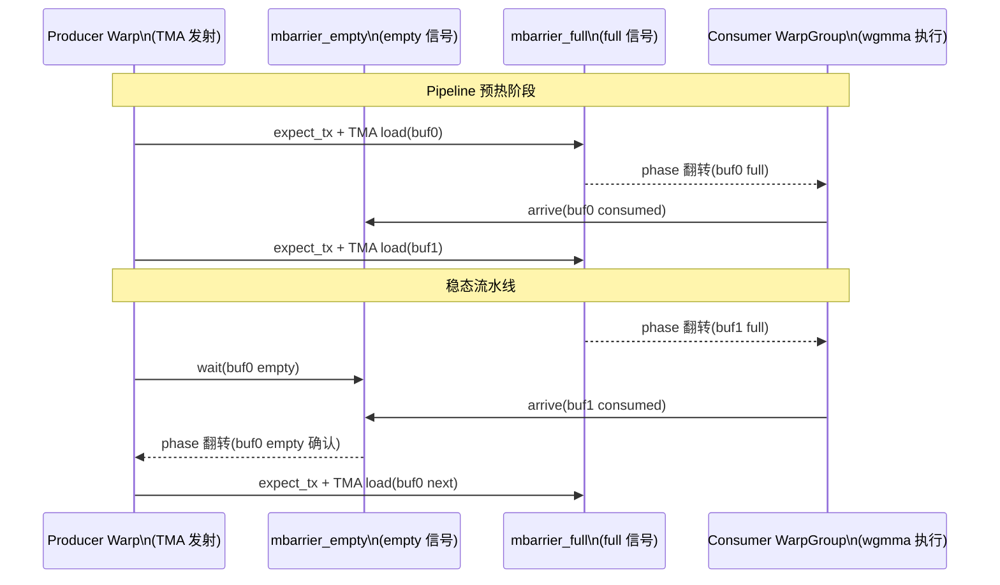

# 10 · mbarrier 异步屏障

> **mbarrier 是存储在 SMEM 中的 64-bit 硬件屏障对象,通过 phase 翻转机制协调异步操作(TMA、wgmma、cp.async)与消费者线程之间的同步,比 `__syncthreads()` 更灵活、更细粒度。**

## 1. 是什么 / 为什么有它

传统的 `__syncthreads()` 是 CTA 内所有线程的全局屏障:所有线程到达后一起通过,没有"谁通知谁完成"的概念。Hopper 引入的异步操作(TMA、wgmma、cp.async)是由硬件单元后台执行的,不占用线程时间——但需要一种机制让消费者线程"知道数据已就绪"。

`mbarrier`(memory barrier)是 Hopper 为此设计的轻量级同步原语:

- **存储位置:** SMEM 中的 8 字节对齐 64-bit 整数
- **内容:** 内部编码 phase 位、arrived count、expected count、expected_tx 字节数
- **语义:** 当 arrived count 达到 expected count 且 expected_tx 字节数被 TMA/cp.async 减至 0 时,phase 位翻转,所有 `try_wait` 等待者被唤醒

mbarrier 的设计使 producer(TMA 引擎或 producer warp)与 consumer(warp-group)之间可以通过纯 SMEM 通信完成同步,无需走 GMEM 或主机介入,同步开销约 5 cycle。

**与 `__syncthreads()` 的关键区别:**
- `__syncthreads()` 是线程屏障:所有线程必须执行到调用点才能继续
- `mbarrier` 是事件屏障:TMA/wgmma 等硬件单元可以"arrive"触发 phase 翻转,线程可提前继续其他工作
- `mbarrier` 支持动态的 expected_tx 字节计数,专门服务于 TMA 的异步 DMA 完成通知

**mbarrier 与 cp.async 的关系:**
前代(Ampere)的异步拷贝使用 `cp.async.wait_group N` 等待流水线组。Hopper 推荐用 mbarrier 替代,因为 mbarrier 支持与 TMA、wgmma 更精确的字节级同步,且 mbarrier 的 phase 机制允许无限循环复用而不需要重置。`cp.async.bulk.commit_group` / `wait_group` 在 TMA store 方向仍然适用。Ampere 的 `cp.async.wait_group` 是流水线级等待(等待某批 cp.async 全部完成),而 mbarrier 是字节级等待(精确到 TMA 实际写入的字节数),精度差异使 Hopper 能在边界 tile(部分 OOB 填充)场景下仍然精确匹配完成字节数,避免 Ampere 时代需要额外处理边界条件的代码复杂度。

**thread scope:** mbarrier 支持三种作用域:
- `shared`(默认):CTA 内部同步,arrive/wait 操作只在本 CTA SMEM 生效
- `shared::cluster`:跨 cluster 内任意 CTA 可 arrive(见第 11 章)
- 没有 global scope —— 跨 CTA 的全局同步应使用 CUDA cooperative groups 的 grid barrier

**为什么 mbarrier 只用 1 bit phase 而非多位计数器?**

这是 Hopper 的关键设计决策之一。多位 phase 计数器(如 3 bit 表示 0–7 轮)的好处是软件可以区分更多历史阶段。但代价是:每次 phase 比较需要更多位宽的原子操作,硬件检测"旧 wait token 是否过期"的逻辑更复杂。NVIDIA 选择单 bit phase 的理由是:软件已知当前 pipeline 所处的 parity 值,通过交替使用 parity=0 和 parity=1 足以覆盖双缓冲或三级缓冲的所有使用模式;单 bit 检测逻辑简单,翻转通知的延迟可以做到 5 cycle 级别。多 bit phase 的额外灵活性带来的复杂性不值得。

**mbarrier 与传统计算机体系结构中同步原语的对比**

从体系结构视角看,mbarrier 兼具以下三种传统原语的特性:

第一,**计数信号量(counting semaphore)**:通过 arrived/expected 计数机制,支持多个 producer 对一个 consumer 的"所有已就绪"通知模式,与传统信号量的 P/V 操作对应。

第二,**完成通知(completion event)**:TMA 的 `arrive+tx` 机制类似于 DMA 控制器的"传输完成中断",但通过 SMEM 轮询代替硬件中断,避免中断延迟和上下文切换。

第三,**屏障(barrier)**:当 expected 设为 CTA 内所有线程数时,mbarrier 退化为普通 barrier——所有线程 arrive 后 phase 翻转,等效于 `__syncthreads()` 但开销更低(约 5–20 cycle vs 20–100 cycle)。

这种多合一设计是 Hopper 异步编程模型的核心:无论是线程级同步、硬件 DMA 完成等待、还是跨 SM 的 cluster 同步,都通过同一套 mbarrier 原语表达,降低了 Hopper kernel 的编程模型复杂度。

**mbarrier 在 training 和 inference 框架中的应用现状**

截至 2025 年,主流框架对 mbarrier 的使用情况:
- **CUTLASS 3.x**:全面使用 mbarrier + TMA + wgmma 三件套,是最完整的生产实现
- **FlashAttention-3**:使用 mbarrier 实现 warp-specialization 的 producer/consumer 同步,代码在 `hopper/` 目录下
- **cuDNN v9**:内部使用 mbarrier + im2col TMA 实现卷积,不对外暴露 PTX 细节
- **PyTorch custom attention**:通过 CUTLASS 的 Python 接口(PyCUTLASS / `torch.ops`)间接使用,无需用户直接写 mbarrier PTX
- **Triton**:目前(2025 年)尚未完整支持 wgmma + mbarrier 模式,对 Hopper 的利用率相比 CUTLASS 有约 15–20% 差距

## 2. 硬件视角(微架构细节)

mbarrier 对象是一个 64-bit SMEM 字,由 SM 内的 mbarrier 控制器硬件管理。当 TMA 引擎完成写入时,硬件自动对目标 mbarrier 执行原子减(expected_tx 计数)和 arrive 操作。

**64-bit 内部 bit field 精确布局**

根据 PTX ISA §9.7.12 与 Hopper Architecture Whitepaper §mbarrier 的说明,mbarrier 64-bit 对象的内部 bit field 如下:

| bit 范围 | 字段 | 位宽 | 含义 |
|---|---|---|---|
| [19:0] | pending_tx | 20 bit | 剩余待确认的 TMA/cp.async 字节数(初始由 expect_tx 设置,TMA 完成时硬件减少) |
| [39:20] | arrived | 20 bit | 已 arrive 的线程/事件计数 |
| [59:40] | expected | 20 bit | 期望的 arrive 总次数(由 init 设置) |
| [60] | phase | 1 bit | 当前 phase(0 或 1),满足条件时翻转 |
| [63:61] | reserved | 3 bit | 保留字段,不可读写 |

翻转条件:当 `arrived == expected` 且 `pending_tx == 0` 时,硬件原子地翻转 `phase` 位,并重置 `arrived = 0`,保持 `expected` 不变(下一轮自动继续)。这使 mbarrier 可以无限次循环复用:奇数轮等待 `phase=1`,偶数轮等待 `phase=0`。

**phase 翻转后旧 wait token 的过期检测**

当消费者线程持有一个"上一轮"的 phase token 并调用 `try_wait` 时,硬件如何区分"旧 token 还有效"与"新一轮已翻转"?Hopper 的方案:每个 arrive token 中隐含了发出时的 phase 值。`try_wait.parity` 携带调用者期望的 parity 值(而非 token),直接与当前 mbarrier 的 phase bit 比较——若相等表示 phase 已翻转到期望值,返回成功。旧 token 即使存在,不影响当前 phase 的检测精度。

`try_wait.token` 与 `try_wait.parity` 的区别:
- `try_wait.token`使用 arrive 返回的 64-bit token 进行精确匹配,适合需要追踪特定 arrive 事件的场景
- `try_wait.parity` 使用 1-bit parity 值(0 或 1)进行 phase 匹配,更简单,适合生产者消费者模式中的双缓冲循环复用

生产代码几乎总是使用 `try_wait.parity`,因为它不需要存储和传递 token 值,只需在循环中交替 parity 即可。

mbarrier 的状态转换:



**expected_tx 字节计数器:**
TMA 的异步 DMA 写入量是变动的(取决于 tile 大小和边界裁剪)。`mbarrier.expect_tx` 在发射 TMA 前预先告知 mbarrier "本次 DMA 将写入 N 字节",TMA 完成后通过 `arrive+tx(N)` 减少 pending_tx。只有当 pending_tx 归零且 arrived count 达到 expected,phase 才翻转——这保证了 DMA 字节数的精确匹配。

**双缓冲场景中的 mbarrier 内存布局示例**

一个典型双缓冲 TMA + wgmma kernel 在 SMEM 中的 mbarrier 布局:

```
SMEM[0:7]   : mbarrier_empty[0]   ; producer 等待 buffer 0 被消费
SMEM[8:15]  : mbarrier_empty[1]   ; producer 等待 buffer 1 被消费
SMEM[16:23] : mbarrier_full[0]    ; consumer 等待 buffer 0 被填充
SMEM[24:31] : mbarrier_full[1]    ; consumer 等待 buffer 1 被填充
```

每个 mbarrier 仅占 8 字节,4 个 mbarrier 共 32 字节,相比整个 SMEM(228 KiB)几乎可忽略。但这 4 个 mbarrier 实现了完整的双向双缓冲 pipeline:producer 通知 full,consumer 通知 empty,两个方向各 2 个 mbarrier(对应 2 个 buffer)。CUTLASS 3.x `pipeline.hpp` 中的 `PipelineTmaAsync` 类就采用这种四 mbarrier 设计。



## 3. CUDA 编程接口

**PTX 指令集(mbarrier 全部操作):**

```ptx
// 1. 初始化:设置 expected arrive count
// N: 预期的 arrive 次数(通常等于参与生产的线程数 + TMA 次数)
mbarrier.init.shared.b64 [%mbar], 1;        // expected = 1

// 2. arrive:生产者线程到达,返回当前 token(含 phase 信息)
mbarrier.arrive.shared.b64 %token, [%mbar]; // arrived++, 返回 token

// 3. expect_tx:声明本次异步操作将写入的字节数
// 必须在发射 TMA 前调用
mbarrier.expect_tx.shared.b64 [%mbar], %bytes; // pending_tx += bytes

// 4. try_wait.parity:非阻塞轮询,等待 phase 翻转到目标 parity
// %parity: 当前期望的 phase (0 或 1)
// %timeout: 超时 cycle 数(建议设 10000,约覆盖 HBM miss 延迟)
mbarrier.try_wait.parity.shared.b64 %ok, [%mbar], %parity, 10000;
// %ok = 1 表示 phase 已翻转到 parity 值

// 5. arrive_drop:线程不参与 mbarrier 但需要减少 expected count
mbarrier.arrive_drop.shared.b64 %token, [%mbar];

// 6. invalidate:使 mbarrier 失效(可选,用于安全清理)
mbarrier.inval.shared.b64 [%mbar];
```

**跨 Cluster 的 mbarrier(分布式屏障,见第 11 章):**

```ptx
// 访问其他 CTA 的 mbarrier(DSMEM 地址)
// %remote_mbar: 通过 mapa.shared::cluster 转换的远端 mbarrier 地址
mbarrier.arrive.shared::cluster.b64 %token, [%remote_mbar];
```

**C++ 高层封装:`<cuda/barrier>`**

```cpp
#include <cuda/barrier>
using cuda::barrier;

// SMEM 中声明 barrier 对象
__shared__ barrier<cuda::thread_scope_block> bar;

// 初始化(expected = thread count)
init(&bar, blockDim.x);

// producer 线程 arrive
auto token = bar.arrive();

// consumer 线程 wait(阻塞直到所有 arrive 完成)
bar.wait(std::move(token));
```

C++ `<cuda/barrier>` 是对 PTX mbarrier 的类型安全封装,适用于不需要 TMA expected_tx 的场景。需要 TMA 集成时,应降级到 PTX 直接操作。libcu++ 的 `<cuda/barrier>` 还提供 `barrier_arrive_tx` 扩展,用于声明 expected_tx 字节数,实现与 TMA 的完全集成。

**CUTLASS 3.x `pipeline.hpp` 的实现导读**

CUTLASS 3.x `include/cutlass/pipeline/pipeline.hpp` 封装了完整的 producer-consumer mbarrier 管理:

- `PipelineTmaAsync::producer_acquire(stage)`:producer warp 等待指定 stage 的 empty mbarrier,确认 consumer 已消费该 buffer
- `PipelineTmaAsync::producer_commit(stage, bytes)`:调用 expect_tx 并发射 TMA,标记 buffer 填充中
- `PipelineTmaAsync::consumer_wait(stage)`:consumer warp-group 等待指定 stage 的 full mbarrier
- `PipelineTmaAsync::consumer_release(stage)`:consumer 完成 wgmma 后触发 empty mbarrier arrive,通知 producer 可重用

这种四函数对称设计确保了 pipeline 的正确性——每个 buffer stage 对应一个完整的 acquire/commit → wait/release 生命周期。

`PipelineTmaAsync` 支持模板参数 `Stages`(通常 2 或 3),内部自动维护每个 stage 对应的 full mbarrier 和 empty mbarrier 数组。消费者通过 `pipe_state` 对象追踪当前 stage 编号和 parity 值,不需要用户手动管理 parity 翻转。对于需要超过 3 级流水线的场景(如 HBM 延迟极大),可将 Stages 设为 4,代价是 SMEM 中需要存储 4 组 mbarrier(8 个,64 字节)和 4 组 A/B tile buffer(约 24–48 KiB),需确认 SMEM 总量在 228 KiB 以内。

**libcu++ `<cuda/barrier>` 与 PTX 的关系**

libcu++ 的 `barrier<thread_scope_block>` 类型在内部使用 mbarrier PTX 指令实现(通过内联汇编)。相较于直接写 PTX,libcu++ 提供了以下额外安全保障:

第一,类型安全的 token 系统:arrive 返回 `arrival_token` 类型,wait 接受 `arrival_token` 参数,编译器在类型层面防止混用不同 mbarrier 的 token。

第二,自动 scope 推导:根据 `thread_scope_block` 或 `thread_scope_cluster` 模板参数,自动选择 `mbarrier.arrive.shared` 或 `mbarrier.arrive.shared::cluster`。

第三,`cuda::device::barrier_native_handle(bar)` 函数可以从 C++ 对象提取底层 PTX 地址,允许在 C++ 和 PTX 之间混用,适合部分需要 expect_tx 的 TMA 集成场景。

**mbarrier 与 cuda::pipeline 的区别**

CUDA 11.0 引入了 `cuda::pipeline` 作为 `cp.async` 的 C++ 封装。与 mbarrier 相比:
- `cuda::pipeline` 只能配合 `cp.async`(Ampere 的传统异步拷贝),不支持 TMA 的 expect_tx 机制
- mbarrier(通过 `<cuda/barrier>`)支持 TMA、wgmma、以及任意 arrive 次数的精确计数
- 在 Hopper kernel 中,推荐完全迁移到 mbarrier + TMA 模式,不再使用 `cuda::pipeline`
- 旧版 Ampere kernel 仍可使用 `cuda::pipeline`,但 Hopper 上性能不如 mbarrier + TMA 方案

## 4. 关键性能指标

**mbarrier 操作延迟:**
- `mbarrier.init`:约 10 cycle(初始化 SMEM 写)
- `mbarrier.arrive`:约 5 cycle
- `mbarrier.expect_tx`:约 5 cycle
- `mbarrier.try_wait.parity`(立即命中,phase 已翻转):约 5 cycle
- `mbarrier.try_wait.parity`(等待中,每次重试):约 10 cycle
- `mbarrier.try_wait.parity` 超时返回失败(timeout cycle 内未完成):约 timeout+1 cycle

**mbarrier 密度上限:**
每个 SM 的 SMEM 中可以放置多个 mbarrier,上限受 SMEM 容量限制。典型双缓冲 pipeline 需要 4 个 mbarrier(empty × 2 + full × 2),每个 8 字节共 32 字节,三级缓冲需 6 个共 48 字节。Hopper SM 支持任意数量 mbarrier,无硬件数量上限(只受 SMEM 空间约束)。

**phase 翻转频率的性能影响:** 在高频短 pipeline 场景中(每迭代 100 cycle 级别),mbarrier 操作的 5–10 cycle 固定开销占约 5–10%。实际 GEMM pipeline 中单次 tile 的 TMA + wgmma 组合约 200–500 cycle,mbarrier 开销占 1–5%,可忽略不计。但若不当使用(如在每个 wgmma 指令后都插入 mbarrier wait 而非每个 tile 一次),开销会线性放大。

**try_wait 的 timeout 参数:** PTX `mbarrier.try_wait.parity` 的最后一个参数是超时 cycle 数。若在超时前 phase 未翻转,指令以失败返回(%ok=0),调用者可以继续执行其他工作或再次重试。这使 warp 在等待 TMA 期间不完全阻塞——可以执行一些不依赖 SMEM 数据的计算。超时设为 0 时相当于立即检查(非阻塞轮询),设为 ~10000 cycle 时约等于 TMA 最坏延迟(HBM miss,约 2000 cycle + 安全裕量)。

**与 __syncthreads() 的开销对比:**
`__syncthreads()` 需要 SM 内所有活跃 warp 到达同一点,实际延迟与 CTA 大小和当前 occupancy 相关,约 20–100 cycle。`mbarrier.try_wait` 的单次检查约 5–10 cycle,且不阻塞不相关的 warp。mbarrier 的等待是可中断的(超时后继续),而 `__syncthreads()` 是不可中断的全阻塞操作。

**mbarrier 的 pipeline 深度与吞吐的定量关系**

设单次 TMA + wgmma 的串行延迟为 T_total = T_TMA + T_wgmma,pipeline 深度为 D:
- 无 pipeline(D=1):有效吞吐 = T_wgmma / T_total(TMA 延迟完全暴露)
- 双缓冲(D=2):当 T_TMA ≤ T_wgmma 时,有效吞吐 ≈ 100%(完全隐藏);当 T_TMA > T_wgmma 时,有效吞吐 = T_wgmma / T_TMA
- 三级缓冲(D=3):当 T_TMA ≤ 2×T_wgmma 时可完全隐藏 TMA 延迟

以实际数字代入:T_wgmma(m64n128k16)约 30–50 cycle,T_TMA(32 KiB tile,L2 miss)约 300 cycle。无 pipeline 时 TC 利用率约 10–15%;双缓冲(D=2)仍不够(T_TMA >> T_wgmma),需 D = ceil(300/40) = 8 级缓冲——这在 SMEM 内是不现实的(需要 8×6 KiB = 48 KiB,还需留空间给其他变量)。

实际解决方案:不是靠 pipeline 深度完全隐藏单次 L2 miss,而是依靠多 SM 并行(132 SM 同时发射 TMA,总 L2 带宽 ~5 TB/s,每 SM 约 37 GB/s)均摊延迟,加上 3 级缓冲消除本 SM 内的 pipeline bubble。这也是为何 CUTLASS 默认 PipelineStages=3 而非更大值的统计依据。

**mbarrier 的 cluster scope 特殊语义**

当 mbarrier 使用 `shared::cluster` scope 时,行为有以下特殊之处:

初始化(`mbarrier.init.shared::cluster`)的 expected 值应设为整个 cluster 内参与 arrive 的总次数。例如,cluster=4,每个 CTA 各 arrive 一次,expected 应设为 4。

跨 CTA 的 arrive 调用(`mbarrier.arrive.shared::cluster`)可以从同一 cluster 的任意 CTA 触发,包括从 TMA 引擎对另一 CTA 的 mbarrier arrive。这使 cluster TMA 能够通知目标 CTA 的 mbarrier,无需目标 CTA 自行轮询完成状态。

wait 仍然是本 CTA 内部操作:每个 CTA 对自己的 mbarrier 执行 `try_wait.parity`,无法远程 wait 另一个 CTA 的 mbarrier。这意味着 cluster 内的同步模型是"谁被通知,谁等待",而非"任何人都可以等待任何 mbarrier"。

## 5. 代码示例

下面是一个完整的 TMA + mbarrier producer/consumer 双缓冲框架(PTX 层次):

```ptx
// ---- 初始化 ----
// 假设 threadIdx.x == 0 负责 TMA 发射和 mbarrier 管理
// 双缓冲:smem_a[0] 和 smem_a[1],mbar[0] 和 mbar[1]

mbarrier.init.shared.b64 [mbar0], 1;   // expected arrive = 1 (TMA 完成)
mbarrier.init.shared.b64 [mbar1], 1;

// ---- pipeline 预热:发射第 0 块 ----
mbarrier.expect_tx.shared.b64 [mbar0], %tile_bytes;  // 声明 TMA 字节数
cp.async.bulk.tensor.2d.global.shared::cluster.tile.mbarrier::complete_tx::bytes
    [smem_a0], [tensor_map, {0, 0}], [mbar0];        // 异步 load tile 0

// ---- 主循环 ----
// 迭代 k=1,2,...:计算 k-1,同时预取 k
// 此处以 k=1 为例:
//   smem_a0 含 tile 0(已到),smem_a1 正在加载 tile 1

// 等待 tile 0 就绪 (phase=0 → phase=1 翻转)
WAIT0:
mbarrier.try_wait.parity.shared.b64 %ok, [mbar0], 0, 10000;
@!%ok bra WAIT0;

// 发射 wgmma 使用 smem_a0
wgmma.fence.sync.aligned;
wgmma.mma_async.sync.aligned.m64n128k16.f32.f16.f16
    {%f0,...,%f63}, desc_a0, desc_b, 1, 1, 1, 0, 0;
wgmma.commit_group.sync.aligned;

// 同时预取 tile 1 到 smem_a1
mbarrier.expect_tx.shared.b64 [mbar1], %tile_bytes;
cp.async.bulk.tensor.2d.global.shared::cluster.tile.mbarrier::complete_tx::bytes
    [smem_a1], [tensor_map, {0, 16}], [mbar1];   // tile 1(列偏移 16)

// 等待 wgmma 完成(tile 0)
wgmma.wait_group.sync.aligned 0;

// 下一迭代:等待 tile 1,parity 取反(=1)
WAIT1:
mbarrier.try_wait.parity.shared.b64 %ok, [mbar1], 1, 10000;
@!%ok bra WAIT1;
// (循环翻转 buf0/buf1,parity 0/1 交替)
```

注意事项:
1. `mbarrier.expect_tx` 必须在对应 `cp.async.bulk.tensor` 之前调用
2. `mbarrier.try_wait.parity` 的 parity 参数与上次成功等待的 phase 相反
3. mbarrier 被复用时,第一次等待 parity=0,第二次等待 parity=1,之后交替

## 6. 实测手段

**NSight Compute 关键指标:**

```bash
ncu --metrics \
  smsp__inst_executed_op_mbar.sum,\
  smsp__warp_cycles_per_issue_stall_mio_throttle.avg,\
  smsp__warp_cycles_per_issue_stall_wait.avg \
  ./pipeline_app
```

| Metric | 含义 |
|---|---|
| `smsp__inst_executed_op_mbar.sum` | mbarrier 指令总执行数 |
| `smsp__warp_cycles_per_issue_stall_wait.avg` | warp 因等待(含 mbarrier)的停顿 cycle 平均值 |
| `smsp__warp_cycles_per_issue_stall_mio_throttle.avg` | SMEM/mbarrier 访问节流导致的停顿 |

若 `stall_wait` 数值异常高,说明 mbarrier 等待时间占主导——通常意味着双缓冲 SMEM 不足或 TMA 延迟大于 wgmma 延迟,需增加 pipeline 深度或检查 expect_tx 是否设置正确。

**验证 mbarrier 等待时间占比的系统方法:**

用 `smsp__warp_cycles_per_issue_stall_wait.avg` 除以总的 `smsp__warp_cycles_per_issue_active.avg`,得出等待占比。若比例 > 20%,说明 mbarrier 等待已成为性能瓶颈。此时分两种情况:

若 TMA 指令数少于 wgmma 指令数(比例 < 1:1),说明预取不足——需增加预取深度或提前在 K 循环之外预取更多 tile。

若 TMA 指令数与 wgmma 相当但等待仍高,说明 L2 miss 导致 TMA 延迟过大——此时应检查 `lts__t_sector_hit_rate.pct`,若 < 60%,工作集已超过 L2 容量,需要考虑 L2 set-aside 或降低矩阵尺寸以提升 L2 命中率。

**mbarrier 在 FlashAttention-3 中的具体使用模式**

FlashAttention-3(`hopper/flash_fwd_kernel.h`)将 attention kernel 分为三个 warp-group 角色:
- **Consumer warp-group 0**:执行 Q×K^T wgmma,等待 Q tile 和 K tile 的 full mbarrier
- **Consumer warp-group 1**:执行 attention×V wgmma,等待 V tile 的 full mbarrier,同时做 softmax 归一化
- **Producer warp**:并行发射 Q、K、V 三个 tile 的 TMA load,管理三个独立的 full mbarrier

这种三角色设计中,warp-group 0 和 warp-group 1 通过 wgmma 的累加器传递中间结果(partial softmax 归一化因子),两者之间不需要 mbarrier——因为 wgmma 的 wait_group 语义已隐式保证顺序。mbarrier 只用于 producer→consumer 方向的数据就绪通知,以及 consumer→producer 方向的 buffer 空闲通知,总计 6 个 mbarrier(Q/K/V 各一个 full + 一个 empty mbarrier)。FlashAttention-3 在 H100 SXM5 上实测 FP16 forward pass 吞吐约 740 TFLOPS,mbarrier 的精确同步是实现这一性能的关键基础设施之一。

## 7. 常见反模式

**1. expect_tx 字节数与实际 TMA 搬运量不匹配导致死锁**
`mbarrier.expect_tx` 设置的字节数必须与 TMA 实际写入 SMEM 的字节数完全一致。若 TMA 边界裁剪导致实际写入量少于预设值(比如 tile 超出矩阵边界),TMA 的 `arrive+tx` 减少的字节数不足以归零 pending_tx,mbarrier 永远不翻转,所有 `try_wait` 永久阻塞。解决方案:使用 `CU_TENSOR_MAP_FLOAT_OOB_FILL_NONE` 让 TMA 将越界部分填 0 并按完整 tile 大小 arrive,或精确计算边界裁剪后的实际字节数。

**2. 复用 mbarrier 时 parity 参数不翻转,导致 try_wait 立即返回**
mbarrier 每次 phase 翻转后,下一轮使用必须等待 parity 取反。若代码中 parity 参数每次都传 0,第二次循环时 phase 已经是 1(上一次翻转后),`try_wait parity=0` 会立即返回成功(误认为数据就绪),实际 TMA 尚未完成,wgmma 读到旧数据。

**3. 跨 cluster 使用 mbarrier.shared 而非 mbarrier.shared::cluster**
若 TMA 的目标是同一 cluster 的另一个 CTA 的 SMEM(DSMEM),对应的 mbarrier 也在那个 CTA 的 SMEM 中,arrive 指令必须用 `mbarrier.arrive.shared::cluster` 才能跨 CTA 访问。误用 `mbarrier.arrive.shared` 只能访问本 CTA 的 SMEM,产生错误的 arrive 或内存访问越界。

**4. mbarrier.init 在所有线程中并发执行导致重复初始化**
若 CTA 内所有 128 线程都执行 `mbarrier.init`,SMEM 中的 mbarrier 对象被写入 128 次,最终值未定义(SMEM 写冲突)。正确做法:只由 `threadIdx.x == 0` 的单一线程执行 `mbarrier.init`,然后用 `__syncthreads()` 或 `barrier.cluster` 确保其他线程在 init 完成后才开始使用。

**5. mbarrier 与 __syncthreads 混用时顺序错乱**
在 TMA 等待(mbarrier.try_wait)前执行 `__syncthreads()` 会导致所有线程等到同一点,包括尚未发射 TMA 的生产者线程——产生逻辑死锁。正确的 pipeline 模式是用 mbarrier 替代 `__syncthreads()` 管理异步同步,而 `__syncthreads()` 只用于 CTA 内部的阶段分隔。

**6. 遗漏 mbarrier.arrive(producer 端),导致 consumer 永远等待**
在 warp-specialization 模型中,若 producer warp 只调用 `expect_tx` 并发射 TMA,而忘记在 TMA 完成后显式调用 `mbarrier.arrive`,那么 arrived count 永远不能达到 expected(如果 expected=2:TMA arrive 1次 + producer arrive 1次,缺少后者),mbarrier 不翻转。注意:TMA 的 `arrive+tx` 只减少 pending_tx 并增加 arrived 1次;若 expected 设为大于 1,producer 还需要额外 arrive。

**7. try_wait timeout 设为 0 导致 CPU 热等待**
将 timeout 设为 0 意味着每次 `try_wait` 立即返回,调用者需要在循环中密集重试。这会导致 warp 占用大量 issue 带宽在无意义的轮询上,影响其他 warp 的指令发射。建议 timeout 设为 10000–100000 cycle,让 warp 在等待期间暂时让出 issue 槽给其他有用工作。

**8. mbarrier.inval 调用时机不当导致 use-after-free**

`mbarrier.inval` 将 mbarrier 对象标记为失效,之后任何对该地址的 arrive/wait 操作均产生未定义行为。常见错误场景:在 pipeline 末尾、部分 warp 还在做最后一轮 `try_wait` 时,另一个 warp 提前调用了 `inval`——导致正在 wait 的 warp 读到被标记失效的 mbarrier,产生随机结果。正确做法:在 `wgmma.wait_group 0` 和所有 `try_wait` 确认完成后,再由单一线程调用 `inval`。

**9. 忘记 cluster.sync() 后使用跨 cluster mbarrier**

若 kernel 使用了 cluster,在 `mbarrier.init.shared::cluster` 完成前,其他 CTA 的 producer warp 可能已经开始 arrive 到该未初始化的 mbarrier 地址,写入到未定义状态的 64-bit 字。必须在 `mbarrier.init` 后立即执行 `barrier.cluster.arrive; barrier.cluster.wait;` 确保所有 CTA 的 mbarrier 都已初始化,才能开始 pipeline。CUTLASS cluster pipeline 的 `init()` 函数内部即包含了这个必要的 cluster barrier。

## 8. 延伸阅读

- PTX ISA §9.7.12 — `mbarrier`(init/arrive/expect_tx/try_wait/arrive_drop 完整语义,含 bit field 定义)
- Hopper Architecture Whitepaper — §Asynchronous Pipeline Barrier(mbarrier 硬件动机与 64-bit layout)
- libcu++ `<cuda/barrier>` API 文档 — https://nvidia.github.io/cccl/libcudacxx/
  — `barrier_arrive_tx` 扩展:C++ 封装的 TMA-compatible mbarrier 接口
- CUTLASS 3.x `include/cutlass/pipeline/pipeline.hpp`
  — https://github.com/NVIDIA/cutlass(生产级 mbarrier pipeline 封装,PipelineTmaAsync 类)
- FlashAttention-3 `hopper/flash_fwd_kernel.h`
  — https://github.com/Dao-AILab/flash-attention(warp-specialization + mbarrier 的 attention kernel 实例)
- developer.nvidia.com/blog/nvidia-hopper-architecture-in-depth(mbarrier 机制图解)

**快速决策:什么时候用 mbarrier vs __syncthreads?**

| 场景 | 推荐同步原语 | 原因 |
|---|---|---|
| SMEM 数据就绪通知(TMA 完成) | mbarrier | 唯一支持 expect_tx 字节级匹配的原语 |
| wgmma 累加器完成通知 | wgmma.wait_group | wgmma 内置,无需额外 mbarrier |
| 同 CTA 所有线程到达同一点 | __syncthreads 或 mbarrier | 后者开销约低 3–5× |
| cluster 内跨 CTA 同步 | mbarrier.shared::cluster | cluster.sync() 更简单但开销约同 |
| 跨 CTA 非对称通知(A 完成通知 B) | mbarrier.shared::cluster | __syncthreads 无法跨 CTA |
| 旧代码(Ampere) | cuda::pipeline | 无需迁移;Hopper 新代码建议 mbarrier |

mbarrier 是 Hopper 异步编程模型的核心机制:凡是涉及"谁通知谁数据已就绪"的场景,mbarrier 都是标准答案。只有纯线程同步(不需要等待硬件异步操作)的场景才考虑使用 `__syncthreads()`。掌握 mbarrier 的 64-bit 内部布局、parity 翻转逻辑和 expect_tx 机制,是读懂 CUTLASS 3.x、FlashAttention-3 等生产级 Hopper kernel 的必要前提,也是在 Hopper 平台上实现超过 80% 计算利用率的关键技术素养。
