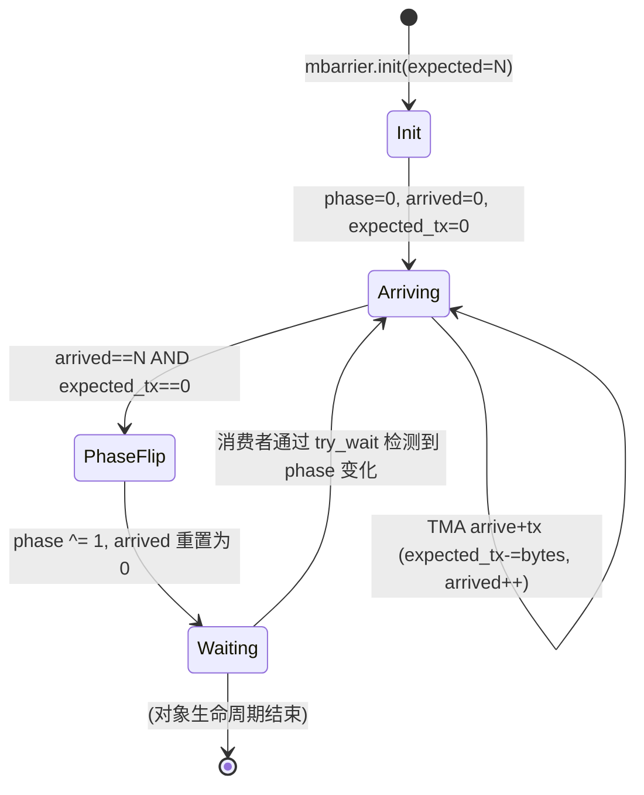

# 10 · mbarrier 异步屏障

> **mbarrier 是存储在 SMEM 中的 64-bit 硬件屏障对象,通过 phase 翻转机制协调异步操作(TMA、wgmma、cp.async)与消费者线程之间的同步,比 `__syncthreads()` 更灵活、更细粒度。**

## 1. 是什么 / 为什么有它

传统的 `__syncthreads()` 是 CTA 内所有线程的全局屏障:所有线程到达后一起通过,没有"谁通知谁完成"的概念。Hopper 引入的异步操作(TMA、wgmma、cp.async)是由硬件单元后台执行的,不占用线程时间——但需要一种机制让消费者线程"知道数据已就绪"。

`mbarrier`(memory barrier)是 Hopper 为此设计的轻量级同步原语:

- **存储位置:** SMEM 中的 8 字节对齐 64-bit 整数
- **内容:** 内部编码 phase 位、arrived count、expected count、expected_tx 字节数
- **语义:** 当 arrived count 达到 expected count 且 expected_tx 字节数被 TMA/cp.async 减至 0 时,phase 位翻转,所有 `try_wait` 等待者被唤醒

mbarrier 的设计使 producer(TMA 引擎或 producer warp)与 consumer(warp-group)之间可以通过纯 SMEM 通信完成同步,无需走 GMEM 或主机介入,同步开销约 5 cycle。

**与 `__syncthreads()` 的关键区别:**
- `__syncthreads()` 是线程屏障:所有线程必须执行到调用点才能继续
- `mbarrier` 是事件屏障:TMA/wgmma 等硬件单元可以"arrive"触发 phase 翻转,线程可提前继续其他工作
- `mbarrier` 支持动态的 expected_tx 字节计数,专门服务于 TMA 的异步 DMA 完成通知

**mbarrier 与 cp.async 的关系:**
前代(Ampere)的异步拷贝使用 `cp.async.wait_group N` 等待流水线组。Hopper 推荐用 mbarrier 替代,因为 mbarrier 支持与 TMA、wgmma 更精确的字节级同步,且 mbarrier 的 phase 机制允许无限循环复用而不需要重置。`cp.async.bulk.commit_group` / `wait_group` 在 TMA store 方向仍然适用。

**thread scope:** mbarrier 支持三种作用域:
- `shared`(默认):CTA 内部同步,arrive/wait 操作只在本 CTA SMEM 生效
- `shared::cluster`:跨 cluster 内任意 CTA 可 arrive(见第 11 章)
- 没有 global scope —— 跨 CTA 的全局同步应使用 CUDA cooperative groups 的 grid barrier

## 2. 硬件视角(微架构细节)

mbarrier 对象是一个 64-bit SMEM 字,由 SM 内的 mbarrier 控制器硬件管理。当 TMA 引擎完成写入时,硬件自动对目标 mbarrier 执行原子减(expected_tx 计数)和 arrive 操作。

mbarrier 的状态转换:



**phase 翻转机制:**
mbarrier 维护一个 1-bit phase 字段,初始为 0。每次所有 expected arrive 满足后翻转(0→1 或 1→0)。消费者线程调用 `mbarrier.try_wait` 时携带期望的 phase 值:若当前 phase 已翻转(不等于期望值),说明同步完成,指令返回成功。这个设计允许 mbarrier 被循环复用——奇数次循环等待 phase=1,偶数次等待 phase=0,无需重新初始化。

**expected_tx 字节计数器:**
TMA 的异步 DMA 写入量是变动的(取决于 tile 大小和边界裁剪)。`mbarrier.expect_tx` 在发射 TMA 前预先告知 mbarrier "本次 DMA 将写入 N 字节",TMA 完成后通过 `arrive+tx(N)` 减少 expected_tx。只有当 expected_tx 归零且 arrived count 达到 expected,phase 才翻转——这保证了 DMA 字节数的精确匹配。

## 3. CUDA 编程接口

**PTX 指令集(mbarrier 全部操作):**

```ptx
// 1. 初始化:设置 expected arrive count
// N: 预期的 arrive 次数(通常等于参与生产的线程数 + TMA 次数)
mbarrier.init.shared.b64 [%mbar], 1;        // expected = 1

// 2. arrive:生产者线程到达,返回当前 token(含 phase 信息)
mbarrier.arrive.shared.b64 %token, [%mbar]; // arrived++, 返回 token

// 3. expect_tx:声明本次异步操作将写入的字节数
// 必须在发射 TMA 前调用
mbarrier.expect_tx.shared.b64 [%mbar], %bytes; // expected_tx += bytes

// 4. try_wait:非阻塞轮询,等待 phase 翻转
// %parity: 当前期望的 phase (0 或 1)
// %timeout: 超时 cycle 数(建议设 10000,硬件自动重试)
mbarrier.try_wait.parity.shared.b64 %ok, [%mbar], %parity, 10;
// %ok = 1 表示 phase 已翻转,数据就绪

// 5. arrive_drop:线程不参与 mbarrier 但需要减少 expected count
mbarrier.arrive_drop.shared.b64 %token, [%mbar];

// 6. invalidate:使 mbarrier 失效(可选,用于安全清理)
mbarrier.inval.shared.b64 [%mbar];
```

**跨 Cluster 的 mbarrier(分布式屏障,见第 11 章):**

```ptx
// 访问其他 CTA 的 mbarrier(DSMEM 地址)
// %remote_mbar: 通过 mapa.shared::cluster 转换的远端 mbarrier 地址
mbarrier.arrive.shared::cluster.b64 %token, [%remote_mbar];
```

**C++ 高层封装:`<cuda/barrier>`**

```cpp
#include <cuda/barrier>
using cuda::barrier;

// SMEM 中声明 barrier 对象
__shared__ barrier<cuda::thread_scope_block> bar;

// 初始化(expected = thread count)
init(&bar, blockDim.x);

// producer 线程 arrive
auto token = bar.arrive();

// consumer 线程 wait(阻塞直到所有 arrive 完成)
bar.wait(std::move(token));
```

C++ `<cuda/barrier>` 是对 PTX mbarrier 的类型安全封装,适用于不需要 TMA expected_tx 的场景。需要 TMA 集成时,应降级到 PTX 直接操作。

## 4. 关键性能指标

**mbarrier 操作延迟:**
- `mbarrier.init`:约 10 cycle(初始化 SMEM 写)
- `mbarrier.arrive`:约 5 cycle
- `mbarrier.expect_tx`:约 5 cycle
- `mbarrier.try_wait`(立即命中):约 5 cycle
- `mbarrier.try_wait`(等待中,每次重试):约 10 cycle

**mbarrier 密度上限:**
每个 SM 的 SMEM 中可以放置多个 mbarrier,上限受 SMEM 容量限制。典型双缓冲 pipeline 需要 2 个 mbarrier(各 8 字节),三级缓冲需 3 个。Hopper SM 支持任意数量 mbarrier,无硬件数量上限(只受 SMEM 空间约束)。

**phase 翻转频率:** mbarrier 每次 pipeline 迭代翻转一次 phase。若 pipeline 迭代速度极快(每几十 cycle 一次),mbarrier 操作的固定开销可能成为明显比例。实际 GEMM pipeline 中 TMA 和 wgmma 延迟远大于 mbarrier 开销,因此 mbarrier 通常不是瓶颈。

**try_wait 的 timeout 参数:** PTX `mbarrier.try_wait.parity` 的最后一个参数是超时 cycle 数。若在超时前 phase 未翻转,指令以失败返回(%ok=0),调用者可以继续执行其他工作或再次重试。这使 warp 在等待 TMA 期间不完全阻塞——可以执行一些不依赖 SMEM 数据的计算。超时设为 0 时相当于立即检查(非阻塞轮询),设为 ~10000 cycle 时约等于 TMA 最坏延迟(HBM miss)。

**与 __syncthreads() 的开销对比:**
`__syncthreads()` 需要 SM 内所有活跃 warp 到达同一点,实际延迟与 CTA 大小和当前 occupancy 相关,约 20–100 cycle。`mbarrier.try_wait` 的单次检查约 5–10 cycle,且不阻塞不相关的 warp。

## 5. 代码示例

下面是一个完整的 TMA + mbarrier producer/consumer 双缓冲框架(PTX 层次):

```ptx
// ---- 初始化 ----
// 假设 threadIdx.x == 0 负责 TMA 发射和 mbarrier 管理
// 双缓冲:smem_a[0] 和 smem_a[1],mbar[0] 和 mbar[1]

mbarrier.init.shared.b64 [mbar0], 1;   // expected arrive = 1 (TMA 完成)
mbarrier.init.shared.b64 [mbar1], 1;

// ---- pipeline 预热:发射第 0 块 ----
mbarrier.expect_tx.shared.b64 [mbar0], %tile_bytes;  // 声明 TMA 字节数
cp.async.bulk.tensor.2d.global.shared::cluster.tile.mbarrier::complete_tx::bytes
    [smem_a0], [tensor_map, {0, 0}], [mbar0];        // 异步 load tile 0

// ---- 主循环 ----
// 迭代 k=1,2,...:计算 k-1,同时预取 k
// 此处以 k=1 为例:
//   smem_a0 含 tile 0(已到),smem_a1 正在加载 tile 1

// 等待 tile 0 就绪 (phase=0 → phase=1 翻转)
WAIT0:
mbarrier.try_wait.parity.shared.b64 %ok, [mbar0], 0, 10;
@!%ok bra WAIT0;

// 发射 wgmma 使用 smem_a0
wgmma.fence.sync.aligned;
wgmma.mma_async.sync.aligned.m64n128k16.f32.f16.f16
    {%f0,...,%f63}, desc_a0, desc_b, 1, 1, 1, 0, 0;
wgmma.commit_group.sync.aligned;

// 同时预取 tile 1 到 smem_a1
mbarrier.expect_tx.shared.b64 [mbar1], %tile_bytes;
cp.async.bulk.tensor.2d.global.shared::cluster.tile.mbarrier::complete_tx::bytes
    [smem_a1], [tensor_map, {0, 16}], [mbar1];   // tile 1(列偏移 16)

// 等待 wgmma 完成(tile 0)
wgmma.wait_group.sync.aligned 0;

// (循环翻转 buf0/buf1,parity 0/1 交替)
```

注意事项:
1. `mbarrier.expect_tx` 必须在对应 `cp.async.bulk.tensor` 之前调用
2. `mbarrier.try_wait` 的 parity 参数与当前 phase 一致表示"等待下一次翻转"
3. mbarrier 被复用时,下一轮使用 parity 取反:第一次等待 parity=0,第二次等待 parity=1

## 6. 实测手段

**NSight Compute 关键指标:**

```bash
ncu --metrics \
  smsp__inst_executed_op_mbar.sum,\
  smsp__warp_cycles_per_issue_stall_mio_throttle.avg,\
  smsp__warp_cycles_per_issue_stall_wait.avg \
  ./pipeline_app
```

| Metric | 含义 |
|---|---|
| `smsp__inst_executed_op_mbar.sum` | mbarrier 指令总执行数 |
| `smsp__warp_cycles_per_issue_stall_wait.avg` | warp 因等待(含 mbarrier)的停顿 cycle 平均值 |
| `smsp__warp_cycles_per_issue_stall_mio_throttle.avg` | SMEM/mbarrier 访问节流导致的停顿 |

若 `stall_wait` 数值异常高,说明 mbarrier 等待时间占主导——通常意味着双缓冲 SMEM 不足或 TMA 延迟大于 wgmma 延迟,需增加 pipeline 深度。

## 7. 常见反模式

**1. expect_tx 字节数与实际 TMA 搬运量不匹配导致死锁**
`mbarrier.expect_tx` 设置的字节数必须与 TMA 实际写入 SMEM 的字节数完全一致。若 TMA 边界裁剪导致实际写入量少于预设值(比如 tile 超出矩阵边界),TMA 的 `arrive+tx` 减少的字节数不足以归零 expected_tx,mbarrier 永远不翻转,所有 `try_wait` 永久阻塞。解决方案:使用 `CU_TENSOR_MAP_FLOAT_OOB_FILL_NAN_REQUEST` 让 TMA 将越界部分填 0 并按完整 tile 大小 arrive。

**2. 复用 mbarrier 时忘记 phase 反转,导致 try_wait 立即返回成功**
mbarrier 每次 phase 翻转后,下一轮使用必须等待 parity 取反。若代码中 parity 参数每次都传 0,第二次循环时 phase 已经是 1(上一次翻转后),`try_wait parity=0` 会立即返回成功(误认为数据就绪),实际 TMA 尚未完成,wgmma 读到旧数据。

**3. 跨 cluster 使用 mbarrier.shared 而非 mbarrier.shared::cluster**
若 TMA 的目标是同一 cluster 的另一个 CTA 的 SMEM(DSMEM),对应的 mbarrier 也在那个 CTA 的 SMEM 中,arrive 指令必须用 `mbarrier.arrive.shared::cluster` 才能跨 CTA 访问。误用 `mbarrier.arrive.shared` 只能访问本 CTA 的 SMEM,产生错误的 arrive 或内存访问越界。

**4. mbarrier.init 在所有线程中并发执行导致重复初始化**
若 CTA 内所有 128 线程都执行 `mbarrier.init`,SMEM 中的 mbarrier 对象被写入 128 次,最终值未定义(SMEM 写冲突)。正确做法:只由 `threadIdx.x == 0` 的单一线程执行 `mbarrier.init`,然后用 `__syncthreads()` 或 `barrier.cluster` 确保其他线程在 init 完成后才开始使用。

**5. mbarrier 与 __syncthreads 混用时顺序错乱**
在 TMA 等待(mbarrier.try_wait)前执行 `__syncthreads()` 会导致所有线程等到同一点,包括尚未发射 TMA 的生产者线程——产生逻辑死锁。正确的 pipeline 模式是用 mbarrier 替代 `__syncthreads()` 管理异步同步,而 `__syncthreads()` 只用于 CTA 内部的阶段分隔。

## 8. 延伸阅读

- PTX ISA §9.7.12 — `mbarrier`(init/arrive/expect_tx/try_wait/arrive_drop 完整语义)
- Hopper Architecture Whitepaper — §Asynchronous Pipeline Barrier
- libcu++ `<cuda/barrier>` API 文档 — https://nvidia.github.io/cccl/libcudacxx/
- CUTLASS 3.x `include/cutlass/pipeline/pipeline.hpp`
  — https://github.com/NVIDIA/cutlass(生产级 mbarrier pipeline 封装)
- developer.nvidia.com/blog/nvidia-hopper-architecture-in-depth(mbarrier 机制图解)
