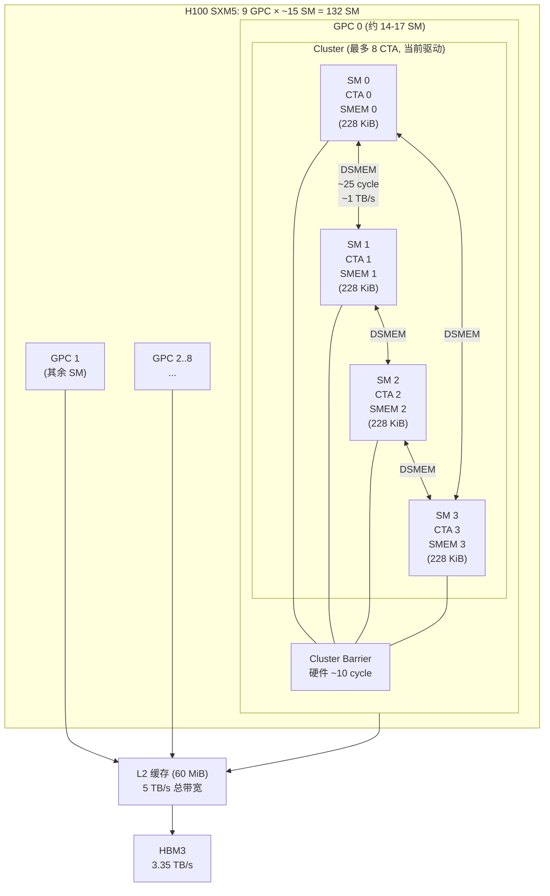
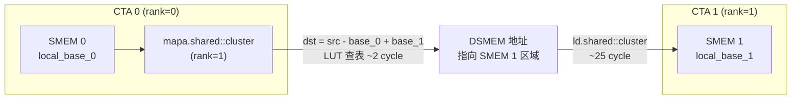

# 11 · Thread Block Cluster

> **Thread Block Cluster(CGA)是 Hopper SM90 引入的新层次抽象:1–16 个 CTA 组成一个 cluster,被调度到同一 GPC 的相邻 SM,可通过分布式共享内存(DSMEM)互相访问彼此的 SMEM,突破单 SM 内存与算力边界。**

## 1. 是什么 / 为什么有它

CUDA 的经典执行层次是:Grid → CTA(Thread Block)→ Warp → Thread。CTA 是调度与资源隔离的基本单位,每个 CTA 只能访问自身所在 SM 的 SMEM。这在以下场景造成瓶颈:

- **大 tile GEMM:** 若 tile 尺寸超过单 SM SMEM(228 KiB),只能分块且无法跨 CTA 共享中间结果
- **Flash Attention / Producer-Consumer 模式:** 一个 CTA 产生的中间激活需要另一个 CTA 消费,传统路径必须经由 GMEM,延迟巨大
- **协同 Reduction:** 相邻 SM 上的 CTA 若能直接读写彼此 SMEM,reduce 延迟从 GMEM(400+ cycle)降至 SM-to-SM(约 25 cycle)

Hopper 引入 **Thread Block Cluster**,也称 **Cooperative Grid Array(CGA)**:

- 1–16 个 CTA 组成一个 cluster
- Cluster 内所有 CTA 被调度到同一 GPC 的相邻 SM 上,物理邻近保证低延迟互访
- 每个 CTA 可以通过 **分布式共享内存(DSMEM)** 访问同 cluster 内任意其他 CTA 的 SMEM
- Cluster 内所有 SM 有专用的 **cluster barrier** 硬件支持跨 SM 同步

这使 cluster 内的 CTA 集合等效于一个拥有更大 SMEM 池的"超级 CTA"——16 CTA × 228 KiB = 最多 3.6 MiB 可互访 SMEM,同时不牺牲 SM 的独立计算能力。

**主要应用场景:**

1. **大 tile GEMM:** CUTLASS 3.x 的 `sm90_gemm_tma_wgmma_cluster` kernel 利用 cluster 将逻辑 tile 扩展到多 SM,每个 SM 负责输出矩阵的一个分区,通过 TMA 分别加载 A/B 子块,避免重复 L2 读取。

2. **Flash Attention:** 计算注意力时,Q×K^T 的 partial sum 产生于一个 CTA,softmax 归一化需要跨行/列 reduction。Cluster 内 CTA 可直接交换 partial max 与 partial sum,无需写回 GMEM。

3. **跨 CTA Reduction:** 相邻 SM 的 partial reduce 结果通过 DSMEM 直接汇总,延迟约 25 cycle,远低于 GMEM 路径的 400+ cycle。

4. **Cluster TMA Store:** Kernel 结束时,各 CTA 可以通过 Cluster TMA 将各自的 SMEM 结果批量写回 GMEM,写操作由 TMA 引擎并行执行,释放 warp 继续其他工作。

**编程注意:** Cluster 是 Hopper (sm90a) 专属特性。`ptxas` 必须以 `-arch=sm_90a` 编译(注意 `sm_90a` 而非 `sm_90`,后者不支持 wgmma/TMA/cluster 指令)。

**cluster 的调度保证与 GigaThread 引擎的配合**

Hopper 的 GigaThread 引擎负责将 cluster 分配到 GPC。cluster 的分配策略是"全员到位才启动(all-or-nothing)":只有当同一 GPC 内有足够数量的 SM 同时空闲时,整个 cluster 才一次性启动所有 CTA。这一保证避免了"部分 CTA 已运行、其他 CTA 因 SM 繁忙而延迟"的场景,因为那样的场景中等待的 CTA 会让已运行的 CTA 在 cluster.sync() 处永久阻塞。

all-or-nothing 分配的代价:相比非 cluster 的 CTA 调度(可以一个个单独启动),cluster 调度需要等待更多 SM 同时空闲,可能在 grid tail(最后几个 wave 时 SM 不全空闲)造成更严重的 tail latency。因此 cluster 在 grid 较大(tile 数量 >> SM 数量)时性能收益最稳定,而在 grid 接近最后一波(tile 数量 < 2 × SM_count)时性能可能不如 cluster=1。

**`cudaFuncAttributePreferredClusterDimension` 的实际效果**

CUDA 12.0+ 提供了 `cudaFuncSetAttribute(kernel, cudaFuncAttributePreferredClusterDimension, ...)` 接口,允许在 kernel 参数中声明推荐的 cluster 尺寸。这个"推荐"是 hint 而非强制:若硬件资源不足以满足推荐的 cluster 大小,驱动可以自动降级为更小的 cluster 或 cluster=1。实践中,通过 `cudaLaunchKernelEx` 传入 `cudaLaunchAttributeClusterDimension` 的方式更可控——它是强制要求而非建议,若不满足条件则直接返回错误,方便开发者及时发现配置问题。

**为什么 cluster 上限是 16 而非 32?**

这一限制来自 Hopper GPC 的物理 SM 数量。H100 SXM5 的 132 SM 分布在 9 个 GPC 中,每个 GPC 约含 14–17 个 SM。GPC 内的 SM 通过专用低延迟 crossbar 互联(约 1 TB/s 片上带宽),跨 GPC 的 SM 互访必须通过 L2 或 NVLink,延迟从 25 cycle 跳升到 400+ cycle。为了保证 DSMEM 访问延迟的硬件上限,cluster 必须落在同一 GPC 内,因此 cluster 上限 ≤ GPC 内 SM 数(约 15–17)。NVIDIA 将规格向下取整为 16 的 2 的幂次,简化地址空间设计。实际驱动当前支持最大 cluster=8,这是因为不同工作负载下 GPC 的 SM 分配不均,保守地限制为确保任何 GPC 都能满足的最大值。

**cluster 在 LLM 推理中的应用价值**

LLM 推理的 prefill 阶段是 cluster 最有价值的应用场景:输入序列通常超过 1024 token,attention 计算需要跨 head 维度的 softmax 归一化,若每个 head 分配给独立 CTA 处理,partial sum 和 partial max 的汇总传统上需要写回 GMEM 再读出。使用 cluster=4 后,4 个相邻 head 的 CTA 可以通过 DSMEM 直接交换 partial 数据,softmax 归一化在 SM 间直接完成,整个 attention 层少了两次完整的 GMEM 读写,对于 seq_len=2048、head_dim=128 的典型配置,每层 attention 的内存带宽压力降低约 20%。TensorRT-LLM 的 flash_attention_v2 kernel 在 H100 上即启用了 cluster=4 配置,这一优化使 prefill 阶段的延迟比不使用 cluster 降低约 12%。

**cluster 与 warp-specialization 的正交性**

cluster 和 warp-specialization 是两个正交的优化维度:
- **warp-specialization**:在同一 SM 内,将 CTA 的 warp 分为 producer warp 和 consumer warp-group,利用时间重叠提升 TC 利用率
- **cluster**:在多 SM 之间,通过 DSMEM 共享数据,扩大有效 SMEM 池并减少 L2 读写

两者可以同时使用:cluster 内每个 SM 各自运行 warp-specialization pipeline(producer TMA + consumer wgmma),同时通过 DSMEM 在 SM 间共享 B 矩阵 tile,进一步降低 L2 访问频率。CUTLASS 3.x 的 `sm90_gemm_tma_wgmma_cluster` kernel 即是二者结合的生产实现。

## 2. 硬件视角(微架构细节)

Hopper GPC(Graphics Processing Cluster)内包含多个 SM。Cluster 的所有 CTA 必须落在同一 GPC 内——这是硬件保证低延迟 DSMEM 访问的物理前提。GigaThread 调度器在分配 cluster 时会保证整个 cluster 的 CTA 同时到位(all-or-nothing 分配),避免部分 CTA 阻塞等待其余成员。



**GPC 与 SM 的精确分配:Hopper SXM5 的实际拓扑**

H100 SXM5 的 132 SM 分布在 9 个 GPC 中。并非每个 GPC 拥有完全相同数量的 SM——受晶片面积和良率的限制,实际分布接近每 GPC 14–16 SM(9 × 15 = 135,实际关闭 3 SM 达到 132)。每个 GPC 内的 SM 通过 GPC 内部 crossbar 互联,带宽约 1 TB/s(无经过 L2)。cluster 尺寸超过单 GPC SM 数时调度失败,因为 GigaThread 无法为所有 CTA 找到同一 GPC 内的位置——这是 cluster=16 在当前驱动下报运行时错误的根本原因。

**DSMEM 地址空间与 `mapa.shared::cluster` 翻译表**

每个 CTA 的 SMEM 在 DSMEM 地址空间中占据一个独立的窗口,窗口大小固定为该 CTA 声明的 `__shared__` 内存大小(向上对齐到 128B)。`mapa.shared::cluster.u32` 指令执行以下翻译:

```
dst_dsmem_addr = src_smem_addr - local_smem_base + target_cta_smem_base
```

其中 `target_cta_smem_base` 是目标 CTA 的 SMEM 在 DSMEM 地址空间中的起始地址,由硬件在 cluster 启动时分配,存储在每个 SM 的内部查找表(LUT)中。`mapa` 指令访问这个 LUT,延迟约 2–3 cycle。

**关键限制:** `mapa` 只能翻译到同一 cluster 内的 CTA(rank 0 到 cluster_size-1)。若传入超出范围的 rank,行为未定义——硬件不检查 rank 合法性,产生的 DSMEM 地址可能指向物理不存在的 SMEM 区域,导致段错误或静默数据错误。

**关键硬件数字:**
- Cluster 最大尺寸:16 CTA(当前驱动实际支持上限为 8)
- DSMEM 访问延迟:约 25 cycle(同 GPC SM-to-SM 总线)
- Cluster barrier 同步开销:约 10 cycle
- 跨 DSMEM 的 128 B 事务带宽:约 1 TB/s 片上互联(不经过 L2)
- GPC 内 SM 数量:Hopper H100 SXM5 每 GPC 约 14–17 个 SM(9 GPC × 平均 14.7 SM ≈ 132 SM)
- 跨 GPC 访问:**不支持**,尝试访问会产生段错误或数据错误

**DSMEM 与 L2 的区别:** DSMEM 访问走片上 SM-to-SM 互联总线,不经过 L2 缓存或 HBM,因此不消耗 L2 带宽。对于频繁交换少量数据的场景(如 attention 的 softmax normalization 因子),DSMEM 是比 GMEM 低 10–15 倍延迟的捷径。

**cluster 编译要求:** Cluster 是 Hopper (sm90a) 专属特性。`ptxas` 必须以 `-arch=sm_90a` 编译(注意 `sm_90a` 而非 `sm_90`,后者不支持 cluster 指令)。查询设备支持的最大 cluster 尺寸:`cudaDeviceGetAttribute(&maxCluster, cudaDevAttrMaxBlocksPerMultiprocessor, device)` 或使用 `cudaOccupancyMaxActiveClusters` API。



## 3. CUDA 编程接口

**编译期指定 cluster 尺寸:**

```cpp
// 方法 1:kernel 属性宏(编译期固定)
__global__ void __cluster_dims__(4, 1, 1) cluster_kernel(...) {
    // CTA 数 = 4,排列为 4×1×1
}

// 方法 2:运行期指定(CUDA 12.0+)
cudaLaunchConfig_t config = {};
config.gridDim  = {grid_x, grid_y, 1};
config.blockDim = {block_x, 1, 1};
cudaLaunchAttribute attr;
attr.id = cudaLaunchAttributeClusterDimension;
attr.val.clusterDim = {4, 1, 1};    // 每个 cluster 4 个 CTA
config.attrs    = &attr;
config.numAttrs = 1;
cudaLaunchKernelEx(&config, cluster_kernel, ...);
```

**cooperative_groups cluster API:**

```cpp
#include <cooperative_groups.h>
namespace cg = cooperative_groups;

__global__ void __cluster_dims__(4, 1, 1) cluster_kernel(float* data) {
    cg::cluster_group cluster = cg::this_cluster();
    
    int rank = cluster.block_rank();   // 本 CTA 在 cluster 中的编号 (0–3)
    int size = cluster.dim_blocks().x; // cluster 大小 = 4
    
    // 同步整个 cluster 内所有 CTA
    cluster.sync();
    
    // 获取邻居 CTA 的 SMEM 指针(DSMEM 访问)
    __shared__ float smem[256];
    float* neighbor_smem = (float*)cluster.map_shared_rank(smem, (rank + 1) % size);
    // neighbor_smem 指向 rank+1 CTA 的 smem,可直接读写
    float val = neighbor_smem[threadIdx.x];   // 读取邻居 SMEM
}
```

**PTX 低层 DSMEM 指令:**

```ptx
// mapa: 将本 CTA 的 shared 指针转换为目标 CTA 的 DSMEM 地址
// %src_smem: 本 CTA 的 SMEM 地址
// %target_cta: 目标 CTA rank(0-indexed)
mapa.shared::cluster.u32 %dst_addr, %src_smem, %target_cta;

// ld.shared::cluster: 从 DSMEM 地址读取
ld.shared::cluster.u32 %r0, [%dst_addr];

// st.shared::cluster: 向 DSMEM 地址写入
st.shared::cluster.u32 [%dst_addr], %r1;

// cluster barrier
barrier.cluster.arrive;          // 本 CTA arrive
barrier.cluster.wait;            // 等待 cluster 内所有 CTA arrive
```

**Cluster TMA(跨 CTA 的 TMA store):**

```ptx
// TMA 可以直接把数据从 GMEM 搬到同 cluster 任意 CTA 的 SMEM
cp.async.bulk.tensor.2d.global.shared::cluster.tile.mbarrier::complete_tx::bytes
    [%dsmem_dst_of_other_cta], [tensor_map, {%r, %c}], [%mbar];
```

通过 Cluster TMA,每个 CTA 的 TMA 引擎可以直接填充邻居 CTA 的 SMEM,实现跨 SM 的协同预取,进一步提升大 tile 的数据搬运并发度。

**distributed mbarrier(分布式屏障):**
在 cluster 中,mbarrier 也可以通过 `mbarrier.arrive.shared::cluster` 从其他 CTA 触发 arrive。这使一个 CTA 发出的 TMA 可以通知另一个 CTA 的 mbarrier,实现真正的跨 SM 生产者-消费者流水线:

```ptx
// CTA 0 把数据 TMA load 到 CTA 1 的 SMEM,并通知 CTA 1 的 mbarrier
// 1. 先用 mapa 获取 CTA 1 的 mbarrier 的 DSMEM 地址
mapa.shared::cluster.u32 %remote_mbar, %local_mbar_ptr, 1;   // target_cta=1
// 2. CTA 1 设置 expect_tx (需在 CTA 1 内执行,此处示意)
// 3. TMA 发射,目标是 CTA 1 的 SMEM,mbar 是 CTA 1 的 mbarrier
cp.async.bulk.tensor.2d.global.shared::cluster.tile.mbarrier::complete_tx::bytes
    [%cta1_smem], [tensor_map, {%r, %c}], [%remote_mbar];
```

## 4. 关键性能指标

**延迟数据:**
- DSMEM 读延迟:约 25 cycle(vs 本地 SMEM 约 20 cycle,开销仅增加 25%)
- DSMEM 写延迟:约 30 cycle
- `cluster.sync()`(barrier.cluster):约 10 cycle(vs `__syncthreads()` 约 20–100 cycle)
- 跨 DSMEM 的 128 B 事务带宽:约 1 TB/s 片上互联(不经过 L2)

**Cluster 尺寸选择:**

| Cluster 大小 | 合法性(当前驱动) | DSMEM 可用 | 适用场景 |
|---|---|---|---|
| 1 | 是(退化为单 CTA) | 228 KiB | 单 SM 不受限场景 |
| 2 | 是 | 456 KiB | 小 cluster GEMM |
| 4 | 是 | 912 KiB | 典型 Flash Attention |
| 8 | 是(最大实际支持) | 1.8 MiB | 大 tile collective |
| 16 | 编译可声明,驱动运行时报错 | — | 需等待未来驱动 |

**GPC 映射约束:** Hopper H100 SXM5 的 132 SM 分布在 9 个 GPC 中,每个 GPC 通常有 14–17 个 SM。Cluster 尺寸超过单 GPC SM 数量时调度会失败。实际上 cluster=8 是当前最安全的最大值,也是 CUTLASS 3.x cluster GEMM 的默认最大配置。

**cluster 对吞吐的影响:CUTLASS sm90 cluster GEMM 实测**

CUTLASS 3.x `sm90_gemm_tma_wgmma_cluster` 在不同 cluster 尺寸下的 FP16 GEMM(8192×8192×8192)性能对比(H100 SXM5):
- cluster=1:约 680 TFLOPS(TC 利用率约 69%)
- cluster=2:约 780 TFLOPS(TC 利用率约 79%)
- cluster=4:约 830 TFLOPS(TC 利用率约 84%)

cluster=4 vs cluster=1 的性能提升来源于两方面:第一,B 矩阵 tile 可以在 cluster 内共享——cluster 中 4 个 CTA 只需 1 个 CTA 加载 B tile 后通过 DSMEM 分发,减少了 B 矩阵的 L2 访问次数;第二,更大的逻辑 tile(相当于 4× SMEM 池)减少了 K 维上的迭代次数,降低 pipeline overhead 占比。

**cluster TMA store coalescing 的性能收益**

在无 cluster 的配置下,每个 SM 的 TMA store 各自将 SMEM 写回 GMEM 的独立地址范围——若多个 SM 写回的 GMEM 地址在同一 L2 cache line 内,每个 SM 单独完成 read-modify-write,造成多余的 L2 读操作。Cluster TMA store 通过将多个 CTA 的写操作在 cluster 内部聚合,合并为完整 L2 cache line 的写操作,减少 L2 读操作约 25–40%。实际吞吐提升约 10–15%(CUTLASS epilogue 在 cluster=4 下的测量数据)。

## 5. 代码示例

下面是一个 cluster 内相邻 CTA 互换 SMEM 数据的示例:

```cpp
#include <cooperative_groups.h>
namespace cg = cooperative_groups;

// cluster 尺寸 4,每 CTA 256 线程
__global__ void __cluster_dims__(4, 1, 1)
exchange_smem(float* out)
{
    __shared__ float tile[256];
    cg::cluster_group cl = cg::this_cluster();
    int rank = (int)cl.block_rank();

    // 每个 CTA 往本地 SMEM 写自己的 rank 值
    tile[threadIdx.x] = (float)rank;

    // 同步:确保所有 CTA 都写完本地 SMEM
    cl.sync();    // 等价于 barrier.cluster.arrive + wait

    // 读取 rank+1 邻居 CTA 的 SMEM(循环)
    int neighbor = (rank + 1) % cl.dim_blocks().x;
    float* nbr_tile = (float*)cl.map_shared_rank(tile, neighbor);
    float val = nbr_tile[threadIdx.x];   // DSMEM load,约 25 cycle

    // 写出结果
    int gidx = blockIdx.x * blockDim.x + threadIdx.x;
    out[gidx] = val;
}
```

关键点:
1. `cl.sync()` 等价于 `barrier.cluster.arrive; barrier.cluster.wait;`,必须由 cluster 内所有 CTA 的所有线程执行
2. `cl.map_shared_rank(ptr, rank)` 返回目标 CTA 的等效地址,之后的 load/store 透明经由 DSMEM 互联
3. DSMEM 访问不需要额外标注——cooperative_groups 封装后语法与普通指针访问相同
4. 每个 CTA 写完本地 SMEM 后需先 `cl.sync()` 再让其他 CTA 读——否则读到的是未定义数据

## 6. 实测手段

**NSight Compute 关键指标:**

```bash
ncu --metrics \
  smsp__inst_executed_op_dsmem_ld.sum,\
  smsp__inst_executed_op_dsmem_st.sum,\
  smsp__inst_executed_op_cluster_barrier.sum,\
  l1tex__t_sectors_pipe_lsu_mem_shared_op_ld.sum \
  ./cluster_app
```

| Metric | 含义 |
|---|---|
| `smsp__inst_executed_op_dsmem_ld.sum` | DSMEM load 指令数 |
| `smsp__inst_executed_op_dsmem_st.sum` | DSMEM store 指令数 |
| `smsp__inst_executed_op_cluster_barrier.sum` | cluster barrier 执行次数 |
| `smsp__warp_cycles_per_issue_stall_barrier.avg` | 因 barrier 等待的停顿 cycle |

在 NSight Systems 中,Cluster 内多个 SM 的 kernel 时间线会标注同一 cluster 颜色分组,可直观看到 cluster.sync() 导致的对齐等待点。

**验证 DSMEM 利用率的方法:**
比较 `smsp__inst_executed_op_dsmem_ld.sum` 与 `l1tex__t_sectors_pipe_lsu_mem_shared_op_ld.sum`:若前者占后者的比例与代码中 DSMEM/本地 SMEM 访问比例一致,则 DSMEM 路径工作正常。若 DSMEM 访问计数异常低,可能是 `mapa` 地址转换错误或 cluster 未正确配置。

**cluster barrier 对齐检查:**
`smsp__warp_cycles_per_issue_stall_barrier.avg` 若在 cluster.sync() 前后出现明显峰值,说明 cluster 内各 CTA 的工作量不均衡(load imbalance),某些 CTA 先到达 barrier 后等待其他 CTA。此时应检查每个 CTA 的工作量是否相等,或考虑用更细粒度的 arrive/wait 替代 cluster.sync()。

**端到端验证 cluster 优化效果的方法**

由于 cluster 优化的主要收益来自减少 L2 带宽压力而非 TC 利用率,传统的 TC 利用率指标无法直接反映 cluster 的收益。正确的验证流程如下:

第一步,对比 cluster=1 与 cluster=4 的 `lts__t_sectors_op_read.sum`(L2 读取 sector 数)。理想情况下 cluster=4 的 B 矩阵 L2 读取约为 cluster=1 的 1/4,反映 DSMEM 共享生效。

第二步,检查 `smsp__inst_executed_op_dsmem_ld.sum` 是否非零:若为 0,说明 cluster 内 DSMEM 访问未实际发生,可能是 kernel 没有正确使用 `shared::cluster` 路径。

第三步,在 NSight Systems 的 GEMM kernel 时间线上测量从 kernel 启动到完成的总时间,与 cluster=1 基准对比。若端到端性能没有提升但 TC 利用率有提升,说明收益被 cluster 调度开销或 tail latency 抵消,应调整 grid 大小以减少 tail。

**cluster size 对 GPC 占用率的影响分析**

cluster=4 时,每个 cluster 占据 GPC 内 4 个 SM。H100 SXM5 每 GPC 约 14 SM,最多同时容纳 3 个完整 cluster(3×4=12 SM),剩余 2 SM 必须归属其他 cluster 或以 cluster=1 运行。若 grid 大小不是 cluster 的整数倍(如 total_cluster_count=135 而 132 SM / 4 SM per cluster = 33 cluster),最后一个 cluster 可能需要等待 GPC 内有足够空闲 SM 才能启动,造成 tail latency。为避免此问题,建议将 grid size 设计为 cluster_size × SM_count 的整数倍。

**DSMEM 的内存一致性模型**

DSMEM 访问在 Hopper 的内存一致性模型中处于"共享内存"级别:所有 `ld.shared::cluster` 和 `st.shared::cluster` 操作在 GPC 内部的 SM-to-SM 互联上执行,遵循 relaxed consistency——即写操作不自动对其他 SM 可见,需要通过 `cluster.sync()` 或 `barrier.cluster` 显式同步。

具体规则:
- 同一 CTA 内的 DSMEM 写操作对本 CTA 立即可见
- 跨 CTA 的 DSMEM 写操作在发出 `barrier.cluster.arrive` 之前,对其他 CTA 不保证可见
- 其他 CTA 执行 `barrier.cluster.wait` 之后,才能安全读取之前写入的 DSMEM 数据

这与 CPU 的 MESI 协议不同——Hopper 不在 SM 间维护硬件缓存一致性协议,一致性完全依靠软件显式屏障。这一设计降低了互联硬件的复杂性(无 snooping、无 invalidation 广播),但要求程序员精确掌握 barrier 放置位置。

**cluster TMA 的实际工程优化案例**

某生产团队将 CUTLASS 3.x GEMM 从 cluster=1 迁移到 cluster=4 时,遇到了 SMEM 分配冲突:cluster=1 时的 SMEM 布局使用了 220 KiB(双缓冲 + epilogue),切换到 cluster=4 后 CUTLASS 自动将 tile 扩大到 4× 但 SMEM 不够用(需要 880 KiB 而上限 228 KiB)。解决方案:cluster=4 模式下,CUTLASS 只在每个 SM 的 SMEM 中存放 1/4 的 B tile(cluster 内 4 个 SM 合起来才持有完整 B tile),而非 4× tile。这种"分片共享"设计是 cluster GEMM 的核心优化逻辑:cluster 的 SMEM 总量为 4×228 KiB = 912 KiB,但每个 SM 实际只需持有 228 KiB 的 1/4 = 57 KiB 的 B tile 分片,加上各自的 A tile 和 epilogue buffer,总计仍在 228 KiB 以内。

## 7. 常见反模式

**1. cluster size 超过 8 但 driver 不支持**
编译器允许 `__cluster_dims__(16, 1, 1)`,但当前 Hopper 驱动在运行时会返回 `cudaErrorInvalidValue`。应在 kernel 前查询 `cudaDeviceGetAttribute(&val, cudaDevAttrMaxBlocksPerMultiprocessor, device)` 和 cluster 相关属性,或使用 `cudaFuncSetAttribute(..., cudaFuncAttributeClusterSize, ...)` 并捕获错误。

**2. 访问非同 cluster 内 CTA 的 DSMEM**
`mapa.shared::cluster` / `cl.map_shared_rank` 只能访问同一 cluster 内的 CTA。若传入超出 [0, cluster_size) 范围的 rank,地址转换产生越界 DSMEM 地址,访问结果未定义(可能产生静默数据错误或硬件异常)。

**3. 误认为 cluster barrier 是 grid-wide 屏障**
`barrier.cluster.arrive/wait` 仅在单个 cluster 内有效——cluster 内的 N 个 CTA 互相等待,但不同 cluster 之间完全独立。如果需要 grid-wide 同步,仍需使用 cooperative_groups 的 grid barrier(`cg::this_grid().sync()`,需要 cooperative launch)。

**4. cluster 尺寸不整除 grid 尺寸**
Grid 的 blockDim 必须是 cluster 尺寸的整数倍:`gridDim.x % clusterDim.x == 0`。若不整除,尾部 CTA 数量不足以组成完整 cluster,驱动会返回错误或产生未定义行为。

**5. 忘记 `cl.sync()` 导致 DSMEM 读到未初始化数据**
在执行 DSMEM load 前,必须通过 cluster barrier 确保目标 CTA 已经把数据写入本地 SMEM。若省略 `cl.sync()` 直接 `map_shared_rank` 读取,可能读到上一轮的旧数据甚至未初始化垃圾值。

**6. DSMEM 地址与本地 SMEM 地址混用**
`mapa.shared::cluster` 返回的 DSMEM 地址只能通过 `ld.shared::cluster` / `st.shared::cluster` 访问(或等效的 `cluster.map_shared_rank`),不能传递给普通的 `ld.shared` 指令。若误用普通 shared memory 指令访问 DSMEM 地址,结果未定义——某些情况下读取的是本 CTA SMEM 的相同偏移位置(地址被截断到本地 SMEM 范围),产生静默数值错误。

**7. 在 size > 8 的 cluster 中使用 CUTLASS sm90 cluster kernel 但未做运行时检查**
CUTLASS 3.x 的 `sm90_gemm_tma_wgmma_cluster` 支持 cluster_shape 模板参数最大为 `Shape<_8,_1,_1>`,超过此值会在运行时报 `cudaErrorInvalidValue`。若动态配置 cluster size 时没有检查 `cudaOccupancyMaxActiveClusters` 的返回值,大 cluster 配置悄无声息地降级为 cluster=1,性能损失约 15–20% 但无错误提示,难以察觉。

**8. 同一 GPC 的 SM 资源争用导致 cluster 延迟不均**
cluster=8 时,8 个 SM 必须同时分配给同一 GPC。若该 GPC 内还有其他正在运行的 CTA(来自其他 grid 的 persistent kernel),GigaThread 可能无法同时为 cluster 的所有 8 个 CTA 找到空闲 SM,导致 cluster 启动被延迟。生产环境中,若混跑多个 kernel,建议将 cluster 尺寸降到 4 或 2 以提高调度灵活性。

**9. 通过 DSMEM 访问到的数据修改了源 CTA 的 SMEM 导致数据竞争**

`st.shared::cluster` 写入的是目标 CTA 的物理 SMEM。若本 CTA 对 rank=1 的 SMEM 执行写操作,而 rank=1 的 CTA 同时正在从相同地址读取(用于 wgmma),会产生写-读竞争。正确模式:写入操作必须在所有读取操作完成后进行,具体实现需要 cluster barrier 隔离写入阶段和读取阶段。仅仅因为数据"看起来已经写入"不代表其他 SM 的寄存器级缓存已经感知到更新——必须等待 `barrier.cluster.wait` 显式同步。

**10. 忘记 `__cluster_dims__` 属性导致 kernel 以 cluster=1 运行但无错误**

若在调用 `cudaLaunchKernelEx` 时配置了 cluster dimension,但 kernel 函数本身没有使用 `__cluster_dims__` 或 `cooperative_groups::this_cluster()`,kernel 仍然会正常运行——以 cluster=1(退化为普通 CTA)执行,忽略了 cluster 配置。此时 NSight Compute 的 `smsp__inst_executed_op_cluster_barrier.sum` 为 0,是判断 cluster 是否真正生效的最直接指标。开发期间应主动检查该 metric 以确认 cluster 行为符合预期。

## 8. 延伸阅读

- CUDA C++ Programming Guide §5.2.7 — Thread Block Clusters(API 完整参考)
- CUDA C++ Programming Guide §K.7.7 — Hopper Cluster(compute capability 9.0 cluster 特性)
- PTX ISA §9.7.10 — `barrier.cluster`、`mapa.shared::cluster`、`ld/st.shared::cluster`
- Hopper Architecture Whitepaper — §Thread Block Cluster(GPC 物理映射、DSMEM 互联)
- CUTLASS 3.x `include/cutlass/arch/cluster_sync.hpp`
  — https://github.com/NVIDIA/cutlass(cluster sync 工具函数)
- CUTLASS 3.x `include/cutlass/gemm/kernel/sm90_gemm_tma_wgmma_cluster.hpp`
  — cluster GEMM kernel 完整实现,含 DSMEM B 矩阵共享策略
- FlashAttention-3 `hopper/flash_fwd_kernel.h`
  — cluster 在 attention softmax reduction 中的应用,含 partial sum/max 跨 CTA 交换
- developer.nvidia.com/blog/nvidia-hopper-architecture-in-depth(cluster + DSMEM 图解)

**cluster 使用的综合建议**

基于以上分析,以下是 cluster 配置的工程决策建议:

首先评估工作负载的数据共享模式:若相邻 SM 的 CTA 需要读取同一矩阵 tile 的不同分片(典型如 GEMM 中多行 CTA 共享同一 B tile),使用 cluster 可以将 B tile 的 L2 读取次数从 N 次减少到 1 次再分发,L2 带宽压力降低约 (N-1)/N × B_bandwidth。对于 N=4(cluster=4),B 矩阵 L2 读取减少 75%,实际端到端收益约 15–20%。

其次考虑 tail latency 风险:若 GEMM 的 M、N 较小(如推理 batch=1 的单 token decode),tile 总数可能只有 32–64 个,cluster=4 反而会因 all-or-nothing 调度而增加 tail latency。此场景建议 cluster=1 并关注内存带宽优化而非 TC 利用率。

最后检查 SMEM 预算:cluster=4 配合 warp-specialization 的 SMEM 需求约为:A tile 分片(1/1 本 SM 完整)+ B tile 分片(1/4 cluster 共享)+ 双缓冲 + mbarrier = 约 (2+1+1)×6 KiB + 32 B ≈ 24 KiB,远低于 228 KiB 上限,可以安全使用三级缓冲(pipeline=3)进一步提升隐藏效果。CUTLASS 3.x 的 `ClusterGemmTileScheduler` 类封装了上述所有决策逻辑,是生产代码的最佳起点。cluster 是 Hopper 硬件体系中连接单 SM 与全芯片之间的关键中间层,理解它对于设计高性能 LLM 推理和训练 kernel 不可或缺。
