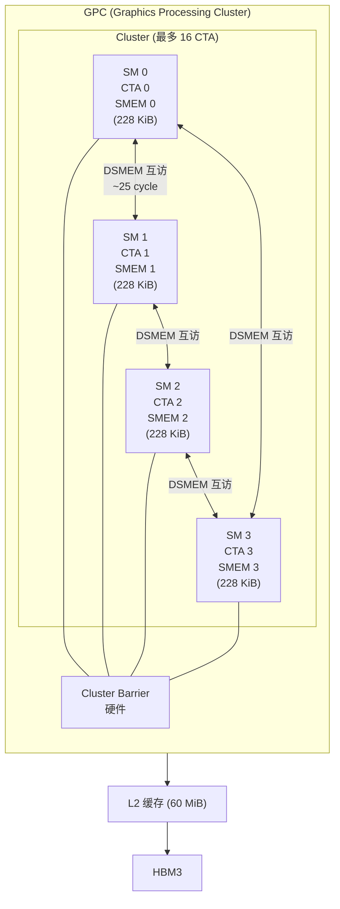

# 11 · Thread Block Cluster

> **Thread Block Cluster(CGA)是 Hopper SM90 引入的新层次抽象:1–16 个 CTA 组成一个 cluster,被调度到同一 GPC 的相邻 SM,可通过分布式共享内存(DSMEM)互相访问彼此的 SMEM,突破单 SM 内存与算力边界。**

## 1. 是什么 / 为什么有它

CUDA 的经典执行层次是:Grid → CTA(Thread Block)→ Warp → Thread。CTA 是调度与资源隔离的基本单位,每个 CTA 只能访问自身所在 SM 的 SMEM。这在以下场景造成瓶颈:

- **大 tile GEMM:** 若 tile 尺寸超过单 SM SMEM(228 KiB),只能分块且无法跨 CTA 共享中间结果
- **Flash Attention / Producer-Consumer 模式:** 一个 CTA 产生的中间激活需要另一个 CTA 消费,传统路径必须经由 GMEM,延迟巨大
- **协同 Reduction:** 相邻 SM 上的 CTA 若能直接读写彼此 SMEM,reduce 延迟从 GMEM(400+ cycle)降至 SM-to-SM(约 25 cycle)

Hopper 引入 **Thread Block Cluster**,也称 **Cooperative Grid Array(CGA)**:

- 1–16 个 CTA 组成一个 cluster
- Cluster 内所有 CTA 被调度到同一 GPC 的相邻 SM 上,物理邻近保证低延迟互访
- 每个 CTA 可以通过 **分布式共享内存(DSMEM)** 访问同 cluster 内任意其他 CTA 的 SMEM
- Cluster 内所有 SM 有专用的 **cluster barrier** 硬件支持跨 SM 同步

这使 cluster 内的 CTA 集合等效于一个拥有更大 SMEM 池的"超级 CTA"——16 CTA × 228 KiB = 最多 3.6 MiB 可互访 SMEM,同时不牺牲 SM 的独立计算能力。

**主要应用场景:**

1. **大 tile GEMM:** CUTLASS 3.x 的 `sm90_gemm_tma_wgmma_cluster` kernel 利用 cluster 将逻辑 tile 扩展到多 SM,每个 SM 负责输出矩阵的一个分区,通过 TMA 分别加载 A/B 子块,避免重复 L2 读取。

2. **Flash Attention:** 计算注意力时,Q×K^T 的 partial sum 产生于一个 CTA,softmax 归一化需要跨行/列 reduction。Cluster 内 CTA 可直接交换 partial max 与 partial sum,无需写回 GMEM。

3. **跨 CTA Reduction:** 相邻 SM 的 partial reduce 结果通过 DSMEM 直接汇总,延迟约 25 cycle,远低于 GMEM 路径的 400+ cycle。

4. **Cluster TMA Store:** Kernel 结束时,各 CTA 可以通过 Cluster TMA 将各自的 SMEM 结果批量写回 GMEM,写操作由 TMA 引擎并行执行,释放 warp 继续其他工作。

**编程注意:** Cluster 是 Hopper (sm90a) 专属特性。`ptxas` 必须以 `-arch=sm_90a` 编译(注意 `sm_90a` 而非 `sm_90`,后者不支持 wgmma/TMA/cluster 指令)。

## 2. 硬件视角(微架构细节)

Hopper GPC(Graphics Processing Cluster)内包含多个 SM。Cluster 的所有 CTA 必须落在同一 GPC 内——这是硬件保证低延迟 DSMEM 访问的物理前提。GigaThread 调度器在分配 cluster 时会保证整个 cluster 的 CTA 同时到位(all-or-nothing 分配),避免部分 CTA 阻塞等待其余成员。



**关键硬件数字:**
- Cluster 最大尺寸:16 CTA(当前驱动实际支持上限为 8)
- DSMEM 访问延迟:约 25 cycle(同 GPC SM-to-SM 总线)
- Cluster barrier 同步开销:约 10 cycle
- 跨 DSMEM 的 128 B 事务带宽:约 1 TB/s 片上互联(不经过 L2)
- GPC 内 SM 数量:Hopper H100 SXM5 每 GPC 约 14–18 个 SM(共 9 GPC × ~15 SM = 132 SM)
- 跨 GPC 访问:**不支持**,尝试访问会产生段错误

**DSMEM 地址空间:**
每个 CTA 的 SMEM 在 DSMEM 地址空间中有一个独立的 128 KiB 地址窗口(由 cluster rank 决定偏移)。通过 `mapa.shared::cluster` PTX 指令可以将本 CTA 的 SMEM 指针转换为目标 CTA 的等效 DSMEM 地址,再通过 `ld.shared::cluster` / `st.shared::cluster` 访问。

**DSMEM 与 L2 的区别:** DSMEM 访问走片上 SM-to-SM 互联总线,不经过 L2 缓存或 HBM,因此不消耗 L2 带宽。对于频繁交换少量数据的场景(如 attention 的 softmax normalization 因子),DSMEM 是比 GMEM 低 10–15 倍延迟的捷径。

**cluster 编译要求:** Cluster 是 Hopper (sm90a) 专属特性。`ptxas` 必须以 `-arch=sm_90a` 编译(注意 `sm_90a` 而非 `sm_90`,后者不支持 cluster 指令)。查询设备支持的最大 cluster 尺寸:`cudaDeviceGetAttribute(&maxCluster, cudaDevAttrMaxBlocksPerMultiprocessor, device)` 或使用 `cudaOccupancyMaxActiveClusters` API。

## 3. CUDA 编程接口

**编译期指定 cluster 尺寸:**

```cpp
// 方法 1:kernel 属性宏(编译期固定)
__global__ void __cluster_dims__(4, 1, 1) cluster_kernel(...) {
    // CTA 数 = 4,排列为 4×1×1
}

// 方法 2:运行期指定(CUDA 12.0+)
cudaLaunchConfig_t config = {};
config.gridDim  = {grid_x, grid_y, 1};
config.blockDim = {block_x, 1, 1};
cudaLaunchAttribute attr;
attr.id = cudaLaunchAttributeClusterDimension;
attr.val.clusterDim = {4, 1, 1};    // 每个 cluster 4 个 CTA
config.attrs    = &attr;
config.numAttrs = 1;
cudaLaunchKernelEx(&config, cluster_kernel, ...);
```

**cooperative_groups cluster API:**

```cpp
#include <cooperative_groups.h>
namespace cg = cooperative_groups;

__global__ void __cluster_dims__(4, 1, 1) cluster_kernel(float* data) {
    cg::cluster_group cluster = cg::this_cluster();
    
    int rank = cluster.block_rank();   // 本 CTA 在 cluster 中的编号 (0–3)
    int size = cluster.dim_blocks().x; // cluster 大小 = 4
    
    // 同步整个 cluster 内所有 CTA
    cluster.sync();
    
    // 获取邻居 CTA 的 SMEM 指针(DSMEM 访问)
    __shared__ float smem[256];
    float* neighbor_smem = (float*)cluster.map_shared_rank(smem, (rank + 1) % size);
    // neighbor_smem 指向 rank+1 CTA 的 smem,可直接读写
    float val = neighbor_smem[threadIdx.x];   // 读取邻居 SMEM
}
```

**PTX 低层 DSMEM 指令:**

```ptx
// mapa: 将本 CTA 的 shared 指针转换为目标 CTA 的 DSMEM 地址
// %src_smem: 本 CTA 的 SMEM 地址
// %target_cta: 目标 CTA rank(0-indexed)
mapa.shared::cluster.u32 %dst_addr, %src_smem, %target_cta;

// ld.shared::cluster: 从 DSMEM 地址读取
ld.shared::cluster.u32 %r0, [%dst_addr];

// st.shared::cluster: 向 DSMEM 地址写入
st.shared::cluster.u32 [%dst_addr], %r1;

// cluster barrier
barrier.cluster.arrive;          // 本 CTA arrive
barrier.cluster.wait;            // 等待 cluster 内所有 CTA arrive
```

**Cluster TMA(跨 CTA 的 TMA store):**

```ptx
// TMA 可以直接把数据从 GMEM 搬到同 cluster 任意 CTA 的 SMEM
cp.async.bulk.tensor.2d.global.shared::cluster.tile.mbarrier::complete_tx::bytes
    [%dsmem_dst_of_other_cta], [tensor_map, {%r, %c}], [%mbar];
```

通过 Cluster TMA,每个 CTA 的 TMA 引擎可以直接填充邻居 CTA 的 SMEM,实现跨 SM 的协同预取,进一步提升大 tile 的数据搬运并发度。

**distributed mbarrier(分布式屏障):**
在 cluster 中,mbarrier 也可以通过 `mbarrier.arrive.shared::cluster` 从其他 CTA 触发 arrive。这使一个 CTA 发出的 TMA 可以通知另一个 CTA 的 mbarrier,实现真正的跨 SM 生产者-消费者流水线:

```ptx
// CTA 0 把数据 TMA load 到 CTA 1 的 SMEM,并通知 CTA 1 的 mbarrier
// 1. 先用 mapa 获取 CTA 1 的 mbarrier 的 DSMEM 地址
mapa.shared::cluster.u32 %remote_mbar, %local_mbar_ptr, 1;   // target_cta=1
// 2. CTA 1 设置 expect_tx (需在 CTA 1 内执行,此处示意)
// 3. TMA 发射,目标是 CTA 1 的 SMEM,mbar 是 CTA 1 的 mbarrier
cp.async.bulk.tensor.2d.global.shared::cluster.tile.mbarrier::complete_tx::bytes
    [%cta1_smem], [tensor_map, {%r, %c}], [%remote_mbar];
```

## 4. 关键性能指标

**延迟数据:**
- DSMEM 读延迟:约 25 cycle(vs 本地 SMEM 约 20 cycle,开销仅增加 25%)
- DSMEM 写延迟:约 30 cycle
- `cluster.sync()`(barrier.cluster):约 10 cycle(vs `__syncthreads()` 约 20–100 cycle)
- 跨 DSMEM 的 128 B 事务带宽:约 1 TB/s 片上互联(不经过 L2)

**Cluster 尺寸选择:**

| Cluster 大小 | 合法性(当前驱动) | DSMEM 可用 | 适用场景 |
|---|---|---|---|
| 1 | 是(退化为单 CTA) | 228 KiB | 单 SM 不受限场景 |
| 2 | 是 | 456 KiB | 小 cluster GEMM |
| 4 | 是 | 912 KiB | 典型 Flash Attention |
| 8 | 是(最大实际支持) | 1.8 MiB | 大 tile collective |
| 16 | 编译可声明,驱动运行时报错 | — | 需等待未来驱动 |

**GPC 映射约束:** Hopper H100 SXM5 的 132 SM 分布在若干 GPC 中,每个 GPC 通常有 4–8 个 SM。Cluster 尺寸超过单 GPC SM 数量时调度会失败。实际上 cluster=8 是当前最安全的最大值。

## 5. 代码示例

下面是一个 cluster 内相邻 CTA 互换 SMEM 数据的示例:

```cpp
#include <cooperative_groups.h>
namespace cg = cooperative_groups;

// cluster 尺寸 4,每 CTA 256 线程
__global__ void __cluster_dims__(4, 1, 1)
exchange_smem(float* out)
{
    __shared__ float tile[256];
    cg::cluster_group cl = cg::this_cluster();
    int rank = (int)cl.block_rank();

    // 每个 CTA 往本地 SMEM 写自己的 rank 值
    tile[threadIdx.x] = (float)rank;

    // 同步:确保所有 CTA 都写完本地 SMEM
    cl.sync();    // 等价于 barrier.cluster.arrive + wait

    // 读取 rank+1 邻居 CTA 的 SMEM(循环)
    int neighbor = (rank + 1) % cl.dim_blocks().x;
    float* nbr_tile = (float*)cl.map_shared_rank(tile, neighbor);
    float val = nbr_tile[threadIdx.x];   // DSMEM load,约 25 cycle

    // 写出结果
    int gidx = blockIdx.x * blockDim.x + threadIdx.x;
    out[gidx] = val;
}
```

关键点:
1. `cl.sync()` 等价于 `barrier.cluster.arrive; barrier.cluster.wait;`,必须由 cluster 内所有 CTA 的所有线程执行
2. `cl.map_shared_rank(ptr, rank)` 返回目标 CTA 的等效地址,之后的 load/store 透明经由 DSMEM 互联
3. DSMEM 访问不需要额外标注——cooperative_groups 封装后语法与普通指针访问相同
4. 每个 CTA 写完本地 SMEM 后需先 `cl.sync()` 再让其他 CTA 读——否则读到的是未定义数据

## 6. 实测手段

**NSight Compute 关键指标:**

```bash
ncu --metrics \
  smsp__inst_executed_op_dsmem_ld.sum,\
  smsp__inst_executed_op_dsmem_st.sum,\
  smsp__inst_executed_op_cluster_barrier.sum,\
  l1tex__t_sectors_pipe_lsu_mem_shared_op_ld.sum \
  ./cluster_app
```

| Metric | 含义 |
|---|---|
| `smsp__inst_executed_op_dsmem_ld.sum` | DSMEM load 指令数 |
| `smsp__inst_executed_op_dsmem_st.sum` | DSMEM store 指令数 |
| `smsp__inst_executed_op_cluster_barrier.sum` | cluster barrier 执行次数 |
| `smsp__warp_cycles_per_issue_stall_barrier.avg` | 因 barrier 等待的停顿 cycle |

在 NSight Systems 中,Cluster 内多个 SM 的 kernel 时间线会标注同一 cluster 颜色分组,可直观看到 cluster.sync() 导致的对齐等待点。

**验证 DSMEM 利用率的方法:**
比较 `smsp__inst_executed_op_dsmem_ld.sum` 与 `l1tex__t_sectors_pipe_lsu_mem_shared_op_ld.sum`:若前者占后者的比例与代码中 DSMEM/本地 SMEM 访问比例一致,则 DSMEM 路径工作正常。若 DSMEM 访问计数异常低,可能是 `mapa` 地址转换错误或 cluster 未正确配置。

**cluster barrier 对齐检查:**
`smsp__warp_cycles_per_issue_stall_barrier.avg` 若在 cluster.sync() 前后出现明显峰值,说明 cluster 内各 CTA 的工作量不均衡(load imbalance),某些 CTA 先到达 barrier 后等待其他 CTA。此时应检查每个 CTA 的工作量是否相等,或考虑用更细粒度的 arrive/wait 替代 cluster.sync()。

## 7. 常见反模式

**1. cluster size 超过 8 但 driver 不支持**
编译器允许 `__cluster_dims__(16, 1, 1)`,但当前 Hopper 驱动在运行时会返回 `cudaErrorInvalidValue`。应在 kernel 前查询 `cudaDeviceGetAttribute(&val, cudaDevAttrMaxBlocksPerMultiprocessor, device)` 和 cluster 相关属性,或使用 `cudaFuncSetAttribute(..., cudaFuncAttributeClusterSize, ...)` 并捕获错误。

**2. 访问非同 cluster 内 CTA 的 DSMEM**
`mapa.shared::cluster` / `cl.map_shared_rank` 只能访问同一 cluster 内的 CTA。若传入超出 [0, cluster_size) 范围的 rank,地址转换产生越界 DSMEM 地址,访问结果未定义(可能产生静默数据错误或硬件异常)。

**3. 误认为 cluster barrier 是 grid-wide 屏障**
`barrier.cluster.arrive/wait` 仅在单个 cluster 内有效——cluster 内的 N 个 CTA 互相等待,但不同 cluster 之间完全独立。如果需要 grid-wide 同步,仍需使用 cooperative_groups 的 grid barrier(`cg::this_grid().sync()`,需要 cooperative launch)。

**4. cluster 尺寸不整除 grid 尺寸**
Grid 的 blockDim 必须是 cluster 尺寸的整数倍:`gridDim.x % clusterDim.x == 0`。若不整除,尾部 CTA 数量不足以组成完整 cluster,驱动会返回错误或产生未定义行为。

**5. 忘记 `cl.sync()` 导致 DSMEM 读到未初始化数据**
在执行 DSMEM load 前,必须通过 cluster barrier 确保目标 CTA 已经把数据写入本地 SMEM。若省略 `cl.sync()` 直接 `map_shared_rank` 读取,可能读到上一轮的旧数据甚至未初始化垃圾值。

## 8. 延伸阅读

- CUDA C++ Programming Guide §5.2.7 — Thread Block Clusters(API 完整参考)
- CUDA C++ Programming Guide §K.7.7 — Hopper Cluster(compute capability 9.0 cluster 特性)
- PTX ISA §9.7.10 — `barrier.cluster`、`mapa.shared::cluster`、`ld/st.shared::cluster`
- Hopper Architecture Whitepaper — §Thread Block Cluster(GPC 物理映射、DSMEM 互联)
- CUTLASS 3.x `include/cutlass/arch/cluster_sync.hpp`
  — https://github.com/NVIDIA/cutlass(cluster sync 工具函数)
- developer.nvidia.com/blog/nvidia-hopper-architecture-in-depth(cluster + DSMEM 图解)
