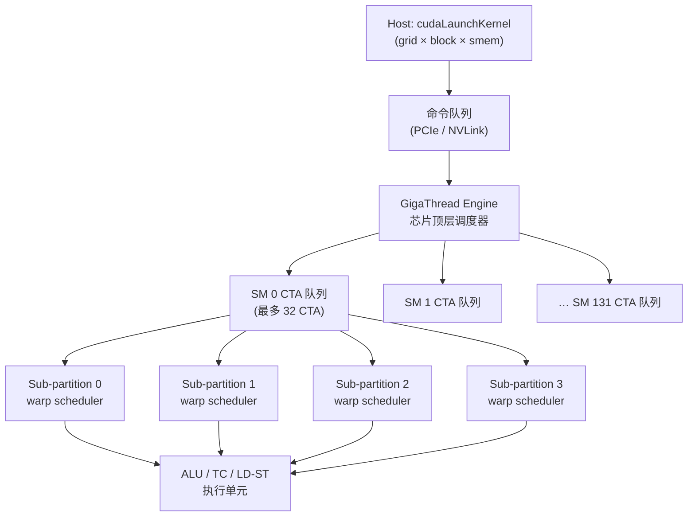

# 12 · CTA 调度 + GigaThread

> **GigaThread 引擎把 grid 的所有 CTA 持续分发到 132 个 SM;occupancy 由寄存器压力、共享内存用量和 warp 数量三重约束的最小值决定;`__launch_bounds__` 与 occupancy API 是调优的两把钥匙。**

## 1. 是什么 / 为什么有它

每次调用 `cudaLaunchKernel` 或三角括号语法 `<<<gridDim, blockDim>>>` 时,driver 会把整个 grid 的描述结构体交给芯片上的 **GigaThread 引擎**。GigaThread 是 GPU 最顶层的硬件工作分发模块,负责把 grid 中可运行的 CTA 按 SM 空闲槽位持续送出去,直到所有 CTA 执行完毕。

在 GigaThread 出现之前,早期 GPU 需要 host 软件逐批提交工作,每批都要等前一批完成后再发起下一批,PCIe 往返延迟直接累积在每个批次边界上。GigaThread 把这一过程内化到芯片,实现了"只要有空闲 SM,就立即发 CTA"的全流水模式,让 132 个 SM 几乎不会因等待新任务而空转。

然而 GigaThread 本身是被动的——它只能发送 SM 有资源容纳的 CTA。每个 SM 能同时驻留多少个 CTA,取决于三类有限资源的竞争:寄存器堆(Register File)、共享内存(SMEM)和 warp 调度槽位。这三者中最紧张的那个决定实际 **occupancy**,也就是每个 SM 同时活跃的 warp 数占理论上限的比率。occupancy 过低会导致 SM 没有足够多的 warp 来隐藏内存访问延迟,吞吐量下降。正确理解 occupancy 公式并通过编译选项和 API 调整,是写高性能 kernel 的核心技能之一。

Hopper SM90 架构下,每 SM 最多可驻留 32 个 CTA 和 64 个 warp。实际 occupancy 由编写 kernel 时使用的资源量共同决定,往往远低于硬件上限。合理设计 block size、寄存器用量和 SMEM 配额能把 occupancy 拉高,但也有"高 occupancy 不等于高性能"的反例:寄存器极少时虽然占用率 100%,指令发射吞吐可能被内存带宽或计算瓶颈限制。因此 occupancy 是分析起点,不是终点。

## 2. 硬件视角(微架构细节)

**GigaThread 引擎**位于 GPU 顶部,与 host 通过命令队列通信。Driver 把 launch 描述(CTA grid 尺寸、每 CTA 的 thread 数、静态 SMEM 字节数、寄存器需求)写入命令 ring buffer,GigaThread 读取后开始按 SM 空闲度分配 CTA。Hopper SXM5 有 132 个 SM,理论上 GigaThread 每个时钟周期可向一个 SM 推送一个 CTA,因此发送 132 个 CTA 大约需要 132 个时钟周期,约 50 ns。

**occupancy 四重约束公式**(Hopper SM90):

```
occupancy_CTAs = min(
    32,                                             -- ① 每 SM 硬件 CTA 上限
    floor(65536 / (regs_per_thread × tpb)),         -- ② 寄存器限制
    floor(smem_total / smem_per_CTA),               -- ③ SMEM 限制 (若 smem=0 则不受限)
    floor(64 / warps_per_CTA)                       -- ④ warp 槽位限制
)
```

其中 `tpb`(threads per block)与 `warps_per_CTA = ceil(tpb / 32)` 相关。`smem_total` 在 Hopper 上最大 228 KiB,但用户可通过 `cudaFuncSetAttribute` 调整 carveout。

**Thread Block Cluster 的特殊 dispatch 逻辑:**  
当 kernel 使用 `__cluster_dims__` 或 `cudaLaunchAttributeClusterDimension` 指定 cluster 大小时,GigaThread 必须等待同一 cluster 中的全部 CTA 都在同一 GPC 的相邻 SM 上找到空位,才能一次性全部 dispatch。这意味着如果某个 GPC 内的 SM 资源被其他 CTA 占满,cluster 会在队列中整体等待。cluster stall 在 GPC 负载不均时会变得严重。

**优先级流的影响:**  
`cudaStreamCreateWithPriority` 可创建高/低优先级 stream。高优先级 stream 的 CTA 在 GigaThread 内部队列中排在前面,更早被发送到 SM。但优先级只影响 dispatch 顺序,不影响已经在 SM 内运行的 warp 调度(SM 内部四个 sub-partition 的调度器不感知流优先级)。

下图展示完整的 dispatch 路径:



## 3. CUDA 编程接口

**`__launch_bounds__(maxThreadsPerBlock, minBlocksPerSm)`**

该属性告知 ptxas 编译器:kernel 最多用 `maxThreadsPerBlock` 个线程,且希望每个 SM 至少驻留 `minBlocksPerSm` 个 block。编译器据此设置寄存器上限 `floor(65536 / (minBlocksPerSm × ceil(maxTPB / 32) × 32))`,超出限制的变量会 spill 到 local memory。

```cpp
// 告知编译器:每 block 最多 256 thread,期望每 SM 至少 4 个 block
// ptxas 会把寄存器数 ≤ floor(65536 / (4×256)) = 64
__global__ __launch_bounds__(256, 4)
void myKernel(float* __restrict__ out, const float* __restrict__ in, int n) {
    int idx = blockIdx.x * blockDim.x + threadIdx.x;
    if (idx < n) out[idx] = in[idx] * 2.0f;
}
```

**occupancy 查询 API:**

```cpp
// 自动寻找使 occupancy 最大的 blockSize
int blockSize, minGridSize;
cudaOccupancyMaxPotentialBlockSize(
    &minGridSize, &blockSize,
    myKernel,
    /*dynamicSMemSize=*/0,
    /*blockSizeLimit=*/0);

// 给定 blockSize,查询每 SM 最多活跃 block 数
int maxActiveBlocks;
cudaOccupancyMaxActiveBlocksPerMultiprocessor(
    &maxActiveBlocks, myKernel, blockSize, /*dynamicSmemSize=*/0);
```

**runtime 设置 SMEM 上限:**

```cpp
// 允许 kernel 使用最多 96 KiB 动态 SMEM(超出默认 48 KiB)
cudaFuncSetAttribute(myKernel,
    cudaFuncAttributeMaxDynamicSharedMemorySize, 96 * 1024);
```

**cluster launch:**

```cpp
cudaLaunchConfig_t cfg = {};
cfg.gridDim  = { gridX, 1, 1 };
cfg.blockDim = { 128,   1, 1 };

cudaLaunchAttribute attr;
attr.id                   = cudaLaunchAttributeClusterDimension;
attr.val.clusterDim.x     = 4;  // 4 CTA per cluster
attr.val.clusterDim.y     = 1;
attr.val.clusterDim.z     = 1;
cfg.attrs    = &attr;
cfg.numAttrs = 1;

cudaLaunchKernelEx(&cfg, clusterKernel, args...);
```

## 4. 关键性能指标

**GigaThread dispatch 速率:** 大约 1 CTA/cycle/SM,Hopper 132 SM 满载时理论峰值 132 CTA/cycle;实际受命令队列带宽限制。dispatch 速率相对于 kernel 执行时间(通常 ms 级)可以忽略,只有超短 kernel 批量反复 launch 时才成瓶颈。

**occupancy 与延迟隐藏的关系:** 内存访问延迟约 400 cycle(HBM3 miss)。为隐藏这段延迟,SM 需要有足够多其他 warp 可以发射。经验规则:每个 sub-partition 至少需要 2-4 个活跃 warp 才能保持发射流水线不空转,即每 SM ≥ 8-16 个活跃 warp(占 64 上限的 12.5%-25%)。在计算密集型 kernel 中 occupancy 要求可以更低。

**tail effect 量化:** 若 grid 有 `G` 个 CTA,SM 数为 `S`,则波次数 `W = ceil(G / (S × occ_CTAs_per_SM))`。若 `G % (S × occ)` 很小,最后一波使用率极低。举例:G=1345, S=132, occ=8 → 每 SM 可放 8 CTA,每波 132×8=1056;第一波 1056 个 CTA,第二波仅 289 个,SM 利用率约 289/1056=27%。这被称为 tail effect 或 wave quantization。

**cluster stall 开销:** cluster size 为 `C` 时,GigaThread 需要在同一 GPC 找到 `C` 个空闲 SM,等待时间与 GPC 繁忙程度正相关。Hopper 每 GPC 约 18 SM,cluster size ≤ 8 时概率性等待较小;cluster size = 16 时压力显著增大。

## 5. 代码示例

下面的完整示例演示如何用 occupancy API 自动选取最优 blockSize,再进行 launch,并打印实测 occupancy:

```cpp
#include <cuda_runtime.h>
#include <cstdio>

// 1. 定义 kernel,带 launch_bounds 辅助编译器
__global__ __launch_bounds__(256, 4)
void saxpy(float* __restrict__ y,
           const float* __restrict__ x,
           float a, int n)
{
    int idx = blockIdx.x * blockDim.x + threadIdx.x;
    if (idx < n) y[idx] = a * x[idx] + y[idx];
}

int main() {
    constexpr int N = 1 << 25;  // 32M 元素

    // 2. 自动求最优 blockSize
    int blockSize = 0, minGridSize = 0;
    cudaOccupancyMaxPotentialBlockSize(
        &minGridSize, &blockSize, saxpy, 0, 0);

    int gridSize = (N + blockSize - 1) / blockSize;

    // 3. 查询每 SM 最大活跃块数
    int maxBlocks = 0;
    cudaOccupancyMaxActiveBlocksPerMultiprocessor(
        &maxBlocks, saxpy, blockSize, 0);

    // 4. 换算成 occupancy 百分比
    int smCount = 0;
    cudaDeviceGetAttribute(&smCount,
        cudaDevAttrMultiProcessorCount, 0);
    float occ = (float)(maxBlocks * blockSize)
              / (smCount * 2048.0f) * 100.0f;  // 2048 = max threads/SM

    printf("blockSize=%d gridSize=%d maxBlocksPerSM=%d occ=%.1f%%\n",
           blockSize, gridSize, maxBlocks, occ);

    // 5. 分配并 launch
    float *d_x, *d_y;
    cudaMalloc(&d_x, N * sizeof(float));
    cudaMalloc(&d_y, N * sizeof(float));
    cudaMemset(d_x, 0, N * sizeof(float));
    cudaMemset(d_y, 0, N * sizeof(float));

    saxpy<<<gridSize, blockSize>>>(d_y, d_x, 2.0f, N);
    cudaDeviceSynchronize();

    cudaFree(d_x);
    cudaFree(d_y);
    return 0;
}
```

编译时可添加 `-Xptxas=-v` 查看每 thread 寄存器数和 SMEM 使用量,以验证 `__launch_bounds__` 是否生效:

```bash
nvcc -arch=sm_90a -Xptxas=-v -O3 -o saxpy saxpy.cu
```

## 6. 实测手段

**NSight Compute** 是分析 occupancy 的主要工具:

```bash
ncu --metrics \
  launch__waves_per_multiprocessor,\
  smsp__warps_active.avg.pct_of_peak_sustained_active,\
  gpc__cycles_active.avg.pct_of_peak_sustained_active,\
  launch__registers_per_thread,\
  launch__shared_mem_per_block_static \
  ./app
```

- `launch__waves_per_multiprocessor`:grid 被分成多少波次,接近 1 说明 grid 很小或 tail effect 不明显。
- `smsp__warps_active.avg.pct_of_peak_sustained_active`:warp 级 occupancy 百分比,低于 25% 时通常需要优化。
- `launch__registers_per_thread` + `launch__shared_mem_per_block_static`:直接显示编译器分配的资源量,对照公式即可定位是寄存器还是 SMEM 成为 occupancy 瓶颈。

NSight Compute 的 "Occupancy" 分析面板会自动把这些数字代入四重约束公式并用颜色标出限制因素,无需手工计算。

**NSight Systems** 看宏观 launch 时间线:

```bash
nsys profile -t cuda,nvtx -o out ./app
nsys stats out.nsys-rep
```

在 Kernel Duration 视图中可以观察 grid launch 到第一个 CTA 真正执行之间的 GigaThread dispatch 延迟。

**`nvidia-smi dmon`** 快速观察 SM 利用率:

```bash
nvidia-smi dmon -s u -d 1  # 每秒刷新 SM util%
```

**ptxas 详细输出** 在编译期确认资源量:

```bash
nvcc -arch=sm_90a -Xptxas="-v,-warn-spills" mykernel.cu
# 输出类似: registers=64, shared memory=32768 bytes
```

如果出现 `warn-spills`,说明寄存器 spill 到 local memory,可能导致性能下降。

## 7. 常见反模式

**1. tail effect 不考虑,grid 随手设成任意大小:** 若每 SM 能跑 8 个 CTA、SM 数=132,那么 grid 应尽量是 1056(132×8)的整数倍。实际中任务量不定,可以用 padding 把 CTA 数量补齐,无效 CTA 内用 `if (idx >= n) return;` 提前退出。

**2. cluster grid 忽略 GPC 整除条件:** cluster 内 CTA 需落在同一 GPC 的相邻 SM。Hopper 每 GPC 约 18 SM,若 cluster size=5 而某 GPC 只有 3 个 SM 空闲,整个 cluster 会等到有 5 个 SM 同时空闲才 dispatch。推荐先用 `cudaOccupancyMaxPotentialClusterSize` 查询当前 kernel 能安全使用的最大 cluster 大小。

**3. CTA 线程数过少,占用 CTA 槽却浪费 warp 槽:** 每 CTA 只有 32 个 thread 时需要 64 个 CTA 才能填满 64 warp/SM,但 SM 最多 32 个 CTA,所以 warp 槽只填满 50%。每 CTA 用 128 或 256 个 thread 通常是合理起点。

**4. `__launch_bounds__` minBlocksPerSm 设得过高:** 如设 `minBlocksPerSm=8` 而 SMEM 用量 = 40 KiB/block,8 个 block 需 320 KiB > 228 KiB,ptxas 会报错或降低到实际能容纳的数目。应先算资源需求再设 minBlocksPerSm。

**5. 高 occupancy 但性能反而下降:** 通过减少 SMEM 用量把 occupancy 从 4 个 block/SM 提升到 8 个,SMEM 容量减半可能导致每次需要更多 gmem 访问,memory bandwidth 成为新瓶颈。occupancy 优化必须配合 NSight Compute 分析真正的限制器(compute bound vs memory bound)。

## 8. 延伸阅读

- CUDA C++ Programming Guide §5.2.5 — Compute Capability 9.0 occupancy 公式与硬件上限
- CUDA C++ Programming Guide §B.20 — `__launch_bounds__` 语义与寄存器限制计算
- CUDA Best Practices Guide §10 — Execution Configuration Optimizations(tail effect、wave 量化)
- Hopper Architecture Whitepaper §GigaThread Engine — dispatch 速率与 cluster dispatch 模型
- CUDA Sample `cudaOccupancy`(路径:`CUDA_Samples/0_Introduction/cudaOccupancy/`)
- NSight Compute 内置 Occupancy 分析面板,自动标注三重约束的瓶颈因素
- `cudaOccupancyMaxPotentialClusterSize` — 查询当前 kernel 可用的最大 cluster 大小(CUDA 12.0+)
