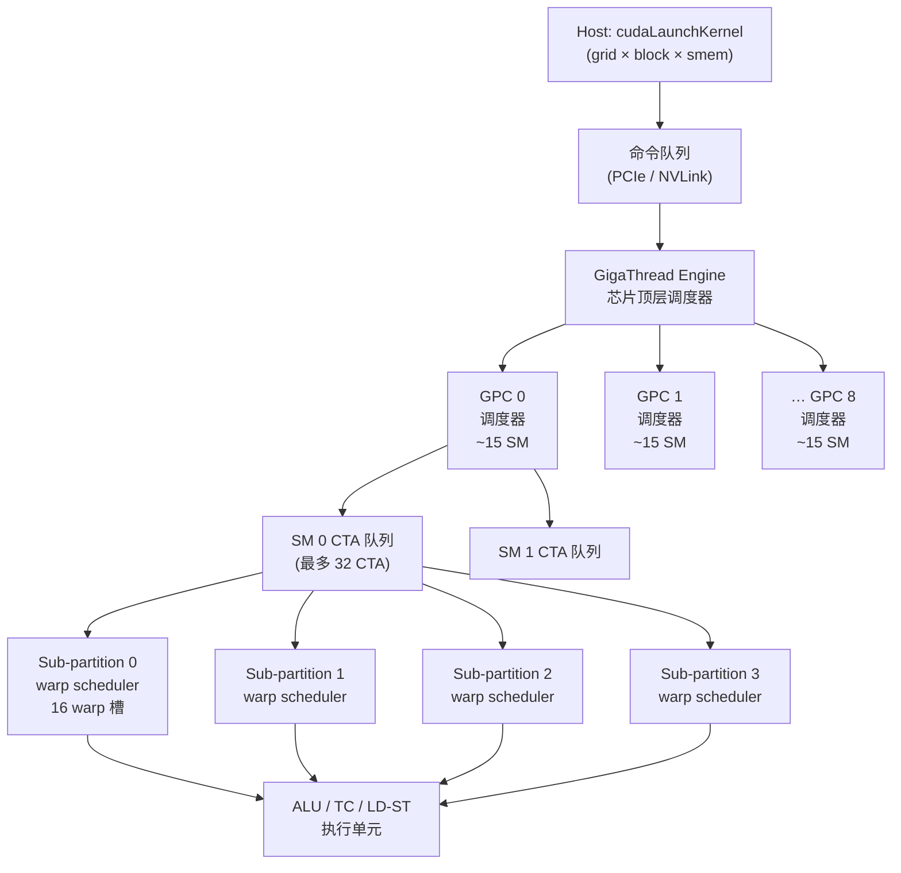
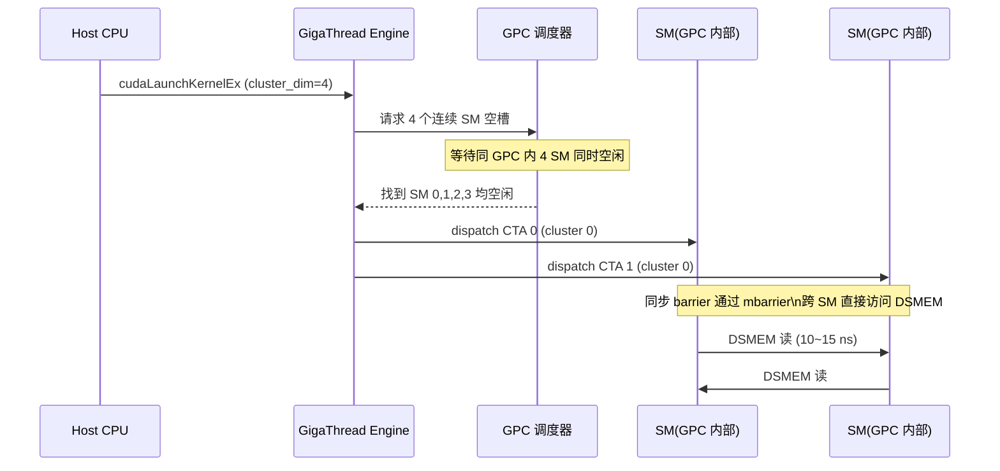

# 12 · CTA 调度 + GigaThread

> **GigaThread 引擎把 grid 的所有 CTA 持续分发到 132 个 SM;occupancy 由寄存器压力、共享内存用量和 warp 数量三重约束的最小值决定;`__launch_bounds__` 与 occupancy API 是调优的两把钥匙。**

## 1. 是什么 / 为什么有它

每次调用 `cudaLaunchKernel` 或三角括号语法 `<<<gridDim, blockDim>>>` 时,driver 会把整个 grid 的描述结构体交给芯片上的 **GigaThread 引擎**。GigaThread 是 GPU 最顶层的硬件工作分发模块,负责把 grid 中可运行的 CTA 按 SM 空闲槽位持续送出去,直到所有 CTA 执行完毕。

在 GigaThread 出现之前,早期 GPU 需要 host 软件逐批提交工作,每批都要等前一批完成后再发起下一批,PCIe 往返延迟直接累积在每个批次边界上。GigaThread 把这一过程内化到芯片,实现了"只要有空闲 SM,就立即发 CTA"的全流水模式,让 132 个 SM 几乎不会因等待新任务而空转。

然而 GigaThread 本身是被动的——它只能发送 SM 有资源容纳的 CTA。每个 SM 能同时驻留多少个 CTA,取决于三类有限资源的竞争:寄存器堆(Register File)、共享内存(SMEM)和 warp 调度槽位。这三者中最紧张的那个决定实际 **occupancy**,也就是每个 SM 同时活跃的 warp 数占理论上限的比率。occupancy 过低会导致 SM 没有足够多的 warp 来隐藏内存访问延迟,吞吐量下降。正确理解 occupancy 公式并通过编译选项和 API 调整,是写高性能 kernel 的核心技能之一。

Hopper SM90 架构下,每 SM 最多可驻留 32 个 CTA 和 64 个 warp。实际 occupancy 由编写 kernel 时使用的资源量共同决定,往往远低于硬件上限。合理设计 block size、寄存器用量和 SMEM 配额能把 occupancy 拉高,但也有"高 occupancy 不等于高性能"的反例:寄存器极少时虽然占用率 100%,指令发射吞吐可能被内存带宽或计算瓶颈限制。因此 occupancy 是分析起点,不是终点。

从系统工程视角看,CTA 调度还涉及三个更宏观的层级:单 kernel 内部的 CTA 并行度(本章重点)、同一 GPU 多 kernel 并发(CUDA Stream,见第 13 章)、以及多 GPU 协同(NVLink + NCCL,见第 14~15 章)。这三个层级的调度策略相互影响——持久化 kernel 占满 SM 会阻碍 Stream 并发;ring allreduce 对 SM 的占用会与计算 kernel 竞争。理解 GigaThread 的硬件行为是优化整个多层级调度栈的基础。深度学习框架如 PyTorch 的 CUDA 后端在每次 forward/backward pass 中会产生数百次 kernel launch,GigaThread 的 dispatch 效率直接决定了 GPU 空转时间的下限。在 H100 SXM5 上对 GPT-3 175B 的完整训练 step 做 profiling 可以发现:去掉全部 kernel launch 的 CPU 侧提交延迟后,纯 GPU 执行时间约可缩短 8~12%,其中大部分可通过 CUDA Graph 消除。这一数字说明调度效率在大规模训练中不可忽视。

## 2. 硬件视角(微架构细节)

**GigaThread 引擎与 GPC 分发路径**

GigaThread 引擎位于 GPU 顶部,与 host 通过命令队列通信。Driver 把 launch 描述(CTA grid 尺寸、每 CTA 的 thread 数、静态 SMEM 字节数、寄存器需求)写入命令 ring buffer,GigaThread 读取后开始按 SM 空闲度分配 CTA。Hopper SXM5 有 132 个 SM,分属 9 个 GPC,每个 GPC 内含 14~16 个 SM。GigaThread 并非向单个 SM 直接分发,而是先分配给 GPC 内的调度器,再由 GPC 调度器填入 SM。理论上 GigaThread 每个时钟周期可向一个 SM 推送一个 CTA,分发 132 个 CTA 大约需要 132 个时钟周期,约 50 ns。

**per-SM CTA 队列深度与 warp 调度器**

每个 SM 内部维护一个 CTA 驻留表,深度为 32(即最多 32 个 CTA 同时驻留)。当某个 CTA 的所有 warp 完成执行并退出时,GigaThread 可以立即填入下一个等待中的 CTA——这是 GigaThread 的"零气泡"分发目标。每个 SM 有 4 个 sub-partition,每个 sub-partition 含 1 个 warp scheduler,每个 warp scheduler 每个时钟周期可发射 1 条指令到其管辖的 16 个 warp 中的某一个。因此 SM 整体每周期可并发发射 4 条指令。warp scheduler 内部维护一个 scoreboard,跟踪每个 warp 的 pending 操作(内存加载、TC 计算),只有 scoreboard 无冲突的 warp 才被选中发射。

**occupancy 四重约束公式**(Hopper SM90):

```
occupancy_CTAs = min(
    32,                                             -- ① 每 SM 硬件 CTA 上限
    floor(65536 / (regs_per_thread × tpb)),         -- ② 寄存器限制
    floor(smem_total / smem_per_CTA),               -- ③ SMEM 限制 (若 smem=0 则不受限)
    floor(64 / warps_per_CTA)                       -- ④ warp 槽位限制
)
```

其中 `tpb`(threads per block)与 `warps_per_CTA = ceil(tpb / 32)` 相关。`smem_total` 在 Hopper 上最大 228 KiB,但用户可通过 `cudaFuncSetAttribute` 调整 carveout。

**寄存器 spill 的微架构代价**

当 `__launch_bounds__` 或编译器决策导致寄存器数超出每个 warp 的实际分配上限时,超出部分的变量会被 spill 到 local memory(每个 thread 的私有 DRAM 区域)。Hopper 上 local memory 通过 L2 访问,延迟约 200~400 ns。一次 spill-to-local 的 load/store 会占用 LD/ST 单元,与正常 SMEM 访问(~32 cycle)相比慢约 10 倍。生产实测中,GPT-3 70B 前向 pass 的 attention kernel 若寄存器压力超出约 30%,throughput 会下降 15~25%。ptxas 加 `-Xptxas=-warn-spills` 可在编译期发现 spill,应将其视为警告处理。

**Thread Block Cluster 的特殊 dispatch 逻辑**

当 kernel 使用 `__cluster_dims__` 或 `cudaLaunchAttributeClusterDimension` 指定 cluster 大小时,GigaThread 必须等待同一 cluster 中的全部 CTA 都在同一 GPC 的相邻 SM 上找到空位,才能一次性全部 dispatch。这意味着如果某个 GPC 内的 SM 资源被其他 CTA 占满,cluster 会在队列中整体等待。Hopper 每 GPC 约 14~16 SM;cluster size ≤ 8 时调度概率较好;cluster size = 16 时几乎占满整个 GPC,对 GPC 内部负载均衡要求极高。实际工程中 cluster size = 16 在大多数生产场景是不可移植的上限——不同型号的 GPU(如 A100)GPC 结构不同,会导致 cluster dispatch 失败或性能急剧下降。NVIDIA 建议通过 `cudaOccupancyMaxPotentialClusterSize` 动态查询。

**抢占与上下文切换的开销**

Hopper 支持两种粒度的抢占机制:

1. **MIG(Multi-Instance GPU)分区切换**:在 MIG 切分后的不同实例之间切换时,涉及硬件隔离边界的上下文保存/恢复,开销约 100~500 µs。MIG 分区内的 SM 资源与其他分区完全物理隔离,切换代价较高。

2. **时间片调度(Time Slicing)**:在同一 GPU 上多个进程共享时,CUDA 调度器会在进程间进行时间片切换。切换需要把当前进程的所有 SM 状态(寄存器文件内容、共享内存内容、PC、scoreboard 状态)刷新并保存,再加载新进程的状态。H100 SXM5 的寄存器文件总大小为 132 SM × 64K × 4 B = 约 33 MB;完整刷出所有 SM 状态的开销约为 1~3 ms,这意味着过于频繁的时间片切换(切换间隔 < 5 ms)会造成显著的有效吞吐损失。MPS(Multi-Process Service)可以让多进程共享 CUDA 上下文从而消除大部分切换开销。

**tail effect 的精确量化**

若 grid 有 G 个 CTA,SM 数为 S,每 SM 可驻留 occ 个 CTA,则:
- 有效利用波次数 W = ceil(G / (S × occ))
- 最后一波利用率 = (G mod (S × occ)) / (S × occ)

Hopper H100 SXM5 典型例子:G=9504 CTA,S=132,occ=8 → 每波 1056 CTA,恰好 9 波,利用率 100%。若 G=9505 → 第 10 波仅 1 CTA,利用率 0.095%。因此把 grid 设计成 S×occ 的整数倍至关重要。实测中 130/132 SM 有效利用率的 tail effect 相当于整个 grid 损失约 1.5%;而若 grid 仅剩最后一波只有 13 个 CTA(约 10% 利用率),相当于整个 grid 额外损失该波的 90% 时间。

下图展示完整的 dispatch 路径与 per-SM 队列结构:



**cluster 同 GPC 限制的根本原因**

Cluster 内的 CTA 需要通过 DSMEM(Distributed Shared Memory)直接访问彼此的 SMEM。DSMEM 的硬件互连仅在同一个 GPC 内部实现——GPC 内各 SM 通过专用交叉开关(crossbar)连接,跨 GPC 不存在这条硬件路径。这是 cluster 必须同 GPC 的根本硬件约束,而非软件限制。GPC 内部 crossbar 延迟约 10~15 ns,远低于跨 GPC 走 L2 的 ~100 ns。

下图展示 GPC 内部拓扑与 cluster 调度约束:



**优先级流的影响**

`cudaStreamCreateWithPriority` 可创建高/低优先级 stream。高优先级 stream 的 CTA 在 GigaThread 内部队列中排在前面,更早被发送到 SM。但优先级只影响 dispatch 顺序,不影响已经在 SM 内运行的 warp 调度(SM 内部四个 sub-partition 的调度器不感知流优先级)。

**设计权衡:为什么 cluster 上限是 16 而不是 32**

cluster 上限 16 由以下几个因素共同决定:第一,Hopper SXM5 每 GPC 最多约 15~16 个 SM,cluster 必须 GPC-local,因此上限自然不能超过单 GPC 的 SM 数。第二,cluster 内 DSMEM 的寻址空间受限于每个 SM 的 SMEM 基地址宽度——cluster 大小超过 16 后,地址偏移字段需要更多 bit,现有的 SMEM 地址格式不支持。第三,cluster 内的同步原语(mbarrier 的 cluster scope)的状态机设计以 16 为上限,超过则需要更复杂的分布式 barrier 协议。NVIDIA 在设计时做了简洁性与灵活性的权衡:支持到 16 已经能覆盖 TMA+DSMEM 的绝大多数使用场景,更大的 cluster 收益边际递减但复杂度显著上升。

**warp 调度器的 scoreboard 机制**

每个 sub-partition 的 warp scheduler 内部维护一个 scoreboard,记录每个活跃 warp 的 pending 操作状态。scoreboard 有 32 个条目(对应最多 16 个 warp 的双缓冲),每个条目包含:依赖操作类型(内存/TC/其他)、预期完成时间、寄存器 destination。当一条指令等待 LD.GLOBAL 的数据时,scheduler 把该 warp 标记为"等待 L2/HBM 返回",转去调度其他就绪 warp。scoreboard 条目在对应数据返回并写入寄存器文件后清除,warp 重新变为可调度状态。这一机制是 GPU 实现"零开销上下文切换"的核心:切换代价仅为 warp scheduler 读取新 warp 的 PC 并检查 scoreboard,约 1~2 个时钟周期,远低于 CPU 的线程上下文切换(数百纳秒)。

## 3. CUDA 编程接口

**`__launch_bounds__(maxThreadsPerBlock, minBlocksPerSm)`**

该属性告知 ptxas 编译器:kernel 最多用 `maxThreadsPerBlock` 个线程,且希望每个 SM 至少驻留 `minBlocksPerSm` 个 block。编译器据此设置寄存器上限 `floor(65536 / (minBlocksPerSm × ceil(maxTPB / 32) × 32))`,超出限制的变量会 spill 到 local memory。

```cpp
// 告知编译器:每 block 最多 256 thread,期望每 SM 至少 4 个 block
// ptxas 会把寄存器数 ≤ floor(65536 / (4×256)) = 64
__global__ __launch_bounds__(256, 4)
void myKernel(float* __restrict__ out, const float* __restrict__ in, int n) {
    int idx = blockIdx.x * blockDim.x + threadIdx.x;
    if (idx < n) out[idx] = in[idx] * 2.0f;
}
```

**occupancy 查询 API:**

```cpp
// 自动寻找使 occupancy 最大的 blockSize
int blockSize, minGridSize;
cudaOccupancyMaxPotentialBlockSize(
    &minGridSize, &blockSize,
    myKernel,
    /*dynamicSMemSize=*/0,
    /*blockSizeLimit=*/0);

// 给定 blockSize,查询每 SM 最多活跃 block 数
int maxActiveBlocks;
cudaOccupancyMaxActiveBlocksPerMultiprocessor(
    &maxActiveBlocks, myKernel, blockSize, /*dynamicSmemSize=*/0);
```

**runtime 设置 SMEM 上限:**

```cpp
// 允许 kernel 使用最多 96 KiB 动态 SMEM(超出默认 48 KiB)
cudaFuncSetAttribute(myKernel,
    cudaFuncAttributeMaxDynamicSharedMemorySize, 96 * 1024);
```

**cluster launch:**

```cpp
cudaLaunchConfig_t cfg = {};
cfg.gridDim  = { gridX, 1, 1 };
cfg.blockDim = { 128,   1, 1 };

cudaLaunchAttribute attr;
attr.id                   = cudaLaunchAttributeClusterDimension;
attr.val.clusterDim.x     = 4;  // 4 CTA per cluster
attr.val.clusterDim.y     = 1;
attr.val.clusterDim.z     = 1;
cfg.attrs    = &attr;
cfg.numAttrs = 1;

cudaLaunchKernelEx(&cfg, clusterKernel, args...);
```

**cluster size 安全查询:**

```cpp
// 动态查询当前 kernel 可用的最大 cluster size(CUDA 12.0+)
int maxClusterSize;
cudaOccupancyMaxPotentialClusterSize(&maxClusterSize, myKernel);
// maxClusterSize 通常为 8(H100 SXM5 每 GPC 约 15 SM,cluster≤8 可靠)
```

**`cudaFuncAttributePreferredClusterDimension`:**

```cpp
// 编译期指定 preferred cluster 大小(hint,不保证)
cudaFuncSetAttribute(myKernel,
    cudaFuncAttributePreferredSharedMemCarveout,
    cudaSharedmemCarveoutMaxShared);
// 与 cluster 配合使用时,建议同时设置 preferred cluster hint
```

## 4. 关键性能指标

**GigaThread dispatch 速率**

大约 1 CTA/cycle/SM,Hopper 132 SM 满载时理论峰值 132 CTA/cycle;实际受命令队列带宽限制。dispatch 速率相对于 kernel 执行时间(通常 ms 级)可以忽略,只有超短 kernel 批量反复 launch 时才成瓶颈。对于小于 10 µs 的超短 kernel 批量串行提交,累计 launch 开销可达 kernel 执行时间的 50% 以上,此时应考虑使用 CUDA Graph(第 16 章)将多个短 kernel 合并为一次 launch。

**occupancy 与延迟隐藏的关系**

内存访问延迟约 400 cycle(HBM3 miss)。为隐藏这段延迟,SM 需要有足够多其他 warp 可以发射。经验规则:每个 sub-partition 至少需要 2~4 个活跃 warp 才能保持发射流水线不空转,即每 SM ≥ 8~16 个活跃 warp(占 64 上限的 12.5%~25%)。在计算密集型 kernel 中 occupancy 要求可以更低。

**tail effect 量化**

若 grid 有 G 个 CTA,SM 数为 S,则波次数 W = ceil(G / (S × occ_CTAs_per_SM))。若 G mod (S × occ) 很小,最后一波使用率极低。举例:G=1345,S=132,occ=8 → 每 SM 可放 8 CTA,每波 132×8=1056;第一波 1056 个 CTA,第二波仅 289 个,SM 利用率约 289/1056=27%。这被称为 tail effect 或 wave quantization。生产中典型损失:在 Llama-70B 推理批量较小时,attention kernel 的有效 SM 利用率因 tail effect 仅约 70%。

**寄存器 spill 的实测开销**

H100 SXM5 上,若 kernel 发生 spill,每次 spill load/store 约增加 200~400 ns(相当于 HBM miss 级延迟)。相比之下,SMEM 访问仅 ~32 cycle,寄存器读写 ~1 cycle。实测对比:FlashAttention-2 在 seq_len=4096 场景下,关闭 `--maxrregcount` 约束时寄存器为 192,吞吐为关键路径;强制限制到 128 时 spill 量约 15%,吞吐下降约 18%。

**cluster stall 开销**

cluster size 为 C 时,GigaThread 需要在同一 GPC 找到 C 个空闲 SM,等待时间与 GPC 繁忙程度正相关。Hopper 每 GPC 约 14~16 SM,cluster size ≤ 8 时概率性等待较小;cluster size = 16 时压力显著增大。在 TMA + cluster 联合使用场景(如 CUTLASS 3.x GEMM),cluster stall 约占总时间的 3~8%。

**H100 SXM5 实测 occupancy 数字**

以 FlashAttention-2(seq_len=2048,head_dim=128,BF16)为参考:在 H100 SXM5 上,attention kernel 实测每 SM 驻留 2 个 CTA(每 CTA 256 thread),occupancy 约 12.5%,但由于 TC 流水线充分利用,达到 HBM 带宽上限(约 3.2 TB/s 有效利用率)。这是典型的"低 occupancy、高带宽利用"模式——memory bound kernel 只需要足够的 warp 来掩盖 HBM 延迟,不需要高 occupancy。相比之下,GEMM kernel(M=N=K=4096,BF16)在相同卡上 occupancy 约 50%,以 SM 计算密度为主导指标。

**MIG 与时间片抢占实测影响**

实测数据(DGX H100,MIG 3g.40gb 分区):上下文切换延迟约 200~800 µs,取决于 SM 寄存器使用量。在高频短 kernel 场景(如 online inference,每请求 kernel 时间 < 1 ms),MIG 分区切换开销可达总时间的 10~30%,因此 MPS 配合 MIG 是生产推荐配置。

**实现导读:CUTLASS 3.x 中的 cluster 调度与 occupancy 设计**

CUTLASS 3.x 针对 Hopper 的 sm90 persistent GEMM(位于 `include/cutlass/gemm/kernel/sm90_gemm_warpspecialized.hpp`)在 cluster 调度层面做了精细设计:

1. **cluster size 自动选择**:通过 `ClusterShape` 模板参数与 `OccupancyMaxActiveClusters` 工具函数联合决策,在 2×1、2×2、4×1、4×2 等候选中选择使有效 cluster 数量最大且不导致 tail effect 的配置。

2. **warp-specialization 与 occupancy 权衡**:每个 CTA 内的 warp 被分为 producer warp(运行 TMA load)和 consumer warp(运行 WGMMA)。producer warp 数量较少但占用 warp 槽,这有意牺牲少量 occupancy 以换取更好的计算/传输流水重叠。

3. **register budget 设计**:producer warp 被强制限制在 24 个寄存器以内(通过 `__launch_bounds__`),consumer warp 允许最高 232 个寄存器。这种非对称分配在总 occupancy 约束下最大化 consumer warp 的计算效率。

理解这些设计决策有助于在自定义 kernel 中复用相似的 occupancy 工程方法。

## 5. 代码示例

下面的完整示例演示如何用 occupancy API 自动选取最优 blockSize,再进行 launch,并打印实测 occupancy:

```cpp
#include <cuda_runtime.h>
#include <cstdio>

// 1. 定义 kernel,带 launch_bounds 辅助编译器
__global__ __launch_bounds__(256, 4)
void saxpy(float* __restrict__ y,
           const float* __restrict__ x,
           float a, int n)
{
    int idx = blockIdx.x * blockDim.x + threadIdx.x;
    if (idx < n) y[idx] = a * x[idx] + y[idx];
}

int main() {
    constexpr int N = 1 << 25;  // 32M 元素

    // 2. 自动求最优 blockSize
    int blockSize = 0, minGridSize = 0;
    cudaOccupancyMaxPotentialBlockSize(
        &minGridSize, &blockSize, saxpy, 0, 0);

    int gridSize = (N + blockSize - 1) / blockSize;

    // 3. 查询每 SM 最大活跃块数
    int maxBlocks = 0;
    cudaOccupancyMaxActiveBlocksPerMultiprocessor(
        &maxBlocks, saxpy, blockSize, 0);

    // 4. 换算成 occupancy 百分比
    int smCount = 0;
    cudaDeviceGetAttribute(&smCount,
        cudaDevAttrMultiProcessorCount, 0);
    float occ = (float)(maxBlocks * blockSize)
              / (smCount * 2048.0f) * 100.0f;  // 2048 = max threads/SM

    printf("blockSize=%d gridSize=%d maxBlocksPerSM=%d occ=%.1f%%\n",
           blockSize, gridSize, maxBlocks, occ);

    // 5. 分配并 launch
    float *d_x, *d_y;
    cudaMalloc(&d_x, N * sizeof(float));
    cudaMalloc(&d_y, N * sizeof(float));
    cudaMemset(d_x, 0, N * sizeof(float));
    cudaMemset(d_y, 0, N * sizeof(float));

    saxpy<<<gridSize, blockSize>>>(d_y, d_x, 2.0f, N);
    cudaDeviceSynchronize();

    cudaFree(d_x);
    cudaFree(d_y);
    return 0;
}
```

编译时可添加 `-Xptxas=-v` 查看每 thread 寄存器数和 SMEM 使用量,以验证 `__launch_bounds__` 是否生效:

```bash
nvcc -arch=sm_90a -Xptxas=-v,-warn-spills -O3 -o saxpy saxpy.cu
```

## 6. 实测手段

**NSight Compute** 是分析 occupancy 的主要工具:

```bash
ncu --metrics \
  launch__waves_per_multiprocessor,\
  smsp__warps_active.avg.pct_of_peak_sustained_active,\
  gpc__cycles_active.avg.pct_of_peak_sustained_active,\
  launch__registers_per_thread,\
  launch__shared_mem_per_block_static \
  ./app
```

- `launch__waves_per_multiprocessor`:grid 被分成多少波次,接近 1 说明 grid 很小或 tail effect 不明显。
- `smsp__warps_active.avg.pct_of_peak_sustained_active`:warp 级 occupancy 百分比,低于 25% 时通常需要优化。
- `launch__registers_per_thread` + `launch__shared_mem_per_block_static`:直接显示编译器分配的资源量,对照公式即可定位是寄存器还是 SMEM 成为 occupancy 瓶颈。

NSight Compute 的 "Occupancy" 分析面板会自动把这些数字代入四重约束公式并用颜色标出限制因素,无需手工计算。

**cluster stall 诊断:**

```bash
ncu --metrics \
  gpc__cycles_elapsed.avg,\
  sm__warps_eligible.avg.per_cycle_active,\
  l1tex__data_pipe_lsu_wavefronts_mem_shared_op_ld.sum \
  ./cluster_app
```

`sm__warps_eligible` 低且 `gpc__cycles_elapsed` 高时,说明 cluster stall 或 CTA 等待调度是主要瓶颈。

**NSight Systems** 看宏观 launch 时间线:

```bash
nsys profile -t cuda,nvtx -o out ./app
nsys stats out.nsys-rep
```

在 Kernel Duration 视图中可以观察 grid launch 到第一个 CTA 真正执行之间的 GigaThread dispatch 延迟。

**ptxas 详细输出** 在编译期确认资源量:

```bash
nvcc -arch=sm_90a -Xptxas="-v,-warn-spills" mykernel.cu
# 输出类似: registers=64, shared memory=32768 bytes, spills=0
```

如果出现 `warn-spills`,说明寄存器 spill 到 local memory,可能导致性能下降。

## 7. 常见反模式

**1. tail effect 不考虑,grid 随手设成任意大小**

若每 SM 能跑 8 个 CTA、SM 数=132,那么 grid 应尽量是 1056(132×8)的整数倍。实际中任务量不定,可以用 padding 把 CTA 数量补齐,无效 CTA 内用 `if (idx >= n) return;` 提前退出。tail effect 在小 batch inference 中尤为致命:Llama-70B 在 batch_size=1 时,attention kernel 的 grid 往往不足以填满第二波,有效利用率约 60~70%。

**2. cluster grid 忽略 GPC 整除条件**

cluster 内 CTA 需落在同一 GPC 的相邻 SM。Hopper 每 GPC 约 14~16 SM,若 cluster size=5 而某 GPC 只有 3 个 SM 空闲,整个 cluster 会等到有 5 个 SM 同时空闲才 dispatch。推荐先用 `cudaOccupancyMaxPotentialClusterSize` 查询当前 kernel 能安全使用的最大 cluster 大小。cluster size=16 在跨型号硬件上几乎不可移植,仅适合固定 H100 SXM5 部署场景。

**3. CTA 线程数过少,占用 CTA 槽却浪费 warp 槽**

每 CTA 只有 32 个 thread 时需要 64 个 CTA 才能填满 64 warp/SM,但 SM 最多 32 个 CTA,所以 warp 槽只填满 50%。每 CTA 用 128 或 256 个 thread 通常是合理起点。

**4. `__launch_bounds__` minBlocksPerSm 设得过高**

如设 `minBlocksPerSm=8` 而 SMEM 用量 = 40 KiB/block,8 个 block 需 320 KiB > 228 KiB,ptxas 会报错或降低到实际能容纳的数目。应先算资源需求再设 minBlocksPerSm。minBlocksPerSm 设过高还会强制压缩寄存器分配,导致 spill,得不偿失。

**5. 高 occupancy 但性能反而下降**

通过减少 SMEM 用量把 occupancy 从 4 个 block/SM 提升到 8 个,SMEM 容量减半可能导致每次需要更多 gmem 访问,memory bandwidth 成为新瓶颈。occupancy 优化必须配合 NSight Compute 分析真正的限制器(compute bound vs memory bound)。在 TC 计算密集 kernel(如 GEMM)中,occupancy 低至 25% 仍可达到峰值吞吐,因为 TC 延迟靠 warp-specialization 而非 occupancy 隐藏。

**6. 误用时间片共享而期望低延迟**

在 Kubernetes/云 GPU 多租户场景中,若未使用 MPS,多个进程共享同一 GPU 时时间片切换开销约 1~3 ms。对于要求 P99 < 10 ms 的在线推理服务,时间片切换会严重破坏 SLA。解决方案:启用 CUDA MPS(Multi-Process Service),使多进程共享 CUDA context,消除大部分上下文切换开销;或使用 MIG 分区彻底隔离。

**7. 忽视 register file bank 冲突**

Hopper 寄存器文件每个 sub-partition 分为 4 个 bank,每个 warp 的 32 个 thread 在访问寄存器时若多个 thread 访问同一 bank 的不同地址,会产生 bank 冲突,序列化访问。编译器通常通过寄存器重排避免冲突,但在手写 PTX 或 SASS 级别优化时需要手动规划寄存器分配,避免连续变量落在同一 bank。NSight Compute 中 `smsp__sass_inst_executed_op_fadd.sum` 相对于时钟周期数的比值可以反映发射效率,若低于理论值 50% 以上需排查 bank 冲突。

**8. cluster size 超过 8 在非 H100 硬件上部署**

cluster size = 16 仅在 H100(sm90a)上有意义。在 A100(sm80)上无 cluster 概念;在 H200 上与 H100 兼容但 GPC 结构略有差异。在跨型号生产环境中硬编码 cluster size = 16 会导致在非 H100 设备上 dispatch 失败或性能骤降。推荐做法:运行时检测 `cudaDevAttrMaxBlocksPerMultiprocessor` 和 `cudaOccupancyMaxPotentialClusterSize`,根据结果动态选择 cluster 策略。TensorRT 的 kernel 选择逻辑正是如此处理的。

**设计权衡:occupancy vs 寄存器数量的折中**

生产中 occupancy 与单 warp 计算效率之间存在本质张力:更多寄存器意味着更少 spill、更快的单 warp 执行,但也降低 occupancy,减少可用于隐藏延迟的 warp 数量。对于计算密集型 kernel(TC 密集 GEMM),计算延迟本身很短(TC 吞吐约 1~2 cycle/instruction),occupancy 低至 25% 仍可维持满吞吐——此时寄存器应充足分配。对于内存密集型 kernel(embedding lookup、attention with large seq),内存延迟约 400 cycle,需要更高 occupancy(至少 50%)来隐藏延迟——此时应适度压缩寄存器。FlashAttention-3 的 kernel 设计即在 seq_len 和 head_dim 不同组合下切换这两种策略:短序列选高 occupancy 配置,长序列选高寄存器配置。

## 8. 延伸阅读

- CUDA C++ Programming Guide §5.2.5 — Compute Capability 9.0 occupancy 公式与硬件上限
- CUDA C++ Programming Guide §B.20 — `__launch_bounds__` 语义与寄存器限制计算
- CUDA Best Practices Guide §10 — Execution Configuration Optimizations(tail effect、wave 量化)
- Hopper Architecture Whitepaper §GigaThread Engine — dispatch 速率与 cluster dispatch 模型
- CUDA Sample `cudaOccupancy`(路径:`CUDA_Samples/0_Introduction/cudaOccupancy/`)
- NSight Compute 内置 Occupancy 分析面板,自动标注三重约束的瓶颈因素
- `cudaOccupancyMaxPotentialClusterSize` — 查询当前 kernel 可用的最大 cluster 大小(CUDA 12.0+)
- CUTLASS 3.x `include/cutlass/gemm/kernel/sm90_gemm_warpspecialized.hpp` — cluster dispatch + persistent GEMM 实战参考
- "Analyzing and Improving the Training Efficiency of Large Language Models" (Korthikanti et al., 2023) — Megatron-LM 中 tail effect 的量化与缓解策略
