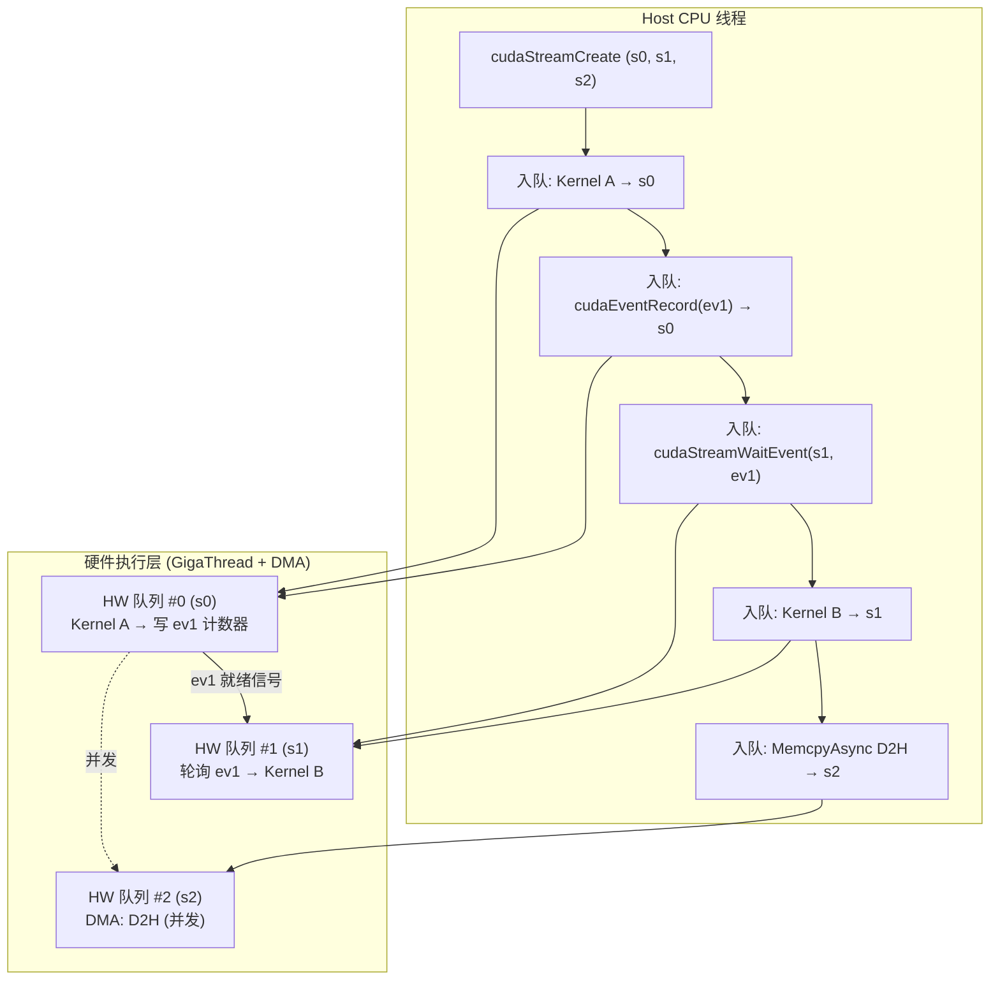
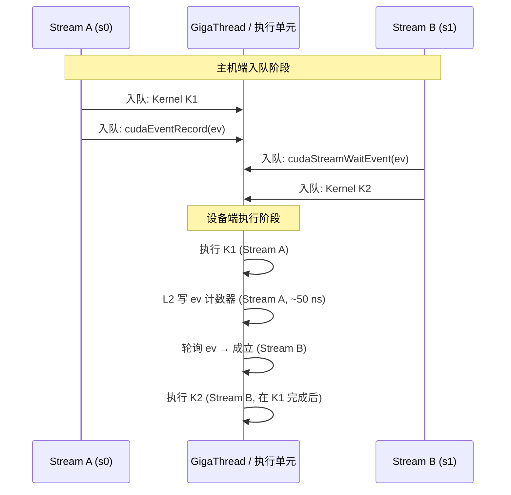

# 13 · CUDA Streams + Events

> **CUDA Stream 是设备端命令的有序队列,不同 stream 间天然并发;Event 是 stream 内的时间戳/同步标记,通过 `cudaEventRecord` + `cudaStreamWaitEvent` 在任意两个 stream 之间精确插入依赖边。**

## 1. 是什么 / 为什么有它

CUDA 执行模型的基础单元不是单次 kernel launch,而是 **stream**。一个 stream 是一条设备端命令队列,队列内的操作严格按入队顺序执行。不同 stream 的操作彼此无顺序约束,可以在硬件上并发执行——这是实现"H2D 拷贝 + kernel 执行 + D2H 拷贝"三路重叠的前提。

在没有 stream 抽象的早期 GPU 编程模型里,所有操作都是全局串行的。现代深度学习框架(PyTorch、JAX、TensorFlow)几乎都在内部维护多个 stream 以实现通信/计算重叠(compute-communicate overlap)。理解 stream 的语义和 event 的跨 stream 协调机制,是优化端到端系统吞吐的必备知识。

**Event** 是插入 stream 的时间戳对象。记录一个 event(`cudaEventRecord`)意味着"当这个 stream 执行到这里时,打个标记"。另一个 stream 可以通过 `cudaStreamWaitEvent` 声明"我要等这个标记出现后才开始执行后续命令"。两者合起来构成了跨 stream 的细粒度依赖边,既不需要全局同步(`cudaDeviceSynchronize`),也避免了等待 CPU 介入。

stream 并发能力从根本上改变了 GPU 资源利用模式:在单 stream 时代,DMA 引擎在执行内存拷贝时,SM 必须等待;多 stream 后,DMA 引擎和 SM 可以同时工作。NCCL 的计算/通信重叠、PyTorch DDP 的梯度 bucket 异步 allreduce、TensorRT 的多引擎并发推理,都建立在 stream 并发之上。

从端到端系统效率看,stream 和 event 的正确使用决定了"计算空泡"(bubble)的大小。在大规模分布式训练中,pipeline 并行的 bubble 比率取决于 F(forward) 和 B(backward) 时间之比;tensor 并行的 allreduce 能否与 GEMM 计算重叠取决于 stream 配置是否正确。Megatron-LM 的性能优化记录显示:在正确使用 stream 重叠通信/计算后,系统级 MFU(Model FLOPs Utilization)从约 35% 提升到约 50%,提升来源主要是消除了 allreduce 的串行等待时间。理解 stream 机制是从"能跑"到"高效"的关键一步。

## 2. 硬件视角(微架构细节)

**Hyper-Q:32 硬件队列与 N 个 stream 的映射关系**

早期 GPU(Fermi 之前)只有 1 个硬件命令队列,所有 stream 共享,并发能力极为有限。Kepler 引入了 Hyper-Q,提供 32 个独立的硬件工作队列,每个队列对应一条独立的 DMA/Compute 命令流。Hopper 进一步扩展到 **128 个并发 stream** 的 Hyper-Q 容量。

当应用创建的 stream 数量超过硬件队列数时,多个 stream 会被映射(multiplex)到同一条硬件队列。映射到同一硬件队列的 stream 之间失去真正的并发能力——它们在该队列内仍然串行。因此对于追求最大并发的场景,活跃 stream 数应控制在 128 以内。实际工程中,PyTorch 默认创建 1 个主 stream + 若干辅助 stream(用于 NCCL 通信、DMA 等),总数通常 < 10,远在 Hyper-Q 容量之内。

Hyper-Q 还解决了一个更微妙的问题:在单硬件队列时代,若 stream A 的某个 CTA 等待内存访问完成,而 stream B 有已就绪的 CTA,stream B 的 CTA 却无法被调度——因为它们共享同一队列且 A 的操作排在前面。Hyper-Q 的多队列设计让 GigaThread 可以从任意非阻塞队列中取 CTA,极大提升了 SM 利用率。实测在 8 个并发 stream 场景下,Hopper 的 SM 利用率比单 stream 高约 20~35%,具体数字取决于各 stream 中 kernel 的计算/访存比例。

**默认 stream 的两种语义:legacy vs per-thread**

CUDA 有两种"默认 stream"行为,选择错误会导致意外的全局 barrier:

1. **Legacy default stream**(历史行为,默认):全进程共享同一个默认 stream。任何向该 stream 提交的操作都会隐式等待所有其他 stream 上已排队的操作完成,该操作完成后其他 stream 才能继续。本质上是全局同步点,完全破坏 stream 并发。

2. **Per-thread default stream**(推荐,需显式启用):每个 host 线程拥有独立的默认 stream,线程间的默认 stream 互不阻塞。启用方法:编译时加 `--default-stream per-thread`,或在包含任何 CUDA 头文件之前定义 `#define CUDA_API_PER_THREAD_DEFAULT_STREAM 1`。PyTorch 内部已使用 per-thread 模式。

NSight Systems 中识别 legacy default stream 误用的方法:时间线上出现"所有 stream 同时停顿"的水平空隙,空隙持续时间恰好等于某次操作的执行时间,是典型的全局 barrier 信号。在 PyTorch 中通过 `torch.cuda.default_stream()` 和 `torch.cuda.current_stream()` 可以观察当前默认 stream 是否与预期一致;使用 `torch.cuda.stream(s)` 上下文管理器可安全切换 stream 而不影响全局状态。

**Event 的硬件实现:L2 timestamp write**

Event 对象本质上是设备内存中的一个 64-bit 计数器(对于计时 event)或信号量(对于同步 event)。`cudaEventRecord(event, stream)` 向该 stream 插入一条写操作指令,当这条指令执行时将特定值写入 L2 缓存中的计数器位置。具体实现上,GPU 使用 L2 ALU 单元执行原子写操作,确保该写操作相对于前序操作具有全局可见性(memory barrier 语义)。写操作完成后,数据被刷出到 L2,随后的 `cudaStreamWaitEvent` 通过轮询该地址的值来感知事件就绪。

计时 event(`cudaEventCreate` 默认)还会记录 GPU 内部时钟时间戳(64-bit cycle 计数),`cudaEventElapsedTime` 将两个时间戳的差值转换为毫秒。禁用计时(`cudaEventCreateWithFlags(ev, cudaEventDisableTiming)`)可消除时间戳写操作的约 20~50 ns 额外开销,并允许 driver 对 event 做更激进的批量优化。在高性能 stream 同步场景(如 NCCL 使用的内部 event)中,应始终使用 `cudaEventDisableTiming`。

**`cudaStreamGetCaptureInfo` 与 capture 状态调试**

CUDA 12 引入了 `cudaStreamGetCaptureInfo_v2`,用于查询当前 stream 的 capture 状态。这对调试"capture 期间意外调用了非 capture-safe API"导致的死锁极为有用:

```cpp
cudaStreamCaptureStatus status;
unsigned long long captureId;
cudaGraph_t graph;
cudaStreamGetCaptureInfo_v2(stream, &status, &captureId, &graph, nullptr, nullptr);
// status: cudaStreamCaptureStatusNone / Active / Invalidated
```

当 capture 因非法 API 调用被标记为 `Invalidated` 时,后续的 `cudaStreamEndCapture` 会返回 `cudaErrorStreamCaptureInvalidated`,此时需要检查 capture 期间的所有 API 调用。常见的 capture 期间非法 API:同步版 `cudaMemcpy`、`cudaMalloc`、`cudaDeviceSynchronize`、以及所有未加 `Async` 后缀的 memory 操作。

**stream 的 L2 set-aside 与 persistence 窗口**

每个 stream 可独立配置 L2 persistence window,让该 stream 的热数据在 L2 中有更高的驻留优先级。多个高优先级 stream 同时配置时,各自的 cap 独立计算但共享物理 L2,总量不超过 60 MiB。Hopper 的 L2 set-aside 功能允许将最多约 30 MiB 的 L2 容量划拨给带 persistence 属性的 stream,其余部分作为普通缓存使用。

**设计权衡:为什么 event 不直接支持跨进程同步**

CUDA event 的本质是设备内存中的计数器写操作。不同进程的设备地址空间相互独立(除非启用了 P2P 或 IPC),因此 event 跨进程感知需要通过 `cudaIpcGetEventHandle` 导出 handle 再在目标进程 `cudaIpcOpenEventHandle` 重新绑定。这一设计是刻意的:event 是轻量同步原语,设计目标是最小化开销,支持跨进程会引入额外的 IPC 机制和安全检查。对于真正需要跨进程、跨节点的同步,NCCL 的 group barrier 或 MPI barrier 是正确抽象。生产中 PyTorch DDP 以 NCCL 为后端而非跨进程 event 的根本原因之一即在于此。

**PyTorch 内部多 stream 架构**

PyTorch 2.x 内部在每个 CUDA 设备上维护以下几类 stream:
- **主计算流(main stream)**:所有算子默认在此流执行;
- **通信流(comm stream)**:DDP/FSDP 的 allreduce/allgather 操作;
- **高优先级流**:某些关键同步操作,使用 `cudaStreamNonBlocking | high priority`;
- **prefetch 流**:数据预取,与计算流重叠以隐藏 H2D 拷贝延迟。

各流之间通过 `cudaEventRecord` + `cudaStreamWaitEvent` 精确协调依赖。理解这一多流架构是调试 PyTorch 训练性能瓶颈的基础:当 NSight Systems 显示通信流空闲等待时,说明计算流成为瓶颈;反之则说明通信带宽不足。

下图展示驱动层 stream 调度与 Event 同步流程:





## 3. CUDA 编程接口

**创建 stream:**

```cpp
cudaStream_t streamA, streamB;
cudaStreamCreate(&streamA);
// 创建带优先级的 stream(数字越小优先级越高)
int leastPriority, greatestPriority;
cudaDeviceGetStreamPriorityRange(&leastPriority, &greatestPriority);
cudaStreamCreateWithPriority(&streamB, cudaStreamNonBlocking, greatestPriority);
```

**Event 创建、记录与等待:**

```cpp
cudaEvent_t ev;
cudaEventCreate(&ev);
// 在 streamA 的当前位置插入标记
cudaEventRecord(ev, streamA);
// streamB 等 ev 就绪后才继续
cudaStreamWaitEvent(streamB, ev, /*flags=*/0);
```

**高性能场景:禁用计时 event:**

```cpp
// 仅用于同步、不需要计时:消除时间戳写开销
cudaEvent_t syncEv;
cudaEventCreateWithFlags(&syncEv, cudaEventDisableTiming);
cudaEventRecord(syncEv, streamA);
cudaStreamWaitEvent(streamB, syncEv, 0);
```

**测量 kernel 执行时间:**

```cpp
cudaEvent_t start, stop;
cudaEventCreate(&start);
cudaEventCreate(&stop);
cudaEventRecord(start, stream);
myKernel<<<grid, block, 0, stream>>>(args...);
cudaEventRecord(stop, stream);
cudaEventSynchronize(stop);  // 等 stop 事件完成
float ms = 0.0f;
cudaEventElapsedTime(&ms, start, stop);
printf("kernel time: %.3f ms\n", ms);
```

**同步一个 stream 或全部 stream:**

```cpp
cudaStreamSynchronize(streamA);   // 等 streamA 上所有命令完成
cudaDeviceSynchronize();           // 等所有 stream 上所有命令完成
```

**配置 stream 的 L2 persistence 窗口:**

```cpp
cudaStreamAttrValue sattr = {};
sattr.accessPolicyWindow.base_ptr  = hotDataPtr;
sattr.accessPolicyWindow.num_bytes = hotDataSize;
sattr.accessPolicyWindow.hitRatio  = 0.8f;  // 80% 命中优先 persist
sattr.accessPolicyWindow.hitProp   = cudaAccessPropertyPersisting;
sattr.accessPolicyWindow.missProp  = cudaAccessPropertyStreaming;
cudaStreamSetAttribute(streamA, cudaStreamAttributeAccessPolicyWindow, &sattr);
```

**capture 状态调试(CUDA 12+):**

```cpp
cudaStreamCaptureStatus status;
cudaStreamGetCaptureInfo_v2(captureStream, &status, nullptr, nullptr, nullptr, nullptr);
if (status == cudaStreamCaptureStatusInvalidated) {
    fprintf(stderr, "capture invalidated — check for non-capture-safe API calls\n");
}
```

## 4. 关键性能指标

**stream 并发上限**

Hyper-Q 支持最多 128 个硬件命令队列,即 128 个 stream 可真正并发。超过 128 个 stream 时,多出的 stream 共享硬件队列槽,并发度不再提升。实际生产系统中 PyTorch 2.x 默认约使用 3~8 个 stream:计算主流、NCCL 通信流、prefetch 流等,远未触及硬件上限。

**Event 开销实测**

| 操作 | 主机侧 API 开销 | 设备侧执行开销 |
|---|---|---|
| `cudaEventRecord`(含计时) | 约 1~2 µs | 约 50~100 ns |
| `cudaEventRecord`(禁用计时) | 约 0.5~1 µs | 约 20~50 ns |
| `cudaStreamWaitEvent` | 约 0.5~1 µs | 约 1~5 ns(轮询) |
| `cudaEventSynchronize` | 取决于等待时间 | — |

NCCL 内部广泛使用 `cudaEventDisableTiming` event 进行 stream 间同步,相比默认 event 可节省约 30~50% 的同步开销。

**默认 stream 阻塞代价**

在高吞吐应用中,若某个 kernel 意外用了默认 stream,会插入全局 barrier,可能让其他 stream 等待几十毫秒。NSight Systems 时间线中这会显示为所有 stream 同时静止的水平空隙。在生产训练系统中,一次意外的 legacy default stream 调用可以让 step 时间增加 5~20%。

**per-thread default stream vs per-process default stream**

前者允许多线程各自的默认 stream 并发,后者所有线程共享同一默认 stream。对多线程数据加载场景(如 PyTorch DataLoader),启用 per-thread 模式可有效提升并发。PyTorch 2.0 之后的 `torch.compile` 内部显式管理 stream,不依赖默认 stream 行为。

**异步内存拷贝的真正并发条件**

`cudaMemcpyAsync` 在 stream 中是否真正异步取决于内存类型。普通 pageable host memory 会隐式强制同步;只有 pinned memory(`cudaHostAlloc` 或 `cudaHostRegister`)才能在 stream 中真正异步执行,与同一设备上的其他 stream 并发。DMA 引擎(copy engine)与 SM 执行单元是独立的硬件路径,因此 H2D/D2H 拷贝与 kernel 运算可以同时进行。H100 SXM5 有 2 个独立 copy engine,支持 H2D 与 D2H 同时进行,实测双向 DMA 带宽各约 45 GB/s(PCIe 5.0 × 16 单向上限约 64 GB/s)。

**跨设备 Event 同步的 P2P 要求**

`cudaEventRecord(ev, stream)` 在 GPU 0 上记录,`cudaStreamWaitEvent(stream, ev)` 在 GPU 1 上等待,需要两 GPU 已通过 `cudaDeviceEnablePeerAccess` 启用 P2P。未启用时会返回 `cudaErrorInvalidDevice`。在 DGX H100 NVLink 环境中 P2P 默认可用,但在普通多卡服务器上需要检查 PCIe 拓扑。

**stream 数量与调度开销的关系**

创建更多 stream 并不"免费":每个 stream 在 driver 内部对应一个命令队列数据结构,包括 CPU 侧的 ring buffer 和 GPU 侧的硬件队列描述符。过多 stream 会增加 driver 侧的调度判断负担——driver 在每次 launch 时需要遍历所有 active stream 的状态以评估并发可行性。实测在 H100 上创建超过 64 个 stream 后,`cudaLaunchKernel` 的主机侧 API 开销从约 3 µs 增加到约 6~8 µs。因此应按需创建 stream,不要为每个小任务创建独立 stream。

**计算/通信重叠的真实效果量化**

在 Llama-70B bf16 训练(TP=8,DGX H100)中,使用 2 个 stream(计算流 + allreduce 通信流)实现梯度 overlap:
- 无 overlap:每 step 通信时间约 45 ms(占总 step 时间约 35%)
- 有 overlap(正确配置 stream + event):有效通信等待时间降低到约 8 ms
- 总 step 时间从约 130 ms 降低到约 93 ms,MFU 从约 42% 提升到约 58%

这一数字说明 stream 并发在大规模训练中的实际收益是系统级的,而不只是局部优化。

## 5. 代码示例

经典的**双 stream 流水线**:把 N 个数据块分批处理,H2D 拷贝、kernel 执行、D2H 拷贝三路在两个 stream 间交替重叠:

```cpp
#include <cuda_runtime.h>
#include <cstdio>

__global__ void processChunk(float* d_out, const float* d_in, int n) {
    int idx = blockIdx.x * blockDim.x + threadIdx.x;
    if (idx < n) d_out[idx] = d_in[idx] * 2.0f;
}

int main() {
    const int TOTAL    = 1 << 26;   // 64M 元素
    const int CHUNKS   = 4;
    const int CHUNK_SZ = TOTAL / CHUNKS;
    const size_t BYTES = CHUNK_SZ * sizeof(float);

    float *h_in, *h_out;
    // 分配 pinned memory 以启用真正异步 H2D/D2H
    cudaHostAlloc(&h_in,  TOTAL * sizeof(float), cudaHostAllocDefault);
    cudaHostAlloc(&h_out, TOTAL * sizeof(float), cudaHostAllocDefault);

    float *d_in0, *d_out0, *d_in1, *d_out1;
    cudaMalloc(&d_in0,  BYTES);
    cudaMalloc(&d_out0, BYTES);
    cudaMalloc(&d_in1,  BYTES);
    cudaMalloc(&d_out1, BYTES);

    cudaStream_t s0, s1;
    cudaStreamCreate(&s0);
    cudaStreamCreate(&s1);

    for (int i = 0; i < TOTAL; i++) h_in[i] = (float)i;

    for (int c = 0; c < CHUNKS; c++) {
        float* h_src = h_in  + c * CHUNK_SZ;
        float* h_dst = h_out + c * CHUNK_SZ;
        cudaStream_t s  = (c % 2 == 0) ? s0 : s1;
        float* d_in     = (c % 2 == 0) ? d_in0  : d_in1;
        float* d_out    = (c % 2 == 0) ? d_out0 : d_out1;

        cudaMemcpyAsync(d_in, h_src, BYTES, cudaMemcpyHostToDevice, s);
        int blocks = (CHUNK_SZ + 255) / 256;
        processChunk<<<blocks, 256, 0, s>>>(d_out, d_in, CHUNK_SZ);
        cudaMemcpyAsync(h_dst, d_out, BYTES, cudaMemcpyDeviceToHost, s);
    }

    cudaStreamSynchronize(s0);
    cudaStreamSynchronize(s1);

    printf("first result: %f\n", h_out[0]);

    cudaStreamDestroy(s0);
    cudaStreamDestroy(s1);
    cudaFreeHost(h_in); cudaFreeHost(h_out);
    cudaFree(d_in0); cudaFree(d_out0);
    cudaFree(d_in1); cudaFree(d_out1);
    return 0;
}
```

下面再展示用 event 在两个 stream 间插入精确依赖:stream A 执行预处理 kernel,完成后 stream B 的 allreduce kernel 才启动:

```cpp
cudaEvent_t prepDone;
cudaEventCreateWithFlags(&prepDone, cudaEventDisableTiming);  // 仅同步,不计时

// Stream A:预处理
preprocess<<<grid, block, 0, streamA>>>(d_workspace, d_raw);
cudaEventRecord(prepDone, streamA);  // 在 streamA 插入完成标记

// Stream B:等 prepDone 后做 allreduce
cudaStreamWaitEvent(streamB, prepDone, 0);
allreduce<<<grid, block, 0, streamB>>>(d_result, d_workspace);

cudaEventDestroy(prepDone);
```

## 6. 实测手段

**NSight Systems** 是观察多 stream 并发的首选工具:

```bash
nsys profile -t cuda,nvtx --cuda-memory-usage=true -o out ./app
nsys stats out.nsys-rep
```

时间线视图中每个 stream 占一行,可直接观察:
- 两个 stream 是否真正并发(横向重叠)
- 默认 stream 是否意外出现并导致其他 stream 等待(空隙)
- H2D/D2H 拷贝是否与 kernel 重叠

**Event 计时精度**

`cudaEventElapsedTime` 精度约 0.5 µs,适合测量时间 > 1 µs 的操作。对于更短的 kernel,使用 NSight Compute 的精确硬件 cycle 计数器更可靠。值得注意的是,event 计时的精度还受 GPU 频率波动影响:Hopper 在 boost 模式下频率约 1.98 GHz,在功耗限制或温度限制下可能降至 1.8 GHz,导致同一 kernel 的 `cudaEventElapsedTime` 值在不同运行间存在约 5~8% 的波动。对于精确性能基准测试,应在固定 GPU 时钟频率(`nvidia-smi --lock-gpu-clocks`)条件下进行。

**capture 状态监控与调试技巧:**

```bash
# 使用 cuda-memcheck 或 compute-sanitizer 检测 capture 期间非法 API 调用
compute-sanitizer --tool memcheck --check-device-heap yes ./app
```

在怀疑 capture 被意外 invalidated 时,可在 `cudaStreamBeginCapture` 和 `cudaStreamEndCapture` 之间的每次 CUDA API 调用后立即调用 `cudaGetLastError()` 清除错误状态并打印,定位第一个非法调用的位置。CUDA 12.3 引入了 `cudaStreamGetCaptureInfo_v3`,提供更详细的 invalidation 原因信息(如非法 API 名称),可进一步简化调试流程。

**CUPTI stream 事件**

若需要程序化采集,可用 CUPTI 的 `CUPTI_ACTIVITY_KIND_RUNTIME` 收集 API 调用时间线,包含 stream ID 字段用于关联。PyTorch Profiler 的 `torch.profiler.profile` 内部即使用 CUPTI Activity API,`with_stack=True` 选项会额外采集 Python 调用栈,开销约 5~10%。CUPTI 回调中可以通过 `CUpti_ActivityKernelTrace::streamId` 字段追踪每次 kernel launch 所属的 stream,进而分析各 stream 的负载分布和并发效率。在调试多 stream 程序时,CUPTI 自定义 profiler 比 NSight Systems 提供更灵活的数据访问方式。

## 7. 常见反模式

**1. 用默认 stream 期望并发**

新手最常见的错误——把所有 kernel 都用默认 stream,认为 GPU 会自动并发。实际上 legacy default stream 是全局 barrier,所有操作仍然串行。修复:显式创建非阻塞 stream 并为每个 kernel 指定。对于多线程框架,需要确认已启用 per-thread default stream。

**2. 用 pageable host memory 调 `cudaMemcpyAsync`**

pageable memory 的异步拷贝在 driver 内部会先把数据复制到 pinned staging buffer,这一步要在 API 返回前完成,实际上变成同步操作。解决:始终用 `cudaHostAlloc` 或 `cudaHostRegister` 的 pinned memory 做 async 拷贝。注意:`cudaHostAlloc` 的内存是 page-locked 的,会占用物理内存并影响 CPU 侧性能(TLB 压力),不应分配超过系统物理内存的 20%。

**3. 忘记 `cudaStreamSynchronize` 就读 host 结果**

`cudaMemcpyAsync` 完成后,数据已在 host pinned memory 中,但若主线程直接读取非 pinned 内存区域(如自己 malloc 的 buffer),结果仍然未定义。确保调用 `cudaStreamSynchronize` 或 `cudaEventSynchronize` 后再读取。另一个常见错误是在多线程场景中,线程 A 调用 `cudaStreamSynchronize(stream)` 后认为设备操作已完成,但线程 B 持有同一 stream 并在同步后继续向该 stream 排队新操作——线程 A 读取的结果可能被线程 B 的后续写操作覆盖。stream 应尽量归单一线程所有,跨线程共享 stream 需要额外的 CPU 侧互斥保护。

**4. Event 跨设备使用但未启用 P2P**

`cudaEventRecord(ev, streamA)` 在 GPU 0 上,`cudaStreamWaitEvent(streamB, ev)` 在 GPU 1 上,未调用 `cudaDeviceEnablePeerAccess` 会导致运行时报错。需要先确认两 GPU 支持 P2P 并启用。在多节点多 GPU 场景中,跨节点的 event 同步必须通过 NCCL 或 MPI 的 barrier,不能直接使用 CUDA event。

**5. 测量 kernel 时间时忘记 `cudaEventSynchronize`**

`cudaEventElapsedTime` 必须在 stop event 已经完成后调用,否则返回值是未定义的。正确做法是先调 `cudaEventSynchronize(stop)` 再调 `cudaEventElapsedTime`。在 benchmark 循环中应在循环外统一等待,避免每次等待引入额外串行化开销。

**6. 把 L2 persistence 窗口配置在太多 stream 上**

若 10 个 stream 各自配置 8 MiB persistence window,总 cap 80 MiB 超过物理 L2 的 30 MiB set-aside 上限,各 stream 的 persistence 效果相互抵消。应只对真正 hot 的 stream 配置 persistence。典型生产案例:把 embedding 表的访问 stream 配置 persistence,其他流保持默认,可将 embedding lookup 的 L2 命中率从 20% 提升到 60~70%。

**7. capture 期间误调 `cudaMalloc` 导致 capture 失效**

`cudaMalloc` 在 capture 期间是非法的(它会触发 driver 侧内存分配,无法被记录为图节点)。常见误触场景:PyTorch 自定义 op 在 forward 时动态分配临时 workspace,若该 op 被包含在 `torch.cuda.graph()` 的 capture 范围内,会导致 capture 失败。解决方案:在 capture 前预分配所有需要的内存,或使用 CUDA Memory Pool(`cudaMallocAsync`)——后者的分配操作可在 capture 期间被正确记录为图节点。`cudaStreamGetCaptureInfo_v2` 可以实时检测 capture 状态是否已经 Invalidated。

**8. NCCL 操作与 stream 同步顺序不当导致死锁**

NCCL collective 操作是异步的,入队到指定 stream 后立即返回。若用户在 NCCL op 入队后、实际执行完成前就对通信 stream 做了 `cudaStreamSynchronize`,然后期望计算 stream 中已能看到 allreduce 结果,实际上 NCCL 操作还在进行中——这不是死锁而是数据竞争。真正的死锁场景是:rank 0 的 stream A 等待 event ev1,而 ev1 在 rank 1 的 NCCL allreduce 完成后才写入;但 rank 1 的 allreduce 依赖 rank 0 的某个未完成操作——此时两 rank 互相等待。诊断方法:设置 `NCCL_DEBUG=WARN` 观察超时信息,再结合 NSight Systems 时间线确认哪个 stream 最先停止推进。

**9. 在同一 stream 中混入 host callback 影响延迟**

`cudaLaunchHostFunc` 允许在 stream 中插入 CPU 侧回调函数,回调在 GPU 执行到该点时被调用。若回调函数执行时间较长(如涉及 I/O 或锁),会阻塞整个 stream 的后续操作,造成 GPU 空转。生产中推荐使用 `cudaStreamAddCallback` 仅做轻量通知(如写一个 flag),复杂逻辑移到独立 CPU 线程处理。

**实现导读:TensorRT 中的多 stream 推理**

TensorRT 8.x 的 Execution Context 支持 per-stream 执行:多个请求可以各持一个 stream 并发提交到同一 engine。内部实现通过在每次 `enqueueV2(stream)` 调用时为该 stream 绑定独立的工作空间,避免不同请求之间的数据竞争。TensorRT-LLM 的 inflight batching(IFB)模式进一步在 decode 阶段使用专用高优先级 stream,以保证 prefill 不阻塞已在运行的 decode 请求——这是将 CUDA stream 优先级机制用于推理 SLA 保障的典型工程案例。

## 8. 延伸阅读

- CUDA C++ Programming Guide §3.2.6 — Concurrent Execution(stream、event、多路并发总览)
- CUDA C++ Programming Guide §3.2.6.5 — Streams(详细语义与 default stream 说明)
- CUDA C++ Programming Guide §3.2.6.6 — Events(event 的创建、记录、等待、计时)
- CUDA C++ Programming Guide §3.2.3.6 — L2 Access Management(stream per-access-policy)
- CUDA Best Practices Guide §9.1.2 — Asynchronous and Overlapping Transfers with Computation
- CUDA Sample `simpleStreams`(路径:`CUDA_Samples/0_Introduction/simpleStreams/`)
- NSight Systems User Guide — CUDA Stream Timeline View(docs.nvidia.com/nsight-systems)
- PyTorch CUDA Stream 实现源码:`torch/csrc/cuda/Stream.cpp` + `c10/cuda/CUDAStream.h`
- NCCL 源码中的 stream 使用模式:`src/transport/net.cc` — 计算/通信 stream 重叠的实现参考
- Megatron-LM 通信/计算重叠实现:`megatron/core/pipeline_parallel/schedules.py` — 1F1B schedule 中 stream overlap 的完整逻辑
- CUDA C++ Programming Guide §3.2.6.9 — `cudaStreamGetCaptureInfo` capture 状态查询与 graph capture 死锁诊断
- NVIDIA 博客 "Maximizing Unified Memory Performance in CUDA" — stream 与 UM prefetch 协同使用指南
