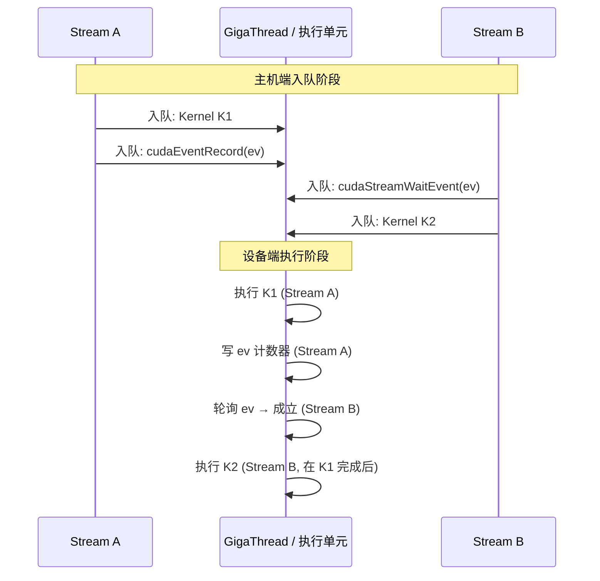

# 13 · CUDA Streams + Events

> **CUDA Stream 是设备端命令的有序队列,不同 stream 间天然并发;Event 是 stream 内的时间戳/同步标记,通过 `cudaEventRecord` + `cudaStreamWaitEvent` 在任意两个 stream 之间精确插入依赖边。**

## 1. 是什么 / 为什么有它

CUDA 执行模型的基础单元不是单次 kernel launch,而是 **stream**。一个 stream 是一条设备端命令队列,队列内的操作严格按入队顺序执行。不同 stream 的操作彼此无顺序约束,可以在硬件上并发执行——这是实现"H2D 拷贝 + kernel 执行 + D2H 拷贝"三路重叠的前提。

在没有 stream 抽象的早期 GPU 编程模型里,所有操作都是全局串行的。现代深度学习框架(PyTorch、JAX、TensorFlow)几乎都在内部维护多个 stream 以实现通信/计算重叠(compute-communicate overlap)。理解 stream 的语义和 event 的跨 stream 协调机制,是优化端到端系统吞吐的必备知识。

**Event** 是插入 stream 的时间戳对象。记录一个 event(`cudaEventRecord`)意味着"当这个 stream 执行到这里时,打个标记"。另一个 stream 可以通过 `cudaStreamWaitEvent` 声明"我要等这个标记出现后才开始执行后续命令"。两者合起来构成了跨 stream 的细粒度依赖边,既不需要全局同步(`cudaDeviceSynchronize`),也避免了等待 CPU 介入。

## 2. 硬件视角(微架构细节)

在硬件层面,每个 stream 对应 GigaThread 引擎中的一个**命令队列通道**。Hopper 支持最多 **128 个并发 stream**(Hyper-Q 特性),每个 stream 的命令都可以被 GigaThread 独立调度。这意味着同一时刻 128 个 stream 的 CTA 都可以排队等待 SM 空闲槽位,大大减少了 SM 因等待下一个命令而空转的时间。

**默认 stream(NULL stream)的特殊行为:** 调用 `kernel<<<...>>>` 不指定 stream 时,使用 legacy default stream,它会隐式阻塞所有其他 stream——即 default stream 上的命令开始前,所有已入队的其他 stream 命令都要完成;default stream 命令完成后,其他 stream 才能继续。这使默认 stream 成为全局同步屏障,破坏并发。

**per-thread default stream** 模式(`--default-stream per-thread` 编译选项或 `#define CUDA_API_PER_THREAD_DEFAULT_STREAM`)让每个 host 线程拥有独立的默认 stream,不再全局阻塞,适合多线程应用。

**Event 硬件实现:** Event 对象本质上是一个设备内存中的 64-bit 计数器。`cudaEventRecord(event, stream)` 向该 stream 插入一条写操作指令,当这条指令执行时将特定值写入计数器。`cudaStreamWaitEvent(stream, event)` 向目标 stream 插入一条轮询指令,等到计数器达到目标值后才放行后续命令。整个过程在设备侧完成,不需要 CPU 参与。



**L2 set-aside 与 stream:** 每个 stream 可独立配置 L2 persistence window,让该 stream 的热数据在 L2 中有更高的驻留优先级。多个高优先级 stream 同时配置时,各自的 cap 独立计算但共享物理 L2,总量不超过 60 MiB。Hopper 的 L2 set-aside 功能允许将最多约 30 MiB 的 L2 容量划拨给带 persistence 属性的 stream,其余部分作为普通缓存使用。

## 3. CUDA 编程接口

**创建 stream:**

```cpp
cudaStream_t streamA, streamB;
cudaStreamCreate(&streamA);
// 创建带优先级的 stream(数字越小优先级越高)
int leastPriority, greatestPriority;
cudaDeviceGetStreamPriorityRange(&leastPriority, &greatestPriority);
cudaStreamCreateWithPriority(&streamB, cudaStreamNonBlocking, greatestPriority);
```

**Event 创建、记录与等待:**

```cpp
cudaEvent_t ev;
cudaEventCreate(&ev);
// 在 streamA 的当前位置插入标记
cudaEventRecord(ev, streamA);
// streamB 等 ev 就绪后才继续
cudaStreamWaitEvent(streamB, ev, /*flags=*/0);
```

**测量 kernel 执行时间:**

```cpp
cudaEvent_t start, stop;
cudaEventCreate(&start);
cudaEventCreate(&stop);
cudaEventRecord(start, stream);
myKernel<<<grid, block, 0, stream>>>(args...);
cudaEventRecord(stop, stream);
cudaEventSynchronize(stop);  // 等 stop 事件完成
float ms = 0.0f;
cudaEventElapsedTime(&ms, start, stop);
printf("kernel time: %.3f ms\n", ms);
```

**同步一个 stream 或全部 stream:**

```cpp
cudaStreamSynchronize(streamA);   // 等 streamA 上所有命令完成
cudaDeviceSynchronize();           // 等所有 stream 上所有命令完成
```

**配置 stream 的 L2 persistence 窗口:**

```cpp
cudaStreamAttrValue sattr = {};
sattr.accessPolicyWindow.base_ptr  = hotDataPtr;
sattr.accessPolicyWindow.num_bytes = hotDataSize;
sattr.accessPolicyWindow.hitRatio  = 0.8f;  // 80% 命中优先 persist
sattr.accessPolicyWindow.hitProp   = cudaAccessPropertyPersisting;
sattr.accessPolicyWindow.missProp  = cudaAccessPropertyStreaming;
cudaStreamSetAttribute(streamA, cudaStreamAttributeAccessPolicyWindow, &sattr);
```

## 4. 关键性能指标

**stream 并发上限:** Hyper-Q 支持最多 128 个硬件命令队列,即 128 个 stream 可真正并发。超过 128 个 stream 时,多出的 stream 共享硬件队列槽,并发度不再提升。

**Event 开销:** `cudaEventRecord` 的主机侧 API 调用约 1-2 µs;设备侧执行写计数器约 50-100 ns(~50 cycle)。`cudaEventSynchronize` 触发 CPU 忙轮询或睡眠等待,建议只在必须同步时使用,不要在每次 kernel 后都调用。

**默认 stream 阻塞代价:** 在高吞吐应用中,若某个 kernel 意外用了默认 stream,会插入全局 barrier,可能让其他 stream 等待几十毫秒。NSight Systems 时间线中这会显示为所有 stream 同时静止的水平空隙。

**per-thread default stream vs per-process default stream:** 前者允许多线程各自的默认 stream 并发,后者所有线程共享同一默认 stream。对多线程数据加载场景(如 PyTorch DataLoader),启用 per-thread 模式可有效提升并发。

**异步内存拷贝的真正并发条件:** `cudaMemcpyAsync` 在 stream 中是否真正异步取决于内存类型。普通 pageable host memory 会隐式强制同步;只有 pinned memory(`cudaHostAlloc` 或 `cudaHostRegister`)才能在 stream 中真正异步执行,与同一设备上的其他 stream 并发。DMA 引擎(copy engine)与 SM 执行单元是独立的硬件路径,因此 H2D/D2H 拷贝与 kernel 运算可以同时进行,不过两者共享 PCIe 或 NVLink 带宽,当同时有多个方向的 DMA 时需注意带宽分配。

## 5. 代码示例

经典的**双 stream 流水线**:把 N 个数据块分批处理,H2D 拷贝、kernel 执行、D2H 拷贝三路在两个 stream 间交替重叠:

```cpp
#include <cuda_runtime.h>
#include <cstdio>

__global__ void processChunk(float* d_out, const float* d_in, int n) {
    int idx = blockIdx.x * blockDim.x + threadIdx.x;
    if (idx < n) d_out[idx] = d_in[idx] * 2.0f;
}

int main() {
    const int TOTAL    = 1 << 26;   // 64M 元素
    const int CHUNKS   = 4;
    const int CHUNK_SZ = TOTAL / CHUNKS;
    const size_t BYTES = CHUNK_SZ * sizeof(float);

    float *h_in, *h_out;
    // 分配 pinned memory 以启用真正异步 H2D/D2H
    cudaHostAlloc(&h_in,  TOTAL * sizeof(float), cudaHostAllocDefault);
    cudaHostAlloc(&h_out, TOTAL * sizeof(float), cudaHostAllocDefault);

    float *d_in0, *d_out0, *d_in1, *d_out1;
    cudaMalloc(&d_in0,  BYTES);
    cudaMalloc(&d_out0, BYTES);
    cudaMalloc(&d_in1,  BYTES);
    cudaMalloc(&d_out1, BYTES);

    cudaStream_t s0, s1;
    cudaStreamCreate(&s0);
    cudaStreamCreate(&s1);

    // 初始化输入数据(省略)
    for (int i = 0; i < TOTAL; i++) h_in[i] = (float)i;

    for (int c = 0; c < CHUNKS; c++) {
        float* h_src = h_in  + c * CHUNK_SZ;
        float* h_dst = h_out + c * CHUNK_SZ;
        cudaStream_t s  = (c % 2 == 0) ? s0 : s1;
        float* d_in     = (c % 2 == 0) ? d_in0  : d_in1;
        float* d_out    = (c % 2 == 0) ? d_out0 : d_out1;

        // H2D 拷贝(异步,在 stream s 中排队)
        cudaMemcpyAsync(d_in, h_src, BYTES, cudaMemcpyHostToDevice, s);
        // kernel 在同一 stream 中排队,依赖 H2D 完成
        int blocks = (CHUNK_SZ + 255) / 256;
        processChunk<<<blocks, 256, 0, s>>>(d_out, d_in, CHUNK_SZ);
        // D2H 拷贝在 kernel 之后排队
        cudaMemcpyAsync(h_dst, d_out, BYTES, cudaMemcpyDeviceToHost, s);
    }

    // 等两个 stream 全部完成
    cudaStreamSynchronize(s0);
    cudaStreamSynchronize(s1);

    printf("first result: %f\n", h_out[0]);

    cudaStreamDestroy(s0);
    cudaStreamDestroy(s1);
    cudaFreeHost(h_in); cudaFreeHost(h_out);
    cudaFree(d_in0); cudaFree(d_out0);
    cudaFree(d_in1); cudaFree(d_out1);
    return 0;
}
```

下面再展示用 event 在两个 stream 间插入精确依赖:stream A 执行预处理 kernel,完成后 stream B 的 allreduce kernel 才启动:

```cpp
cudaEvent_t prepDone;
cudaEventCreate(&prepDone);

// Stream A:预处理
preprocess<<<grid, block, 0, streamA>>>(d_workspace, d_raw);
cudaEventRecord(prepDone, streamA);  // 在 streamA 插入完成标记

// Stream B:等 prepDone 后做 allreduce
cudaStreamWaitEvent(streamB, prepDone, 0);
allreduce<<<grid, block, 0, streamB>>>(d_result, d_workspace);

cudaEventDestroy(prepDone);
```

## 6. 实测手段

**NSight Systems** 是观察多 stream 并发的首选工具:

```bash
nsys profile -t cuda,nvtx --cuda-memory-usage=true -o out ./app
nsys stats out.nsys-rep
```

时间线视图中每个 stream 占一行,可直接观察:
- 两个 stream 是否真正并发(横向重叠)
- 默认 stream 是否意外出现并导致其他 stream 等待(空隙)
- H2D/D2H 拷贝是否与 kernel 重叠

**Event 计时精度:** `cudaEventElapsedTime` 精度约 0.5 µs,适合测量时间 > 1 µs 的操作。对于更短的 kernel,使用 NSight Compute 的精确硬件 cycle 计数器更可靠。

**`nvidia-smi`** 快速确认设备是否空闲:

```bash
nvidia-smi dmon -s pu -d 1  # 每秒显示 power 和利用率
```

**CUPTI stream 事件:** 若需要程序化采集,可用 CUPTI 的 `CUPTI_ACTIVITY_KIND_RUNTIME` 收集 API 调用时间线,包含 stream ID 字段用于关联。

## 7. 常见反模式

**1. 用默认 stream 期望并发:** 新手最常见的错误——把所有 kernel 都用默认 stream,认为 GPU 会自动并发。实际上 legacy default stream 是全局 barrier,所有操作仍然串行。修复:显式创建非阻塞 stream 并为每个 kernel 指定。

**2. 用 pageable host memory 调 `cudaMemcpyAsync`:** pageable memory 的异步拷贝在 driver 内部会先把数据复制到 pinned staging buffer,这一步要在 API 返回前完成,实际上变成同步操作。解决:始终用 `cudaHostAlloc` 或 `cudaHostRegister` 的 pinned memory 做 async 拷贝。

**3. 忘记 `cudaStreamSynchronize` 就读 host 结果:** `cudaMemcpyAsync` 完成后,数据已在 host pinned memory 中,但若主线程直接读取非 pinned 内存区域(如自己 malloc 的 buffer),结果仍然未定义。确保调用 `cudaStreamSynchronize` 或 `cudaEventSynchronize` 后再读取。

**4. Event 跨设备使用但未启用 P2P:** `cudaEventRecord(ev, streamA)` 在 GPU 0 上,`cudaStreamWaitEvent(streamB, ev)` 在 GPU 1 上,未调用 `cudaDeviceEnablePeerAccess` 会导致运行时报错。需要先确认两 GPU 支持 P2P 并启用。

**5. 测量 kernel 时间时忘记 `cudaEventSynchronize`:** `cudaEventElapsedTime` 必须在 stop event 已经完成后调用,否则返回值是未定义的。正确做法是先调 `cudaEventSynchronize(stop)` 再调 `cudaEventElapsedTime`。

**6. 把 L2 persistence 窗口配置在太多 stream 上:** 若 10 个 stream 各自配置 8 MiB persistence window,总 cap 80 MiB 超过物理 L2 的 30 MiB set-aside 上限,各 stream 的 persistence 效果相互抵消。应只对真正 hot 的 stream 配置 persistence。

## 8. 延伸阅读

- CUDA C++ Programming Guide §3.2.6 — Concurrent Execution(stream、event、多路并发总览)
- CUDA C++ Programming Guide §3.2.6.5 — Streams(详细语义与 default stream 说明)
- CUDA C++ Programming Guide §3.2.6.6 — Events(event 的创建、记录、等待、计时)
- CUDA C++ Programming Guide §3.2.3.6 — L2 Access Management(stream per-access-policy)
- CUDA Best Practices Guide §9.1.2 — Asynchronous and Overlapping Transfers with Computation
- CUDA Sample `simpleStreams`(路径:`CUDA_Samples/0_Introduction/simpleStreams/`)
- NSight Systems User Guide — CUDA Stream Timeline View(docs.nvidia.com/nsight-systems)
