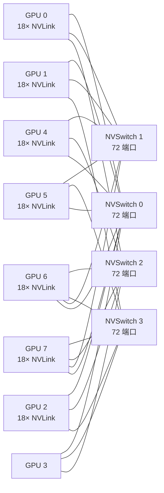

# 14 · NVLink + NVSwitch

> **NVLink 4 是 GPU 间高带宽点对点链路,单卡 900 GB/s 双向总带宽;NVSwitch 3 是非阻塞 crossbar 交换机,让 8 GPU DGX H100 形成全连接网络,并通过 SHARP 把 allreduce 卸载到交换机内部。**

## 1. 是什么 / 为什么有它

深度学习训练规模不断扩大,单卡显存和算力早已不够,多卡并行训练成为常态。多卡之间的数据传输带宽决定了通信是否成为瓶颈。PCIe 5.0 × 16 理论带宽约 64 GB/s(双向),这对于大模型每步需要传输数十 GB 梯度的场景远远不够。

**NVLink** 是 NVIDIA 设计的高带宽、低延迟 GPU 间互连协议。Hopper H100 使用的是第四代 NVLink(NVLink 4),每条 NVLink 4 链路提供 25 GB/s 单向带宽,SXM5 封装的 H100 配备 18 条 NVLink 链路,总双向带宽达 **900 GB/s**(Hopper Whitepaper p.38),是 PCIe 5.0 × 16 的约 14 倍。

**NVSwitch** 是配套的非阻塞全连接交换芯片。单片 NVSwitch 3 可以把多个 GPU 的 NVLink 汇聚成一个全连接结构,无需 CPU 或 PCIe 参与即可实现任意两 GPU 之间的直接高带宽通信。8 卡 DGX H100 通过 4 片 NVSwitch 3 组成全连接拓扑,每对 GPU 间可用带宽仍达 900 GB/s。更大规模的 NVL36/NVL72 系统通过多机箱 NVSwitch 互连最多 256 个 GPU。

## 2. 硬件视角(微架构细节)

**NVLink 4 物理层:** 每条 NVLink 4 链路由多对差分信号线组成,工作在高信号速率(约 100 Gbps/lane)。与 PCIe 不同,NVLink 的链路控制层直接内嵌在 GPU 芯片(或 NVSwitch 芯片)中,路径更短、延迟更低,典型端到端延迟约 4-5 µs。NVLink 协议层支持虚拟通道(Virtual Channel),允许多种不同优先级的流量共享同一物理链路而不互相阻塞。NVLink 4 还引入了更优化的流量控制机制,减少了因拥塞导致的有效带宽损失。

**NVSwitch 3 架构:** NVSwitch 3 是一个非阻塞 crossbar 交换机,理论上任意输入端口到任意输出端口都可同时传输而不产生内部阻塞。单片 NVSwitch 3 拥有 72 个 NVLink 4 端口,能同时承载 36 条双向链路。4 片 NVSwitch 让 8 个 GPU 各自的 18 条链路全部汇聚,实现全连接。

**SHARP(Scalable Hierarchical Aggregation and Reduction Protocol):** NVSwitch 3 内置 SHARP 引擎,能在网络内部对 allreduce 流量做原地归约——数据从 GPU 发出,经过 NVSwitch 的 SHARP 归约后再回发,无需在每个 GPU 上各做一遍。这使 allreduce 带宽利用率接近理论上限,延迟也显著降低。SHARP 支持 FP16、BF16、FP32、INT8 数据类型。

下图展示 8-GPU DGX H100 NVLink/NVSwitch 拓扑:



每个 GPU 连接到全部 4 个 NVSwitch,实现真正全连接。任意两 GPU 之间至少有 2 条经由不同 NVSwitch 的路径,带宽和冗余都有保障。

**NVL72 扩展:** 在更大系统(如 NVL72)中,多个机箱的 NVSwitch 通过额外链路互连,把最多 72 个 GPU 组成一个全连接域,适合超大模型并行训练。这类系统中每对 GPU 之间仍有多条 NVLink 路径可用,NCCL 和 SHARP 会自动选择最优路由策略。对于 NVL36/NVL72 规模的系统,SHARP 的网内归约优势更加明显,因为数据量更大,节省的带宽和延迟更为可观。

## 3. CUDA 编程接口

**启用 GPU 间 P2P 访问:**

```cpp
// 检查两个 GPU 是否支持 P2P
int canAccessPeer = 0;
cudaDeviceCanAccessPeer(&canAccessPeer, gpuSrc, gpuDst);
if (canAccessPeer) {
    // 在 gpuSrc 上启用对 gpuDst 的访问
    cudaSetDevice(gpuSrc);
    cudaDeviceEnablePeerAccess(gpuDst, /*flags=*/0);
}
```

**P2P 内存拷贝:**

```cpp
// 从 GPU 0 向 GPU 1 异步拷贝
cudaMemcpyPeerAsync(
    d_buf1,   // 目标指针(GPU 1 上)
    1,        // 目标 device ID
    d_buf0,   // 源指针(GPU 0 上)
    0,        // 源 device ID
    bytes,    // 拷贝字节数
    stream    // 在哪个 stream 上排队
);
```

**Unified Memory + P2P hint:**

```cpp
// 提示 UM 驱动:GPU 1 经常访问 ptr 所指的内存
cudaMemAdvise(ptr, bytes,
    cudaMemAdviseSetAccessedBy, /*device=*/1);
```

**禁用 P2P(恢复走 CPU 路径):**

```cpp
cudaSetDevice(gpuSrc);
cudaDeviceDisablePeerAccess(gpuDst);
```

**NCCL 自动利用 NVLink:** NCCL 会在初始化时检测 NVLink 拓扑并自动选择最优通信路径。对用户而言无需额外配置,只需正确安装 NCCL 和支持 NVLink 的 driver 版本即可。

## 4. 关键性能指标

**NVLink 4 带宽数字**(Hopper Whitepaper p.38):

| 指标 | 数值 |
|---|---|
| 每条 NVLink 4 链路单向带宽 | 25 GB/s |
| SXM5 H100 NVLink 链路数 | 18 |
| 总双向带宽(单 GPU) | 900 GB/s |
| 典型 P2P 延迟(GPU-to-GPU) | ~4-5 µs |
| PCIe 5.0 × 16 双向对比 | ~64 GB/s |

**SHARP 加速效果:** 使用 SHARP 的 allreduce 相比 ring allreduce,总线利用率从 `2(N-1)/N` 提升至接近 1.0(因为归约在网络内部完成,不需要额外的 allgather 流量)。在 8 GPU 全连接拓扑中,SHARP 使 allreduce 有效带宽约翻倍。

**P2P vs CPU 路径带宽对比:** 启用 P2P 后 `cudaMemcpyPeerAsync` 走 NVLink,实测带宽约 800-900 GB/s;未启用 P2P 时退回到"GPU0 → CPU 内存 → GPU1"路径,受 PCIe 限制约为 30-60 GB/s,相差约 15-30 倍。

**NVLink 利用率阈值:** NVLink 不是单条共享总线,而是每 GPU 18 条独立链路。allreduce 流量若分布不均匀(如只用部分链路),实际带宽会低于 900 GB/s 理论值。使用 NVSwitch 的全连接拓扑时,NCCL 的 tree/ring 算法能较好地平衡各链路负载。

## 5. 代码示例

下面示例演示两 GPU 间启用 P2P 并用 `cudaMemcpyPeerAsync` 传输数据,然后在目标 GPU 上执行计算:

```cpp
#include <cuda_runtime.h>
#include <cstdio>
#include <cassert>

__global__ void scale(float* data, float factor, int n) {
    int idx = blockIdx.x * blockDim.x + threadIdx.x;
    if (idx < n) data[idx] *= factor;
}

int main() {
    const int GPU0 = 0, GPU1 = 1;
    const int N    = 1 << 20;  // 1M 元素
    const size_t BYTES = N * sizeof(float);

    // 检查并启用 P2P
    int canAccess = 0;
    cudaDeviceCanAccessPeer(&canAccess, GPU1, GPU0);
    assert(canAccess && "P2P not supported between GPU0 and GPU1");

    cudaSetDevice(GPU0);
    cudaDeviceEnablePeerAccess(GPU1, 0);
    cudaSetDevice(GPU1);
    cudaDeviceEnablePeerAccess(GPU0, 0);

    // 在 GPU0 分配并初始化数据
    cudaSetDevice(GPU0);
    float* d0;
    cudaMalloc(&d0, BYTES);
    cudaMemset(d0, 0, BYTES);  // 简化:清零代替真实初始化

    // 在 GPU1 分配目标缓冲
    cudaSetDevice(GPU1);
    float* d1;
    cudaMalloc(&d1, BYTES);

    // 创建 stream 用于传输
    cudaStream_t stream1;
    cudaStreamCreate(&stream1);

    // P2P 异步拷贝:GPU0 → GPU1(走 NVLink,约 800-900 GB/s)
    cudaMemcpyPeerAsync(d1, GPU1, d0, GPU0, BYTES, stream1);

    // 在 GPU1 上对传入数据做 scale
    int blocks = (N + 255) / 256;
    scale<<<blocks, 256, 0, stream1>>>(d1, 2.0f, N);

    cudaStreamSynchronize(stream1);
    printf("P2P transfer and scale complete.\n");

    // 清理
    cudaStreamDestroy(stream1);
    cudaSetDevice(GPU0);
    cudaFree(d0);
    cudaSetDevice(GPU1);
    cudaFree(d1);
    return 0;
}
```

## 6. 实测手段

**`nvidia-smi nvlink`** 命令查看链路状态和流量计数:

```bash
# 查所有 GPU 的 NVLink 链路状态
nvidia-smi nvlink --status -i 0

# 查 GPU 0 的 NVLink 流量计数(单位:byte)
nvidia-smi nvlink -gt c -i 0
```

**NSight Systems** 可在时间线中看到 P2P 拷贝事件和 NVLink 流量:

```bash
nsys profile -t cuda,nvlink -o out ./app
```

时间线的 NVLink 行会显示每个 GPU 的收发带宽曲线,便于判断是否达到 NVLink 带宽上限。

**NCCL 带宽测试工具** 可直接测量集合通信带宽(包含 NVLink 路径):

```bash
# 从 github.com/NVIDIA/nccl-tests 编译后运行
./build/all_reduce_perf -b 1K -e 4G -f 2 -g 8
```

输出包含每次测试的 bus bandwidth(单位 GB/s)以及实测时间。

**`nvidia-smi topo -m`** 输出 GPU 间拓扑矩阵,明确标注哪些 GPU 对之间是 NVLink、哪些走 PCIe:

```bash
nvidia-smi topo -m
# NV4 表示通过 4 条 NVLink 链路连接(H100 SXM5)
```

## 7. 常见反模式

**1. 忘记调 `cudaDeviceEnablePeerAccess` 就用 P2P 拷贝:** `cudaMemcpyPeerAsync` 不检查 P2P 是否启用,直接调用会退回 CPU 中转路径,带宽下降 15 倍以上,且不报任何错误。必须先 `cudaDeviceCanAccessPeer` 确认可行,再 `cudaDeviceEnablePeerAccess` 启用。

**2. 在多 NUMA 主机上期望 PCIe P2P 零拷贝:** 跨 NUMA 节点的两个 GPU 可能不支持 PCIe P2P(取决于 BIOS 和平台 PCIe 拓扑),`cudaDeviceCanAccessPeer` 会返回 0。在 DGX H100 上 NVLink P2P 总是可用,但在普通多路服务器上需要验证。

**3. NVLink 地址对齐要求:** NVLink P2P 传输要求地址按 256 B 对齐,否则退化到小事务(32 B)模式,带宽大幅下降。分配设备内存时使用 `cudaMalloc`(已对齐到 256 B 以上)可避免此问题。

**4. 误以为 NVSwitch 可以无限堆叠:** NVSwitch 3 的全连接能力在单 DGX H100 内成立(8 GPU)。跨机箱互连需要额外的 InfiniBand 或更高层 NVSwitch 结构,带宽和延迟特性与机箱内不同,通信策略需要相应调整。

**5. 在 NVLink 满载时忽视单卡 HBM 瓶颈:** NVLink 带宽(900 GB/s)与单卡 HBM3 带宽(5 TB/s 峰值)量级相当,但两者面向不同层级的通信需求。当多卡间大量数据传输时,发送端 GPU 必须先从 HBM 读出数据再发到 NVLink,接收端也需要把数据写入 HBM。若单卡 HBM 本身已满载于计算访问,NVLink 传输会与计算争 HBM 带宽,导致两者都达不到峰值。优化多 GPU 程序时应同时在 NSight Systems 中观察单卡 HBM 利用率和 NVLink 流量,找到真正的瓶颈。

**6. 错误使用 `cudaMemcpyPeer` 同步版本阻塞关键路径:** 在训练循环中若用同步版 `cudaMemcpyPeer`(非 Async),会阻塞 host 线程直到拷贝完成,期间 CPU 无法提交下一批 kernel。改用 `cudaMemcpyPeerAsync` 配合 stream 可让拷贝与其他计算重叠。

## 8. 延伸阅读

- CUDA C++ Programming Guide §3.2.5 — Peer-to-Peer Memory Access(P2P API 详解)
- Hopper Architecture Whitepaper §NVLink 4.0 — 链路带宽、拓扑、SHARP(p.38-42)
- NVSwitch Architecture Whitepaper — NVSwitch 3 SHARP 引擎与带宽模型
- NCCL User Guide(docs.nvidia.com/deeplearning/nccl)— 拓扑自动检测与 NVLink 路径选择
- `nvidia-smi nvlink` 命令参考(docs.nvidia.com/deploy/nvml-api)
- NCCL Tests on GitHub: github.com/NVIDIA/nccl-tests — 带宽测试工具
