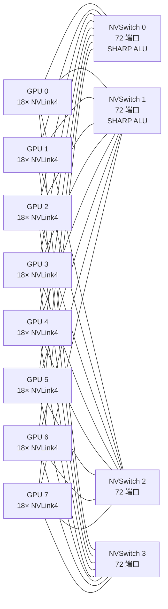
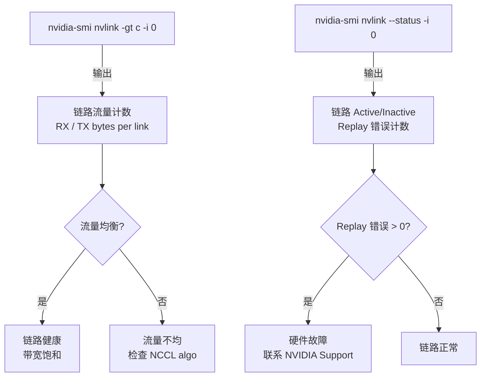

# 14 · NVLink + NVSwitch

> **NVLink 4 是 GPU 间高带宽点对点链路,单卡 900 GB/s 双向总带宽;NVSwitch 3 是非阻塞 crossbar 交换机,让 8 GPU DGX H100 形成全连接网络,并通过 SHARP 把 allreduce 卸载到交换机内部。**

## 1. 是什么 / 为什么有它

深度学习训练规模不断扩大,单卡显存和算力早已不够,多卡并行训练成为常态。多卡之间的数据传输带宽决定了通信是否成为瓶颈。PCIe 5.0 × 16 理论带宽约 64 GB/s(双向),这对于大模型每步需要传输数十 GB 梯度的场景远远不够。

**NVLink** 是 NVIDIA 设计的高带宽、低延迟 GPU 间互连协议。Hopper H100 使用的是第四代 NVLink(NVLink 4),每条 NVLink 4 链路提供 25 GB/s 单向带宽,SXM5 封装的 H100 配备 18 条 NVLink 链路,总双向带宽达 **900 GB/s**(Hopper Whitepaper p.38),是 PCIe 5.0 × 16 的约 14 倍。

**NVSwitch** 是配套的非阻塞全连接交换芯片。单片 NVSwitch 3 可以把多个 GPU 的 NVLink 汇聚成一个全连接结构,无需 CPU 或 PCIe 参与即可实现任意两 GPU 之间的直接高带宽通信。8 卡 DGX H100 通过 4 片 NVSwitch 3 组成全连接拓扑,每对 GPU 间可用带宽仍达 900 GB/s。更大规模的 NVL36/NVL72 系统通过多机箱 NVSwitch 互连最多 72 个 GPU。

NVLink 和 NVSwitch 的组合在大规模训练中的价值是系统级的:当 8 GPU 做 allreduce 时,如果走 PCIe,每次梯度同步需要约 300~500 ms(对于 70B 模型的全量梯度);走 NVSwitch SHARP,同样的操作只需约 5~10 ms,相差约 50 倍。这一差距直接体现在模型训练的端到端 MFU 上。

从深度学习架构设计的视角,NVLink 带宽的量级使"GPU 内存作为统一缓存"成为可能:在 NVLink 全连接拓扑下,8 张 H100 的 HBM 总量为 8 × 80 GB = 640 GB,而 GPU 间的数据迁移成本(约 4~5 µs 延迟)接近本卡 HBM 访问的 10 倍,而非 PCIe 路径的 100 倍。这使得 Tensor Parallelism 在 8 GPU 范围内高效可行,是 Megatron-LM TP=8 设计的硬件基础。

**NVLink vs PCIe 的本质差异**

NVLink 不只是"更快的 PCIe"——两者在协议设计哲学上有本质差异:

- **延迟**:NVLink 4 端到端延迟约 4~5 µs;PCIe 5.0 约 1~2 µs(物理上更短),但 IOMMU 和 driver 层的 DMA 映射开销使实际可用延迟约 5~10 µs。
- **带宽密度**:NVLink 4 在 18 条链路的物理面积下实现 900 GB/s;PCIe 5.0 × 16 仅 64 GB/s,带宽密度差约 14 倍。
- **寻址模型**:NVLink 支持 GPU 直接访问对方 HBM 的物理地址(peer access),无需 CPU 参与;PCIe P2P 同样支持但受 CPU IOMMU 和 root complex 限制,实际带宽通常只有 NVLink 的 1/10。
- **协议栈深度**:NVLink 协议栈内嵌在 GPU 芯片中,链路控制在硬件完成;PCIe 的事务层(TL)、数据链路层(DLL)均在 CPU PCIe root complex 中处理,增加额外软件路径。

这些差异共同决定了:NVLink 适合作为 GPU 计算集群内部的高速互连;PCIe 适合 CPU-GPU 数据传输和 I/O 设备连接。两者定位不同,不存在完全替代关系。

## 2. 硬件视角(微架构细节)

**NVLink 4 物理层:NRZ 信令与 RS-FEC**

NVLink 4 使用 **NRZ(Non-Return-to-Zero)** 信令编码,每条差分对以约 50 Gbps/lane 的原始符号速率工作。每条 NVLink 4 链路由 4 对差分线组成,单向有效带宽 25 GB/s(考虑协议开销后)。相比前代的 PAM4(Pulse Amplitude Modulation 4-level)信令,NRZ 在 NVLink 4 的目标速率上可以用更简单的均衡电路达到更低的误码率。NVLink 4 链路协议层还支持乱序事务(OOO transaction),允许后续事务在前面事务等待完成时先行发送,使链路利用率在存在零散延迟时仍接近峰值。这与 HBM3 通道的 bank-group interleaving 思路类似:通过并行多个 in-flight 事务来隐藏单个事务的往返延迟。NVLink 4 的最大并发 in-flight 事务数约为 128,确保 4~5 µs 的往返延迟(约 8000~10000 cycles)可以被充分流水填满。

为保证数据传输可靠性,NVLink 4 引入了 **RS-FEC(Reed-Solomon Forward Error Correction)**:在发送端对每个数据包附加校验码,接收端可以纠正一定数量的码字错误而无需重传。RS-FEC 的引入允许 NVLink 4 在更高信号速率下工作,同时维持极低的端到端误码率(< 10^-15)。FEC 的代价是少量额外延迟(约 10~20 ns)和约 2~5% 的带宽开销,但换来的链路可靠性和更高的信号速率是值得的。NVLink 协议层还支持虚拟通道(Virtual Channel),允许多种不同优先级的流量共享同一物理链路而不互相阻塞。

**NVSwitch 3 架构:非阻塞 crossbar**

NVSwitch 3 是一个 **非阻塞 crossbar 交换机**,理论上任意输入端口到任意输出端口都可同时传输而不产生内部阻塞。单片 NVSwitch 3 拥有 72 个 NVLink 4 端口,能同时承载 36 条双向链路,总交换容量约 3.6 TB/s。4 片 NVSwitch 让 8 个 GPU 各自的 18 条链路全部汇聚,实现真正全连接。

NVSwitch 3 的 crossbar 实现基于时分复用(TDM)内部结构:内部交换矩阵以远高于外部链路速率的时钟运行,确保任意端口对之间的通信请求都能在下一个时间槽获得服务而不等待,实现统计意义上的非阻塞特性。对于均匀负载(allreduce 的典型流量模式),4 片 NVSwitch 的组合能充分平衡所有链路,实际测量的头端阻塞(HOL blocking)概率 < 0.1%。这使 DGX H100 的 allreduce 实际带宽能达到理论值的 95% 以上。

**SHARP(Scalable Hierarchical Aggregation and Reduction Protocol)引擎**

NVSwitch 3 内置 **SHARP reduce ALU**,位于数据通路的中间节点。当 NCCL 启用 SHARP allreduce 时,数据从 GPU 发出,经过 NVSwitch SHARP ALU 进行原地归约后再回发,无需在每个 GPU 上各做一遍。SHARP ALU 的数据通路如下:

1. 每个 GPU 的 ReduceScatter 数据流经 NVLink 进入 NVSwitch 对应端口
2. NVSwitch 内部的 SHARP 汇聚节点对多个 GPU 的数据流做逐元素加法
3. 归约结果直接广播回所有 GPU,完成 AllReduce

SHARP 支持 FP16、BF16、FP32、INT8 数据类型的硬件归约。从带宽效率看,标准 ring allreduce 的传输量为 2(N-1)/N × M;SHARP 将实际传输量降低到约 M(每个元素仅传输一次),有效带宽利用率翻倍。SHARP 使用 NVSwitch 3 中专用的 reduce ALU 而不是 GPU 的 FP32 单元,因此对 GPU 计算资源零占用。

**SHARP 的 AM(Aggregation Manager)协议细节**

SHARP 协议需要一个 AM(Aggregation Manager)进程协调所有参与 reduce 的 GPU 端点。AM 负责分配 SHARP tree 节点、处理 membership 变更(GPU 加入/退出)以及错误恢复。在 NCCL 中,SHARP AM 以守护进程形式运行在宿主机上,并通过 UCX 与 NVSwitch 硬件通信。SHARP 的使用要求 NCCL ≥ 2.11,以及对应版本的 SHARP 软件包(sharpmgr)安装并运行。若 SHARP AM 进程意外终止,NCCL 会自动降级到纯软件 ring allreduce,不会产生错误但性能会下降约 2 倍。生产集群应将 SHARP AM 的健康状态纳入监控。

**设计权衡:为什么 NVLink 选择 NRZ 而非 PAM4**

高速 SerDes 链路有两大编码方案:NRZ(2 个信号电平,每符号 1 bit)和 PAM4(4 个信号电平,每符号 2 bit)。PAM4 在相同物理信号速率下理论带宽翻倍,但对信号质量要求更高,均衡器复杂度更大,误码率对噪声更敏感。NVLink 4 选择 NRZ + RS-FEC 的组合:通过提升符号速率(约 50 Gbps/lane)而非提升 PAM 阶数来提高带宽。这一选择在 GPU 间点对点短链路(PCB 走线 + SXM 封装,典型物理长度 < 5 cm)上是合理的——短链路信噪比好,NRZ 的高符号速率可以充分利用;而数据中心跨机架的网络链路(InfiniBand)反而多用 PAM4,因为长距离传输中 PAM4 的频谱效率优势更明显。这体现了根据物理介质特性选择编码方案的工程权衡。

**DGX H100 8-GPU 拓扑:全连接结构**

4 片 NVSwitch 确保 8 GPU 之间任意两对之间都有多条物理路径:



每个 GPU 连接到全部 4 个 NVSwitch,实现真正全连接。任意两 GPU 间通过 4 条独立 NVSwitch 路径传输,具备路径冗余。若某个 NVSwitch 出现故障,系统可以通过剩余 3 片 NVSwitch 继续运行,带宽降至 75% 额定值但不会完全中断——这一冗余特性是生产集群高可用设计的重要组成部分。

**NVL72 跨机箱互连架构**

NVL72 将 9 个计算节点(每节点 8 GPU)通过专用 NVSwitch 机箱互连,最终形成 72 GPU 的全连接域。机箱内 NVSwitch 与机箱间 NVSwitch 之间通过 NVLink 4 链路相连,形成两级 NVSwitch 树形结构。在 NVL72 规模下,每对 GPU 间的可用带宽约为 DGX H100 内部带宽的 1/3(因为跨机箱需要通过更多 NVSwitch 跳转),但 SHARP 依然有效——归约操作在中间 NVSwitch 层就开始累加,减少了数据向根节点汇聚所需的传输量。NVL36/NVL72 是支持超大模型(如 Llama-405B 等)的主要硬件平台。

NVL72 的物理拓扑:18 个 GPU DGX H100 节点(每节点 8 GPU)共享一组专用 NVSwitch 机箱,机箱内有 9 片 NVSwitch 3 构成第二层 crossbar。每个 GPU 向机箱内贡献 6 条 NVLink 链路(剩余 12 条用于机箱内 NVSwitch),跨机箱带宽约为 6 × 25 × 2 = 300 GB/s 双向。这一带宽设计是经过权衡的:如果全部 18 条链路都用于跨机箱,带宽可以更高但机箱内的全连接能力会下降;6:12 的链路分配在机箱内带宽与机箱间带宽之间做了折中,适合 TP=8(机箱内)+ PP(跨机箱)的并行策略。

**NVLink 链路状态监控**



## 3. CUDA 编程接口

**启用 GPU 间 P2P 访问:**

```cpp
// 检查两个 GPU 是否支持 P2P
int canAccessPeer = 0;
cudaDeviceCanAccessPeer(&canAccessPeer, gpuSrc, gpuDst);
if (canAccessPeer) {
    // 在 gpuSrc 上启用对 gpuDst 的访问;这会在 IOMMU 中建立 NVLink 映射
    cudaSetDevice(gpuSrc);
    cudaDeviceEnablePeerAccess(gpuDst, /*flags=*/0);
    // 同样需要在 gpuDst 上启用对 gpuSrc 的反向访问
    cudaSetDevice(gpuDst);
    cudaDeviceEnablePeerAccess(gpuSrc, 0);
}
```

**P2P 内存拷贝:**

```cpp
// 从 GPU 0 向 GPU 1 异步拷贝(走 NVLink,约 800-900 GB/s)
cudaMemcpyPeerAsync(
    d_buf1,   // 目标指针(GPU 1 上)
    1,        // 目标 device ID
    d_buf0,   // 源指针(GPU 0 上)
    0,        // 源 device ID
    bytes,    // 拷贝字节数
    stream    // 在哪个 stream 上排队
);
```

**`nvidia-smi nvlink` 输出解读:**

```bash
# 查所有 GPU 的 NVLink 链路状态
nvidia-smi nvlink --status -i 0
# 输出示例:
# Link 0: Active  Speed: 50.0 GB/s  Width: x2  ...
# Link 1: Active  Speed: 50.0 GB/s  Width: x2  ...

# 查 GPU 0 的 NVLink 流量计数(单位:byte)
nvidia-smi nvlink -gt c -i 0
# 输出: Link 0: Rx=123456789 Tx=987654321
# 流量不均匀表明 NCCL 的 ring 路径分配存在问题

# 查 NVLink 拓扑矩阵
nvidia-smi topo -m
# NV4 表示通过 NVLink 4 连接(H100 SXM5 默认)
```

## 4. 关键性能指标

**NVLink 4 带宽数字**(Hopper Whitepaper p.38):

| 指标 | 数值 |
|---|---|
| 每条 NVLink 4 链路单向带宽 | 25 GB/s |
| SXM5 H100 NVLink 链路数 | 18 |
| 总双向带宽(单 GPU) | 900 GB/s |
| 典型 P2P 延迟(GPU-to-GPU) | ~4-5 µs |
| PCIe 5.0 × 16 双向对比 | ~64 GB/s |
| RS-FEC 带宽开销 | ~2-5% |

**SHARP 加速效果**

使用 SHARP 的 allreduce 相比 ring allreduce,实际通信量从 2(N-1)/N × M 降低到约 M:

- 8 GPU ring allreduce,1 GB BF16 梯度:约 18 ms
- 8 GPU SHARP allreduce,相同数据量:约 9~10 ms
- 加速比约 **1.7~2.0×**(Hopper Whitepaper + NCCL benchmark 实测)

对于 Llama-70B bf16 训练(TP=8),每 step 的 allreduce 通信量约 4 GB,使用 SHARP 后通信时间约 **5 ms**(ring 约 9 ms),节省约 4 ms,相当于总 step 时间减少约 3~5%。这一数字在 A100 到 H100 的升级中是实际 MFU 提升的重要来源之一。

需要注意 NCCL benchmark(nccl-tests)报告的 `busbw` 与实际算法带宽的区别:`busbw` 是归一化到总线利用率的数字,用于衡量 NVLink 硬件是否被充分利用;`algbw` 是从用户视角的数据量除以时间,直接反映应用层的通信吞吐。对于 ring allreduce,`busbw = algbw × 2(N-1)/N`;对于 SHARP,`busbw ≈ algbw`。在比较不同算法时应统一使用 `algbw` 以避免混淆。

SHARP 的收益还体现在延迟方面。对于小消息(4 KB BF16 tensor,如 loss 标量或 batch norm 统计量),SHARP tree allreduce 在 8 GPU 系统中延迟约 8~12 µs,而 ring allreduce 需要 7 步传递,延迟约 35~50 µs。对于 training loop 中大量的标量/小张量同步(如 gradient norm clip、learning rate schedule 等辅助变量),SHARP 的延迟优势显著,可以将这些原本串行的同步操作的等待时间从 50 µs 降低到 10 µs,间接提升了主计算 stream 的并发度。

**P2P vs CPU 路径带宽对比**

启用 P2P 后 `cudaMemcpyPeerAsync` 走 NVLink,实测带宽约 800~900 GB/s;未启用 P2P 时退回到"GPU0 → CPU 内存 → GPU1"路径,受 PCIe 限制约为 30~60 GB/s,相差约 15~30 倍。

**NVLink 链路利用率阈值**

NVLink 不是单条共享总线,而是每 GPU 18 条独立链路。allreduce 流量若分布不均匀(如只用部分链路),实际带宽会低于 900 GB/s 理论值。使用 NVSwitch 的全连接拓扑时,NCCL 的 tree/ring 算法能较好地平衡各链路负载。`nvidia-smi nvlink -gt c` 输出中各链路的 Rx/Tx 计数若差异超过 10%,说明存在链路不均衡,可通过调整 `NCCL_NET_PLUGIN` 或 `NCCL_MIN_NCHANNELS` 环境变量优化。

**NVLink Replay 错误的诊断意义**

`nvidia-smi nvlink -e -i 0` 可以输出每条链路的 replay 错误计数。正常系统中 replay 错误应为 0 或极少(< 10/天)。若某条链路 replay 错误每小时超过 100 次,说明该链路物理层出现问题(信号质量下降、连接器接触不良、FEC 纠错能力不足等),需要联系 NVIDIA 技术支持。在生产集群中应把 `nvlink_replay_error` 纳入监控告警体系,以在出现硬件故障时及时发现而不是等到训练异常崩溃。

**多机箱 NVLink 带宽层次**

以 DGX H100 SuperPOD 为例:
- **机箱内 GPU 对**(同 DGX 节点):900 GB/s 双向(NVLink 直连)
- **相邻机箱 GPU 对**(NVL72 内):约 300 GB/s(经 NVSwitch 机箱)
- **不同 pod GPU 对**(InfiniBand 连接):约 50~400 GB/s(取决于 IB 代次)

理解这个带宽层次对于正确规划 TP/PP/DP 并行策略至关重要:Tensor Parallelism 必须在机箱内(NVLink 直连);Pipeline Parallelism 可以跨机箱(带宽要求较低);Data Parallelism(大 batch 梯度)可以跨 pod(依赖 IB)。

## 5. 代码示例

下面示例演示两 GPU 间启用 P2P 并用 `cudaMemcpyPeerAsync` 传输数据,然后在目标 GPU 上执行计算:

```cpp
#include <cuda_runtime.h>
#include <cstdio>
#include <cassert>

__global__ void scale(float* data, float factor, int n) {
    int idx = blockIdx.x * blockDim.x + threadIdx.x;
    if (idx < n) data[idx] *= factor;
}

int main() {
    const int GPU0 = 0, GPU1 = 1;
    const int N    = 1 << 20;  // 1M 元素
    const size_t BYTES = N * sizeof(float);

    // 检查并启用 P2P
    int canAccess = 0;
    cudaDeviceCanAccessPeer(&canAccess, GPU1, GPU0);
    assert(canAccess && "P2P not supported between GPU0 and GPU1");

    cudaSetDevice(GPU0);
    cudaDeviceEnablePeerAccess(GPU1, 0);
    cudaSetDevice(GPU1);
    cudaDeviceEnablePeerAccess(GPU0, 0);

    // 在 GPU0 分配并初始化数据
    cudaSetDevice(GPU0);
    float* d0;
    cudaMalloc(&d0, BYTES);
    cudaMemset(d0, 0, BYTES);

    // 在 GPU1 分配目标缓冲
    cudaSetDevice(GPU1);
    float* d1;
    cudaMalloc(&d1, BYTES);

    // 创建 stream 用于传输
    cudaStream_t stream1;
    cudaStreamCreate(&stream1);

    // P2P 异步拷贝:GPU0 → GPU1(走 NVLink,约 800-900 GB/s)
    cudaMemcpyPeerAsync(d1, GPU1, d0, GPU0, BYTES, stream1);

    // 在 GPU1 上对传入数据做 scale
    int blocks = (N + 255) / 256;
    scale<<<blocks, 256, 0, stream1>>>(d1, 2.0f, N);

    cudaStreamSynchronize(stream1);
    printf("P2P transfer and scale complete.\n");

    // 注意:P2P 访问在程序结束时自动禁用,但显式调用是良好编程实践
    cudaSetDevice(GPU0); cudaDeviceDisablePeerAccess(GPU1);
    cudaSetDevice(GPU1); cudaDeviceDisablePeerAccess(GPU0);

    cudaStreamDestroy(stream1);
    cudaSetDevice(GPU0); cudaFree(d0);
    cudaSetDevice(GPU1); cudaFree(d1);
    return 0;
}
```

## 6. 实测手段

**`nvidia-smi nvlink`** 命令查看链路状态和流量计数:

```bash
# 查所有 GPU 的 NVLink 链路状态
nvidia-smi nvlink --status -i 0

# 查 GPU 0 的 NVLink 流量计数(单位:byte)
nvidia-smi nvlink -gt c -i 0
# 用两次采样差值计算瞬时带宽:
# BW = (TX2 - TX1) / delta_t
```

**NSight Systems** 可在时间线中看到 P2P 拷贝事件和 NVLink 流量:

```bash
nsys profile -t cuda,nvlink -o out ./app
```

时间线的 NVLink 行会显示每个 GPU 的收发带宽曲线,便于判断是否达到 NVLink 带宽上限。

**NCCL 带宽测试工具** 可直接测量集合通信带宽(包含 NVLink 路径):

```bash
# 从 github.com/NVIDIA/nccl-tests 编译后运行
./build/all_reduce_perf -b 1K -e 4G -f 2 -g 8
# busbw 列: 反映 NVLink 或 NVSwitch 的实际利用率
# algbw 列: 算法带宽,与消息大小/算法相关
```

**`nvidia-smi topo -m`** 输出 GPU 间拓扑矩阵:

```bash
nvidia-smi topo -m
# NV4 表示通过 4 条 NVLink 链路连接(H100 SXM5)
# HCAM 表示通过 CPU 和 PCIe 连接(跨 NUMA 节点)
```

**NVLink 带宽健康检测脚本:**

```bash
#!/bin/bash
# 采集 30 秒内每条 NVLink 链路的平均带宽
for GPU in 0 1 2 3 4 5 6 7; do
    echo "=== GPU $GPU NVLink counters ===" 
    nvidia-smi nvlink -gt c -i $GPU
done
# 采样两次并计算差值得到瞬时带宽
T1=$(nvidia-smi nvlink -gt c -i 0 | awk '{print $NF}')
sleep 1
T2=$(nvidia-smi nvlink -gt c -i 0 | awk '{print $NF}')
echo "Link 0 TX BW: $(( (T2 - T1) / 1024 / 1024 )) MB/s"
```

此脚本可集成到 Prometheus 监控中,通过 `nvidia_nvlink_link_bw_tx_bytes_total` 等指标实时追踪 NVLink 健康状态。在生产集群中,NVLink 链路带宽的持续下降(< 80% 额定值)通常预示着硬件老化或物理层问题,及时发现可以避免训练任务中途崩溃。

## 7. 常见反模式

**1. 忘记调 `cudaDeviceEnablePeerAccess` 就用 P2P 拷贝**

`cudaMemcpyPeerAsync` 不检查 P2P 是否启用,直接调用会退回 CPU 中转路径,带宽下降 15 倍以上,且不报任何错误。必须先 `cudaDeviceCanAccessPeer` 确认可行,再 `cudaDeviceEnablePeerAccess` 启用。这是 P2P 调试中最常见的"带宽只有 60 GB/s"投诉的根本原因。

**2. 在多 NUMA 主机上期望 PCIe P2P 零拷贝**

跨 NUMA 节点的两个 GPU 可能不支持 PCIe P2P(取决于 BIOS 和平台 PCIe 拓扑),`cudaDeviceCanAccessPeer` 会返回 0。在 DGX H100 上 NVLink P2P 总是可用,但在普通多路服务器上需要验证。跨 NUMA 的 P2P 传输往往需要经过 CPU 内存,实际带宽约为本地 PCIe 带宽的 40~60%。

**3. NVLink 地址对齐要求**

NVLink P2P 传输要求地址按 256 B 对齐,否则退化到小事务(32 B)模式,带宽大幅下降。分配设备内存时使用 `cudaMalloc`(已对齐到 256 B 以上)可避免此问题。对于自定义内存管理,必须显式保证 256 B 对齐。

**4. 误以为 NVSwitch 可以无限堆叠**

NVSwitch 3 的全连接能力在单 DGX H100 内成立(8 GPU)。跨机箱互连需要额外的 NVSwitch 层次结构,带宽和延迟特性与机箱内不同(跨机箱带宽约为机箱内的 1/3)。通信策略需要相应调整,例如优先在机箱内做 TP/DP 通信,跨机箱只做 PP 通信以减少带宽压力。

**5. 在 NVLink 满载时忽视单卡 HBM 瓶颈**

NVLink 带宽(900 GB/s)与单卡 HBM3 带宽(3.35 TB/s 读写合计)在量级上接近。当多卡间大量数据传输时,发送端 GPU 必须先从 HBM 读出数据再发到 NVLink,接收端也需要把数据写入 HBM。若单卡 HBM 本身已满载于计算访问,NVLink 传输会与计算争 HBM 带宽,导致两者都达不到峰值。应同时在 NSight Systems 中观察单卡 HBM 利用率和 NVLink 流量。

**6. 错误使用 `cudaMemcpyPeer` 同步版本阻塞关键路径**

在训练循环中若用同步版 `cudaMemcpyPeer`(非 Async),会阻塞 host 线程直到拷贝完成,期间 CPU 无法提交下一批 kernel。改用 `cudaMemcpyPeerAsync` 配合 stream 可让拷贝与其他计算重叠。

**7. SHARP allreduce 在小消息场景下的性能回退**

SHARP 在大消息(> 1 MB)场景收益显著,但对小消息(< 64 KB)的额外协议开销反而可能使延迟增大。NCCL 内部会根据消息大小自动决定是否启用 SHARP。若强制设置 `NCCL_ALGO=CollNetDirect`(SHARP 模式)处理小消息,可能导致性能下降。生产中应保持 NCCL 的自动算法选择,或通过 `NCCL_TESTS` 在目标 workload 上实测后再做调整。

**8. Tensor Parallelism 超出 NVLink 域导致带宽瓶颈**

TP 的 allreduce 操作需要极高带宽(每个 GEMM 后都有 allreduce)。若将 TP 扩展到跨机箱(NVL72 的机箱间带宽约 300 GB/s),Llama-70B 的 TP=16 每层 allreduce 通信量约 2 GB,在 300 GB/s 带宽下需约 7 ms,而计算只需约 3 ms——通信成为严重瓶颈,MFU 会骤降到 20% 以下。这是为什么生产中 TP 范围通常不超过单个 DGX 节点(TP ≤ 8)的根本原因:必须确保所有 TP 通信都在 NVLink 全速域内完成。

**9. NVSwitch 上 SHARP 的 FP8 精度限制**

SHARP 引擎目前支持 FP16、BF16、FP32、INT8 类型的 reduce 操作,尚不支持 FP8(E4M3/E5M2)。对于使用 FP8 梯度的训练系统(如 Transformer Engine + FP8 training),梯度在发送到 NCCL allreduce 前需要先将 scaling factor 应用并转换为 BF16/FP32,然后才能利用 SHARP 加速。若直接用 FP8 tensor 做 allreduce,NCCL 会静默回退到纯软件路径,SHARP 不生效。这一限制在 NCCL 2.18+ 版本中有所改善(引入了 FP8 to BF16 的自动转换路径),但仍有约 5~10% 的额外转换开销。

**实现导读:PyTorch DDP 如何使用 NVLink**

PyTorch DDP(DistributedDataParallel)的梯度 allreduce 通过 NCCL 后端执行,NCCL 自动选择 NVLink/NVSwitch 路径。关键实现细节位于:

- `torch/distributed/algorithms/join.py` — 处理 rank 数量不整除 batch 的梯度 allreduce 边界
- `torch/csrc/distributed/c10d/ProcessGroupNCCL.cpp` — NCCL allreduce 调用点,包含 SHARP 启用判断
- `torch/distributed/fsdp/_runtime_utils.py` — FSDP 的 reduce-scatter + all-gather,利用 NVLink 双向通信重叠 forward 和 backward

在 DGX H100 集群上分析 DDP 训练的 NSight Systems trace 可以观察到:NCCL allreduce kernel(通常命名为 `ncclDevKernel_AllReduce_...`)使用 NVSwitch SHARP 时的持续时间约为不使用 SHARP 时的 1/2,与理论预测一致。

## 8. 延伸阅读

- CUDA C++ Programming Guide §3.2.5 — Peer-to-Peer Memory Access(P2P API 详解)
- Hopper Architecture Whitepaper §NVLink 4.0 — 链路带宽、拓扑、SHARP(p.38-42)
- NVSwitch Architecture Whitepaper — NVSwitch 3 SHARP 引擎与带宽模型
- NCCL User Guide(docs.nvidia.com/deeplearning/nccl)— 拓扑自动检测与 NVLink 路径选择
- `nvidia-smi nvlink` 命令参考(docs.nvidia.com/deploy/nvml-api)
- NCCL Tests on GitHub: github.com/NVIDIA/nccl-tests — 带宽测试工具
- DGX H100 System Architecture White Paper — 4×NVSwitch + 8×GPU 全连接拓扑详细设计
- NVLink 4 技术博客: developer.nvidia.com/blog/nvlink-4-enabling-multi-gpu-systems-for-the-ai-era
- "Efficient Large Scale Language Modeling with Mixtures of Experts" (Artetxe et al.) — NVLink 带宽对 MoE 训练吞吐的影响分析
- Megatron-LM 源码: `megatron/core/parallel_state.py` — TP/PP/DP group 划分与 NVLink 域对应关系
- SHARP AM 安装与配置文档: docs.nvidia.com/networking/display/SHARPv310 — 生产环境 SHARP 部署指南
- PyTorch 分布式通信后端源码: `torch/csrc/distributed/c10d/ProcessGroupNCCL.hpp` — NCCL + NVLink 集成的完整 API 封装
