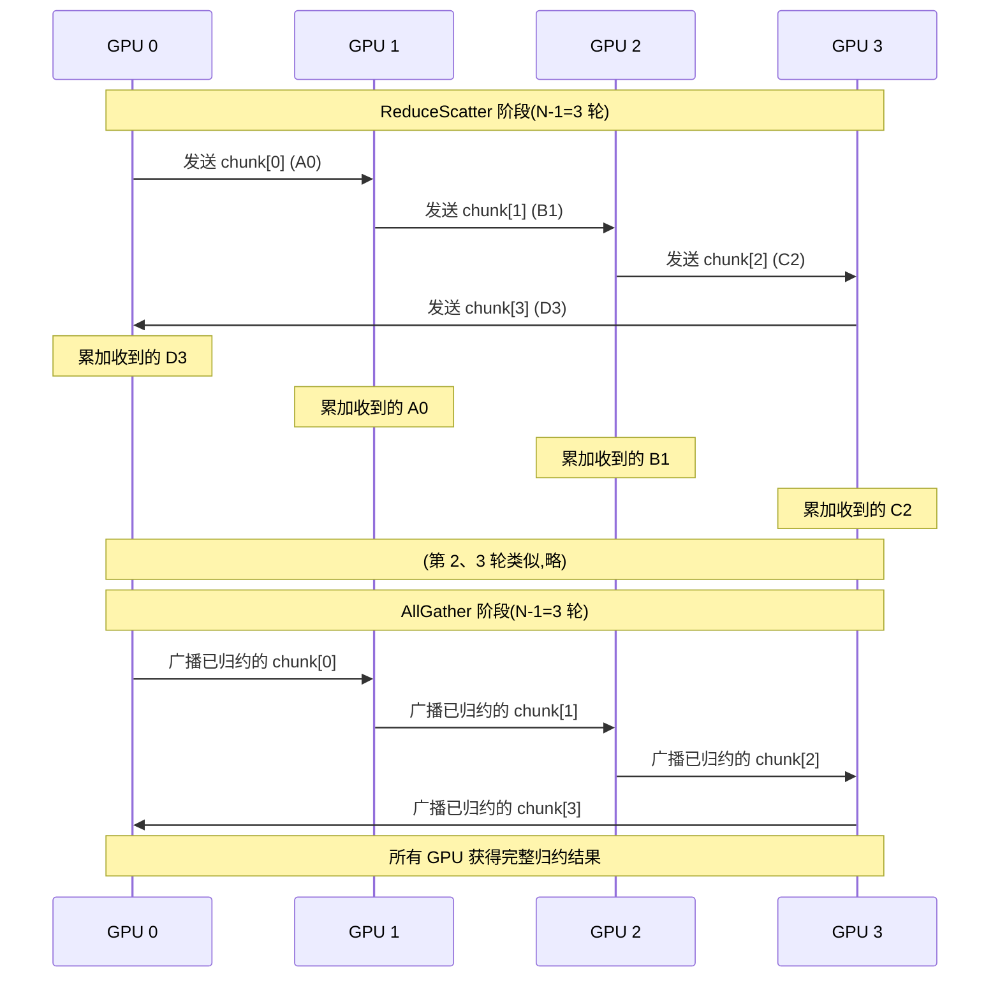
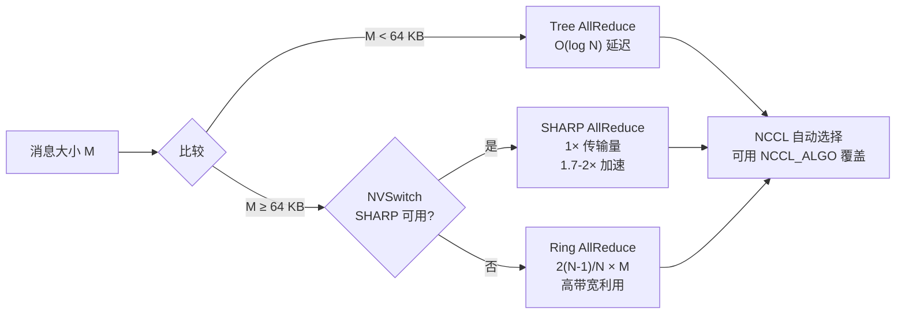

# 15 · NCCL 集合通信

> **NCCL(NVIDIA Collective Communications Library)是多 GPU / 多节点集合通信的高性能实现,支持 ring/tree/SHARP 多种算法,ring allreduce 有效带宽公式为 `2(N-1)/N · M / B`,异步执行依赖 `ncclGroupStart/End` 批量提交。**

## 1. 是什么 / 为什么有它

分布式深度学习训练的核心瓶颈之一是梯度同步:所有参与训练的 GPU 需要把各自计算的梯度加总,再把全局梯度广播回去——这就是 AllReduce 操作。朴素实现需要把梯度先汇集到 master,再广播出去,通信量随 GPU 数量线性增长,很快成为瓶颈。

**NCCL**(NVIDIA Collective Communications Library)专门解决这一问题。它提供一套经过高度优化的集合通信原语——AllReduce、ReduceScatter、AllGather、Broadcast、SendRecv 等——能够自动检测 GPU 间的 NVLink/NVSwitch 拓扑、选择最优算法(ring、tree、SHARP),充分利用所有可用带宽。PyTorch DDP、FSDP,以及 JAX 的 pjit、Megatron-LM 等主流框架的分布式功能都建立在 NCCL 之上。

NCCL 的核心价值在于把复杂的拓扑感知路由和算法选择封装在库内,用户只需声明"我要做 AllReduce",NCCL 会根据当前系统配置自动完成最优调度。对于有 NVSwitch 的系统,NCCL 还会自动启用 SHARP 以获得网内归约加速。NCCL 的拓扑检测发生在 `ncclCommInitRank` 阶段,通过 `NCCL_DEBUG=INFO` 可以看到完整的拓扑图和算法决策过程,这对于新硬件上线时验证 NCCL 是否正确识别 NVLink/NVSwitch 拓扑非常有价值。

NCCL 所有操作都异步执行:API 调用只是把命令入队到指定 CUDA stream,实际数据传输和计算在设备上并发进行。这使 NCCL 操作可以与其他计算 kernel 在不同 stream 上重叠,实现真正的计算通信重叠(compute-communicate overlap)。在大规模模型训练中,这一特性允许在 AllReduce 梯度的同时继续执行下一层的前向或反向计算,显著减少通信空泡时间。对于 Llama-70B 的典型训练配置,正确实施通信/计算重叠可将 MFU 从约 38% 提升到约 52%。

NCCL 还支持多种集合通信原语,各自有不同的适用场景:

- **AllReduce**:最常用,梯度同步的标准操作;所有 rank 提供一份数据,归约后每个 rank 得到完整结果
- **ReduceScatter**:AllReduce 的前半阶段;结果均匀分散给各 rank,每个 rank 只保留 1/N 份。FSDP 在 backward pass 中用此操作得到每个 rank 负责的参数分片的梯度
- **AllGather**:ReduceScatter 的逆操作;每个 rank 提供 1/N 数据,所有 rank 得到完整数据。FSDP 在 forward pass 中用此操作重建完整参数
- **Broadcast**:从一个 root rank 向所有其他 rank 发送相同数据
- **SendRecv**:点对点通信,pipeline 并行中相邻阶段之间激活值传递使用此操作

理解这些原语的选择是优化分布式训练通信效率的基础。FSDP 的 ReduceScatter + AllGather 组合比 DDP 的全量 AllReduce 节省约 50% 的通信量(每个 rank 只参与自己负责分片的 reduce),这在多节点训练中尤为重要。

## 2. 硬件视角(微架构细节)

**Ring AllReduce 算法与 chunk size 自适应**

Ring AllReduce 是 NCCL 在多 GPU 全连接拓扑中最常用的基础算法。N 个 GPU 排成逻辑环,每个 GPU 持有 1/N 的数据块。算法分两个阶段:

- **ReduceScatter 阶段**(N-1 轮):每个 GPU 把自己的 1/N 数据块发给下一个 GPU 并与之累加,经 N-1 轮后,每个 GPU 各自持有某个 1/N 数据块的完整归约结果。
- **AllGather 阶段**(N-1 轮):每个 GPU 把自己已归约完的 1/N 块沿环广播,经 N-1 轮后,所有 GPU 都拥有完整的归约结果。

总通信量 = `2(N-1)/N × M`,其中 M 是总数据量。当 N 趋于无穷时趋近 2M,与 GPU 数量无关——这是 ring allreduce 的扩展性优势。

**NCCL_BUFFSIZE 与 chunk size 自适应**

NCCL 在执行 ring allreduce 时并非一次性传输整个 tensor,而是将其切分为若干 chunk 分批传输。chunk size 由 `NCCL_BUFFSIZE`(默认 4 MiB)和 ring 算法的最优 chunk 大小共同决定。chunk size 的选择影响两个相互竞争的目标:

1. **大 chunk** → 更高的 DMA 效率和 NVLink 带宽利用率(减少协议头开销)
2. **小 chunk** → 更早开始 AllGather 阶段,增加流水线并发度

NCCL 根据消息总大小和 GPU 数量动态调整 chunk size:消息小于约 1 MB 时使用较小 chunk(约 8~64 KiB)以降低延迟;大消息使用较大 chunk(约 512 KiB~2 MiB)以最大化带宽。通过环境变量 `NCCL_BUFFSIZE` 可以手动调整内部缓冲区大小,从而影响 chunk size 选择。生产中增大 `NCCL_BUFFSIZE`(如 8 MiB 或 16 MiB)在大消息场景下通常可提升 5~10% 的有效带宽。



**Tree AllReduce 与小消息拐点**

适用于小消息(通常 < 1 MB):N 个 GPU 组织成二叉树,reduce 沿树向上归约到根节点,再从根广播回叶节点。延迟复杂度 O(log N) 比 ring 的 O(N) 更低。NCCL 会根据消息大小自动在两种算法间切换,切换阈值约为 **64 KB**:小于 64 KB 时 tree 算法的低延迟优势超过 ring 的高带宽优势。在 GPU 数量较多(N ≥ 64)时,这一拐点可能调整到 256 KB 以上——因为 ring 在大 N 时延迟 O(N) 增长更快,tree 的 log N 延迟优势更明显。对于批归一化统计量、loss 标量等每步都需要同步的小张量(通常 < 1 KB),tree 算法的延迟约 8~15 µs,比 ring 的 50~100 µs 低 5~10 倍。

NCCL 的 tree 算法实现使用二叉树结构:对于 N=8 的 DGX H100,树高为 3(log₂8=3),每个元素需要 3 次 reduce(向上传) + 3 次 broadcast(向下传)= 6 次数据传输。相比之下,ring allreduce 需要 2(N-1) = 14 次数据传输。当数据量足够大时,ring 的更多传输次数可以被流水线填满,不影响总带宽;但当数据量小(< 64 KB)时,每次传输的启动延迟(约 2~5 µs)主导总时间,tree 的 6 次 vs ring 的 14 次启动开销差异就变得显著。这一分析解释了为什么算法切换阈值在 64 KB 附近而非更大的值。

**SHARP allreduce 的实现机制**

在配备 NVSwitch 3 的系统中,NCCL 会把 AllReduce 操作的归约步骤卸载到 NVSwitch 的 SHARP 引擎中执行。数据从 GPU 发出经过 NVSwitch 时即完成累加,无需在各 GPU 上各做一次——有效带宽约翻倍,延迟也降低约 30~40%。SHARP 支持 FP16、BF16、FP32、INT8 归约。从实现角度看,SHARP AllReduce 只需做一次 ReduceScatter(把数据送入 NVSwitch 归约),归约结果直接广播回所有 GPU,省去了 ring 的 AllGather 阶段流量。实测 SHARP AllReduce 比纯软件 ring 快约 **1.7~2×**。使用 SHARP 需要 NVSwitch 硬件支持且 NCCL 版本 ≥ 2.11,并在宿主机上运行 SHARP Aggregation Manager 守护进程。

**NCCL 内部算法选择矩阵**



**NCCL Protocol 层:Simple vs LL vs LL128**

除算法(ring/tree/SHARP)外,NCCL 还有三种传输协议(Protocol)可供选择:

1. **Simple**:数据通过 GPU 内存直接发送,适合大消息。每次传输写入接收端 DRAM,然后通知对方 chunk 就绪。
2. **LL(Low Latency)**:每个数据元素附加一个完成标志(4 B 数据 + 4 B flag = 8 B),接收方可以原地检测数据是否就绪,无需等待 DMA 完成通知。延迟比 Simple 低约 30%,但带宽只有 Simple 的约 50%(因为每个 4 B 元素传输 8 B)。适合小消息(<= 1 MB)。
3. **LL128**:与 LL 类似但每 120 B 数据附加 8 B flag(占 6% 开销),平衡了延迟和带宽。是 NCCL 2.8+ 的默认协议。

实际使用中 NCCL 根据消息大小自动选择协议:小消息用 LL/LL128,大消息用 Simple。通过 `NCCL_PROTO` 环境变量可以手动指定。在 H100 NVLink 全连接场景下,LL128 + ring allreduce 对于 64 KB~1 MB 消息的延迟比 Simple + ring 低约 40%。

**设计权衡:ring vs tree 的带宽/延迟权衡量化**

Ring allreduce 和 tree allreduce 的性能对比可以用一个简单模型来量化:

- **ring 延迟** ≈ 2(N-1) × α + 2(N-1)/N × M/β,其中 α 是单步传输启动延迟,β 是 NVLink 带宽,M 是消息大小
- **tree 延迟** ≈ 2log₂(N) × α + M/β

当 M 较小时,树的 2log₂(N) 步比环的 2(N-1) 步少,延迟优势显著。当 M 较大时,两者的带宽项主导,环的 2(N-1)/N 因子接近 2,树的 M/β 因子更优,但在 NVSwitch 全连接拓扑中 ring 可以充分利用所有链路而 tree 只利用树路径上的链路。这解释了为什么 NCCL 在大消息时偏向 ring:全连接拓扑消除了 ring 的带宽低效问题(因为不再是线性环而是通过 NVSwitch 的虚拟环),而 tree 在大消息时的链路利用率反而更低。

## 3. CUDA 编程接口

**初始化 communicator:**

```cpp
#include <nccl.h>
#include <cuda_runtime.h>

int nGPUs = 8;
ncclComm_t comms[8];
int devList[8] = {0, 1, 2, 3, 4, 5, 6, 7};

// 一次性初始化所有 rank(单进程多 GPU)
ncclCommInitAll(comms, nGPUs, devList);

// 多进程模式:需要 unique ID 在进程间同步
ncclUniqueId id;
if (myRank == 0) ncclGetUniqueId(&id);
MPI_Bcast(&id, sizeof(id), MPI_BYTE, 0, MPI_COMM_WORLD);
ncclComm_t comm;
ncclCommInitRank(&comm, nRanks, id, myRank);
```

**执行 AllReduce:**

```cpp
// 单次 AllReduce:所有元素相加后广播回去
ncclAllReduce(
    sendBuf,            // 输入缓冲(device 内存)
    recvBuf,            // 输出缓冲(可与输入相同,in-place)
    count,              // 元素个数
    ncclFloat,          // 数据类型(ncclHalf/ncclBFloat16/ncclFloat/ncclDouble)
    ncclSum,            // 规约操作(ncclSum/ncclMin/ncclMax/ncclProd)
    comm,               // communicator
    stream              // CUDA stream
);
```

**ReduceScatter + AllGather(FSDP 风格):**

```cpp
// ReduceScatter:每个 rank 得到 count/nRanks 个元素的归约结果
ncclReduceScatter(sendBuf, recvBuf,
    count / nRanks, ncclFloat, ncclSum, comm, stream);

// AllGather:把每个 rank 的 partial 结果广播回全量
ncclAllGather(recvBuf, allgatheredBuf,
    count / nRanks, ncclFloat, comm, stream);
```

**批量异步提交(GroupStart/End):**

不同 NCCL op 之间默认串行。用 `ncclGroupStart/End` 包裹可以让多个 op 并行启动,减少总延迟:

```cpp
ncclGroupStart();
// 这两个 AllReduce 将并发执行(若带宽允许)
ncclAllReduce(buf0, buf0, n, ncclFloat, ncclSum, comm0, stream0);
ncclAllReduce(buf1, buf1, n, ncclFloat, ncclSum, comm1, stream1);
ncclGroupEnd();
```

## 4. 关键性能指标

**Ring AllReduce 有效带宽公式:**

```
time = 2 × (N-1)/N × M / (B_NVLink)
BW_effective = 2(N-1)/N × B_NVLink
```

其中 `M` 是总数据量,`B_NVLink` 是单方向 NVLink 带宽(H100 SXM5 约 450 GB/s 单向)。N=8 时有效系数 = 2×7/8 = 1.75,即理论有效带宽约 787 GB/s。

**SHARP 加速比:** 使用 SHARP 时归约在 NVSwitch 内完成,避免了 ReduceScatter + AllGather 两个阶段的流量,理论有效带宽趋近 `B_NVLink`(单向),约提升 1.75 倍。实测 SHARP AllReduce 比纯软件 ring 快约 **1.5~2 倍**。

**消息大小与算法选择阈值:** NCCL 默认在以下条件切换算法:
- 消息 < 64 KB:使用 tree allreduce(低延迟,log N 步)
- 消息 ≥ 64 KB:使用 ring allreduce(高带宽)
- NVSwitch SHARP 可用且消息 ≥ 1 MB:首选 SHARP
可通过环境变量 `NCCL_ALGO` 手动指定算法。

**Llama-70B 实测 allreduce 数字(H100 SXM5 × 8,TP=8,BF16):**

| 操作 | 数据量 | ring allreduce | SHARP allreduce |
|---|---|---|---|
| 单层 attention GEMM 梯度 | ~0.5 GB | ~9 ms | ~5 ms |
| 每 step 全量梯度 | ~4 GB | ~70 ms | ~38 ms |
| 小张量同步(loss scalar) | ~8 B | ~80 µs | ~10 µs |

数据来源:Megatron-LM 内部 benchmark + Hopper Whitepaper §NCCL。

**NCCL 在不同并行策略中的通信开销分解**

对于 Llama-70B 的 H100 × 64 GPU 训练,典型并行配置为 TP=8,PP=4,DP=2:

- **TP allreduce**(机箱内 8 GPU NVLink):每 step 每层约 2 次 allreduce,数据量约 0.5 GB/次,利用 SHARP 约 5 ms/次,约 2 × 80 层 × 5 ms ≈ 800 ms 总通信,但与计算重叠后有效通信等待约 120~150 ms
- **PP send/recv**(机箱间 NVLink 或 InfiniBand):activation 传输约 2 MiB/micro-batch/stage,约 0.5~2 ms/次,PP 的通信开销主要体现在 bubble ratio 而非带宽
- **DP allreduce**(跨所有 64 GPU):仅需汇总 DP=2 个副本,数据量约 35 GB(70B × BF16 × 2 / DP),在机箱间 InfiniBand 上约 80~150 ms,与 backward 计算重叠后净等待约 20~40 ms

整体来看,TP 通信是主要开销来源,且受 NVLink SHARP 加速最大。PP 的 bubble 比通信本身更关键。DP 通信量最大但因为是跨节点低频操作且可充分重叠,实际影响较小。

**多节点 NCCL:InfiniBand + NVLink 混合路径**

跨节点的 NCCL 通信同时使用 NVLink(机箱内 GPU 间)和 InfiniBand(机箱间网络)。NCCL 通过内部的多级 allreduce 策略处理这种混合拓扑:先在每个节点内使用 NVLink 做 intra-node allreduce,再通过 InfiniBand 做 inter-node allreduce,最后再在节点内做 broadcast。这种两级策略减少了需要经过 InfiniBand 的数据量,充分利用了 NVLink 的高带宽。配合 SHARP over InfiniBand(HDR/NDR)的网内归约,两级 SHARP 可以在节点内和节点间都利用硬件加速,进一步减少跨节点通信量。

**AllReduce latency(小消息):** 在 8 GPU NVSwitch 全连接系统中,4 KB 消息的 AllReduce 延迟约 20~30 µs(SHARP),ring 约 50~80 µs。

## 5. 代码示例

一段完整的单进程多 GPU NCCL AllReduce 模板,包含初始化、执行、销毁:

```cpp
#include <nccl.h>
#include <cuda_runtime.h>
#include <cstdio>
#include <cstdlib>

#define NCCL_CHECK(call)                                        \
    do {                                                        \
        ncclResult_t r = (call);                                \
        if (r != ncclSuccess) {                                 \
            fprintf(stderr, "NCCL error: %s\n",                \
                    ncclGetErrorString(r));                     \
            exit(EXIT_FAILURE);                                 \
        }                                                       \
    } while (0)

int main() {
    const int nGPUs = 4;
    const int N     = 1 << 22;  // 4M 元素/GPU

    float*       d_buf[nGPUs];
    cudaStream_t streams[nGPUs];
    ncclComm_t   comms[nGPUs];
    int          devList[nGPUs] = {0, 1, 2, 3};

    // 初始化 communicator(内部自动检测拓扑)
    NCCL_CHECK(ncclCommInitAll(comms, nGPUs, devList));

    for (int i = 0; i < nGPUs; i++) {
        cudaSetDevice(devList[i]);
        cudaMalloc(&d_buf[i], N * sizeof(float));
        cudaMemset(d_buf[i], 0, N * sizeof(float));
        cudaStreamCreate(&streams[i]);
    }

    // 执行 AllReduce(in-place)
    NCCL_CHECK(ncclGroupStart());
    for (int i = 0; i < nGPUs; i++) {
        NCCL_CHECK(ncclAllReduce(
            d_buf[i], d_buf[i], N,
            ncclFloat, ncclSum, comms[i], streams[i]));
    }
    NCCL_CHECK(ncclGroupEnd());

    // 等所有 GPU 完成
    for (int i = 0; i < nGPUs; i++) {
        cudaSetDevice(devList[i]);
        cudaStreamSynchronize(streams[i]);
    }
    printf("AllReduce done.\n");

    for (int i = 0; i < nGPUs; i++) {
        ncclCommDestroy(comms[i]);
        cudaFree(d_buf[i]);
        cudaStreamDestroy(streams[i]);
    }
    return 0;
}
```

## 6. 实测手段

**`NCCL_DEBUG=INFO`** 环境变量让 NCCL 在初始化时打印拓扑检测结果和算法选择:

```bash
NCCL_DEBUG=INFO ./app 2>&1 | grep -E "NCCL|ring|tree|SHARP"
```

输出会显示 NCCL 探测到的 NVLink 拓扑、选择的算法(ring/tree)以及是否启用 SHARP。

**`NCCL_DEBUG=TRACE`** 提供更详细的每步操作追踪,可用于诊断死锁和 rank 顺序不一致:

```bash
# 所有 rank 同时设置,输出重定向到各自文件
NCCL_DEBUG=TRACE NCCL_DEBUG_FILE=/tmp/nccl_rank%d.log ./app
# 分析各 rank 的 trace 文件,查找第一个操作类型不匹配的位置
```

当某个 rank 挂起时,`NCCL_DEBUG=TRACE` 的 trace 文件会在最后一条已执行的操作处截断,对比其他 rank 的 trace 可以快速定位导致挂起的 op。

**NCCL Tests 带宽测试:**

```bash
# 测试 8 GPU 的 allreduce 带宽(4 KB 到 4 GB)
./build/all_reduce_perf -b 4 -e 4G -f 2 -g 8
# 关键指标:
# - algbw: 算法带宽(应用层吞吐)
# - busbw: 总线带宽(NVLink 利用率)
```

**NSight Systems** 可以可视化 NCCL 内核的执行时间线:

```bash
nsys profile --trace=cuda,nvtx -o nccl_trace ./app
```

NCCL 内核在时间线中以 `ncclDevKernel_*` 命名,可以看到各 ring 步骤的时间分布。

**`NCCL_ALGO` 和 `NCCL_PROTO`** 环境变量可以强制指定算法和协议,用于实验对比:

```bash
NCCL_ALGO=Ring NCCL_PROTO=Simple ./app    # 强制 ring + simple 协议
NCCL_ALGO=Tree ./app                      # 强制 tree 算法
NCCL_ALGO=CollNetDirect ./app             # 强制 SHARP 模式
NCCL_ALGO=Ring NCCL_PROTO=LL128 ./app    # ring + LL128 低延迟协议
```

**系统化性能调优流程建议**

对于生产 NCCL 部署的调优,推荐以下流程:

1. **基准测试**:用 nccl-tests 测量 allreduce 在 4 KB 到 4 GB 消息范围内的 algbw 曲线,识别带宽不达标的消息区间
2. **拓扑验证**:用 `NCCL_DEBUG=INFO` 确认 NCCL 探测到了正确的 NVLink/NVSwitch 拓扑,排查是否有链路降速
3. **算法实验**:用 `NCCL_ALGO` 环境变量逐一测试 Ring/Tree/SHARP,在目标消息大小上选最快算法
4. **BUFFSIZE 调优**:对于大消息场景,逐步增大 `NCCL_BUFFSIZE`(4M → 8M → 16M → 32M)并测量带宽改善
5. **通道数调优**:`NCCL_MIN_NCHANNELS` 控制并发通信通道数,增加通道数可提升小消息吞吐,但会占用更多 SM 资源
6. **集成验证**:在真实训练 workload 中用 NSight Systems 确认 NCCL op 与计算 kernel 的重叠情况,计算实际有效通信等待时间

## 7. 常见反模式

**1. 不同 rank 调 NCCL op 顺序不一致(死锁)**

NCCL collective 要求所有 rank 同时调用相同类型和参数的 op。若某个 rank 逻辑错误导致调用了不同的 op(如 rank 0 调 AllReduce 但 rank 1 调 Broadcast),两者互相等待,进程永久挂起。诊断方法:设置 `NCCL_DEBUG=TRACE` 并收集所有 rank 的日志,比对各 rank 最后执行的操作类型和消息 tag;同时使用 `NCCL_TIMEOUT` 环境变量设置超时(默认 0=永不超时),超时后 NCCL 会打印更多诊断信息。常见死锁场景:条件分支导致某个 rank 跳过了一次 allreduce;pipeline parallel 的不同阶段 rank 意外混入了同一 communicator。

**2. 用错 communicator 实例**

NCCL 支持多个 communicator(用于不同的通信组)。把 pipeline 并行的 comm 用在 data 并行 AllReduce 上会导致把梯度发给错误的 rank,产生数值错误或崩溃。初始化多个 comm 时务必记录每个 comm 的用途并严格对应。在代码审查中应检查每个 `ncclAllReduce` / `ncclReduceScatter` 调用使用的是正确的 comm 句柄。

**3. 忘记 `ncclGroupStart/End` 让多 op 串行化**

在 FSDP 等需要同时做多个 AllReduce 的场景,未用 Group 包裹会导致每个 op 依次等待,总时间是各 op 时间之和。正确使用 GroupStart/End 可以让多个独立 AllReduce 并发执行,总时间接近最慢那个。在大模型训练中,FSDP 的 reduce-scatter + all-gather 通常包含 10~50 个独立通信 op,正确使用 Group 可将通信时间降低 40~70%。

**4. 在 NCCL stream 上夹杂普通 kernel**

NCCL 内部用自己的 stream 排队,若用户把计算 kernel 放到与 NCCL 相同的 stream,会破坏 NCCL 的流水线节奏。最好为 NCCL 单独创建 stream,通过 event 与计算 stream 同步。

**5. 未检查 NCCL 返回值**

NCCL API 的返回类型 `ncclResult_t` 包含错误码。忽略返回值会使拓扑不支持、设备失联等错误静默丢失,只在后续 op 挂起时才能发现,调试极为困难。生产代码中应使用 `NCCL_CHECK` 宏封装所有 NCCL API 调用。`ncclGetLastError(comm)` 接口(NCCL 2.12+)可以在不终止程序的情况下查询 communicator 上的最近错误,适合需要错误恢复逻辑的生产服务。

**6. NCCL collective 在 CUDA Graph capture 期间的陷阱**

NCCL collective 操作目前(NCCL 2.18 以前)不支持在 CUDA Graph capture 模式下直接捕获。若在 `cudaStreamBeginCapture` 之后调用 `ncclAllReduce`,会导致 capture 失效(status 变为 `Invalidated`)或产生未定义行为。解决方案:使用 NCCL 的 `ncclAllReduceAsync` 接口(实验性,NCCL 2.18+),或在 graph capture 之外单独处理通信操作,通过 event 与 graph 内的计算同步。PyTorch 2.1 中 `torch.cuda.graph` 对此问题的处理方式是:capture 仅包含纯计算部分,通信部分在 graph 执行后用普通 NCCL 操作完成。

**7. NCCL BUFFSIZE 设置不当导致大消息带宽下降**

默认 `NCCL_BUFFSIZE=4 MiB` 对于超大消息(> 1 GB)可能成为瓶颈:ring allreduce 的 chunk 流水线深度受 BUFFSIZE 限制,过小的 BUFFSIZE 使流水线级数不够,NVLink 无法被充分利用。实测:在 4 GPU 系统上传输 4 GB tensor,`NCCL_BUFFSIZE=4M` 时有效带宽约 680 GB/s,`NCCL_BUFFSIZE=16M` 时提升到约 760 GB/s(提升约 12%)。对于需要频繁同步大量梯度的 DP 训练,增大 BUFFSIZE 是低成本优化手段。

**8. NCCL communicator 初始化顺序导致的死锁**

在多进程多 GPU 场景中,`ncclCommInitRank` 需要所有 rank 同时调用并提供相同的 `ncclUniqueId`。若某个 rank 在其他 rank 调用 `ncclCommInitRank` 之前就开始执行 NCCL op,会导致初始化超时或死锁。典型误操作:rank 0 在完成 `ncclCommInitRank` 后立即发起 AllReduce,而其他 rank 还在进行 communicator 初始化。解决:所有 rank 必须完成 `ncclCommInitRank` 后再开始任何集合操作,通常需要在 `ncclCommInitRank` 之后、第一次 NCCL op 之前插入一个进程级 barrier(如 `MPI_Barrier`)。

**实现导读:PyTorch FSDP 中的 NCCL 通信模式**

PyTorch FSDP(Fully Sharded Data Parallel)的分片策略完全基于 NCCL 原语:

1. **Parameter sharding**(初始化阶段):主进程将模型参数 scatter 到所有 rank,使用 `ncclBroadcast` + 分片切割
2. **Forward all-gather**(每次 forward 前):调用 `ncclAllGather` 重建完整参数,执行 forward 后释放非本地分片
3. **Backward reduce-scatter**(backward 期间):计算完梯度后调用 `ncclReduceScatter`,每个 rank 仅保留自己负责的参数分片的梯度
4. **Optimizer step**(参数更新):每个 rank 仅对自己持有的分片进行优化器更新,无需通信

FSDP 的通信量计算:设参数量为 P,使用 N 个 rank,则每个 step 的通信量为:
- AllGather(forward):P × (N-1)/N ≈ P(每个 rank 接收 P × (N-1)/N 字节)
- ReduceScatter(backward):P × (N-1)/N ≈ P

总通信量约 2P,与 DDP 的 AllReduce 通信量(也是约 2P)相同,但 FSDP 在 activation 内存方面节省 N 倍(无需在每个 rank 上保留完整参数)。FSDP 的通信效率优化关键在于 forward all-gather 与下一层 forward 的重叠,以及 backward reduce-scatter 与前一层 backward 的重叠——这两点都依赖 NCCL 的异步 stream 执行模型。

## 8. 延伸阅读

- NCCL User Guide: docs.nvidia.com/deeplearning/nccl/user-guide — AllReduce、ReduceScatter、AllGather、GroupStart/End 详解
- NCCL GitHub: github.com/NVIDIA/nccl — 源码、环境变量配置表、ring/tree 算法实现
- NCCL Tests: github.com/NVIDIA/nccl-tests — 带宽、延迟基准测试工具
- Hopper Whitepaper §NVSwitch 3 + SHARP — SHARP 归约的硬件实现原理
- NCCL 算法白皮书: Thakur et al. "Optimization of Collective Communication Operations in MPICH" — ring allreduce 带宽公式推导
- CUDA C++ Programming Guide §3.2.6.7 — Multi-Device 执行与 P2P 的关系
- Megatron-LM 源码 `megatron/core/tensor_parallel/mappings.py` — TP allreduce 使用 NCCL 的实现细节
- "Efficient Large-Scale Language Model Training on GPU Clusters Using Megatron-LM" (Narayanan et al., SC'21) — TP×PP×DP 并行策略与 NCCL 通信模式的完整分析
- "ZeRO: Memory Optimizations Toward Training Trillion Parameter Models" (Rajbhandari et al., SC'20) — FSDP/ZeRO 的 ReduceScatter+AllGather 通信量分析
- NCCL 官方博客 "Massively Scaled Deep Learning with NCCL" — ring allreduce 与 tree allreduce 的算法复杂度对比
- PyTorch FSDP 源码 `torch/distributed/fsdp/_runtime_utils.py` — NCCL ReduceScatter 与 AllGather 在 forward/backward 中的调用时序
- NVIDIA Nsight Systems NCCL Plugin — 专用 NCCL trace 视图,可显示每个 ring 步骤和 SHARP 事件的时间线
