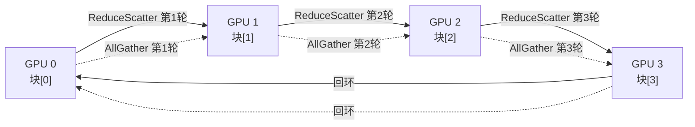

# 15 · NCCL 集合通信

> **NCCL(NVIDIA Collective Communications Library)是多 GPU / 多节点集合通信的高性能实现,支持 ring/tree/SHARP 多种算法,ring allreduce 有效带宽公式为 `2(N-1)/N · M / B`,异步执行依赖 `ncclGroupStart/End` 批量提交。**

## 1. 是什么 / 为什么有它

分布式深度学习训练的核心瓶颈之一是梯度同步:所有参与训练的 GPU 需要把各自计算的梯度加总,再把全局梯度广播回去——这就是 AllReduce 操作。朴素实现需要把梯度先汇集到 master,再广播出去,通信量随 GPU 数量线性增长,很快成为瓶颈。

**NCCL**(NVIDIA Collective Communications Library)专门解决这一问题。它提供一套经过高度优化的集合通信原语——AllReduce、ReduceScatter、AllGather、Broadcast、SendRecv 等——能够自动检测 GPU 间的 NVLink/NVSwitch 拓扑、选择最优算法(ring、tree、SHARP),充分利用所有可用带宽。PyTorch DDP、FSDP,以及 JAX 的 pjit、Megatron-LM 等主流框架的分布式功能都建立在 NCCL 之上。

NCCL 的核心价值在于把复杂的拓扑感知路由和算法选择封装在库内,用户只需声明"我要做 AllReduce",NCCL 会根据当前系统配置自动完成最优调度。对于有 NVSwitch 的系统,NCCL 还会自动启用 SHARP 以获得网内归约加速。

NCCL 所有操作都异步执行:API 调用只是把命令入队到指定 CUDA stream,实际数据传输和计算在设备上并发进行。这使 NCCL 操作可以与其他计算 kernel 在不同 stream 上重叠,实现真正的计算通信重叠(compute-communicate overlap)。在大规模模型训练中,这一特性允许在 AllReduce 梯度的同时继续执行下一层的前向或反向计算,显著减少通信空泡时间。

## 2. 硬件视角(微架构细节)

**Ring AllReduce 算法:**  
Ring AllReduce 是 NCCL 在多 GPU 全连接拓扑中最常用的基础算法。N 个 GPU 排成逻辑环,每个 GPU 持有 1/N 的数据块。算法分两个阶段:

- **ReduceScatter 阶段**(N-1 轮):每个 GPU 把自己的 1/N 数据块发给下一个 GPU 并与之累加,经 N-1 轮后,每个 GPU 各自持有某个 1/N 数据块的完整归约结果。
- **AllGather 阶段**(N-1 轮):每个 GPU 把自己已归约完的 1/N 块沿环广播,经 N-1 轮后,所有 GPU 都拥有完整的归约结果。

总通信量 = `2(N-1)/N · M`,其中 M 是总数据量。当 N 趋于无穷时趋近 2M,与 GPU 数量无关——这是 ring allreduce 的扩展性优势。



**Tree AllReduce 算法:**  
适用于小消息(通常 < 1 MB):N 个 GPU 组织成二叉树,reduce 沿树向上归约到根节点,再从根广播回叶节点。延迟复杂度 O(log N) 比 ring 的 O(N) 更低,但带宽利用率不及 ring。NCCL 会根据消息大小自动在两种算法间切换。树算法的延迟优势在 N 较大(如 64 或 128 GPU)时尤为明显:ring 的轮数随 N 线性增长,而树的深度仅为 log2(N)。对于 batch norm 统计量、loss 标量等小张量的同步,tree 算法的端到端延迟通常比 ring 低 2-5 倍。

**SHARP(网内归约):**  
在配备 NVSwitch 3 的系统中,NCCL 会把 AllReduce 操作的归约步骤卸载到 NVSwitch 的 SHARP 引擎中执行。数据从 GPU 发出经过 NVSwitch 时即完成累加,无需在各 GPU 上各做一次——有效带宽约翻倍,延迟也降低约 30-40%。SHARP 支持 FP16、BF16、FP32、INT8 归约。从实现角度看,SHARP AllReduce 只需做一次 ReduceScatter(把数据送入 NVSwitch 归约),归约结果直接广播回所有 GPU,省去了 ring 的 AllGather 阶段流量,因此实际传输量从 2(N-1)/N × M 降低到约 M,带宽利用率几乎翻倍。使用 SHARP 需要 NVSwitch 硬件支持且 NCCL 版本 ≥ 2.11。

## 3. CUDA 编程接口

**初始化 communicator:**

```cpp
#include <nccl.h>
#include <cuda_runtime.h>

int nGPUs = 8;
ncclComm_t comms[8];
int devList[8] = {0, 1, 2, 3, 4, 5, 6, 7};

// 一次性初始化所有 rank(单进程多 GPU)
ncclCommInitAll(comms, nGPUs, devList);

// 多进程模式:需要 unique ID 在进程间同步
ncclUniqueId id;
if (myRank == 0) ncclGetUniqueId(&id);
MPI_Bcast(&id, sizeof(id), MPI_BYTE, 0, MPI_COMM_WORLD);
ncclComm_t comm;
ncclCommInitRank(&comm, nRanks, id, myRank);
```

**执行 AllReduce:**

```cpp
// 单次 AllReduce:所有元素相加后广播回去
ncclAllReduce(
    sendBuf,            // 输入缓冲(device 内存)
    recvBuf,            // 输出缓冲(可与输入相同,in-place)
    count,              // 元素个数
    ncclFloat,          // 数据类型(ncclHalf/ncclBFloat16/ncclFloat/ncclDouble)
    ncclSum,            // 规约操作(ncclSum/ncclMin/ncclMax/ncclProd)
    comm,               // communicator
    stream              // CUDA stream
);
```

**ReduceScatter + AllGather(FSDP 风格):**

```cpp
// ReduceScatter:每个 rank 得到 count/nRanks 个元素的归约结果
ncclReduceScatter(sendBuf, recvBuf,
    count / nRanks, ncclFloat, ncclSum, comm, stream);

// AllGather:把每个 rank 的 partial 结果广播回全量
ncclAllGather(recvBuf, allgatheredBuf,
    count / nRanks, ncclFloat, comm, stream);
```

**批量异步提交(GroupStart/End):**  
不同 NCCL op 之间默认串行。用 `ncclGroupStart/End` 包裹可以让多个 op 并行启动,减少总延迟:

```cpp
ncclGroupStart();
// 这两个 AllReduce 将并发执行(若带宽允许)
ncclAllReduce(buf0, buf0, n, ncclFloat, ncclSum, comm0, stream0);
ncclAllReduce(buf1, buf1, n, ncclFloat, ncclSum, comm1, stream1);
ncclGroupEnd();
```

**Broadcast 和 SendRecv:**

```cpp
// 从 root=0 广播到所有 rank
ncclBroadcast(sendBuf, recvBuf, count, ncclFloat, /*root=*/0, comm, stream);

// 点对点:rank 0 发给 rank 1
ncclGroupStart();
if (myRank == 0) ncclSend(buf, count, ncclFloat, /*peer=*/1, comm, stream);
if (myRank == 1) ncclRecv(buf, count, ncclFloat, /*peer=*/0, comm, stream);
ncclGroupEnd();
```

## 4. 关键性能指标

**Ring AllReduce 有效带宽公式:**

```
time = 2 × (N-1)/N × M / (B_NVLink)
BW_effective = 2(N-1)/N × B_NVLink
```

其中 `M` 是总数据量,`B_NVLink` 是单方向 NVLink 带宽(H100 SXM5 约 450 GB/s 单向)。N=8 时有效系数 = 2×7/8 = 1.75,即理论有效带宽约 787 GB/s。

**SHARP 加速比:** 使用 SHARP 时归约在 NVSwitch 内完成,避免了 ReduceScatter + AllGather 两个阶段的流量,理论有效带宽趋近 `B_NVLink`(单向),约提升 1.75 倍。实测 SHARP AllReduce 比纯软件 ring 快约 1.5-2 倍。

**消息大小与算法选择阈值:** NCCL 默认在以下条件切换算法:
- 消息 < 1 MB:使用 tree allreduce(低延迟)
- 消息 ≥ 1 MB:使用 ring allreduce(高带宽)
- NVSwitch SHARP 可用时:首选 SHARP
可通过环境变量 `NCCL_ALGO` 手动指定算法。

**AllReduce latency(小消息):** 在 8 GPU NVSwitch 全连接系统中,4 KB 消息的 AllReduce 延迟约 20-30 µs(SHARP),ring 约 50-80 µs。

## 5. 代码示例

一段完整的单进程多 GPU NCCL AllReduce 模板,包含初始化、执行、销毁:

```cpp
#include <nccl.h>
#include <cuda_runtime.h>
#include <cstdio>
#include <cstdlib>

#define NCCL_CHECK(call)                                        \
    do {                                                        \
        ncclResult_t r = (call);                                \
        if (r != ncclSuccess) {                                 \
            fprintf(stderr, "NCCL error: %s\n",                \
                    ncclGetErrorString(r));                     \
            exit(EXIT_FAILURE);                                 \
        }                                                       \
    } while (0)

int main() {
    const int nGPUs = 4;
    const int N     = 1 << 22;  // 4M 元素/GPU

    float*       d_buf[nGPUs];
    cudaStream_t streams[nGPUs];
    ncclComm_t   comms[nGPUs];
    int          devList[nGPUs] = {0, 1, 2, 3};

    // 初始化 communicator(内部自动检测拓扑)
    NCCL_CHECK(ncclCommInitAll(comms, nGPUs, devList));

    for (int i = 0; i < nGPUs; i++) {
        cudaSetDevice(devList[i]);
        cudaMalloc(&d_buf[i], N * sizeof(float));
        cudaMemset(d_buf[i], 0, N * sizeof(float));
        cudaStreamCreate(&streams[i]);
    }

    // 执行 AllReduce(in-place)
    NCCL_CHECK(ncclGroupStart());
    for (int i = 0; i < nGPUs; i++) {
        NCCL_CHECK(ncclAllReduce(
            d_buf[i], d_buf[i], N,
            ncclFloat, ncclSum, comms[i], streams[i]));
    }
    NCCL_CHECK(ncclGroupEnd());

    // 等所有 GPU 完成
    for (int i = 0; i < nGPUs; i++) {
        cudaSetDevice(devList[i]);
        cudaStreamSynchronize(streams[i]);
    }
    printf("AllReduce done.\n");

    // 清理
    for (int i = 0; i < nGPUs; i++) {
        ncclCommDestroy(comms[i]);
        cudaFree(d_buf[i]);
        cudaStreamDestroy(streams[i]);
    }
    return 0;
}
```

## 6. 实测手段

**`NCCL_DEBUG=INFO`** 环境变量让 NCCL 在初始化时打印拓扑检测结果和算法选择:

```bash
NCCL_DEBUG=INFO ./app 2>&1 | grep -E "NCCL|ring|tree|SHARP"
```

输出会显示 NCCL 探测到的 NVLink 拓扑、选择的算法(ring/tree)以及是否启用 SHARP。

**NCCL Tests 带宽测试:**

```bash
# 测试 8 GPU 的 allreduce 带宽(4 KB 到 4 GB)
./build/all_reduce_perf -b 4 -e 4G -f 2 -g 8
```

输出的 `busbw`(bus bandwidth)列反映 NVLink 利用率。

**NSight Systems** 可以可视化 NCCL 内核的执行时间线:

```bash
nsys profile --trace=cuda,nvtx -o nccl_trace ./app
```

NCCL 内核在时间线中以 `ncclDevKernel_*` 命名,可以看到各 ring 步骤的时间分布。

**`NCCL_ALGO` 和 `NCCL_PROTO`** 环境变量可以强制指定算法和协议,用于实验对比:

```bash
NCCL_ALGO=Ring NCCL_PROTO=Simple ./app    # 强制 ring + simple 协议
NCCL_ALGO=Tree ./app                      # 强制 tree 算法
```

## 7. 常见反模式

**1. 不同 rank 调 NCCL op 顺序不一致(死锁):** NCCL collective 要求所有 rank 同时调用相同类型和参数的 op。若某个 rank 逻辑错误导致调用了不同的 op(如 rank 0 调 AllReduce 但 rank 1 调 Broadcast),两者互相等待,进程永久挂起。调试时可设 `NCCL_DEBUG=WARN` 看超时警告。

**2. 用错 communicator 实例:** NCCL 支持多个 communicator(用于不同的通信组)。把 pipeline 并行的 comm 用在 data 并行 AllReduce 上会导致把梯度发给错误的 rank,产生数值错误或崩溃。初始化多个 comm 时务必记录每个 comm 的用途并严格对应。

**3. 忘记 `ncclGroupStart/End` 让多 op 串行化:** 在 FSDP 等需要同时做多个 AllReduce 的场景,未用 Group 包裹会导致每个 op 依次等待,总时间是各 op 时间之和。正确使用 GroupStart/End 可以让多个独立 AllReduce 并发执行,总时间接近最慢那个。

**4. 在 NCCL stream 上夹杂普通 kernel:** NCCL 内部用自己的 stream 排队,若用户把计算 kernel 放到与 NCCL 相同的 stream,会破坏 NCCL 的流水线节奏。最好为 NCCL 单独创建 stream,通过 event 与计算 stream 同步。

**5. 未检查 NCCL 返回值:** NCCL API 的返回类型 `ncclResult_t` 包含错误码。忽略返回值会使拓扑不支持、设备失联等错误静默丢失,只在后续 op 挂起时才能发现,调试极为困难。

## 8. 延伸阅读

- NCCL User Guide: docs.nvidia.com/deeplearning/nccl/user-guide — AllReduce、ReduceScatter、AllGather、GroupStart/End 详解
- NCCL GitHub: github.com/NVIDIA/nccl — 源码、环境变量配置表、ring/tree 算法实现
- NCCL Tests: github.com/NVIDIA/nccl-tests — 带宽、延迟基准测试工具
- Hopper Whitepaper §NVSwitch 3 + SHARP — SHARP 归约的硬件实现原理
- NCCL 算法白皮书: Thakur et al. "Optimization of Collective Communication Operations in MPICH" — ring allreduce 带宽公式推导
- CUDA C++ Programming Guide §3.2.6.7 — Multi-Device 执行与 P2P 的关系
