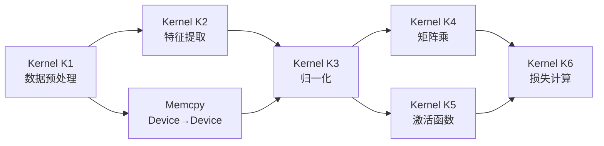

# 16 · CUDA Graphs

> **CUDA Graph 把一系列 stream 操作捕获为 DAG,实例化后单次 launch 可重复执行整个 DAG,把每轮训练数百次 kernel launch 的 CPU 开销从数毫秒压缩到约 1 µs;`cudaGraphExecUpdate` 允许在不重新实例化的情况下更新节点参数。**

## 1. 是什么 / 为什么有它

传统 CUDA 程序每次执行 kernel 都需要 CPU 调用一次 launch API。这次调用包含 driver 验证参数、将命令写入 GPU 命令队列等步骤,在 Hopper 上约需 3-5 µs。对于单个大 kernel 来说微不足道,但现代深度学习框架中,一个训练 step 会生成数百个甚至上千个细粒度 kernel launch——attention、layernorm、激活函数、各种小算子——累积的 launch 开销可达 5-20 ms,显著占用 step 时间。

**CUDA Graph** 把一系列 stream 操作(kernel launch、memcpy、memset 及其依赖关系)表达为一个有向无环图(DAG)。图被实例化为可执行句柄后,一次 `cudaGraphLaunch` 调用即可触发整个 DAG 的执行,而无需 CPU 逐一提交每个节点。对于固定结构的训练循环(参数每步变化但图结构不变),这意味着 CPU 启动开销从 O(kernel 数量) 降低到 O(1)。

CUDA Graph 还允许驱动层对 DAG 做整体优化:合并 barrier、重排节点以提升并发度、提前分配资源等,这些优化在逐条 launch 模式下不可能实现。PyTorch 从 1.10 开始提供 `torch.cuda.graph()` 的封装,内部即使用 CUDA Graph stream capture。

值得注意的是 CUDA Graph 的收益并非总是显著。对于单个运行时间 > 10 ms 的大 kernel,launch 开销本身可以忽略不计,使用 graph 的意义不大。Graph 的价值在于存在大量小 kernel 的场景:例如 Transformer 的 attention 层在序列长度较短时会产生数十个小 kernel,每个只跑几十微秒,这时 launch 开销可能占总 step 时间的 20-30%,graph 化后能带来显著加速。在使用前应先用 NSight Systems 确认 CPU 提交开销是否真的是瓶颈。

## 2. 硬件视角(微架构细节)

CUDA Graph 的核心硬件支持是**执行图(Execution Graph)**机制:driver 在实例化阶段把 DAG 编译成一组设备端命令块,这些命令块之间通过信号量联系(依赖边),每个节点的命令块在依赖全部满足后由 GigaThread 引擎自动触发。

**节点类型:** CUDA Graph 支持的节点类型包括 kernel 节点、memcpy 节点、memset 节点、host callback 节点、child graph 节点,以及 CUDA 12.4 引入的 conditional 节点(设备侧分支或循环,允许动态控制流)。

**instantiate 阶段的工作:** `cudaGraphInstantiate` 会分析 DAG 的依赖关系、预分配资源、生成设备端 work descriptor,这一过程通常需要数十到数百毫秒。但之后每次 `cudaGraphLaunch` 只需提交一个指向已编译 descriptor 的指针,开销约 1-2 µs。

典型 DAG 结构如下图:



上图中 K4 和 K5 之间无依赖关系,可以在 SM 上并行执行。在传统 stream 模式下,实现这种并发需要创建多个 stream 并手动协调 event;而 CUDA Graph 从 capture 阶段就自动记录依赖关系,无需用户显式管理 event。此外,graph 实例化后驱动可以对节点调度做额外优化,例如把无依赖关系但资源需求小的节点尽量并发分派到不同 SM,提升硬件利用率。

**Graph update vs re-instantiate:** `cudaGraphExecUpdate` 允许在已实例化的图上更新节点参数(如 kernel 参数指针、memcpy 大小),而无需重新运行昂贵的 instantiate。这对于每个 step 需要修改 batch 指针但图结构不变的训练循环特别有用。若图结构本身改变(新增/删除节点或依赖边),则必须重新 instantiate。`cudaGraphExecUpdate` 内部通过对比旧 graph 和新 graph 的拓扑结构找到变化的节点,只更新那些发生变化的部分,因此更新速度远快于全量 instantiate。更新过程中如果发现图结构不兼容(如节点类型改变),API 会返回 `cudaErrorGraphExecUpdateFailure` 并告知不兼容节点的位置。

## 3. CUDA 编程接口

**方式一:Stream Capture(推荐)**

Stream capture 是最常用的建图方式:把常规 stream API 调用"录制"到 graph 中:

```cpp
cudaGraph_t     graph;
cudaGraphExec_t graphExec;
cudaStream_t    captureStream;
cudaStreamCreate(&captureStream);

// 开始捕获:captureStream 上的所有操作被记录为图节点
cudaStreamBeginCapture(captureStream, cudaStreamCaptureModeGlobal);

// --- 这里的 API 调用被捕获,不立即执行 ---
cudaMemcpyAsync(d_dst, d_src, bytes, cudaMemcpyDeviceToDevice, captureStream);
myKernel1<<<grid, block, 0, captureStream>>>(args1...);
myKernel2<<<grid, block, 0, captureStream>>>(args2...);
// -----------------------------------------

// 结束捕获,生成 graph 对象
cudaStreamEndCapture(captureStream, &graph);

// 实例化(耗时 ~100 ms,只做一次)
cudaGraphInstantiate(&graphExec, graph, nullptr, nullptr, 0);

// 销毁原始 graph 对象(已不需要)
cudaGraphDestroy(graph);
```

**多次 replay:**

```cpp
// 每个 iteration 只需一次 launch,CPU 开销 ~1 µs
for (int iter = 0; iter < maxIter; iter++) {
    cudaGraphLaunch(graphExec, stream);
    cudaStreamSynchronize(stream);
}
```

**方式二:显式构造**

适合图结构无法通过 stream 表达(如复杂依赖)的场景:

```cpp
cudaGraph_t graph;
cudaGraphCreate(&graph, 0);

// 添加 memset 节点
cudaGraphNode_t memsetNode;
cudaMemsetParams memsetParams = {};
memsetParams.dst   = d_buf;
memsetParams.value = 0;
memsetParams.count = N * sizeof(float);
cudaGraphAddMemsetNode(&memsetNode, graph, nullptr, 0, &memsetParams);

// 添加 kernel 节点,依赖 memset 节点完成
cudaGraphNode_t kernelNode;
cudaKernelNodeParams kParams = {};
void* kArgs[] = { &d_buf, &N };
kParams.func           = (void*)myKernel;
kParams.gridDim        = dim3(N / 256);
kParams.blockDim       = dim3(256);
kParams.sharedMemBytes = 0;
kParams.kernelParams   = kArgs;
cudaGraphAddKernelNode(
    &kernelNode, graph, &memsetNode, 1, &kParams);

cudaGraphInstantiate(&graphExec, graph, nullptr, nullptr, 0);
```

**更新已实例化图的 kernel 参数:**

```cpp
cudaKernelNodeParams updatedParams = {};
updatedParams.func           = (void*)myKernel;
updatedParams.gridDim        = dim3(newN / 256);
updatedParams.blockDim       = dim3(256);
updatedParams.kernelParams   = newArgs;
cudaGraphExecKernelNodeSetParams(graphExec, kernelNode, &updatedParams);
```

**Conditional node(CUDA 12.4+):**

```cpp
// 设备侧条件分支:根据 condition handle 的值决定是否执行子图
cudaGraphConditionalHandle condHandle;
cudaGraphConditionalHandleCreate(&condHandle, graph, 0, 0);
// ... 在 kernel 内部通过 cudaGraphSetConditional(condHandle, 1/0) 控制
```

## 4. 关键性能指标

**launch 开销对比:**

| 方式 | 每次 launch 主机开销 |
|---|---|
| 逐条 kernel launch | ~3-5 µs / kernel |
| `cudaGraphLaunch` | ~1-2 µs(整个 DAG) |
| 100 个 kernel 的 step | 约 300-500 µs → 约 2 µs |

**instantiate 开销:** 一次 `cudaGraphInstantiate` 通常需要 50-500 ms,取决于图的节点数量和复杂度。对于每 epoch 调用一次 instantiate 而每 step 都 launch 的训练循环,摊销后几乎可以忽略。

**Graph update vs re-instantiate:** `cudaGraphExecUpdate` 约需 5-50 µs,比重新 instantiate 快 100-1000 倍。若每 step 需要更新指针或尺寸但不改变图结构,应优先使用 update。

**capture 模式选择:**
- `cudaStreamCaptureModeGlobal`:任何 stream 的操作都能被捕获(包括 event 同步),但要求所有 stream 同时处于捕获模式。
- `cudaStreamCaptureModeThreadLocal`:只捕获当前线程创建的 stream 操作,适合多线程框架。
- `cudaStreamCaptureModeRelaxed`:最宽松,允许未捕获的 stream 操作继续执行。

## 5. 代码示例

下面完整演示 stream capture + 多次 replay 的标准模板,包含参数更新:

```cpp
#include <cuda_runtime.h>
#include <cstdio>

__global__ void transform(float* out, const float* in, float scale, int n) {
    int idx = blockIdx.x * blockDim.x + threadIdx.x;
    if (idx < n) out[idx] = in[idx] * scale;
}

int main() {
    const int N = 1 << 20;  // 1M 元素
    const int ITERS = 1000;

    float *d_in, *d_out;
    cudaMalloc(&d_in,  N * sizeof(float));
    cudaMalloc(&d_out, N * sizeof(float));
    cudaMemset(d_in, 0, N * sizeof(float));

    cudaStream_t captureStream, launchStream;
    cudaStreamCreate(&captureStream);
    cudaStreamCreate(&launchStream);

    // === 1. 捕获阶段(只执行一次) ===
    cudaGraph_t     graph;
    cudaGraphExec_t graphExec;

    cudaStreamBeginCapture(captureStream, cudaStreamCaptureModeGlobal);

    float scale = 1.0f;
    int   blocks = (N + 255) / 256;
    transform<<<blocks, 256, 0, captureStream>>>(d_out, d_in, scale, N);

    cudaStreamEndCapture(captureStream, &graph);
    cudaGraphInstantiate(&graphExec, graph, nullptr, nullptr, 0);
    cudaGraphDestroy(graph);  // 实例化后可以销毁原始图

    // === 2. 重复 launch 阶段 ===
    for (int iter = 0; iter < ITERS; iter++) {
        // 每 100 步更新 scale 参数(仅更新参数,不重建图)
        // 注:stream capture 捕获的 kernel params 是指针快照
        // 若要改数值,可改变设备内存里的值,无需更新 graphExec

        cudaGraphLaunch(graphExec, launchStream);
        // 注意:这里不每步 sync,让多个 graph launch 在设备上流水
        if (iter % 100 == 99)
            cudaStreamSynchronize(launchStream);
    }
    cudaStreamSynchronize(launchStream);

    printf("Graph replay complete (%d iterations).\n", ITERS);

    // === 3. 清理 ===
    cudaGraphExecDestroy(graphExec);
    cudaStreamDestroy(captureStream);
    cudaStreamDestroy(launchStream);
    cudaFree(d_in);
    cudaFree(d_out);
    return 0;
}
```

调试时可将图结构导出为 DOT 格式可视化:

```cpp
cudaGraphDebugDotPrint(graph, "graph.dot", cudaGraphDebugDotFlagsVerbose);
// 然后: dot -Tpng graph.dot -o graph.png
```

## 6. 实测手段

**NSight Systems** 自动识别 graph launch 并在时间线中展示:

```bash
nsys profile -t cuda -o out ./app
```

时间线会显示 `cudaGraphLaunch` 的 CPU 侧耗时以及 DAG 中各节点在 GPU 上的执行时间段,便于确认哪些节点真正并发执行。

**`cudaGraphDebugDotPrint`** 导出 DOT 图:

```bash
# 在代码中调用后:
dot -Tsvg graph.dot -o graph.svg
# 在浏览器中查看 DAG 结构
```

**`cudaGraphExecGetInfo`** 可获取 exec 中节点数量、边数量等元信息(CUDA 12.x):

```cpp
cudaGraphExecInfo_t info;
cudaGraphExecGetInfo(graphExec, &info);
printf("nodes=%zu edges=%zu\n", info.numNodes, info.numEdges);
```

**GPU 时间对比实验:** 使用 `cudaEvent` 分别测量"逐条 launch 模式"和"Graph launch 模式"的总 GPU 时间及总 CPU 时间,对比两种模式的实际加速比。

## 7. 常见反模式

**1. capture 期间调用非 capture-safe API:** `cudaMalloc`、`cudaFree`、`cudaMemcpy`(同步版)等 API 在 capture 期间不被支持,调用会返回错误并终止 capture。所有内存分配应在 `cudaStreamBeginCapture` 之前完成。异步版本(`cudaMemcpyAsync`、`cudaMemsetAsync`)是 capture-safe 的。

**2. conditional node 在 CUDA < 12.4 上使用:** `cudaGraphNodeTypeConditional` 是 CUDA 12.4 引入的新特性,在旧版本上会返回 `cudaErrorNotSupported`。在编写跨版本代码时应检查 CUDA 版本或对应的 Driver API 版本。

**3. 忘记 `cudaGraphInstantiate` 就直接 launch graph:** `cudaGraph_t` 是描述图结构的对象,不能直接 launch;必须先调用 `cudaGraphInstantiate` 得到 `cudaGraphExec_t` 才能 launch。这是 API 设计上的两步分离,常被初学者遗漏。

**4. 忽略 capture 模式的多线程影响:** `cudaStreamCaptureModeGlobal` 会在 capture 期间对所有线程上的所有 stream 操作打标记,若其他线程正在提交 kernel 到未捕获的 stream,行为未定义。多线程框架应使用 `cudaStreamCaptureModeThreadLocal`。

**5. 每 step 重新 instantiate 而不用 update:** 若 kernel 参数(如 batch 指针)每步都变化但图结构不变,应用 `cudaGraphExecKernelNodeSetParams` 或 `cudaGraphExecUpdate` 更新,而非每步重新 `cudaGraphInstantiate`。后者开销 100-500 ms,前者仅需 µs 级别。

## 8. 延伸阅读

- CUDA C++ Programming Guide §3.2.8 — CUDA Graphs(stream capture、显式构造、conditional node、update)
- CUDA C++ Programming Guide §3.2.8.7.10 — Capturing CUDA Graphs
- CUDA Driver API `cuGraph*` 系列函数参考(docs.nvidia.com/cuda/cuda-driver-api)
- CUDA Best Practices Guide §11 — CUDA Graph Best Practices
- NSight Systems User Guide — CUDA Graph Visualization
- PyTorch CUDA Graph 封装源码: github.com/pytorch/pytorch(torch/cuda/graphs.py)
- CUDA Sample: `simpleCudaGraphs`(路径:`CUDA_Samples/3_CUDA_Features/simpleCudaGraphs/`)
