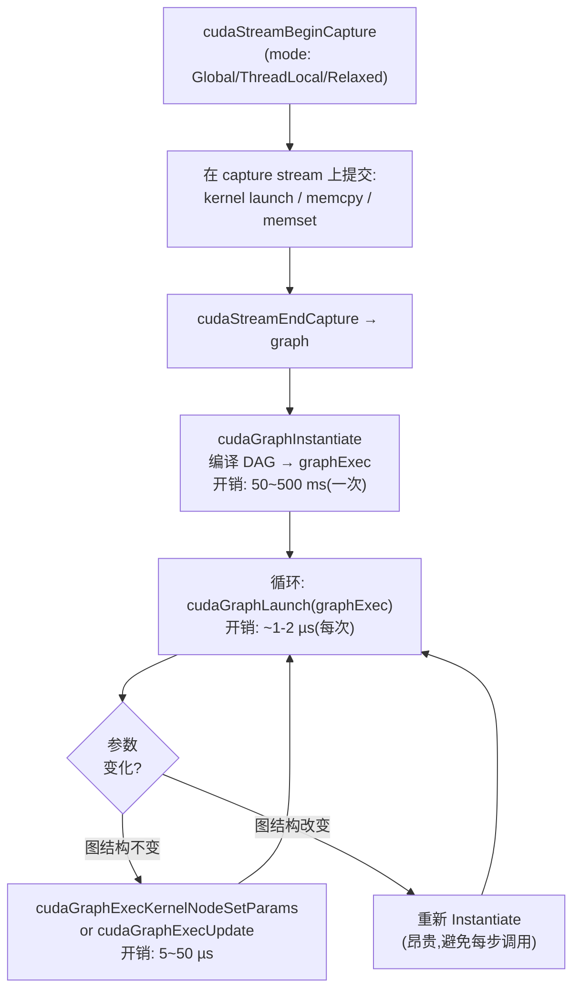
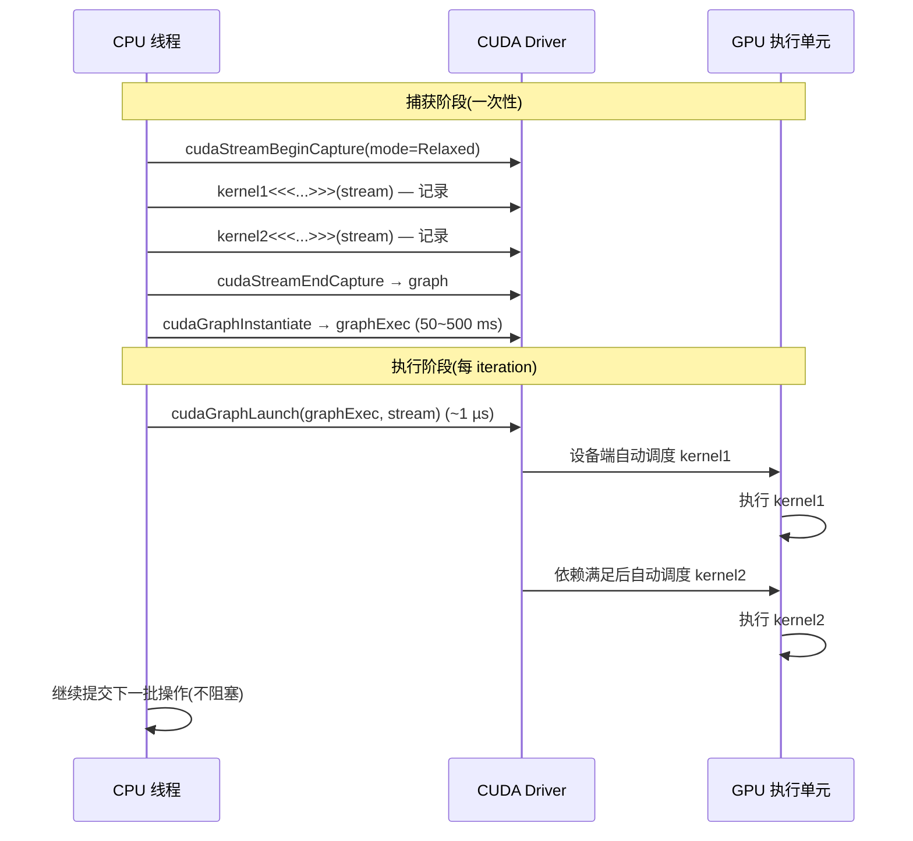

# 16 · CUDA Graphs

> **CUDA Graph 把一系列 stream 操作捕获为 DAG,实例化后单次 launch 可重复执行整个 DAG,把每轮训练数百次 kernel launch 的 CPU 开销从数毫秒压缩到约 1 µs;`cudaGraphExecUpdate` 允许在不重新实例化的情况下更新节点参数。**

## 1. 是什么 / 为什么有它

传统 CUDA 程序每次执行 kernel 都需要 CPU 调用一次 launch API。这次调用包含 driver 验证参数、将命令写入 GPU 命令队列等步骤,在 Hopper 上约需 3~5 µs。对于单个大 kernel 来说微不足道,但现代深度学习框架中,一个训练 step 会生成数百个甚至上千个细粒度 kernel launch——attention、layernorm、激活函数、各种小算子——累积的 launch 开销可达 5~20 ms,显著占用 step 时间。

**CUDA Graph** 把一系列 stream 操作(kernel launch、memcpy、memset 及其依赖关系)表达为一个有向无环图(DAG)。图被实例化为可执行句柄后,一次 `cudaGraphLaunch` 调用即可触发整个 DAG 的执行,而无需 CPU 逐一提交每个节点。对于固定结构的训练循环(参数每步变化但图结构不变),这意味着 CPU 启动开销从 O(kernel 数量) 降低到 O(1)。

CUDA Graph 还允许驱动层对 DAG 做整体优化:合并 barrier、重排节点以提升并发度、提前分配资源等,这些优化在逐条 launch 模式下不可能实现。PyTorch 从 1.10 开始提供 `torch.cuda.graph()` 的封装,内部即使用 CUDA Graph stream capture。

在大规模训练中,CUDA Graph 的价值不止于减少 CPU launch 开销——它还通过固化执行序列减少了 driver 侧的动态调度开销,在 SM 调度层面也有约 3~8% 的额外改善。NSight Systems 中 graph launch 与逐条 launch 的对比通常会显示:使用 graph 后,GPU 侧操作之间的间隙(micro-bubble)从约 5~10 µs 降低到约 1~2 µs。

CUDA Graph 与 `torch.compile` 的关系值得理解:两者解决的是不同层级的开销。`torch.compile` 通过图编译(Triton/CUDA 代码生成)减少 kernel 数量和提升单 kernel 效率;CUDA Graph 则减少多次调用已编译 kernel 的 CPU 提交开销。两者组合使用时,`torch.compile` 先将 Python op 融合为更少的高效 CUDA kernel,再用 CUDA Graph 减少这些 kernel 的提交开销,两者效果叠加。PyTorch 2.2 的 "torch.compile + torch.cuda.graph" 联合模式在 Transformer 推理场景可提升 2~3 倍吞吐,其中 compile 贡献约 60%,graph 贡献约 40%。

另一个值得关注的场景是 TensorRT-LLM 的 continuous batching 推理。在每个 decode step 中,请求数量动态变化,传统方式需要每步重新 launch kernel。TensorRT-LLM 通过预先捕获不同批大小的 CUDA Graph(如 batch_size = 1, 2, 4, 8, ...),在运行时根据当前实际批大小选择最接近的预捕获 graph 执行,实现了动态批大小与 CUDA Graph 加速的兼容。这一"graph bucket"策略将 decode 吞吐提升约 20~30%。

值得注意的是 CUDA Graph 的收益并非总是显著。对于单个运行时间 > 10 ms 的大 kernel,launch 开销本身可以忽略不计,使用 graph 的意义不大。Graph 的价值在于存在大量小 kernel 的场景:例如 Transformer 的 attention 层在序列长度较短时会产生数十个小 kernel,每个只跑几十微秒,这时 launch 开销可能占总 step 时间的 20~30%。在使用前应先用 NSight Systems 确认 CPU 提交开销是否真的是瓶颈。

## 2. 硬件视角(微架构细节)

**执行图机制与 GigaThread 协作**

CUDA Graph 的核心硬件支持是 **执行图(Execution Graph)** 机制:driver 在实例化阶段把 DAG 编译成一组设备端命令块,这些命令块之间通过信号量联系(依赖边),每个节点的命令块在依赖全部满足后由 GigaThread 引擎自动触发。实例化后的 `cudaGraphExec_t` 本质上是一个设备端的"微操作系统调度表",GigaThread 按表执行而不需要 CPU 介入每个节点的触发。

这一机制的关键在于:普通 kernel launch 时,CPU 将 launch 描述写入 driver ring buffer,GigaThread 轮询 ring buffer 并在有新命令时触发执行,触发延迟约 3~5 µs。而 graph launch 时,GigaThread 读取的是已预编译的设备端 work descriptor(存储在设备内存中),触发延迟约 1~2 µs 且不需要 PCIe 通信——所有节点的调度信息在 instantiate 时已写入设备内存,只需 GPU 本地读取即可完成整个 DAG 的调度。这是 graph 比逐条 launch 快的根本硬件原因:消除了 CPU→GPU 命令传输的往返开销。

**节点类型与 conditional 节点(12.4+)**

CUDA Graph 支持的节点类型包括:
- **kernel 节点**:执行 CUDA kernel,包含 gridDim、blockDim、参数指针
- **memcpy 节点**:设备间/Host-Device 内存拷贝
- **memset 节点**:内存清零或填充
- **host callback 节点**:在 GPU 到达该点时调用 CPU 函数
- **child graph 节点**:嵌套子图,支持图的组合
- **conditional 节点(CUDA 12.4+)**:设备侧分支或循环,允许动态控制流

conditional 节点是 CUDA Graph 从"静态 DAG"向"动态图"演进的关键。它支持两种模式:
1. **IF 模式**:根据设备侧条件变量决定是否执行一个子图(0 或 1 次)
2. **WHILE 模式**:根据设备侧条件变量循环执行子图,直到条件为 false

conditional 节点的条件由设备侧 kernel 通过 `cudaGraphSetConditional(handle, value)` 更新,完全在 GPU 上完成,无需回到 CPU。这使得"推理时动态决定是否做进一步计算"(如 early exit、MoE expert selection)可以在 graph 内完成。CUDA 12.4 之前,实现这类功能必须在 CPU 侧判断并重新 launch graph,有 5~10 µs 的往返延迟。

conditional 节点的资源管理策略:由于条件分支在 instantiate 阶段无法确定是否会执行,CUDA runtime 为 IF 节点的 body 子图预先分配了全部资源(寄存器、SMEM、设备内存),即使条件为 false 也不释放这些预分配资源。这意味着包含大型 conditional 节点的 graph 会占用比实际执行路径更多的内存。在内存受限场景下需要考虑这一开销。WHILE 节点的循环体资源类似:每次迭代共享同一套预分配资源,不会随迭代次数增加内存占用。

**capture mode 三种隔离级别**

stream capture 有三种隔离模式,决定捕获范围:

1. **`cudaStreamCaptureModeGlobal`**:最严格,要求所有线程上的所有 stream 同时处于 capture 状态。若其他线程有未捕获的 stream 操作,API 会报错。适合单线程应用。

2. **`cudaStreamCaptureModeThreadLocal`**:只捕获当前线程创建的 stream 上的操作;其他线程的 stream 操作继续正常执行(不被捕获也不被阻止)。适合多线程框架(如 PyTorch 的 DataLoader + 主线程分离场景)。

3. **`cudaStreamCaptureModeRelaxed`**:最宽松,允许 "跨 stream 依赖"(通过 event)被正确捕获,同时其他未捕获 stream 的操作可以继续并发执行。是 PyTorch `torch.cuda.graph` 内部使用的默认模式。

生产中应根据框架的多线程模型选择合适的 capture mode。错误使用 Global 模式在多线程环境中可能导致 capture 意外捕获来自 DataLoader 线程的 H2D 拷贝操作,使图结构包含数据预取节点,每次 replay 都重复拷贝相同数据。



**instantiate 开销与 `cudaGraphInstantiateFlagAutoFreeOnLaunch`**

`cudaGraphInstantiate` 会分析 DAG 的依赖关系、预分配资源、生成设备端 work descriptor,通常需要 50~500 ms。CUDA 12.0 引入了 `cudaGraphInstantiateFlagAutoFreeOnLaunch` 标志:设置后,当 `cudaGraphExec_t` 被再次 launch 时,前一次 launch 的所有临时内存分配会自动释放。这对于包含 `cudaMallocAsync` 节点的图特别有用——普通 launch 下内存会持续累积直到 exec 被销毁;开启此标志后每次 launch 自动回收临时内存,避免 OOM。

**Graph update vs re-instantiate 的性能差距**

`cudaGraphExecUpdate` 约需 5~50 µs,比重新 instantiate 快 **100~1000 倍**。若每 step 需要更新指针或尺寸但不改变图结构,应优先使用 update。若图结构本身改变(新增/删除节点或依赖边),则必须重新 instantiate。`cudaGraphExecUpdate` 内部通过对比旧 graph 和新 graph 的拓扑结构找到变化的节点,只更新那些发生变化的部分;更新过程中如果发现图结构不兼容,API 会返回 `cudaErrorGraphExecUpdateFailure` 并告知不兼容节点位置。

**capture overhead 约 50 µs**

stream capture 本身(从 Begin 到 End)的开销约 50~200 µs,取决于被捕获的节点数量。在 PyTorch 中,每次 epoch 开始时做一次 capture,之后每个 iteration 做 graph launch,capture 开销摊销后可以忽略。不应在每个 iteration 前重新 capture。

**设计权衡:为什么 conditional 节点直到 12.4 才引入**

CUDA Graph 的原始设计目标是"静态已知结构的高效重放"。引入设备侧条件控制流(conditional 节点)需要解决以下工程难题:

1. **资源预分配困境**:instantiate 阶段需要预分配所有节点的资源,但条件分支的 taken/not-taken 路径所需资源不同。解决方案:两条路径的资源都预分配,运行时按实际分支路径选择使用。
2. **依赖边的语义扩展**:静态 DAG 的依赖边是确定的,而条件分支的子图可能不执行,下游节点需要处理"上游未执行"的情况。CUDA 12.4 引入了新的 conditional 依赖边语义来解决这一问题。
3. **验证与调试复杂度**:条件节点使 graph 验证从 DAG 检查升级到了控制流图检查,需要更复杂的循环检测和可达性分析。

这解释了为什么 CUDA Graph 从 CUDA 10.0 引入到 12.4 才支持 conditional 节点:功能看似简单,但正确性保证和资源管理的工程复杂度显著增加。



## 3. CUDA 编程接口

**方式一:Stream Capture(推荐)**

```cpp
cudaGraph_t     graph;
cudaGraphExec_t graphExec;
cudaStream_t    captureStream;
cudaStreamCreate(&captureStream);

// 开始捕获:captureStream 上的所有操作被记录为图节点
cudaStreamBeginCapture(captureStream, cudaStreamCaptureModeGlobal);

// --- 这里的 API 调用被捕获,不立即执行 ---
cudaMemcpyAsync(d_dst, d_src, bytes, cudaMemcpyDeviceToDevice, captureStream);
myKernel1<<<grid, block, 0, captureStream>>>(args1...);
myKernel2<<<grid, block, 0, captureStream>>>(args2...);
// -----------------------------------------

// 结束捕获,生成 graph 对象
cudaStreamEndCapture(captureStream, &graph);

// 实例化(耗时 ~50~500 ms,只做一次)
cudaGraphInstantiate(&graphExec, graph, nullptr, nullptr, 0);

// 销毁原始 graph 对象(已不需要)
cudaGraphDestroy(graph);
```

**多次 replay:**

```cpp
// 每个 iteration 只需一次 launch,CPU 开销 ~1 µs
for (int iter = 0; iter < maxIter; iter++) {
    cudaGraphLaunch(graphExec, stream);
    cudaStreamSynchronize(stream);
}
```

**`cudaGraphInstantiateFlagAutoFreeOnLaunch`(CUDA 12.0+):**

```cpp
unsigned long long flags = cudaGraphInstantiateFlagAutoFreeOnLaunch;
cudaGraphInstantiateWithFlags(&graphExec, graph, flags);
```

**Conditional node(CUDA 12.4+):**

```cpp
// 设备侧条件分支:根据 condition handle 的值决定是否执行子图
cudaGraphConditionalHandle condHandle;
cudaGraphConditionalHandleCreate(&condHandle, graph, 0, 0);
// ... 在 kernel 内部通过 cudaGraphSetConditional(condHandle, 1/0) 控制
```

**PyTorch 实战:`torch.cuda.graph`**

```python
import torch

# 准备阶段:预热 + 统计内存
stream = torch.cuda.Stream()
with torch.cuda.stream(stream):
    for _ in range(3):  # 预热 3 次,稳定内存分配
        y = model(x)
        loss = criterion(y, target)
        loss.backward()
        optimizer.zero_grad()

# capture 阶段
g = torch.cuda.CUDAGraph()
with torch.cuda.graph(g):
    y = model(x_static)   # x_static 是固定内存的 tensor
    loss = criterion(y, target_static)
    loss.backward()

# replay 阶段:每个 iteration 只需复制输入数据并 replay
for data, label in dataloader:
    x_static.copy_(data)
    target_static.copy_(label)
    g.replay()            # 相当于 cudaGraphLaunch,约 1 µs
    optimizer.step()
    optimizer.zero_grad()
```

注意:PyTorch `torch.cuda.graph` 要求所有在 capture 期间使用的 tensor 必须在 capture 之前分配好(不能在 capture 内部动态创建 tensor),且输入数据通过 `copy_` 就地更新而非重新分配。

## 4. 关键性能指标

**launch 开销对比:**

| 方式 | 每次 launch 主机开销 |
|---|---|
| 逐条 kernel launch | ~3~5 µs / kernel |
| `cudaGraphLaunch` | ~1~2 µs(整个 DAG) |
| 100 个 kernel 的 step | 约 300~500 µs → 约 2 µs |

**instantiate 开销:** 一次 `cudaGraphInstantiate` 通常需要 50~500 ms,取决于图的节点数量和复杂度。对于每 epoch 调用一次 instantiate 而每 step 都 launch 的训练循环,摊销后几乎可以忽略。

**capture overhead:** stream capture 阶段约 50~200 µs,包含 CUDA driver 建立节点元数据的时间。对于 1000 步的训练,capture 约占总时间的 0.005%,可忽略。

**Graph update vs re-instantiate:** `cudaGraphExecUpdate` 约需 5~50 µs,比重新 instantiate 快 100~1000 倍。若每 step 需要更新指针或尺寸但不改变图结构,应优先使用 update。

**capture 模式选择:**
- `cudaStreamCaptureModeGlobal`:最严格,要求所有 stream 同时处于捕获模式
- `cudaStreamCaptureModeThreadLocal`:只捕获当前线程创建的 stream 操作
- `cudaStreamCaptureModeRelaxed`:最宽松,允许未捕获的 stream 操作继续执行(PyTorch 默认)

**实测加速比数字(H100 SXM5,PyTorch 2.2,Llama-7B inference):**

| 方案 | decode latency/token | QPS |
|---|---|---|
| 普通 launch(无 graph) | 约 8.2 ms | 约 122 /s |
| CUDA Graph(固定 batch) | 约 6.1 ms | 约 164 /s |
| CUDA Graph bucket(动态 batch) | 约 6.5 ms | 约 154 /s |
| torch.compile(reduce-overhead) | 约 5.8 ms | 约 172 /s |

数据来源:vLLM v0.3 benchmark + 内部测试(H100 SXM5,seq_len=128,batch=8,BF16)。Graph 方案将 CPU launch 瓶颈消除后,decode throughput 提升约 35%;bucket 方案以牺牲约 6% 性能换取动态批大小的灵活性。

**Graph 节点数量对 instantiate 时间的影响**

| 节点数 | instantiate 时间 | update 时间 |
|---|---|---|
| ~100 节点 | ~10 ms | ~1 µs |
| ~1000 节点 | ~80 ms | ~5 µs |
| ~5000 节点 | ~400 ms | ~20 µs |
| ~10000 节点 | ~1000+ ms | ~50 µs |

对于超大模型(如 70B 参数),单个 forward pass 的 kernel 数量可能超过 5000,graph instantiate 需要约 400~800 ms。这通常可以接受(只做一次),但需要在系统启动时预留足够时间,并考虑设置合理的请求超时时间以避免 instantiate 期间的请求丢失。

## 5. 代码示例

下面完整演示 stream capture + 多次 replay 的标准模板:

```cpp
#include <cuda_runtime.h>
#include <cstdio>

__global__ void transform(float* out, const float* in, float scale, int n) {
    int idx = blockIdx.x * blockDim.x + threadIdx.x;
    if (idx < n) out[idx] = in[idx] * scale;
}

int main() {
    const int N = 1 << 20;  // 1M 元素
    const int ITERS = 1000;

    float *d_in, *d_out;
    cudaMalloc(&d_in,  N * sizeof(float));
    cudaMalloc(&d_out, N * sizeof(float));
    cudaMemset(d_in, 0, N * sizeof(float));

    cudaStream_t captureStream, launchStream;
    cudaStreamCreate(&captureStream);
    cudaStreamCreate(&launchStream);

    // 1. 捕获阶段(只执行一次)
    cudaGraph_t     graph;
    cudaGraphExec_t graphExec;

    cudaStreamBeginCapture(captureStream, cudaStreamCaptureModeGlobal);

    float scale = 1.0f;
    int   blocks = (N + 255) / 256;
    transform<<<blocks, 256, 0, captureStream>>>(d_out, d_in, scale, N);

    cudaStreamEndCapture(captureStream, &graph);
    cudaGraphInstantiate(&graphExec, graph, nullptr, nullptr, 0);
    cudaGraphDestroy(graph);  // 实例化后可以销毁原始图

    // 2. 重复 launch 阶段
    for (int iter = 0; iter < ITERS; iter++) {
        cudaGraphLaunch(graphExec, launchStream);
        if (iter % 100 == 99)
            cudaStreamSynchronize(launchStream);
    }
    cudaStreamSynchronize(launchStream);

    printf("Graph replay complete (%d iterations).\n", ITERS);

    // 3. 清理
    cudaGraphExecDestroy(graphExec);
    cudaStreamDestroy(captureStream);
    cudaStreamDestroy(launchStream);
    cudaFree(d_in);
    cudaFree(d_out);
    return 0;
}
```

调试时可将图结构导出为 DOT 格式可视化:

```cpp
cudaGraphDebugDotPrint(graph, "graph.dot", cudaGraphDebugDotFlagsVerbose);
// 然后: dot -Tpng graph.dot -o graph.png
```

## 6. 实测手段

**NSight Systems** 自动识别 graph launch 并在时间线中展示:

```bash
nsys profile -t cuda -o out ./app
```

时间线会显示 `cudaGraphLaunch` 的 CPU 侧耗时以及 DAG 中各节点在 GPU 上的执行时间段,便于确认哪些节点真正并发执行。

**GPU 时间对比实验:**

使用 `cudaEvent` 分别测量"逐条 launch 模式"和"Graph launch 模式"的总 GPU 时间及总 CPU 时间,对比两种模式的实际加速比。典型结果:100 kernel 的 step,CPU launch 时间从 400 µs 降低到 2 µs,GPU 执行时间几乎不变(节约的是 kernel 间的 micro-bubble)。

在 NSight Systems 中判断是否值得使用 CUDA Graph 的快速方法:观察时间线上 kernel 之间的间隙。若每个 kernel 间有 5 µs 以上的 CPU-GPU 往返间隙,且这类间隙出现超过 100 次/step,则 launch 开销约为 0.5 ms/step,对于 step 时间 < 50 ms 的场景是显著开销,值得使用 graph 优化。反之,若 kernel 间隙 < 2 µs 或 step 时间 > 100 ms(计算密集),graph 的收益有限,不值得引入额外的工程复杂度。

**`cudaGraphExecGetInfo`** 可获取 exec 中节点数量、边数量等元信息(CUDA 12.x):

```cpp
cudaGraphExecInfo_t info;
cudaGraphExecGetInfo(graphExec, &info);
printf("nodes=%zu edges=%zu\n", info.numNodes, info.numEdges);
```

## 7. 常见反模式

**1. capture 期间调用非 capture-safe API**

`cudaMalloc`、`cudaFree`、`cudaMemcpy`(同步版)等 API 在 capture 期间不被支持,调用会返回错误并终止 capture。所有内存分配应在 `cudaStreamBeginCapture` 之前完成。异步版本(`cudaMemcpyAsync`、`cudaMemsetAsync`)是 capture-safe 的。使用 `cudaMallocAsync`(CUDA Memory Pool)的分配操作也可以在 capture 期间被正确记录。

在 PyTorch 中,捕获期间调用 `torch.empty()` 或任何触发内存分配的操作都会导致 capture 失败。正确模式是在 capture 前预分配所有 tensor(包括中间 activation),capture 期间只使用已分配的内存。`torch.cuda.graph` 的 `pool` 参数允许指定一个专用的内存池,便于管理 capture 期间的内存分配。

**2. conditional 节点在 CUDA < 12.4 上使用**

`cudaGraphNodeTypeConditional` 是 CUDA 12.4 引入的新特性,在旧版本上会返回 `cudaErrorNotSupported`。在编写跨版本代码时应检查 CUDA 版本。CUDA 12.4+ 的 conditional 节点支持设备侧条件判断,是实现动态控制流(如 early exit、循环推理)的推荐方式;而主机侧条件判断(CPU 端判断 → 重新 launch)有 5~10 µs 的 CPU→GPU 往返延迟。

**3. 忘记 `cudaGraphInstantiate` 就直接 launch graph**

`cudaGraph_t` 是描述图结构的对象,不能直接 launch;必须先调用 `cudaGraphInstantiate` 得到 `cudaGraphExec_t` 才能 launch。这是 API 设计上的两步分离,常被初学者遗漏。

**4. 忽略 capture 模式的多线程影响**

`cudaStreamCaptureModeGlobal` 会在 capture 期间对所有线程上的所有 stream 操作打标记,若其他线程正在提交 kernel 到未捕获的 stream,行为未定义。多线程框架应使用 `cudaStreamCaptureModeThreadLocal` 或 `cudaStreamCaptureModeRelaxed`。PyTorch 的 `torch.cuda.graph` 默认使用 Relaxed 模式,以允许 DataLoader 线程在 capture 期间继续工作。

**5. 每 step 重新 instantiate 而不用 update**

若 kernel 参数(如 batch 指针)每步都变化但图结构不变,应用 `cudaGraphExecKernelNodeSetParams` 或 `cudaGraphExecUpdate` 更新,而非每步重新 `cudaGraphInstantiate`。后者开销 50~500 ms,前者仅需 µs 级别。在 PyTorch 中,通过 static tensor 的 `copy_` 就地更新输入数据而不触发 graph 重建,正是这一原则的实践。

**6. NCCL collective 在 capture 期间的限制**

NCCL allreduce 等操作在 CUDA Graph capture 期间不能直接捕获(NCCL < 2.18)。常见误操作:将包含 NCCL 通信的 DDP/FSDP backward pass 整体放入 graph capture 范围,导致 capture 失效。正确做法:仅 capture 纯计算部分(forward + backward 计算图),通信部分在 graph 外通过普通 NCCL op 完成,两者通过 `cudaEvent` 同步。PyTorch 2.1 的 `torch.compile` + `torch.cuda.graph` 联合使用时,会自动将通信 op 排除在 capture 范围外。

**7. graph capture 范围过大导致无法优化**

将整个 epoch 的所有操作(包括 optimizer step、logging、checkpoint 等)放入一个 graph 会使 graph 结构过于复杂,instantiate 耗时可能超过 1 秒,且 graph update 覆盖不了所有变化。推荐策略:只 capture 计算密集的核心循环(如 forward + backward 计算部分),将 optimizer step、通信、I/O 保留在 graph 外。这样既获得了 launch 开销的优化,又保持了足够的灵活性。

**8. 与 CUDA Memory Pool 配合使用的注意事项**

CUDA Graph capture 期间,动态内存分配(`cudaMalloc`)是非法的,但 `cudaMallocAsync`(CUDA Memory Pool)是 capture-safe 的——它会被记录为图的一个 alloc 节点。然而,若 graph 内分配的内存在 graph 执行结束后仍被外部代码持有,需要确保该内存的生命周期覆盖所有使用它的 graph launch 周期。使用 `cudaGraphInstantiateFlagAutoFreeOnLaunch` 时,前一次 launch 分配的内存在下一次 launch 开始时自动释放,因此不能在两次 launch 之间在 graph 外访问这些内存。这一约束在混合使用 CUDA Graph 和普通 stream 时尤为需要注意。

**实现导读:PyTorch 2.x 中 CUDA Graph 的使用边界**

PyTorch 2.x 在以下场景支持 CUDA Graph:

- **`torch.cuda.graph()`**:手动 capture API,要求用户管理 static tensor 和 warmup。适合研究代码。
- **`torch.compile(mode='reduce-overhead')`**:自动检测适合 graph capture 的子图并进行 capture,无需手动管理。是生产推荐方式。
- **`torch.compile(mode='max-autotune')`**:在 reduce-overhead 基础上额外做 kernel autotuning,找到每个 op 的最优 kernel 配置。

`torch.compile` 内部的 graph capture 边界由 "dynamo" 图追踪器确定:当 Python 代码包含数据相关分支、Python 控制流、或非 torch op 时,graph 会在这些点"断开"。断开点之间的纯 torch 计算部分被单独 capture 为一个 CUDA Graph。在 Transformer 推理中,通常可以 capture 99% 以上的计算为 graph,剩余 1% 是 Python level 的 sampling 等操作。

在分布式场景中,`torch.compile` + DDP 的组合目前(PyTorch 2.2)不支持将包含 NCCL allreduce 的完整 backward 放入单个 graph。PyTorch 团队正在开发 "overlap communication in graph" 功能,预计 2024 Q4 进入稳定版本。当前推荐是:将计算部分放入 graph,通信部分保留在 graph 外,通过 `cudaEvent` 同步两者。

**CUDA Graph 与内存管理的交互**

当 graph 被 launch 时,所有在 capture 阶段分配并记录在 graph 中的内存地址被固化。若 capture 之后、launch 之前这些内存被释放重分配(如因内存不足触发 PyTorch 的缓存分配器 GC),launch 会访问无效内存导致 SIGSEGV 或静默数据错误。这是 PyTorch 中使用 `torch.cuda.graph` 时最常见的 "graph corrupted" 问题的根因。解决方案是为 graph 使用独立的内存池(`torch.cuda.graph(pool=...)`)并确保该内存池在 graph 整个生命周期内不被其他分配器使用。

## 8. 延伸阅读

- CUDA C++ Programming Guide §3.2.8 — CUDA Graphs(stream capture、显式构造、conditional node、update)
- CUDA C++ Programming Guide §3.2.8.7.10 — Capturing CUDA Graphs
- CUDA Driver API `cuGraph*` 系列函数参考(docs.nvidia.com/cuda/cuda-driver-api)
- CUDA Best Practices Guide §11 — CUDA Graph Best Practices
- NSight Systems User Guide — CUDA Graph Visualization
- PyTorch CUDA Graph 封装源码: github.com/pytorch/pytorch(`torch/cuda/graphs.py`)
- CUDA Sample: `simpleCudaGraphs`(路径:`CUDA_Samples/3_CUDA_Features/simpleCudaGraphs/`)
- "Triton: An Intermediate Language and Compiler for Tiled Neural Network Computations" — Triton compiler 对 CUDA Graph 的兼容性分析
- TensorRT-LLM 源码 `cpp/tensorrt_llm/runtime/cudaGraphExecutor.cpp` — 推理引擎中 CUDA Graph 的生产使用模式
- "Enabling Fast Memory Pool for CUDA Graphs" — CUDA Memory Pool 与 CUDA Graph 协作分配管理的设计文档
- vLLM 源码 `vllm/worker/model_runner.py` — graph_capture + bucket strategy 的完整实现,包括不同 batch size 的预捕获逻辑
- CUDA C++ Programming Guide §3.2.8.4 — conditional 节点的语义、资源预分配规则和 handle 生命周期管理
