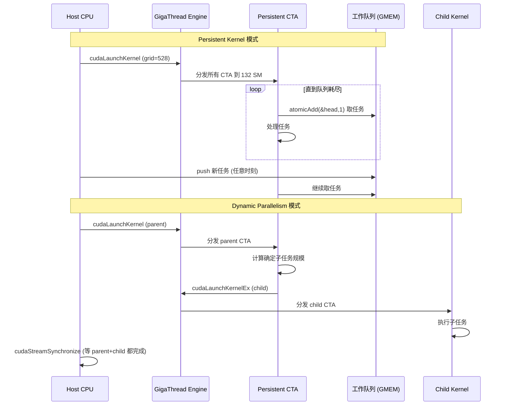

# 17 · Persistent + Dynamic Parallelism

> **Persistent kernel 用 grid-stride 循环持续从工作队列取任务,彻底摊销 launch 开销并天然适配不规则负载;Dynamic Parallelism 让 device 端 kernel 内部通过 `cudaLaunchKernelEx` 启动子 kernel,实现数据相关的递归并行。**

## 1. 是什么 / 为什么有它

在许多实际应用中,工作负载的形状事先未知——任务队列的长度、每个任务的计算量、新任务的产生时机都可能在运行时才能确定。典型场景包括:不规则图算法(BFS、路径追踪)、自适应网格细化(AMR)、实时推理服务(任务随请求到达)。这类工作负载如果用常规 kernel launch 处理,每次都要从 host 重新提交,意味着 host 必须持续参与调度,GPU 在两次 launch 之间可能短暂空闲,且 launch 延迟(~5 µs)在高频任务下累积可观。

**Persistent kernel** 解决第一个问题:启动一个覆盖全部 SM 的长生命周期 grid,grid 内的 CTA 通过原子操作从共享工作队列中抢占任务,处理完一个再取下一个,直到队列为空才退出。Host 只需在启动时 launch 一次,之后持续往队列推任务——GPU 的 SM 从不空闲。

**Dynamic Parallelism(DP)** 解决第二个问题:device 端 kernel 可以在内部 launch 子 kernel,子 kernel 的 grid 配置和参数完全由 parent kernel 的计算结果决定。这使得"先计算分辨率,再按分辨率细化网格,再在细化后的区域上计算"这类递归结构可以全程在 GPU 上完成,无需回到 host。

两种模式在复杂性和适用场景上各有侧重:persistent kernel 更易于实现且开销可预测;dynamic parallelism 表达力更强但 child launch 延迟较高(约 10-20 µs),应谨慎使用。

## 2. 硬件视角(微架构细节)

**Persistent kernel 的 SM 占用策略:**  
Persistent kernel 的 grid 通常设计为恰好占满所有 SM 而不超出,以避免 CTA 等待 SM 空位的队列延迟。以 H100 SXM5(132 SM)为例,若每 SM 驻留 4 个 CTA(每 CTA 256 thread),grid 应设为 132 × 4 = 528 个 CTA。这样所有 CTA 同时分发,grid 一旦启动就饱和所有 SM,之后每个 CTA 反复从队列取任务,直到收到停止信号。

**Dynamic Parallelism 的执行模型:**  
在 Hopper SM90 上,DP 2.0 通过 `cudaLaunchKernelEx` 实现。Parent kernel 调用该 API 时,launch 请求被发送到一个专用的"设备侧 launch 队列"。Runtime 在 SM 上检测到新 launch 请求后,通过 GigaThread 引擎为 child kernel 分配 SM。Child kernel 与 parent kernel 并发运行(parent 不阻塞等待 child,除非显式 sync)。child 完成后,host 端的 `cudaStreamSynchronize` 会等待整个 device-side launch tree 全部完成。

**设备侧 launch 队列深度限制:**  
DP 的并发 pending launch 数有上限,可通过 `cudaDeviceSetLimit(cudaLimitDevRuntimePendingLaunchCount, N)` 设置,默认值通常为 2048。超出限制时 API 会阻塞 parent warp 直到队列有空位,可能导致性能下降。

下图展示两种模式的工作流对比:



## 3. CUDA 编程接口

**Persistent kernel 核心原语:**  
Persistent kernel 没有专用 API,依赖用户代码的 grid-stride loop 模式和原子操作:

```cpp
// 工作队列描述符(host 和 device 共享)
struct WorkQueue {
    int*   taskData;    // 任务数组
    int    capacity;    // 队列容量
    int    head;        // 原子计数器:下一个待取任务索引
    int    total;       // 总任务数(可动态追加)
    bool   done;        // 停止信号
};

__global__ void persistentWorker(WorkQueue* q) {
    while (true) {
        // 原子取一个任务 index
        int taskIdx = atomicAdd(&q->head, 1);
        if (taskIdx >= q->total) {
            // 等一等,可能还有新任务
            if (q->done) return;
            // 简单忙等(生产环境可用 __nanosleep 减少争用)
            __nanosleep(100);
            atomicSub(&q->head, 1);  // 退回 index,重试
            continue;
        }
        // 处理任务 taskIdx
        processTask(q, taskIdx);
    }
}
```

**Dynamic Parallelism(CUDA 12+ 推荐接口):**

```cpp
// parent kernel 内部 launch child kernel
__global__ void parentKernel(float* data, int n) {
    // 假设每个 CTA 根据局部计算决定子任务大小
    int localN = computeSubtaskSize(data, blockIdx.x, n);
    if (localN > 0) {
        cudaLaunchConfig_t cfg = {};
        cfg.gridDim  = dim3((localN + 127) / 128);
        cfg.blockDim = dim3(128);

        cudaLaunchAttribute attr;
        attr.id = cudaLaunchAttributeIgnoreHandleErrors;
        attr.val.ignoreHandleErrors = 1;
        cfg.attrs    = &attr;
        cfg.numAttrs = 1;

        // cudaLaunchKernelEx:CUDA 12+ 推荐的设备侧 launch API
        cudaError_t err = cudaLaunchKernelEx(
            &cfg, childKernel,
            data + blockIdx.x * n / gridDim.x, localN);
        // 注意:不需要 cudaStreamSynchronize 在 device 侧;
        // child 会自动在 parent stream 上排队
    }
}

__global__ void childKernel(float* subData, int n) {
    int idx = blockIdx.x * blockDim.x + threadIdx.x;
    if (idx < n) subData[idx] *= 2.0f;
}
```

**`cudaStreamFireAndForget`:** CUDA 12 引入的"发射即忘"语义,child kernel 被调度后 parent 不等待其完成:

```cpp
cudaLaunchConfig_t cfg = {};
cfg.gridDim = dim3(32); cfg.blockDim = dim3(128);
// 使用 fire-and-forget stream
cudaLaunchAttribute attr;
attr.id = cudaLaunchAttributeFireAndForget;
attr.val.fireAndForget = 1;
cfg.attrs = &attr; cfg.numAttrs = 1;
cudaLaunchKernelEx(&cfg, childKernel, ...);
// parent 立即继续,不管 child 是否完成
```

**persistent kernel 的 launch 参数计算:**

```cpp
int smCount;
cudaDeviceGetAttribute(&smCount, cudaDevAttrMultiProcessorCount, 0);
// 每 SM 4 个 CTA,grid 恰好填满所有 SM
int ctasPerSM = 4;
int gridSize  = smCount * ctasPerSM;
persistentWorker<<<gridSize, 256>>>(d_queue);
```

## 4. 关键性能指标

**Persistent kernel 开销摊销:**  
一次 launch API 约 5 µs;persistent kernel 把 launch 开销摊销到整个 kernel 生命周期,对于运行数秒的 persistent grid,单次 launch 开销可忽略不计。工作队列的竞争(多 CTA 同时 atomicAdd)是主要并发开销:H100 L2 原子操作吞吐约 200 M ops/s,满配 528 CTA 同时抢 head 时每次竞争约 2-3 µs,需要通过分桶(多个子队列)降低争用。

**Dynamic Parallelism 的 child launch 延迟:**  
设备侧 launch 比 host launch 慢约 2-4 倍,典型延迟约 10-20 µs。这比 host launch (~5 µs)高出数倍,因此 DP 不适合需要每几微秒 launch 一次 child 的高频场景。适合的场景是 child kernel 本身运行时间 ≥ 100 µs,使 launch 开销可以摊销。

**递归深度限制:**  
DP 支持的递归嵌套深度默认最大为 24 层。超过时,新的 child launch 会失败并返回 `cudaErrorDeviceRuntimeLaunchExceeded`。实际应用中超过 5-6 层递归就需要重新考虑算法结构。

**SM 资源竞争:**  
Persistent kernel 占满所有 SM 后,其他来自 host 的 stream launch 的 CTA 必须等待 SM 有空位才能执行——持续的 SM 占用会使同节点的其他任务饿死。在多租户环境或需要并发多个 kernel 的场景中,应为 persistent kernel 预留空余 SM(例如只用 90% SM 的 grid 大小)。

## 5. 代码示例

下面是一个完整的 persistent kernel 服务器模式示例,支持动态任务入队:

```cpp
#include <cuda_runtime.h>
#include <cstdio>
#include <cstdlib>

// 简单的无锁任务队列
struct TaskQueue {
    float* __restrict__ data;   // 输入数据指针数组
    float* __restrict__ result; // 输出结果数组
    int                 sizes[4096];  // 每个任务的大小
    volatile int        head;   // 下一个待取 index(原子)
    volatile int        tail;   // 已入队 index(host 更新)
    volatile bool       done;   // host 设为 true 通知退出
};

__global__ void persistentServer(TaskQueue* q) {
    while (true) {
        int idx = atomicAdd((int*)&q->head, 1);
        // 等待任务入队或收到退出信号
        int waitCycles = 0;
        while (idx >= q->tail) {
            if (q->done && idx >= q->tail) return;
            __nanosleep(1000);  // 等 1 µs 再重试
            if (++waitCycles > 10000) return;
        }
        // 处理任务 idx
        int n = q->sizes[idx];
        float* src = q->data + (long)idx * 4096;
        float* dst = q->result + (long)idx * 4096;
        // grid-stride 处理任务内的元素
        for (int i = threadIdx.x; i < n; i += blockDim.x) {
            dst[i] = src[i] * 2.0f;
        }
    }
}

int main() {
    const int TASK_COUNT = 256;
    const int TASK_SIZE  = 4096;

    TaskQueue* h_q;
    cudaHostAlloc(&h_q, sizeof(TaskQueue), cudaHostAllocMapped);
    memset(h_q, 0, sizeof(TaskQueue));

    cudaMalloc(&h_q->data,   (long)TASK_COUNT * TASK_SIZE * sizeof(float));
    cudaMalloc(&h_q->result, (long)TASK_COUNT * TASK_SIZE * sizeof(float));
    for (int i = 0; i < TASK_COUNT; i++) h_q->sizes[i] = TASK_SIZE;

    int smCount;
    cudaDeviceGetAttribute(&smCount, cudaDevAttrMultiProcessorCount, 0);
    TaskQueue* d_q;
    cudaHostGetDevicePointer(&d_q, h_q, 0);

    // 启动 persistent grid
    persistentServer<<<smCount * 2, 128>>>(d_q);

    // Host 动态入队 TASK_COUNT 个任务
    for (int i = 0; i < TASK_COUNT; i++) {
        h_q->tail = i + 1;  // volatile 写,设备可见
    }

    // 通知退出
    h_q->done = true;
    cudaDeviceSynchronize();
    printf("Persistent kernel finished %d tasks.\n", TASK_COUNT);

    cudaFreeHost(h_q);
    return 0;
}
```

## 6. 实测手段

**Persistent kernel 监控:**

```bash
# NSight Systems 观察 persistent kernel 的 SM 持续占用
nsys profile -t cuda -o persistent_out ./app
```

在 NSight Systems 时间线中,persistent kernel 应呈现一个从启动到结束的连续矩形条,而不是多个小的 kernel 条。若看到多段间断,说明工作队列供给不足或 persistent kernel 提前退出。

**DP 调试:**

```cpp
// 查询当前设备侧 pending launch 队列深度上限
size_t launchQueueDepth;
cudaDeviceGetLimit(&launchQueueDepth, cudaLimitDevRuntimePendingLaunchCount);
printf("DP pending launch limit: %zu\n", launchQueueDepth);

// 按需提高上限
cudaDeviceSetLimit(cudaLimitDevRuntimePendingLaunchCount, 4096);
```

**工作队列竞争分析:**  
使用 NSight Compute 查看 persistent kernel 的 `lts__t_sectors_atom_red.sum` 和 `l1tex__t_sectors_pipe_lsu_mem_global_op_atom.sum`,判断原子操作是否成为瓶颈。若 atomic 吞吐接近饱和,考虑改为分桶队列(每个 SM 一个子队列,减少跨 SM 竞争)。

**`nvidia-smi dmon`** 实时看 SM 利用率:

```bash
nvidia-smi dmon -s u -d 1
```

Persistent kernel 运行时 SM util 应持续接近 100%;在队列空乏时会出现 util 下降的脉冲。

## 7. 常见反模式

**1. Persistent kernel 占满 SM 后其他 stream 饿死:** 如果同一个 GPU 上还有其他任务(如数据预处理、结果拷贝的 kernel),persistent kernel 占满全部 132 SM 会让这些任务无法执行。解决方案是减小 grid 大小,预留 10-20% SM 给其他任务,并通过实测确认吞吐不降低。

**2. DP 深度递归触发内存/队列限制:** 对于树形递归算法,每一层的 child kernel 数量呈指数增长,pending launch 队列可能溢出。超出 `cudaLimitDevRuntimePendingLaunchCount` 限制时 launch 失败,后续操作未定义。应先估算最大并发 child 数量,调用 `cudaDeviceSetLimit` 设置足够大的队列。

**3. 在 persistent kernel 中过度使用 `__nanosleep` 忙等:** 过长的忙等消耗 warp slot 而不做有效计算,降低 SM 利用率。建议忙等时间不超过预期任务间隔的 50%,或改用基于 `mbarrier` 的通知机制让 warp 真正让出执行槽。

**4. DP 的 child launch 后忘记同步:** 若 parent kernel 的后续计算依赖 child 的结果,必须在访问结果前等待 child 完成。设备侧没有全局 `cudaDeviceSynchronize`,可以用 `cudaStreamSynchronize(cudaStreamTailLaunch)` 或在 parent kernel 内的 `__syncthreads()` 后通过 volatile 轮询 child 写入的完成标志来协调。

**5. 把 persistent kernel 用于短生命周期的任务:** 如果任务总量确定且有限,用普通的 grid 配合 cooperative groups 做一次性 reduction 更简单高效。persistent kernel 适合真正"不知道何时结束"的长期服务型负载,对于已知总任务数的批处理没有额外优势。

## 8. 延伸阅读

- CUDA C++ Programming Guide §6.5 — CUDA Dynamic Parallelism(DP 语义、限制、递归深度)
- CUDA C++ Programming Guide §3.2.8.7 — Streams in CUDA Graphs(与 graph child node 的关系)
- CUDA Driver API `cudaLaunchKernelEx` — CUDA 12+ 设备侧 launch 接口(docs.nvidia.com/cuda/cuda-driver-api)
- CUDA Sample `cdpSimpleQuicksort`(路径:`CUDA_Samples/3_CUDA_Features/cdpSimpleQuicksort/`)
- CUDA Sample `simpleDeviceMalloc`(展示设备侧内存分配与 DP 配合使用)
- NVIDIA 博客 "CUDA Dynamic Parallelism API and Principles"(developer.nvidia.com)
- Persistent Kernel 模式参考: CUDA Samples `threadFenceReduction`(展示持久 grid + 设备端 fence 同步)
