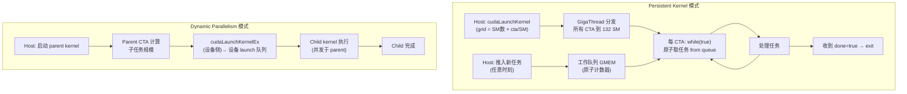
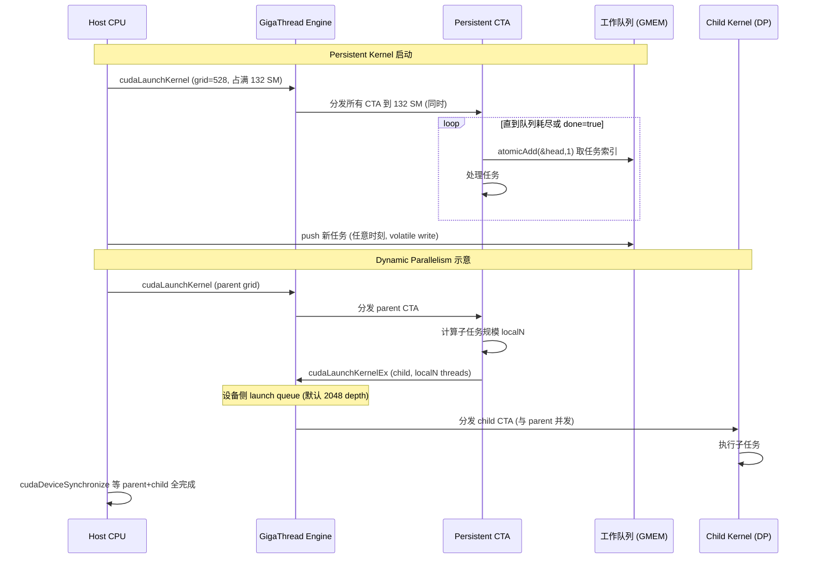

# 17 · Persistent + Dynamic Parallelism

> **Persistent kernel 用 grid-stride 循环持续从工作队列取任务,彻底摊销 launch 开销并天然适配不规则负载;Dynamic Parallelism 让 device 端 kernel 内部通过 `cudaLaunchKernelEx` 启动子 kernel,实现数据相关的递归并行。**

## 1. 是什么 / 为什么有它

在许多实际应用中,工作负载的形状事先未知——任务队列的长度、每个任务的计算量、新任务的产生时机都可能在运行时才能确定。典型场景包括:不规则图算法(BFS、路径追踪)、自适应网格细化(AMR)、实时推理服务(任务随请求到达)。这类工作负载如果用常规 kernel launch 处理,每次都要从 host 重新提交,意味着 host 必须持续参与调度,GPU 在两次 launch 之间可能短暂空闲,且 launch 延迟(~5 µs)在高频任务下累积可观。

传统 kernel launch 模型假设工作负载在 launch 时刻就已完全确定:grid 的形状、所有参数、数据位置都需要在 host 侧算好再提交。这个假设对于矩阵乘法、卷积等形状固定的计算完全成立,但对于以下场景就会出现问题。图神经网络的消息传递阶段,每个节点的邻居数量不同,无法在 launch 前确定每个 CTA 处理多少条边;物理模拟中的粒子碰撞检测,碰撞对的数量随时间步变化;LLM 推理中的投机采样,draft token 的接受数量由当前模型输出决定,不可提前预知。针对这些场景,CUDA 提供了两种互补的解决方案。

**Persistent kernel** 解决第一个问题:启动一个覆盖全部 SM 的长生命周期 grid,grid 内的 CTA 通过原子操作从共享工作队列中抢占任务,处理完一个再取下一个,直到队列为空才退出。Host 只需在启动时 launch 一次,之后持续往队列推任务——GPU 的 SM 从不空闲。

**Dynamic Parallelism(DP)** 解决第二个问题:device 端 kernel 可以在内部 launch 子 kernel,子 kernel 的 grid 配置和参数完全由 parent kernel 的计算结果决定。这使得"先计算分辨率,再按分辨率细化网格,再在细化后的区域上计算"这类递归结构可以全程在 GPU 上完成,无需回到 host。

两种模式在复杂性和适用场景上各有侧重:persistent kernel 更易于实现且开销可预测;dynamic parallelism 表达力更强但 child launch 延迟较高(约 10~20 µs),应谨慎使用。理解这两种模式对设计高效的推理服务调度器和科学计算内核至关重要。

**CUTLASS 3.x sm90 persistent GEMM** 是 persistent kernel 在生产代码中的典型代表:以整个 GPU 的生命周期运行一个 GEMM kernel,通过 TMA load + WGMMA + TMA store 的流水线持续处理 tile 队列,避免了传统 GEMM 的 GigaThread dispatch 延迟和 tail effect 浪费。在 H100 SXM5 上,CUTLASS 3.x persistent GEMM 的 MFU 可达约 72~78%,比非持久化版本高约 8~12 个百分点。传统 GEMM 实现中,每个 tile 的处理需要一次完整的 CTA 生命周期,GigaThread 在每两个 tile 之间必须重新调度,引入约 2~5 µs 的 dispatch 空隙;persistent 实现中同一 CTA 连续处理多个 tile,中间不经过 GigaThread,消除了这些空隙。

## 2. 硬件视角(微架构细节)

**Persistent kernel 的 SM 占用策略与饿死问题**

Persistent kernel 的 grid 通常设计为恰好占满所有 SM 而不超出,以避免 CTA 等待 SM 空位的队列延迟。以 H100 SXM5(132 SM)为例,若每 SM 驻留 4 个 CTA(每 CTA 256 thread),grid 应设为 132 × 4 = 528 个 CTA。这样所有 CTA 同时分发,grid 一旦启动就饱和所有 SM,之后每个 CTA 反复从队列取任务,直到收到停止信号。

从微架构角度看,GigaThread 引擎在 persistent grid 启动瞬间将所有 CTA 分发到各 SM 的 CTA 执行队列,之后不再参与这些 CTA 的调度。每个 SM 内部的 warp 调度器负责在各 CTA 的 warp 之间切换执行,当某个 CTA 因 atomicAdd 竞争或 GMEM 访问延迟而停顿时,调度器自动切换到其他 CTA 的就绪 warp。这种"SM 内部流水线"是 persistent kernel 高吞吐的基础:即使每个 CTA 的任务取得有等待,SM 整体的 warp 利用率仍保持较高水平。

然而,persistent kernel 占满所有 SM 后存在严重的**饿死(starvation)问题**:同节点的其他 kernel launch(来自不同 stream 或不同优先级)无法获得 SM 资源。这在以下场景中造成问题:

1. **数据预处理 kernel**:若推理服务的 input tokenizer kernel 需要在 persistent GEMM kernel 运行期间执行,无 SM 可用,tokenizer 会无限等待,导致新请求无法进入推理队列。
2. **通信 kernel**:NCCL allreduce kernel 需要 SM 执行通信逻辑,persistent kernel 占满 SM 后 NCCL 通信无法执行,可能导致通信超时和分布式训练崩溃。
3. **Priority stream kernel**:即使创建了高优先级 stream,优先级只影响 GigaThread 的 dispatch 顺序,不能抢占已经在 SM 上运行的 persistent kernel 的 warp。

这一点与 CPU 线程调度有本质区别。CPU 的 preemptive scheduling 允许 OS 中断任何线程;GPU 的 warp 调度器是协作式的,只在 warp 主动停顿(等待内存、同步、指令依赖)时切换,不会主动终止一个正在运行的 warp 来让出执行槽。这意味着一个设计不当的 persistent kernel 可以无限期占据所有 SM 资源。

解决方案:persistent kernel 的 grid size 设为 SM 总数的 80~90%(而非 100%),为其他 kernel 保留约 13~26 个 SM。实测表明,对于 CUTLASS 3.x persistent GEMM,将 SM 利用率从 100% 降低到 90% 通常只损失约 3~5% 的吞吐量,但消除了饿死风险。更精确的做法是使用 `cudaOccupancyMaxActiveBlocksPerMultiprocessor` 计算目标 SM 利用率下的 grid 大小,并在运行时根据实际任务量动态调整。

**DP 的 launch queue 深度默认 2048**

在 Hopper SM90 上,DP 2.0 通过 `cudaLaunchKernelEx` 实现。Parent kernel 调用该 API 时,launch 请求被发送到一个专用的"设备侧 launch 队列"。这个队列是一个 FIFO 结构,存储在 GigaThread 引擎关联的设备侧缓冲区中。Runtime 在 SM 上检测到新 launch 请求后,通过 GigaThread 引擎为 child kernel 分配 SM。默认 pending launch 队列深度为 **2048**(`cudaLimitDevRuntimePendingLaunchCount`)。超出限制时 API 会阻塞 parent warp 直到队列有空位,可能导致性能下降甚至死锁(若 parent 等待 child 完成,而 child 在队列中等待 parent 释放 SM)。

DP 2.0 相比旧版本的主要改进在于设备侧 launch 的异步性:旧版 DP 要求 parent CTA 调用 `cudaDeviceSynchronize` 等待 child 完成才能继续,这在 child 很多时会让 parent warp 长期停顿。DP 2.0 的 `FireAndForget` 属性允许 parent 在 launch child 后立即继续,由 CUDA runtime 在后台追踪 child 的完成状态,大幅减少了 parent 的等待时间。

**cluster 内 DP 的限制**

在使用 Thread Block Cluster 的 kernel 中,Dynamic Parallelism 受到额外限制:cluster 内的 CTA 共享 DSMEM 地址空间,这个地址空间通过 GPC 内部的硬件 crossbar 实现,延迟约 10~15 ns。而 DP 的子 kernel 不属于同一 cluster 调度单元,GigaThread 可以将 child CTA 分配到任意 SM,包括不同 GPC 上的 SM。因此,child kernel 无法访问 parent cluster 的 DSMEM——即使 child 恰好运行在同一 GPC,DSMEM 的地址映射也不包含 parent cluster 以外的 CTA。

这意味着在需要 cluster 协同的 kernel(如 TMA + cluster allgather)中,DP 子 kernel 无法利用父 kernel 已经汇聚在 DSMEM 中的数据,需要重新从 DRAM 加载。对于 FlashAttention-3 这类深度使用 cluster + TMA 的 kernel,如果需要动态派生子任务,只能将子任务的输入数据先写回 GMEM,再由 child kernel 重新加载。这个额外的 GMEM 往返开销通常使得 cluster + DP 组合的实际性能低于单独使用 cluster 的方案,这是 cluster + DP 联合使用时的主要限制,实践中通常选择其中之一而非同时使用两者。

下图展示两种模式的工作流对比:



**`cudaLaunchKernelEx` 的 attribute 列表**

CUDA 12+ 的设备侧 `cudaLaunchKernelEx` 支持以下关键 attribute:

- `cudaLaunchAttributeFireAndForget`:child launch 后 parent 不等待,立即继续执行
- `cudaLaunchAttributeIgnoreHandleErrors`:若 launch 因队列满或 SM 不足而失败,不将错误传播给 parent warp
- `cudaLaunchAttributeClusterDimension`:child kernel 也可以使用 cluster,但 child cluster 与 parent cluster 无法在同 GPC 内共存(会增加 cluster stall)



## 3. CUDA 编程接口

**Persistent kernel 核心原语:**

```cpp
struct WorkQueue {
    int*   taskData;
    int    capacity;
    int    head;        // 原子计数器:下一个待取任务索引
    int    total;       // 总任务数(可动态追加)
    bool   done;        // 停止信号
};

__global__ void persistentWorker(WorkQueue* q) {
    while (true) {
        int taskIdx = atomicAdd(&q->head, 1);
        if (taskIdx >= q->total) {
            if (q->done) return;
            __nanosleep(100);  // 等待新任务,减少原子竞争
            atomicSub(&q->head, 1);
            continue;
        }
        processTask(q, taskIdx);
    }
}
```

**Dynamic Parallelism(CUDA 12+ 推荐接口):**

```cpp
__global__ void parentKernel(float* data, int n) {
    int localN = computeSubtaskSize(data, blockIdx.x, n);
    if (localN > 0) {
        cudaLaunchConfig_t cfg = {};
        cfg.gridDim  = dim3((localN + 127) / 128);
        cfg.blockDim = dim3(128);

        cudaLaunchAttribute attr;
        attr.id = cudaLaunchAttributeIgnoreHandleErrors;
        attr.val.ignoreHandleErrors = 1;
        cfg.attrs = &attr; cfg.numAttrs = 1;

        cudaLaunchKernelEx(&cfg, childKernel,
            data + blockIdx.x * n / gridDim.x, localN);
    }
}
```

**persistent kernel 的 launch 参数计算:**

```cpp
int smCount;
cudaDeviceGetAttribute(&smCount, cudaDevAttrMultiProcessorCount, 0);
// 80% SM:留出约 26 SM 给其他任务
int ctasPerSM = 4;
int gridSize  = (int)(smCount * 0.8) * ctasPerSM;
persistentWorker<<<gridSize, 256>>>(d_queue);
```

**DP launch queue 深度设置:**

```cpp
// 估算最大并发 child launch 数并设置合适的队列深度
size_t maxConcurrentChildLaunches = 4096;
cudaDeviceSetLimit(cudaLimitDevRuntimePendingLaunchCount,
    maxConcurrentChildLaunches);

// 查询当前限制
size_t launchQueueDepth;
cudaDeviceGetLimit(&launchQueueDepth,
    cudaLimitDevRuntimePendingLaunchCount);
printf("DP pending launch limit: %zu\n", launchQueueDepth);
```

## 4. 关键性能指标

**Persistent kernel 开销摊销**

一次 launch API 约 5 µs;persistent kernel 把 launch 开销摊销到整个 kernel 生命周期,对于运行数秒的 persistent grid,单次 launch 开销可忽略不计。工作队列的竞争(多 CTA 同时 atomicAdd)是主要并发开销:H100 L2 原子操作吞吐约 200 M ops/s,满配 528 CTA 同时抢 head 时每次竞争约 2~3 µs,需要通过分桶(多个子队列,每个 SM 一个)降低争用。

以 LLM 推理服务为例,假设每次用户请求触发一个 prefill kernel(约 30 ms)和 32 次 decode kernel(每次约 1 ms),若使用普通 launch 模式则需要 1 次 prefill launch + 32 次 decode launch = 33 次 launch,累积 launch 延迟约 165 µs。若改为 persistent 服务模式,只需一次 launch 后持续从队列接受任务,所有请求的 kernel 都由同一 persistent grid 执行,launch 开销归零。对于高并发推理服务(每秒数百请求),节省的 launch 开销可积累到数十毫秒,显著改善尾延迟。

**CUTLASS 3.x persistent GEMM 实测数字**

CUTLASS 3.x sm90 persistent GEMM(BF16,M=N=K=4096,H100 SXM5):

| 配置 | TFLOPS | 占峰值比 |
|---|---|---|
| 非持久化(标准 tile)| 约 720 TFLOPS | ~67% |
| 持久化(sm90 WGMMA+TMA)| 约 820 TFLOPS | ~76% |
| 持久化+cluster size=2 | 约 850 TFLOPS | ~79% |

持久化版本的提升主要来自:消除了 grid tail effect(最后一波 SM 利用率不足)、TMA prefetch 流水线更深入(因为 CTA 生命周期更长,可以提前多个 tile 发起 TMA load)、以及 GigaThread re-dispatch 延迟的消除。

**Dynamic Parallelism 的 child launch 延迟**

设备侧 launch 比 host launch 慢约 2~4 倍,典型延迟约 10~20 µs。这比 host launch (~5 µs)高出数倍,因此 DP 不适合需要每几微秒 launch 一次 child 的高频场景。适合的场景是 child kernel 本身运行时间 ≥ 100 µs,使 launch 开销可以摊销。

**递归深度限制**

DP 支持的递归嵌套深度默认最大为 24 层。超过时,新的 child launch 会失败并返回 `cudaErrorDeviceRuntimeLaunchExceeded`。实际应用中超过 5~6 层递归就需要重新考虑算法结构。

对于树形递归算法(如快速排序、k-d 树构建),递归深度与输入规模成对数关系。输入规模 N = 10^6 时,理想情况下递归深度约为 log2(10^6) ≈ 20 层,接近 DP 的 24 层限制,且最后几层的 child kernel 数量呈指数增长(第 20 层最多 2^20 ≈ 1M 个 child),远超 pending launch 队列上限。实际工程中,通常在递归深度达到 4~6 层时切换为"迭代 + 工作队列"方式:把剩余的子问题推入队列,由 persistent kernel 迭代处理,而非继续递归。这种混合策略结合了 DP 的表达便利和 persistent kernel 的可扩展性。另一个实用做法是使用 CUDA cooperative groups 的 `grid.sync()` 在单个 kernel 内实现多轮迭代:parent kernel 执行第一轮计算,通过 `grid.sync()` 同步所有 SM,再执行第二轮——整个过程无需设备侧 launch,避免了 DP 的 10~20 µs child launch 延迟。对于深度固定的树形算法(如固定层数的 B-tree 查找),cooperative groups 方案比 DP 的性能通常高 30~50%。

**SM 资源竞争与优先级流的无效性**

Persistent kernel 占满所有 SM 后,来自 host 的高优先级 stream 的 kernel launch 也无法执行——优先级只决定 CTA 在 GigaThread 队列中的排序,不能抢占已在 SM 上运行的 warp。这是与普通多 kernel 并发不同的关键特性。预留 SM 是唯一有效的解决手段。

这一限制的根本原因在于 Hopper 架构不支持 warp-level preemption。MIG(Multi-Instance GPU)提供了硬件隔离但粒度粗(最小 1/7 GPU);TimeSlice 调度提供了软件时间分片但上下文切换约 200~800 µs,对低延迟应用不可接受。因此,在需要多个 kernel 共享 GPU 的场景中,persistent kernel 的使用必须预先规划好 SM 配额,将其视为一个"预留资源"而非"尽力而为"的任务。

**CUTLASS 3.x sm90 persistent GEMM 的 ProblemVisitor 机制**

CUTLASS 3.x 的 sm90 persistent GEMM 使用 `ProblemVisitor` 抽象来管理 tile 队列。每个 CTA 持有一个 `ProblemVisitor` 实例,该实例通过原子操作从全局 tile 计数器中取得下一个待处理 tile 的坐标。ProblemVisitor 支持多种遍历策略:线性遍历(按行优先或列优先顺序分配 tile)、分组遍历(将相似形状的 tile 分到同一批次以提高 L2 复用)。在 grouped GEMM 场景下(多个不同形状的 GEMM 矩阵批量执行),ProblemVisitor 能将不同 GEMM 问题的 tile 交错分配给同一 persistent grid,消除了跨 GEMM 问题切换时的 SM 空闲。

## 5. 代码示例

下面是一个完整的 persistent kernel 服务器模式示例,支持动态任务入队:

```cpp
#include <cuda_runtime.h>
#include <cstdio>
#include <cstdlib>

struct TaskQueue {
    float* __restrict__ data;
    float* __restrict__ result;
    int                 sizes[4096];
    volatile int        head;
    volatile int        tail;
    volatile bool       done;
};

__global__ void persistentServer(TaskQueue* q) {
    while (true) {
        int idx = atomicAdd((int*)&q->head, 1);
        int waitCycles = 0;
        while (idx >= q->tail) {
            if (q->done && idx >= q->tail) return;
            __nanosleep(1000);
            if (++waitCycles > 10000) return;
        }
        // 处理任务 idx
        int n = q->sizes[idx];
        float* src = q->data + (long)idx * 4096;
        float* dst = q->result + (long)idx * 4096;
        for (int i = threadIdx.x; i < n; i += blockDim.x) {
            dst[i] = src[i] * 2.0f;
        }
    }
}

int main() {
    const int TASK_COUNT = 256;
    const int TASK_SIZE  = 4096;

    TaskQueue* h_q;
    cudaHostAlloc(&h_q, sizeof(TaskQueue), cudaHostAllocMapped);
    memset(h_q, 0, sizeof(TaskQueue));

    cudaMalloc(&h_q->data,   (long)TASK_COUNT * TASK_SIZE * sizeof(float));
    cudaMalloc(&h_q->result, (long)TASK_COUNT * TASK_SIZE * sizeof(float));
    for (int i = 0; i < TASK_COUNT; i++) h_q->sizes[i] = TASK_SIZE;

    int smCount;
    cudaDeviceGetAttribute(&smCount, cudaDevAttrMultiProcessorCount, 0);
    TaskQueue* d_q;
    cudaHostGetDevicePointer(&d_q, h_q, 0);

    // 80% SM 启动 persistent grid,预留 SM 给其他 kernel
    persistentServer<<<(int)(smCount * 0.8) * 2, 128>>>(d_q);

    for (int i = 0; i < TASK_COUNT; i++) {
        h_q->tail = i + 1;  // volatile 写,设备可见
    }

    h_q->done = true;
    cudaDeviceSynchronize();
    printf("Persistent kernel finished %d tasks.\n", TASK_COUNT);

    cudaFreeHost(h_q);
    return 0;
}
```

## 6. 实测手段

**Persistent kernel 监控:**

```bash
# NSight Systems 观察 persistent kernel 的 SM 持续占用
nsys profile -t cuda -o persistent_out ./app
```

在 NSight Systems 时间线中,persistent kernel 应呈现一个从启动到结束的连续矩形条。若看到多段间断,说明工作队列供给不足或 persistent kernel 提前退出。关键观察点:在 CUDA kernels 泳道中,连续的矩形条高度应恒定(代表所有 CTA 始终活跃);若矩形条出现高度波动或间断,结合 Queue 视图查看任务入队速率是否与任务消费速率匹配。对于 CUTLASS 3.x persistent GEMM,NSight Systems 还提供了 TMA load 和 WGMMA 指令的 pipeline 视图,可以直观看到 producer warp 和 consumer warp 的分工情况。

性能分析的关键指标:

- `sm__active_cycles_avg` 应接近 100%,表示 SM 几乎无空闲
- `sm__warp_occupancy` 应接近目标值(如 50%,即每 SM 32 个活跃 warp)
- `l2__global_atomic_store_bytes` 反映工作队列的竞争强度;若远超预期说明分桶不够

**SM 利用率监控:**

```bash
nvidia-smi dmon -s u -d 1  # 每秒实时显示 SM util%
# persistent kernel 运行时应持续接近 80%~90%
# 完全 100% 时注意是否有其他 kernel 被饿死
```

**工作队列竞争分析:**

```bash
ncu --metrics \
  lts__t_sectors_atom_red.sum,\
  l1tex__t_sectors_pipe_lsu_mem_global_op_atom.sum \
  ./persistent_app
```

若 atomic 吞吐接近饱和,考虑改为分桶队列(每个 SM 一个子队列,减少跨 SM 竞争)。

**DP 调试:**

```cpp
// 按需提高 DP pending launch 上限
cudaDeviceSetLimit(cudaLimitDevRuntimePendingLaunchCount, 4096);

// 查询当前限制
size_t limit;
cudaDeviceGetLimit(&limit, cudaLimitDevRuntimePendingLaunchCount);
printf("DP pending launch limit: %zu\n", limit);
```

## 7. 常见反模式

**1. Persistent kernel 占满 SM 后其他 stream 饿死**

persistent kernel 占满全部 132 SM 会让其他任务无法执行,包括 NCCL 通信 kernel 和高优先级 stream 的 kernel。解决方案是减小 grid 大小至约 80~90% SM,预留部分 SM 给其他任务。在 CUTLASS 3.x 的 sm90 persistent GEMM 实现中,通过 `ProblemVisitor` 机制动态调整参与的 SM 数量,在不同负载下平衡吞吐与资源共享。

**2. DP 深度递归触发内存/队列限制**

对于树形递归算法,每一层的 child kernel 数量呈指数增长,pending launch 队列可能溢出。超出 `cudaLimitDevRuntimePendingLaunchCount` 限制时 launch 失败,后续操作未定义。应先估算最大并发 child 数量,调用 `cudaDeviceSetLimit` 设置足够大的队列。

**3. 在 persistent kernel 中过度使用 `__nanosleep` 忙等**

过长的忙等消耗 warp slot 而不做有效计算,降低 SM 利用率。建议忙等时间不超过预期任务间隔的 50%,或改用基于 `mbarrier` 的通知机制让 warp 真正让出执行槽。`__nanosleep(100)` 等 100 ns 在 1.98 GHz 的 H100 上约消耗 198 个时钟周期,若任务处理时间只有 1000 周期,忙等占比约 17%,尚可接受;若忙等超过 1000 周期而任务只有 500 周期,则忙等反而成为瓶颈。

**4. DP 的 child launch 后忘记同步**

若 parent kernel 的后续计算依赖 child 的结果,必须在访问结果前等待 child 完成。设备侧没有全局 `cudaDeviceSynchronize`。推荐使用 `cudaStreamTailLaunch` 语义或在 parent 退出后由 host 侧 `cudaDeviceSynchronize` 等待整个树完成。

**5. 把 persistent kernel 用于短生命周期的任务**

如果任务总量确定且有限,用普通的 grid 配合 cooperative groups 做一次性 reduction 更简单高效。persistent kernel 适合真正"不知道何时结束"的长期服务型负载,对于已知总任务数的批处理没有额外优势,反而增加了同步和退出逻辑的复杂度。

**6. 忽视 persistent kernel 与 CUDA Graph 的冲突**

CUDA Graph capture 期间若发起了对 persistent kernel 工作队列的 volatile 写(host 侧推任务),这些写操作会被记录为 graph 节点。在后续 graph replay 时,写操作重放的是 capture 时刻的数据,而非 replay 时的新任务数据。正确使用方式是:persistent kernel 的工作队列写操作不应包含在 CUDA Graph 的 capture 范围内,应通过 graph 外的普通 host 操作或通过 Event 同步协调任务入队与 graph 执行。

**7. DP OOM 风险:设备侧内存分配与释放不平衡**

每次 child launch 会在设备侧为 child kernel 的 local variable 和 stack frame 分配额外内存。在深度递归中,每一层 child 都持有前一层 parent 的 stack frame 直到 parent 等待 child 完成,导致内存累积。递归深度 24 层时,若每层消耗 4 KB stack,共 96 KB × child 数量 = 可能数 GB 的设备内存消耗。应通过 `cudaDeviceSetLimit(cudaLimitStackSize, ...)` 显式限制每个线程的 stack 大小,并预先计算最坏情况下的内存消耗。

**8. 混用 `__syncthreads` 与 DP:parent CTA 内同步与 child launch 顺序的误解**

一个常见误区:以为 `__syncthreads` 会等待同一 CTA 内已经 launch 的所有 child kernel 完成再继续。实际上 `__syncthreads` 只同步 CTA 内的 thread,不影响已发起的 DP child kernel。在 `__syncthreads` 之后直接读取 child kernel 的输出结果,会得到未定义数据。正确做法是使用 `cudaDeviceSynchronize`(设备端全局等待)或通过设计 child kernel 将结果写入 parent 可见的 GMEM 区域后由 host 侧统一同步。

## 8. 延伸阅读

- CUDA C++ Programming Guide §6.5 — CUDA Dynamic Parallelism(DP 语义、限制、递归深度)
- CUDA C++ Programming Guide §3.2.8.7 — Streams in CUDA Graphs(与 graph child node 的关系)
- CUDA Driver API `cudaLaunchKernelEx` — CUDA 12+ 设备侧 launch 接口(docs.nvidia.com/cuda/cuda-driver-api)
- CUDA Sample `cdpSimpleQuicksort`(路径:`CUDA_Samples/3_CUDA_Features/cdpSimpleQuicksort/`)
- CUDA Sample `threadFenceReduction`(展示持久 grid + 设备端 fence 同步)
- CUTLASS 3.x sm90 persistent GEMM 源码: `include/cutlass/gemm/kernel/sm90_gemm_warpspecialized_pingpong.hpp` — producer-consumer warp 分工与持久化 tile 队列设计
- "CUTLASS: Fast Linear Algebra in CUDA C++" (Kerr et al., 2017) — persistent tile loop 的原始设计思路
- TensorRT-LLM 源码 `cpp/tensorrt_llm/kernels/gptKernels.cpp` — 推理服务中 persistent kernel 用于 KV-cache 管理的实战案例

**设计取舍总结:**

Persistent kernel 和 Dynamic Parallelism 分别解决了不同层面的 GPU 编程挑战。前者从"减少 host-GPU 交互"入手,用长生命周期 kernel 替代频繁 launch;后者从"消除 host 参与数据相关调度"入手,将控制流下放到 device 侧。两者并不互斥,但叠加使用会显著增加调试和性能分析的复杂度。在选择时,应优先考虑以下决策树:①工作量是否已知?如果是,用普通 launch 或 CUDA Graph;②工作量未知但形状规则?用 persistent kernel + 工作队列;③工作量未知且形状数据相关?先评估 DP 的 child launch 延迟是否可接受(任务执行时间 ≥ 100 µs 才合适),再决定是否使用 DP。追求极限性能时,CUTLASS 3.x 的 sm90 persistent GEMM 提供了工业界最成熟的参考实现,其 ProblemVisitor、warp 专业化分工和 TMA pipeline 的协同设计值得深入研究。
