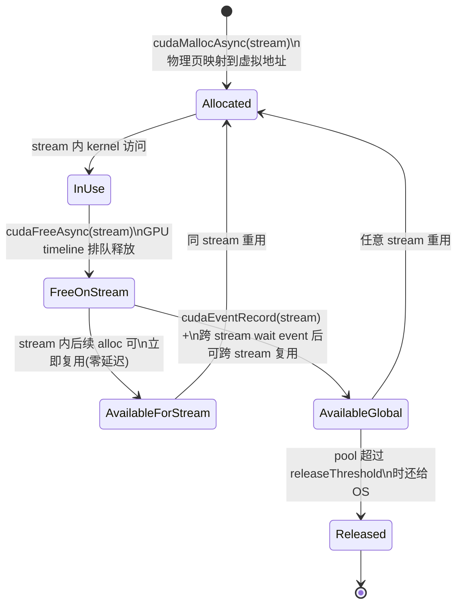

# 18 · Stream-ordered Allocator

> **`cudaMallocAsync` 让显存分配与 stream 排队执行,通过 MemPool 复用机制消除反复 malloc/free 的同步开销,是 PyTorch、JAX 等框架 caching allocator 的底层基础。**

## 1. 是什么 / 为什么有它

传统的 `cudaMalloc` 是完全同步的调用:CPU 线程阻塞直到 GPU 侧显存分配完成,且与任何 stream 上的 GPU 命令都没有排队关系。这意味着在调用 `cudaMalloc` 前必须确保所有相关 kernel 已完成,调用返回后才能启动依赖该内存的下一个 kernel。在深度学习训练场景中,一个训练步骤(step)可能要分配数十到数百个中间激活值张量,如果每次都走 `cudaMalloc` 的同步路径,CPU 端的内存管理开销会在整个训练迭代中占据相当大的比例。

以 LLaMA-2 70B 训练为例,使用 FP16 混合精度时,每个前向步骤需要保存大量中间激活用于反向传播。如果朴素地对每个层的激活值进行 `cudaMalloc` + `cudaFree`,内存分配与释放的开销可能占单步时间的 20% 以上。PyTorch 很早就通过维护一个 CPU 侧的内存 block 链表(caching allocator)来绕过这个问题——但这个实现是纯软件层面的,无法感知 GPU stream 的执行顺序,需要额外的同步点。

**Stream-ordered Allocator**(流排序分配器)在 CUDA 11.2 中正式引入,通过 `cudaMallocAsync` 和 `cudaFreeAsync` 两个 API 将显存的分配与释放纳入 stream 的命令队列。其核心设计有三点:第一,分配和释放是异步的 GPU 命令,CPU 调用后立即返回,不等待 GPU 执行;第二,在同一 stream 内分配后紧跟释放,GPU 保证按序执行(alloc → use → free),因此释放后同 stream 内的下一次分配可以零延迟地复用物理页;第三,释放的显存不立即归还 OS,而是放入 **MemPool**,由 Pool 策略决定何时归还(由 `cudaMemPoolAttrReleaseThreshold` 控制)。这与 PyTorch caching allocator 的设计思想高度一致,Hopper 上 PyTorch 2.x 已将 CUDA MemPool 作为其后端。

## 2. 硬件视角(微架构细节)

Stream-ordered Allocator 的核心概念是 block 状态机。一个显存 block 在其整个生命周期内经历以下状态转移:



从硬件视角看,MemPool 本质上是一段从 OS 通过 `cuMemCreate` / `mmap` 获取的虚拟地址区域,分配器在内部维护空闲 block 链表(按大小分级)。Hopper SM90 上,MemPool 的显存访问路径与普通 `cudaMalloc` 分配的显存完全相同——都经过 L2 → HBM3 层级,性能特征一致。

Pool 的关键属性 `cudaMemPoolAttrReleaseThreshold` 控制 pool 允许持有的空闲显存上限(字节)。当 pool 内空闲量超过阈值时,后续的 `cudaFreeAsync` 会导致对应 block 直接归还 OS 而不进入空闲链表。将阈值设为 `UINT64_MAX` 意味着 pool 永远不会主动归还 OS,只有显式调用 `cudaMemPoolTrimTo` 才会释放。这是训练场景的推荐设置——让 pool 在 warmup 步后持有全部显存,后续每步的 alloc 均命中 pool 缓存。

Hopper(SM90)上 MemPool 还支持 NVLink peer access 配置:通过 `cudaMemPoolSetAccess` 可以将 Pool 的访问权开放给同 NVLink 域内的其他 GPU,使得跨 GPU 的 P2P 访问无需额外拷贝。这在多 GPU 分布式训练的 all-to-all 通信中有实际应用价值。

## 3. CUDA 编程接口

API 分三层:分配释放、Pool 生命周期管理、属性查询与策略配置。

**分配与释放(Runtime API):**

```cpp
#include <cuda_runtime.h>

// 在 stream 内排队分配 bytes 字节显存,*ptr 立即填充虚拟地址
// 物理页可能在 stream 到达该命令时才真正映射
cudaError_t cudaMallocAsync(void **ptr, size_t bytes, cudaStream_t stream);

// 在 stream 内排队释放 ptr:GPU 执行到此命令时才真正回收
cudaError_t cudaFreeAsync(void *ptr, cudaStream_t stream);

// 从指定 pool 分配(比 cudaMallocAsync 多了显式 pool 参数)
cudaError_t cudaMallocFromPoolAsync(void **ptr, size_t bytes,
                                    cudaMemPool_t pool, cudaStream_t stream);
```

**Pool 生命周期管理:**

```cpp
// 创建自定义 Pool(指定目标设备)
cudaMemPoolProps props = {};
props.allocType     = cudaMemAllocationTypePinned; // 仅支持 Pinned 类型
props.handleTypes   = cudaMemHandleTypeNone;        // 不跨进程导出
props.location.type = cudaMemLocationTypeDevice;
props.location.id   = 0;                            // GPU device 0
cudaMemPool_t pool;
cudaMemPoolCreate(&pool, &props);

// 查询设备默认 pool(每个设备自动创建)
cudaMemPool_t default_pool;
cudaDeviceGetDefaultMemPool(&default_pool, 0);

// 设置 releaseThreshold:pool 空闲超过此值时归还 OS
uint64_t threshold = UINT64_MAX;  // 永不主动归还
cudaMemPoolSetAttribute(pool, cudaMemPoolAttrReleaseThreshold, &threshold);

// 手动 trim:将 pool 空闲收缩到 minBytesToKeep(字节)
cudaMemPoolTrimTo(pool, 0);       // 0 = 尽量全部归还 OS

// 将 device 0 的默认 pool 替换为自定义 pool
cudaDeviceSetMemPool(0, pool);

// 销毁 pool(须确保 pool 内无 in-flight 分配)
cudaMemPoolDestroy(pool);
```

**属性查询:**

```cpp
size_t used, reserved, highWater;
// 当前 in-flight 分配量(已分配未释放)
cudaMemPoolGetAttribute(pool, cudaMemPoolAttrUsedMemCurrent,     &used);
// 当前 pool 从 OS 持有的总量(含空闲)
cudaMemPoolGetAttribute(pool, cudaMemPoolAttrReservedMemCurrent, &reserved);
// 历史峰值 reserved 量
cudaMemPoolGetAttribute(pool, cudaMemPoolAttrReservedMemHigh,    &highWater);
```

**NVLink 跨 GPU 访问配置:**

```cpp
// 允许 GPU 1 访问 GPU 0 pool 分配的显存
cudaMemAccessDesc access = {};
access.location.type = cudaMemLocationTypeDevice;
access.location.id   = 1;   // 允许访问的目标 GPU
access.flags         = cudaMemAccessFlagsProtReadWrite;
cudaMemPoolSetAccess(pool, &access, 1);
```

## 4. 关键性能指标

| 操作 | 典型延迟 | 备注 |
|---|---|---|
| 同 stream alloc(pool 有空闲) | < 1 µs | CPU 侧纯 timeline 插入,无物理操作 |
| 跨 stream alloc(需 event fence) | 1-5 µs | 等待 event 记录与 wait 的协议开销 |
| 首次 alloc(pool 无空闲,OS 申请) | 50-200 µs | 受 OS 虚拟内存分配路径限制 |
| `cudaMemPoolTrimTo(pool, 0)` | 数毫秒(量大时) | 归还 OS 需要 munmap,可能引起抖动 |
| `cudaMalloc` 对比参考 | 50-100 µs 含同步 | 每次均走 OS 路径 + CPU 阻塞 |

MemPool 对训练循环的价值体现在:第一个 warmup step 因 pool 为空而走 OS 慢路径(50-200 µs/alloc),后续步骤因激活值形状固定,alloc 全部命中 pool 缓存,延迟降至微秒以下。在一个典型的 transformer 训练步内,若有 200 次分配,使用 MemPool 后节省的时间可以达到数十毫秒。

`releaseThreshold` 应设为预期峰值显存的 1.1-1.2 倍,防止因临时性的激活值峰值超阈值触发 OS 路径。如果观察到 pool 的 `ReservedMemHigh` 超过 `releaseThreshold`,说明阈值设置偏低,应调大。

## 5. 代码示例

下面展示一个仿训练循环的分配模式:每个 step 通过 `cudaMallocAsync` 分配临时激活,kernel 完成后通过 `cudaFreeAsync` 归还 pool,下一 step 立即复用。

```cpp
#include <cuda_runtime.h>
#include <cstdint>
#include <cstdio>

// 简化的前向 kernel:每元素乘以权重
__global__ void forward_kernel(float *act, const float *w, int n) {
    int i = blockIdx.x * blockDim.x + threadIdx.x;
    if (i < n) act[i] = w[i] * 2.0f;
}

// 简化的反向 kernel:计算梯度
__global__ void backward_kernel(float *grad, const float *act, int n) {
    int i = blockIdx.x * blockDim.x + threadIdx.x;
    if (i < n) grad[i] = act[i] * 0.5f;
}

int main() {
    const int N = 1 << 20;   // 1M float = 4 MiB
    cudaStream_t stream;
    cudaStreamCreate(&stream);

    // 步骤 1:配置 default pool — 永不主动还 OS
    cudaMemPool_t pool;
    cudaDeviceGetDefaultMemPool(&pool, 0);
    uint64_t threshold = UINT64_MAX;
    cudaMemPoolSetAttribute(pool, cudaMemPoolAttrReleaseThreshold, &threshold);

    // 权重用传统 malloc(长期存活,不受 pool 管理)
    float *d_weights = nullptr;
    cudaMalloc(&d_weights, N * sizeof(float));

    for (int step = 0; step < 200; ++step) {
        float *d_act = nullptr, *d_grad = nullptr;

        // 在 stream 中排队分配激活与梯度张量
        // CPU 立即返回,GPU 到达该命令时才执行物理映射(或复用 pool 缓存)
        cudaMallocAsync(&d_act,  N * sizeof(float), stream);
        cudaMallocAsync(&d_grad, N * sizeof(float), stream);

        // 前向 + 反向 kernel:依赖分配已完成(stream 保证顺序)
        forward_kernel <<<(N+255)/256, 256, 0, stream>>>(d_act, d_weights, N);
        backward_kernel<<<(N+255)/256, 256, 0, stream>>>(d_grad, d_act,    N);

        // 在 stream 中排队释放:GPU 保证 backward 完成后才将 block 归还 pool
        cudaFreeAsync(d_act,  stream);
        cudaFreeAsync(d_grad, stream);
        // pool 持有这段显存,下一 step 同尺寸 alloc 立即命中缓存
    }

    cudaStreamSynchronize(stream);   // 等待所有命令完成

    // 查询 pool 状态
    size_t used, reserved, highWater;
    cudaMemPoolGetAttribute(pool, cudaMemPoolAttrUsedMemCurrent,     &used);
    cudaMemPoolGetAttribute(pool, cudaMemPoolAttrReservedMemCurrent, &reserved);
    cudaMemPoolGetAttribute(pool, cudaMemPoolAttrReservedMemHigh,    &highWater);
    printf("pool: used=%zu MB, reserved=%zu MB, highWater=%zu MB\n",
           used>>20, reserved>>20, highWater>>20);

    // 应用退出或切换模型前手动 trim
    cudaMemPoolTrimTo(pool, 0);
    cudaFree(d_weights);
    cudaStreamDestroy(stream);
    return 0;
}
```

编译与运行:

```bash
nvcc -arch=sm_90a -O3 -o pool_demo pool_demo.cu
./pool_demo
# 预期:step 0 较慢(OS 分配),step 1+ 稳定在接近 kernel 执行时间
```

## 6. 实测手段

**NSight Systems 观察 MemPool 分配事件:**

```bash
# 捕获 CUDA 运行时 API 调用与 GPU 活动
nsys profile -t cuda,nvtx --capture-range=cudaProfilerApi \
    --output pool_trace ./pool_demo
# 打开 .nsys-rep 后在 "CUDA API" 泳道可见 cudaMallocAsync 的 CPU 调用时间
# 在 "CUDA Memory" 泳道(NSight Systems 3.x+)可见 pool 的 reserved/used 曲线
```

**命令行汇总统计:**

```bash
nsys stats pool_trace.nsys-rep --report cuda_api_sum
# 输出各 CUDA API 调用次数与累积时间,对比 cudaMallocAsync vs cudaMalloc 开销
```

**运行时属性查询示例:**

```bash
# 在 C++ 代码中嵌入属性查询(见§5 代码末尾)
# cudaMemPoolAttrUsedMemCurrent     当前 in-flight 分配量
# cudaMemPoolAttrReservedMemCurrent pool 从 OS 持有的总量
# cudaMemPoolAttrReservedMemHigh    历史峰值(不会自动清零,用于评估 threshold 配置)
```

**nvidia-smi 显存监控:**

```bash
# 每秒采样显存使用量
nvidia-smi dmon -s mu -d 1
# 注意:pool 的 reserved(空闲但持有)部分也会计入 nvidia-smi 显示的已用显存
# 若观察到"泄漏"但 cudaMemPoolAttrUsedMemCurrent=0,说明 pool 在持有空闲 block
```

若 `nsys` 的 "CUDA Memory" 视图显示 reserved 曲线呈明显锯齿波动,说明 pool 频繁向 OS 申请和归还,应增大 `releaseThreshold`。若 reserved 持续增长到远超实际使用量,说明 alloc/free 的 stream 不匹配导致 block 无法被复用,需排查 stream 分配逻辑。

## 7. 常见反模式

1. **alloc 在 streamA / free 在 streamB 但未做 event 同步** — Pool 的复用语义以 stream 顺序为基础:若在 streamA 分配的指针想通过 streamB 释放,必须先在 streamB 上 `cudaEventRecord(ev, streamB)`,再在 streamA 上 `cudaStreamWaitEvent(streamA, ev, 0)`,保证 streamB 上的操作完成后 streamA 才将 block 归还 pool。跳过此步骤会导致 use-after-free 数据竞争——GPU 同时执行 streamB 的读写和 streamA 的再分配,极难通过功能测试检出。

2. **releaseThreshold 设为 0 或过小** — 将 `cudaMemPoolAttrReleaseThreshold` 设为 0 等效于每次 free 后立即归还 OS,完全禁用了 pool 的复用优势,下次 alloc 重走 OS 慢路径。推荐设为 `UINT64_MAX`(永不主动归还),或设为预期峰值显存用量的 1.2 倍以上。

3. **混用 `cudaMalloc` 分配的指针和 `cudaFreeAsync`** — `cudaMalloc` 分配的内存不由 MemPool 管理,不能传给 `cudaFreeAsync`。同理,`cudaMallocAsync` 分配的指针不能传给 `cudaFree`(传统同步 free)。混用会触发 `cudaErrorInvalidValue` 或静默破坏 pool 内部数据结构。始终保持分配器与释放器的一致性。

4. **忘记配置跨 GPU 访问权限就做 P2P** — 若要在 GPU 1 上访问 GPU 0 MemPool 分配的显存,必须先调 `cudaMemPoolSetAccess` 显式授权。未授权的跨设备访问会导致 CUDA_ERROR_ILLEGAL_ADDRESS(GPU page fault),在 Hopper 上表现为 UVM 故障并终止进程。

5. **在进程高峰期调 `cudaMemPoolTrimTo`** — Trim 会将 pool 内空闲 block 归还 OS(执行 `munmap`),属于耗时操作且可能引发 OS TLB shootdown 延迟。在训练步骤进行中调用 trim 可能导致单步时间异常波动。正确做法是在 checkpoint 保存或模型切换等自然停顿点调用。

## 8. 延伸阅读

- **CUDA C++ Programming Guide §3.2.5.5** — Stream Ordered Memory Allocator:完整语义定义、stream-ordering 保证与 release threshold 说明。
- **CUDA C++ Programming Guide §3.2.5.6** — Memory Pool Attributes:`cudaMemPoolAttr*` 枚举完整列表。
- **CUDA Runtime API Reference** — `cudaMallocAsync`、`cudaFreeAsync`、`cudaMemPoolCreate`、`cudaMemPoolTrimTo`、`cudaMallocFromPoolAsync` 的完整参数说明。
- **Driver API 对应接口** — `cuMemAllocAsync` / `cuMemFreeAsync` / `cuMemPoolCreate`(与 Runtime API 一一对应的低层版本,适用于 Driver API 场景或 JIT 框架)。
- **CUDA Best Practices Guide §15.3** — Stream Ordered Memory:性能建议与 pool 调优策略。
- **PyTorch CUDA 内存管理文档** — [https://pytorch.org/docs/stable/notes/cuda.html](https://pytorch.org/docs/stable/notes/cuda.html):介绍 PyTorch 2.x 如何将 CUDA MemPool 作为 caching allocator 后端。
- **CUDA Sample** — `Samples/0_Introduction/simpleStreams`:展示多 stream 并发,可改造为 MemPool 版本进行对比基准测试。
