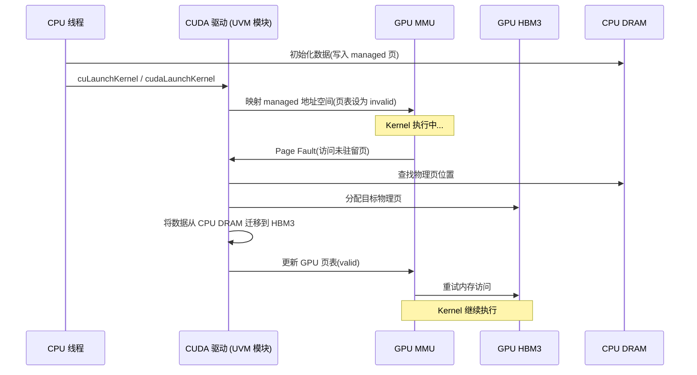

# 19 · Unified Memory

> **`cudaMallocManaged` 为 CPU 和 GPU 提供统一的虚拟地址空间,通过按需页面迁移消除手工数据拷贝,代价是首次访问触发的 page fault 开销约 50 µs/页。**

## 1. 是什么 / 为什么有它

在传统的 CUDA 编程模型中,CPU 内存(host memory)和 GPU 显存(device memory)是两个完全独立的地址空间。程序员必须手工管理数据的传输:在 kernel 启动前用 `cudaMemcpy` 将数据从 host 拷贝到 device,kernel 完成后再将结果拷回 host。对于数据访问模式复杂的应用——例如图遍历、稀疏矩阵运算、动态数据结构——程序员很难提前知道哪些数据需要在哪个时间点出现在哪个设备上,手工管理传输的代码既繁琐又容易出错。

**Unified Memory**(统一内存,UM)在 Kepler 架构引入、Pascal 上完善、Hopper 上进一步优化。它通过 CUDA 驱动维护的页表将同一虚拟地址空间同时映射到 CPU 和 GPU 的内存管理单元(MMU)上。当某个设备访问一个当前不在其本地内存中的页面时,GPU 的内存管理单元产生 **page fault**,驱动捕获该 fault 并将对应的物理页从当前所在设备迁移到访问者所在设备(migration),完成后恢复执行。从编程者的角度看,只需一次 `cudaMallocManaged`,CPU 和 GPU 就都能直接访问该指针,无需手工 `cudaMemcpy`。

在 GH200(Grace Hopper)架构上,得益于 **ATS**(Address Translation Services)和 CPU-GPU 之间的 NVLink-C2C 互连,GPU 可以直接走 CPU 的页表访问 host 内存,page fault 迁移开销大幅降低,UM 的性能接近裸 NVLink 带宽。

## 2. 硬件视角(微架构细节)

Page fault 处理的硬件路径在 Hopper SM90 上如下所示:



从微架构视角,GPU MMU 由每个 SM 的 L1 TLB 和全局 L2 TLB 组成。当 TLB miss 发生且页表项标记为 invalid 时,GPU 向专用的 Page Fault Queue 写入 fault record,UVM 驱动模块(运行在 CPU 上的 kernel 线程)轮询该队列并处理迁移。整个 fault 处理路径约 50 µs(包括 fault 上报、CPU 侧处理、DMA 迁移、页表更新和 GPU 侧恢复)。若一次 kernel launch 触发大量 fault,多个 fault 会被批处理以提升吞吐,但总延迟仍会显著影响首步执行时间。

Hopper 引入了对 ATS(Address Translation Services)的支持。在 GH200 上,GPU 直接与 CPU 的 IOMMU 对话,获取 CPU 页表的 translation,从而在不迁移物理页的情况下通过 NVLink-C2C 访问 CPU 内存。这将 UM 访问 CPU 数据的延迟从迁移模式的数十微秒降低到 NVLink 往返延迟(约数百纳秒)。

## 3. CUDA 编程接口

**分配与销毁:**

```cpp
#include <cuda_runtime.h>

// 分配 n 字节的 managed 内存;cudaMemAttachGlobal 表示所有 stream 可见
void *ptr = nullptr;
cudaMallocManaged(&ptr, n, cudaMemAttachGlobal);

// per-stream 可见性(降低迁移范围):
cudaMallocManaged(&ptr, n, cudaMemAttachHost);  // 初始附着到 host
cudaStreamAttachMemAsync(stream, ptr, 0, cudaMemAttachSingle); // 迁附到 stream

// 销毁:与 cudaMalloc 相同接口
cudaFree(ptr);
```

**预取(Prefetch)—— 主动消除 fault:**

```cpp
// 将 [ptr, ptr+n) 范围的 managed 内存提前迁移到 device(0=当前设备)
// 在 kernel launch 前调用,消除 kernel 执行中的 page fault
cudaMemPrefetchAsync(ptr, n, /*device=*/0, stream);

// 将数据迁回 CPU:deviceId = cudaCpuDeviceId
cudaMemPrefetchAsync(ptr, n, cudaCpuDeviceId, stream);
```

**Advise —— 迁移策略提示:**

```cpp
// 设置"只读副本":GPU 和 CPU 各持有一份副本(适合只读 lookup table)
cudaMemAdvise(ptr, n, cudaMemAdviseSetReadMostly, device);

// 设置首选驻留设备:驱动优先将页保留在 device 上
cudaMemAdvise(ptr, n, cudaMemAdviseSetPreferredLocation, device);

// 设置访问者提示:告知驱动 device 会频繁访问,可提前建立映射
cudaMemAdvise(ptr, n, cudaMemAdviseSetAccessedBy, device);

// 查询 advice 状态
int isReadMostly;
cudaMemRangeGetAttribute(&isReadMostly, sizeof(int),
    cudaMemRangeAttributeReadMostly, ptr, n);
```

## 4. 关键性能指标

| 场景 | 典型开销 | 说明 |
|---|---|---|
| cudaMallocManaged | ~100-500 µs | 虚拟地址保留 + 驱动初始化 |
| 首次 GPU 访问(page fault per 4 KB page) | ~50 µs/页 | fault 上报 + 迁移 + 页表更新 |
| cudaMemPrefetchAsync(1 GB 数据) | ~200-400 ms | 受 PCIe/NVLink 带宽限制 |
| ReadMostly 模式下 GPU 读取(有副本) | 等同本地 HBM | 无 fault,直接访问本地副本 |
| GH200 ATS 模式访问 CPU 内存 | ~100-200 ns | NVLink-C2C 延迟 |

**性能模型:**
- 若 kernel 触发 F 次 page fault,每次迁移 P 字节,总迁移时间 ≈ F × 50 µs + P_total / BW_PCIe
- 使用 `cudaMemPrefetchAsync` 将迁移提前到 kernel launch 前,可将 fault 延迟从关键路径移出
- `SetReadMostly` 让多 GPU 共享同一只读数据的副本,适合嵌入表查找等场景

GPU 内存带宽利用率与 UM 关系:UM 迁移使用独立的 DMA 引擎,与 kernel 计算可以重叠。但若 kernel 开始时仍存在未完成的迁移(fault 未处理完),kernel 的 warp 会被挂起等待,导致 SM 利用率骤降。NSight Systems 的时间线会显示这种"bubble"(kernel 内部的空闲时间段)。

**HMM(Heterogeneous Memory Management)背景:** Linux 6.x 引入了 HMM 框架,允许 GPU 驱动直接复用 CPU 的 page table 映射,而不是维护独立的 GPU 页表。对于支持 ATS 的 GH200 系统,Hopper GPU 通过 PCIe ATS 向 CPU IOMMU 查询地址翻译,实现对 CPU 内存的零迁移直接访问。这一机制在大规模 LLM 推理中很有价值:模型权重可以放在 CPU 的大容量内存(TB 级)中,GPU 按需读取,避免了显存容量的硬性限制。

## 5. 代码示例

下面展示 Unified Memory 的标准使用模式:先 CPU 初始化,再预取到 GPU,最后 kernel 无 fault 执行。

```cpp
#include <cuda_runtime.h>
#include <cstdio>
#include <cmath>

// 简化的向量加法 kernel
__global__ void vector_add(float *c, const float *a, const float *b, int n) {
    int i = blockIdx.x * blockDim.x + threadIdx.x;
    if (i < n) c[i] = a[i] + b[i];
}

int main() {
    const int N   = 1 << 24;    // 16M 元素
    const size_t SZ = N * sizeof(float);

    float *a, *b, *c;
    // 统一内存分配:CPU 和 GPU 均可直接访问
    cudaMallocManaged(&a, SZ, cudaMemAttachGlobal);
    cudaMallocManaged(&b, SZ, cudaMemAttachGlobal);
    cudaMallocManaged(&c, SZ, cudaMemAttachGlobal);

    // CPU 端初始化(数据现在在 host DRAM)
    for (int i = 0; i < N; ++i) { a[i] = (float)i; b[i] = (float)(N - i); }

    // 预取到 GPU device 0:在 kernel launch 前完成迁移,消除 fault
    cudaStream_t stream;
    cudaStreamCreate(&stream);
    cudaMemPrefetchAsync(a, SZ, 0, stream);  // 将 a 迁移到 GPU 0
    cudaMemPrefetchAsync(b, SZ, 0, stream);  // 将 b 迁移到 GPU 0
    // c 不需要预取(kernel 只写 c,首次写入会 fault 并在 GPU 上分配物理页)

    // Advise:a 和 b 是只读输入,设 ReadMostly 允许 GPU 持有副本
    cudaMemAdvise(a, SZ, cudaMemAdviseSetReadMostly, 0);
    cudaMemAdvise(b, SZ, cudaMemAdviseSetReadMostly, 0);

    // 启动 kernel(prefetch 已入队,kernel 在其后执行,无 fault)
    vector_add<<<(N+255)/256, 256, 0, stream>>>(c, a, b, N);

    // 将结果 c 迁回 CPU 用于验证
    cudaMemPrefetchAsync(c, SZ, cudaCpuDeviceId, stream);
    cudaStreamSynchronize(stream);

    // 验证结果
    float maxErr = 0.f;
    for (int i = 0; i < N; ++i)
        maxErr = fmaxf(maxErr, fabsf(c[i] - (float)N));
    printf("max error = %f\n", maxErr);   // 预期输出 0.000000

    cudaFree(a); cudaFree(b); cudaFree(c);
    cudaStreamDestroy(stream);
    return 0;
}
```

注意 `ReadMostly` advice 是在 prefetch 之前设置的:这样驱动在迁移时会在 GPU 上创建副本而非移动唯一物理页,CPU 端的原始物理页仍然有效。后续如果 CPU 修改了 `a` 或 `b` 的数据,驱动会自动撤销 ReadMostly 状态(清空 GPU 副本)。

## 6. 实测手段

**NSight Systems 查看 UM 迁移事件:**

```bash
nsys profile -t cuda,um --output um_trace ./vector_add
# 时间线中出现 "CUDA UM" 泳道,显示迁移方向(H→D 或 D→H)和字节数
# 若 kernel 内存在 UM 迁移事件,说明 prefetch 不足
```

**查看 page fault 计数:**

```bash
nsys stats um_trace.nsys-rep --report um_sum
# 输出 page fault 次数、迁移字节量、迁移时间等
```

**NSight Compute 关注 UM 对 kernel 性能的影响:**

```bash
ncu --set full --kernel-name vector_add ./vector_add
# 关注 "Memory Workload Analysis" 中的 "Migration" 行
# 若 migration bandwidth 较高,说明 kernel 执行期间仍存在 page fault
```

**cudaMemRangeGetAttribute 查询 advice 状态:**

```cpp
int isReadMostly = 0;
cudaMemRangeGetAttribute(&isReadMostly, sizeof(int),
    cudaMemRangeAttributeReadMostly, ptr, n);
// isReadMostly == 1 表示该范围已设置 ReadMostly

int prefetchDevice = cudaInvalidDeviceId;
cudaMemRangeGetAttribute(&prefetchDevice, sizeof(int),
    cudaMemRangeAttributeLastPrefetchLocation, ptr, n);
// 返回最近一次 prefetch 的目标设备 ID
```

**nvidia-smi 监控迁移带宽:**

```bash
nvidia-smi dmon -s u   # 实时显示 GPU 利用率(UM 迁移期间 GPU 可能显示低利用率)
```

若 NSight Systems 显示 kernel 时间线中存在 "UM CPU Page Faults" 事件,说明 CPU 在 kernel 执行期间仍在访问 GPU 上的 managed 内存(触发逆向迁移),应通过 `cudaStreamAttachMemAsync` 控制可见性或调整访问模式。

## 7. 常见反模式

1. **频繁 CPU/GPU 交替写入同一页(乒乓迁移)** — 若训练循环的每一步都在 CPU 上写一批数据然后 GPU 读取,再将结果写到同一 managed 地址被 CPU 读取,该页面会在 CPU DRAM 和 GPU HBM 之间来回迁移。每次迁移约 50 µs/页,对 4 KB 页而言 PCIe 带宽只有 0.08 GB/s——远低于直接 `cudaMemcpy` 的 25 GB/s。避免方法:使用 `SetPreferredLocation` 固定驻留设备,或改用显式 `cudaMemcpy`。

2. **忘记 prefetch 导致首次 launch 慢百倍** — 没有 prefetch 时,kernel 启动后触发的每个 page fault 都会让受影响的 warp 挂起约 50 µs。对 1 GB 的 managed 数据(共 262144 个 4 KB 页),若所有页都需要迁移,理论最坏情况下等待时间超过 10 秒。正确做法是在 kernel 前插入 `cudaMemPrefetchAsync`,将迁移提前到 kernel timeline 外。

3. **对 `ReadMostly` 数据执行写操作** — `cudaMemAdviseSetReadMostly` 为每个设备创建物理副本。一旦任何设备(CPU 或 GPU)写入该范围,驱动会使所有其他副本失效并降级为普通 managed 内存。若写入频繁,维护副本一致性的开销反而比不设 ReadMostly 更高。ReadMostly 仅适合真正的只读数据(嵌入表、模型权重的 inference 阶段)。

4. **在 kernel 未完成时 CPU 访问 managed 内存** — 若 CPU 在 kernel 尚未结束时访问同一 managed 地址,GPU MMU 会将对应页迁移回 CPU,导致 GPU 中途 fault。必须在 `cudaDeviceSynchronize` 或 `cudaStreamSynchronize` 之后才能在 CPU 上读取 kernel 的输出数据。

5. **误以为 UM 的性能与手工 cudaMemcpy 相同** — UM 的 page fault 粒度是 4 KB,而 `cudaMemcpy` 可以以 MB 级连续块传输。对大块连续数据,`cudaMemPrefetchAsync` 虽然消除了 fault,但底层仍走 DMA 路径,带宽与 `cudaMemcpyAsync` 相同。UM 的价值在于省去程序员手工管理传输,而非带宽提升。

## 8. 延伸阅读

- **CUDA C++ Programming Guide §3.2.4** — Unified Memory Programming:语义定义、fault 处理流程、系统要求。
- **CUDA C++ Programming Guide §K.2** — Unified Memory Programming Guide:完整的 Advise / Prefetch / per-stream 可见性文档。
- **CUDA C++ Programming Guide §3.2.4.3** — `cudaMemAdvise` / `cudaMemPrefetchAsync`:所有 Advise 枚举值与 Prefetch 语义。
- **CUDA Best Practices Guide §9.2.2.4** — Unified Memory Performance:fault 开销建模与优化建议。
- **Hopper Architecture Whitepaper §Unified Memory / ATS** — GH200 上 ATS 与 NVLink-C2C 的集成细节。
- **NVIDIA 博客** — [Unified Memory in CUDA 6](https://developer.nvidia.com/blog/unified-memory-in-cuda-6/)(概念介绍)和 [Beyond GPU Memory Limits with Unified Memory on Pascal](https://developer.nvidia.com/blog/beyond-gpu-memory-limits-unified-memory-pascal/)(Pascal 完善版)。
- **CUDA Sample** — `Samples/6_UnifiedMemory/UnifiedMemoryStreams`:展示 UM + stream 协作的标准模式。
