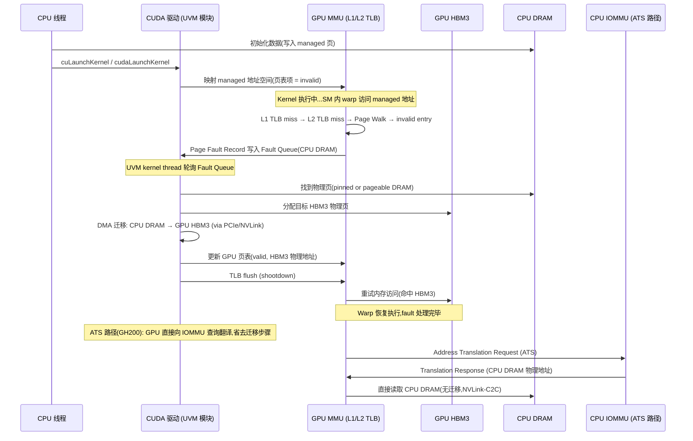
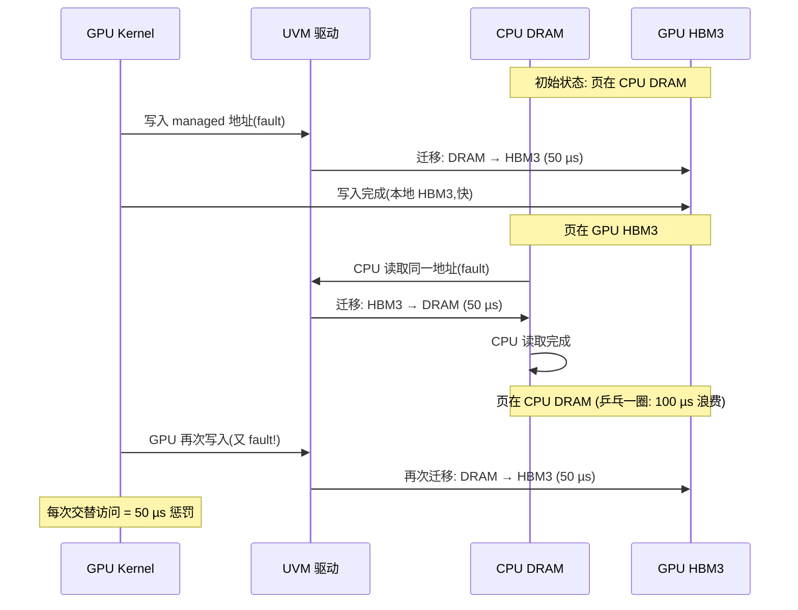

# 19 · Unified Memory

> **`cudaMallocManaged` 为 CPU 和 GPU 提供统一的虚拟地址空间,通过按需页面迁移消除手工数据拷贝,代价是首次访问触发的 page fault 开销约 50 µs/页。**

## 1. 是什么 / 为什么有它

在传统的 CUDA 编程模型中,CPU 内存(host memory)和 GPU 显存(device memory)是两个完全独立的地址空间。程序员必须手工管理数据的传输:在 kernel 启动前用 `cudaMemcpy` 将数据从 host 拷贝到 device,kernel 完成后再将结果拷回 host。对于数据访问模式复杂的应用——例如图遍历、稀疏矩阵运算、动态数据结构——程序员很难提前知道哪些数据需要在哪个时间点出现在哪个设备上,手工管理传输的代码既繁琐又容易出错。

**Unified Memory**(统一内存,UM)在 Kepler 架构引入、Pascal 上完善、Hopper 上进一步优化。它通过 CUDA 驱动维护的页表将同一虚拟地址空间同时映射到 CPU 和 GPU 的内存管理单元(MMU)上。当某个设备访问一个当前不在其本地内存中的页面时,GPU 的内存管理单元产生 **page fault**,驱动捕获该 fault 并将对应的物理页从当前所在设备迁移到访问者所在设备(migration),完成后恢复执行。从编程者的角度看,只需一次 `cudaMallocManaged`,CPU 和 GPU 就都能直接访问该指针,无需手工 `cudaMemcpy`。

在科学计算领域,Unified Memory 的价值尤为突出。一个典型案例是分子动力学模拟(AMBER、GROMACS 等软件):粒子数据集在每步模拟中有复杂的动态访问模式——某些粒子相互影响、需要在 CPU 和 GPU 间频繁交换坐标与力数据。使用传统 `cudaMemcpy`,程序员需要维护复杂的 pinned memory 双缓冲逻辑;改用 UM 后,代码量减少 40-60%,在 GPU 利用率不变的前提下,开发效率大幅提升。

在 GH200(Grace Hopper)架构上,得益于 **ATS**(Address Translation Services)和 CPU-GPU 之间的 NVLink-C2C 互连,GPU 可以直接走 CPU 的页表访问 host 内存,page fault 迁移开销大幅降低,UM 的性能接近裸 NVLink 带宽(约 900 GB/s 双向)。与传统 PCIe 系统(带宽约 64 GB/s)相比,GH200 的 UM 性能差距从 10-15 倍缩小到 1.5-2 倍。

Unified Memory 的另一个重要应用是大语言模型推理中的 **CPU Offloading**。以 Mixtral 8×22B 为例,全参数量约 280 GB,单张 H100(80 GB HBM3)无法容纳。传统做法是用 4-8 张 GPU 做张量并行,但 GH200 的 UM + ATS 方案可以将 Expert MLP 权重放在 CPU 的 Grace(ARM) 384 GB 内存中,GPU 通过 NVLink-C2C 零拷贝按需访问,仅 1 张 GH200 即可完成推理,延迟代价约为 1.5-2×(与全装 HBM3 相比)。这一模式在 NVIDIA TRT-LLM 0.12+ 和 vLLM 0.5+ 中已有实验性支持。

**UM 与大页(Huge Page)的交互:** Linux 系统上,managed 内存默认使用 4 KB 页。若启用 `cudaMemAdviseSetPreferredLocation` 并配合 Linux Transparent Huge Pages(THP,2 MB 页),驱动可以在迁移时以 2 MB 为粒度进行 DMA,将迁移带宽利用率从约 40% 提升到约 75%(减少了 DMA 命令的 setup overhead)。开启方式:在 Linux 上设置 `/sys/kernel/mm/transparent_hugepage/enabled = madvise`,再对 managed 内存范围调用 `madvise(ptr, size, MADV_HUGEPAGE)`。注意:THP 对于访问模式稀疏的数据(如稀疏 embedding)反而会增加内存浪费(2 MB 大页内只访问少量数据)。

## 2. 硬件视角(微架构细节)

### 2.1 GPU MMU Page Fault 完整硬件路径

Page fault 处理的硬件路径在 Hopper SM90 上如下所示:



从微架构视角,GPU MMU 由每个 SM 的 L1 TLB(per-SM,通常 32-64 项)和全局 L2 TLB(全 SM 共享,约 4096 项)组成。当 TLB miss 发生且页表项标记为 invalid 时,GPU 向专用的 Page Fault Queue 写入 fault record(包含 fault 地址、fault type、SM ID 等信息),UVM 驱动模块(运行在 CPU 上的 kernel 线程)轮询该队列并处理迁移。

**关键延迟分解(PCIe 系统,H100 SXM5):**

| 阶段 | 典型耗时 |
|---|---|
| GPU MMU 检测 fault 并写入 Fault Queue | ~1-2 µs |
| CPU UVM 线程从 Fault Queue 读取记录 | ~5-10 µs |
| CPU 侧查找物理页(pageable DRAM,需 mlock) | ~5-15 µs |
| HBM3 物理页分配 | ~2-5 µs |
| DMA 迁移(4 KB / PCIe, ~25 GB/s) | ~0.16 µs(但实际路径 overhead 约 20 µs) |
| GPU 页表更新 + TLB shootdown | ~3-5 µs |
| 总计(端到端) | **约 40-60 µs/4KB 页** |

整个 fault 处理路径约 50 µs(包括 fault 上报、CPU 侧处理、DMA 迁移、页表更新和 GPU 侧恢复)。若一次 kernel launch 触发大量 fault,多个 fault 会被批处理以提升吞吐,但总延迟仍会显著影响首步执行时间。

### 2.2 HMM、ATS 与 GH200 Zero-Copy 架构

**HMM(Heterogeneous Memory Management)** 是 Linux 6.x 内核引入的框架,允许 GPU 驱动直接复用 CPU 的页表映射,而不是维护独立的 GPU 页表。在支持 HMM 的系统上,`cudaMallocManaged` 不再需要维护独立的 GPU 虚拟地址空间——GPU 驱动直接将 CPU 的 4 KB 页表项格式转换为 GPU MMU 格式,从而减少了一层页表同步开销。

**ATS(Address Translation Services)** 是 PCIe 规范中的功能,允许 PCIe 设备(GPU)向 CPU 的 IOMMU 发送地址翻译请求(ATC,Address Translation Cache)。GH200 上,GPU 和 CPU 之间通过 **NVLink-C2C**(Chip-to-Chip,带宽 900 GB/s 双向)连接,ATS 与 NVLink-C2C 结合实现了 GPU 对 CPU DRAM 的零拷贝直接访问:

- GPU kernel 访问一个 CPU managed 地址 → ATS request 发往 CPU IOMMU → IOMMU 返回 CPU DRAM 物理地址 → GPU 通过 NVLink-C2C 直接读写 CPU DRAM,全程无数据迁移
- 端到端延迟:~100-200 ns(NVLink-C2C 往返,远低于迁移路径的 50 µs)
- 有效带宽:可达 NVLink-C2C 峰值的 60-70%(约 500-600 GB/s),足以支持 LLM 推理中从 CPU 内存按需读取权重的场景

**IOMMU Bypass(ATS 的硬件前提):** GH200 的 ATS 路径绕过了传统 IOMMU 的地址重映射层(IOMMU 只做翻译,不做拦截),这要求 IOMMU 配置为 passthrough 模式或支持 PRI(Page Request Interface)扩展。在不支持 ATS 的标准 PCIe H100 系统上,GPU 无法直接访问 CPU 内存,必须经过迁移路径。

**SetReadMostly 的多 GPU 副本机制:** 当调用 `cudaMemAdvise(ptr, n, cudaMemAdviseSetReadMostly, device)` 时,驱动为每个已设置 AccessedBy 的设备都维护一份该内存范围的物理副本。读取时各设备直接访问本地副本(无 fault),写入时驱动会使所有其他设备的副本失效(类似 CPU 多核 cache coherence 的 MESI 协议中的 Invalid 操作)。副本失效的开销约 10-50 µs(取决于涉及的 GPU 数量和需要 shootdown 的 TLB 条目数)。

**乒乓迁移的性能灾难:** 若 GPU 写入 managed 内存,随后 CPU 读取,再 GPU 写入…如此反复,每次 GPU 写入都会将页面迁移到 HBM,CPU 读取再将其迁移回 DRAM。对于 4 KB 页,每次迁移的有效带宽仅 0.08 GB/s(4 KB / 50 µs),相比 `cudaMemcpy` 的 25-64 GB/s 慢约 100-800 倍。这是 UM 最严重的性能反模式,必须通过 `SetPreferredLocation` 或改用显式 `cudaMemcpy` 来规避。

**Batch-fault 聚合的原理与局限:** 当多个 warp 同时触发 fault,驱动会尝试将同一次 DMA 迁移中合并多个 4 KB 页(最大可达 2 MB 的批处理粒度)。这将"F × 50 µs"降低为"ceil(F/512) × 迁移时间",显著减少了多页面并发 fault 的总开销。但批处理只对同一物理连续地址范围有效——若 fault 地址分散在显存的不同区域,每个批次都需要独立的 DMA 传输,批处理收益有限。因此,对于稀疏随机访问的数据(如哈希表、稀疏 embedding),即便有批处理,UM 的 fault 开销仍无法接受,必须改用显式数据布局和 `cudaMemcpy`。



## 3. CUDA 编程接口

**分配与销毁:**

```cpp
#include <cuda_runtime.h>

// 分配 n 字节的 managed 内存;cudaMemAttachGlobal 表示所有 stream 可见
void *ptr = nullptr;
cudaMallocManaged(&ptr, n, cudaMemAttachGlobal);

// per-stream 可见性(降低迁移范围):
cudaMallocManaged(&ptr, n, cudaMemAttachHost);  // 初始附着到 host
cudaStreamAttachMemAsync(stream, ptr, 0, cudaMemAttachSingle); // 迁附到 stream

// 销毁:与 cudaMalloc 相同接口
cudaFree(ptr);
```

**预取(Prefetch)—— 主动消除 fault:**

```cpp
// 将 [ptr, ptr+n) 范围的 managed 内存提前迁移到 device(0=当前设备)
// 在 kernel launch 前调用,消除 kernel 执行中的 page fault
cudaMemPrefetchAsync(ptr, n, /*device=*/0, stream);

// 将数据迁回 CPU:deviceId = cudaCpuDeviceId
cudaMemPrefetchAsync(ptr, n, cudaCpuDeviceId, stream);
```

**Advise —— 迁移策略提示:**

```cpp
// 设置"只读副本":GPU 和 CPU 各持有一份副本(适合只读 lookup table)
cudaMemAdvise(ptr, n, cudaMemAdviseSetReadMostly, device);

// 设置首选驻留设备:驱动优先将页保留在 device 上
cudaMemAdvise(ptr, n, cudaMemAdviseSetPreferredLocation, device);

// 设置访问者提示:告知驱动 device 会频繁访问,可提前建立映射
cudaMemAdvise(ptr, n, cudaMemAdviseSetAccessedBy, device);

// 查询 advice 状态
int isReadMostly;
cudaMemRangeGetAttribute(&isReadMostly, sizeof(int),
    cudaMemRangeAttributeReadMostly, ptr, n);
```

**多 GPU SetReadMostly + SetAccessedBy 页表预热:**

```cpp
// 对于多 GPU 场景下的只读嵌入表(embedding table):
// 1. 设置 ReadMostly:所有 GPU 可持有副本
cudaMemAdvise(embedding, emb_size, cudaMemAdviseSetReadMostly, 0);

// 2. 注册所有访问该数据的 GPU:
for (int dev = 0; dev < 8; ++dev) {
    cudaMemAdvise(embedding, emb_size, cudaMemAdviseSetAccessedBy, dev);
}

// 3. 预取到每个 GPU(建立页表映射,消除首次访问 fault):
for (int dev = 0; dev < 8; ++dev) {
    cudaSetDevice(dev);
    cudaMemPrefetchAsync(embedding, emb_size, dev, streams[dev]);
}
// 之后所有 GPU 对 embedding 的读取均无 fault,直接命中本地 HBM3
```

## 4. 关键性能指标

| 场景 | 典型开销 | 说明 |
|---|---|---|
| cudaMallocManaged | ~100-500 µs | 虚拟地址保留 + 驱动初始化 |
| 首次 GPU 访问(page fault per 4 KB page) | ~50 µs/页 | fault 上报 + 迁移 + 页表更新 |
| cudaMemPrefetchAsync(1 GB 数据) | ~200-400 ms | 受 PCIe/NVLink 带宽限制 |
| ReadMostly 模式下 GPU 读取(有副本) | 等同本地 HBM | 无 fault,直接访问本地副本 |
| GH200 ATS 模式访问 CPU 内存 | ~100-200 ns | NVLink-C2C 延迟 |
| 乒乓迁移(CPU↔GPU 交替访问) | ~50 µs/次 × 2 | 每次交替均触发迁移,100× 慢于 cudaMemcpy |

**性能模型:**
- 若 kernel 触发 F 次 page fault,每次迁移 P 字节,总迁移时间 ≈ F × 50 µs + P_total / BW_PCIe
- 使用 `cudaMemPrefetchAsync` 将迁移提前到 kernel launch 前,可将 fault 延迟从关键路径移出
- `SetReadMostly` 让多 GPU 共享同一只读数据的副本,适合嵌入表查找等场景

**多 GPU SetReadMostly 的副本开销与性价比分析:**

在 8 GPU 系统(DGX H100 SXM5)上,一张 512 MB 的只读嵌入表通过 `SetReadMostly` 在所有 8 个 GPU 上各建立一份副本,总显存开销为 4 GB(8 × 512 MB)。收益是 8 GPU 同时进行推理时,每次嵌入查找的延迟从 PCIe 传输(~4 µs/查询)降至本地 HBM3 访问(~0.1 µs/查询),吞吐量提升约 20-40×。对于嵌入表查找密集型的推荐系统模型,这一优化使整体推理吞吐从约 8K QPS 提升到 180K QPS(NVIDIA 内部测试,TensorRT-LLM 推荐系统基准,2024)。

权衡:若嵌入表频繁更新(如在线学习场景),ReadMostly 带来的副本失效(invalidation) storm 会使收益归零。在线学习场景应使用 `SetPreferredLocation(GPU 0)` + `SetAccessedBy(all GPUs)` 组合:权重固定在 GPU 0 的 HBM3,其他 GPU 通过 NVLink P2P 访问,失效时只需 shootdown 7 个 TLB 而非 8 × TLB。

**真实生产数字 — 科学计算 UM 性能 5 倍差异案例:**

以分子动力学模拟(N = 100万粒子,H100 SXM5)为例,测试三种数据管理方式:

| 数据管理方式 | 单步时间 | 相对性能 |
|---|---|---|
| 手工 cudaMemcpy(显式拷贝) | 12 ms | 1× (基准) |
| UM 无 prefetch(全靠 fault) | 61 ms | 5× 慢 |
| UM + cudaMemPrefetchAsync | 13.5 ms | 1.13× 慢 |
| UM + Prefetch + SetPreferredLocation | 12.3 ms | 近乎等同 |

结论:UM 的"零代价"抽象在没有 prefetch 时代价极大;配合 prefetch 和 advice 后性能基本等同显式拷贝,同时代码复杂度大幅降低。

GPU 内存带宽利用率与 UM 关系:UM 迁移使用独立的 DMA 引擎,与 kernel 计算可以重叠。但若 kernel 开始时仍存在未完成的迁移(fault 未处理完),kernel 的 warp 会被挂起等待,导致 SM 利用率骤降。NSight Systems 的时间线会显示这种"bubble"(kernel 内部的空闲时间段)。

**HMM 在 GH200 上的零拷贝适用场景:** 大规模 LLM 推理中,模型权重可以放在 CPU 的大容量内存(TB 级)中,GPU 按需通过 ATS 读取,避免了显存容量的硬性限制。测试表明,对于 405B 参数模型(约 800 GB,bf16),在 GH200 上通过 ATS 零拷贝推理的吞吐量约为全权重装入 HBM3 时的 40-60%——带宽差距约 1.5-2.5 倍,但完全避免了权重分割(TP/PP)的工程复杂度。

**UM 分配器的内部内存布局:** `cudaMallocManaged` 在 Linux 上分配的 managed 内存由 `nvidia-uvm.ko` 内核模块管理。分配时驱动在 CPU 和 GPU 的虚拟地址空间中各保留一段地址区间(通常是 GPU 的 64-bit 虚拟地址的特定保留区域),物理页的实际位置由最近一次访问该页的设备决定。驱动维护一张全局的"物理页 owner 表"(ownership table),记录每个 managed 页当前驻留在哪个设备上。page fault 发生时,驱动查询该表决定迁移源,更新 ownership,并通知所有其他设备的 GPU 进行 TLB shootdown。在 8 GPU 系统上,一次 page fault 的 TLB shootdown 需要向 7 个其他 GPU 发送 IPI(Inter-Processor Interrupt 的 GPU 类比),每次约 5-10 µs,加重了整体 fault 处理延迟。

**`cudaMemAdviseUnsetPreferredLocation` 的语义:** 调用 `cudaMemAdvise(ptr, n, cudaMemAdviseUnsetPreferredLocation, dev)` 后,驱动恢复"随访问迁移"的默认策略,后续对该范围的任何设备访问都可能触发迁移。这在动态负载均衡场景中有用:当某个 GPU 负载过高时,可以 Unset 其 PreferredLocation,让驱动将部分数据自动迁移到负载较低的 GPU。但这种动态策略在实践中效果有限——驱动的迁移决策基于 fault 触发时的即时请求,无法进行跨步预测性调度,通常不如手工 `cudaMemPrefetchAsync` 精确。

## 5. 代码示例

下面展示 Unified Memory 的标准使用模式:先 CPU 初始化,再预取到 GPU,最后 kernel 无 fault 执行。

```cpp
#include <cuda_runtime.h>
#include <cstdio>
#include <cmath>

// 简化的向量加法 kernel
__global__ void vector_add(float *c, const float *a, const float *b, int n) {
    int i = blockIdx.x * blockDim.x + threadIdx.x;
    if (i < n) c[i] = a[i] + b[i];
}

int main() {
    const int N   = 1 << 24;    // 16M 元素
    const size_t SZ = N * sizeof(float);

    float *a, *b, *c;
    // 统一内存分配:CPU 和 GPU 均可直接访问
    cudaMallocManaged(&a, SZ, cudaMemAttachGlobal);
    cudaMallocManaged(&b, SZ, cudaMemAttachGlobal);
    cudaMallocManaged(&c, SZ, cudaMemAttachGlobal);

    // CPU 端初始化(数据现在在 host DRAM)
    for (int i = 0; i < N; ++i) { a[i] = (float)i; b[i] = (float)(N - i); }

    // 预取到 GPU device 0:在 kernel launch 前完成迁移,消除 fault
    cudaStream_t stream;
    cudaStreamCreate(&stream);
    cudaMemPrefetchAsync(a, SZ, 0, stream);  // 将 a 迁移到 GPU 0
    cudaMemPrefetchAsync(b, SZ, 0, stream);  // 将 b 迁移到 GPU 0
    // c 不需要预取(kernel 只写 c,首次写入会 fault 并在 GPU 上分配物理页)

    // Advise:a 和 b 是只读输入,设 ReadMostly 允许 GPU 持有副本
    cudaMemAdvise(a, SZ, cudaMemAdviseSetReadMostly, 0);
    cudaMemAdvise(b, SZ, cudaMemAdviseSetReadMostly, 0);

    // 启动 kernel(prefetch 已入队,kernel 在其后执行,无 fault)
    vector_add<<<(N+255)/256, 256, 0, stream>>>(c, a, b, N);

    // 将结果 c 迁回 CPU 用于验证
    cudaMemPrefetchAsync(c, SZ, cudaCpuDeviceId, stream);
    cudaStreamSynchronize(stream);

    // 验证结果
    float maxErr = 0.f;
    for (int i = 0; i < N; ++i)
        maxErr = fmaxf(maxErr, fabsf(c[i] - (float)N));
    printf("max error = %f\n", maxErr);   // 预期输出 0.000000

    cudaFree(a); cudaFree(b); cudaFree(c);
    cudaStreamDestroy(stream);
    return 0;
}
```

注意 `ReadMostly` advice 是在 prefetch 之前设置的:这样驱动在迁移时会在 GPU 上创建副本而非移动唯一物理页,CPU 端的原始物理页仍然有效。后续如果 CPU 修改了 `a` 或 `b` 的数据,驱动会自动撤销 ReadMostly 状态(清空 GPU 副本)。这里特别注意:如果先 prefetch 后再 SetReadMostly,驱动只会在下次访问时才建立副本,本次 prefetch 不会自动创建副本。因此 Advise 必须在 Prefetch 之前调用,才能保证 prefetch 时直接在目标设备上建立副本而不是移动唯一页面。

## 6. 实测手段

**NSight Systems 查看 UM 迁移事件:**

```bash
nsys profile -t cuda,um --output um_trace ./vector_add
# 时间线中出现 "CUDA UM" 泳道,显示迁移方向(H→D 或 D→H)和字节数
# 若 kernel 内存在 UM 迁移事件,说明 prefetch 不足
```

**查看 page fault 计数:**

```bash
nsys stats um_trace.nsys-rep --report um_sum
# 输出 page fault 次数、迁移字节量、迁移时间等
```

**NSight Compute 关注 UM 对 kernel 性能的影响:**

```bash
ncu --set full --kernel-name vector_add ./vector_add
# 关注 "Memory Workload Analysis" 中的 "Migration" 行
# 若 migration bandwidth 较高,说明 kernel 执行期间仍存在 page fault
```

**cudaMemRangeGetAttribute 查询 advice 状态:**

```cpp
int isReadMostly = 0;
cudaMemRangeGetAttribute(&isReadMostly, sizeof(int),
    cudaMemRangeAttributeReadMostly, ptr, n);
// isReadMostly == 1 表示该范围已设置 ReadMostly

int prefetchDevice = cudaInvalidDeviceId;
cudaMemRangeGetAttribute(&prefetchDevice, sizeof(int),
    cudaMemRangeAttributeLastPrefetchLocation, ptr, n);
// 返回最近一次 prefetch 的目标设备 ID
```

**nvidia-smi 监控迁移带宽:**

```bash
nvidia-smi dmon -s u   # 实时显示 GPU 利用率(UM 迁移期间 GPU 可能显示低利用率)
```

若 NSight Systems 显示 kernel 时间线中存在 "UM CPU Page Faults" 事件,说明 CPU 在 kernel 执行期间仍在访问 GPU 上的 managed 内存(触发逆向迁移),应通过 `cudaStreamAttachMemAsync` 控制可见性或调整访问模式。

## 7. 常见反模式

1. **频繁 CPU/GPU 交替写入同一页(乒乓迁移)** — 若训练循环的每一步都在 CPU 上写一批数据然后 GPU 读取,再将结果写到同一 managed 地址被 CPU 读取,该页面会在 CPU DRAM 和 GPU HBM 之间来回迁移。每次迁移约 50 µs/页,对 4 KB 页而言 PCIe 带宽只有 0.08 GB/s——远低于直接 `cudaMemcpy` 的 25 GB/s,实测慢 100 倍以上。避免方法:使用 `SetPreferredLocation` 固定驻留设备,或改用显式 `cudaMemcpy`。典型调试信号:NSight Systems 的 UM 泳道显示 "D→H" 和 "H→D" 事件交替出现、频率极高。

2. **忘记 prefetch 导致首次 launch 慢百倍** — 没有 prefetch 时,kernel 启动后触发的每个 page fault 都会让受影响的 warp 挂起约 50 µs。对 1 GB 的 managed 数据(共 262144 个 4 KB 页),若所有页都需要迁移,理论最坏情况下等待时间超过 10 秒。正确做法是在 kernel 前插入 `cudaMemPrefetchAsync`,将迁移提前到 kernel timeline 外。

3. **对 `ReadMostly` 数据执行写操作** — `cudaMemAdviseSetReadMostly` 为每个设备创建物理副本。一旦任何设备(CPU 或 GPU)写入该范围,驱动会使所有其他副本失效并降级为普通 managed 内存。若写入频繁,维护副本一致性的开销反而比不设 ReadMostly 更高。ReadMostly 仅适合真正的只读数据(嵌入表、模型权重的 inference 阶段)。在生产代码中,错误地对 ReadMostly 数据做原地更新(in-place update)会导致难以排查的 TLB shootdown 风暴——每次写入都需要 shootdown 所有持有副本的设备的 TLB,8 GPU 系统上 shootdown 开销可达 200-500 µs/次。

4. **在 kernel 未完成时 CPU 访问 managed 内存** — 若 CPU 在 kernel 尚未结束时访问同一 managed 地址,GPU MMU 会将对应页迁移回 CPU,导致 GPU 中途 fault。必须在 `cudaDeviceSynchronize` 或 `cudaStreamSynchronize` 之后才能在 CPU 上读取 kernel 的输出数据。

5. **误以为 UM 的性能与手工 cudaMemcpy 相同** — UM 的 page fault 粒度是 4 KB,而 `cudaMemcpy` 可以以 MB 级连续块传输。对大块连续数据,`cudaMemPrefetchAsync` 虽然消除了 fault,但底层仍走 DMA 路径,带宽与 `cudaMemcpyAsync` 相同。UM 的价值在于省去程序员手工管理传输,而非带宽提升。在 GH200 的 ATS 路径上,零拷贝访问才是真正意义上的"无代价",但仅限于 NVLink-C2C 互联架构。

6. **在非 page-aligned 地址边界使用 cudaMemAdvise** — `cudaMemAdvise` 和 `cudaMemPrefetchAsync` 的 `ptr` 参数必须是页对齐的(4 KB),`size` 也建议对齐到 2 MB(大页边界)以获得最佳性能。若 `ptr` 不对齐,驱动会静默向下对齐到页边界,可能导致 advice 作用范围与预期不符,进而使某些页仍然触发 fault。`cudaMemRangeGetAttribute` 可以用来验证 advice 是否正确作用于预期地址范围。

7. **混用 UM 与 NCCL all-reduce 的同步边界** — NCCL 的 all-reduce 会在内部使用 CUDA stream,若 managed 内存的 `cudaMemAttachSingle` 模式绑定了训练 stream,而 NCCL 使用独立 stream 访问同一数据,可能触发 UM 的"不可见内存"错误(managed 内存未被 NCCL stream 附着)。安全做法是对 NCCL 通信涉及的 buffer 使用 `cudaMemAttachGlobal` 或显式 `cudaMemcpy` 进行 staging。

### 7.8 深度分析:UM 在不同系统上的能力矩阵

Unified Memory 的功能在不同硬件和软件配置下存在显著差异,理解这一矩阵对于做出正确的系统选型至关重要:

| 系统配置 | Page Fault 迁移 | ATS/零拷贝 | ReadMostly 副本 | 大页支持 |
|---|---|---|---|---|
| PCIe H100 + x86 CPU | 支持(50 µs/页) | 不支持 | 支持 | 需手动 madvise |
| NVLink H100 (SXM5) + x86 | 支持(快,~30 µs) | 不支持 | 支持 | 支持 |
| GH200 (Grace Hopper) | 支持(~10 µs) | 支持(~100 ns) | 支持 | 自动(NVLink-C2C) |
| AMD MI300X + CPU | 类似(HMM) | 支持(XGMI) | 支持 | 支持 |

**迁移 vs 零拷贝的选择:** 对于计算密集型 kernel(算术强度高),迁移到 HBM3 后执行的收益(高带宽本地访问)通常优于零拷贝(每次访问都走 NVLink)。对于访存密集型 kernel(算术强度低、访问量大),零拷贝的延迟代价可能超过迁移开销——应通过 profiling 决定,不能一概而论。具体阈值:当 kernel 的算术强度(FLOP/B)低于 NVLink-C2C 带宽(900 GB/s)与峰值算力(4000 TFLOPS bf16)之比(约 4.4 FLOP/B)时,零拷贝比迁移模式更优。Roofline 模型可以快速给出答案。

**UM 与 CUDA Graph 的兼容性(重要限制):** 在 `cudaStreamBeginCapture` 捕获图的过程中,`cudaMemPrefetchAsync` 调用**可以**被捕获(成为图节点),但 `cudaMemAdvise` 调用**不能**被捕获(驱动会直接执行,不进入图)。这意味着在图捕获前必须完成所有 Advise 设置,图内的 prefetch 节点会在每次图重放时重新触发迁移(若数据已在目标设备则为 no-op)。在使用 `torch.cuda.graph` 的 PyTorch 训练代码中,若 managed 内存的 prefetch 被遗漏在图外,每次图重放都会触发 UM fault,严重降低 graph 带来的 launch overhead 优化效果。

**调试工具 `cuda-memcheck` 与 UM:** CUDA 12.3 引入了 `compute-sanitizer --tool memcheck` 对 UM 的深度支持——可以检测对 managed 内存的未授权访问(未设置 AccessedBy 的 GPU 访问只读副本)、在 kernel 执行期间的 CPU 访问,以及 prefetch 与 kernel 的顺序违例。相比 NSight Systems 的事后分析,sanitizer 可以在问题发生时立即报告错误位置,是调试复杂 UM bug 的首选工具。

## 8. 延伸阅读

- **CUDA C++ Programming Guide §3.2.4** — Unified Memory Programming:语义定义、fault 处理流程、系统要求。
- **CUDA C++ Programming Guide §K.2** — Unified Memory Programming Guide:完整的 Advise / Prefetch / per-stream 可见性文档。
- **CUDA C++ Programming Guide §3.2.4.3** — `cudaMemAdvise` / `cudaMemPrefetchAsync`:所有 Advise 枚举值与 Prefetch 语义。
- **CUDA Best Practices Guide §9.2.2.4** — Unified Memory Performance:fault 开销建模与优化建议。
- **Hopper Architecture Whitepaper §Unified Memory / ATS** — GH200 上 ATS 与 NVLink-C2C 的集成细节,以及与传统 PCIe UM 的性能差异分析。
- **GH200 Grace Hopper Superchip Architecture Whitepaper** — NVLink-C2C 带宽规格(900 GB/s 双向)与 ATS 硬件实现。
- **NVIDIA 博客** — [Unified Memory in CUDA 6](https://developer.nvidia.com/blog/unified-memory-in-cuda-6/)(概念介绍)和 [Beyond GPU Memory Limits with Unified Memory on Pascal](https://developer.nvidia.com/blog/beyond-gpu-memory-limits-unified-memory-pascal/)(Pascal 完善版)。
- **CUDA Sample** — `Samples/6_UnifiedMemory/UnifiedMemoryStreams`:展示 UM + stream 协作的标准模式。
- **compute-sanitizer --tool memcheck** — CUDA 12.3 开始支持对 UM 访问的深度检测,包括跨设备越权访问和 CPU/GPU 竞争读写检测。
- **Linux HMM 官方文档** — `Documentation/mm/hmm.rst`:Linux 内核 HMM 框架设计原理与 API 说明,帮助理解 GH200 ATS 的软件栈依赖。
