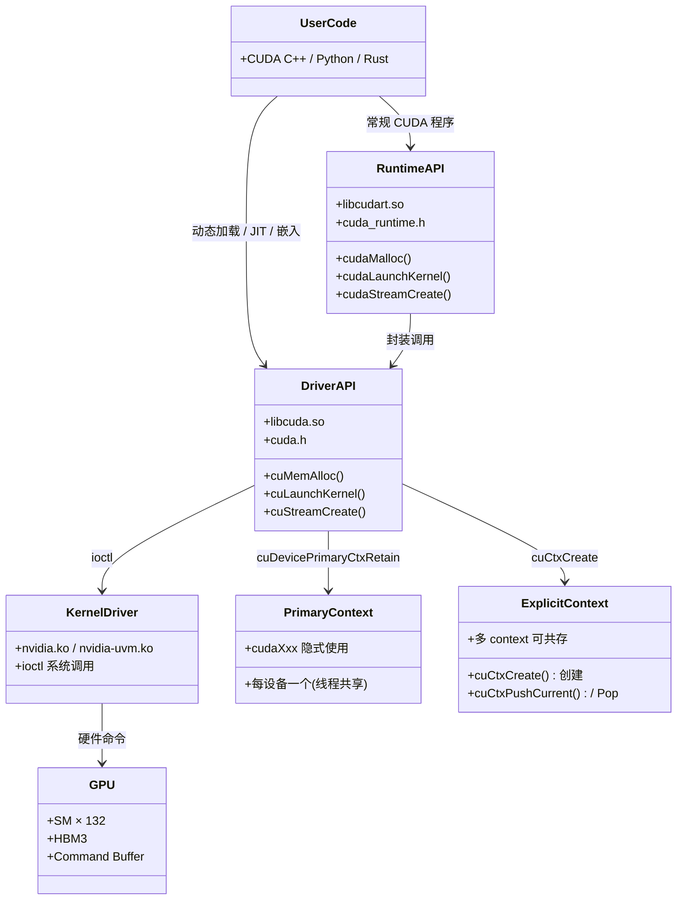

# 20 · CUDA Driver API

> **Driver API(`libcuda.so`,`cu*` 前缀)是 CUDA 软件栈的最低层用户态接口,提供对 context、module、kernel launch 的完全控制,适合动态加载 cubin、JIT 编译及嵌入式框架等需要精细资源管理的场景。**

## 1. 是什么 / 为什么有它

CUDA 的用户态接口分为两层:上层是 **CUDA Runtime API**(`libcudart.so`,函数前缀 `cuda`,头文件 `cuda_runtime.h`),提供自动 context 管理和更简洁的调用约定;下层是 **CUDA Driver API**(`libcuda.so`,函数前缀 `cu`,头文件 `cuda.h`),提供更底层的显式控制。Runtime API 实际上是 Driver API 的封装层——每次调用 `cudaLaunchKernel` 最终都会通过 Driver API 的 `cuLaunchKernel` 实现。

绝大多数应用直接用 Runtime API 即可。但在以下场景中,Driver API 不可替代:

- **动态加载 cubin / PTX**:TensorRT、PyTorch 的 Triton 编译器、自定义 JIT 框架需要在运行时编译 PTX 并加载生成的 cubin,必须通过 `cuModuleLoad` / `cuModuleLoadData` 完成。Runtime API 无对应接口。Driver API 支持将内存中的 PTX 字节串直接传给 `cuModuleLoadData`,驱动在运行时进行 JIT 编译并缓存结果到磁盘。
- **精细的 context 管理**:多租户推理服务需要在同一进程内管理多个 GPU 的独立 context 生命周期。Driver API 的 `cuCtxCreate` / `cuCtxPushCurrent` / `cuCtxPopCurrent` 提供了显式的 context 切换机制,每个请求可以在其专属 context 上执行,互不干扰。
- **嵌入式环境**:某些嵌入式系统或容器化部署只提供 `libcuda.so` 而不包含 `libcudart.so`,Driver API 是唯一选择。将链接依赖从 `libcudart` 迁移到 `libcuda` 可以大幅减小可执行文件和容器镜像的体积。
- **与第三方语言运行时集成**:Python(通过 ctypes/cffi)、Rust(`cuda-sys` 绑定)、Java(`JCuda`)等通过动态链接直接调用 Driver API,避免引入 C++ Runtime 的复杂初始化逻辑。
- **细粒度同步与流控**:Driver API 的 `cuStreamWaitValue32` / `cuStreamWriteValue32` 允许 GPU stream 直接读写主机内存的信号量(semaphore),实现无 CPU 参与的流间同步,延迟比 event 更低。

理解 Driver API 也有助于深入理解 Runtime API 的行为——例如为什么某些 Runtime API 调用会隐式初始化 context,或为什么 `cudaDeviceSynchronize` 的语义是 "等待当前 context 上的所有命令"。在排查 cudaErrorNoKernelImageForDevice(目标 SASS 架构与运行时 GPU 不匹配)、cudaErrorInvalidContext 等错误时,了解 Driver API 的 context 模型是找到根因的关键。

## 2. 硬件视角(微架构细节)

Driver API 与 Runtime API 的关系,以及二者与底层 kernel-mode 驱动、GPU 硬件之间的层次关系:



**Primary Context 与 Explicit Context 的区别:**

每个 GPU 设备维护一个 **primary context**:这是 Runtime API 和 Driver API 共享的默认上下文。当调用任何 `cudaXxx` API 时,Runtime 会隐式初始化并 retain 当前设备的 primary context。Driver API 通过 `cuDevicePrimaryCtxRetain` 获取同一个 primary context 句柄。因此,在同一进程内混用 Runtime API 和 Driver API 时,只要使用 primary context,两者操作的是同一个 context,资源可以互相可见。

**Explicit context**(`cuCtxCreate` 创建)是独立的执行环境,拥有独立的显存分配表、stream 集合和 module 加载表。每个 CPU 线程维护一个 context 栈,`cuCtxPushCurrent` / `cuCtxPopCurrent` 切换当前活跃 context。显式 context 切换会导致 GPU 端 pipeline flush(性能开销),应尽量减少跨 context 切换频率。

## 3. CUDA 编程接口

**初始化与设备查询:**

```cpp
#include <cuda.h>    // Driver API 头文件

CUresult res;
// 必须第一个调用:初始化 CUDA driver
res = cuInit(0);     // flags 参数固定为 0

CUdevice device;
res = cuDeviceGet(&device, 0);  // 获取 device 0 的句柄

int major, minor;
cuDeviceGetAttribute(&major, CU_DEVICE_ATTRIBUTE_COMPUTE_CAPABILITY_MAJOR, device);
cuDeviceGetAttribute(&minor, CU_DEVICE_ATTRIBUTE_COMPUTE_CAPABILITY_MINOR, device);
// Hopper H100: major=9, minor=0
```

**Context 管理:**

```cpp
CUcontext ctx;
// 方式 1:显式创建 context(用于多 context 场景)
cuCtxCreate(&ctx, 0, device);      // flags=0;ctx 自动成为当前线程的当前 context

// 方式 2:使用 primary context(与 Runtime API 共享,推荐)
CUcontext primary;
cuDevicePrimaryCtxRetain(&primary, device);
cuCtxPushCurrent(primary);

// 切换 context
CUcontext old;
cuCtxPushCurrent(ctx);   // 将 ctx 压入当前线程的 context 栈
// ... 在 ctx 上执行操作 ...
cuCtxPopCurrent(&old);   // 弹出,恢复之前的 context
```

**Module 与 Function 加载:**

```cpp
CUmodule mod;
// 从文件加载预编译 cubin 或 fatbin
cuModuleLoad(&mod, "kernel.cubin");

// 从内存中的 PTX/cubin 数据加载(适合 JIT 场景)
extern const char kernel_ptx[];   // 嵌入的 PTX 字符串
cuModuleLoadData(&mod, kernel_ptx);

// 获取 kernel 函数句柄
CUfunction fn;
cuModuleGetFunction(&fn, mod, "my_kernel");  // 按名称查找
```

**Kernel Launch:**

```cpp
// cuLaunchKernel 的完整参数
CUstream stream = nullptr;  // nullptr 表示 default stream
void *args[] = { &dptr, &n };   // kernel 参数的指针数组

CUresult r = cuLaunchKernel(
    fn,           // CUfunction 句柄
    gx, gy, gz,   // grid 维度(块数)
    bx, by, bz,   // block 维度(线程数)
    smem,         // 动态 shared memory 字节数
    stream,       // CUstream
    args,         // 参数指针数组(与 extra 二选一)
    nullptr       // extra:扩展参数(通常 nullptr)
);
```

**内存操作:**

```cpp
CUdeviceptr dptr;
cuMemAlloc(&dptr, n);           // 分配 n 字节设备内存
cuMemcpyHtoD(dptr, hptr, n);    // Host → Device
cuMemcpyDtoH(hptr, dptr, n);    // Device → Host
cuMemcpyHtoDAsync(dptr, hptr, n, stream);  // 异步版本
cuMemFree(dptr);                // 释放
```

**错误处理:**

```cpp
CUresult r = cuLaunchKernel(...);
if (r != CUDA_SUCCESS) {
    const char *err;
    cuGetErrorString(r, &err);
    fprintf(stderr, "cuLaunchKernel failed: %s\n", err);
}
```

## 4. 关键性能指标

| 方面 | 数值 | 说明 |
|---|---|---|
| Driver API 调用开销(vs Runtime) | +1-2 µs/call | 额外的 dispatch 层 |
| Primary context 初始化(首次) | ~100-500 ms | GPU context 建立,包含 JIT 链接 |
| Explicit context 创建 | ~10-50 ms | 独立 context 初始化 |
| cuCtxPushCurrent / Pop | ~1-5 µs | context 切换含 pipeline flush |
| cuModuleLoad(cubin 文件) | ~5-50 ms | 文件读取 + 模块加载 |
| cuModuleLoadData(PTX JIT) | ~100-500 ms/kernel | PTX 到 SASS 的 JIT 编译 |
| cuLaunchKernel vs cudaLaunchKernel | 基本相同 | Runtime 最终调用 Driver |

cuModuleLoadData 传入 PTX 字符串时,Driver 会在运行时 JIT 编译成目标架构的 SASS。JIT 结果会被缓存到 `~/.nv/ComputeCache`(Linux)或等效目录;同一 PTX 在同一 GPU 架构上第二次启动时直接命中缓存,无需重新编译。`CUDA_CACHE_DISABLE=1` 环境变量可强制禁用缓存(用于调试)。

对于需要在多个 device 上复用同一 module 的场景,每个 device 的 context 上需要独立调用 `cuModuleLoad`。Module 不跨 context 共享——这是 Driver API 的关键约束之一。

**cuLaunchKernel vs cudaLaunchKernel 的内部关系:** Runtime API 的 `cudaLaunchKernel` 在内部先确认当前 context,再调用 `cuLaunchKernel`。这一层转换的开销约 1-2 µs(主要来自 context 查找和参数封装)。对于需要发射数千个小 kernel 的场景(如 CUDA Graphs 之前的代码),这些 µs 级开销会累积成显著的 launch overhead。Driver API 通过跳过 context 自动查找这一步,略微降低了单次 launch 延迟。但对于大多数实际工作负载,这个差异可以忽略——改用 CUDA Graphs(第 16 章)批量提交才是根治 launch overhead 的正确方法。

**cuLaunchKernelEx(Driver API 扩展版本):** CUDA 11.6 引入了 `cuLaunchKernelEx`,接受 `CUlaunchConfig` 结构体,支持 cluster launch(SM90 新特性)和其他扩展配置。等价的 Runtime API 是 `cudaLaunchKernelEx`。在 Hopper 上使用 Thread Block Cluster 时,必须通过这组扩展接口指定 cluster 尺寸。

## 5. 代码示例

下面展示一个完整的最小 Driver API 应用:动态加载 cubin 并启动 kernel。

```cpp
#include <cuda.h>
#include <cstdio>
#include <cstdlib>

// 错误检查宏
#define CU_CHECK(r) do { \
    CUresult _r = (r);    \
    if (_r != CUDA_SUCCESS) { \
        const char *err; cuGetErrorString(_r, &err); \
        fprintf(stderr, "CUDA error %s:%d: %s\n", __FILE__, __LINE__, err); \
        exit(1); \
    } \
} while(0)

int main() {
    const int N = 1024;
    const float INIT_VAL = 3.14f;

    // 1. 初始化 Driver
    CU_CHECK(cuInit(0));

    // 2. 获取设备并 retain primary context
    CUdevice  dev; CU_CHECK(cuDeviceGet(&dev, 0));
    CUcontext ctx; CU_CHECK(cuDevicePrimaryCtxRetain(&ctx, dev));
    CU_CHECK(cuCtxPushCurrent(ctx));

    // 3. 加载预编译 cubin
    CUmodule  mod; CU_CHECK(cuModuleLoad(&mod, "fill.cubin"));
    CUfunction fn; CU_CHECK(cuModuleGetFunction(&fn, mod, "fill_kernel"));

    // 4. 分配设备内存并初始化
    CUdeviceptr dout;
    CU_CHECK(cuMemAlloc(&dout, N * sizeof(float)));

    // 5. 设置参数并启动 kernel
    float initVal = INIT_VAL;
    void *args[] = { (void*)&dout, (void*)&initVal, (void*)&N };
    CU_CHECK(cuLaunchKernel(fn,
        (N + 255) / 256, 1, 1,   // grid: 4 块
        256,              1, 1,   // block: 256 线程
        0,                        // shared memory: 0 bytes
        nullptr,                  // default stream
        args, nullptr));          // 参数数组

    // 6. 同步并拷贝结果
    CU_CHECK(cuCtxSynchronize());
    float *hout = (float*)malloc(N * sizeof(float));
    CU_CHECK(cuMemcpyDtoH(hout, dout, N * sizeof(float)));
    printf("hout[0] = %f (expect 3.14)\n", hout[0]);

    // 7. 清理
    free(hout);
    CU_CHECK(cuMemFree(dout));
    CU_CHECK(cuModuleUnload(mod));
    CU_CHECK(cuCtxPopCurrent(nullptr));
    CU_CHECK(cuDevicePrimaryCtxRelease(dev));
    return 0;
}
```

编译(链接 libcuda 而非 libcudart):

```bash
gcc -o drv_demo drv_demo.c -lcuda -I/usr/local/cuda/include -L/usr/local/cuda/lib64
```

## 6. 实测手段

**Driver API 调用追踪:**

```bash
# CUDA_LAUNCH_BLOCKING=1:将所有 kernel launch 串行化,便于精确定位错误
CUDA_LAUNCH_BLOCKING=1 ./drv_demo

# nvprof --print-gpu-trace:显示 driver-level 的 launch 事件(老版本工具)
nvprof --print-gpu-trace ./drv_demo
```

**NSight Systems 追踪 Driver API:**

```bash
nsys profile -t cuda ./drv_demo
# "CUDA API" 泳道中 cu* 函数调用会与 cuda* 函数一同显示
```

**错误诊断:**

```cpp
// cuGetErrorString 获取可读错误信息
const char *errName, *errDesc;
cuGetErrorName(r,    &errName);   // 错误枚举名称,如 "CUDA_ERROR_OUT_OF_MEMORY"
cuGetErrorString(r,  &errDesc);   // 人类可读描述
```

**JIT 缓存调试:**

```bash
# 查看 JIT 缓存目录(Linux)
ls ~/.nv/ComputeCache/

# 强制禁用缓存,每次都重新编译 PTX
CUDA_CACHE_DISABLE=1 ./jit_demo

# 查看 JIT 编译日志
CUDA_FORCE_PTX_JIT=1 CUDA_DRIVER_INFO=1 ./jit_demo
```

## 7. 常见反模式

1. **忘记调用 `cuInit(0)`** — `cuInit` 必须在所有其他 Driver API 调用前调用;跳过会导致后续所有调用返回 `CUDA_ERROR_NOT_INITIALIZED`。Runtime API 会隐式调用 cuInit,但 Driver API 不会自动初始化。这是在 Python/Rust 等语言中通过 FFI 调用 Driver API 时最容易忽略的差异——绑定库有时会在底层自动调用 cuInit,但如果使用原始绑定则需要手动调用。

2. **Runtime + Driver 混用时 context 不一致** — Runtime API 使用 primary context;若在 Driver API 中调用 `cuCtxCreate` 创建了一个 explicit context 并压入栈顶,随后的 `cudaMalloc`(Runtime API)会在 primary context(栈底)上操作,与 explicit context 完全隔离。表现为:在 explicit context 上分配的显存,用 Runtime API 无法访问;在 Runtime API 上创建的 stream,在 explicit context 中不存在。若要混用两套 API,统一使用 `cuDevicePrimaryCtxRetain` 获取 primary context 句柄,而非 `cuCtxCreate`。

3. **在 `cuLaunchKernel` 中错误使用 `extra` 参数** — `extra` 是扩展参数机制(`CU_LAUNCH_PARAM_*` 系列),用于传递结构化参数。若同时传了 `args`(非 NULL)和 `extra`(非 NULL),行为未定义——通常表现为 kernel 收到垃圾参数值导致非法内存访问。通常情况下,始终将 `extra` 设为 `nullptr`,用 `args` 数组传参即可。

4. **Module 跨 context 共享** — 同一个 `CUmodule` 句柄只对加载它的 context 有效。在多 GPU 或多 context 场景下,必须在每个 context 中独立 `cuModuleLoad`。跨 context 使用同一 module 句柄会导致 `CUDA_ERROR_INVALID_CONTEXT` 或静默错误(kernel 在错误的 GPU 上执行或完全不执行)。大规模部署中常见的做法是为每个 context 维护一个 `{module_file → CUmodule}` 的映射表。

5. **忘记 release primary context** — 调用 `cuDevicePrimaryCtxRetain` 之后必须对应调用 `cuDevicePrimaryCtxRelease`。若在进程生命周期内多次 retain 而不 release,context 的引用计数不会归零,可能阻止 GPU 驱动在 GPU reset 或 CUDA 重初始化时正确回收资源。虽然进程退出时驱动会强制清理,但在长驻服务进程或测试套件中,不对称的 retain/release 会累积为难以排查的资源泄漏。

## 8. 延伸阅读

- **CUDA Driver API Reference** — [https://docs.nvidia.com/cuda/cuda-driver-api/](https://docs.nvidia.com/cuda/cuda-driver-api/):所有 `cu*` 函数的完整参数说明与语义定义。
- **CUDA C++ Programming Guide §3.4** — Interoperability between Runtime and Driver APIs:混用两套 API 时 context 共享的规则。
- **CUDA C++ Programming Guide §3.6** — Compute Modes:primary context 的引用计数模型。
- **PTX ISA Reference** — [https://docs.nvidia.com/cuda/parallel-thread-execution/](https://docs.nvidia.com/cuda/parallel-thread-execution/):JIT 编译时 PTX 语义的权威参考。
- **CUDA Sample `vectorAddDrv`** — `Samples/0_Introduction/vectorAddDrv`:官方提供的完整 Driver API kernel launch 示例,包含 PTX 嵌入与 `cuModuleLoadData` 用法。
- **CUDA Sample `cudaDirect`** — 展示在 Python 通过 ctypes 调用 Driver API 的跨语言集成模式。
