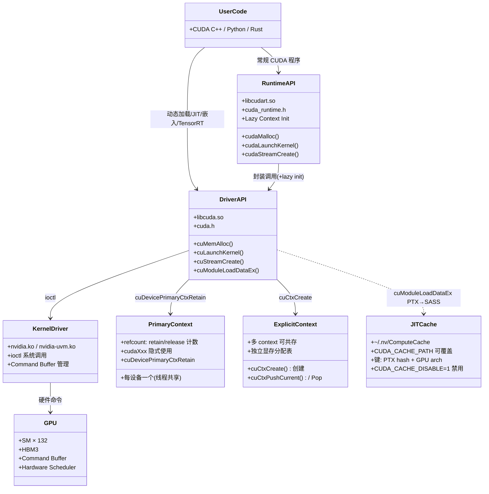
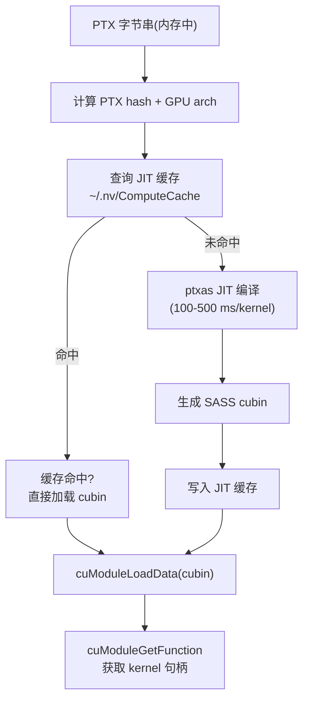

# 20 · CUDA Driver API

> **Driver API(`libcuda.so`,`cu*` 前缀)是 CUDA 软件栈的最低层用户态接口,提供对 context、module、kernel launch 的完全控制,适合动态加载 cubin、JIT 编译及嵌入式框架等需要精细资源管理的场景。**

## 1. 是什么 / 为什么有它

CUDA 的用户态接口分为两层:上层是 **CUDA Runtime API**(`libcudart.so`,函数前缀 `cuda`,头文件 `cuda_runtime.h`),提供自动 context 管理和更简洁的调用约定;下层是 **CUDA Driver API**(`libcuda.so`,函数前缀 `cu`,头文件 `cuda.h`),提供更底层的显式控制。Runtime API 实际上是 Driver API 的封装层——每次调用 `cudaLaunchKernel` 最终都会通过 Driver API 的 `cuLaunchKernel` 实现。

绝大多数应用直接用 Runtime API 即可。但在以下场景中,Driver API 不可替代:

- **动态加载 cubin / PTX**:TensorRT、PyTorch 的 Triton 编译器、自定义 JIT 框架需要在运行时编译 PTX 并加载生成的 cubin,必须通过 `cuModuleLoad` / `cuModuleLoadData` 完成。Runtime API 无对应接口。Driver API 支持将内存中的 PTX 字节串直接传给 `cuModuleLoadData`,驱动在运行时进行 JIT 编译并缓存结果到磁盘。
- **精细的 context 管理**:多租户推理服务需要在同一进程内管理多个 GPU 的独立 context 生命周期。Driver API 的 `cuCtxCreate` / `cuCtxPushCurrent` / `cuCtxPopCurrent` 提供了显式的 context 切换机制,每个请求可以在其专属 context 上执行,互不干扰。
- **嵌入式环境**:某些嵌入式系统或容器化部署只提供 `libcuda.so` 而不包含 `libcudart.so`,Driver API 是唯一选择。将链接依赖从 `libcudart` 迁移到 `libcuda` 可以大幅减小可执行文件和容器镜像的体积。
- **与第三方语言运行时集成**:Python(通过 ctypes/cffi)、Rust(`cuda-sys` 绑定)、Java(`JCuda`)等通过动态链接直接调用 Driver API,避免引入 C++ Runtime 的复杂初始化逻辑。
- **细粒度同步与流控**:Driver API 的 `cuStreamWaitValue32` / `cuStreamWriteValue32` 允许 GPU stream 直接读写主机内存的信号量(semaphore),实现无 CPU 参与的流间同步,延迟比 event 更低。

**为什么 TensorRT 和 Triton 直接调用 Driver API:**

TensorRT 的引擎执行路径(`IExecutionContext::enqueue`)直接调用 Driver API 而非 Runtime API,根本原因是 **Runtime API 的 Lazy Context 初始化开销**。首次调用任何 `cudaXxx` 函数时,Runtime 会隐式检查当前线程是否已有活跃的 primary context——若没有,则触发 primary context 的完整初始化(包括 JIT 链接、符号表建立、UVM 映射等),耗时约 100-500 ms。在生产推理服务中,第一个请求的延迟如果比后续请求高出 500 ms,会直接触发超时报警。TensorRT 通过在初始化阶段显式调用 `cuDevicePrimaryCtxRetain` + `cuCtxPushCurrent` 提前完成 context 初始化,后续的每次推理调用直接进入 fast path(context 已就绪),避免了 lazy init 的延迟开销。

**Lazy Init 的具体触发时机:** Runtime API 的 lazy init 会在以下几种情况被触发:①首次调用 `cudaMalloc`、`cudaMemcpy`、`cudaLaunchKernel` 等任意 Runtime API;②首次在某个 CPU 线程上调用 Runtime API(每个线程第一次调用时都会触发 primary context 的 retain,但若 primary context 已创建则开销仅为 TLS 检查,约 1 µs);③在程序入口 `main` 之前,若存在全局变量的 CUDA 构造函数(如 `__device__` 变量、CUDA Graphs 的静态初始化),也会触发 lazy init。Python PyTorch 中,`import torch` 不会触发 lazy init,但 `torch.tensor(...).cuda()` 会;`torch.cuda.is_available()` 不会,但 `torch.cuda.current_device()` 会(后者调用了 `cudaGetDevice`)。了解 lazy init 的精确触发点对于精确测量推理首请求延迟(cold start latency)至关重要。

Triton(OpenAI)的编译产物加载流程同样依赖 Driver API:Triton 将 CUDA kernel 编译为 PTX 字节串存储在 Python 包中,运行时通过 `cuModuleLoadDataEx` 进行 JIT 编译并加载。这比 `cuModuleLoad`(从文件加载预编译 cubin)更灵活——允许在运行时根据 GPU 架构动态选择编译参数,同一份 Triton kernel 代码可以在 sm_80、sm_90、sm_90a 上分别 JIT 出最优 SASS,无需预编译多份 cubin。

理解 Driver API 也有助于深入理解 Runtime API 的行为——例如为什么某些 Runtime API 调用会隐式初始化 context,或为什么 `cudaDeviceSynchronize` 的语义是 "等待当前 context 上的所有命令"。在排查 cudaErrorNoKernelImageForDevice(目标 SASS 架构与运行时 GPU 不匹配)、cudaErrorInvalidContext 等错误时,了解 Driver API 的 context 模型是找到根因的关键。

**Driver API 的软件栈历史演进:** 早期 CUDA(1.x-3.x)只有 Driver API,Runtime API 是 CUDA 4.0 才加入的高级封装。由于 Runtime API 更易用,大多数 CUDA 教程从 Runtime API 开始,Driver API 逐渐成为"进阶"或"框架开发者"的工具。但 GPU 计算框架的爆发(TensorFlow、PyTorch、TensorRT、Triton、vLLM)使 Driver API 重新回到聚光灯下——几乎所有生产级框架的核心执行路径都在底层使用 Driver API。了解 Driver API 意味着能够阅读和理解这些框架的底层代码,这在性能调优、debug 和架构设计中都是不可或缺的能力。

**Driver API 版本兼容性的实际意义:** 当 CUDA 驱动升级(如从 530.x 升至 560.x),`libcuda.so` 中已有的 `cu*` 函数不会改变签名,只会新增函数(向后兼容)。这保证了用 CUDA 11.x Toolkit 编译并使用旧版 Driver API 的程序在装有 CUDA 12.x 驱动的机器上仍能正常运行。版本检查:`cuDriverGetVersion(&ver)` 返回驱动支持的最高 CUDA 版本(如 12040 = CUDA 12.4),可以在程序启动时检查并条件性调用新 API。

**Driver API 的跨平台兼容性:** `libcuda.so` 的版本随 GPU 驱动安装,独立于 CUDA Toolkit 版本。理论上,只要驱动版本满足最低要求,可以用旧版 Toolkit 编译的程序在新版驱动上运行(向前兼容,通过驱动的 compatibility layer)。这一特性对于容器化部署极为重要:一个用 CUDA 11.8 Toolkit 编译的 TensorRT 引擎,只要宿主机驱动 ≥ CUDA 11.8 要求(例如驱动 525.x),即可直接运行,无需容器内安装完整 Toolkit。这是 `nvidia-container-toolkit` 只挂载 `libcuda.so` 而不包含 `libcudart.so` 的根本原因。

## 2. 硬件视角(微架构细节)

### 2.1 Runtime ↔ Driver 双 API 架构图

Driver API 与 Runtime API 的关系,以及二者与底层 kernel-mode 驱动、GPU 硬件之间的层次关系:



### 2.2 Primary Context 多线程引用计数与 Race 风险

**Primary Context 引用计数机制:** `cuDevicePrimaryCtxRetain(dev)` 将设备 dev 的 primary context 引用计数加 1;`cuDevicePrimaryCtxRelease(dev)` 将其减 1。当引用计数降至 0 时,primary context 被销毁(GPU 侧资源全部释放,显存分配表清空)。Runtime API 的 `cudaSetDevice(dev)` 内部调用 `cuDevicePrimaryCtxRetain`,这也是为什么在不同线程上多次调用 `cudaSetDevice` 而不配对 `cudaDeviceReset` 不会引起问题——每次 retain 都有对应的内部 release。

**多线程 Race 的典型模式(生产踩坑案例):**

场景:一个多线程推理服务在每个请求处理线程中初始化 CUDA context。两个线程 A 和 B 同时完成请求,各自调用 `cuDevicePrimaryCtxRelease(dev)`:

```
Thread A                     Thread B
cuDevicePrimaryCtxRelease(0) -- 引用计数: 2 → 1
                             cuDevicePrimaryCtxRelease(0) -- 引用计数: 1 → 0
                             → Context 被销毁!
Thread A 的 CUstream 失效,后续任何 cu* 调用返回 CUDA_ERROR_INVALID_CONTEXT
```

根本原因:Thread A 在 release 后仍持有 CUstream 句柄,但 context 已被 Thread B 的 release 销毁。正确做法是用 `cuCtxCreate` 为每个服务线程创建独立的 explicit context,或者在主线程持有 primary context 的生命周期,服务线程只 push/pop 而不 retain/release。

**`cuDevicePrimaryCtxGetState` 监控:** 可以通过 `cuDevicePrimaryCtxGetState(dev, &flags, &active)` 查询 primary context 是否活跃以及当前 flags 设置,在初始化检查中非常有用。

**Explicit Context 的性能代价:** 每个 `cuCtxCreate` 创建的 explicit context 在 GPU 端对应一套独立的状态机:独立的 scheduling queue、独立的 MMU 页表空间、独立的显存分配器(CUDA MemPool 不跨 context 共享)。在 H100 上,同一 GPU 上运行多个 explicit context 时,GPU 调度器需要在多个 context 间进行时间片切换(通过 MPS 或 MIG 可以实现空间隔离,但纯软件 context 切换仍然是时间片调度),每次切换需要 pipeline flush,耗时约 20-50 µs。对于延迟敏感的推理服务,多 context 设计应仔细权衡:若多个并发请求的执行时间远大于 context 切换延迟(如 100 ms 推理 vs 50 µs 切换),多 context 设计合理;若推理极短(< 1 ms),context 切换开销不可忽视,应改用 MPS(Multi-Process Service)或单 context 多 stream 设计。

**cuDevicePrimaryCtxSetFlags 与调度策略:** 在调用 `cuDevicePrimaryCtxRetain` 之前(即 context 尚未活跃时),可以通过 `cuDevicePrimaryCtxSetFlags(dev, CU_CTX_SCHED_BLOCKING_SYNC)` 设置 context 的 CPU 等待策略。`CU_CTX_SCHED_AUTO`(默认):CPU 自适应选择 spin 或 sleep;`CU_CTX_SCHED_SPIN`:CPU 忙等(最低延迟,最高 CPU 占用);`CU_CTX_SCHED_BLOCKING_SYNC`:CPU 阻塞(最低 CPU 占用,最高等待延迟)。生产推理服务通常使用 `BLOCKING_SYNC` 以降低 CPU 占用率(每个 GPU 保持一个等待线程),训练场景使用 `SPIN`(CPU 持续轮询 GPU 完成信号,减少 cudaStreamSynchronize 的唤醒延迟约 20-50 µs)。

### 2.3 `cuModuleLoadDataEx` JIT 完整 Options

`cuModuleLoadDataEx` 是 Triton、TensorRT 等框架在运行时编译 PTX 的核心函数:



**`cuModuleLoadDataEx` JIT 选项列表:**

```cpp
// JIT 编译选项数组
CUjit_option options[] = {
    CU_JIT_MAX_REGISTERS,           // 每线程最大寄存器数(等价于 --maxrregcount)
    CU_JIT_THREADS_PER_BLOCK,       // 目标 block 大小(影响 occupancy 优化)
    CU_JIT_OPTIMIZATION_LEVEL,      // 优化等级 0-4(默认 4,等价于 ptxas -O3)
    CU_JIT_TARGET,                  // 目标架构(CU_TARGET_COMPUTE_90a 等)
    CU_JIT_FALLBACK_STRATEGY,       // PTX JIT 失败时的 fallback 策略
    CU_JIT_GENERATE_LINE_INFO,      // 生成行信息(用于 NSight 源码关联)
    CU_JIT_LOG_VERBOSE,             // 详细 JIT 日志
    CU_JIT_INFO_LOG_BUFFER,         // JIT 信息日志 buffer 指针
    CU_JIT_INFO_LOG_BUFFER_SIZE_BYTES,  // buffer 大小
    CU_JIT_ERROR_LOG_BUFFER,        // JIT 错误日志 buffer 指针
    CU_JIT_ERROR_LOG_BUFFER_SIZE_BYTES, // buffer 大小
};

// 对应的值数组
void *values[] = {
    (void*)64,        // maxrregcount = 64
    (void*)256,       // threads per block = 256
    (void*)4,         // optimization level = 4
    (void*)CU_TARGET_COMPUTE_90A,  // target = sm_90a
    (void*)CU_PREFER_PTX,          // 偏好 JIT 而非 binary
    (void*)1,         // 生成行信息
    (void*)1,         // 详细日志
    (void*)info_log, (void*)sizeof(info_log),
    (void*)err_log,  (void*)sizeof(err_log),
};

CUmodule mod;
CUresult r = cuModuleLoadDataEx(&mod, ptx_data,
    sizeof(options)/sizeof(options[0]), options, values);
```

**JIT 缓存失效条件:** `~/.nv/ComputeCache` 中的缓存项以 `(PTX 内容 hash, GPU 架构, 驱动版本)` 为键。以下情况触发缓存失效并重新 JIT:①驱动版本更新;②GPU 更换(架构改变);③PTX 内容改变(哪怕只改一行注释也会改变 hash);④`CUDA_CACHE_DISABLE=1` 环境变量。`CUDA_CACHE_PATH` 环境变量可以将缓存路径重定向到高速 NVMe 或 tmpfs,减少冷启动时的 JIT 延迟。

## 3. CUDA 编程接口

**初始化与设备查询:**

```cpp
#include <cuda.h>    // Driver API 头文件

CUresult res;
// 必须第一个调用:初始化 CUDA driver
res = cuInit(0);     // flags 参数固定为 0

CUdevice device;
res = cuDeviceGet(&device, 0);  // 获取 device 0 的句柄

int major, minor;
cuDeviceGetAttribute(&major, CU_DEVICE_ATTRIBUTE_COMPUTE_CAPABILITY_MAJOR, device);
cuDeviceGetAttribute(&minor, CU_DEVICE_ATTRIBUTE_COMPUTE_CAPABILITY_MINOR, device);
// Hopper H100: major=9, minor=0
```

**Context 管理:**

```cpp
CUcontext ctx;
// 方式 1:显式创建 context(用于多 context 场景)
cuCtxCreate(&ctx, 0, device);      // flags=0;ctx 自动成为当前线程的当前 context

// 方式 2:使用 primary context(与 Runtime API 共享,推荐)
CUcontext primary;
cuDevicePrimaryCtxRetain(&primary, device);
cuCtxPushCurrent(primary);

// 切换 context
CUcontext old;
cuCtxPushCurrent(ctx);   // 将 ctx 压入当前线程的 context 栈
// ... 在 ctx 上执行操作 ...
cuCtxPopCurrent(&old);   // 弹出,恢复之前的 context
```

**Module 与 Function 加载:**

```cpp
CUmodule mod;
// 从文件加载预编译 cubin 或 fatbin
cuModuleLoad(&mod, "kernel.cubin");

// 从内存中的 PTX/cubin 数据加载(适合 JIT 场景)
extern const char kernel_ptx[];   // 嵌入的 PTX 字符串
cuModuleLoadData(&mod, kernel_ptx);

// 获取 kernel 函数句柄
CUfunction fn;
cuModuleGetFunction(&fn, mod, "my_kernel");  // 按名称查找
```

**Kernel Launch:**

```cpp
// cuLaunchKernel 的完整参数
CUstream stream = nullptr;  // nullptr 表示 default stream
void *args[] = { &dptr, &n };   // kernel 参数的指针数组

CUresult r = cuLaunchKernel(
    fn,           // CUfunction 句柄
    gx, gy, gz,   // grid 维度(块数)
    bx, by, bz,   // block 维度(线程数)
    smem,         // 动态 shared memory 字节数
    stream,       // CUstream
    args,         // 参数指针数组(与 extra 二选一)
    nullptr       // extra:扩展参数(通常 nullptr)
);
```

**内存操作:**

```cpp
CUdeviceptr dptr;
cuMemAlloc(&dptr, n);           // 分配 n 字节设备内存
cuMemcpyHtoD(dptr, hptr, n);    // Host → Device
cuMemcpyDtoH(hptr, dptr, n);    // Device → Host
cuMemcpyHtoDAsync(dptr, hptr, n, stream);  // 异步版本
cuMemFree(dptr);                // 释放
```

**错误处理:**

```cpp
CUresult r = cuLaunchKernel(...);
if (r != CUDA_SUCCESS) {
    const char *err;
    cuGetErrorString(r, &err);
    fprintf(stderr, "cuLaunchKernel failed: %s\n", err);
}
```

## 4. 关键性能指标

| 方面 | 数值 | 说明 |
|---|---|---|
| Driver API 调用开销(vs Runtime) | +1-2 µs/call | 额外的 dispatch 层 |
| Primary context 初始化(首次,Lazy) | ~100-500 ms | GPU context 建立,包含 JIT 链接 |
| Primary context 预初始化(提前 retain) | ~80-300 ms | 服务启动时一次性完成,消除 first-request 延迟 |
| Explicit context 创建 | ~10-50 ms | 独立 context 初始化 |
| cuCtxPushCurrent / Pop | ~1-5 µs | context 切换含 pipeline flush |
| cuModuleLoad(cubin 文件) | ~5-50 ms | 文件读取 + 模块加载 |
| cuModuleLoadData(PTX JIT,缓存未命中) | ~100-500 ms/kernel | PTX 到 SASS 的 JIT 编译 |
| cuModuleLoadData(PTX JIT,缓存命中) | ~1-10 ms | 读取缓存 cubin + 加载 |
| cuLaunchKernel vs cudaLaunchKernel | 基本相同 | Runtime 最终调用 Driver |

**JIT 缓存的生产价值:** 以 Triton 编译的注意力 kernel(约 20 个 kernel)为例,首次冷启动(缓存空)需要 JIT 编译 20 次,每次约 200 ms,总计约 4 秒。第二次启动(缓存命中)每个 kernel 加载约 5 ms,总计约 100 ms。在生产推理服务的 pod 重启场景中,JIT 缓存的命中率直接决定服务恢复时间——若缓存目录挂载到网络存储(NFS),即使 pod 销毁重建,缓存仍然有效,服务冷启动时间可从 4 秒降至 0.1 秒。

**`cuFuncGetAttribute` 查询 kernel 编译属性:** 加载 module 后,可以通过 `cuFuncGetAttribute` 查询 kernel 的静态编译信息,这对于动态调整 launch 配置非常有用:

```cpp
int numRegs, sharedMemBytes, maxThreadsPerBlock;
cuFuncGetAttribute(&numRegs,          CU_FUNC_ATTRIBUTE_NUM_REGS,          fn);
cuFuncGetAttribute(&sharedMemBytes,   CU_FUNC_ATTRIBUTE_SHARED_SIZE_BYTES, fn);
cuFuncGetAttribute(&maxThreadsPerBlock, CU_FUNC_ATTRIBUTE_MAX_THREADS_PER_BLOCK, fn);
// 据此计算最优 block size 和 grid size
```

在 TensorRT 的 Auto-Tuner 中,对每个 kernel candidate 调用 `cuFuncGetAttribute` 获取寄存器数和 SMEM 用量,再通过 occupancy 计算器(`cuOccupancyMaxActiveBlocksPerMultiprocessor`)选出最优 block size。这一过程在引擎构建阶段(build time)完成,运行时直接使用预选的最优配置,无需重复计算。

**`cuOccupancyMaxPotentialBlockSize` 自动 block 优化:** Driver API 提供了 occupancy 计算辅助函数,自动找出使 SM 利用率最高的 block size:

```cpp
int minGridSize, blockSize;
// 自动搜索最优 blockSize(使 occupancy 最大)
cuOccupancyMaxPotentialBlockSize(&minGridSize, &blockSize, fn,
    /*blockSizeToDynamicSmemSize=*/nullptr,  // 不使用动态 SMEM
    /*dynamicSMemSize=*/0, /*blockSizeLimit=*/0);
// 根据最优 blockSize 计算 gridSize
int gridSize = (N + blockSize - 1) / blockSize;
cuLaunchKernel(fn, gridSize, 1, 1, blockSize, 1, 1, 0, stream, args, nullptr);
```

这一 API 在 PyTorch 的 elementwise kernel launcher 中广泛使用:每个新 kernel 第一次调用时通过该 API 确定最优 block size,之后缓存结果。

**Triton kernel 加载机制 (实现导读):** Triton(`triton/runtime/driver.py` 和 `triton/runtime/jit.py`)使用了以下 Driver API 调用序列:
1. `cuInit(0)` + `cuDevicePrimaryCtxRetain` — 在 `triton.runtime.driver.CudaDriver.__init__` 中完成
2. `cuModuleLoadDataEx` with PTX bytes + JIT options — `CudaModule.load_ptx` 中调用
3. `cuModuleGetFunction` — 缓存到 `kernel_cache` 字典,按 `(ptx_hash, constexprs)` 索引
4. `cuLaunchKernel` — `CudaFunction.__call__` 调用,参数通过 `PackedFunc` 序列化

Triton 选择 Driver API 而非 Runtime API 的另一个原因是: Runtime API 的 `cudaLaunchKernel` 通过函数指针调用,需要对应的 `__global__` 函数符号在编译时可知。而 Driver API 的 `cuLaunchKernel` 接受 `CUfunction` 句柄,完全支持运行时动态加载,与 Triton 的 JIT 编译模式完美契合。

### 4.2 Driver API 在生产推理服务中的架构设计

以下是一个典型的多模型推理服务中 Driver API 使用的实际架构,反映了 TensorRT Inference Server 的设计模式:

**服务初始化阶段(一次性,服务启动时):**
1. `cuInit(0)` — 全局一次
2. 为每个 GPU 调用 `cuDevicePrimaryCtxRetain` — 引用计数 +1,防止意外销毁
3. 为每个模型实例调用 `cuCtxCreate` — 每个模型拥有独立 explicit context
4. 为每个模型 context 调用 `cuModuleLoadDataEx`(PTX or cubin) — 加载所有 kernel
5. `cuModuleGetFunction` 缓存所有 kernel 句柄到 `unordered_map<string, CUfunction>`

**请求处理阶段(每个请求):**
1. `cuCtxPushCurrent(model_ctx)` — 切换到对应模型的 context(~1-5 µs)
2. `cuMemAllocAsync` / `cuLaunchKernel` × N — 执行推理计算
3. `cuStreamSynchronize` — 等待推理完成
4. `cuCtxPopCurrent` — 恢复之前 context

**关键设计原则:** 步骤 4(`cuModuleLoadDataEx`)的 JIT 时间集中在启动阶段一次性完成;步骤 5 的函数句柄缓存确保请求路径不包含 module 查找开销;步骤 1/4 的 context push/pop 开销 ~3-10 µs,对于毫秒级推理延迟可以忽略。

**`cuStreamWaitValue32` 高级同步(生产场景):** 对于 GPU-to-GPU 或 GPU-to-CPU 的低延迟同步信号(如流水线生产者-消费者),`cuStreamWaitValue32` 比 CUDA event 延迟更低:

```cpp
// GPU stream 等待 CPU 写入信号量,直到 *semaphore == expected_value 才继续执行
cuStreamWaitValue32(stream, semaphore_gpu_ptr,
                    expected_value, CU_STREAM_WAIT_VALUE_EQ);
// GPU stream 写入信号量(通知 CPU 或另一个 GPU stream)
cuStreamWriteValue32(stream, semaphore_gpu_ptr,
                     write_value, CU_STREAM_WRITE_VALUE_DEFAULT);
```

这一机制在 pipeline 并行推理中非常有用:prefill GPU 完成 KV cache 计算后,通过 `cuStreamWriteValue32` 直接通知 decode GPU 开始读取,无需 CPU 介入路由,端到端延迟从 event 方案的约 15 µs 降至约 5 µs(DistServe 论文,2024)。

**`cuLaunchKernelEx` 与 Hopper Cluster Launch:** CUDA 11.6 引入了 `cuLaunchKernelEx`,接受 `CUlaunchConfig` 结构体,支持 cluster launch(SM90 新特性)和其他扩展配置。等价的 Runtime API 是 `cudaLaunchKernelEx`。在 Hopper 上使用 Thread Block Cluster 时,必须通过这组扩展接口指定 cluster 尺寸。Driver API 首先获得了该接口(CUDA 11.6),Runtime API 的对应版本晚了约 2 个版本发布——这是框架开发者倾向于使用 Driver API 的另一个原因:新特性往往先在 Driver API 中提供。

## 5. 代码示例

下面展示一个完整的最小 Driver API 应用:动态加载 cubin 并启动 kernel。

```cpp
#include <cuda.h>
#include <cstdio>
#include <cstdlib>

// 错误检查宏
#define CU_CHECK(r) do { \
    CUresult _r = (r);    \
    if (_r != CUDA_SUCCESS) { \
        const char *err; cuGetErrorString(_r, &err); \
        fprintf(stderr, "CUDA error %s:%d: %s\n", __FILE__, __LINE__, err); \
        exit(1); \
    } \
} while(0)

int main() {
    const int N = 1024;
    const float INIT_VAL = 3.14f;

    // 1. 初始化 Driver
    CU_CHECK(cuInit(0));

    // 2. 获取设备并 retain primary context
    CUdevice  dev; CU_CHECK(cuDeviceGet(&dev, 0));
    CUcontext ctx; CU_CHECK(cuDevicePrimaryCtxRetain(&ctx, dev));
    CU_CHECK(cuCtxPushCurrent(ctx));

    // 3. 加载预编译 cubin
    CUmodule  mod; CU_CHECK(cuModuleLoad(&mod, "fill.cubin"));
    CUfunction fn; CU_CHECK(cuModuleGetFunction(&fn, mod, "fill_kernel"));

    // 4. 分配设备内存并初始化
    CUdeviceptr dout;
    CU_CHECK(cuMemAlloc(&dout, N * sizeof(float)));

    // 5. 设置参数并启动 kernel
    float initVal = INIT_VAL;
    void *args[] = { (void*)&dout, (void*)&initVal, (void*)&N };
    CU_CHECK(cuLaunchKernel(fn,
        (N + 255) / 256, 1, 1,   // grid: 4 块
        256,              1, 1,   // block: 256 线程
        0,                        // shared memory: 0 bytes
        nullptr,                  // default stream
        args, nullptr));          // 参数数组

    // 6. 同步并拷贝结果
    CU_CHECK(cuCtxSynchronize());
    float *hout = (float*)malloc(N * sizeof(float));
    CU_CHECK(cuMemcpyDtoH(hout, dout, N * sizeof(float)));
    printf("hout[0] = %f (expect 3.14)\n", hout[0]);

    // 7. 清理(注意 retain/release 必须配对)
    free(hout);
    CU_CHECK(cuMemFree(dout));
    CU_CHECK(cuModuleUnload(mod));
    CU_CHECK(cuCtxPopCurrent(nullptr));
    CU_CHECK(cuDevicePrimaryCtxRelease(dev));
    return 0;
}
```

编译(链接 libcuda 而非 libcudart):

```bash
gcc -o drv_demo drv_demo.c -lcuda -I/usr/local/cuda/include -L/usr/local/cuda/lib64
```

## 6. 实测手段

**Driver API 调用追踪:**

```bash
# CUDA_LAUNCH_BLOCKING=1:将所有 kernel launch 串行化,便于精确定位错误
CUDA_LAUNCH_BLOCKING=1 ./drv_demo

# nvprof --print-gpu-trace:显示 driver-level 的 launch 事件(老版本工具)
nvprof --print-gpu-trace ./drv_demo
```

**NSight Systems 追踪 Driver API:**

```bash
nsys profile -t cuda ./drv_demo
# "CUDA API" 泳道中 cu* 函数调用会与 cuda* 函数一同显示
```

**错误诊断:**

```cpp
// cuGetErrorString 获取可读错误信息
const char *errName, *errDesc;
cuGetErrorName(r,    &errName);   // 错误枚举名称,如 "CUDA_ERROR_OUT_OF_MEMORY"
cuGetErrorString(r,  &errDesc);   // 人类可读描述
```

**JIT 缓存调试:**

```bash
# 查看 JIT 缓存目录(Linux)
ls ~/.nv/ComputeCache/

# 强制禁用缓存,每次都重新编译 PTX
CUDA_CACHE_DISABLE=1 ./jit_demo

# 重定向缓存到 tmpfs(加速 JIT)
export CUDA_CACHE_PATH=/dev/shm/cuda_cache
mkdir -p $CUDA_CACHE_PATH

# 查看 JIT 编译日志
CUDA_FORCE_PTX_JIT=1 CUDA_DRIVER_INFO=1 ./jit_demo
```

## 7. 常见反模式

1. **忘记调用 `cuInit(0)`** — `cuInit` 必须在所有其他 Driver API 调用前调用;跳过会导致后续所有调用返回 `CUDA_ERROR_NOT_INITIALIZED`。Runtime API 会隐式调用 cuInit,但 Driver API 不会自动初始化。这是在 Python/Rust 等语言中通过 FFI 调用 Driver API 时最容易忽略的差异——绑定库有时会在底层自动调用 cuInit,但如果使用原始绑定则需要手动调用。

2. **Runtime + Driver 混用时 context 不一致** — Runtime API 使用 primary context;若在 Driver API 中调用 `cuCtxCreate` 创建了一个 explicit context 并压入栈顶,随后的 `cudaMalloc`(Runtime API)会在 primary context(栈底)上操作,与 explicit context 完全隔离。表现为:在 explicit context 上分配的显存,用 Runtime API 无法访问;在 Runtime API 上创建的 stream,在 explicit context 中不存在。若要混用两套 API,统一使用 `cuDevicePrimaryCtxRetain` 获取 primary context 句柄,而非 `cuCtxCreate`。

3. **在 `cuLaunchKernel` 中错误使用 `extra` 参数** — `extra` 是扩展参数机制(`CU_LAUNCH_PARAM_*` 系列),用于传递结构化参数。若同时传了 `args`(非 NULL)和 `extra`(非 NULL),行为未定义——通常表现为 kernel 收到垃圾参数值导致非法内存访问。通常情况下,始终将 `extra` 设为 `nullptr`,用 `args` 数组传参即可。

4. **Module 跨 context 共享** — 同一个 `CUmodule` 句柄只对加载它的 context 有效。在多 GPU 或多 context 场景下,必须在每个 context 中独立 `cuModuleLoad`。跨 context 使用同一 module 句柄会导致 `CUDA_ERROR_INVALID_CONTEXT` 或静默错误(kernel 在错误的 GPU 上执行或完全不执行)。大规模部署中常见的做法是为每个 context 维护一个 `{module_file → CUmodule}` 的映射表。

5. **忘记 release primary context 导致引用计数不平衡** — 调用 `cuDevicePrimaryCtxRetain` 之后必须对应调用 `cuDevicePrimaryCtxRelease`。若在进程生命周期内多次 retain 而不 release,context 的引用计数不会归零,可能阻止 GPU 驱动在 GPU reset 或 CUDA 重初始化时正确回收资源。虽然进程退出时驱动会强制清理,但在长驻服务进程(如推理服务器)或测试套件中,不对称的 retain/release 会累积为难以排查的资源泄漏。诊断方法:在进程退出前调用 `cuDevicePrimaryCtxGetState` 检查引用计数是否为预期值。

6. **多线程并发 retain + release 的竞争窗口** — 如 §2.2 所述,多线程同时 release 可能将引用计数意外降为 0,导致 context 提前销毁。解决方案:使用应用层的 mutex 保护 primary context 的 retain/release,或采用"主线程持有生命周期,工作线程只 push/pop"的设计模式。TensorRT Runtime 的多线程安全保证正是通过这一模式实现的——推理请求线程 push primary context → 执行推理 → pop,context 的 retain 只在服务初始化时调用一次。

7. **JIT 缓存目录权限问题** — 在容器化环境中,`~/.nv/ComputeCache` 可能映射到只读文件系统或 home 目录不可写,导致每次启动都重新 JIT(无缓存)。症状:服务首次请求延迟异常高(4-10 秒),后续请求恢复正常。修复方案:通过 `CUDA_CACHE_PATH` 将缓存重定向到可写路径(如 `/tmp/cuda_cache` 或持久化 PVC),并确保容器的 entrypoint 在启动时预热 JIT 缓存(执行一次完整推理,触发所有 kernel 的 JIT 并写入缓存)。

### 7.8 实战:Python 中通过 ctypes 使用 Driver API

Python 生态中最常见的 Driver API 直接调用方式是通过 `ctypes` 或 `cffi`:

```python
import ctypes

# 加载 libcuda.so
cuda = ctypes.CDLL("libcuda.so.1")

# 初始化
cuda.cuInit(0)

# 获取设备
dev = ctypes.c_int(0)
cuda.cuDeviceGet(ctypes.byref(dev), 0)

# 创建 context
ctx = ctypes.c_void_p()
cuda.cuCtxCreate_v2(ctypes.byref(ctx), 0, dev)

# 加载 PTX(以字节串形式)
ptx_bytes = b".version 8.0\n..."  # PTX 字符串
mod = ctypes.c_void_p()
cuda.cuModuleLoadData(ctypes.byref(mod), ptx_bytes)
```

这一模式在 vLLM 的 custom ops、Triton 的 driver backend、以及 PyTorch 的 `torch.cuda._driver_api` 中均有使用。与 Python CUDA 绑定库(如 `pycuda`、`cuda-python`)相比,直接 ctypes 调用的优点是零依赖、启动更快,缺点是需要手动处理 CUDA 版本兼容性(不同驱动版本的函数签名可能有 `_v2` 后缀等差异)。

**`cuda-python` 标准绑定(推荐):** NVIDIA 官方维护的 `cuda-python` 包(`pip install cuda-python`)提供了对所有 Driver API 的类型安全 Python 绑定,并自动处理版本差异。Triton 从 2.x 版本起开始过渡到 `cuda-python` 作为驱动交互层,相比 ctypes 更健壮。`cuModuleLoadDataEx` 在 `cuda-python` 中的调用为 `cuda.cuModuleLoadDataEx(ptx_data, num_options, options, option_values)`,与 C API 一一对应但通过 Python 类型系统提供了参数校验。

**vLLM 中的 Driver API 使用模式:** vLLM(`vllm/worker/gpu_model_runner.py` 和 `vllm/utils.py`)使用 Driver API 实现了以下关键功能:
① 通过 `cuMemGetAddressRange` 验证 tensor 的 device 指针范围是否合法(防御性检查);
② 通过 `cuPointerGetAttribute(CU_POINTER_ATTRIBUTE_DEVICE_ORDINAL)` 查询 tensor 所在 GPU 编号,在多 GPU 推理中确认 tensor 路由正确;
③ 通过 `cuIpcGetMemHandle` 和 `cuIpcOpenMemHandle` 实现跨进程 KV cache 共享(disaggregated prefill 模式);
④ 通过 `cuMemAddressReserve` + `cuMemMap` 实现 PagedAttention 的虚拟内存映射(将非连续的物理 page 映射到连续的虚拟地址,无需 scatter/gather)。这些功能在 Runtime API 中没有对应接口,是 vLLM 必须依赖 Driver API 的核心原因。

## 8. 延伸阅读

- **CUDA Driver API Reference** — [https://docs.nvidia.com/cuda/cuda-driver-api/](https://docs.nvidia.com/cuda/cuda-driver-api/):所有 `cu*` 函数的完整参数说明与语义定义。
- **CUDA C++ Programming Guide §3.4** — Interoperability between Runtime and Driver APIs:混用两套 API 时 context 共享的规则。
- **CUDA C++ Programming Guide §3.6** — Compute Modes:primary context 的引用计数模型。
- **PTX ISA Reference** — [https://docs.nvidia.com/cuda/parallel-thread-execution/](https://docs.nvidia.com/cuda/parallel-thread-execution/):JIT 编译时 PTX 语义的权威参考。
- **Triton 源码 — runtime/driver.py** — OpenAI Triton 中 `CudaDriver` 和 `CudaModule` 类的实现,是理解框架如何使用 `cuModuleLoadDataEx` 进行 JIT 加载的第一手材料。
- **CUDA Sample `vectorAddDrv`** — `Samples/0_Introduction/vectorAddDrv`:官方提供的完整 Driver API kernel launch 示例,包含 PTX 嵌入与 `cuModuleLoadData` 用法。
- **CUDA Sample `cudaDirect`** — 展示在 Python 通过 ctypes 调用 Driver API 的跨语言集成模式。
- **`cuda-python` 官方文档** — [https://nvidia.github.io/cuda-python/](https://nvidia.github.io/cuda-python/):NVIDIA 官方 Python Driver API 绑定,包含所有 `cu*` 函数的 Python 封装与示例代码,是 Python 生态中使用 Driver API 的推荐方式。
- **vLLM 源码 — gpu_model_runner.py** — `vllm/worker/gpu_model_runner.py`:PagedAttention 的虚拟内存映射(`cuMemAddressReserve`、`cuMemMap`)和跨进程 KV cache 共享(`cuIpcGetMemHandle`)的实际实现,是 Driver API 在生产 LLM 推理系统中深度应用的第一手材料。
- **CUDA Virtual Memory Management** — [https://docs.nvidia.com/cuda/cuda-driver-api/group__CUDA__VA.html](https://docs.nvidia.com/cuda/cuda-driver-api/group__CUDA__VA.html):虚拟内存管理 API(`cuMemAddressReserve`、`cuMemCreate`、`cuMemMap`)的完整文档,是理解 PagedAttention 物理-虚拟地址分离设计的基础。
