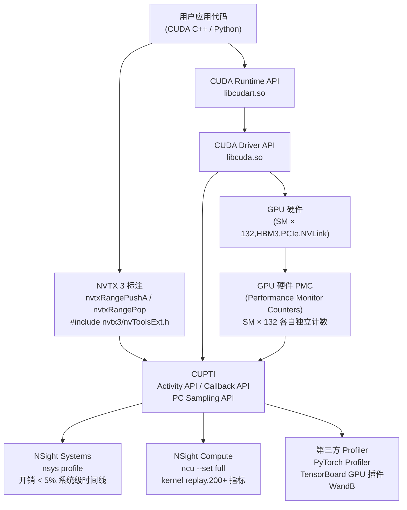
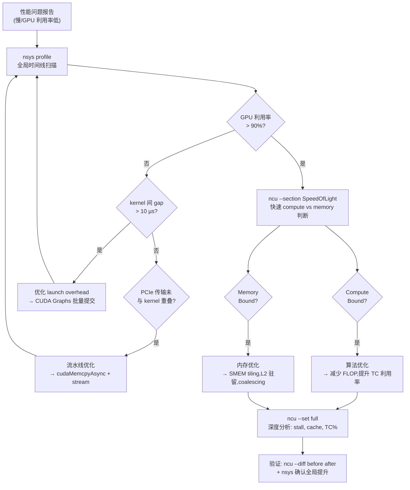

# 21 · Profiling 工具栈

> **NSight Systems 提供系统级时间线,NSight Compute 提供 kernel 级硬件指标,NVTX 让用户代码的语义层次在时间线上可见,三者协作构成完整的 CUDA 性能分析工作流。**

## 1. 是什么 / 为什么有它

CUDA 程序的性能瓶颈可能来自多个层次:宏观上可能是 kernel 之间的间隙(host-device 同步、PCIe 传输)造成 GPU 空闲;微观上可能是某个 kernel 内部的 HBM 带宽饱和、Tensor Core 利用率不足或 warp 分支散列。不同的瓶颈需要不同颗粒度的工具来定位。

**工具栈分层:**

- **NSight Systems**(nsys):系统级时间线分析工具,以极低开销(< 5%)捕获整个应用运行期间的 CPU 线程活动、CUDA API 调用、kernel 与内存传输时间轴、NVTX 标注以及 NVLink/PCIe 流量。适合回答"GPU 有多少时间在真正计算,多少时间在等待数据或 launch overhead"这类宏观问题。

- **NSight Compute**(ncu):kernel 级指标分析工具,通过 **replay 机制**(同一 kernel 多次执行以收集不同 hardware counter 组)采集 200+ 个精确的硬件指标。能精确告知每条 SASS 指令的执行次数、L1/L2 命中率、Tensor Core 利用率峰值百分比。适合回答"这个 kernel 的瓶颈是算力还是内存带宽"。

- **NVTX**(NVIDIA Tools Extension):用户代码中插入的轻量标注 API,允许将业务语义(如"Layer3 Forward"、"AllReduce")映射到时间线上。nsys 自动捕获 NVTX range/mark,ncu 也支持按 NVTX range 过滤 kernel 采集范围。

- **CUPTI**(CUDA Profiling Tools Interface):底层 callback/activity API,是所有上层 profiler(包括 NSight、PyTorch Profiler、TensorBoard 的 GPU 插件)的基础。CUPTI 通过 Activity API 以异步 buffer 收集事件,通过 Callback API 在 API 调用前后注入用户回调,通过 PC Sampling API 采样 warp 的程序计数器分布。直接使用 CUPTI 可以实现自定义的细粒度监控,但 API 复杂度高,通常只在构建专用监控系统或需要超低开销自定义 metric 时才直接调用。

正确的工作流是先用 nsys 发现宏观瓶颈(kernel 间 gap 过大?PCIe 传输与 kernel 未重叠?CPU 侧 launch overhead 过高?),再用 ncu 针对具体 kernel 做微观指标分析(算力瓶颈还是带宽瓶颈?哪条 pipeline 成为长板?),最后修改代码重新验证。跳过 nsys 直接上 ncu 往往浪费时间——因为 replay 开销会掩盖 kernel 间关系,且 ncu 无法显示全局时间线。

**工具栈在 LLM 训练场景中的实际价值:** 以 LLaMA-3 70B TP=4 PP=2 训练为例,一个典型的性能瓶颈排查过程:nsys 显示 GPU 利用率 78%——低于预期的 90%+。查看时间线发现,每步开始时存在约 800 µs 的 "AllReduce gap"(4 个 TP GPU 在等待 NCCL AllReduce 完成时均空闲)。进一步分析 NVTX range 可以精确定位到是梯度 AllReduce 阶段(而非权重 AllReduce)耗时过长,怀疑是某个 GPU 的梯度计算比其他 GPU 慢。切换到 ncu 对梯度计算 kernel 做深度分析,发现 L2 命中率异常低(38% vs 预期 65%),追溯到激活值的内存布局导致 L2 set conflict 严重。优化后 L2 命中率提升到 62%,AllReduce gap 降至 200 µs,整体 GPU 利用率提升到 88%,MFU 从 42% 提升到 51%。这个例子展示了 nsys→ncu 两阶段工作流的完整链路。

**工具版本与 GPU 架构的对应关系:** 每个新 GPU 架构发布时,NSight Compute 会随之发布新版本以支持新的 PMC 和 SASS 指令集。对于 Hopper SM90/SM90a,需要 NSight Compute 2023.1+(随 CUDA 12.1 Toolkit 发布)才能正确采集 wgmma、TMA 相关指标。旧版 ncu 对 Hopper 的某些 PMC 组会静默返回 0 或报 "counter not supported"。在测试环境维护一份"工具版本 vs GPU 架构兼容矩阵"是避免此类问题的最佳实践:ncu 2024.3 + CUDA 12.4 toolkit 是截止本文时支持 Hopper 完整特性集(包括 SM_90a 的 wgmma TC 指标)的最新稳定版本。

**NVTX 在 PyTorch 代码中的使用约定:** PyTorch 2.x 内部大量使用 NVTX 标注——每个 `torch.nn.Module.forward()` 调用会自动产生一个以模块名命名的 NVTX range(通过 `torch.autograd.profiler.emit_nvtx()` 上下文管理器激活)。当使用 nsys profile PyTorch 代码时,时间线上会自动出现 "Linear/GELU/LayerNorm" 等层级标注,无需手动插入 NVTX。对于更精细的自定义标注(如区分 prefill 与 decode 阶段),在 Python 侧使用 `torch.cuda.nvtx.range_push("Prefill")` / `range_pop()`,底层调用的正是 NVTX C API。

## 2. 硬件视角(微架构细节)

### 2.1 工具栈层级架构

Profile 工具栈的层次关系与数据流向:



### 2.2 NSight Compute Kernel Replay 机制详解

**为什么需要 Replay:** Hopper SM90 每个 SM 有有限数量的 Performance Monitor Counter(PMC)寄存器组——Hopper 上约有 8-16 个硬件 counter 组,每组可同时采集 4-8 个 PMC。完整的指标集(约 200 个)分布在约 10-15 个 counter 组中。因此,要收集完整的 200+ 指标,ncu 必须将同一 kernel 执行 10-15 次(每次采集不同的 counter 组),再将结果聚合。

**Replay 对 cache 状态的影响:** 这是 ncu Replay 最重要的语义陷阱。第一次 replay 时,L1/L2 缓存是"冷"的;后续 replay 时,缓存已被第一次 replay 预热。这意味着:ncu 报告的 L1 命中率可能高于真实生产环境中的命中率(生产中每次 kernel 调用前缓存状态不同)。同理,若 kernel 有写回行为,replay 之间可能存在数据依赖,导致结果不确定。ncu 通过以下方式缓解此问题:
- `--cache-control all`:在每次 replay 前刷新 L1/L2 缓存(最接近真实首次执行)
- `--cache-control none`:不刷新缓存(多次执行场景的代表性更强)
- 默认行为是部分刷新(`--cache-control l1`),只刷新 L1 而不刷新 L2

**Replay 对 throughput 指标的影响:** ncu 报告的 kernel 执行时间(elapsed cycles)通常比真实执行时间长 2-5×(每次 replay 都有 launch overhead),且 replay 期间 CPU-GPU 是同步的(GPU 执行完一次 replay 才开始下一次)。因此,ncu 的 kernel 时间不能用于测量实际吞吐,必须使用 nsys 或 CUDA event(`cudaEventElapsedTime`)来测量真实延迟。

**`--target-processes all` 与多 GPU profiling:** 默认情况下,ncu 只 profile 直接启动的进程。对于 PyTorch DDP(使用 `torchrun` 启动多个进程)或 NCCL 分布式训练,需要加 `--target-processes all` 来捕获所有子进程的 kernel。注意:多 GPU replay 时,所有 GPU 的 kernel 都会被 replay 相同次数,总执行时间倍增;且 NCCL collective 在 replay 期间会因为 barrier 语义受到干扰,某些 collective 在 replay 后可能死锁(例如 ring allreduce 的 rank 顺序在 replay 时因时序变化而不一致)。生产建议:对 NCCL collective 单独 profile,不与计算 kernel 在同一个 ncu session 中分析。

**ncu `--replay-mode application` vs `--replay-mode kernel`:** ncu 支持两种 replay 模式:
- `--replay-mode kernel`(默认):对每次 kernel 启动都独立做 replay,只重放该 kernel 本身。适合 kernel 之间无强依赖的场景(如批推理中独立的 GEMM)。
- `--replay-mode application`:重放整个应用程序(从开头到结尾),以确保 kernel 执行时的 context(显存内容、stream 状态)完全一致。适合 kernel 依赖前序 kernel 结果的场景(如自回归解码中每步依赖前步 KV cache)。`application` 模式开销更高但结果更准确,是分析自回归 LLM decode kernel 的推荐选项。在使用 `application` 模式时,应通过 `--kernel-id` 限定分析特定 kernel 实例(例如 `--kernel-id cudaLaunchKernel:3` 只分析第 3 次 kernel launch),而非用 `--kernel-name` 通配所有同名 kernel——后者会让每次重放的分析时间倍增,且对自回归 decode 场景意义有限(每步的 KV cache 状态不同)。
- ncu `--replay-mode user`:用户通过 NVPW(NVIDIA Performance Works)API 手动控制 replay 范围,用于极度定制化的分析场景(通常只在 NVIDIA 内部使用)。

### 2.3 CUPTI Activity API Ring Buffer 与 Flush

CUPTI 的 Activity API 以异步 ring buffer 的方式工作:GPU 活动(kernel launch、memory copy、NVTX range 等)被写入一个固定大小的 buffer queue,CPU 侧的 profiler 线程轮询 buffer 并将数据写入文件。

**关键参数:**
- `cuptiActivitySetAttribute(CUPTI_ACTIVITY_ATTR_DEVICE_BUFFER_SIZE, size_ptr)`:设置每个 GPU 的 buffer 大小(默认 8 MB)。若 kernel 密度极高(如每秒数万次 launch),buffer 可能溢出,导致部分事件丢失。
- `cuptiActivitySetAttribute(CUPTI_ACTIVITY_ATTR_DEVICE_BUFFER_POOL_LIMIT, count_ptr)`:设置 buffer 池的最大 buffer 数量(默认 250)。
- `cuptiActivityFlushAll(0)`:强制将所有未处理的 buffer flush 到用户回调,通常在应用结束时调用。

**Buffer 溢出的症状:** nsys 报告中出现 "CUPTI_ERROR_MAX_LIMIT_REACHED" 警告,时间线中部分 kernel 消失或时间戳不连续。修复方法:增大 buffer 大小或增加 buffer 数量,或限制 profile 范围(使用 `cudaProfilerStart/Stop`)。

**CUPTI 与驱动版本的兼容性注意:** CUPTI 是作为 CUDA Toolkit 的一部分分发的,其版本必须与 GPU 驱动版本兼容。若 Toolkit 版本(如 12.2)与驱动版本(如 520.x,只支持 CUDA 11.8)不匹配,CUPTI 的某些 Performance Counter 可能无法正确工作——会静默返回 0 而非报错。诊断方法:运行 CUPTI 自带的 `extensions` 示例并检查计数器是否非零。升级驱动至与 Toolkit 版本匹配是最可靠的解决方案。

**CUPTI Activity API 实战 —— 最小自定义 profiler:**

```cpp
#include <cupti.h>
#include <cuda.h>

// 用户回调:buffer 满时或 flush 时触发
void CUPTIAPI bufferCompleted(CUcontext ctx, uint32_t streamId,
                               uint8_t *buffer, size_t size, size_t validSize) {
    CUpti_Activity *record = nullptr;
    while (cuptiActivityGetNextRecord(buffer, validSize, &record) == CUPTI_SUCCESS) {
        if (record->kind == CUPTI_ACTIVITY_KIND_KERNEL) {
            auto *kernel = (CUpti_ActivityKernel8 *)record;
            printf("Kernel: %s, duration: %llu ns\n",
                   kernel->name, (unsigned long long)(kernel->end - kernel->start));
        }
    }
    free(buffer);
}

void CUPTIAPI bufferRequested(uint8_t **buffer, size_t *size, size_t *maxNumRecords) {
    *buffer = (uint8_t*)malloc(1024 * 1024);  // 1 MB buffer
    *size = 1024 * 1024;
    *maxNumRecords = 0;  // 0 = 不限制
}

// 初始化:
cuptiActivityRegisterCallbacks(bufferRequested, bufferCompleted);
cuptiActivityEnable(CUPTI_ACTIVITY_KIND_KERNEL);
cuptiActivityEnable(CUPTI_ACTIVITY_KIND_MEMCPY);
// ... 运行 CUDA 代码 ...
cuptiActivityFlushAll(0);
```

## 3. CUDA 编程接口

**NVTX 3 API(推荐版本):**

```cpp
// 头文件:nvtx3 C++ API(CUDA 11.0+ 随 CUDA Toolkit 附带)
#include <nvtx3/nvToolsExt.h>

// 基础 Range 标注(push/pop 嵌套,自动配对)
nvtxRangePushA("MyKernelRange");    // ASCII 字符串标注
my_kernel<<<grid, block>>>(args);
nvtxRangePop();                     // 结束最近一个 push

// 带颜色和分类的高级标注
nvtxEventAttributes_t attr = {};
attr.version       = NVTX_VERSION;
attr.size          = NVTX_EVENT_ATTRIB_STRUCT_SIZE;
attr.colorType     = NVTX_COLOR_ARGB;
attr.color         = 0xFF00FF00;        // 绿色
attr.messageType   = NVTX_MESSAGE_TYPE_ASCII;
attr.message.ascii = "GreenForward";
nvtxRangePushEx(&attr);
my_kernel<<<...>>>();
nvtxRangePop();

// 点事件(mark,无持续时间)
nvtxMarkA("Checkpoint_A");
```

**NVTX 3 RAII 包装器(推荐生产实践):**

```cpp
// RAII 封装:构造时 push,析构时 pop,异常安全
struct NvtxRange {
    explicit NvtxRange(const char *name) { nvtxRangePushA(name); }
    ~NvtxRange()                         { nvtxRangePop(); }
    // 禁止拷贝,防止 double-pop
    NvtxRange(const NvtxRange&) = delete;
    NvtxRange& operator=(const NvtxRange&) = delete;
};

// 用法:利用 C++ 作用域自动管理 range 生命周期
void forward_pass(Tensor &x) {
    NvtxRange r("ForwardPass");        // 进入函数时 push
    {
        NvtxRange r_attn("Attention"); // 内嵌 range
        attention_kernel<<<...>>>();
    }                                   // 离开 Attention 作用域 → pop
    ffn_kernel<<<...>>>();
}                                       // 离开 ForwardPass 作用域 → pop
```

**PyTorch Profiler 与 NVTX 的关系:**

```python
import torch
import torch.profiler

# torch.profiler 底层通过 CUPTI Activity API 捕获 GPU 活动
# with_stack=True 开启 Python 调用栈采样(额外 30-100% overhead)
with torch.profiler.profile(
    activities=[
        torch.profiler.ProfilerActivity.CPU,
        torch.profiler.ProfilerActivity.CUDA,
    ],
    with_stack=True,  # 开启后 overhead 可达 30-100%,不适合长时间 profile
    record_shapes=True,
    profile_memory=True,
) as prof:
    for step in range(5):
        with torch.profiler.record_function("ForwardBackward"):
            loss = model(input).sum()
            loss.backward()

print(prof.key_averages().table(sort_by="cuda_time_total", row_limit=10))
prof.export_chrome_trace("trace.json")  # 导出 Chrome 格式,可用 Perfetto 查看
```

## 4. 关键性能指标

**NSight Systems 关注指标:**

| 指标 | 含义 | 理想值 |
|---|---|---|
| GPU 利用率(SM active %) | CUDA kernel 执行期间 SM 处于活跃的百分比 | > 90% |
| H2D / D2H 与 kernel 重叠比例 | 传输与 kernel 同时运行的时间占比 | > 80%(若传输量大) |
| kernel 间 gap | 两次 kernel launch 之间 GPU 空闲时间 | < 10 µs |
| NVTX range 占比 | 业务阶段时间分布 | 根据业务需求判断 |

**NSight Compute 核心指标(Hopper SM90):**

| metric 名称 | 含义 |
|---|---|
| `smsp__inst_executed.sum` | 每个 sub-partition 执行的指令总数 |
| `sm__pipe_tensor_op_hmma_cycles_active.avg.pct_of_peak_sustained_active` | Tensor Core(FP16)利用率百分比 |
| `l1tex__t_sector_hit_rate.pct` | L1 TEX cache sector 命中率 |
| `lts__t_sector_hit_rate.pct` | L2 (LTS) cache sector 命中率 |
| `dram__bytes_read.sum` | HBM3 读取字节总量 |
| `smsp__sass_average_data_bytes_per_wavefront_mem_global` | 全局内存每 wavefront 平均字节(coalescing 效率) |
| `sm__warps_active.avg.pct_of_peak_sustained_active` | warp 占用率(occupancy)百分比 |

**NVTX 开销量化:** 每次 `nvtxRangePushA` / `nvtxRangePop` 调用约 50-100 ns。对于每秒调用数千次的热路径(如每个 token 一次 attention),累积开销可达数毫秒。生产环境应通过预处理宏将 NVTX 调用完全消除:

```cpp
#ifdef ENABLE_PROFILING
  #include <nvtx3/nvToolsExt.h>
  #define NVTX_PUSH(name) nvtxRangePushA(name)
  #define NVTX_POP()      nvtxRangePop()
#else
  #define NVTX_PUSH(name) do {} while(0)
  #define NVTX_POP()      do {} while(0)
#endif
```

**PyTorch Profiler `with_stack` 的 overhead 量化:** `with_stack=True` 时,Python 解释器需要在每次 CUDA 操作前后采集完整的 Python 调用栈(通过 `PyFrame_GetBack` 遍历调用栈)。对于 GPT-2 规模的模型(每步约 500 次 CUDA 操作):
- `with_stack=False`:profiler overhead ≈ 8-15%(CUPTI Activity API 成本)
- `with_stack=True`:profiler overhead ≈ 45-120%(Python 栈采集成本)

当 `with_stack=True` 时,单步训练时间从原始的 50 ms 可能增至 100-110 ms。这对于寻找绝对性能瓶颈没有影响(相对比例不变),但会使所有 CUDA kernel 的绝对时间看起来比实际慢,误导对绝对延迟的判断。推荐在正式性能分析时关闭 `with_stack`,只在需要追踪 Python 级别的操作来源时临时开启。

**ncu `--section MemoryWorkloadAnalysis` 的深度解读:** NSight Compute 的 Memory Workload Analysis section 报告了 L1 TEX、L2、HBM3 三级存储器的读写字节数和吞吐:
- `l1tex__t_bytes_pipe_lsu_mem_global_op_ld.sum`:L1 层从全局内存加载的字节数
- `lts__t_bytes.sum`:L2 层处理的总字节数(比 dram 字节数大代表 L2 命中)
- `dram__bytes.sum`:实际 HBM3 读写字节数(越小表示 cache 命中率越高)
- 若 `lts__t_bytes / dram__bytes` 比值高(> 3),说明 L2 命中率良好,HBM3 不是瓶颈
- 若 `l1tex__t_bytes / lts__t_bytes` 比值高(> 5),说明 L1 命中率良好

Hopper H100 HBM3 理论峰值带宽约 3.35 TB/s。若 `dram__bytes.sum / elapsed_cycles` × GPU 频率(1.8 GHz) 接近 3.35 TB/s,则 HBM3 已经饱和,继续优化应着重减少数据量(量化、稀疏化、更好的缓存重用),而非提升算法并行度。若带宽利用率低于 50%(< 1.7 TB/s)且 L2 命中率也低,问题通常是内存访问不连续(coalescing 差),应重新排列数据布局。

**NSight Compute 的 Roofline 模型集成:** ncu 2024.x 内置了 Roofline 模型视图:在 "GPU Speed of Light Throughput" section 下方,会显示 kernel 在 Roofline 图上的位置——横轴为算术强度(FLOP/B),纵轴为 FLOP/s。若 kernel 落在屋顶的左侧(内存带宽限制),优化方向是提升数据重用;若落在右侧(算力限制),优化方向是提升并行度或使用 Tensor Core。对于 Transformer 的自注意力 kernel,算术强度约为 1-4 FLOP/B(小 batch 时),落在内存带宽限制区域;大 batch 时算术强度升至 10-50 FLOP/B,进入算力限制区域——这也是 batch size 对 LLM 推理效率影响如此显著的根本原因。

**nsys + ncu 协同工作流:** 两个工具之间存在自然的分析层次划分与协作点:

| 分析阶段 | 工具 | 目的 |
|---|---|---|
| 全局扫描 | nsys | 找出 GPU 利用率低的时间段和最慢的 kernel |
| 宏观优化 | nsys + NVTX | 确认优化后全局 GPU 利用率提升 |
| kernel 瓶颈定位 | ncu `--section SpeedOfLight` | 快速判断 compute vs memory bound |
| kernel 深度分析 | ncu `--set full` | 分析 stall 来源、cache 命中率、TC 利用率 |
| SASS 级优化 | ncu + cuobjdump | 验证关键指令路径,定位 pipeline bubble |



## 5. 代码示例

下面展示一个完整的 profile 工作流:NVTX 标注 + nsys 采集 + ncu 分析。

```cpp
// profiled_app.cu
#include <cuda_runtime.h>
#include <nvtx3/nvToolsExt.h>
#include <cstdio>

__global__ void matmul_kernel(float *C, const float *A, const float *B, int N) {
    int row = blockIdx.y * blockDim.y + threadIdx.y;
    int col = blockIdx.x * blockDim.x + threadIdx.x;
    if (row < N && col < N) {
        float sum = 0.f;
        for (int k = 0; k < N; ++k) sum += A[row * N + k] * B[k * N + col];
        C[row * N + col] = sum;
    }
}

int main() {
    const int N = 1024;
    const size_t SZ = N * N * sizeof(float);
    float *dA, *dB, *dC;
    cudaMalloc(&dA, SZ); cudaMalloc(&dB, SZ); cudaMalloc(&dC, SZ);

    // NVTX 标注:将"数据准备"阶段标注出来
    nvtxRangePushA("DataPrep");
    // ... 初始化 dA, dB ...
    nvtxRangePop();

    // 控制 profile 范围:只 profile 关键计算阶段
    cudaProfilerStart();

    for (int i = 0; i < 3; ++i) {
        NvtxRange r("MatMulIter");               // RAII 自动 pop
        dim3 block(16, 16), grid(N/16, N/16);
        matmul_kernel<<<grid, block>>>(dC, dA, dB, N);
    }
    cudaDeviceSynchronize();
    cudaProfilerStop();

    cudaFree(dA); cudaFree(dB); cudaFree(dC);
    return 0;
}
```

**采集命令:**

```bash
# NSight Systems:系统级时间线
nsys profile -t cuda,nvtx --capture-range=cudaProfilerApi \
    --output matmul_trace ./profiled_app

# NSight Compute:matmul_kernel 的完整指标
ncu --kernel-name matmul_kernel --set full \
    --output matmul_ncu ./profiled_app

# 只采集 Speed of Light 摘要(更快)
ncu --kernel-name matmul_kernel --section SpeedOfLight ./profiled_app
```

**命令行汇总输出:**

```bash
# nsys 汇总 kernel 执行时间
nsys stats matmul_trace.nsys-rep --report cuda_kern_exec_trace

# ncu 导入已有报告打印摘要
ncu --import matmul_ncu.ncu-rep --print-summary per-kernel
```

## 6. 实测手段

**推荐 profile 工作流(profile → 定位 → 验证):**

```bash
# Step 1: nsys 快速全局扫描
nsys profile -t cuda,nvtx -o run1 ./app
# 打开 GUI 或 nsys stats run1.nsys-rep 确认:
#   - GPU 利用率是否 > 90%
#   - 有无大的 kernel 间 gap
#   - NVTX range 时间分布是否符合预期

# Step 2: 若发现某 kernel 是瓶颈,用 ncu 深入分析
ncu --kernel-name suspected_kernel --section SpeedOfLight \
    --section MemoryWorkloadAnalysis ./app
# Speed of Light 页面直接给出计算利用率与内存带宽利用率

# Step 3: 根据 ncu 结果修改代码后重新 profile 验证
ncu --kernel-name suspected_kernel --set full -o after_opt ./app
ncu --diff before_opt.ncu-rep after_opt.ncu-rep  # 对比前后差异
```

**关键 ncu 指标的解读:**

```bash
# 查看所有可用 section 列表
ncu --list-sections

# 仅采集 Tensor Core 相关指标
ncu --metrics sm__pipe_tensor_op_hmma_cycles_active.avg.pct_of_peak_sustained_active \
    ./app

# 查看 SASS-level source attribution(需要 -lineinfo 编译)
ncu --source-folder . --set full ./app
```

**NSight Systems CLI 快速统计:**

```bash
nsys stats run1.nsys-rep --report cuda_api_sum     # API 调用时间排行
nsys stats run1.nsys-rep --report cuda_kern_exec_sum  # kernel 执行时间排行
nsys stats run1.nsys-rep --report nvtx_sum         # NVTX range 时间分布
```

## 7. 常见反模式

1. **在生产环境保留 ncu replay** — NSight Compute 的 replay 机制会将同一 kernel 运行 10-20 次,如果在生产推理服务中误开 ncu 采集,会使 kernel 执行时间增加 10-20 倍,吞吐量骤降,可能触发超时报警。ncu 仅应在专用的分析环境中使用。生产环境的实时监控应使用 DCGM(Data Center GPU Manager)或 NVML 的轮询接口,不使用 CUPTI Performance Counter。

2. **用 nsys 分析 kernel 内部指标** — nsys 只记录 kernel 的开始时间、结束时间和内存传输量,无法告知 Tensor Core 利用率或 L2 命中率。若需要 kernel 内部的硬件指标,必须使用 ncu。两个工具各司其职,不可互换。

3. **忘记 `cudaProfilerStart/Stop` 控制 profile 范围** — 对全程 profile 一个长时间训练任务,产生的 `.nsys-rep` 文件可能达到数 GB,GUI 加载时间超过分析时间。正确做法是在关键阶段前调用 `cudaProfilerStart()`,结束后调用 `cudaProfilerStop()`,配合 `--capture-range=cudaProfilerApi` 参数限制 nsys 的采集范围。对于训练任务,通常只需 profile 3-5 个完整 step 即可。

4. **NVTX range 未正确 pop** — `nvtxRangePushA` 和 `nvtxRangePop` 必须严格配对。若 push 多于 pop(例如异常路径跳过了 pop),nsys 时间线会显示错误的 range 嵌套关系。使用 §3 中的 RAII `NvtxRange` 包装器可以彻底消除此类问题。

5. **误以为 ncu 的 "% of peak" 是绝对利用率** — NSight Compute 的 `sm__pipe_tensor_op_hmma_cycles_active.avg.pct_of_peak_sustained_active` 是相对于"当该 pipe 活跃时的峰值"的百分比,而不是相对于绝对峰值算力。一个 Tensor Core 利用率 80% 的数字并不意味着达到了 H100 理论 FLOPS 的 80%——还需结合 warp 占用率和其他 stall metric 综合判断。

6. **ncu replay 修改 cache 状态导致指标失真** — 如 §2.2 所述,replay 会预热 cache,使后续 replay 的 L1/L2 命中率高于真实值。若你在分析一个 cache-sensitive kernel 并观察到异常高的 L1 命中率,应使用 `--cache-control all` 在每次 replay 前刷新缓存,以获得接近"冷启动"的真实命中率。典型案例:一个 attention kernel 在 ncu 中显示 L2 命中率 85%,但实际推理中只有 40%——因为 ncu 的多次 replay 让 KV cache 数据驻留在 L2 中,而实际推理每步 KV cache 都是新的。

7. **PyTorch Profiler 的 `with_stack=True` 留在性能测试中** — 如 §4 所述,`with_stack=True` 会引入 30-100% 的额外 overhead。若在对比两个模型版本的性能时忘记关闭 `with_stack`,会使两个版本的绝对时间都偏高,但相对差异可能被 overhead 噪声淹没——尤其是在比较 1-2% 的微小性能差异时,30% 的 overhead noise 完全掩盖了真实差异。

### 7.8 CUPTI Activity API 的 ring buffer 调优

CUPTI 的 Activity API ring buffer 在高密度 kernel 场景(如 LLM 推理服务,每秒数万次 kernel launch)中可能成为瓶颈。以下是调优建议:

**增大 buffer 大小:** 将设备 buffer 从默认 8 MB 增大到 32-64 MB(`CUPTI_ACTIVITY_ATTR_DEVICE_BUFFER_SIZE`)。这减少了 buffer 满而触发 CPU flush 的频率,降低了 flush 对 GPU 执行时间线的干扰(每次 flush 约 0.5-2 ms CPU 开销)。

**设置 buffer pool 上限:** 若 CPU 侧的 profiler 线程处理速度跟不上 GPU 产生事件的速度,buffer pool 可能耗尽并开始丢弃事件。增大 `CUPTI_ACTIVITY_ATTR_DEVICE_BUFFER_POOL_LIMIT` 到 500-1000 可以提供更多缓冲空间。

**异步 flush:** 在应用主循环中定期调用 `cuptiActivityFlushAll(CUPTI_ACTIVITY_FLAG_FLUSH_FORCED)`,而不是等到应用结束再 flush。对于长时间运行的推理服务,若不定期 flush,积累的 buffer 数量可能无限增长,最终因内存压力导致服务 OOM。

**CUPTI PC Sampling API 的微架构诊断用途:** CUPTI 的 PC Sampling API 不同于 Activity/Callback API——它以固定的采样率对每个 SM 上的 warp 进行程序计数器(PC)采样。每个采样点记录当前 PC 值和对应的 stall 原因(如 Texture, Memory Dependency, Synchronization, Pipe Busy 等)。聚合大量采样后,可以得到每个 SASS 指令的 stall 分布热图——哪条指令最频繁地成为 warp 停滞点。这比 NSight Compute 的精确 PMC 计数更适合长时间运行的 kernel(ncu replay 无法用于超长时间 kernel),但精度低于 PMC(抽样 vs 全量计数)。PyTorch 2.x 的 `torch.profiler.profile(with_flops=True)` 底层使用了 PC Sampling 来估算实际 FLOP 数(而不是理论 FLOP)。

**实战案例:用 CUPTI 构建低开销持续监控系统:** 在生产推理集群中,DCGM 提供的 GPU 利用率指标粒度太粗(10 秒一个数据点)。通过 CUPTI Activity API 可以构建每步(per-inference-request)粒度的 profiler:注册 kernel launch / memory copy activity,在 bufferCompleted 回调中计算每请求的 GPU 时间与 CPU 等待时间占比,写入 Prometheus 指标。实测中,这个自定义 profiler 的 overhead 约为 0.5-1.5%(远低于 nsys 的 5%),可以在生产推理服务上长期运行,提供 p99 kernel 延迟、内存传输带宽利用率等关键指标的实时监控,无需频繁在专用分析环境中重现问题。

## 8. 延伸阅读

- **NSight Systems 用户指南** — [https://docs.nvidia.com/nsight-systems/](https://docs.nvidia.com/nsight-systems/):命令行参数、报告格式、自动分析规则。
- **NSight Compute 用户指南** — [https://docs.nvidia.com/nsight-compute/](https://docs.nvidia.com/nsight-compute/):指标完整列表、replay 机制、source correlation 使用方法,以及 `--cache-control` 选项的详细说明。
- **NVTX 3 文档与源码** — [https://github.com/NVIDIA/NVTX](https://github.com/NVIDIA/NVTX):NVTX 3 C++ API 的完整定义、高级用法(Domain、Category、Payload)。
- **CUPTI Reference** — [https://docs.nvidia.com/cuda/cupti/](https://docs.nvidia.com/cuda/cupti/):Activity API、Callback API 和 Performance Counter API 的完整参数说明,包含自定义 profiler 的示例代码。
- **CUDA C++ Programming Guide §10** — Performance Guidelines:官方总结的 kernel 性能调优原则,与 ncu 指标对应。
- **NSight Developer Blog** — [https://developer.nvidia.com/blog/tag/nsight/](https://developer.nvidia.com/blog/tag/nsight/):实战 profile 案例,包括 Transformer 训练、CV 推理等场景的分析流程。
- **PyTorch Profiler 文档** — [https://pytorch.org/tutorials/recipes/recipes/profiler_recipe.html](https://pytorch.org/tutorials/recipes/recipes/profiler_recipe.html):PyTorch Profiler API 完整文档,包含 `with_stack` 和 `record_shapes` 的性能影响说明。
- **DCGM(Data Center GPU Manager)** — [https://developer.nvidia.com/dcgm](https://developer.nvidia.com/dcgm):生产环境 GPU 监控的推荐工具,提供低开销的 SM 利用率、显存用量、功耗等指标采集,不干扰 GPU 执行。
- **Perfetto 时间线查看器** — [https://ui.perfetto.dev](https://ui.perfetto.dev):PyTorch Profiler 导出的 Chrome trace 格式(`prof.export_chrome_trace("trace.json")`)可以在 Perfetto 中打开,支持比 Chrome DevTools 更好的大文件处理(数百 MB 的 trace 文件)和 GPU 时间线的缩放查看。与 nsys GUI 相比,Perfetto 更适合与 Python 层 NVTX range 的联合分析。
- **nvbench** — [https://github.com/NVIDIA/nvbench](https://github.com/NVIDIA/nvbench):NVIDIA 官方的 CUDA microbenchmark 框架,支持自动扫描参数空间(batch size、block size 等)并输出 bandwidth/throughput 指标,配合 ncu 可以快速找到最优 launch 配置。FlashAttention、CUTLASS 等项目的内部基准测试都使用 nvbench。
