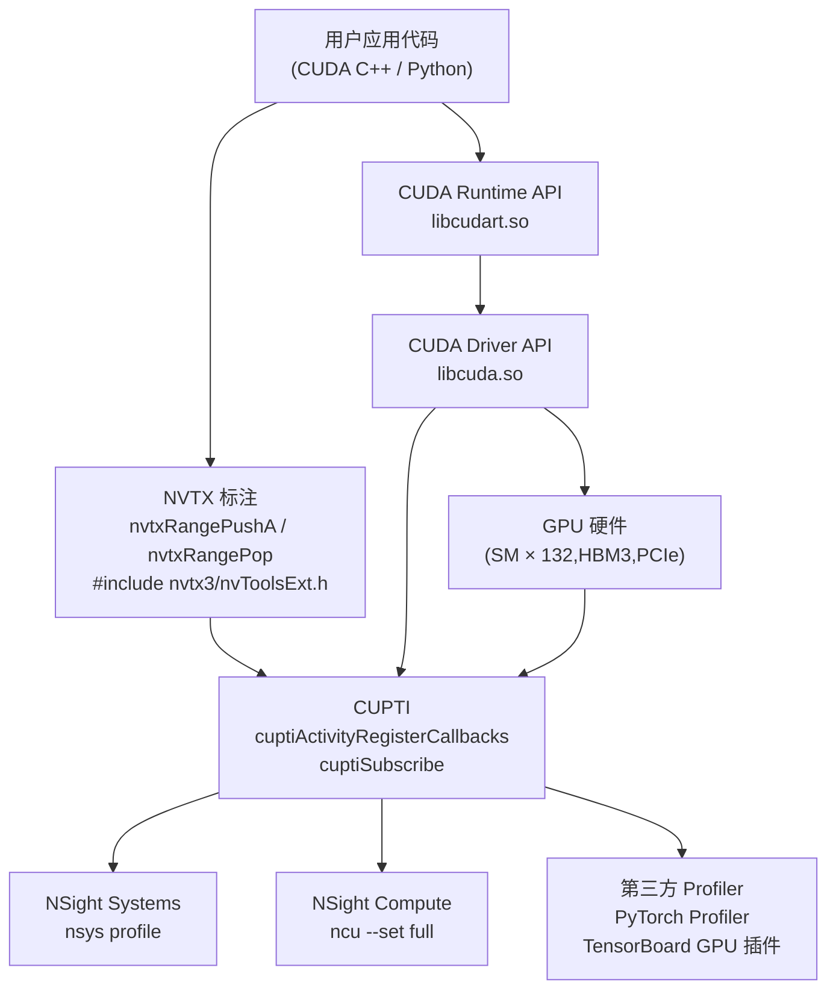

# 21 · Profiling 工具栈

> **NSight Systems 提供系统级时间线,NSight Compute 提供 kernel 级硬件指标,NVTX 让用户代码的语义层次在时间线上可见,三者协作构成完整的 CUDA 性能分析工作流。**

## 1. 是什么 / 为什么有它

CUDA 程序的性能瓶颈可能来自多个层次:宏观上可能是 kernel 之间的间隙(host-device 同步、PCIe 传输)造成 GPU 空闲;微观上可能是某个 kernel 内部的 HBM 带宽饱和、Tensor Core 利用率不足或 warp 分支散列。不同的瓶颈需要不同颗粒度的工具来定位。

**工具栈分层:**

- **NSight Systems**(nsys):系统级时间线分析工具,以极低开销(< 5%)捕获整个应用运行期间的 CPU 线程活动、CUDA API 调用、kernel 与内存传输时间轴、NVTX 标注以及 NVLink/PCIe 流量。适合回答"GPU 有多少时间在真正计算,多少时间在等待数据或 launch overhead"这类宏观问题。

- **NSight Compute**(ncu):kernel 级指标分析工具,通过 **replay 机制**(同一 kernel 多次执行以收集不同 hardware counter 组)采集 200+ 个精确的硬件指标。能精确告知每条 SASS 指令的执行次数、L1/L2 命中率、Tensor Core 利用率峰值百分比。适合回答"这个 kernel 的瓶颈是算力还是内存带宽"。

- **NVTX**(NVIDIA Tools Extension):用户代码中插入的轻量标注 API,允许将业务语义(如"Layer3 Forward"、"AllReduce")映射到时间线上。nsys 自动捕获 NVTX range/mark,ncu 也支持按 NVTX range 过滤 kernel 采集范围。

- **CUPTI**(CUDA Profiling Tools Interface):底层 callback/activity API,是所有上层 profiler(包括 NSight、PyTorch Profiler、TensorBoard 的 GPU 插件)的基础。CUPTI 通过 Activity API 以异步 buffer 收集事件,通过 Callback API 在 API 调用前后注入用户回调,通过 PC Sampling API 采样 warp 的程序计数器分布。直接使用 CUPTI 可以实现自定义的细粒度监控,但 API 复杂度高,通常只在构建专用监控系统或需要超低开销自定义 metric 时才直接调用。

正确的工作流是先用 nsys 发现宏观瓶颈(kernel 间 gap 过大?PCIe 传输与 kernel 未重叠?CPU 侧 launch overhead 过高?),再用 ncu 针对具体 kernel 做微观指标分析(算力瓶颈还是带宽瓶颈?哪条 pipeline 成为长板?),最后修改代码重新验证。跳过 nsys 直接上 ncu 往往浪费时间——因为 replay 开销会掩盖 kernel 间关系,且 ncu 无法显示全局时间线。

## 2. 硬件视角(微架构细节)

Profile 工具栈的层次关系与数据流向:



从硬件层面看,CUPTI 通过两种机制获取数据:

1. **Activity API**:以异步 buffer 的方式收集 kernel launch、memory copy、NVTX range 等事件的时间戳与元数据,开销极低(< 1%),用于 NSight Systems 的时间线记录。
2. **Performance Counter API**:通过 GPU 内置的 performance monitor counter(PMC)采集硬件指标。由于 Hopper 上单次 kernel 执行只能同时采集有限数量的 PMC(由硬件 counter 组的数量决定),NSight Compute 需要将同一 kernel replay 多次,每次采集一组 counter,再合并结果。这是 ncu 开销远高于 nsys 的根本原因——replay 使 kernel 实际执行次数变为原来的 10-20 倍。

Hopper SM90 的 PMC 分组信息:NSight Compute 对 sm_90 的完整指标集分为约 10-15 个 counter 组,完整采集(`--set full`)需要 replay 对应次数。可以使用 `--set roofline` 或 `--section SpeedOfLight` 只采集关键子集以加速分析。

NVTX 在 GPU 端也有对应支持:通过 `cudaProfilerStart` / `cudaProfilerStop` 可以控制 CUPTI 的采集范围。NVTX range 不仅在 CPU 时间线上可见,nsys 还会将其与 GPU 端的 kernel 执行进行时间对齐,从而方便识别每个业务阶段对应的 GPU 活动。当 PyTorch 代码调用 `torch.profiler.record_function("forward")` 时,底层正是通过 NVTX domain 将这个标注传递给 CUPTI,最终显示在 NSight Systems 的时间线上。

## 3. CUDA 编程接口

**NVTX 3 API(推荐版本):**

```cpp
// 头文件:nvtx3 C++ API(CUDA 11.0+ 随 CUDA Toolkit 附带)
#include <nvtx3/nvToolsExt.h>

// 基础 Range 标注(push/pop 嵌套,自动配对)
nvtxRangePushA("MyKernelRange");    // ASCII 字符串标注
my_kernel<<<grid, block>>>(args);
nvtxRangePop();                     // 结束最近一个 push

// Unicode 版本
nvtxRangePushW(L"MatMulForward");   // Wide char(Windows)
nvtxRangePop();

// 带颜色和分类的高级标注
nvtxEventAttributes_t attr = {};
attr.version       = NVTX_VERSION;
attr.size          = NVTX_EVENT_ATTRIB_STRUCT_SIZE;
attr.colorType     = NVTX_COLOR_ARGB;
attr.color         = 0xFF00FF00;        // 绿色
attr.messageType   = NVTX_MESSAGE_TYPE_ASCII;
attr.message.ascii = "GreenForward";
nvtxRangePushEx(&attr);
my_kernel<<<...>>>();
nvtxRangePop();

// 点事件(mark,无持续时间)
nvtxMarkA("Checkpoint_A");
```

**NVTX 域(Domain):将 range 隔离到命名空间**

```cpp
// 创建命名域,避免与其他库的 NVTX range 混淆
nvtxDomainHandle_t domain = nvtxDomainCreateA("MyApp");
nvtxDomainRangePushEx(domain, &attr);
// ... kernel ...
nvtxDomainRangePop(domain);
nvtxDomainDestroy(domain);
```

**CUPTI 基本用法(了解即可,通常不直接使用):**

```cpp
#include <cupti.h>
// 订阅 Runtime API 回调
CUpti_SubscriberHandle sub;
cuptiSubscribe(&sub, (CUpti_CallbackFunc)myCallback, nullptr);
cuptiEnableCallback(1, sub, CUPTI_CB_DOMAIN_RUNTIME_API,
                   CUPTI_RUNTIME_TRACE_CBID_cudaLaunchKernel_v7000);
// ... 运行应用 ...
cuptiUnsubscribe(sub);
```

## 4. 关键性能指标

**NSight Systems 关注指标:**

| 指标 | 含义 | 理想值 |
|---|---|---|
| GPU 利用率(SM active %) | CUDA kernel 执行期间 SM 处于活跃的百分比 | > 90% |
| H2D / D2H 与 kernel 重叠比例 | 传输与 kernel 同时运行的时间占比 | > 80%(若传输量大) |
| kernel 间 gap | 两次 kernel launch 之间 GPU 空闲时间 | < 10 µs |
| NVTX range 占比 | 业务阶段时间分布 | 根据业务需求判断 |

**NSight Compute 核心指标(Hopper SM90):**

| metric 名称 | 含义 |
|---|---|
| `smsp__inst_executed.sum` | 每个 sub-partition 执行的指令总数 |
| `sm__pipe_tensor_op_hmma_cycles_active.avg.pct_of_peak_sustained_active` | Tensor Core(FP16)利用率百分比 |
| `l1tex__t_sector_hit_rate.pct` | L1 TEX cache sector 命中率 |
| `lts__t_sector_hit_rate.pct` | L2 (LTS) cache sector 命中率 |
| `dram__bytes_read.sum` | HBM3 读取字节总量 |
| `smsp__sass_average_data_bytes_per_wavefront_mem_global` | 全局内存每 wavefront 平均字节(coalescing 效率) |
| `sm__warps_active.avg.pct_of_peak_sustained_active` | warp 占用率(occupancy)百分比 |

NVTX 开销:每次 `nvtxRangePushA` / `nvtxRangePop` 调用约 50-100 ns。对于每秒调用数千次的热路径(如每个 token 一次 attention),累积开销可达数毫秒。生产环境应通过预处理宏将 NVTX 调用完全消除:

```cpp
#ifdef ENABLE_PROFILING
  #include <nvtx3/nvToolsExt.h>
  #define NVTX_PUSH(name) nvtxRangePushA(name)
  #define NVTX_POP()      nvtxRangePop()
#else
  #define NVTX_PUSH(name) do {} while(0)
  #define NVTX_POP()      do {} while(0)
#endif
```

## 5. 代码示例

下面展示一个完整的 profile 工作流:NVTX 标注 + nsys 采集 + ncu 分析。

```cpp
// profiled_app.cu
#include <cuda_runtime.h>
#include <nvtx3/nvToolsExt.h>
#include <cstdio>

__global__ void matmul_kernel(float *C, const float *A, const float *B, int N) {
    int row = blockIdx.y * blockDim.y + threadIdx.y;
    int col = blockIdx.x * blockDim.x + threadIdx.x;
    if (row < N && col < N) {
        float sum = 0.f;
        for (int k = 0; k < N; ++k) sum += A[row * N + k] * B[k * N + col];
        C[row * N + col] = sum;
    }
}

int main() {
    const int N = 1024;
    const size_t SZ = N * N * sizeof(float);
    float *dA, *dB, *dC;
    cudaMalloc(&dA, SZ); cudaMalloc(&dB, SZ); cudaMalloc(&dC, SZ);

    // NVTX 标注:将"数据准备"阶段标注出来
    nvtxRangePushA("DataPrep");
    // ... 初始化 dA, dB ...
    nvtxRangePop();

    // 控制 profile 范围:只 profile 关键计算阶段
    cudaProfilerStart();

    for (int i = 0; i < 3; ++i) {
        nvtxRangePushA("MatMulIter");               // 每次迭代标注

        dim3 block(16, 16), grid(N/16, N/16);
        matmul_kernel<<<grid, block>>>(dC, dA, dB, N);

        nvtxRangePop();                             // 结束 MatMulIter
    }
    cudaDeviceSynchronize();
    cudaProfilerStop();

    cudaFree(dA); cudaFree(dB); cudaFree(dC);
    return 0;
}
```

**采集命令:**

```bash
# NSight Systems:系统级时间线
nsys profile -t cuda,nvtx --capture-range=cudaProfilerApi \
    --output matmul_trace ./profiled_app

# NSight Compute:matmul_kernel 的完整指标
ncu --kernel-name matmul_kernel --set full \
    --output matmul_ncu ./profiled_app

# 只采集 Speed of Light 摘要(更快)
ncu --kernel-name matmul_kernel --section SpeedOfLight ./profiled_app
```

**命令行汇总输出:**

```bash
# nsys 汇总 kernel 执行时间
nsys stats matmul_trace.nsys-rep --report cuda_kern_exec_trace

# ncu 导入已有报告打印摘要
ncu --import matmul_ncu.ncu-rep --print-summary per-kernel
```

## 6. 实测手段

**推荐 profile 工作流(profile → 定位 → 验证):**

```bash
# Step 1: nsys 快速全局扫描
nsys profile -t cuda,nvtx -o run1 ./app
# 打开 GUI 或 nsys stats run1.nsys-rep 确认:
#   - GPU 利用率是否 > 90%
#   - 有无大的 kernel 间 gap
#   - NVTX range 时间分布是否符合预期

# Step 2: 若发现某 kernel 是瓶颈,用 ncu 深入分析
ncu --kernel-name suspected_kernel --section SpeedOfLight \
    --section MemoryWorkloadAnalysis ./app
# Speed of Light 页面直接给出计算利用率与内存带宽利用率

# Step 3: 根据 ncu 结果修改代码后重新 profile 验证
ncu --kernel-name suspected_kernel --set full -o after_opt ./app
ncu --diff before_opt.ncu-rep after_opt.ncu-rep  # 对比前后差异
```

**关键 ncu 指标的解读:**

```bash
# 查看所有可用 section 列表
ncu --list-sections

# 仅采集 Tensor Core 相关指标
ncu --metrics sm__pipe_tensor_op_hmma_cycles_active.avg.pct_of_peak_sustained_active \
    ./app

# 查看 SASS-level source attribution(需要 -lineinfo 编译)
ncu --source-folder . --set full ./app
```

**NSight Systems CLI 快速统计:**

```bash
nsys stats run1.nsys-rep --report cuda_api_sum     # API 调用时间排行
nsys stats run1.nsys-rep --report cuda_kern_exec_sum  # kernel 执行时间排行
nsys stats run1.nsys-rep --report nvtx_sum         # NVTX range 时间分布
```

## 7. 常见反模式

1. **在生产环境保留 ncu replay** — NSight Compute 的 replay 机制会将同一 kernel 运行多次,如果在生产推理服务中误开 ncu 采集,会使 kernel 执行时间增加 10-20 倍,吞吐量骤降,可能触发超时报警。ncu 仅应在专用的分析环境中使用。

2. **用 nsys 分析 kernel 内部指标** — nsys 只记录 kernel 的开始时间、结束时间和内存传输量,无法告知 Tensor Core 利用率或 L2 命中率。若需要 kernel 内部的硬件指标,必须使用 ncu。两个工具各司其职,不可互换。

3. **忘记 `cudaProfilerStart/Stop` 控制 profile 范围** — 对全程 profile 一个长时间训练任务,产生的 `.nsys-rep` 文件可能达到数 GB,GUI 加载时间超过分析时间。正确做法是在关键阶段前调用 `cudaProfilerStart()`,结束后调用 `cudaProfilerStop()`,配合 `--capture-range=cudaProfilerApi` 参数限制 nsys 的采集范围。

4. **NVTX range 未正确 pop** — `nvtxRangePushA` 和 `nvtxRangePop` 必须严格配对。若 push 多于 pop(例如异常路径跳过了 pop),nsys 时间线会显示错误的 range 嵌套关系,导致业务阶段分析误导。使用 RAII 包装或 C++ 析构函数保证 pop:

```cpp
struct NvtxRange {
    NvtxRange(const char *name) { nvtxRangePushA(name); }
    ~NvtxRange()                { nvtxRangePop(); }
};
// 用法:NvtxRange r("Forward");  // 离开作用域自动 pop
```

5. **误以为 ncu 的 "% of peak" 是绝对利用率** — NSight Compute 的 `smsp__inst_executed_pipe_tensor_op_hmma.avg.pct_of_peak_sustained_active` 是相对于"当该 pipe 活跃时的峰值"的百分比,而不是相对于绝对峰值算力。一个 Tensor Core 利用率 80% 的数字并不意味着达到了 H100 理论 FLOPS 的 80%——还需结合 warp 占用率和其他 stall metric 综合判断。

## 8. 延伸阅读

- **NSight Systems 用户指南** — [https://docs.nvidia.com/nsight-systems/](https://docs.nvidia.com/nsight-systems/):命令行参数、报告格式、自动分析规则。
- **NSight Compute 用户指南** — [https://docs.nvidia.com/nsight-compute/](https://docs.nvidia.com/nsight-compute/):指标完整列表、replay 机制、source correlation 使用方法。
- **NVTX 3 文档与源码** — [https://github.com/NVIDIA/NVTX](https://github.com/NVIDIA/NVTX):NVTX 3 C++ API 的完整定义、高级用法(Domain、Category、Payload)。
- **CUPTI Reference** — [https://docs.nvidia.com/cuda/cupti/](https://docs.nvidia.com/cuda/cupti/):Activity API 和 Performance Counter API 的完整参数说明。
- **CUDA C++ Programming Guide §10** — Performance Guidelines:官方总结的 kernel 性能调优原则,与 ncu 指标对应。
- **NSight Developer Blog** — [https://developer.nvidia.com/blog/tag/nsight/](https://developer.nvidia.com/blog/tag/nsight/):实战 profile 案例,包括 Transformer 训练、CV 推理等场景的分析流程。
