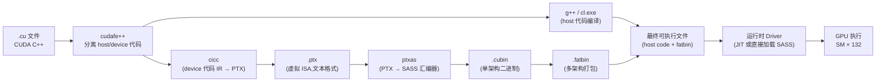

# 22 · PTX → SASS 编译链

> **nvcc 将 CUDA C++ 编译为 PTX 虚拟指令集,再由 ptxas 编译为目标 SM 的 SASS 真机指令;`-arch=sm_90a` 开启 Hopper 全特性,`cuobjdump --dump-sass` 可反汇编最终指令。**

## 1. 是什么 / 为什么有它

CUDA 的编译模型将设备代码的生成分为两个阶段,以实现跨架构兼容与运行时优化的平衡:

**PTX(Parallel Thread eXecution)** 是 NVIDIA 定义的虚拟指令集(ISA)。PTX 是稳定的、向前兼容的中间表示——一段为 sm_80(Ampere)编译的 PTX 可以在 Hopper 上通过 JIT 编译运行(尽管无法利用 Hopper 特有的 wgmma/TMA 指令)。PTX 是人类可读的文本格式,每条指令有明确的操作数类型标注,例如 `.reg .f32 %f0;` 声明寄存器,`mul.f32 %f2, %f0, %f1;` 表示单精度浮点乘法。

**SASS(Shader ASSembly)** 是真机指令集,每代 SM 架构不同。Hopper SM90 的 SASS 与 Ampere SM80 的 SASS 完全不兼容。SASS 是二进制编码的,`cuobjdump --dump-sass` 可以将其反汇编为人类可读的形式,但 NVIDIA 不公开完整的 SASS 格式规范(只提供反汇编工具)。理解 SASS 对于分析 ptxas 的寄存器分配、指令调度和指令融合(instruction fusion)至关重要。

**为什么需要两层?** 这一设计让 CUDA 程序具备"提前编译到 PTX,运行时 JIT 到 SASS"的能力。当新一代 GPU 发布而旧软件尚未重新编译时,驱动可以将嵌入在 fatbin 中的 PTX 即时编译为新架构的 SASS,实现软件前向兼容。与此同时,对性能敏感的场景可以预先编译到特定架构的 SASS(避免运行时 JIT 延迟)。

**sm_90 vs sm_90a 的关键差异:** Hopper SM90 引入了大量新指令——wgmma(warp-group 异步矩阵乘)、cp.async.bulk.tensor(TMA 多维张量搬运)、mbarrier 系列(异步屏障)、cluster 相关指令(barrier.cluster.arrive/wait)以及 FP8 格式的 mma。这些指令被归入 `sm_90a` 的"accelerated"特性集,与 `sm_90` 的基础特性集分离。理由是某些特性(如 wgmma)需要所有参与 warp 协调执行,不符合传统的 SIMT 执行语义,因此单独列为扩展。ptxas 在遇到这些指令时必须以 `-arch=sm_90a` 编译,否则直接报错退出。实际部署中,凡是使用 Hopper 特有功能的 kernel,一律应以 `sm_90a` 为目标架构编译。

**fatbin 的多架构打包策略:** 生产部署中通常同时打包多个架构的 SASS 和一份 PTX:例如 `-gencode arch=compute_80,code=sm_80 -gencode arch=compute_90,code=sm_90a -gencode arch=compute_90,code=compute_90`。这样同一个可执行文件在 A100(sm_80)上使用预编译 sm_80 SASS,在 H100(sm_90a)上使用 sm_90a SASS,在未来架构(如 sm_100)上 JIT 编译 compute_90 PTX。fatbin 体积随打包的架构数线性增长,应根据实际部署目标裁剪,避免不必要地增加可执行文件大小。

## 2. 硬件视角(微架构细节)

nvcc 的完整编译 pipeline 如下图所示:



**关键节点说明:**

- **cudafe++**:将 `.cu` 文件拆分为 host C++ 代码(交给 g++/cl.exe)和 device code(交给 cicc),处理 `__host__` / `__device__` / `__global__` 标注。
- **cicc**:NVIDIA 的设备代码优化编译器,将 CUDA C++ 的 device 函数编译为 PTX。cicc 执行大量高层优化:循环展开、内联、向量化、寄存器变量提升。
- **ptxas**:PTX 汇编器兼优化器,负责寄存器分配(graph-coloring)、指令调度(scoreboard 感知)、SMEM bank 分配,最终生成 SASS 二进制。ptxas 的质量直接决定 SASS 的性能,`-O3` 选项启用所有优化。
- **.fatbin**:将多个架构的 cubin 打包为一个 blob,嵌入最终可执行文件。Driver 在 launch 时根据运行时 GPU 选择匹配的 cubin,若无匹配 cubin 但 fatbin 中有 PTX,则 JIT 编译。

## 3. CUDA 编程接口

**nvcc 编译 flag(与架构相关):**

```bash
# -arch=sm_90a:Hopper 全特性(含 wgmma、TMA、cluster、FP8 等)
# -arch=sm_90 :sm_90 基础特性(无 wgmma/TMA/FP8)
# 区别:sm_90a 是"accelerated"变体,包含 Hopper 独占指令
nvcc -arch=sm_90a -O3 kernel.cu -o kernel

# 同时生成 PTX 和 SASS,提高可移植性
nvcc -gencode arch=compute_90,code=sm_90a \
     -gencode arch=compute_90,code=compute_90 \  # 嵌入 PTX,供未来 GPU JIT
     kernel.cu -o kernel

# 只生成 PTX(不含 cubin,完全依赖 JIT)
nvcc -arch=compute_90 -ptx kernel.cu -o kernel.ptx
```

**ptxas 独立调用(精细控制):**

```bash
# 将 PTX 汇编为 sm_90a 的 cubin,开启 O3 优化
ptxas -arch=sm_90a -O3 kernel.ptx -o kernel.cubin

# 打印寄存器、SMEM 用量(优化调优的必备信息)
ptxas -arch=sm_90a -O3 --ptxas-options=-v kernel.ptx -o kernel.cubin
# 输出示例:
# ptxas info    : Used 128 registers, 49152 bytes smem, 0 bytes cmem[0]

# 限制每线程寄存器数量(强制降低 register pressure 以提升 occupancy)
ptxas -arch=sm_90a -O3 --maxrregcount=64 kernel.ptx -o kernel.cubin
```

**反汇编工具:**

```bash
# 反汇编 cubin/可执行文件内的 SASS(最常用)
cuobjdump --dump-sass kernel.cubin
cuobjdump --dump-sass ./kernel_app   # 直接从可执行文件提取

# 同时显示 PTX(双视图对比)
cuobjdump --dump-ptx --dump-sass kernel.cubin

# nvdisasm:更详细的反汇编,支持指令格式解析
nvdisasm -g kernel.cubin            # 附带调试信息
nvdisasm -hex kernel.cubin          # 显示十六进制编码
```

**内联 PTX(在 CUDA C++ 中嵌入 PTX 指令):**

```ptx
// 强制使用特定 PTX 指令(bypass cicc 优化选择)
asm volatile(
    "fence.acq_rel.gpu;\n"      // GPU 范围 acquire-release fence
    : : :
);

// 读取 clock 计数器(用于微基准)
uint64_t clock;
asm volatile("mov.u64 %0, %%globaltimer;\n" : "=l"(clock));
```

## 4. 关键性能指标

| 编译选项对比 | 说明 |
|---|---|
| `ptxas -O3` vs `-O0` | SASS 指令数差距可达 3-5×;寄存器分配质量天壤之别 |
| `sm_90a` vs `sm_90` | sm_90a 启用 wgmma/TMA/FP8/cluster,缺少时 ptxas 会拒绝这些 PTX 指令 |
| `--maxrregcount=64` | 强制每线程 ≤ 64 寄存器,可使 occupancy 从 25% 提升到 50%(但可能引入 register spill) |
| JIT 编译延迟 | 首次 JIT:~100-500 ms/kernel;缓存命中后 ~0 |
| fatbin 中同时含 sm_90a + compute_90 | 在 sm_90 GPU 上用预编译 SASS,在未来架构上 JIT PTX |

**寄存器与 occupancy 关系(Hopper SM90):**

Hopper SM90 每 SM 有 65536 个 32-bit 寄存器(4 × 16384/sub-partition)。每个 warp 占用 32 × `regs_per_thread` 个寄存器。occupancy(活跃 warp 数 / 最大 warp 数)的 register 限制公式为:

```
max_warps_by_reg = floor(65536 / (32 × regs_per_thread))
occupancy = min(max_warps_by_reg, max_warps_by_smem, 64) / 64
```

当 `regs_per_thread = 128` 时,`max_warps_by_reg = floor(65536 / 4096) = 16`,occupancy = 16/64 = 25%。用 `--maxrregcount=64` 将每线程寄存器降到 64,则 `max_warps = 32`,occupancy = 50%——但若 cicc 原本需要 128 寄存器,强制限制会产生 register spill(寄存器溢出到 local memory,延迟从数 cycle 变为 HBM 读写的数百 cycle)。`--ptxas-options=-v` 输出的 `Spill stores/loads` 数字是判断 spill 严重程度的关键指标。

## 5. 代码示例

下面演示从 CUDA C++ 到 PTX 再到 SASS 的完整编译与反汇编流程:

```cpp
// simple_mul.cu —— 一个简单的向量元素乘法 kernel
__global__ void vec_mul(float *c, const float *a, const float *b, int n) {
    int i = blockIdx.x * blockDim.x + threadIdx.x;
    if (i < n) c[i] = a[i] * b[i];
}
```

**步骤 1:生成 PTX**

```bash
# -ptx 仅生成 PTX,不汇编
nvcc -arch=compute_90 -O3 -ptx simple_mul.cu -o simple_mul.ptx
```

PTX 关键片段示例(cicc 生成):

```ptx
.visible .entry vec_mul(.param .u64 c, .param .u64 a, .param .u64 b, .param .u32 n)
{
    .reg .pred  %p0;
    .reg .f32   %f0, %f1, %f2;
    .reg .b32   %r0, %r1;
    .reg .b64   %rd0, %rd1, %rd2, %rd3;

    ld.param.u64  %rd0, [c];      // 加载指针参数
    ld.param.u64  %rd1, [a];
    ld.param.u64  %rd2, [b];
    ld.param.u32  %r0,  [n];

    // 线程 index 计算
    mov.u32  %r1, %tid.x;
    mad.lo.s32 %r1, %ctaid.x, %ntid.x, %r1;  // i = blockIdx*blockDim + threadIdx

    setp.ge.s32 %p0, %r1, %r0;   // if (i >= n) 则跳过
    @%p0 bra DONE;

    // 从 a[i] 和 b[i] 加载,乘法,写入 c[i]
    cvt.s64.s32 %rd3, %r1;
    mul.wide.s32 %rd3, %r1, 4;   // byte offset = i * 4
    add.u64  %rd1, %rd1, %rd3;
    ld.global.f32 %f0, [%rd1];
    add.u64  %rd2, %rd2, %rd3;
    ld.global.f32 %f1, [%rd2];
    mul.f32  %f2, %f0, %f1;       // c[i] = a[i] * b[i]
    add.u64  %rd0, %rd0, %rd3;
    st.global.f32 [%rd0], %f2;
DONE:
    ret;
}
```

**步骤 2:PTX → cubin,查看资源用量**

```bash
ptxas -arch=sm_90a -O3 --ptxas-options=-v simple_mul.ptx -o simple_mul.cubin
# 输出:
# ptxas info    : Used 8 registers, 0 bytes smem, 0 bytes cmem[0]
```

**步骤 3:反汇编查看 SASS**

```bash
cuobjdump --dump-sass simple_mul.cubin
```

SASS 输出片段(sm_90a):

```bash
# 注意:SASS 指令名称为 NVIDIA 内部格式,不完全公开
code for sm_90a
    MOV R1, c[0x0][0x28];         // 加载 n 参数
    S2R R4, SR_TID.X;             // 读取 threadIdx.x
    ...
    FMUL R0, R2, R3;              // 单精度乘法
    STG.E [R8], R0;               // 写入全局内存
    EXIT;
```

## 6. 实测手段

**查看寄存器与 SMEM 用量:**

```bash
# --ptxas-options=-v 是最常用的优化调试手段
nvcc -arch=sm_90a -O3 --ptxas-options=-v kernel.cu -o kernel
# 输出示例(每个 kernel 一行):
# ptxas info    : Used 64 registers, 32768 bytes smem, 368 bytes cmem[0]
# ptxas info    : Function properties for my_kernel
#                  0 bytes stack frame, 0 bytes spill stores, 0 bytes spill loads
```

**NSight Compute 查看 SASS 级 source attribution:**

```bash
# 编译时加 -lineinfo 启用行信息
nvcc -arch=sm_90a -O3 -lineinfo kernel.cu -o kernel

# ncu 采集并关联 SASS 行
ncu --source-folder . --set full -o report ./kernel
# 打开 ncu GUI:Source 页面显示 C++ 源码 ↔ PTX ↔ SASS 三层对应关系,
# 以及每行 SASS 的执行次数和 stall 分布
```

**检查 JIT 缓存状态:**

```bash
ls -la ~/.nv/ComputeCache/      # Linux:JIT cubin 缓存目录
# 若目录过大(数 GB),可手动清理以释放磁盘空间

# 环境变量控制
export CUDA_FORCE_PTX_JIT=1     # 强制 JIT,即使 fatbin 中有 SASS(用于测试 JIT 路径)
export CUDA_CACHE_DISABLE=1     # 禁用 JIT 缓存(用于调试 JIT 编译逻辑)
```

**架构兼容性检查:**

```bash
# 查看可执行文件内嵌的架构列表
cuobjdump -elf ./kernel         # 列出 ELF section 及其架构标记
nvdisasm -cie ./kernel          # 列出 cubin 的 compute capability
```

## 7. 常见反模式

1. **用 `-arch=sm_90` 编译想运行 wgmma/TMA 的 kernel** — `sm_90`(无 `a` 后缀)不支持 Hopper 独占指令集。ptxas 在遇到 `wgmma.mma_async`、`cp.async.bulk.tensor`、`mbarrier.expect_tx` 等 PTX 指令时会报错 `feature not enabled for target`. 必须使用 `-arch=sm_90a`(或等价的 `-gencode arch=compute_90,code=sm_90a`)才能编译 Hopper 全特性代码。

2. **关掉 `-O3` 做"公平"基准测试** — ptxas 的 `-O0` 不做任何优化:不做寄存器分配优化、不重排指令以隐藏延迟、不做 load/store 合并。`-O0` 生成的 SASS 比 `-O3` 慢 5-10 倍并非夸张。如果需要对比两个 kernel 的性能,两者都必须用 `-O3` 编译。

3. **忘记 compute target 与 runtime GPU 不匹配** — `nvcc -arch=sm_80` 生成的 SASS 只能在 Ampere(sm_80)或更高架构上运行(向后兼容)。若在 Volta(sm_70)GPU 上运行 sm_80 SASS,会触发 `CUDA_ERROR_NO_BINARY_FOR_GPU`。反之,若 fatbin 中只有 sm_90a SASS 而目标 GPU 是 sm_80,同样无法运行。解决方案:多 gencode 覆盖目标架构,或嵌入 PTX 以支持 JIT。

4. **误以为 PTX 寄存器数 = SASS 寄存器数** — PTX 使用无限虚拟寄存器(`.reg .f32 %f0`),ptxas 的寄存器分配阶段将其映射到有限的物理寄存器。PTX 中虽然可以声明 1000 个虚拟寄存器,实际 SASS 可能只用 32 个(ptxas 通过图着色优化重用)。评估 register pressure 应以 `--ptxas-options=-v` 输出的 SASS 寄存器数为准,而不是 PTX 中的声明数。

5. **对 SASS 源码一无所知就提交性能报告** — `cuobjdump --dump-sass` 是验证编译器行为的基本工具。常见问题如:预期被融合的指令(FMA vs MUL+ADD)是否真的融合?向量化 load(LDG.128 vs LDG.32)是否生效?wgmma 的 HMMA 指令是否出现?在报告"kernel 优化完成"之前,至少应快速扫描 SASS 确认关键指令路径符合预期。

## 8. 延伸阅读

- **PTX ISA Reference Manual** — [https://docs.nvidia.com/cuda/parallel-thread-execution/](https://docs.nvidia.com/cuda/parallel-thread-execution/):完整的 PTX 指令集参考,包括 Hopper 新增指令(wgmma、cp.async.bulk.tensor、mbarrier 系列)。
- **CUDA Compiler Driver NVCC** — [https://docs.nvidia.com/cuda/cuda-compiler-driver-nvcc/](https://docs.nvidia.com/cuda/cuda-compiler-driver-nvcc/):nvcc 全部 flag 说明,包括 `-gencode`、`-arch`、`-code` 的精确语义。
- **cuobjdump 工具文档** — [https://docs.nvidia.com/cuda/cuda-binary-utilities/](https://docs.nvidia.com/cuda/cuda-binary-utilities/):cuobjdump、nvdisasm、ptxas 工具的完整使用说明。
- **Inline PTX in CUDA C++** — [https://docs.nvidia.com/cuda/inline-ptx-assembly/](https://docs.nvidia.com/cuda/inline-ptx-assembly/):内联 PTX 的约束字符串语法与最佳实践。
- **CUDA C++ Programming Guide §B.4** — Intrinsic Functions:哪些函数会直接映射到特定 PTX 指令。
- **Hopper Architecture Whitepaper** — sm_90a 新增指令集的高层介绍,是理解为何需要 `a` 后缀的背景材料。
