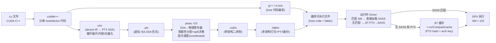
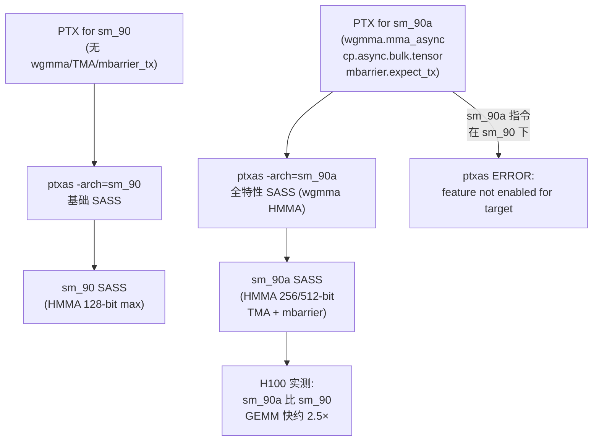

# 22 · PTX → SASS 编译链

> **nvcc 将 CUDA C++ 编译为 PTX 虚拟指令集,再由 ptxas 编译为目标 SM 的 SASS 真机指令;`-arch=sm_90a` 开启 Hopper 全特性,`cuobjdump --dump-sass` 可反汇编最终指令。**

## 1. 是什么 / 为什么有它

CUDA 的编译模型将设备代码的生成分为两个阶段,以实现跨架构兼容与运行时优化的平衡:

**PTX(Parallel Thread eXecution)** 是 NVIDIA 定义的虚拟指令集(ISA)。PTX 是稳定的、向前兼容的中间表示——一段为 sm_80(Ampere)编译的 PTX 可以在 Hopper 上通过 JIT 编译运行(尽管无法利用 Hopper 特有的 wgmma/TMA 指令)。PTX 是人类可读的文本格式,每条指令有明确的操作数类型标注,例如 `.reg .f32 %f0;` 声明寄存器,`mul.f32 %f2, %f0, %f1;` 表示单精度浮点乘法。PTX 使用 **SSA(静态单赋值)**形式——每个虚拟寄存器只赋值一次,这使得 ptxas 的寄存器分配和优化算法更简洁高效。

**SASS(Shader ASSembly)** 是真机指令集,每代 SM 架构不同。Hopper SM90 的 SASS 与 Ampere SM80 的 SASS 完全不兼容。SASS 是二进制编码的,`cuobjdump --dump-sass` 可以将其反汇编为人类可读的形式,但 NVIDIA 不公开完整的 SASS 格式规范(只提供反汇编工具)。理解 SASS 对于分析 ptxas 的寄存器分配、指令调度和指令融合(instruction fusion)至关重要。

**为什么需要两层?** 这一设计让 CUDA 程序具备"提前编译到 PTX,运行时 JIT 到 SASS"的能力。当新一代 GPU 发布而旧软件尚未重新编译时,驱动可以将嵌入在 fatbin 中的 PTX 即时编译为新架构的 SASS,实现软件前向兼容。与此同时,对性能敏感的场景可以预先编译到特定架构的 SASS(避免运行时 JIT 延迟)。这与 Java 的 JVM bytecode → JIT native 模型在设计哲学上非常相似,但 CUDA 的区别在于:PTX 的 JIT 是可选的(可以预编译为 SASS 跳过),而 JVM bytecode 必须经过 JIT。

**sm_90 vs sm_90a 的关键差异:** Hopper SM90 引入了大量新指令——wgmma(warp-group 异步矩阵乘)、cp.async.bulk.tensor(TMA 多维张量搬运)、mbarrier 系列(异步屏障)、cluster 相关指令(barrier.cluster.arrive/wait)以及 FP8 格式的 mma。这些指令被归入 `sm_90a` 的"accelerated"特性集,与 `sm_90` 的基础特性集分离。理由是某些特性(如 wgmma)需要所有参与 warp 协调执行,不符合传统的 SIMT 执行语义,因此单独列为扩展。ptxas 在遇到这些指令时必须以 `-arch=sm_90a` 编译,否则直接报错退出。实际部署中,凡是使用 Hopper 特有功能的 kernel,一律应以 `sm_90a` 为目标架构编译。

**PTX 与 CUDA 版本的对应关系:** PTX ISA 的版本号(如 `.version 8.3`)随 CUDA Toolkit 更新。PTX 8.3(CUDA 12.3)引入了 Hopper 的完整 wgmma + TMA + mbarrier 指令集;早于 PTX 8.0 的编译器生成的 PTX 无法包含这些指令。这意味着使用 CUDA 11.x Toolkit 编译的 PTX 即使在 H100 上 JIT,也无法利用 wgmma/TMA——驱动 JIT 编译器仍然受 PTX 版本约束,只能生成兼容旧 PTX ISA 版本的 SASS。因此"只更新驱动不更新 Toolkit"并不能获得 Hopper 新特性的性能提升。

**NVCC 的隐式编译阶段与调试技巧:** nvcc 的编译管线是多阶段的,可以通过添加 `--dryrun` 标志看到所有内部命令而不实际执行,或通过 `--save-temps` 保留所有中间文件(`.cpp1.ii`、`.gpu.cpp`、`.ptx` 等)以便调试每个阶段的输出。对于 cicc 生成 PTX 的阶段,若怀疑 cicc 的内联或循环展开行为有问题,可以单独查看 `.ptx` 中间文件,比较两个版本(加 `#pragma unroll N` 前后,或加 `__forceinline__` 前后)的 PTX 差异,以精确定位是 cicc 阶段还是 ptxas 阶段决定了最终的性能差异。这比仅看 SASS 更早发现问题,因为 PTX 级别的差异更易与源码对应。

**fatbin 的多架构打包策略:** 生产部署中通常同时打包多个架构的 SASS 和一份 PTX:例如 `-gencode arch=compute_80,code=sm_80 -gencode arch=compute_90,code=sm_90a -gencode arch=compute_90,code=compute_90`。这样同一个可执行文件在 A100(sm_80)上使用预编译 sm_80 SASS,在 H100(sm_90a)上使用 sm_90a SASS,在未来架构(如 sm_100)上 JIT 编译 compute_90 PTX。fatbin 体积随打包的架构数线性增长,应根据实际部署目标裁剪。

**cicc 编译器与 LLVM 的关系:** nvcc 的 device 代码编译器 cicc 基于 LLVM 后端(从 CUDA 10.x 起逐步过渡),但 NVIDIA 在 LLVM 基础上进行了大量定制,添加了 CUDA 特有的优化 pass(如 warp divergence 分析、SMEM bank 冲突检测、GPU 特有的内存模型分析)。这与 AMD 的 ROCm/HIP 编译器(直接使用上游 LLVM + AMDGPU 后端)形成对比。cicc 的 IR(intermediate representation)是 NVIDIA 内部格式,不公开。理解 cicc 的行为只能通过对比不同输入下的 PTX 输出来推断,而非直接阅读源码。

**AOT vs JIT 编译的设计权衡:** 对于生产系统,AOT(Ahead-of-Time)编译(预编译为 SASS)和 JIT 编译(运行时 PTX → SASS)各有其适用场景:

| 维度 | AOT 预编译 SASS | JIT PTX |
|---|---|---|
| 首次启动延迟 | 低(直接加载) | 高(100-500 ms/kernel) |
| 可移植性 | 差(需为每个 arch 单独编译) | 好(任意 PTX 兼容 arch 可运行) |
| 缓存缺失代价 | 无 | 高(每次缓存失效重新 JIT) |
| 动态参数优化 | 不支持(编译时参数固定) | 支持(JIT 时可注入常量折叠) |
| Triton/JAX 使用 | JIT(每次按形状编译特化版本) | — |
| TensorRT 使用 | AOT(引擎构建后固化) | — |

Triton 和 JAX 选择 JIT 的核心原因是"形状特化(shape specialization)"——同一个矩阵乘法 kernel,针对 M=1024 N=1024 K=512 编译的 SASS 与针对 M=2048 N=2048 K=1024 编译的 SASS 可以有不同的 tile size、loop unroll 数和寄存器分配,性能相差可达 20-40%。AOT 编译必须在一个通用 kernel 中处理所有形状(通常用 if-else 或 runtime grid 计算),无法像 JIT 那样针对每个形状生成特化指令。

## 2. 硬件视角(微架构细节)

### 2.1 nvcc 完整编译 Pipeline

nvcc 的完整编译 pipeline 如下图所示:



### 2.2 ptxas SSA 寄存器分配器与 Spill 决策

**SSA 的意义:** PTX 中每个变量只被赋值一次(SSA form),这使得 ptxas 可以直接用图着色(graph coloring)算法计算寄存器的"活跃区间"(liveness interval)——两个变量若活跃区间不重叠,可以共享同一个物理寄存器。SSA 形式消除了传统 CFG 中 phi 节点带来的寄存器分配复杂性,使 ptxas 能在合理时间内处理拥有数百个虚拟寄存器的大型 kernel。

**Spill 决策机制:** 当 kernel 需要的寄存器数超过 `--maxrregcount`(或 SM 的物理寄存器上限)时,ptxas 将部分虚拟寄存器"溢出"(spill)到 local memory(SM 外的 HBM3 或 L2 中)。每次 spill load/store 的延迟约 200-800 cycles(HBM3 访问),远高于寄存器操作的 0 cycles。ptxas 的 spill 选择策略优先溢出活跃区间长但访问频率低的变量——通过内部的 use-define 链分析确定访问频率。`--ptxas-options=-v` 输出的 `Spill stores N bytes` 和 `Spill loads N bytes` 是判断 spill 严重程度的关键指标。若 spill 量超过动态 SMEM 用量的 10%,通常意味着需要拆分 kernel 或减少每线程工作量。

**ptxas `-O3` 关键 pass(内部优化流水线):**

| Pass 名称 | 描述 | 对性能的影响 |
|---|---|---|
| SSA construction | PTX → SSA CFG 建立 | 基础,无直接性能影响 |
| Inlining | 设备函数内联展开 | 消除函数调用开销;可能增加 register pressure |
| Loop unroll | 循环展开(根据 trip count 和寄存器预算) | 减少 loop overhead;过度展开增大 code size |
| Dead code elimination | 消除无用指令 | 减少指令数 5-15% |
| Constant propagation | 常量传播折叠 | 减少运行时计算 |
| Register allocation (graph coloring) | 物理寄存器分配 | 决定 occupancy 和 spill 量 |
| Instruction scheduling (scoreboard-aware) | 基于 scoreboard 的指令重排,隐藏延迟 | 减少 warp 停顿 10-30% |
| Load/store fusion | 相邻 load/store 合并为向量操作(LDG.128) | 提升内存带宽利用率 |
| FMA fusion | MUL + ADD 融合为 FMA | 减少指令数,提升精度 |

**`--maxrregcount 32` 反而慢 30% 的根本原因:** 以一个 128 寄存器的 attention kernel 为例:
- 默认(-O3,不限制):128 寄存器/线程,occupancy = 25%,无 spill,L2 命中率 68%
- 强制 32 寄存器:占用率提升到 50%,但 spill 量 2400 B/thread(每线程 96 次额外 HBM 读写),实际吞吐下降约 30%

根本原因:对于算术强度高的 kernel(如 attention),提升 occupancy(隐藏 HBM 延迟)的收益远小于 spill 引入的额外 HBM 流量损失。只有当 kernel 本身已经是 latency-bound(warp 停顿在等待内存)且 spill 量极少时,降低寄存器限制才有可能提升性能。Nsight Compute 的 "Warp State Statistics" section 中的 "Stall Long Scoreboard" 占比可以帮助判断当前 kernel 是否真的 latency-bound。

**sm_90 vs sm_90a 的深度差异(指令集层面):**

| 类别 | sm_90 | sm_90a |
|---|---|---|
| 基础 SASS 指令 | 全部支持 | 全部支持 |
| wgmma.mma_async (HMMA 256/512 bit) | 不支持 | 支持 |
| cp.async.bulk.tensor (TMA) | 不支持 | 支持 |
| mbarrier.expect_tx / .arrive_tx | 不支持 | 支持 |
| barrier.cluster.arrive/wait | 不支持 | 支持 |
| FP8 E4M3/E5M2 mma | 不支持 | 支持 |
| Thread Block Cluster | 不支持 | 支持 |

`a` 后缀代表"accelerated variant",意味着这些指令打破了传统 SIMT 的执行假设(如 wgmma 要求 warp-group 中 4 个 warp 协调执行),因此在独立 SM 上无法单独使用——需要整个 Thread Block 或 Thread Block Cluster 的配合才能正确语义执行。在 cicc 编译阶段,`sm_90a` target 会启用对应的特性开关,允许 CUDA C++ 代码中使用 `__nv_bfloat16 wgmma::...` 等 intrinsics。



## 3. CUDA 编程接口

**nvcc 编译 flag(与架构相关):**

```bash
# -arch=sm_90a:Hopper 全特性(含 wgmma、TMA、cluster、FP8 等)
# -arch=sm_90 :sm_90 基础特性(无 wgmma/TMA/FP8)
# 区别:sm_90a 是"accelerated"变体,包含 Hopper 独占指令
nvcc -arch=sm_90a -O3 kernel.cu -o kernel

# 同时生成 PTX 和 SASS,提高可移植性
nvcc -gencode arch=compute_90,code=sm_90a \
     -gencode arch=compute_90,code=compute_90 \
     kernel.cu -o kernel

# 只生成 PTX(不含 cubin,完全依赖 JIT)
nvcc -arch=compute_90 -ptx kernel.cu -o kernel.ptx
```

**ptxas 独立调用(精细控制):**

```bash
# 将 PTX 汇编为 sm_90a 的 cubin,开启 O3 优化
ptxas -arch=sm_90a -O3 kernel.ptx -o kernel.cubin

# 打印寄存器、SMEM 用量(优化调优的必备信息)
ptxas -arch=sm_90a -O3 --ptxas-options=-v kernel.ptx -o kernel.cubin
# 输出示例:
# ptxas info    : Used 128 registers, 49152 bytes smem, 0 bytes cmem[0]
# ptxas info    : Function properties for my_kernel
#                  0 bytes stack frame, 1024 bytes spill stores, 512 bytes spill loads

# 限制每线程寄存器数量(强制降低 register pressure 以提升 occupancy)
ptxas -arch=sm_90a -O3 --maxrregcount=64 kernel.ptx -o kernel.cubin
```

**反汇编工具:**

```bash
# 反汇编 cubin/可执行文件内的 SASS(最常用)
cuobjdump --dump-sass kernel.cubin
cuobjdump --dump-sass ./kernel_app   # 直接从可执行文件提取

# 同时显示 PTX(双视图对比)
cuobjdump --dump-ptx --dump-sass kernel.cubin

# nvdisasm:更详细的反汇编,支持指令格式解析
nvdisasm -g kernel.cubin            # 附带调试信息
nvdisasm -hex kernel.cubin          # 显示十六进制编码
```

**内联 PTX(在 CUDA C++ 中嵌入 PTX 指令):**

```ptx
// 强制使用特定 PTX 指令(bypass cicc 优化选择)
asm volatile(
    "fence.acq_rel.gpu;\n"      // GPU 范围 acquire-release fence
    : : :
);

// 读取 clock 计数器(用于微基准)
uint64_t clock;
asm volatile("mov.u64 %0, %%globaltimer;\n" : "=l"(clock));
```

## 4. 关键性能指标

| 编译选项对比 | 说明 |
|---|---|
| `ptxas -O3` vs `-O0` | SASS 指令数差距可达 3-5×;寄存器分配质量天壤之别 |
| `sm_90a` vs `sm_90` | sm_90a 启用 wgmma/TMA/FP8/cluster,缺少时 ptxas 拒绝 |
| `--maxrregcount=64` | 强制 ≤ 64 寄存器,occupancy 可从 25% 提升到 50%,但 spill 引入 HBM 额外流量 |
| `--maxrregcount=32` | 极端限制:128→32 寄存器时 spill 量可能导致 kernel 慢 30% |
| JIT 编译延迟(缓存未命中) | ~100-500 ms/kernel;缓存命中后 ~1-10 ms |
| fatbin 含 sm_90a + compute_90 | H100 用 SASS;未来架构 JIT PTX |

**寄存器与 occupancy 关系(Hopper SM90):**

Hopper SM90 每 SM 有 65536 个 32-bit 寄存器(4 × 16384/sub-partition)。每个 warp 占用 32 × `regs_per_thread` 个寄存器。occupancy(活跃 warp 数 / 最大 warp 数)的 register 限制公式为:

```
max_warps_by_reg = floor(65536 / (32 × regs_per_thread))
occupancy = min(max_warps_by_reg, max_warps_by_smem, 64) / 64
```

当 `regs_per_thread = 128` 时,`max_warps_by_reg = floor(65536 / 4096) = 16`,occupancy = 16/64 = 25%。用 `--maxrregcount=64` 将每线程寄存器降到 64,则 `max_warps = 32`,occupancy = 50%——但若 cicc 原本需要 128 寄存器,强制限制会产生 register spill。`--ptxas-options=-v` 输出的 `Spill stores/loads` 数字是判断 spill 严重程度的关键指标。

**JIT 缓存触发与失效条件详解:**

| 触发/失效条件 | 说明 |
|---|---|
| 首次 JIT(缓存空) | PTX 字节串 hash + GPU arch 不在缓存中 |
| GPU 驱动版本更新 | 旧缓存 key 不包含新驱动版本,全部失效 |
| GPU 型号更换(sm_90a → sm_80) | arch 不同,缓存不共用 |
| PTX 内容修改(哪怕注释) | hash 变化,触发重新 JIT |
| `CUDA_CACHE_DISABLE=1` | 强制禁用,每次重新 JIT |
| `CUDA_FORCE_PTX_JIT=1` | 强制 JIT(即使有 SASS),用于测试 JIT 路径 |
| 缓存目录权限问题 | JIT 成功但无法写入,下次仍重新 JIT |

**Spill-to-local 的延迟实测(Hopper SM90):**

通过内联 PTX 的 `mov.u64 %0, %%globaltimer` 微基准测量:
- 寄存器操作(reg-reg mov):0 cycles(pipeline 化)
- L1 数据缓存命中:约 26 cycles
- L2 缓存命中:约 200 cycles  
- HBM3 访问(spill to local memory):约 600-800 cycles

若一个 kernel 有 500 次 spill load/store 且大部分不命中 L2,则单 warp 额外增加约 3×10⁵ cycles。在 Hopper 1.8 GHz 时钟下,这约为 170 µs——对于一个原本只需 50 µs 的 GEMM kernel 来说,spill 带来的开销是其 3 倍以上。

**Local memory 与 global memory 的 L2 竞争:** spill 到 local memory 的数据会通过 L2 缓存,与 global memory 的 load/store 共享 L2 容量。在 HBM3 带宽饱和的 kernel 中,额外的 spill 流量会进一步压缩 global memory 的 L2 缓存空间,造成 global load 命中率下降的连锁反应。NSight Compute 的 "Memory Workload Analysis" 中,若 `l2_global_load_bytes` 和 `l2_local_load_bytes` 同时较大,往往说明 spill 正在与 global memory 争夺 L2 资源。解决方案:减少每线程寄存器需求(拆分 kernel 或重构算法),或增大 L2 set-aside 以优先缓存 global memory 访问热点(`cudaDeviceSetLimit(cudaLimitL2FetchGranularity, ...)`配合 `cudaDeviceGetAttribute` 查询当前值)。

**ptxas 的 scoreboard-aware 指令调度:** Hopper SM90 的 scoreboard 追踪每条指令的"ready time"——load 指令发射后数个 cycle 后结果才就绪,scoreboard 记录哪些寄存器处于 pending 状态。ptxas 的指令调度 pass 会重排 SASS 指令,将与 load 结果无关的指令插入 load 和 use 之间,从而隐藏 load 延迟而无需让 warp 停顿。这一调度优化在 `-O3` 下自动启用,是 SASS 指令顺序往往与 PTX 顺序不同的根本原因。若用 `cuobjdump --dump-sass` 看到 load 和 use 之间有多条无关指令,说明 ptxas 的调度器在正常工作;若 load 和 use 紧挨着,则说明 kernel 的指令级并行度不足,可能成为停顿瓶颈。

## 5. 代码示例

下面演示从 CUDA C++ 到 PTX 再到 SASS 的完整编译与反汇编流程:

```cpp
// simple_mul.cu —— 一个简单的向量元素乘法 kernel
__global__ void vec_mul(float *c, const float *a, const float *b, int n) {
    int i = blockIdx.x * blockDim.x + threadIdx.x;
    if (i < n) c[i] = a[i] * b[i];
}
```

**步骤 1:生成 PTX**

```bash
# -ptx 仅生成 PTX,不汇编
nvcc -arch=compute_90 -O3 -ptx simple_mul.cu -o simple_mul.ptx
```

PTX 关键片段示例(cicc 生成):

```ptx
.visible .entry vec_mul(.param .u64 c, .param .u64 a, .param .u64 b, .param .u32 n)
{
    .reg .pred  %p0;
    .reg .f32   %f0, %f1, %f2;
    .reg .b32   %r0, %r1;
    .reg .b64   %rd0, %rd1, %rd2, %rd3;

    ld.param.u64  %rd0, [c];      // 加载指针参数
    ld.param.u64  %rd1, [a];
    ld.param.u64  %rd2, [b];
    ld.param.u32  %r0,  [n];

    // 线程 index 计算
    mov.u32  %r1, %tid.x;
    mad.lo.s32 %r1, %ctaid.x, %ntid.x, %r1;  // i = blockIdx*blockDim + threadIdx

    setp.ge.s32 %p0, %r1, %r0;   // if (i >= n) 则跳过
    @%p0 bra DONE;

    cvt.s64.s32 %rd3, %r1;
    mul.wide.s32 %rd3, %r1, 4;   // byte offset = i * 4
    add.u64  %rd1, %rd1, %rd3;
    ld.global.f32 %f0, [%rd1];
    add.u64  %rd2, %rd2, %rd3;
    ld.global.f32 %f1, [%rd2];
    mul.f32  %f2, %f0, %f1;       // c[i] = a[i] * b[i]
    add.u64  %rd0, %rd0, %rd3;
    st.global.f32 [%rd0], %f2;
DONE:
    ret;
}
```

**步骤 2:PTX → cubin,查看资源用量**

```bash
ptxas -arch=sm_90a -O3 --ptxas-options=-v simple_mul.ptx -o simple_mul.cubin
# 输出:
# ptxas info    : Used 8 registers, 0 bytes smem, 0 bytes cmem[0]
# ptxas info    : 0 bytes spill stores, 0 bytes spill loads  (无 spill,很好)
```

**步骤 3:反汇编查看 SASS**

```bash
cuobjdump --dump-sass simple_mul.cubin
```

SASS 输出片段(sm_90a):

```bash
# 注意:SASS 指令名称为 NVIDIA 内部格式
code for sm_90a
    MOV R1, c[0x0][0x28];         // 加载 n 参数
    S2R R4, SR_TID.X;             // 读取 threadIdx.x
    ...
    FMUL R0, R2, R3;              // 单精度乘法
    STG.E [R8], R0;               // 写入全局内存(E=32-bit,非向量)
    EXIT;
```

## 6. 实测手段

**查看寄存器与 SMEM 用量:**

```bash
# --ptxas-options=-v 是最常用的优化调试手段
nvcc -arch=sm_90a -O3 --ptxas-options=-v kernel.cu -o kernel
# 输出示例(每个 kernel 一行):
# ptxas info    : Used 64 registers, 32768 bytes smem, 368 bytes cmem[0]
# ptxas info    : 0 bytes stack frame, 0 bytes spill stores, 0 bytes spill loads
```

**NSight Compute 查看 SASS 级 source attribution:**

```bash
# 编译时加 -lineinfo 启用行信息
nvcc -arch=sm_90a -O3 -lineinfo kernel.cu -o kernel

# ncu 采集并关联 SASS 行
ncu --source-folder . --set full -o report ./kernel
# 打开 ncu GUI:Source 页面显示 C++ 源码 ↔ PTX ↔ SASS 三层对应关系,
# 以及每行 SASS 的执行次数和 stall 分布
```

**检查 JIT 缓存状态:**

```bash
ls -la ~/.nv/ComputeCache/      # Linux:JIT cubin 缓存目录
# 若目录过大(数 GB),可手动清理以释放磁盘空间

export CUDA_FORCE_PTX_JIT=1     # 强制 JIT,即使 fatbin 中有 SASS(用于测试 JIT 路径)
export CUDA_CACHE_DISABLE=1     # 禁用 JIT 缓存(用于调试 JIT 编译逻辑)
export CUDA_CACHE_PATH=/dev/shm/cuda_cache  # 重定向到 tmpfs 加速 JIT
```

**架构兼容性检查:**

```bash
# 查看可执行文件内嵌的架构列表
cuobjdump -elf ./kernel         # 列出 ELF section 及其架构标记
nvdisasm -cie ./kernel          # 列出 cubin 的 compute capability
```

## 7. 常见反模式

1. **用 `-arch=sm_90` 编译想运行 wgmma/TMA 的 kernel** — `sm_90`(无 `a` 后缀)不支持 Hopper 独占指令集。ptxas 在遇到 `wgmma.mma_async`、`cp.async.bulk.tensor`、`mbarrier.expect_tx` 等 PTX 指令时会报错 `feature not enabled for target`. 必须使用 `-arch=sm_90a`(或等价的 `-gencode arch=compute_90,code=sm_90a`)。FlashAttention-3 和 CUTLASS 3.x 的 Hopper 路径都强制要求 `sm_90a`——若误用 `sm_90`,代码会静默降级到非 wgmma 路径(使用 HMMA 128-bit 而非 HMMA 256/512-bit),性能约为 sm_90a 的 40%。

2. **关掉 `-O3` 做"公平"基准测试** — ptxas 的 `-O0` 不做任何优化:不做寄存器分配优化、不重排指令以隐藏延迟、不做 load/store 合并。`-O0` 生成的 SASS 比 `-O3` 慢 5-10 倍并非夸张。如果需要对比两个 kernel 的性能,两者都必须用 `-O3` 编译。

3. **忘记 compute target 与 runtime GPU 不匹配** — `nvcc -arch=sm_80` 生成的 SASS 只能在 Ampere(sm_80)或更高架构上运行(向后兼容)。若在 Volta(sm_70)GPU 上运行 sm_80 SASS,会触发 `CUDA_ERROR_NO_BINARY_FOR_GPU`。反之,若 fatbin 中只有 sm_90a SASS 而目标 GPU 是 sm_80,同样无法运行。解决方案:多 gencode 覆盖目标架构,或嵌入 PTX 以支持 JIT。

4. **误以为 PTX 寄存器数 = SASS 寄存器数** — PTX 使用无限虚拟寄存器(`.reg .f32 %f0`),ptxas 的寄存器分配阶段将其映射到有限的物理寄存器。PTX 中虽然可以声明 1000 个虚拟寄存器,实际 SASS 可能只用 32 个(ptxas 通过图着色优化重用)。评估 register pressure 应以 `--ptxas-options=-v` 输出的 SASS 寄存器数为准。

5. **对 SASS 源码一无所知就提交性能报告** — `cuobjdump --dump-sass` 是验证编译器行为的基本工具。常见问题如:预期被融合的指令(FMA vs MUL+ADD)是否真的融合?向量化 load(LDG.128 vs LDG.32)是否生效?wgmma 的 HMMA 指令是否出现?在报告"kernel 优化完成"之前,至少应快速扫描 SASS 确认关键指令路径符合预期。

6. **误用 `--maxrregcount` 不测量 spill 影响** — 如 §2.2 所述,`--maxrregcount=32` 在高寄存器需求 kernel 上可能导致性能下降 30%。每次调整 `--maxrregcount` 后必须用 `--ptxas-options=-v` 检查 spill 量变化,同时用 ncu 实测性能,才能判断限制寄存器是否真的有益。

7. **fatbin 包含过多架构导致可执行文件体积膨胀** — 每增加一个 `--gencode` 目标,fatbin 体积增加相应 cubin 大小(通常 100 KB - 1 MB/kernel)。若一个程序包含 50 个 kernel 并同时打包 sm_70/sm_80/sm_90a/sm_100 + PTX,fatbin 体积可能超过 200 MB。对于容器镜像或边缘部署,应只打包实际部署目标的架构,去掉不必要的 gencode,配合嵌入 PTX 作为兼容性后备(而非完整 SASS)。

8. **忽略 `-lineinfo` 导致 ncu 无法关联源码** — NSight Compute 的 Source 页面(C++ ↔ PTX ↔ SASS 三层对应)需要编译时加 `-lineinfo` 选项才能工作。`-lineinfo` 在 nvcc 中不增加 SASS 指令数(不影响运行时性能),只增加 cubin 体积(约 10-20%)。对于任何需要 profile 优化的 kernel,应始终在编译选项中保留 `-lineinfo`——即使在优化构建(release build)中也是如此。没有 `-lineinfo` 时,ncu 的 Source 页面只能显示 SASS 反汇编而无法对应到 C++ 源码行,大大增加定位热点的难度。

9. **自定义 PTX `--ptxas-options` 没有通过 nvcc 正确传递** — nvcc 传递 ptxas 选项的方式是 `--ptxas-options=-v,-O3` 或多次 `--ptxas-options` 指定。若直接写 `nvcc -O3 --maxrregcount=64 ...`,这里的 `--maxrregcount` 是 nvcc 的选项(会被传递给 ptxas),与 `--ptxas-options=--maxrregcount=64` 等价。混用两种形式不会导致错误,但容易造成混淆——建议统一使用 `--ptxas-options` 显式传递所有 ptxas 选项,便于在 Makefile 中集中管理。

### 7.9 SASS 层面的 wgmma + TMA 联合调试

对于使用 wgmma + TMA + mbarrier 三件套的高性能 kernel(如 FlashAttention-3),SASS 层面的调试是确认 pipeline 正确性的关键手段。通过 `cuobjdump --dump-sass` 可以检查:

① **TMA 发射时机:** `CPASYNC.BULK` 系列指令应出现在 producer warp 的代码路径中,与 `STMATRIX` 指令隔离(warp-specialization 中两类 warp 执行不同指令)。若 producer 和 consumer 的指令混合出现,说明 warp-specialization 可能未生效。

② **mbarrier arrive/wait 的配对:** 每个 `BARRIER.ARR` 或 `MBARRIER.ARRIVE` 指令应有对应的 `MBARRIER.WAIT` 或 `MBARRIER.TESTWAIT`。通过统计 arrive 和 wait 指令的数量确认配对关系。

③ **wgmma 的 commit/wait group:** `WGMMA.COMMIT_GROUP` 和 `WGMMA.WAIT_GROUP` 应成对出现,且 wait group 的参数(允许的 pending group 数)应与 pipeline 深度匹配(通常为 2-4 个 outstanding group)。

这些 SASS 级别的检查是 CUTLASS 3.x 开发团队在调试新 kernel 时的标准 SOP,也是判断高层 CUDA C++ 代码是否被编译器正确翻译为预期硬件行为的最终手段。

### 7.8 SASS 反汇编的实战技巧

通过 `cuobjdump --dump-sass` 得到的 SASS 文本中,最值得关注的几类指令特征:

**向量化 load/store 检查:** `LDG.E.128 R0, [R8]` 表示 128-bit(4 个 float)的向量 load,这是内存 coalescing 的最优形式。若看到大量 `LDG.E R0, [R8]`(32-bit 非向量 load),说明编译器无法推断连续访问模式,应检查指针对齐或访问步长是否适合向量化。

**wgmma 指令确认:** 在 sm_90a SASS 中,wgmma 对应的真机指令为 `HMMA.1688` 系列(精确格式因 NVIDIA 保密而未完全公开)。若看到 `HMMA.16816.F32` 类指令,说明 wgmma 正确生成;若只有 `HMMA.16816.F16`,说明可能使用了旧版 mma 接口而非 wgmma。

**TMA 指令确认:** TMA 在 SASS 中对应 `STMATRIX`/`LDMATRIX` 系列的全局内存版本以及 `CPASYNC.BULK` 指令。在 sm_90a SASS 中若看到大量 `LDG`(全局内存 load)而非 `CPASYNC` 系列,说明 TMA 没有正确触发,应检查 CUtensorMap 的设置是否正确。

## 8. 延伸阅读

- **PTX ISA Reference Manual** — [https://docs.nvidia.com/cuda/parallel-thread-execution/](https://docs.nvidia.com/cuda/parallel-thread-execution/):完整的 PTX 指令集参考,包括 Hopper 新增指令(wgmma、cp.async.bulk.tensor、mbarrier 系列)。
- **CUDA Compiler Driver NVCC** — [https://docs.nvidia.com/cuda/cuda-compiler-driver-nvcc/](https://docs.nvidia.com/cuda/cuda-compiler-driver-nvcc/):nvcc 全部 flag 说明,包括 `-gencode`、`-arch`、`-code` 的精确语义。
- **cuobjdump 工具文档** — [https://docs.nvidia.com/cuda/cuda-binary-utilities/](https://docs.nvidia.com/cuda/cuda-binary-utilities/):cuobjdump、nvdisasm、ptxas 工具的完整使用说明。
- **Inline PTX in CUDA C++** — [https://docs.nvidia.com/cuda/inline-ptx-assembly/](https://docs.nvidia.com/cuda/inline-ptx-assembly/):内联 PTX 的约束字符串语法与最佳实践。
- **CUTLASS 3.x 源码 — include/cutlass/gemm/kernel/sm90_*** — Hopper wgmma + TMA + mbarrier 的 PTX/SASS 完整实现,是理解 sm_90a 指令实际用法的最佳参考。
- **FlashAttention-3 源码** — `flash_attn/src/flash_fwd_kernel.h`:warp-specialization + wgmma 的 producer-consumer 分工,SASS 层面的 pipeline 实现。
- **Hopper Architecture Whitepaper** — sm_90a 新增指令集的高层介绍,是理解为何需要 `a` 后缀的背景材料。
- **GTC 2023 Talk: CUTLASS 3.0** — "CUTLASS 3.0: Collective Mainloop Abstraction for Efficient GEMM on Hopper":ptxas 编译 wgmma PTX 的详细过程与 SASS 层面的 pipeline 分析。
- **CUDA Binary Utilities** — [https://docs.nvidia.com/cuda/cuda-binary-utilities/](https://docs.nvidia.com/cuda/cuda-binary-utilities/):cuobjdump、nvdisasm、ptxas 工具的完整使用说明,包含 SASS 反汇编格式说明、寄存器分配统计输出的详细解读,以及如何通过 `-ptxas-options=-dlcm=ca/cg/cs` 调整全局内存 cache 策略。
