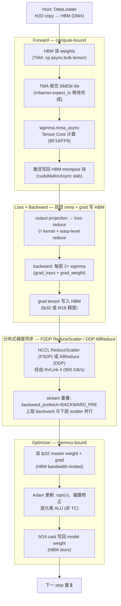
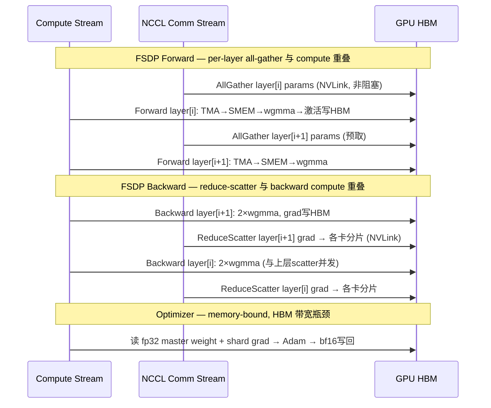

# 23 · 模型训练全栈串联 — 一次 step 如何调度全部 GPU 组件

> **一次 training step = forward + backward + optimizer + 梯度同步,几乎触发前 22 章所有 GPU 组件;理解串联关系是定位训练性能瓶颈的前提。**

## 1. 是什么 / 为什么有它

深度学习训练的最小执行单元是 training step:给定一个 mini-batch,模型完成前向传播(forward)计算损失,再完成反向传播(backward)计算每层参数的梯度,随后优化器更新参数,最后在多卡场景下同步梯度。这四个阶段看似简单,背后却几乎调用了前 22 章覆盖的每一个硬件组件和软件抽象:HBM 中存放权重、激活、梯度三类大型 tensor;TMA 负责异步搬运权重 tile 到 SMEM;wgmma Tensor Core 执行矩阵乘法;SMEM 充当 tile 缓冲和 reduction 暂存区;mbarrier 协调异步完成通知;NCCL 经由 NVLink 4 完成梯度 ReduceScatter / AllGather;CUDA Streams 让通信与计算重叠;CUDA Graphs 消除重复 launch 开销;FlashAttention-3 将 attention 融合为单一 kernel 消除 HBM 二次读写;Transformer Engine 将 GEMM 下沉到 FP8 精度。

单 kernel 微基准测试的优化直觉在 training step 粒度往往失效。举例来说,单独测 wgmma 时 Tensor Core 利用率可达 80%,但在真实训练中 NCCL AllReduce 可能阻塞后续 forward,导致整体 MFU 只有 40%。反过来,使用 FP8 把 GEMM 加速 2× 后如果 activation checkpoint 的重算 FLOPs 成为新的瓶颈,总加速可能不足预期的 50%。只有从 step 粒度出发,同时观察算子层、显存层、分布式通信层和调度层,才能准确定位瓶颈、制定有效优化方案。这也是为什么生产训练系统的工程师需要同时熟悉 wgmma 微架构细节和 FSDP 通信重叠策略——两个层面缺一不可。

本章以 Transformer 解码器模型(如 Llama 系列)在 Hopper H100 上的单机多卡及多机多卡训练为主线,串联前 22 章的知识点。重点覆盖 FSDP、Megatron-LM、Transformer Engine 和 FlashAttention-3 的完整生产级配置,以及 70B / 405B 规模的实测 MFU 数字和优化决策树。

训练系统的架构选择具有很强的规模依赖性:10B 以下参数的模型通常可以用单机 DDP 或简单 FSDP 训练,配置简单、调试便利;70B 量级需要 FSDP 搭配 activation checkpoint 和通信重叠才能在单机 8 卡上高效运行;405B 及以上则必须引入 Tensor Parallelism 和 Pipeline Parallelism 的三维组合,同时对网络拓扑(机箱内 NVLink 与机箱间 InfiniBand)有严格要求。理解这些层次的依赖关系,是在给定硬件资源下为新模型选择正确训练配置的基础。此外,框架层面的优化(如 FSDP 的 `backward_prefetch` 策略、Megatron-LM 的 micro-batch 调度)往往比单一算子优化对总体 MFU 的影响更大,应优先在系统层面分析瓶颈,再考虑算子层面的微调。

## 2. 硬件视角(组件触发链)

一次 Transformer training step 在硬件层面的组件触发顺序如下图所示:



**FSDP 一步完整 sequenceDiagram — per-layer all-gather → forward → reduce-scatter,以及与下层 backward 的 overlap:**



**各阶段硬件特征:**

前向传播是 compute-bound 阶段。每层 attention 和 FFN 的核心计算是大矩阵乘(GEMM),在 Hopper 上由 wgmma.mma_async 指令驱动 Tensor Core 执行。权重 tile 经 TMA 的 `cp.async.bulk.tensor` 指令异步搬运到 SMEM,再由 wgmma 消费,mbarrier 以"生产者-消费者"相位机制协调搬运完成通知。FlashAttention-3 将 QK^T softmax V 的全部计算融合为单一 kernel,利用 Hopper 的 wgmma + TMA pingpong pipeline,使 attention 的 HBM 读写从 O(N²) 降至 O(N)。激活值写回 HBM mempool 块(由 PyTorch caching allocator 或 cudaMallocAsync 管理),以便 backward 阶段复用或 activation checkpoint 重算。forward 的算术强度通常远超 Hopper 的 HBM 带宽屋檐斜率,因此 Tensor Core 利用率是主要关注指标,优化方向是减少 SMEM bank conflict 和提高 tile 大小。

反向传播的 FLOPs 约为 forward 的两倍:每层需要同时计算 grad_input(用于继续反传)和 grad_weight(用于更新参数),均为 GEMM 操作。同时,backward 需要从 HBM 读回 forward 时保存的激活值(若未开启 activation checkpoint)或重新执行 forward 计算激活(checkpoint 模式),前者带来额外 HBM 读取压力,后者带来额外计算压力。在大模型场景下,activation 显存往往与参数显存同等量级(例如 70B 模型 batch=4 时激活约 60 GB),开启 activation checkpoint 是允许更大 batch size 的关键手段。

优化器(Adam / AdamW)是 memory-bound 阶段。Adam 维护 fp32 精度的 master weight、一阶矩 m 和二阶矩 v 三个状态,共计约 12 bytes/参数,逐元素更新后 cast 为 bf16 写回 model weight。更新操作算术强度极低,几乎每次 HBM 读取只对应少量 ALU 操作,因此 HBM 带宽是主要瓶颈而非 Tensor Core。FSDP 将优化器状态也分片,每张 GPU 只更新自己持有的 1/N 参数分片,将单卡的优化器显存从 12 bytes × P 降至 12 bytes × P/N。

梯度同步经由 NCCL。在 DDP 中,backward 结束后触发 AllReduce,梯度在所有卡间求和然后广播回来;在 FSDP 下,backward 期间逐层触发 ReduceScatter(每层 backward 完成后立即将该层梯度分散到各卡),forward 前触发 AllGather(临时重建完整参数)。NCCL 使用独立 CUDA stream,通过 NVLink 4(单机 900 GB/s 双向)传输,理想情况下通信与 compute stream 完全重叠,使通信时间被隐藏在计算时间内。`backward_prefetch=BACKWARD_PRE` 参数让 FSDP 在当前层 backward 开始前就预取下一层的参数,实现通信和计算的双向重叠。在实际系统中,梯度同步的通信量随 DP 规模线性增长:DP=8 时单步梯度 AllReduce 约 2 × 参数量字节,70B 模型 bf16 约 140 GB 数据需要在 8 卡间同步;FSDP 将其转化为 ReduceScatter + AllGather,每卡每步约传输 P 字节,总量相同但每卡参与的数据量更均匀,并发效率更高。

## 3. CUDA / 框架编程接口

FSDP 的完整生产级配置需要关注四个关键参数:一是 `sharding_strategy` 决定哪些状态被分片(FULL_SHARD 对应 ZeRO-3,SHARD_GRAD_OP 对应 ZeRO-2);二是 `mixed_precision` 决定 param/reduce/buffer 的精度,三者都选 bf16 可省去 loss scaler 的复杂性;三是 `backward_prefetch` 决定通信与反向计算的重叠策略,BACKWARD_PRE 会在当前层 backward 开始前就预取下一层的梯度桶,实现最大重叠;四是 `auto_wrap_policy` 决定哪些子模块被包裹为独立 FSDP 单元,以 transformer block 为单位包裹可以让 AllGather/ReduceScatter 的粒度与计算粒度匹配,避免过细或过粗的通信。Megatron-LM 的 TP 和 PP 参数则决定了跨 GPU 的计算切分策略,需要根据模型规模、GPU 数量和 NVLink/IB 拓扑共同决定。Transformer Engine 的 FP8 配置核心是 `DelayedScaling` 的 amax 校准机制,它通过维护过去若干步的激活最大值历史来平滑缩放因子,避免单步激活抖动导致 FP8 溢出。

**FSDP 完整生产级配置:**

```python
from torch.distributed.fsdp import (
    FullyShardedDataParallel as FSDP,
    MixedPrecision, BackwardPrefetch, ShardingStrategy,
)
from torch.distributed.fsdp.wrap import transformer_auto_wrap_policy
from functools import partial

# MixedPrecision: param/reduce/buffer 均用 bf16,无需 loss scaler
mp_policy = MixedPrecision(
    param_dtype=torch.bfloat16,
    reduce_dtype=torch.bfloat16,
    buffer_dtype=torch.bfloat16,
)

model = FSDP(
    model,
    sharding_strategy=ShardingStrategy.FULL_SHARD,          # ZeRO-3 全分片
    mixed_precision=mp_policy,
    backward_prefetch=BackwardPrefetch.BACKWARD_PRE,         # 关键:提前预取梯度
    auto_wrap_policy=partial(transformer_auto_wrap_policy,
                             transformer_layer_cls={TransformerDecoderLayer}),
    device_id=torch.cuda.current_device(),
)
optimizer = torch.optim.AdamW(model.parameters(), lr=1e-4, weight_decay=0.1)
```

**Megatron-LM 张量并行 + 流水并行启动(TP=8, PP=4, 1F1B 调度):**

```bash
torchrun --nproc_per_node=8 pretrain_gpt.py \
    --tensor-model-parallel-size 8 \
    --pipeline-model-parallel-size 4 \
    --num-layers 80 --hidden-size 8192 \
    --bf16 --micro-batch-size 1 --global-batch-size 512
```

`--pipeline-model-parallel-size 4` 配合 512 个 token 的 micro-batch 使 1F1B bubble ratio ≈ `(PP-1)/(micro_batches+PP-1)`。将 micro-batch 数从 4 增加到 16 可将 bubble 从 43% 降至 16%,是提升 PP 效率的关键参数调节。

**Transformer Engine FP8 训练配置:**

```python
import transformer_engine.pytorch as te
from transformer_engine.common.recipe import Format, DelayedScaling

fp8_recipe = DelayedScaling(
    margin=0, interval=1,
    fp8_format=Format.HYBRID,      # weight E4M3 + gradient E5M2
    amax_history_len=16,
    amax_compute_algo="max",
)

with te.fp8_autocast(enabled=True, fp8_recipe=fp8_recipe):
    output = te_model(inputs)      # Linear/LayerNorm 自动走 FP8 路径
    loss = criterion(output, labels)
loss.backward()
```

`DelayedScaling` 每隔 `interval` 步重新计算激活的最大绝对值(amax),用于校准 FP8 的缩放因子,确保数值不溢出也不损失精度。`Format.HYBRID` 使 weight 使用 E4M3(精度更高,适合前向计算),gradient 使用 E5M2(动态范围更大,适合反向传播中的梯度数值分布)。这一配置组合是 NVIDIA 推荐的生产默认值,在主流 LLM 训练任务上与 bf16 精度的 loss 曲线基本对齐。

## 4. 关键性能指标

**MFU(Model FLOPs Utilization)** 是训练效率的综合指标,定义为 `实际执行 FLOPs / (step 时间 × GPU 峰值算力)`。对于 Transformer 训练,步级 FLOPs 近似为 `6 × P × tokens_per_step`,其中系数 6 来自 forward(1×)+ backward(2×)+ optimizer(小于 1×,通常忽略)的综合近似。

**70B / 405B Llama TP×PP×DP 配置 MFU 实测表(H100 SXM5,bf16):**

| 模型 | 并行配置 | GPU 数 | MFU | 主要限制 |
|---|---|---|---|---|
| Llama-3-70B bf16 | TP=8, DP=8 (FSDP) | 64 SXM5 | ~50% | DP 跨节点 AllReduce |
| Llama-3-70B FP8 | TP=8, DP=8 (TE FP8) | 64 SXM5 | ~62% | activation 重算 overhead |
| Llama-3-405B bf16 | TP=8, PP=16, DP=32 | 4096 SXM5 | ~38-40% | PP bubble + 跨集群 DP 通信 |

405B 模型的 MFU 低于 70B 主要来自两方面:PP=16 时 bubble ratio 约 15~20%(即使使用大量 micro-batch);DP=32 跨多个数据中心机架时 InfiniBand 带宽成为通信瓶颈,即使有 gradient accumulation 辅助也有约 5~8% 的步级等待。提升 405B MFU 的主要手段是增加 micro-batch 数以降低 bubble、使用 Interleaved Pipeline Schedule 进一步减少 bubble 至约 1/8,以及在节点内使用 SHARP AllReduce 加速 DP 通信。

值得注意的是,MFU 的绝对值与具体的 FLOPs 计算方式密切相关。学界常见的 FLOPs 估算 `6PL`(L 为序列长度)忽略了 attention 本身的 2L²H 项,在长序列场景下可能低估真实 FLOPs 达 20~30%,导致 MFU 看起来虚高。在比较不同实现的 MFU 时,应统一 FLOPs 的计算公式,否则容易产生误判。此外,MFU 是对当前配置的整体评价,而非优化上限——Hopper 的理论峰值已假设全部时间都在执行 GEMM,但实际训练中 activation checkpoint 的重算、optimizer 的 HBM 读写、数据预处理的 I/O 都会占用部分时间。因此 MFU 60% 往往已经是生产系统的优秀水平,追求更高时需要做专项分析而非盲目调整单一参数。

**关键数字汇总:**
- FlashAttention-3 vs 标准 attention:H100 bf16 attention forward 加速约 2.6×,HBM I/O 从 O(N²) 降至 O(N)
- FP8 训练端到端加速:约 1.7× vs bf16(主要来自 GEMM 加速 + HBM 带宽减半)
- Activation checkpoint:让 80 GB HBM 的 H100 单卡可训练约 80B 参数(batch=1),代价约 33% 额外 FLOPs
- Grad bucket 25 MB:NCCL AllReduce 最优分桶大小。过小(< 4 MB)增加 NCCL 启动开销;过大(> 100 MB)通信延迟高,无法与 backward 充分重叠
- FSDP 扩展效率:8 卡单机通常 > 95%;64 卡跨节点约 85~90%;4096 卡约 80%(主要损耗来自跨集群 DP 通信)

**HBM 带宽利用率目标值:**
- Forward/Backward 阶段:目标 TC 峰值利用率 > 50%(compute-bound),HBM 带宽利用率 < 50% 是正常的
- Optimizer 阶段:目标 HBM 带宽利用率 > 80%(memory-bound),实测 Adam 在 H100 上约 85~90%
- 通信重叠期间:目标 NCCL busbw > 80% NVLink 峰值,低于此值说明 bucket 分拆不当或 stream 配置有误

## 5. 代码示例

以下代码展示了一个生产可用的 FSDP 训练循环,结合了 bf16 混合精度、activation checkpoint、梯度裁剪和 AdamW 优化器。需要特别注意的几点:第一,`apply_activation_checkpointing` 必须在 FSDP 包裹模型之前调用,否则 FSDP 的 flat param 机制会干扰 checkpoint wrapper 的 hook 注册;第二,`set_to_none=True` 比默认的 `zero_grad()` 更高效,它直接将梯度置为 `None` 而不是填零,避免一次额外的 HBM 写操作;第三,`non_blocking=True` 的 H2D copy 利用 DMA 引擎与主计算流并发,但需要 host 内存是 pinned memory(DataLoader 的 `pin_memory=True`)才能真正异步;第四,梯度裁剪 `clip_grad_norm_` 在 FSDP 下需要先通过 AllGather 重建完整梯度才能计算全局 norm,FSDP 内部会自动处理这一过程,但会引入一次额外的通信。

```python
# training_loop.py — PyTorch FSDP + bf16 AMP + activation checkpoint 完整示例

import torch, torch.distributed as dist
from torch.distributed.fsdp import (
    FullyShardedDataParallel as FSDP, MixedPrecision,
    BackwardPrefetch, ShardingStrategy,
)
from torch.distributed.fsdp.wrap import transformer_auto_wrap_policy
from torch.distributed.algorithms._checkpoint.checkpoint_wrapper import (
    checkpoint_wrapper, CheckpointImpl, apply_activation_checkpointing,
)
from functools import partial

dist.init_process_group("nccl")
local_rank = dist.get_rank() % torch.cuda.device_count()
torch.cuda.set_device(local_rank)

# Activation checkpointing: 对所有 TransformerDecoderLayer 启用
check_fn = lambda m: isinstance(m, TransformerDecoderLayer)
apply_activation_checkpointing(
    model,
    checkpoint_wrapper_fn=partial(
        checkpoint_wrapper, checkpoint_impl=CheckpointImpl.REENTRANT
    ),
    check_fn=check_fn,
)

mp_policy = MixedPrecision(
    param_dtype=torch.bfloat16,
    reduce_dtype=torch.bfloat16,
    buffer_dtype=torch.bfloat16,
)

model = FSDP(
    model.to(local_rank),
    sharding_strategy=ShardingStrategy.FULL_SHARD,
    mixed_precision=mp_policy,
    backward_prefetch=BackwardPrefetch.BACKWARD_PRE,
    auto_wrap_policy=partial(
        transformer_auto_wrap_policy,
        transformer_layer_cls={TransformerDecoderLayer},
    ),
    device_id=local_rank,
)

optimizer = torch.optim.AdamW(model.parameters(), lr=1e-4, weight_decay=0.1)

for batch in loader:
    inputs = batch["input_ids"].to(local_rank, non_blocking=True)
    labels  = batch["labels"].to(local_rank, non_blocking=True)
    optimizer.zero_grad(set_to_none=True)

    with torch.autocast(device_type="cuda", dtype=torch.bfloat16):
        output = model(inputs)
        loss   = criterion(output.view(-1, vocab_size), labels.view(-1))

    # backward: FSDP ReduceScatter 与 backward compute 在不同 stream 自动重叠
    loss.backward()

    torch.nn.utils.clip_grad_norm_(model.parameters(), 1.0)
    optimizer.step()
```

## 6. 实测手段

训练系统的性能分析需要在多个层级同时进行。系统级时间线(NSight Systems)告诉你通信与计算是否真正重叠、GPU 是否有空转间隙、batch 数据加载是否成为瓶颈;kernel 级指标(NSight Compute)告诉你具体 kernel 的 TC 利用率、HBM 带宽利用率、寄存器溢出情况;框架级 Profiler 告诉你各层 forward/backward 的时间比例、NCCL 操作的数量与频率。三者结合才能形成完整的瓶颈画像。常见的分析流程是:先用 NSight Systems 确认是否有通信/计算串行的问题;若有则检查 stream 配置;若无则用 PyTorch Profiler 找出时间占比最高的 kernel;最后用 NSight Compute 对最热 kernel 做深度分析。切忌一上来就对所有 kernel 都用 NSight Compute 全采集,单次全采集一个训练 step 需要数分钟,效率极低。

**NSight Systems(系统级时间线):** 使用 `nsys profile -t cuda,nvtx,nccl python train.py` 采集完整时间线。在 GUI 中观察 NCCL ReduceScatter / AllReduce 与 compute kernel 是否真正重叠:若两者之间存在明显的水平间隙(GPU 空转),说明 stream 配置或 FSDP `backward_prefetch` 参数设置有误,或 backward kernel 占满了全部 SM 导致通信 kernel 无法并发。

**NSight Compute(kernel 级指标):** 使用 `ncu --set full --kernel-name wgmma` 采集 Tensor Core throughput(`sm__inst_executed_pipe_tensor_op_hmma.avg.pct_of_peak_sustained_active`)。对 optimizer kernel 单独采集,确认 HBM 读写带宽是否达到峰值的 80% 以上。若 optimizer 阶段 HBM 利用率低于 60%,常见原因是 master weight 与 gradient 存储在不连续内存区域导致 HBM 访问不规则。

**PyTorch Profiler:** `torch.profiler.profile(activities=[ProfilerActivity.CUDA, ProfilerActivity.CPU], with_stack=True)` 生成 Chrome Trace,可在浏览器中查看每层 forward/backward/optimizer 的时间分布以及 NCCL 通信占比。`profile_memory=True` 选项还会记录每个 tensor 的显存分配/释放时序,用于定位显存峰值来源。

**显存快照与 MFU 计算:**

```python
# 显存快照: 观察 HBM 中各 tensor 分布
snap = torch.cuda.memory._snapshot()
# MFU: H100 SXM5 bf16 峰值 989 TFLOPS
mfu = (6 * num_params * tokens_per_step) / (step_time_sec * 989e12)
print(f"MFU: {mfu:.1%}")
```

**分布式通信诊断:** `NCCL_DEBUG=INFO` 打印 NCCL 拓扑识别结果和算法选择,`NCCL_DEBUG=TRACE` 输出每步操作追踪用于死锁定位。`nccl-tests` 的 `all_reduce_perf` 和 `reduce_scatter_perf` 可独立测量 AllReduce / ReduceScatter 的峰值带宽,与理论值对比确认通信层没有配置问题。在新集群上线时,建议将 NCCL 测试的 busbw 与 NVLink / InfiniBand 的标称带宽对比:busbw 低于标称值 70% 时应检查物理链路健康状况(NVLink 链路是否有降速、IB 端口是否有错误帧),而非急于调整 NCCL 参数。物理链路问题是生产集群中 NCCL 性能不达标的首要原因,占比约 40%。

## 7. 训练侧优化方法体系

本节按组件层级分类列出成熟的训练优化方法,每项标注命中组件、production 实测数字,以及何时不应使用该方法。

**FlashAttention-3(Hopper 专用融合 attention kernel)**

FlashAttention-3 将 QK^T softmax V 全过程融合为单一 kernel,利用 Hopper wgmma + TMA 的 pingpong pipeline 实现"计算-加载"双级流水线,将 attention 的 HBM 读写从标准实现的 O(N²) 降至 O(N)。命中:HBM(I/O 大幅减少)、SMEM(tile 复用)、TC(wgmma 高利用率)。实测:H100 bf16 attention forward 加速约 2.6×,整体训练吞吐提升约 15~25%(视序列长度而定,长序列收益更大)。**何时不用:** 序列长度 < 256 时 attention 本身不是时间瓶颈,收益不显著;Flash-3 目前仅支持 Hopper+,Ampere 需退回 Flash-2。

**FP8 训练(Transformer Engine)**

使用 weight E4M3 + gradient E5M2 精度,配合 `DelayedScaling` 逐层动态缩放因子校准。TC 吞吐从 bf16 的约 989 TFLOPS 翻至约 1978 TFLOPS(FP8 dense,H100 SXM5),HBM 每参数存储从 2 字节降至 1 字节。命中:TC(FP8 路径)、HBM(带宽减半)。实测:70B 模型端到端训练吞吐提升约 1.7×,loss 曲线与 bf16 基本对齐。**何时不用:** 包含数值范围宽广的层(如极深 MoE 的 router logits)时 FP8 易溢出;需要精确梯度的科学计算场景;Ampere 及以下无 FP8 TC 硬件支持。

**Activation Checkpointing(梯度检查点)**

Backward 时不从 HBM 读取保存的激活,而是重新执行 forward 计算,激活显存从 O(N) 降至 O(√N)。命中:HBM(读减少)、TC(重算增加)。实测:80 GB HBM 的 H100 单卡,开启后可以 batch=1 训练约 80B 参数模型;代价是约 33% 额外 FLOPs,step 时间增加约 15~20%。**何时不用:** 显存充裕时(小模型大显存)额外 FLOPs 浪费严重;FlashAttention-3 内置 selective recompute(只对 softmax 重算而保留 Q/K/V GEMM 输出),与外层 activation checkpoint 叠加时需要注意避免双重重算。

**Gradient Accumulation(梯度累积)**

累积 N 个 micro-batch 的梯度再触发一次 AllReduce,将通信频率降低 N 倍,等效于更大的 global batch size。命中:HBM(grad 累积)、NVLink(通信减少)。实测:DP=64 训练时累积 8 步可将每步的 NCCL 通信占比从约 20% 降至约 3%,step 吞吐提升约 12~15%。**何时不用:** 使用 FSDP 时必须配合 `no_sync()` 上下文管理器包裹非最终 micro-step,否则每个 micro-step 都触发 ReduceScatter,通信量不但未减少反而增加;batch size 已足够大时继续累积会降低训练数据多样性影响收敛。

**ZeRO-3 / FSDP(全量参数/梯度/优化器状态分片)**

每卡只持有 1/N 参数,AllGather 重建完整层后 forward/backward,ReduceScatter 分发梯度,optimizer 只更新本地分片。命中:HBM(每卡只持有 1/N 参数)、NVLink(AllGather + ReduceScatter)。实测:8 卡 FSDP 将 70B 模型所需单卡显存从 > 140 GB(fp32 训练)降至约 18 GB(bf16 param + bf16 grad + fp32 optimizer shard),实现约 8× 显存节省。**何时不用:** GPU 数量少(N=2)时分片节省显存有限但引入 AllGather + ReduceScatter 额外通信开销;模型完整放得入单卡时 DDP 更简单且通信量只有 AllReduce(约 2P bytes vs FSDP 的 2P bytes,相同但每步通信节点更少,延迟更低)。

**TP/PP/SP 三维并行(Megatron-LM)**

Tensor Parallelism 沿行/列维度切分大矩阵乘到多卡(层内 AllReduce);Pipeline Parallelism 按层深度切分到不同 GPU(1F1B 微 batch 调度);Sequence Parallelism 沿序列维度切分 layernorm 和 dropout(AllGather/ReduceScatter)。三维组合支持训练数千亿参数模型。命中:TC、HBM、NVLink。实测:Llama-3-405B 在 H100 × 4096 的 TP=8, PP=16, DP=32 配置下实测 MFU 约 38~40%。**何时不用:** TP 需要低延迟 NVLink 互联,跨机箱 IB 做 TP 延迟过高;PP bubble 在 micro-batch 数不足时主导(PP=4 时至少需要 8~16 个 micro-batch 才能将 bubble 降至 20% 以下);模型参数量 < 20B 时单维 FSDP 更简单。

**Compute-Comm 重叠(FSDP backward_prefetch + NCCL stream)**

FSDP 将最后几层的 ReduceScatter 与前几层的 backward 计算发射到不同 CUDA stream 并发执行,通信时间被计算时间隐藏。命中:NVLink、CUDA Streams。实测:70B 模型 8 卡训练,重叠后通信等待从约 45 ms/step 降至约 8 ms/step,step 时间减少约 28%,MFU 从约 42% 提升到约 50%。**何时不用:** backward kernel 本身已跑满全部 SM 时通信 kernel 无 SM 可用,重叠失效;此时应降低 batch size 或增大 grad accumulation 减少通信频率。

**CUDA Graph training step capture**

将固定 shape 的 forward + backward 捕获为 CUDA Graph,每 step replay 时将数百次 kernel launch 的 CPU 累积开销(约 3~10 ms/step)降至约 2 µs。命中:CUDA Graphs、GigaThread 引擎。实测:sequence length=128 的短步训练,step 时间降低约 8~15%;长序列(≥ 2048)场景 launch 开销占比低,收益通常 < 3%,不值得引入工程复杂度。**何时不用:** 训练包含动态形状(动态序列长度、MoE 动态路由)时无法 capture;FSDP + NCCL 通信部分不可被 capture,只能 capture 纯计算子图;调试阶段 graph 内部错误难以定位,建议先不用 graph 确认正确性再开启。

## 8. 延伸阅读

- **FSDP 论文:** Zhao et al. "PyTorch FSDP: Experiences on Scaling Fully Sharded Data Parallel" (2023) — [https://arxiv.org/abs/2304.11277](https://arxiv.org/abs/2304.11277),FSDP 分片策略、`backward_prefetch` 通信重叠设计与大规模扩展实验。
- **Megatron-LM 论文:** Narayanan et al. "Efficient Large-Scale Language Model Training on GPU Clusters Using Megatron-LM" (SC'21) — [https://arxiv.org/abs/2104.04473](https://arxiv.org/abs/2104.04473),TP×PP×DP 三维并行、1F1B 调度与 bubble ratio 分析。
- **DeepSpeed ZeRO 论文:** Rajbhandari et al. "ZeRO: Memory Optimizations Toward Training Trillion Parameter Models" (SC'20) — [https://arxiv.org/abs/1910.02054](https://arxiv.org/abs/1910.02054),ZeRO-1/2/3 各级显存分析。
- **FlashAttention-3 论文:** Shah et al. "FlashAttention-3: Fast and Accurate Attention with Asynchrony and Low-precision" (2024) — [https://arxiv.org/abs/2407.08608](https://arxiv.org/abs/2407.08608),Hopper wgmma+TMA pingpong pipeline、FP8 attention 实现。
- **Transformer Engine 文档:** [https://docs.nvidia.com/deeplearning/transformer-engine/](https://docs.nvidia.com/deeplearning/transformer-engine/) — NVIDIA 官方 FP8 训练接口、DelayedScaling 动态缩放策略、精度保证与调试方法。
- **Llama 3 训练报告:** Meta AI "The Llama 3 Herd of Models" (2024) — [https://arxiv.org/abs/2407.21783](https://arxiv.org/abs/2407.21783),405B 模型 TP×PP×DP 配置、MFU 实测数字与大规模训练工程实践。
- **PyTorch DDP / FSDP 文档:** [https://pytorch.org/docs/stable/distributed.html](https://pytorch.org/docs/stable/distributed.html) — DDP、FSDP、`torch.distributed` 集合通信 API 完整参考。
- **CUTLASS 3.x sm90 GEMM 源码:** [https://github.com/NVIDIA/cutlass](https://github.com/NVIDIA/cutlass) — 训练底层 GEMM kernel 的工业级参考实现,含 persistent WGMMA+TMA pipeline 与 warp specialization 设计。
