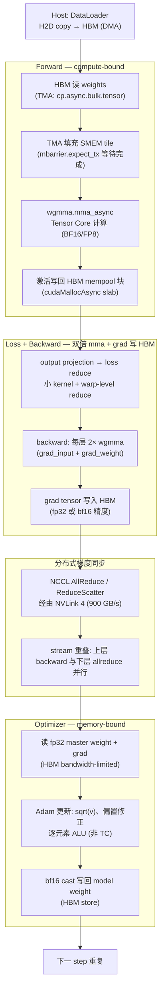

# 23 · 模型训练全栈串联 — 一次 step 如何调度全部 GPU 组件

> **一次 training step = forward + backward + optimizer + 梯度同步,几乎触发前 22 章所有 GPU 组件;理解串联关系是定位训练性能瓶颈的前提。**

## 1. 是什么 / 为什么有它

深度学习训练的最小执行单元是 training step:给定一个 mini-batch,模型完成前向传播(forward)计算损失,再完成反向传播(backward)计算每层参数的梯度,随后优化器更新参数,最后在多卡场景下同步梯度。这四个阶段看似简单,背后却几乎调用了前 22 章覆盖的每一个硬件组件和软件抽象:HBM 中存放权重、激活、梯度;TMA 负责异步搬运权重 tile;wgmma Tensor Core 执行矩阵乘法;SMEM 充当 tile 缓冲;mbarrier 协调异步完成通知;NCCL 经由 NVLink 完成梯度 AllReduce;CUDA Streams 让通信与计算重叠;CUDA Graphs 消除重复 launch 开销。

单 kernel 微基准测试的优化直觉在 training step 粒度往往失效。例如,单独测 wgmma 利用率很高,但在真实训练中 NCCL AllReduce 可能阻塞后续 forward,导致整体 GPU 利用率只有 40%。只有从 step 粒度出发,同时观察算子层、显存层、分布式通信层和调度层,才能准确定位瓶颈、制定有效优化方案。

本章以 Transformer 模型在 Hopper H100 上的单机多卡训练为主线,串联前 22 章的知识点,形成从硬件到框架的完整认知链路。

## 2. 硬件视角(组件触发链)

一次 Transformer training step 在硬件层面的组件触发顺序如下图所示:



**各阶段硬件特征:**

前向传播是 compute-bound 阶段。每层 attention 和 FFN 的核心计算是大矩阵乘(GEMM),在 Hopper 上由 wgmma.mma_async 指令驱动 Tensor Core 执行。权重 tile 经 TMA 异步搬运到 SMEM,再由 wgmma 消费,mbarrier 负责相位同步。激活值写回 HBM mempool 块(由 PyTorch 的 caching allocator 或 cudaMallocAsync 管理),以便 backward 阶段复用。forward 的算术强度通常远超 Hopper 的 HBM 带宽屋檐斜率,因此 Tensor Core 利用率是主要关注指标。

反向传播的 FLOPs 约为 forward 的两倍:每层需要同时计算 grad_input(用于继续反传)和 grad_weight(用于更新参数),均为 GEMM 操作。同时,backward 需要从 HBM 读回 forward 时保存的激活值(或使用 activation checkpointing 重算),导致额外的 HBM 读写压力。

优化器(Adam / AdamW)是 memory-bound 阶段。Adam 维护 fp32 精度的 master weight、一阶矩 m 和二阶矩 v,逐元素更新后 cast 为 bf16 写回 model weight。更新操作算术强度极低(几乎每读一次 HBM 只做少量 ALU),因此 HBM 带宽是主要瓶颈,Tensor Core 几乎不参与。

梯度同步经由 NCCL。在 DDP 中,backward 结束后触发 AllReduce;在 FSDP 下,backward 期间触发 ReduceScatter,forward 前触发 AllGather。NCCL 使用独立 CUDA stream,通过 NVLink 4(单机 900 GB/s 双向)传输,理想情况下与 compute stream 完全重叠,使通信时间被隐藏在计算时间内。

## 3. CUDA / 框架编程接口

**分布式训练框架:**

PyTorch 提供两套主流分布式训练接口。`torch.nn.parallel.DistributedDataParallel`(DDP)在每个 GPU 上维护完整模型副本,backward 结束后自动触发 `torch.distributed.all_reduce` 同步梯度;实现简单但每卡显存开销等于完整模型参数量。`torch.distributed.fsdp.FullyShardedDataParallel`(FSDP)将参数、梯度、优化器状态按数据并行度均匀分片,每卡只持有 1/N 的参数,通过 AllGather 在 forward/backward 前临时重建完整层,通过 ReduceScatter 在 backward 后分发梯度。

DeepSpeed ZeRO-3 提供与 FSDP 类似的参数 sharding 功能,通过 `deepspeed.initialize()` 一键接入。Megatron-LM 在 ZeRO 的基础上叠加 Tensor Parallelism(矩阵按行/列切分,层内 AllReduce)和 Pipeline Parallelism(层间切分,1F1B 调度),用于千亿参数规模的训练。

**CUDA 层接口:**

`torch.cuda.amp.autocast(dtype=torch.bfloat16)` 在 context manager 内自动将 eligible 操作 cast 为 bf16,配合 `torch.cuda.amp.GradScaler`(fp16 场景用于防止梯度下溢)实现混合精度训练。`torch.cuda.graph()` 可将固定 shape 的 training step 捕获为 CUDA Graph,重放时绕过 Python 解释器和 CUDA launch API 的逐次调用,将每 step 数百次 kernel launch 的开销从数毫秒降到数十微秒。`torch.distributed.all_reduce` 是 NCCL AllReduce 的 PyTorch 封装入口。

## 4. 关键性能指标

**MFU(Model FLOPs Utilization):** 定义为 `实际执行 FLOPs / (step 时间 × GPU 峰值算力)`。对于 Transformer 训练,FLOPs 近似为 `6 × P × tokens_per_step`(P 为参数量,系数 6 来自 forward + backward 的 fwd≈1×、bwd≈2× 之和)。Hopper H100 上 bf16 训练的良好水平约为 MFU 50-60%;低于 30% 通常意味着通信阻塞、显存不足导致的碎片化或 launch overhead 过高。

**HBM 带宽利用率(HBW):** optimizer step 阶段的瓶颈指标。用 NSight Compute 查看 `l1tex__m_l2_read_hit_rate` 和 HBM 读写带宽。

**扩展效率(Scaling Efficiency):** `实际 N 卡吞吐 / (单卡吞吐 × N)`,反映通信与计算重叠的质量。FSDP + NVLink 场景下良好水平为 90% 以上。

**NCCL bus 带宽:** 单 step AllReduce 的持续带宽与 NVLink 峰值之比,用 `nccl-tests` 基准测量。

**Tokens/sec/GPU:** 最终生产指标,综合体现所有层面的优化效果。

**反模式提示:** 缺少 CUDA Graph capture 时每 step 约有 5 µs × 数百次 launch 的累积开销,对短 step 影响显著;梯度同步阻塞下一个 forward 导致 GPU 空转;fp32 master weight 与 bf16 compute 混用但 GradScaler 配置不当,导致梯度下溢或精度漂移;activation checkpointing 未启用时大模型 batch 受限于 HBM 容量。

## 5. 代码示例

```python
# training_step.py — PyTorch FSDP + AMP + CUDA Graph 伪代码
# 每行注释标注命中的 GPU 组件

import torch
import torch.distributed as dist
from torch.distributed.fsdp import FullyShardedDataParallel as FSDP
from torch.cuda.amp import autocast, GradScaler

# 初始化 FSDP(ZeRO-3 语义:参数/梯度/优化器状态均 shard)
model = FSDP(model, device_id=local_rank)   # 参数 shard 到 HBM
optimizer = torch.optim.AdamW(model.parameters(), lr=1e-4)
scaler = GradScaler()   # 仅 fp16 时需要;bf16 可省略 scaler

# —— CUDA Graph capture(固定 shape 时启用)——
# g = torch.cuda.CUDAGraph()
# with torch.cuda.graph(g):
#     <以下 forward+backward 在 graph 内捕获>

for batch in loader:
    # H2D copy → HBM (DMA,不占用 SM)
    inputs = batch["input"].to(device, non_blocking=True)
    labels = batch["label"].to(device, non_blocking=True)

    optimizer.zero_grad(set_to_none=True)

    # Forward: TMA 搬运 weight tile → SMEM → wgmma TC 计算 → 激活写 HBM
    with autocast(dtype=torch.bfloat16):
        output = model(inputs)                   # FSDP AllGather 重建完整层
        loss = criterion(output, labels)         # 小 kernel + warp-level reduce

    # Backward: 双倍 wgmma + grad 写 HBM
    # FSDP: reduce_scatter 与最后一层 backward 在不同 stream 上重叠
    scaler.scale(loss).backward()

    # NCCL ReduceScatter(FSDP)已在 backward 期间触发 → NVLink 传输
    # optimizer step: 读 fp32 master + grad → Adam 更新 → bf16 cast 写回
    scaler.step(optimizer)     # memory-bound: HBM r/w 主导
    scaler.update()            # fp32 master weight 更新

    # 若使用 CUDA Graph: g.replay() 替换上面整个 for 循环体
```

## 6. 实测手段

**NSight Systems(系统级时间线):** 用 `nsys profile -t cuda,nvtx,nccl python train.py` 采集,在 GUI 时间线上可直接观察 NCCL AllReduce 与 compute kernel 是否真正重叠。若两者串行(存在明显间隙),说明 stream 配置或 FSDP 重叠参数有问题。

**NSight Compute(kernel 级指标):** 用 `ncu --set full kernel` 查看 wgmma 的 Tensor Core throughput(`sm__inst_executed_pipe_tensor_op_hmma.avg.pct_of_peak_sustained_active`)和 HBM 带宽利用率。对 optimizer kernel 单独采集,确认是否处于 memory-bound 状态。

**PyTorch Profiler:** `torch.profiler.profile(activities=[ProfilerActivity.CUDA, ProfilerActivity.CPU], with_stack=True)` 生成 Chrome Trace,可在浏览器中查看每层 forward/backward/optimizer 的时间分布。

**显存快照:** `torch.cuda.memory._snapshot()` 输出 HBM 中各 tensor 的实时分布,用于定位 activation 占用过高或 mempool 碎片化问题。

**MFU 计算公式:**

```python
mfu = (6 * num_params * tokens_per_step) / (step_time_sec * peak_bf16_flops)
# peak_bf16_flops: H100 SXM5 = 989e12 (989 TFLOPS, dense)
# tokens_per_step = batch_size * seq_len
```

## 7. 训练侧优化方法体系

本节按组件层级分类列出 8-12 个成熟的训练优化方法,每项标注命中组件与适用场景。

**算子层优化:**

- **算子融合 — FlashAttention-3 / Apex fused layer-norm:** FlashAttention-3(arxiv.org/abs/2407.08608)将 QK^T softmax V 的全部计算融合为单一 kernel,利用 Hopper wgmma + TMA 实现 pingpong pipeline,将 attention 的 HBM 读写从 O(N²) 降至 O(N)。Apex fused layer-norm 将归一化与参数更新融合,消除额外的 HBM 读写。命中:HBM、SMEM、TC。适用:所有 Transformer 训练。

- **FP8 训练(Hopper TC FP8):** 使用 `torch.float8_e4m3fn` 存储 weight、`e5m2` 存储 gradient,配合 Transformer Engine 的逐层动态缩放,Tensor Core 吞吐相对 bf16 翻倍。命中:TC、HBM(带宽减半)。适用:Hopper 及以上,需框架支持 FP8 梯度流。

- **混合精度训练(bf16 compute + fp32 master):** `autocast(dtype=torch.bfloat16)` 使 GEMM 在 bf16 精度下运行,优化器在 fp32 master weight 上更新。相较 fp16,bf16 动态范围更大,无需 loss scaling。命中:TC、HBM。适用:几乎所有现代训练。

**显存层优化:**

- **Activation Checkpointing(梯度检查点):** backward 时不从 HBM 读取保存的激活,而是重新执行 forward 计算。用约 33% 额外 FLOPs 换取激活显存降低至 O(√N)。命中:HBM(读减少)、TC(重算增加)。适用:batch size 受限于显存时。

- **Selective Recompute(选择性重算):** 只对算术强度低的层(如 attention softmax)重算,对高算术强度层(大 GEMM)保留激活。在显存节省与 FLOPs 开销之间取得更优平衡。命中:HBM、TC。适用:FlashAttention-3 内置此策略。

- **Gradient Accumulation(梯度累积):** 累积 N 个 micro-batch 的梯度再触发一次 AllReduce,降低有效通信频率 N 倍。在小 GPU 数量下模拟大 batch 训练时特别有效。命中:HBM(grad 累积)、NVLink(通信减少)。

**分布式层优化:**

- **ZeRO-1/2/3 与 FSDP — 参数/梯度/优化器状态分片:** ZeRO-1 只 shard 优化器状态(显存节省约 4×),ZeRO-2 叠加梯度 shard,ZeRO-3/FSDP 三者全 shard(显存节省 N×)。命中:HBM(每卡只持有 1/N 参数)、NVLink(AllGather + ReduceScatter)。适用:参数量超单卡 HBM 容量时。

- **Tensor Parallelism(Megatron-LM TP):** 将大矩阵乘沿行/列维度切分到多卡,每层内通过 AllReduce 拼接结果。相比 FSDP 通信量更可预测,适合 NVLink 内部通信延迟低的场景。命中:TC、NVLink。适用:超大隐藏维度模型,层内通信量可接受时。

- **Pipeline Parallelism(1F1B 调度):** 将模型层按深度切分到不同 GPU,使用 micro-batch 流水线调度(1 Forward 1 Backward 交替)减少 bubble 比例。命中:所有 SM、NVLink(层间 P2P 传输)。适用:ZeRO + TP 仍不足以装下模型时。

- **Sequence Parallelism:** 沿 sequence 维度切分 attention 和 layer-norm,配合 TP 减小单卡激活显存。命中:HBM(激活减小)、NVLink(sequence 维度 AllGather)。适用:超长序列(>4K)训练。

**调度层优化:**

- **Compute-Comm 重叠(FSDP 重叠策略):** FSDP 将最后几层的 ReduceScatter 与前几层的 backward 计算发射到不同 CUDA stream,使 NVLink 传输与 Tensor Core 计算并行执行。命中:NVLink、CUDA Streams。适用:NVLink 带宽充足(DGX H100 场景)时通信几乎完全隐藏。

- **CUDA Graph Training Step Capture:** 对固定 shape 的 training step 调用 `torch.cuda.graph()` 捕获,重放时完全绕过 Python 和 CUDA Runtime 的 launch 路径。每 step 节省数百次 kernel launch 的累积开销(约 2-10 ms/step 视 step 复杂度)。命中:CUDA Graphs、GigaThread 引擎。适用:固定 batch shape、不含动态控制流的训练循环。

## 8. 延伸阅读

- **PyTorch DDP / FSDP 文档:** [https://pytorch.org/docs/stable/distributed.html](https://pytorch.org/docs/stable/distributed.html) — DDP、FSDP、`torch.distributed` 集合通信 API 参考。
- **Megatron-LM:** [https://github.com/NVIDIA/Megatron-LM](https://github.com/NVIDIA/Megatron-LM) — 张量并行 + 流水并行 + 序列并行实现,含 GPT/T5/BERT 预训练脚本。
- **DeepSpeed ZeRO:** [https://deepspeed.ai](https://deepspeed.ai) — ZeRO-1/2/3、ZeRO-Infinity、ZeRO-R(激活重算)文档与论文。
- **ZeRO 论文:** [https://arxiv.org/abs/1910.02054](https://arxiv.org/abs/1910.02054) — Rajbhandari et al. 2020,ZeRO 原始设计与显存分析。
- **FlashAttention-3 论文:** [https://arxiv.org/abs/2407.08608](https://arxiv.org/abs/2407.08608) — Shah et al. 2024,Hopper wgmma + TMA 实现 attention 的 pingpong pipeline。
- **Transformer Engine / Hopper FP8 Training Guide:** [https://docs.nvidia.com/deeplearning/transformer-engine/](https://docs.nvidia.com/deeplearning/transformer-engine/) — NVIDIA 官方 FP8 训练接口、逐层动态缩放策略与精度保证。
