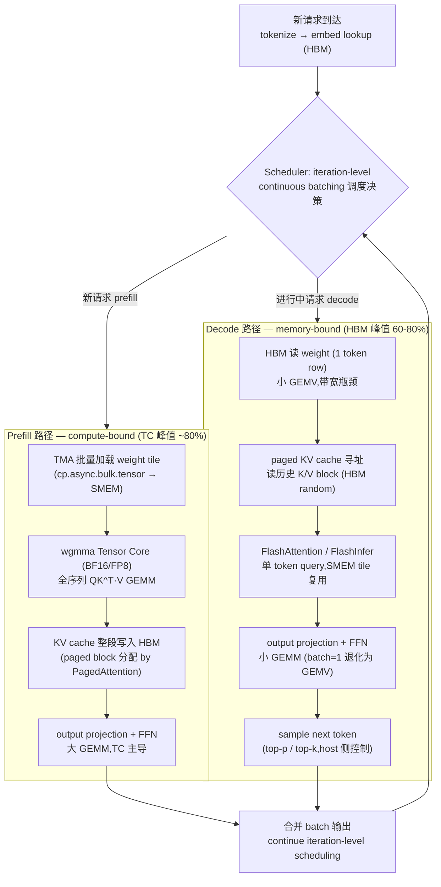

# 24 · 模型推理全栈串联 — prefill 与 decode 如何调度全部 GPU 组件

> **LLM 推理由 prefill(处理输入 prompt)和 decode(逐 token 生成)两阶段组成:prefill 是 compute-bound,decode 是 memory-bound;两者的硬件瓶颈与优化策略截然不同。**

## 1. 是什么 / 为什么有它

大语言模型的在线推理服务与训练在硬件利用模式上存在根本差异。训练以固定 batch 反复执行完整 forward+backward,算术强度高,Tensor Core 利用率容易打满。推理则分为两个截然不同的阶段:prefill 阶段一次性处理整个输入 prompt,属于 compute-bound 的大 GEMM 操作;decode 阶段每步只生成一个 token,每次只需对全量参数矩阵做矩阵-向量乘(GEMV),属于严重 memory-bound 操作。这一根本差异决定了两个阶段的优化策略几乎相反:prefill 优化关注如何最大化 Tensor Core 利用率,decode 优化关注如何最大化 HBM 带宽利用率并减少每步需要读取的数据量。

大多数生产 serving 系统的 GPU 时间主要消耗在 decode 阶段——prompt 只处理一次,而生成 token 数量可以是 prompt 长度的数倍甚至十数倍。decode 阶段的每个 attention 层需要从 HBM 读取随请求序列长度增长的 KV cache,且每步只生成一个 token 导致 batch 维度无法有效增大,硬件利用率极低。KV cache 的显存管理方式直接决定可同时服务的请求数量,进而决定整体吞吐和每 token 成本。理解 prefill 与 decode 在硬件层面的差异,是选择量化策略、batching 方案和 KV cache 管理机制的基础,也是定位推理延迟瓶颈的前提。

推理系统的核心工程挑战是在延迟 SLA(如 TPOT < 100 ms)约束下最大化吞吐(tokens/sec/GPU)。这两个目标往往相互制约:增大 batch size 提升吞吐但增加延迟;激进量化降低延迟但可能影响精度。生产系统需要在给定 SLA 约束下找到最优的硬件配置(GPU 数量、型号)、并行策略(TP 大小)、量化方案(FP8/INT8/INT4)和 batching 策略(continuous batching 的 max batch tokens)的组合。本章串联前 22 章知识点,给出 vLLM、TensorRT-LLM、SGLang 等主流推理框架的完整配置,以及关键的实测数字和优化决策树。

另一个值得关注的工程现实是:推理系统的瓶颈随时间动态变化。系统刚上线时请求量低,单流延迟是主要矛盾,speculative decoding 和 prefix caching 的价值最大;随着并发增长,batch size 增大后 GEMV 变为有效 GEMM,compute-bound 比例上升,此时 FP8 量化和 FlashAttention 的价值更突出;当 KV cache 接近耗尽时,内存管理策略(KV 量化、前缀驱逐策略)成为制约系统容量的关键。因此,推理系统的性能调优不是一次性工作,而需要在整个生命周期内根据实际负载特征持续调整优化策略。

## 2. 硬件视角(prefill 与 decode 组件触发链)

一次 LLM 推理请求在硬件层面的完整路径如下图所示:



**continuous batching 调度周期 sequenceDiagram(多请求异步加入 → 拼 prefill chunk + decode → 一次 forward → sample → 完成释放):**

```mermaid
sequenceDiagram
    participant CLI as 客户端请求
    participant SCHED as Scheduler
    participant GPU as GPU Forward
    participant HBM as KV Cache (HBM)

    Note over CLI,HBM: 异步请求到达 + iteration 级别调度

    CLI->>SCHED: Req-A 到达 (prompt=512 tokens)
    CLI->>SCHED: Req-B 到达 (prompt=128 tokens, 已 decode 第 3 步)
    SCHED->>GPU: 选 batch: [Req-A prefill chunk(128 tok) + Req-B decode(1 tok)]
    GPU->>HBM: Req-A: 写 KV block(128 tok); Req-B: 读历史 KV(3 blocks)
    GPU->>SCHED: 输出 logits (A: 部分prefill done; B: token_4)
    SCHED->>CLI: Req-B token_4 流式返回

    Note over SCHED: 下一 iteration
    SCHED->>GPU: [Req-A prefill chunk(128 tok) + Req-B decode(1 tok) + Req-C新请求...]
    GPU->>HBM: Req-A: 继续写 KV; Req-B: 读更多 KV; Req-C: 分配新 block
    GPU->>SCHED: 输出 logits; Req-A prefill 完成 → 转 decode 阶段
    SCHED->>CLI: Req-B token_5; Req-A token_1 流式返回

    Note over SCHED,HBM: 请求完成 → 立即释放 KV block,无需等待整批完成
    SCHED->>HBM: Req-B 完成 → release KV blocks → 供新请求使用
```

**prefill 阶段硬件特征:** 对 prompt 长度为 L 的请求,attention 层执行 L×d 维度的大型 GEMM 操作,算术强度随 L 线性增长。实测 prefill 阶段在 L > 512 时 Tensor Core 利用率约 75~85%,接近 compute-bound 峰值。TMA 负责异步搬运 weight tile 到 SMEM,wgmma 以 warp-group 粒度消费 tile,mbarrier 协调 pipeline 阶段切换。KV cache 在 prefill 结束时整段写入 HBM 的 paged block,以供后续 decode 步骤读取。FlashAttention-3 在 prefill 阶段将 attention 的 HBM I/O 从 O(L²) 降至 O(L),对长 prompt 的 FTL 改善显著。Sarathi-Serve 的 chunked prefill 策略将长 prompt 切分为多个固定大小的 chunk,每个 iteration 只处理一个 chunk,使 prefill 请求与 decode 请求在同一 batch 内交错执行,避免长 prefill 占用 GPU 导致 decode 请求延迟飙升。

**decode 阶段硬件特征:** 每步只处理 1 个 token(或 batch 内所有请求各自的当前 token),weight 矩阵依然完整但输入只有一行,GEMM 退化为 GEMV,算术强度约为 `hidden_dim / (2 × batch_size)`。当 batch_size < 32 时,decode 几乎总是 memory-bound,Tensor Core 利用率极低(< 5%)而 HBM 带宽利用率应尽量高(目标 > 70%)。多个并发请求共享同一 batch 的 decode forward,scheduler 在 iteration 级别决定哪些请求参与本轮 batch,新请求在任意时刻加入、已完成请求立即退出。paged KV cache 以固定大小的物理 block(每 block 16 或 32 token)管理 HBM 空间,通过 block_table 页表实现逻辑连续访问,消除内存碎片。

## 3. CUDA / 框架编程接口

推理系统的框架选择在很大程度上决定了优化策略的实施难度和最终性能上限。vLLM 以其 PagedAttention 和 continuous batching 的开拓性设计成为开源社区最广泛使用的推理框架,提供从 Python API 到 OpenAI 兼容 HTTP 服务的完整栈;TensorRT-LLM 则是 NVIDIA 官方的高性能推理引擎,通过静态编译将模型图优化到硬件指令级别,INT8/FP8 量化和 inflight batching 的性能通常比 vLLM 高 10~30%;SGLang 专注于结构化生成和前缀缓存,其 RadixAttention 实现了基于基数树的 KV cache 复用,对 RAG 场景和多轮对话的 FTL 改善显著;FlashInfer 提供了高性能的 paged attention kernel 库,被 vLLM 和 SGLang 等框架作为底层 kernel 使用。

生产系统通常不会从零开始实现推理服务,而是在上述框架之上进行配置优化和业务集成。理解各框架的关键配置参数是工程师必备技能。

**vLLM 关键配置(生产推荐):**

```python
from vllm import LLM, SamplingParams

llm = LLM(
    model="meta-llama/Meta-Llama-3-70B-Instruct",
    tensor_parallel_size=8,          # TP=8: 机箱内 8 GPU NVLink 切分
    gpu_memory_utilization=0.95,     # 将 95% HBM 分配给 KV cache
    enable_prefix_caching=True,      # RadixAttention KV 前缀复用
    max_num_seqs=256,                # 最大并发请求数
    quantization="fp8",              # FP8 weight + activation
)
sampling_params = SamplingParams(temperature=0.8, top_p=0.95, max_tokens=512)
outputs = llm.generate(prompts, sampling_params)
```

**TensorRT-LLM engine 构建流程:**

```bash
# 1. 从 HuggingFace checkpoint 转换并量化为 TRT-LLM engine
trtllm-build \
    --checkpoint_dir ./llama-70b-hf \
    --output_dir ./llama-70b-trtllm \
    --gemm_plugin float16 \          # GEMM 插件: 启用高效 GEMM 内核
    --gpt_attention_plugin float16 \ # attention 插件: FlashAttention 路径
    --max_batch_size 64 \
    --max_input_len 4096 \
    --max_output_len 1024 \
    --tp_size 8 \                    # Tensor Parallel = 8
    --int8_kv_cache                  # KV cache 量化为 INT8
```

**SGLang RadixAttention + FlashInfer 配置:**

```python
from sglang import Engine

engine = Engine(
    model_path="meta-llama/Meta-Llama-3-70B-Instruct",
    tp_size=8,
    enable_radix_cache=True,    # RadixAttention: 基数树前缀 KV 复用
    attention_backend="flashinfer",  # FlashInfer paged attention kernel
    mem_fraction_static=0.85,   # 静态分配 HBM 比例(含 KV cache)
)
```

FlashInfer 的 paged attention kernel 相比 vLLM 原始 PagedAttention kernel 在 decode 阶段有约 10~20% 的性能提升,主要来自更激进的 SMEM 利用和针对 paged 访问模式的 warp 级优化。SGLang 的 RadixAttention 将 KV cache 组织为基数树(Radix Tree)数据结构,具有相同 token 前缀的多个请求可以共享树上的同一 KV cache 节点,前缀 KV 的 HBM 占用降低为 1/N(N 为共享请求数)。这对于 RAG 场景(多个问题共享同一检索文档作为 context)或多轮对话(共享 system prompt)的 FTL 改善可达 30~70%。

## 4. 关键性能指标

推理系统的性能指标体系与训练完全不同,需要同时关注延迟和吞吐两个维度,因为两者在 SLA 约束下相互制约。

**First-Token Latency(FTL,首 token 延迟):** prefill 阶段完成时间,与 prompt 长度和模型参数量成正比。SLA 要求苛刻的实时对话场景通常要求 FTL < 1 s;对于 Llama-3-70B 在 H100×8 上的 bf16 推理,1024 token prompt 的 FTL 约 200~400 ms;使用 chunked prefill + prefix caching 可将有效 FTL 降至约 50~100 ms。

**Time-Per-Output-Token(TPOT,每 token 延迟):** decode 阶段每生成一个 token 的平均延迟。单流请求(batch=1)时受 HBM 带宽限制:`TPOT ≈ 2 × 参数量(字节) / HBM_bandwidth`。以 Llama-3-70B INT8 KV cache 在 H100 × 8 上为例,参数量约 70 GB,HBM 带宽约 8 × 3350 GB/s = 26800 GB/s 峰值,理论 TPOT ≈ 2 × 70 / 26800 ≈ 5.2 ms,实测约 6~8 ms(受 paged KV 随机访问开销影响)。

**Throughput(tokens/sec/GPU):** 整体吞吐,在大 batch 下测量,是成本效益的核心指标。

**关键实测数字(H100 SXM5,典型生产配置):**

| 模型 | 配置 | GPU | 吞吐 | TPOT |
|---|---|---|---|---|
| Llama-3-70B INT8 KV | vLLM, TP=8, batch=128 | H100×8 | ~1500 tokens/s/GPU | ~8 ms |
| Llama-3-70B FP8 | TRT-LLM, TP=8, fp8 | H100×8 | ~1.8× vs bf16 | ~6 ms |
| Llama-3-70B INT4 (AWQ) | vLLM, TP=8, awq | H100×8 | ~2× vs bf16 | ~4 ms |
| Llama-3-405B INT4 | vLLM, TP=8, awq | H100×8 | ~50 tokens/s/req | ~20 ms |

数据来源:vLLM 官方 benchmark + NVIDIA TRT-LLM 实测。

**PagedAttention 内存效率:** 相比静态预分配 KV cache,PagedAttention 将 HBM 碎片率从约 50% 降至约 5%,等效 batch size 可增大约 4×,系统吞吐相应提升。

**推理阶段性能比值(prefill vs decode):** prefill 在 TC 利用率方面约达峰值 80%,受计算限制;decode 在 HBM 带宽利用率方面约达峰值 60~80%(因 paged KV 随机访问损耗约 20~40% 带宽效率)。speculative decoding(EAGLE-2)可将低并发场景的 decode 速度提升 3~4×。

**KV cache bytes/token:** `2 × num_layers × num_heads × head_dim × dtype_bytes`。Llama-3-70B(80 层,64 头,128 维,bf16)每 token KV cache 约 2.5 MB,8K 序列长度时单请求 KV cache 约 20 GB——FP8 KV 量化将此降至约 10 GB,INT8 KV 约 10 GB,显著扩大可服务的并发请求数。

## 5. 代码示例

```python
# vllm_inference.py — vLLM PagedAttention + continuous batching 完整示例

from vllm import LLM, SamplingParams
import time

# 生产配置: TP=8, FP8 量化, 前缀缓存
llm = LLM(
    model="meta-llama/Meta-Llama-3-70B-Instruct",
    tensor_parallel_size=8,
    gpu_memory_utilization=0.95,     # 95% HBM 给 KV cache
    enable_prefix_caching=True,      # 共享 system prompt KV
    quantization="fp8",              # FP8 weight + activation
    max_num_seqs=256,                # 最大并发请求
    max_model_len=8192,              # 最大序列长度
)

# 同一 system prompt 的多个用户请求 — prefix caching 自动复用 KV
system_prompt = "You are a helpful assistant. " * 100  # 共享前缀
prompts = [
    system_prompt + f"Question {i}: What is {i}+{i}?"
    for i in range(64)
]

sampling_params = SamplingParams(
    temperature=0.8,
    top_p=0.95,
    max_tokens=256,
)

t0 = time.time()
outputs = llm.generate(prompts, sampling_params)
elapsed = time.time() - t0

total_tokens = sum(len(o.outputs[0].token_ids) for o in outputs)
print(f"Throughput: {total_tokens/elapsed:.0f} tokens/sec")
print(f"First output: {outputs[0].outputs[0].text[:100]}")
```

代码中几个关键配置值得解释:第一,`gpu_memory_utilization=0.95` 将 95% 的 HBM 预留给 KV cache,这是 continuous batching 下 HBM 最大化利用的关键参数,过低则并发请求数受限,过高则可能触发 OOM;第二,`enable_prefix_caching=True` 启用 RadixAttention 前缀 KV 复用,在所有请求共享同一 system prompt 时可将首批请求的 FTL 降低 40~70%;第三,`max_num_seqs=256` 控制 scheduler 的最大活跃请求数,应根据可用 KV cache 容量和平均序列长度来调整,避免频繁触发 KV cache 驱逐。实际调参时建议从 `gpu_memory_utilization=0.90` 开始,逐步提高到 0.95,同时观察 `/metrics` 中的 `gpu_cache_usage_perc`:若在峰值负载下该值长期低于 80%,说明可以继续提高利用率;若频繁达到 95% 以上并触发 preemption,则应适当降低或增加 GPU 数量。

## 6. 实测手段

推理系统的性能分析需要关注系统级时间线、KV cache 利用率和 scheduler 行为三个维度。与训练不同,推理的瓶颈往往不在单个 kernel 内部,而在于 scheduler 调度效率、KV cache 管理策略和通信开销的整体协调。

**NSight Systems:** `nsys profile -t cuda,nvtx python serve.py` 观察 prefill 与 decode batch 的时间分布,统计每个 decode iteration 的时长即为 TPOT。重点检查 scheduler 空泡(GPU 等待 CPU 调度决策的间隙)。若 GPU 时间线出现规律性的短暂空闲(< 1 ms),通常是 scheduler 在做 batch 组装决策,可通过增大 batch token 上限或使用 CUDA Graph 消除。

**TensorRT-LLM benchmark 工具:** `benchmarks/cpp/gptManagerBenchmark` 给定 dataset + 并发请求数测量 FTL / TPOT / 吞吐,是评估 TRT-LLM engine 的标准手段。配合 `--concurrency` 参数扫描不同并发数下的延迟-吞吐曲线,找到满足 SLA 约束的最大吞吐点。

**vLLM metrics endpoint:** 运行中的 vLLM 服务通过 `/metrics` 暴露 Prometheus 格式的 KV cache 利用率(`vllm:gpu_cache_usage_perc`)、队列长度(`vllm:num_requests_waiting`)和当前 batch token 数。当 `gpu_cache_usage_perc` 持续 > 90% 时说明 KV cache 紧张,可能触发 preemption(暂停低优先级请求释放 KV),是 QoS 风险信号。

**NSight Compute 单 kernel 采集:** 对 attention kernel 单独采集 `ncu --kernel-name flash_attn_paged` 查看 SMEM 利用率、warp occupancy 和 HBM 读写带宽,确认 decode 阶段是否在 memory-bound 状态。`l2__read_hit_rate` 指标反映 KV cache 的 L2 命中率,对于短序列请求应 > 50%,长序列(> 4K tokens)因 KV cache 远超 L2 容量通常接近 0%。decode 阶段 HBM 带宽利用率低于理论峰值的 60% 时,原因通常是 paged KV cache 的随机访问导致 DRAM 行激活效率低,可尝试增大 KV block size(从 16 增至 32 token)来提升访问局部性。

```bash
# vLLM 离线 benchmark: 测量不同并发下的吞吐和延迟
python benchmarks/benchmark_throughput.py \
    --model meta-llama/Meta-Llama-3-70B-Instruct \
    --tensor-parallel-size 8 \
    --quantization fp8 \
    --input-len 512 --output-len 256 \
    --num-prompts 1000
```

## 7. 推理侧优化方法体系

本节按优化类别分组列出成熟的推理优化方法,每项标注命中组件、production 实测数字,以及何时不应使用该方法。

**PagedAttention(vLLM KV 分页管理)**

将 KV cache 组织为固定大小的物理 block(16 或 32 token/block),通过逻辑-物理 block_table 映射实现虚拟连续寻址,消除 KV cache 内存碎片。命中:HBM(paged 分配)、自定义 CUDA kernel。实测:相比静态预分配,HBM 碎片率从约 50% 降至约 5%,可服务并发请求数提升约 4×,系统吞吐相应提升约 4×。**何时不用:** 对于固定序列长度的批量推理(如离线翻译),静态分配反而更简单且 KV 访问更规则;PagedAttention 的 block_table 间接寻址会增加 decode attention kernel 约 5~10% 的延迟开销,在延迟极其敏感的低并发场景中需权衡。

**FlashAttention-3(Hopper 融合 attention)**

融合 QK^T softmax V 为单一 kernel,SMEM tile 复用消除中间结果 HBM 读写,prefill 阶段 HBM I/O 从 O(N²) 降至 O(N)。命中:SMEM、TC、HBM。实测:prefill FTL 改善约 2.6×;decode 单 token 场景收益较小(因 KV cache 随机读取主导)。**何时不用:** 序列长度极短(< 128 tokens)时 attention 不是瓶颈;Ampere 及以下需退回 Flash-2。

**Speculative Decoding(投机解码,EAGLE-2)**

用参数量小 5~10× 的 draft model 连续生成数个 candidate token,大 target model 一次并行 verify。接受则跳过大模型逐步生成,拒绝则回退。EAGLE-2 使用单独的 drafting 网络(约 1B 参数)配合 target model 的最后一层特征做 speculative draft,接受率约 80~90%。命中:TC(大模型并行 verify)、HBM(draft model 小,读取开销低)。实测:低并发(batch=1~4)场景 EAGLE-2 可获得约 3~4× decode 速度提升,相当于将 TPOT 从 20 ms 降至约 5~7 ms。**何时不用:** 高并发(batch > 16)场景 speculative decoding 引入的计算 overhead 超过收益;draft model 与 target model 的词汇分布差异大时接受率低,加速效果不显著。

**Continuous / Dynamic Batching(iteration-level 调度)**

在每个 decode iteration 级别重新组 batch,新请求随时加入、完成请求随时退出。命中:CUDA Streams(多请求并行)、scheduler。实测:相比静态 batching(等待整批完成),GPU 利用率从约 30% 提升到约 75%;混合请求长度场景吞吐提升约 3~5×。**何时不用:** 请求长度完全一致且到达时间规律时,静态 batching 的实现更简单且 CUDA Graph 更易利用;连续 batching 在 decode 阶段每步需要调度决策,scheduler CPU 开销约 0.5~2 ms,对 TPOT < 5 ms 的目标可能成为显著开销。

**Sarathi-Serve chunked prefill(分块 prefill 与 decode 混排)**

将长 prompt 的 prefill 分为固定大小的 chunk(如 128 token/chunk),每个 iteration 只处理一个 chunk,使 prefill 请求与 decode 请求在同一 batch 内交错执行。这样长 prefill 不会独占 GPU 导致 decode 请求延迟飙升,P99 TPOT 显著改善。命中:TC(prefill chunk)、HBM(decode KV 读取并发)。实测:混合负载下 decode P99 TPOT 从约 800 ms 降至约 150 ms;吞吐轻微降低约 5%(chunk 化增加 attention 的小 GEMM 开销)。**何时不用:** 纯 decode 场景(无新 prefill 请求)无收益;chunk 大小需要仔细调优,过小(< 64 tok)增加 scheduler overhead,过大(> 256 tok)与不分块效果接近。

**DistServe 分离式部署(prefill 与 decode 物理隔离)**

prefill 和 decode 部署在不同 GPU 集群上,分别针对 compute-bound 和 memory-bound 场景选择硬件配置。prefill 机器优化 TC 利用率(可选更多计算能力的 GPU),decode 机器优化 HBM 带宽(可选 HBM 容量更大的 GPU 或更多 GPU)。KV cache 在 prefill 完成后通过高速网络传输到 decode 机器。命中:NVLink / 网络(KV cache 传输)、TC(prefill)、HBM(decode)。实测:DistServe 在 prefill 密集负载下端到端吞吐提升约 1.5×,FTL 降低约 40%。**何时不用:** KV cache 传输带宽不足(< 100 GB/s)时传输延迟超过节省的计算时间;小规模集群(< 16 GPU)运营复杂度增加不值得;低负载时 prefill/decode 机器各自利用率都低。

**INT4 weight-only 量化(GPTQ / AWQ)**

GPTQ 通过逐层最小二乘校准将权重量化为 INT4,权重从 HBM 读取时节省 4× 带宽,decode TPOT 相应降低。AWQ 通过保护 salient weight 通道(激活乘权重幅值最大的通道)进一步提升精度。命中:HBM(带宽降低 4×)、TC(反量化后 INT8/FP16 GEMV)。实测:Llama-3-70B AWQ(INT4),H100×8 decode TPOT 从约 8 ms(bf16)降至约 4 ms,精度相比 bf16 PPL 退化约 0.1~0.3(可接受)。**何时不用:** prefill 阶段 INT4 量化对 GEMM 吞吐改善有限(prefill 是 compute-bound,而 INT4 主要节省 HBM 带宽);INT4 精度损失在需要精确数值的任务(数学推理、代码生成)上可能不可接受;group size 过大(> 128)时量化误差增大,应结合具体任务做精度评估。

**SmoothQuant W8A8(INT8 weight + INT8 activation)**

通过数学等价变换将激活量化难点转移到权重侧,使 INT8 GEMM 成为 prefill 阶段的主要计算路径。TC 在 INT8 精度下吞吐约为 bf16 的 2×。命中:TC(INT8 路径)、HBM(激活带宽降低)。实测:prefill 阶段吞吐提升约 1.5~1.8×,PPL 退化约 0.05~0.1。**何时不用:** 激活分布高度非均匀(如含有异常大激活值的模型)时平滑变换效果有限;decode 阶段 INT8 GEMM 对 GEMV 无帮助,收益集中在 prefill。

**FP8 推理(Hopper TC FP8)**

与训练侧 FP8 同精度路径,E4M3 weight + E5M2 activation,TC 吞吐相对 bf16 翻倍,精度损失极小。TensorRT-LLM 内置支持 Hopper FP8 engine 生成。命中:TC(FP8 路径)、HBM(带宽减半)。实测:decode 吞吐提升约 1.8×(同时受益于 weight 带宽和 TC 加速);prefill 提升约 2×。**何时不用:** Hopper 以下硬件无 FP8 TC 支持;FP8 量化对激活范围要求严格,过高的激活值会导致溢出,需要仔细选择 amax 校准方式。

**KV cache 量化(INT8 / FP8 KV)**

将历史 K/V cache 以 INT8 或 FP8 存储,每 token KV cache 显存减半,可同时服务的请求数相应翻倍,整体吞吐提升。decode attention kernel 在读取 KV 时动态反量化,引入约 5~10% 的延迟开销。命中:HBM(KV 存储减半)。实测:INT8 KV cache 使 Llama-3-70B 在 H100×8 上的最大并发请求从约 80 增至约 160,吞吐提升约 1.6×。**何时不用:** 极短序列(< 128 token)时 KV cache 本身不大,量化收益有限但引入额外复杂度;部分模型(如使用 GQA 的 Llama-3)KV head 数量已经很少,单请求 KV 本身不大,优先考虑增大 batch size。

**Multi-LoRA Serving(多适配器共享 base model)**

多个 LoRA adapter 共享同一 base model 参数,serving 时按请求动态切换 adapter(仅加载少量 delta 参数)。单 GPU 同时服务多任务/多客户场景,显存开销相比多模型部署大幅降低。命中:HBM(adapter 小)、SMEM(fused LoRA kernel)。实测:单 H100 同时服务 8 个不同 LoRA 任务的开销与服务 1 个任务基本相同,吞吐仅降低约 3~5%。**何时不用:** LoRA rank 很大(> 64)时 delta 参数量可观,切换 overhead 增加;请求的 LoRA 版本高度集中时,直接部署 1~2 个 LoRA 版本更简单。

**TP 推理(Tensor Parallel AllReduce)**

将 attention head 或 FFN 维度切分到多 GPU,每层 attention 和 FFN 后通过 NCCL AllReduce 拼接结果。减小单卡 HBM 占用(模型参数 1/N),同时分摊 HBM 带宽压力。命中:TC、NVLink(TP AllReduce)。实测:TP=8 将 Llama-3-70B 每卡参数量从 140 GB(fp16)降至约 17 GB,每步 AllReduce 开销约 2~5 ms(NVLink),被隐藏在 GEMM 计算时间内。**何时不用:** 单卡能装下模型时 TP 引入额外通信开销无谓;TP > 8 需要跨机箱通信,InfiniBand 延迟使 AllReduce 从 2 ms 增至 20~50 ms,总体性能反而下降。

**Prefix Caching(RadixAttention 前缀 KV 复用)**

对具有相同 token 前缀的多请求,prefill 时只计算一次 prefix 的 KV cache 并在 HBM 中缓存复用,后续请求的 prefill 从 prefix 末尾开始。SGLang 和 vLLM 均支持。命中:HBM(KV 复用)、TC(prefix prefill 跳过)。实测:多用户共享同一 system prompt(约 500 token)场景下,FTL 从约 300 ms 降至约 80 ms(73% 降幅)。**何时不用:** 所有请求的前缀各不相同时 RadixAttention 无法命中缓存,引入额外的树结构维护开销;KV cache 容量非常有限时 prefix cache 占用宝贵空间而用于 decode 的 KV block 不足,反而降低吞吐。

## 8. 延伸阅读

- **vLLM / PagedAttention 论文:** Kwon et al. "Efficient Memory Management for Large Language Model Serving with PagedAttention" (SOSP'23) — [https://arxiv.org/abs/2309.06180](https://arxiv.org/abs/2309.06180),paged KV cache 设计与 continuous batching 调度。
- **FlashAttention-3 论文:** Shah et al. "FlashAttention-3: Fast and Accurate Attention with Asynchrony and Low-precision" (2024) — [https://arxiv.org/abs/2407.08608](https://arxiv.org/abs/2407.08608),Hopper wgmma+TMA pingpong pipeline。
- **GPTQ 论文:** Frantar et al. "GPTQ: Accurate Post-Training Quantization for Generative Pre-trained Transformers" (ICLR'23) — [https://arxiv.org/abs/2210.17323](https://arxiv.org/abs/2210.17323),逐层最小二乘 INT4 量化。
- **AWQ 论文:** Lin et al. "AWQ: Activation-aware Weight Quantization for LLM Compression and Acceleration" (2023) — [https://arxiv.org/abs/2306.00978](https://arxiv.org/abs/2306.00978),保护 salient channel 的 INT4 量化。
- **SmoothQuant 论文:** Xiao et al. "SmoothQuant: Accurate and Efficient Post-Training Quantization for Large Language Models" (2023) — [https://arxiv.org/abs/2211.10438](https://arxiv.org/abs/2211.10438),激活量化难点迁移变换。
- **DistServe 论文:** Zhong et al. "DistServe: Disaggregating Prefill and Decoding for Goodput-optimized LLM Serving" (2024) — [https://arxiv.org/abs/2401.09670](https://arxiv.org/abs/2401.09670),prefill/decode 分离部署的资源调度。
- **Sarathi-Serve 论文:** Agrawal et al. "SARATHI: Efficient LLM Inference by Piggybacking Decodes with Chunked Prefills" (2023) — [https://arxiv.org/abs/2308.16369](https://arxiv.org/abs/2308.16369),chunked prefill 与 decode 混排调度。
- **SGLang 论文:** Zheng et al. "SGLang: Efficient Execution of Structured Language Model Programs" (2024) — [https://arxiv.org/abs/2312.07104](https://arxiv.org/abs/2312.07104),RadixAttention 前缀 KV 复用与结构化生成。
- **EAGLE-2 论文:** Li et al. "EAGLE-2: Faster Inference of Language Models with Dynamic Draft Trees" (2024) — [https://arxiv.org/abs/2406.16858](https://arxiv.org/abs/2406.16858),动态 draft tree 的投机解码实现。
- **TensorRT-LLM GitHub:** [https://github.com/NVIDIA/TensorRT-LLM](https://github.com/NVIDIA/TensorRT-LLM) — NVIDIA 官方 LLM 推理引擎,含 inflight batching、FP8/INT8 量化、CUDA Graph decode capture 完整实现。
