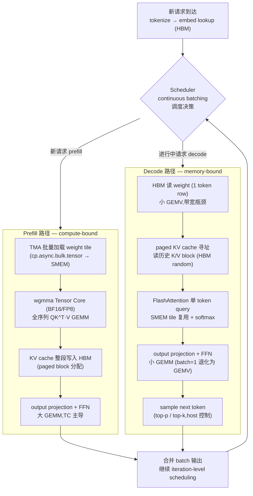

# 24 · 模型推理全栈串联 — prefill 与 decode 如何调度全部 GPU 组件

> **LLM 推理由 prefill(处理输入 prompt)和 decode(逐 token 生成)两阶段组成:prefill 是 compute-bound,decode 是 memory-bound;两者的硬件瓶颈与优化策略截然不同。**

## 1. 是什么 / 为什么有它

大语言模型的在线推理服务与训练在硬件利用模式上存在根本差异。训练以固定 batch 反复执行完整 forward+backward,算术强度高,Tensor Core 利用率容易打满。推理则分为两个截然不同的阶段:prefill 阶段一次性处理整个输入 prompt,属于 compute-bound GEMM 操作;decode 阶段每步只生成一个 token,每次只需对全部 KV cache 做一次矩阵-向量乘(GEMV),属于严重 memory-bound 操作。

大多数生产 serving 系统的 GPU 时间主要消耗在 decode 阶段——prompt 处理一次,而生成 token 数量可以是 prompt 长度的数倍。decode 阶段的每个 attention 层需要从 HBM 读取随请求序列增长的 KV cache,导致内存带宽成为核心瓶颈。KV cache 的显存管理方式直接决定可同时服务的请求数量,进而决定整体吞吐。

理解 prefill 与 decode 在硬件层面的差异,是选择量化策略、batching 方案和 KV cache 管理机制的基础,也是定位推理延迟瓶颈的前提。

## 2. 硬件视角(prefill 与 decode 组件触发链)

一次 LLM 推理请求在硬件层面的完整路径如下图所示:



**prefill 阶段硬件特征:** 对 prompt 长度为 L 的请求,attention 层执行 L×d 维度的 GEMM 操作,算术强度随 L 增长。TMA 负责异步搬运 weight tile 到 SMEM,wgmma 以 warp-group 粒度消费 tile,mbarrier 协调 pipeline 阶段切换。KV cache 在 prefill 结束时整段写入 HBM 的 paged block。此阶段的 First-Token Latency(FTL)与 prompt 长度成正比,瓶颈在 Tensor Core 吞吐。

**decode 阶段硬件特征:** 每步只处理 1 个 token(或等效的小 batch),weight 矩阵依然是完整的,但输入只有一行,GEMM 退化为 GEMV。每步需从 HBM 中读取所有已生成 token 的 K/V cache,I/O 量随生成长度线性增长。多个并发请求共享同一 CUDA stream 池,scheduler 在 iteration 级别决定哪些请求参与本轮 decode batch。Tensor Core 在 batch 足够大前利用率极低,主要瓶颈是 HBM 带宽。

**continuous batching:** vLLM 等框架在 iteration 级别(而非 request 级别)调度请求,新请求在任意时刻加入 decode batch,已完成请求立即退出,避免等到所有请求同时结束才释放 GPU 资源,GPU 利用率显著高于静态 batching。

## 3. CUDA / 框架编程接口

**推理框架:**

vLLM(`vllm.LLM` / `AsyncLLMEngine`)是目前最广泛使用的开源 LLM serving 框架,内置 PagedAttention 自定义 CUDA kernel(每个 KV block 16 或 32 个 token)、continuous batching scheduler 和 CUDA Graph decode capture。TensorRT-LLM(NVIDIA 官方)提供从 Hugging Face checkpoint 到优化 engine 的一键转换(`trtllm-build`),支持 INT8/FP8 量化、inflight batching 和 `Engine.refit()` 热更新权重。TGI(Hugging Face Text Generation Inference)、SGLang 和 DeepSpeed-MII 是其他主流选择,各有侧重(SGLang 专注 structured generation 与 prefix caching)。

**CUDA 层接口:**

`torch.cuda.graph()` 在 decode 阶段的 batch shape 固定时进行 Graph capture,重放时 launch 开销接近零。PagedAttention 的核心是一个自定义 CUDA kernel,通过 block_table(页表)将逻辑 KV cache 位置映射到 HBM 中的物理 block,消除 KV cache 的内存碎片。`cudaMallocAsync` 配合 MemPool 实现 KV cache slab 的流序分配与复用(第 18 章)。TensorRT-LLM 的量化 API 在 kernel launch 时自动选择 INT8/FP8 权重反量化路径,对调用侧透明。

## 4. 关键性能指标

**First-Token Latency(FTL,首 token 延迟):** prefill 阶段完成时间,与 prompt 长度和模型参数量成正比。SLA 要求苛刻的场景(如实时对话)通常要求 FTL < 1 s。

**Time-Per-Output-Token(TPOT,每 token 延迟):** decode 阶段每生成一个 token 的平均延迟。TPOT × 输出长度 = 总生成延迟。在 memory-bound 的单流请求场景,TPOT 受 HBM 带宽决定:`TPOT ≈ 2 × 参数量(字节) / HBM_bandwidth`(每步读全部参数一次,系数 2 来自 fwd)。

**Throughput(tokens/sec/GPU):** 整体吞吐,通常在 large batch 下测量,是成本效益的核心指标。

**KV cache bytes/token:** `2 × num_layers × num_heads × head_dim × dtype_bytes`。例如 LLaMA-3-70B(80 层,64 头,128 维,bf16)每 token KV cache 约 2.5 MB,8K 序列长度时单请求 KV cache 约 20 GB——分页管理与量化的重要性由此可见。

**HBM 带宽利用率:** decode 阶段目标 70% 以上,低于此值说明请求 batch 太小或调度存在空泡。

**反模式提示:** 静态 batching 在等待所有请求完成期间 GPU 大量空转(batch=1 时 decode HBM 利用率约 5%);KV cache 不分页导致内存碎片严重,无法装入更多请求;未使用 FlashAttention 时标准 attention 在 prefill 阶段反复读写 HBM,带宽消耗为 FlashAttention 的 O(N) 倍;INT8 weight-only 量化但忽略 activation 量化,prefill 阶段 TC 加速有限。

## 5. 代码示例

```python
# vllm_decode_step.py — vLLM PagedAttention decode 伪代码
# 每行注释标注命中的 GPU 组件

from vllm import LLM, SamplingParams

llm = LLM(
    model="meta-llama/Meta-Llama-3-70B-Instruct",
    dtype="bfloat16",
    quantization="awq",          # INT4 weight-only via AWQ
    max_num_seqs=256,            # 最大并发请求数
    enable_prefix_caching=True,  # 共享 system prompt KV
)

# —— decode step 内部逻辑示意(框架内部执行,非用户代码)——
def decode_step_internal(seq_group_batch, kv_cache_manager):
    # 1. q/k/v projection — GEMV (HBM read weights, memory-bound)
    q = q_proj(x)                              # HBM read weight → small GEMM
    k_new, v_new = kv_proj(x)                 # GEMV,带宽瓶颈

    # 2. paged KV cache 写入 — HBM paged block write
    block_table = kv_cache_manager.append(     # paged HBM write (cudaMallocAsync)
        k_new, v_new, seq_ids)

    # 3. PagedAttention kernel — SMEM tile 复用 + paged 寻址
    o = flash_attn_paged(                      # SMEM 主导;HBM paged random read
        q, kv_cache, block_table,
        causal=True, softmax_scale=head_dim**-0.5)

    # 4. output projection + FFN — TC GEMM (compute-bound at large batch)
    x = o_proj(o)                              # GEMV/GEMM,视 batch size
    x = ffn(x)                                 # TC GEMM or GEMV

    # 5. sample — host 侧控制,CPU 执行 top-p
    logits = lm_head(x)                        # 最后一层投影
    next_token = sample(logits, top_p=0.9)     # host 端 sampling

    return next_token
```

## 6. 实测手段

**NSight Systems:** `nsys profile -t cuda,nvtx python serve.py` 观察 prefill 与 decode batch 的时间分布,统计每个 decode iteration 的时长即为 TPOT。重点检查 scheduler 空泡(GPU 等待 CPU 调度决策的间隙)。

**TensorRT-LLM benchmark 工具:** `benchmarks/cpp/gptManagerBenchmark` 给定 dataset + 并发请求数测量 FTL / TPOT / 吞吐,是评估 TRT-LLM engine 的标准手段。

**vLLM metrics endpoint:** 运行中的 vLLM 服务通过 `/metrics` 暴露 Prometheus 格式的 KV cache 利用率、队列长度、当前 batch size,可直接接入 Grafana 监控。

**nvidia-smi / nvml:** `nvidia-smi dmon -s u` 实时监控 GPU 利用率;`nvidia-smi -q -d MEMORY` 查看 HBM 占用,间接反映 KV cache 填充程度。

**NSight Compute:** 单独采集 attention kernel(`ncu --kernel-name flash_attn_paged`)查看 SMEM 利用率、warp occupancy 和 HBM 读写带宽,确认是否在 memory-bound 状态。

**nccl-tests:** 在 Tensor Parallel 场景下,`all_reduce_perf` 验证 TP AllReduce 的持续带宽是否接近 NVLink 峰值。

## 7. 推理侧优化方法体系

本节按优化类别分组列出 12 个成熟的推理优化方法,每项标注命中组件与适用场景。

**Attention 优化:**

- **PagedAttention(vLLM):** 将 KV cache 组织为固定大小的物理 block(16 或 32 token/block),通过逻辑-物理 block_table 映射实现虚拟连续寻址。消除 KV cache 内存碎片,可服务的并发请求数提升 2-4×。命中:HBM(paged 分配)、自定义 CUDA kernel。适用:所有变长序列 serving 场景。

- **FlashAttention-2/3:** 将 QK^T softmax V 融合为单一 kernel,利用 SMEM tile 复用消除中间结果的 HBM 读写,prefill 阶段 HBM I/O 从 O(N²) 降至 O(N)。FlashAttention-3 进一步利用 Hopper wgmma + TMA 实现 pingpong pipeline。命中:SMEM、TC、HBM。适用:prefill 性能关键路径。

- **Speculative Decoding(投机解码):** 用参数量小 5-10× 的 draft model 连续生成数个 candidate token,大 target model 一次并行 verify。接受则跳过大模型逐步生成,拒绝则回退。在请求并发低时可获得 2-4× 速度提升。命中:TC(大模型并行 verify)、HBM(draft model 小)。适用:并发低、延迟敏感场景。

**Batching 优化:**

- **Continuous / Dynamic Batching(iteration-level scheduling):** 在每个 decode iteration 级别重新组 batch,新请求随时加入、完成请求随时退出,GPU 无需等待最慢请求。vLLM、TGI、TRT-LLM 均支持。命中:CUDA Streams(多请求并行)。适用:混合长度请求的 serving 场景。

- **Disaggregated Serving(分离式部署,DistServe / PD 分离):** prefill 和 decode 部署在不同机器或不同 GPU 上,分别针对 compute-bound 和 memory-bound 场景选择硬件配置。prefill 机器优化 TC 利用率,decode 机器优化 HBM 带宽。命中:NVLink / 网络(KV cache 传输)。适用:大规模集群,SLA 要求极严格时。

- **Multi-LoRA Serving(多 LoRA 适配器共享):** 多个 LoRA adapter 共享同一 base model 参数,serving 时按请求动态切换 adapter(仅加载少量 delta 参数到 SMEM 或 HBM)。单 GPU 同时服务多任务/多客户场景,显存开销相比多模型部署大幅降低。命中:HBM(adapter 小)、SMEM(fused LoRA kernel)。

**量化优化:**

- **INT4/INT8 Weight-only 量化(GPTQ / AWQ):** GPTQ(arxiv.org/abs/2210.17323)通过逐层最小二乘校准对权重做 INT4 量化;AWQ(arxiv.org/abs/2306.00978)通过保护 salient weight 通道进一步提升精度。decode 阶段权重从 HBM 读取量节省 2-4×,TPOT 相应降低。命中:HBM(带宽降低)。适用:decode memory-bound 场景,精度损失可接受时。

- **SmoothQuant 激活量化(INT8 weight + INT8 activation):** 将激活的量化难点通过数学等价变换迁移到权重侧,使 INT8 GEMM 成为 prefill 阶段的主要计算路径,TC 在 INT8 精度下吞吐比 bf16 再提升。命中:TC(INT8 路径)、HBM(带宽降低)。适用:prefill throughput 关键场景。

- **FP8 推理(Hopper TC FP8):** 与训练侧 FP8 同精度路径,E4M3 weight + E5M2 activation,TC 吞吐相对 bf16 翻倍,精度损失极小。TensorRT-LLM 内置支持 Hopper FP8 engine 生成。命中:TC(FP8 路径)。适用:Hopper 及以上硬件。

- **KV Cache 量化(INT8/FP8 KV):** 将历史 K/V cache 以 INT8 或 FP8 存储,每 token KV cache 显存减半,可同时服务的请求数相应翻倍。decode attention kernel 在读取 KV 时动态反量化。命中:HBM(KV 存储减半)。适用:长序列、大并发场景。

**调度优化:**

- **CUDA Graph Decode Capture:** decode 阶段 batch shape 固定时(continuous batching 使用 padded batch),调用 `torch.cuda.graph()` 或 TRT-LLM 的 graph capture API,将整个 decode step 捕获为 CUDA Graph 重放。每 step launch 开销降至接近零,TPOT 改善明显(尤其小 batch 时 launch 开销占比高)。命中:CUDA Graphs、GigaThread 引擎。

- **Prefix Caching(共享前缀 KV 复用):** 对具有相同 system prompt 前缀的多用户请求,prefill 时只计算一次 prefix 的 KV cache 并在 HBM 中缓存复用,后续请求的 prefill 从 prefix 末尾开始,FTL 大幅降低。SGLang 和 vLLM 均支持。命中:HBM(KV 复用)。适用:多用户共享 system prompt 的场景(RAG、chatbot 等)。

- **Tensor Parallel 推理(TP AllReduce):** 将注意力头或 FFN 维度切分到多 GPU,每层 attention 和 FFN 后通过 NCCL AllReduce 拼接结果。减小单卡 HBM 占用,同时分摊 HBM 带宽压力。命中:TC、NVLink(TP AllReduce)。适用:单卡装不下模型、或需要降低 decode 延迟时。

## 8. 延伸阅读

- **vLLM + PagedAttention 论文:** [https://github.com/vllm-project/vllm](https://github.com/vllm-project/vllm) — PagedAttention 论文 [https://arxiv.org/abs/2309.06180](https://arxiv.org/abs/2309.06180),Kwon et al. 2023。
- **FlashAttention-3 论文:** [https://arxiv.org/abs/2407.08608](https://arxiv.org/abs/2407.08608) — Shah et al. 2024,Hopper wgmma + TMA + pingpong pipeline 实现。
- **TensorRT-LLM:** [https://github.com/NVIDIA/TensorRT-LLM](https://github.com/NVIDIA/TensorRT-LLM) — NVIDIA 官方 LLM 推理引擎,含 inflight batching、FP8/INT8 量化、CUDA Graph 优化。
- **SGLang:** [https://github.com/sgl-project/sglang](https://github.com/sgl-project/sglang) — 支持 structured generation、RadixAttention prefix caching、多 LoRA 调度的高性能 serving 框架。
- **GPTQ 论文:** [https://arxiv.org/abs/2210.17323](https://arxiv.org/abs/2210.17323) — Frantar et al. 2022,逐层最小二乘 INT4 量化方法。
- **AWQ 论文:** [https://arxiv.org/abs/2306.00978](https://arxiv.org/abs/2306.00978) — Lin et al. 2023,保护 salient weight 通道的 activation-aware 量化。
- **SmoothQuant 论文:** [https://arxiv.org/abs/2211.10438](https://arxiv.org/abs/2211.10438) — Xiao et al. 2023,激活量化难点迁移到权重侧的数学等价变换。
- **DistServe 论文:** [https://arxiv.org/abs/2401.09670](https://arxiv.org/abs/2401.09670) — Zhong et al. 2024,prefill/decode 分离部署的资源调度设计。
