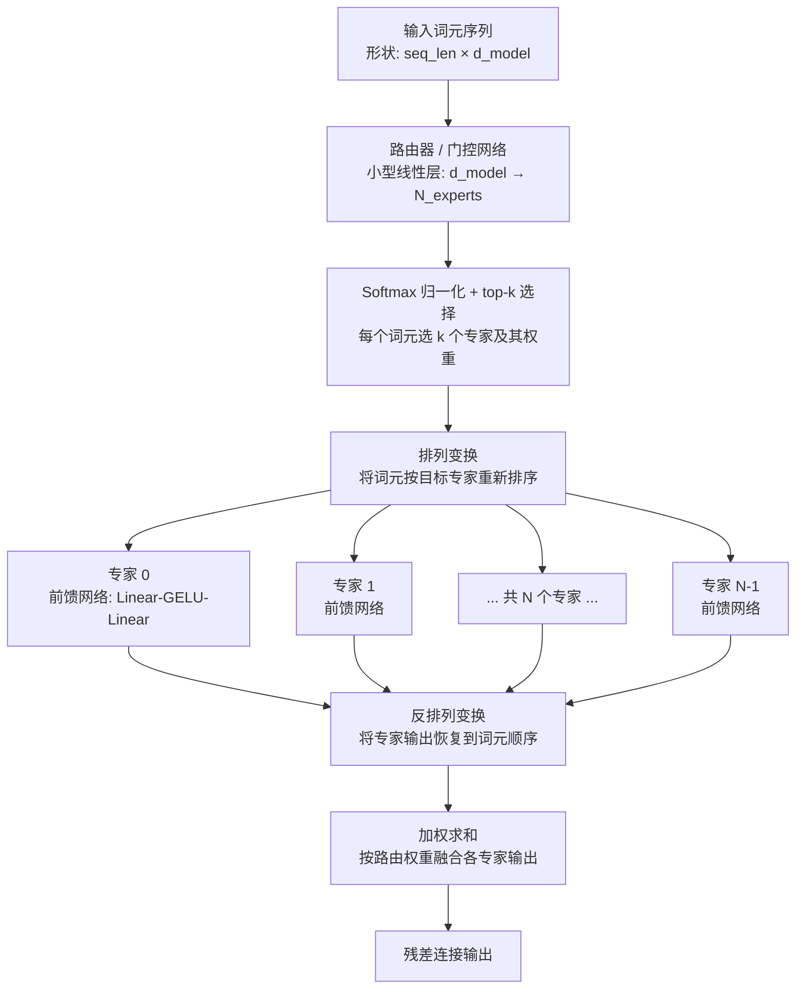
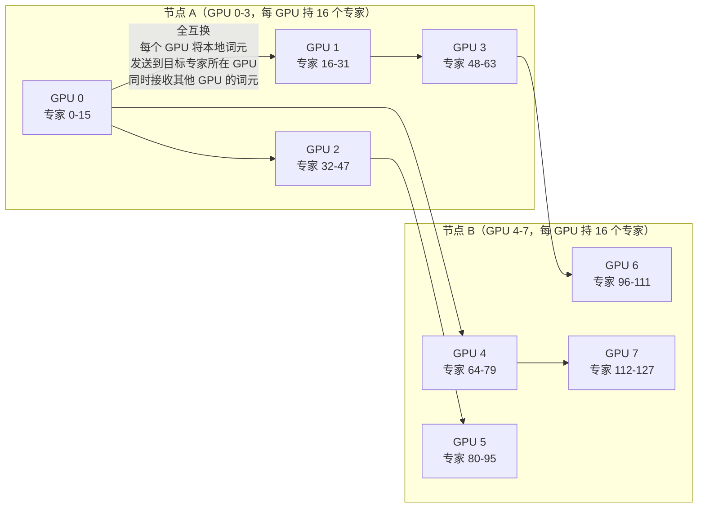
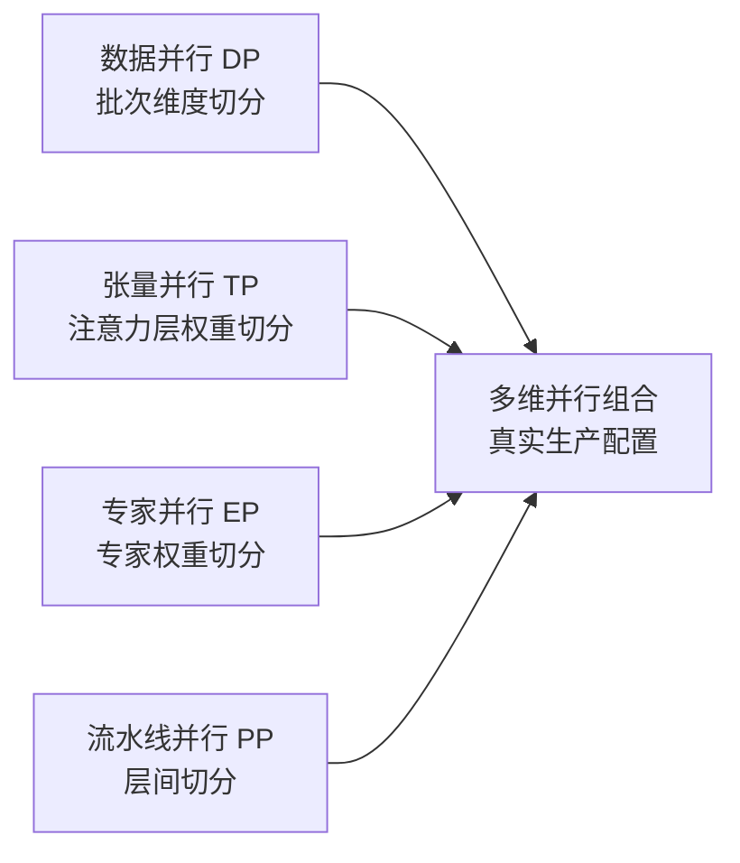

# a01 · MoE 模型与 Expert Parallelism — 训练 + 推理 + 通信瓶颈

> **一句话总结:** 混合专家模型用路由网络把每个词元分发到少量专家子网络处理，激活参数量远小于总参数量，但通信模式从全规约转变为全互换，专家并行是前沿实验室的标配切分维度。

## 1. 是什么 / 为什么有它

混合专家（MoE，Mixture of Experts）是一种将 Transformer 前馈网络层替换为多个并行专家子网络的架构技术。具体做法是将原本单一的前馈网络扩展为 N 个并行专家，每个词元由一个可学习的路由器（router/gate）动态选出 top-k 个专家处理，最终将各专家输出按路由权重加权求和后输出。典型配置为 N=8、N=64 或 N=256，top-k 通常取 2。

混合专家架构的核心价值在于计算稀疏性：每个词元只激活 k/N 的专家，而非全部 N 个，因此实际计算量（激活参数量）远小于模型总参数量。以 Mixtral 8×7B 为例，总参数量约 56B，但每次推理只激活约 12B 参数；DeepSeek-V3 总参数量达 671B，每个词元只激活约 37B 参数。这意味着用同等推理算力可以部署远大于激活参数量的有效模型。

代表性模型覆盖范围广泛：Switch Transformer 是 Google 将 T5 模型扩展为 MoE 的早期探索，每个词元只选 top-1 个专家；GShard 将 MoE 应用于大规模多语言机器翻译，首次在万亿参数规模验证了 MoE 的可行性；Mixtral 8×7B 由 Mistral AI 发布，以开源形式展示了 MoE 在质量和效率上的优势；DeepSeek-V3 是目前已知公开的最大 MoE 模型之一，训练成本极低但效果优异。

对于资深 AI Infra 工程师而言，掌握 MoE 的三个核心原因是：第一，前沿实验室已全面向 MoE 迁移，GPT-4、DeepSeek-V3、Gemini 等顶级模型均采用 MoE 架构，任何大模型训练项目都可能涉及；第二，MoE 的通信瓶颈与稠密模型截然不同，稠密模型靠张量并行的全规约通信，MoE 靠专家并行的全互换通信，后者在大集群上的行为和调优方法完全不同；第三，推理路径的稀疏激活特性要求对 KV 缓存管理、批处理调度、内存分配做专门适配，理解这些机制是正确部署 MoE 模型的基础。

混合专家架构从本质上改变了大模型训练的工程难度边界。早期稠密模型的规模瓶颈主要来自参数量对显存的压力，而 MoE 模型将这一瓶颈转移到通信延迟和路由质量，需要工程团队在存储、计算、通信三个维度同时保持高效。这种多维度的复杂性正是理解 MoE 系统设计的核心挑战所在，也是本章重点剖析的内容。

## 2. 硬件 / 系统视角（微架构 / 拓扑 / 协议）

### 混合专家前向计算全流程

一次完整的 MoE 前向计算包含七个阶段：输入词元向量序列首先经过路由器（一个小型线性层，参数量约为 d_model × N），输出每个词元对每个专家的亲和度分数；经过 softmax 归一化后取 top-k 个专家；然后对词元按目标专家进行排列（permute），将发往同一专家的词元聚合在一起；各专家独立执行前馈计算；最后将结果反排列（unpermute）回原词元顺序，按路由权重加权求和得到最终输出。



### 专家并行通信模式

专家并行（Expert Parallelism，EP）将 N 个专家均分到 G 个 GPU 上，每个 GPU 持有 N/G 个专家。前向计算时，每个 GPU 上的词元需要发送到持有目标专家的 GPU，同时接收来自其他 GPU 发来的词元——这正是全互换（all-to-all）通信的典型模式。



专家并行与张量并行（TP）、数据并行（DP）、流水线并行（PP）四个维度正交。典型的 DeepSeek-V3 生产训练配置为三维并行：注意力层走张量并行，前馈层走专家并行，层级间走流水线并行。数据并行则覆盖在最外层。



### 关键概念与公式

**容量因子**（capacity factor）控制每个专家最多处理多少词元，防止单个专家过载溢出：

```
每专家最大词元数 = (批次总词元数 / 专家数) × 容量因子
```

容量因子通常在训练时取 1.25（允许少量词元溢出被丢弃），推理时取 1.0（不允许丢弃任何词元）。溢出的词元要么被丢弃（token drop），要么传给下一个最优专家处理（no-drop 路由）。

**负载均衡辅助损失**鼓励路由器均匀分配词元到各专家，防止路由退化为只用少数几个热门专家：

```
L_aux = N × Σ_i (f_i × P_i)
```

其中 f_i 是专家 i 实际接收词元数的占比（离散，通过 one-hot 统计），P_i 是路由器对专家 i 的平均软概率输出。两者同时大时损失才大，因此能有效防止既有高路由概率、又实际接收大量词元的情况。

## 3. CUDA / 框架编程接口

混合专家模型的训练框架支持主要集中在以下几个工具和库中，各有侧重。

**Megatron-LM** 是训练大型混合专家模型最主流的开源框架，由 NVIDIA 提供官方维护。核心配置参数覆盖专家数量、专家并行度、路由策略和辅助损失权重：

```bash
torchrun --nproc-per-node=8 pretrain_gpt.py \
  --num-experts 64 \
  --moe-expert-model-parallel-size 8 \
  --moe-router-topk 2 \
  --moe-aux-loss-coeff 0.01 \
  --moe-token-dispatcher-type alltoall \
  --moe-grouped-gemm
```

其中 `--moe-grouped-gemm` 启用分组矩阵乘法内核，将多个专家的矩阵乘法打包到一次内核调用，大幅减少内核启动开销。`--moe-token-dispatcher-type alltoall` 指定使用全互换通信调度词元，是大规模训练的标准选择。

**DeepSpeed-MoE** 提供独立的混合专家层实现，接口更简洁，适合中等规模实验：

```python
import deepspeed.moe.layer as moe_layer

expert_ffn = torch.nn.Linear(hidden_size, hidden_size * 4)
moe_layer = moe_layer.MoE(
    hidden_size=hidden_size,
    expert=expert_ffn,
    num_experts=num_experts_per_gpu,
    k=2,
    capacity_factor=1.25,
    eval_capacity_factor=1.0,
    min_capacity=4,
)
output, l_aux, _ = moe_layer(hidden_states)
```

**DeepEP**（DeepSeek 开源的专家并行通信库）是目前性能最优的全互换通信实现，专门针对 H800/H100 集群上的混合专家通信做了深度优化：

```python
from deep_ep import Buffer

buf = Buffer(group=ep_group, int_max=128, float_max=4096)
# 分发词元到目标专家所在 GPU
output, recv_count, handle, event = buf.dispatch(
    hidden_states,
    topk_idx=router_topk_idx,
    topk_weights=router_topk_weights,
    num_experts=num_experts,
    async_finish=True,
)
event.current_stream_wait_event()
expert_out = local_experts(output)
# 将专家计算结果合并回原词元顺序
final_out = buf.combine(expert_out, handle=handle, async_finish=False)
```

**Megablocks**（MIT DAIL 开源）用散射-聚集内核替代标准的全互换通信，在词元分布不均匀时效率更高，适合 token drop 率高的训练早期阶段。

**Tutel**（微软开源）提供自适应路由和动态容量因子调整，以及层次化全互换（先节点内聚合再跨节点），适合超大规模分布式场景。

在选择框架时，Megatron-LM 适合从头训练的大规模 MoE 项目，代码成熟且与 NVIDIA 硬件深度优化；DeepSpeed-MoE 适合在已有 DeepSpeed 基础设施上快速集成 MoE 层；DeepEP 适合需要极致通信性能的场景，可与 Megatron-LM 配合使用；Megablocks 适合词元分布高度不均匀、稀疏性强的实验性架构。这四者并不互斥，DeepEP + Megatron-LM 是目前生产环境中最常见的组合。

## 4. 关键性能指标

### 生产实测数据

DeepSeek-V3 技术报告中记录了在 2048 块 H100 上训练 671B MoE 模型的关键数字：模型浮点利用率（MFU）约为 50%，这一数值在 MoE 模型中已属优秀，因为全互换通信本身会消耗大量时间片。相比之下，稠密模型在同等集群上 MFU 通常在 40-50% 区间，MoE 模型在激活参数相同前提下训练效率更高。

Mixtral 8×7B 推理场景中，单块 H100 使用 vLLM 的 MoE 优化内核，典型推理吞吐约为每请求每秒 80 个词元，与激活参数规模相当的稠密 12B 模型相比吞吐相当，但可利用的有效知识容量更大。

全互换通信开销是混合专家模型的主要性能瓶颈。生产实测数据显示，全互换通信在整个训练步骤时间中占比 30-40%，远高于稠密模型中张量并行全规约的 10-15%。以 DeepSeek-V3 配置（d_model=7168，批次词元数=4096）估算，单步全互换通信量约 4.6 GB（BF16），在 H800 集群 IB 链路上需要约 90 毫秒，这是必须通过计算-通信重叠来隐藏的关键延迟。

容量因子对训练效果有显著影响。Switch Transformer 论文的实验表明，容量因子为 1.25 时词元丢弃率低于 1%，对模型质量影响可忽略；容量因子降到 1.0 时路由灵活性降低，可能加剧负载不均衡；容量因子升到 2.0 时词元几乎不丢失，但每个专家需要分配两倍显存缓冲区。

DeepEP 相较于标准 NCCL 全互换通信的性能提升：在 H800 集群上，小消息场景（每专家词元数少）提速约 3 倍，大消息场景（词元分配均匀）提速约 1.3 倍。差异来源在于 DeepEP 使用低级 RDMA/NVLink 原语发送变长消息，避免了 NCCL 为对齐消息大小而产生的填充开销。

### 通信量对比

| 模型类型 | 主要通信原语 | 通信占步骤时间比 |
|---|---|---|
| 稠密 Transformer（张量并行） | 全规约（allreduce） | 10-15% |
| 混合专家 Transformer（专家并行） | 全互换（all-to-all） | 30-40% |

### 显存与计算效率的权衡

混合专家模型的显存占用方式与稠密模型存在本质差异。稠密模型每个 GPU 存储完整的模型参数副本（在数据并行下）或部分层参数（在流水线并行下）；而混合专家模型中，非专家参数（注意力层、归一化层等）在所有 GPU 上都存在副本，只有专家参数通过 EP 维度切分，每个 GPU 只存储 1/EP 的专家权重。这一特性意味着增大专家数（在固定 EP 度下）不会增加每个 GPU 的专家参数显存，但会增大路由器参数和全互换通信的消息数量。

实际训练中，混合专家模型还面临梯度更新不均匀的问题。路由器是软选择（经过 softmax），梯度可以流通，但未被选中的专家权重在该步骤不接收词元、不产生输出，其梯度仅来自辅助损失。若辅助损失权重过小，部分专家长期处于低激活状态，导致这些专家的权重更新极其缓慢，形成"僵尸专家"现象。监控每个专家的激活频率分布是训练过程中的必要指标。

## 5. 代码示例

```python
# ── 路由器实现（含负载均衡辅助损失） ───────────────────────────────
import torch
import torch.nn.functional as F

class MoERouter(torch.nn.Module):
    def __init__(self, d_model: int, num_experts: int, top_k: int = 2):
        super().__init__()
        self.gate = torch.nn.Linear(d_model, num_experts, bias=False)
        self.num_experts = num_experts
        self.top_k = top_k

    def forward(self, x: torch.Tensor):
        # x 形状: [词元数 T, d_model]
        logits = self.gate(x)                            # [T, E]
        probs = F.softmax(logits, dim=-1)                # [T, E]
        topk_weights, topk_idx = probs.topk(self.top_k, dim=-1)
        # 对选中的 top-k 权重归一化，使之和为 1
        topk_weights = topk_weights / topk_weights.sum(dim=-1, keepdim=True)

        # 辅助损失：鼓励路由均衡
        one_hot = F.one_hot(topk_idx, self.num_experts).float()  # [T, k, E]
        expert_counts = one_hot.sum(dim=1).mean(dim=0)           # [E]
        f = expert_counts / expert_counts.sum()                   # 实际分配比例
        P = probs.mean(dim=0)                                     # 平均路由概率
        aux_loss = self.num_experts * (f * P).sum()

        return topk_weights, topk_idx, aux_loss
```

```python
# ── DeepEP dispatch + combine 完整调用示例 ────────────────────────
from deep_ep import Buffer
import torch.distributed as dist

ep_group = dist.new_group(ranks=list(range(ep_size)))
buf = Buffer(group=ep_group, int_max=num_tokens, float_max=d_model * top_k)

# 前向：将本地词元分发到目标专家所在 GPU
out, recv_counts, handle, event = buf.dispatch(
    hidden_states,           # [本地词元数, d_model]
    topk_idx=topk_idx,       # [本地词元数, top_k]
    topk_weights=topk_weights,
    num_experts=num_experts,
    async_finish=True,       # 异步完成，允许与专家计算重叠
)
event.current_stream_wait_event()

# 专家计算（此时前一步全互换通信可以与此重叠）
expert_out = local_expert_ffn(out)

# 将专家计算结果合并回原词元顺序
final_out = buf.combine(expert_out, handle=handle, async_finish=False)
```

```python
# ── Megatron-LM MoE 分组矩阵乘（grouped GEMM）调用路径 ───────────
# 位于 megatron/core/transformer/moe/grouped_gemm_util.py
# 原理：将多个专家的输入张量打包成一个大矩阵，调用单次 CUTLASS grouped GEMM
# 避免了为每个专家单独启动一个 GEMM kernel 的开销（N 个 expert → N 次 launch）
```

## 6. 实测手段

排查混合专家性能问题需要同时关注通信效率、路由质量和专家利用率三个维度，以下工具和方法分别对应这三个层面。

**Nsight Systems 分析计算-通信重叠率** 是排查混合专家性能问题的第一步工具。运行以下命令采集时间线：

```bash
nsys profile -t cuda,nvtx,nccl,mpi \
  -o moe_profile --force-overwrite true \
  python train_moe.py --profile-steps 5:10
```

在 Nsight Systems 的 CUDA 时间线上，应该看到 NCCL 全互换内核（`ncclAlltoAll*`）与专家前馈计算（GEMM 内核）存在明显的时间重叠区间。若两者完全串行，说明 DeepEP 的 `async_finish=True` 参数未生效，或缺少 CUDA 事件同步点，应检查 `event.current_stream_wait_event()` 调用位置。

**专家负载分布监控** — Megatron-LM 在每个训练步骤会统计每个专家接收的词元数，通过 TensorBoard 或 MLflow 可以实时观察负载均衡状态。若某专家持续接收超过平均量 5 倍以上的词元，说明路由退化，应检查辅助损失是否正确计入总损失，以及权重系数是否在有效范围内。

**NVLink 流量监控** — 混合专家训练的节点内全互换通信通常会使 NVLink 带宽接近饱和，可通过以下命令监控：

```bash
# 实时监控每条 NVLink 链路的传输字节数
nvidia-smi nvlink --status -i 0
nvidia-smi nvlink -gt c -i 0   # 查看累计传输计数器
```

若 NVLink 利用率明显低于 H100 的 900 GB/s 理论上限（双向），可能是 EP 分组配置错误或 GPU 间亲和性不匹配。

**NCCL 调试日志** — 设置环境变量 `NCCL_DEBUG=INFO` 可以输出 NCCL 选择的传输后端（NVLink/IB/Socket）以及每次全互换通信的消息大小，辅助判断通信是否走了低效路径。若发现 NCCL 回落到 Socket 传输（TCP），应立即检查 InfiniBand 驱动状态和 GDR 配置。

**性能指标汇总对比** — 评估混合专家训练效率时，应对比以下关键指标：全互换通信时间占步骤总时间的比例（目标 < 35%）、专家负载均衡系数（理想值接近 1.0，标准差 < 0.2）、词元丢弃率（推理应为 0，训练 < 1%）、GPU 显存利用率（专家参数 + 激活 + KV 缓存 + 梯度缓冲区的总和应控制在 90% 以内）。这四个指标能够综合反映混合专家模型训练的健康状态。

## 7. 常见反模式

**反模式一：容量因子在推理和训练中混用**

训练时设置容量因子为 1.25 允许少量词元溢出，这在训练过程中可以接受，溢出词元的梯度损失很小。但推理时如果仍然使用 1.25，当某个专家负载超过容量时，属于用户请求的词元会被静默丢弃，导致生成质量下降而无任何错误提示。线上推理服务应将容量因子设为 1.0，或改用不丢弃词元的路由策略（如 DeepSeek 的辅助无损路由，通过动态调整容量来保证不丢弃）。

**反模式二：辅助损失权重设为零**

很多工程师在初步实验时关闭辅助损失（将系数设为 0），希望路由器自由探索。但实践中，路由器在没有均衡约束的情况下会在训练早期迅速退化为只将所有词元路由到两三个专家，其余专家几乎不被激活。这不仅浪费了绝大多数专家的计算资源，还导致未激活专家的参数得不到有效更新，最终模型质量远低于预期。辅助损失权重推荐初始值为 0.01，根据专家负载分布监控动态调整，通常在 0.001 到 0.05 之间。

**反模式三：专家并行度与专家数量不能整除**

若总专家数为 60，专家并行度（EP）为 8，则每个 GPU 持有 7.5 个专家，无法整除。框架通常会向上取整为 8，每个 GPU 分配 8 个专家槽，实际只用 7 个，空槽参与填充计算。这导致约 1/8=12.5% 的计算和显存浪费。规划 MoE 架构时，应将专家数量设置为 EP 度的整数倍，常见选择为 EP=8 时专家数取 64 或 128。

**反模式四：使用原生 NCCL 全互换而不上 DeepEP**

NCCL 的通用全互换通信对混合专家场景的不均匀消息大小没有专门优化——NCCL 需要在发送前确定每个目标 GPU 的消息大小，并对所有槽位填充到相同大小，这在词元分布不均匀时产生大量无效填充。DeepEP 利用低级 RDMA/NVLink 原语发送真实变长消息，小消息场景节省约三分之二的通信时间。在 H800/H100 集群上生产部署混合专家模型，不使用 DeepEP 是显著的性能欠账。

**反模式五：混合专家训练叠加 ZeRO-3**

混合专家训练中，专家权重已经通过 EP 维度切分到各 GPU（每个 GPU 只存储 N/EP 个专家的权重），再叠加 ZeRO-3 会对同一参数再次做全收集/规约分散操作，对专家权重进行冗余通信。正确做法是对专家权重只做 EP 维度切分，非专家部分（注意力层等）可以使用 ZeRO-1 或 ZeRO-2 切分优化器状态，避免对专家参数的重复通信。

**反模式六：未利用计算-通信重叠**

专家计算（矩阵乘法）和全互换通信（词元分发/合并）之间存在天然的流水线机会：当本轮专家计算进行时，下一轮或同一轮的全互换通信可以在独立的 CUDA 流上同步执行。若未配置 `async_finish=True` 或在 dispatch 调用后立即等待，两者串行执行，吞吐降低 20-30%。DeepEP 提供的 `async_finish` 参数以及 CUDA 事件同步机制是实现重叠的标准手段。

**反模式七：专家数量设置过多**

专家数量并非越多越好。专家数超过 256 后，路由器本身的 softmax 和 top-k 运算开销上升，每个专家平均接收的词元数减少（消息变小，全互换效率下降），同时路由决策空间增大导致负载均衡更难维持。DeepSeek-V3 选择 256 个细粒度专家（每层 256 个专家，top-2 选择）是经过大量实验权衡的设计点，普通项目建议从 8 或 64 个专家开始验证，确认路由质量后再考虑扩展。

## 8. 延伸阅读

```
Mixtral 8×7B 技术报告：
  arxiv.org/abs/2401.04088

DeepSeek-V3 技术报告（含专家并行详细设计）：
  arxiv.org/abs/2412.19437

Switch Transformer（top-1 路由 + 容量因子原始论文）：
  arxiv.org/abs/2101.03961

GShard（万亿参数多语言 MoE + top-2 路由）：
  arxiv.org/abs/2006.16668

DeepEP 专家并行通信库（DeepSeek 开源）：
  github.com/deepseek-ai/DeepEP

Megablocks 稀疏 MoE 内核（数据块稀疏矩阵乘）：
  github.com/databricks/megablocks
  arxiv.org/abs/2211.15841

Tutel 自适应混合专家（微软，动态容量 + 层次化全互换）：
  github.com/microsoft/tutel
  arxiv.org/abs/2206.03382

Megatron-LM MoE 实现（源码位置）：
  github.com/NVIDIA/Megatron-LM
  路径: megatron/core/transformer/moe/

vLLM MoE 推理优化（FP8 + grouped GEMM）：
  github.com/vllm-project/vllm
  路径: vllm/model_executor/layers/fused_moe/
```
